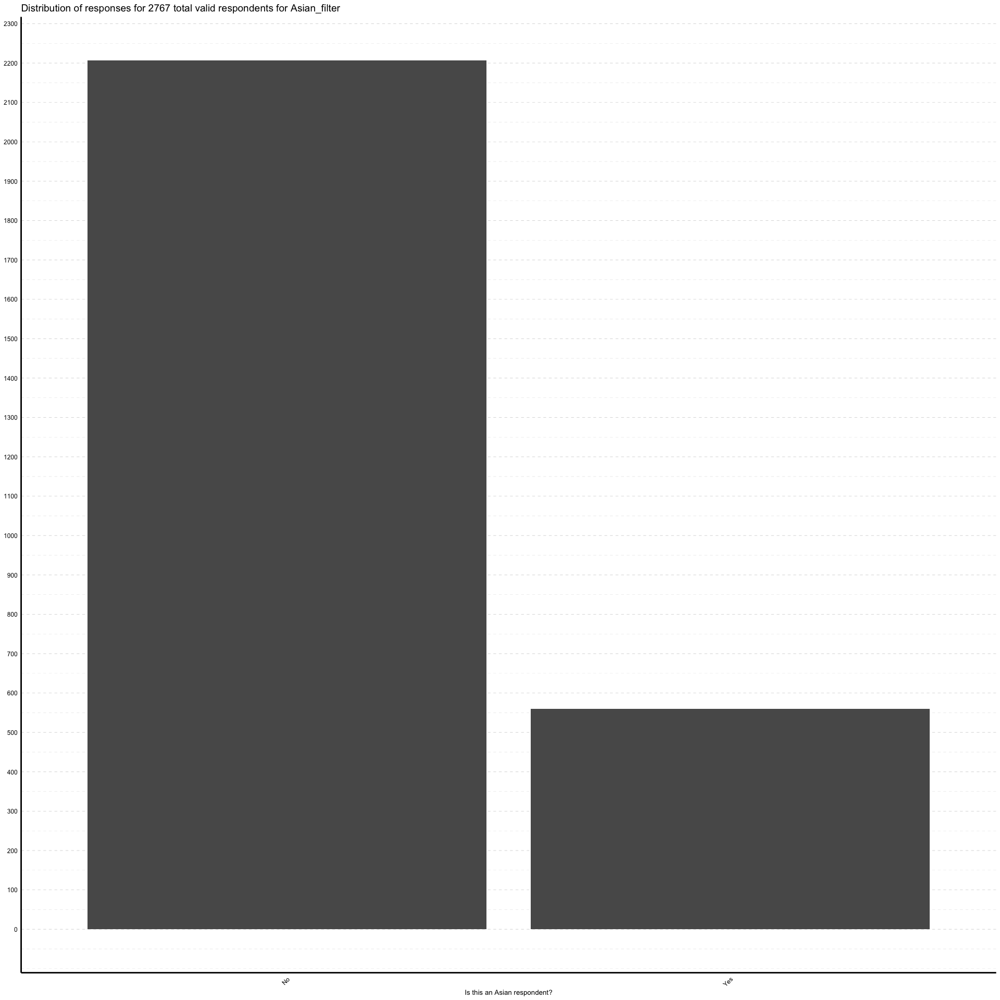
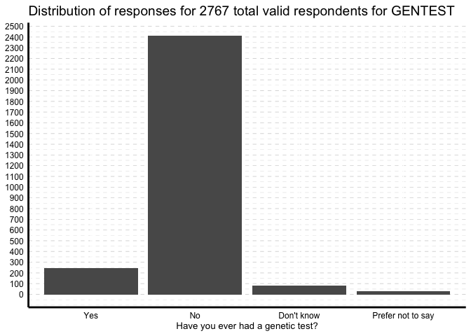
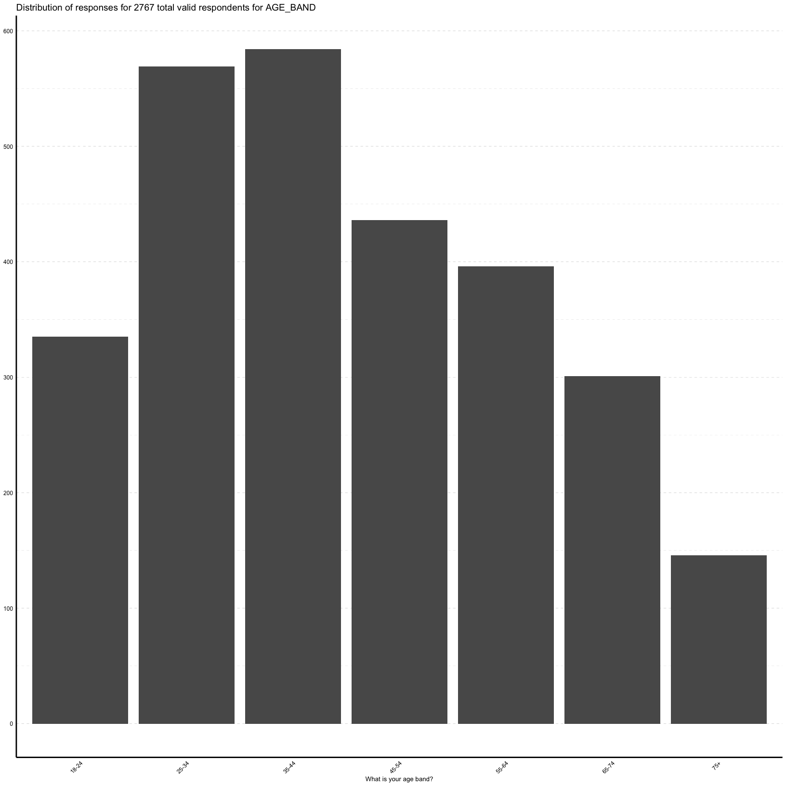

# set up

## Environment


```
##         ./functions/frequency_and_plot.R ./functions/is.labelled.R
## value   ?                                ?                        
## visible FALSE                            FALSE                    
##         ./functions/load_package.R
## value   ?                         
## visible FALSE
```

```
## 
## Attaching package: 'psych'
```

```
## The following objects are masked from 'package:ggplot2':
## 
##     %+%, alpha
```

```
## 
## Attaching package: 'haven'
```

```
## The following object is masked _by_ '.GlobalEnv':
## 
##     is.labelled
```

```
## Loading required package: maditr
```

```
## 
## To modify variables or add new variables:
##              let(mtcars, new_var = 42, new_var2 = new_var*hp) %>% head()
```

```
## 
## Attaching package: 'maditr'
```

```
## The following object is masked from 'package:readr':
## 
##     cols
```

```
## The following object is masked from 'package:skimr':
## 
##     to_long
```

```
## The following object is masked from 'package:purrr':
## 
##     transpose
```

```
## 
## Use 'expss_output_rnotebook()' to display tables inside R Notebooks.
##  To return to the console output, use 'expss_output_default()'.
```

```
## 
## Attaching package: 'expss'
```

```
## The following object is masked _by_ '.GlobalEnv':
## 
##     is.labelled
```

```
## The following objects are masked from 'package:haven':
## 
##     is.labelled, read_spss
```

```
## The following object is masked from 'package:skimr':
## 
##     contains
```

```
## The following objects are masked from 'package:purrr':
## 
##     keep, modify, modify_if, when
```

```
## The following objects are masked from 'package:gtsummary':
## 
##     contains, vars
```

```
## The following object is masked from 'package:ggplot2':
## 
##     vars
```

```
## 
## Attaching package: 'stringr'
```

```
## The following objects are masked from 'package:expss':
## 
##     fixed, regex
```

```
## 
## Attaching package: 'dplyr'
```

```
## The following objects are masked from 'package:expss':
## 
##     compute, contains, na_if, recode, vars
```

```
## The following objects are masked from 'package:maditr':
## 
##     between, coalesce, first, last
```

```
## The following object is masked from 'package:kableExtra':
## 
##     group_rows
```

```
## The following objects are masked from 'package:stats':
## 
##     filter, lag
```

```
## The following objects are masked from 'package:base':
## 
##     intersect, setdiff, setequal, union
```

```
## 
## Attaching package: 'tidyr'
```

```
## The following objects are masked from 'package:expss':
## 
##     contains, nest
```

```
## [1] "This project uses the following packages:"
```

```
## $ggplot2
## [1] 3 3 5
## 
## $gtsummary
## [1] 1 5 0
## 
## $kableExtra
## [1] 1 3 4
## 
## $purrr
## [1] 0 3 4
## 
## $skimr
## [1] 2 1 3
## 
## $readr
## [1] 2 0 2
## 
## $readxl
## [1] 1 3 1
## 
## $psych
## [1] 2 1 9
## 
## $haven
## [1] 2 4 3
## 
## $expss
## [1]  0 11  1
## 
## $summarytools
## [1] 1 0 1
## 
## $stringr
## [1] 1 4 0
## 
## $dplyr
## [1] 1 0 7
## 
## $tidyr
## [1] 1 1 4
```

Set up ggplot theme for the plots


```r
theme_personal <-  function(){theme(
    text = element_text(color = "black"),
    title = element_text(size = 12),
    axis.title = element_text(color = "black",
                              size = 10),
    axis.text = element_text(color = "black",
                             size=9),
    axis.title.y = element_blank(), 
    axis.line = element_line(colour = "black", 
                      size = 1, linetype = "solid"),
    legend.background = element_blank(),
    legend.box.background = element_blank(),
    panel.background = element_blank(), 
    panel.grid.minor.y = element_line(
      colour = "gray",
      linetype = "dashed",
      size = 0.1
      ),
    panel.grid.major.y = element_line(
      colour = "gray",
      linetype = "dashed",
      size = 0.2
      ),
    axis.ticks = element_blank()
    )}
```
# read in raw data


```r
#import data
df <- read_sav("/Users/kirstinpurves/Library/CloudStorage/OneDrive-SharedLibraries-OurFutureHealth/Main Share - Documents/Our Future Health - Project Team/Behavioural Science/Public attitudes survey 2021/Raw data DO NOT EDIT/262323129-40C_Our Future Health_Dataset_FINAL.sav")
```

skim the data for missingness, completeness and unique values


```r
skim(df)
```


<table style='width: auto;'
        class='table table-condensed'>
<caption>Data summary</caption>
 <thead>
  <tr>
   <th style="text-align:left;">   </th>
   <th style="text-align:left;">   </th>
  </tr>
 </thead>
<tbody>
  <tr>
   <td style="text-align:left;"> Name </td>
   <td style="text-align:left;"> df </td>
  </tr>
  <tr>
   <td style="text-align:left;"> Number of rows </td>
   <td style="text-align:left;"> 2767 </td>
  </tr>
  <tr>
   <td style="text-align:left;"> Number of columns </td>
   <td style="text-align:left;"> 157 </td>
  </tr>
  <tr>
   <td style="text-align:left;"> _______________________ </td>
   <td style="text-align:left;">  </td>
  </tr>
  <tr>
   <td style="text-align:left;"> Column type frequency: </td>
   <td style="text-align:left;">  </td>
  </tr>
  <tr>
   <td style="text-align:left;"> character </td>
   <td style="text-align:left;"> 145 </td>
  </tr>
  <tr>
   <td style="text-align:left;"> Date </td>
   <td style="text-align:left;"> 1 </td>
  </tr>
  <tr>
   <td style="text-align:left;"> numeric </td>
   <td style="text-align:left;"> 9 </td>
  </tr>
  <tr>
   <td style="text-align:left;"> POSIXct </td>
   <td style="text-align:left;"> 2 </td>
  </tr>
  <tr>
   <td style="text-align:left;"> ________________________ </td>
   <td style="text-align:left;">  </td>
  </tr>
  <tr>
   <td style="text-align:left;"> Group variables </td>
   <td style="text-align:left;"> None </td>
  </tr>
</tbody>
</table>


**Variable type: character**

<table>
 <thead>
  <tr>
   <th style="text-align:left;"> skim_variable </th>
   <th style="text-align:right;"> n_missing </th>
   <th style="text-align:right;"> complete_rate </th>
   <th style="text-align:right;"> min </th>
   <th style="text-align:right;"> max </th>
   <th style="text-align:right;"> empty </th>
   <th style="text-align:right;"> n_unique </th>
   <th style="text-align:right;"> whitespace </th>
  </tr>
 </thead>
<tbody>
  <tr>
   <td style="text-align:left;"> PV16_Mode </td>
   <td style="text-align:right;"> 313 </td>
   <td style="text-align:right;"> 0.89 </td>
   <td style="text-align:right;"> 1 </td>
   <td style="text-align:right;"> 1 </td>
   <td style="text-align:right;"> 0 </td>
   <td style="text-align:right;"> 2 </td>
   <td style="text-align:right;"> 0 </td>
  </tr>
  <tr>
   <td style="text-align:left;"> PV16_SampleSource </td>
   <td style="text-align:right;"> 0 </td>
   <td style="text-align:right;"> 1.00 </td>
   <td style="text-align:right;"> 1 </td>
   <td style="text-align:right;"> 1 </td>
   <td style="text-align:right;"> 0 </td>
   <td style="text-align:right;"> 2 </td>
   <td style="text-align:right;"> 0 </td>
  </tr>
  <tr>
   <td style="text-align:left;"> Black_filter </td>
   <td style="text-align:right;"> 0 </td>
   <td style="text-align:right;"> 1.00 </td>
   <td style="text-align:right;"> 1 </td>
   <td style="text-align:right;"> 1 </td>
   <td style="text-align:right;"> 0 </td>
   <td style="text-align:right;"> 2 </td>
   <td style="text-align:right;"> 0 </td>
  </tr>
  <tr>
   <td style="text-align:left;"> Asian_filter </td>
   <td style="text-align:right;"> 0 </td>
   <td style="text-align:right;"> 1.00 </td>
   <td style="text-align:right;"> 1 </td>
   <td style="text-align:right;"> 1 </td>
   <td style="text-align:right;"> 0 </td>
   <td style="text-align:right;"> 2 </td>
   <td style="text-align:right;"> 0 </td>
  </tr>
  <tr>
   <td style="text-align:left;"> AGE_BAND </td>
   <td style="text-align:right;"> 0 </td>
   <td style="text-align:right;"> 1.00 </td>
   <td style="text-align:right;"> 1 </td>
   <td style="text-align:right;"> 1 </td>
   <td style="text-align:right;"> 0 </td>
   <td style="text-align:right;"> 7 </td>
   <td style="text-align:right;"> 0 </td>
  </tr>
  <tr>
   <td style="text-align:left;"> SEX </td>
   <td style="text-align:right;"> 0 </td>
   <td style="text-align:right;"> 1.00 </td>
   <td style="text-align:right;"> 1 </td>
   <td style="text-align:right;"> 2 </td>
   <td style="text-align:right;"> 0 </td>
   <td style="text-align:right;"> 4 </td>
   <td style="text-align:right;"> 0 </td>
  </tr>
  <tr>
   <td style="text-align:left;"> ETHNICITY </td>
   <td style="text-align:right;"> 0 </td>
   <td style="text-align:right;"> 1.00 </td>
   <td style="text-align:right;"> 1 </td>
   <td style="text-align:right;"> 2 </td>
   <td style="text-align:right;"> 0 </td>
   <td style="text-align:right;"> 14 </td>
   <td style="text-align:right;"> 0 </td>
  </tr>
  <tr>
   <td style="text-align:left;"> ETHNICITY_LFS </td>
   <td style="text-align:right;"> 0 </td>
   <td style="text-align:right;"> 1.00 </td>
   <td style="text-align:right;"> 1 </td>
   <td style="text-align:right;"> 2 </td>
   <td style="text-align:right;"> 0 </td>
   <td style="text-align:right;"> 10 </td>
   <td style="text-align:right;"> 0 </td>
  </tr>
  <tr>
   <td style="text-align:left;"> NUMPEOPLE </td>
   <td style="text-align:right;"> 0 </td>
   <td style="text-align:right;"> 1.00 </td>
   <td style="text-align:right;"> 1 </td>
   <td style="text-align:right;"> 2 </td>
   <td style="text-align:right;"> 0 </td>
   <td style="text-align:right;"> 12 </td>
   <td style="text-align:right;"> 0 </td>
  </tr>
  <tr>
   <td style="text-align:left;"> NUMADULTS </td>
   <td style="text-align:right;"> 0 </td>
   <td style="text-align:right;"> 1.00 </td>
   <td style="text-align:right;"> 1 </td>
   <td style="text-align:right;"> 2 </td>
   <td style="text-align:right;"> 0 </td>
   <td style="text-align:right;"> 11 </td>
   <td style="text-align:right;"> 0 </td>
  </tr>
  <tr>
   <td style="text-align:left;"> NUMCHILDU16 </td>
   <td style="text-align:right;"> 0 </td>
   <td style="text-align:right;"> 1.00 </td>
   <td style="text-align:right;"> 1 </td>
   <td style="text-align:right;"> 2 </td>
   <td style="text-align:right;"> 0 </td>
   <td style="text-align:right;"> 8 </td>
   <td style="text-align:right;"> 0 </td>
  </tr>
  <tr>
   <td style="text-align:left;"> COHAB </td>
   <td style="text-align:right;"> 0 </td>
   <td style="text-align:right;"> 1.00 </td>
   <td style="text-align:right;"> 1 </td>
   <td style="text-align:right;"> 2 </td>
   <td style="text-align:right;"> 0 </td>
   <td style="text-align:right;"> 6 </td>
   <td style="text-align:right;"> 0 </td>
  </tr>
  <tr>
   <td style="text-align:left;"> COHAB_BINARY </td>
   <td style="text-align:right;"> 0 </td>
   <td style="text-align:right;"> 1.00 </td>
   <td style="text-align:right;"> 1 </td>
   <td style="text-align:right;"> 2 </td>
   <td style="text-align:right;"> 0 </td>
   <td style="text-align:right;"> 3 </td>
   <td style="text-align:right;"> 0 </td>
  </tr>
  <tr>
   <td style="text-align:left;"> MARSTAT </td>
   <td style="text-align:right;"> 0 </td>
   <td style="text-align:right;"> 1.00 </td>
   <td style="text-align:right;"> 1 </td>
   <td style="text-align:right;"> 2 </td>
   <td style="text-align:right;"> 0 </td>
   <td style="text-align:right;"> 4 </td>
   <td style="text-align:right;"> 0 </td>
  </tr>
  <tr>
   <td style="text-align:left;"> CHILDHERE </td>
   <td style="text-align:right;"> 0 </td>
   <td style="text-align:right;"> 1.00 </td>
   <td style="text-align:right;"> 1 </td>
   <td style="text-align:right;"> 2 </td>
   <td style="text-align:right;"> 0 </td>
   <td style="text-align:right;"> 3 </td>
   <td style="text-align:right;"> 0 </td>
  </tr>
  <tr>
   <td style="text-align:left;"> NumOwnChildrenU16HH </td>
   <td style="text-align:right;"> 0 </td>
   <td style="text-align:right;"> 1.00 </td>
   <td style="text-align:right;"> 1 </td>
   <td style="text-align:right;"> 2 </td>
   <td style="text-align:right;"> 0 </td>
   <td style="text-align:right;"> 7 </td>
   <td style="text-align:right;"> 0 </td>
  </tr>
  <tr>
   <td style="text-align:left;"> OwnChildU16OutsideHH </td>
   <td style="text-align:right;"> 0 </td>
   <td style="text-align:right;"> 1.00 </td>
   <td style="text-align:right;"> 1 </td>
   <td style="text-align:right;"> 2 </td>
   <td style="text-align:right;"> 0 </td>
   <td style="text-align:right;"> 3 </td>
   <td style="text-align:right;"> 0 </td>
  </tr>
  <tr>
   <td style="text-align:left;"> HHSTRUCTURE </td>
   <td style="text-align:right;"> 0 </td>
   <td style="text-align:right;"> 1.00 </td>
   <td style="text-align:right;"> 1 </td>
   <td style="text-align:right;"> 2 </td>
   <td style="text-align:right;"> 0 </td>
   <td style="text-align:right;"> 7 </td>
   <td style="text-align:right;"> 0 </td>
  </tr>
  <tr>
   <td style="text-align:left;"> PLACEINHH </td>
   <td style="text-align:right;"> 0 </td>
   <td style="text-align:right;"> 1.00 </td>
   <td style="text-align:right;"> 1 </td>
   <td style="text-align:right;"> 2 </td>
   <td style="text-align:right;"> 0 </td>
   <td style="text-align:right;"> 6 </td>
   <td style="text-align:right;"> 0 </td>
  </tr>
  <tr>
   <td style="text-align:left;"> INTERNET </td>
   <td style="text-align:right;"> 0 </td>
   <td style="text-align:right;"> 1.00 </td>
   <td style="text-align:right;"> 1 </td>
   <td style="text-align:right;"> 1 </td>
   <td style="text-align:right;"> 0 </td>
   <td style="text-align:right;"> 5 </td>
   <td style="text-align:right;"> 0 </td>
  </tr>
  <tr>
   <td style="text-align:left;"> DEVICE_SMRTPHNE </td>
   <td style="text-align:right;"> 0 </td>
   <td style="text-align:right;"> 1.00 </td>
   <td style="text-align:right;"> 1 </td>
   <td style="text-align:right;"> 1 </td>
   <td style="text-align:right;"> 0 </td>
   <td style="text-align:right;"> 2 </td>
   <td style="text-align:right;"> 0 </td>
  </tr>
  <tr>
   <td style="text-align:left;"> DEVICE_MOBILE </td>
   <td style="text-align:right;"> 0 </td>
   <td style="text-align:right;"> 1.00 </td>
   <td style="text-align:right;"> 1 </td>
   <td style="text-align:right;"> 1 </td>
   <td style="text-align:right;"> 0 </td>
   <td style="text-align:right;"> 2 </td>
   <td style="text-align:right;"> 0 </td>
  </tr>
  <tr>
   <td style="text-align:left;"> DEVICE_LANDLINE </td>
   <td style="text-align:right;"> 0 </td>
   <td style="text-align:right;"> 1.00 </td>
   <td style="text-align:right;"> 1 </td>
   <td style="text-align:right;"> 1 </td>
   <td style="text-align:right;"> 0 </td>
   <td style="text-align:right;"> 2 </td>
   <td style="text-align:right;"> 0 </td>
  </tr>
  <tr>
   <td style="text-align:left;"> DEVICE_TABLET </td>
   <td style="text-align:right;"> 0 </td>
   <td style="text-align:right;"> 1.00 </td>
   <td style="text-align:right;"> 1 </td>
   <td style="text-align:right;"> 1 </td>
   <td style="text-align:right;"> 0 </td>
   <td style="text-align:right;"> 2 </td>
   <td style="text-align:right;"> 0 </td>
  </tr>
  <tr>
   <td style="text-align:left;"> DEVICE_CPU </td>
   <td style="text-align:right;"> 0 </td>
   <td style="text-align:right;"> 1.00 </td>
   <td style="text-align:right;"> 1 </td>
   <td style="text-align:right;"> 1 </td>
   <td style="text-align:right;"> 0 </td>
   <td style="text-align:right;"> 2 </td>
   <td style="text-align:right;"> 0 </td>
  </tr>
  <tr>
   <td style="text-align:left;"> DEVICE_SMRTTV </td>
   <td style="text-align:right;"> 0 </td>
   <td style="text-align:right;"> 1.00 </td>
   <td style="text-align:right;"> 1 </td>
   <td style="text-align:right;"> 1 </td>
   <td style="text-align:right;"> 0 </td>
   <td style="text-align:right;"> 2 </td>
   <td style="text-align:right;"> 0 </td>
  </tr>
  <tr>
   <td style="text-align:left;"> DEVICE_GAME </td>
   <td style="text-align:right;"> 0 </td>
   <td style="text-align:right;"> 1.00 </td>
   <td style="text-align:right;"> 1 </td>
   <td style="text-align:right;"> 1 </td>
   <td style="text-align:right;"> 0 </td>
   <td style="text-align:right;"> 2 </td>
   <td style="text-align:right;"> 0 </td>
  </tr>
  <tr>
   <td style="text-align:left;"> DEVICE_STREAM </td>
   <td style="text-align:right;"> 0 </td>
   <td style="text-align:right;"> 1.00 </td>
   <td style="text-align:right;"> 1 </td>
   <td style="text-align:right;"> 1 </td>
   <td style="text-align:right;"> 0 </td>
   <td style="text-align:right;"> 2 </td>
   <td style="text-align:right;"> 0 </td>
  </tr>
  <tr>
   <td style="text-align:left;"> DEVICE_WEAR </td>
   <td style="text-align:right;"> 0 </td>
   <td style="text-align:right;"> 1.00 </td>
   <td style="text-align:right;"> 1 </td>
   <td style="text-align:right;"> 1 </td>
   <td style="text-align:right;"> 0 </td>
   <td style="text-align:right;"> 2 </td>
   <td style="text-align:right;"> 0 </td>
  </tr>
  <tr>
   <td style="text-align:left;"> DIGPROF_BANK </td>
   <td style="text-align:right;"> 0 </td>
   <td style="text-align:right;"> 1.00 </td>
   <td style="text-align:right;"> 1 </td>
   <td style="text-align:right;"> 1 </td>
   <td style="text-align:right;"> 0 </td>
   <td style="text-align:right;"> 5 </td>
   <td style="text-align:right;"> 0 </td>
  </tr>
  <tr>
   <td style="text-align:left;"> DIGPROF_FORMS </td>
   <td style="text-align:right;"> 0 </td>
   <td style="text-align:right;"> 1.00 </td>
   <td style="text-align:right;"> 1 </td>
   <td style="text-align:right;"> 1 </td>
   <td style="text-align:right;"> 0 </td>
   <td style="text-align:right;"> 5 </td>
   <td style="text-align:right;"> 0 </td>
  </tr>
  <tr>
   <td style="text-align:left;"> DIGPROF_HINFO </td>
   <td style="text-align:right;"> 0 </td>
   <td style="text-align:right;"> 1.00 </td>
   <td style="text-align:right;"> 1 </td>
   <td style="text-align:right;"> 1 </td>
   <td style="text-align:right;"> 0 </td>
   <td style="text-align:right;"> 5 </td>
   <td style="text-align:right;"> 0 </td>
  </tr>
  <tr>
   <td style="text-align:left;"> DIGPROF_APPOINT </td>
   <td style="text-align:right;"> 0 </td>
   <td style="text-align:right;"> 1.00 </td>
   <td style="text-align:right;"> 1 </td>
   <td style="text-align:right;"> 1 </td>
   <td style="text-align:right;"> 0 </td>
   <td style="text-align:right;"> 5 </td>
   <td style="text-align:right;"> 0 </td>
  </tr>
  <tr>
   <td style="text-align:left;"> DIGPROF_APP </td>
   <td style="text-align:right;"> 0 </td>
   <td style="text-align:right;"> 1.00 </td>
   <td style="text-align:right;"> 1 </td>
   <td style="text-align:right;"> 1 </td>
   <td style="text-align:right;"> 0 </td>
   <td style="text-align:right;"> 5 </td>
   <td style="text-align:right;"> 0 </td>
  </tr>
  <tr>
   <td style="text-align:left;"> FINNOW </td>
   <td style="text-align:right;"> 0 </td>
   <td style="text-align:right;"> 1.00 </td>
   <td style="text-align:right;"> 1 </td>
   <td style="text-align:right;"> 2 </td>
   <td style="text-align:right;"> 0 </td>
   <td style="text-align:right;"> 6 </td>
   <td style="text-align:right;"> 0 </td>
  </tr>
  <tr>
   <td style="text-align:left;"> RELIGIOSITY </td>
   <td style="text-align:right;"> 0 </td>
   <td style="text-align:right;"> 1.00 </td>
   <td style="text-align:right;"> 1 </td>
   <td style="text-align:right;"> 2 </td>
   <td style="text-align:right;"> 0 </td>
   <td style="text-align:right;"> 4 </td>
   <td style="text-align:right;"> 0 </td>
  </tr>
  <tr>
   <td style="text-align:left;"> RELIGION </td>
   <td style="text-align:right;"> 0 </td>
   <td style="text-align:right;"> 1.00 </td>
   <td style="text-align:right;"> 1 </td>
   <td style="text-align:right;"> 2 </td>
   <td style="text-align:right;"> 0 </td>
   <td style="text-align:right;"> 9 </td>
   <td style="text-align:right;"> 0 </td>
  </tr>
  <tr>
   <td style="text-align:left;"> QUALTYPE </td>
   <td style="text-align:right;"> 0 </td>
   <td style="text-align:right;"> 1.00 </td>
   <td style="text-align:right;"> 1 </td>
   <td style="text-align:right;"> 2 </td>
   <td style="text-align:right;"> 0 </td>
   <td style="text-align:right;"> 5 </td>
   <td style="text-align:right;"> 0 </td>
  </tr>
  <tr>
   <td style="text-align:left;"> EDUCATION </td>
   <td style="text-align:right;"> 0 </td>
   <td style="text-align:right;"> 1.00 </td>
   <td style="text-align:right;"> 1 </td>
   <td style="text-align:right;"> 2 </td>
   <td style="text-align:right;"> 0 </td>
   <td style="text-align:right;"> 4 </td>
   <td style="text-align:right;"> 0 </td>
  </tr>
  <tr>
   <td style="text-align:left;"> DEGREE </td>
   <td style="text-align:right;"> 0 </td>
   <td style="text-align:right;"> 1.00 </td>
   <td style="text-align:right;"> 1 </td>
   <td style="text-align:right;"> 2 </td>
   <td style="text-align:right;"> 0 </td>
   <td style="text-align:right;"> 3 </td>
   <td style="text-align:right;"> 0 </td>
  </tr>
  <tr>
   <td style="text-align:left;"> WorkingStatus_PrePandemic </td>
   <td style="text-align:right;"> 0 </td>
   <td style="text-align:right;"> 1.00 </td>
   <td style="text-align:right;"> 1 </td>
   <td style="text-align:right;"> 2 </td>
   <td style="text-align:right;"> 0 </td>
   <td style="text-align:right;"> 11 </td>
   <td style="text-align:right;"> 0 </td>
  </tr>
  <tr>
   <td style="text-align:left;"> WorkingStatus_PrePandemic_Binary </td>
   <td style="text-align:right;"> 0 </td>
   <td style="text-align:right;"> 1.00 </td>
   <td style="text-align:right;"> 1 </td>
   <td style="text-align:right;"> 1 </td>
   <td style="text-align:right;"> 0 </td>
   <td style="text-align:right;"> 2 </td>
   <td style="text-align:right;"> 0 </td>
  </tr>
  <tr>
   <td style="text-align:left;"> WorkingStatus </td>
   <td style="text-align:right;"> 0 </td>
   <td style="text-align:right;"> 1.00 </td>
   <td style="text-align:right;"> 1 </td>
   <td style="text-align:right;"> 2 </td>
   <td style="text-align:right;"> 0 </td>
   <td style="text-align:right;"> 12 </td>
   <td style="text-align:right;"> 0 </td>
  </tr>
  <tr>
   <td style="text-align:left;"> WorkingStatus_Binary </td>
   <td style="text-align:right;"> 0 </td>
   <td style="text-align:right;"> 1.00 </td>
   <td style="text-align:right;"> 1 </td>
   <td style="text-align:right;"> 1 </td>
   <td style="text-align:right;"> 0 </td>
   <td style="text-align:right;"> 2 </td>
   <td style="text-align:right;"> 0 </td>
  </tr>
  <tr>
   <td style="text-align:left;"> OCCUPATION_SOC2010 </td>
   <td style="text-align:right;"> 0 </td>
   <td style="text-align:right;"> 1.00 </td>
   <td style="text-align:right;"> 2 </td>
   <td style="text-align:right;"> 4 </td>
   <td style="text-align:right;"> 0 </td>
   <td style="text-align:right;"> 292 </td>
   <td style="text-align:right;"> 0 </td>
  </tr>
  <tr>
   <td style="text-align:left;"> OCCUPATION_NSSEC </td>
   <td style="text-align:right;"> 0 </td>
   <td style="text-align:right;"> 1.00 </td>
   <td style="text-align:right;"> 1 </td>
   <td style="text-align:right;"> 4 </td>
   <td style="text-align:right;"> 0 </td>
   <td style="text-align:right;"> 31 </td>
   <td style="text-align:right;"> 0 </td>
  </tr>
  <tr>
   <td style="text-align:left;"> TENURE </td>
   <td style="text-align:right;"> 6 </td>
   <td style="text-align:right;"> 1.00 </td>
   <td style="text-align:right;"> 1 </td>
   <td style="text-align:right;"> 1 </td>
   <td style="text-align:right;"> 0 </td>
   <td style="text-align:right;"> 3 </td>
   <td style="text-align:right;"> 0 </td>
  </tr>
  <tr>
   <td style="text-align:left;"> LIFEEVENT </td>
   <td style="text-align:right;"> 0 </td>
   <td style="text-align:right;"> 1.00 </td>
   <td style="text-align:right;"> 1 </td>
   <td style="text-align:right;"> 1 </td>
   <td style="text-align:right;"> 0 </td>
   <td style="text-align:right;"> 3 </td>
   <td style="text-align:right;"> 0 </td>
  </tr>
  <tr>
   <td style="text-align:left;"> PROSO_VOLUNTEER </td>
   <td style="text-align:right;"> 0 </td>
   <td style="text-align:right;"> 1.00 </td>
   <td style="text-align:right;"> 1 </td>
   <td style="text-align:right;"> 1 </td>
   <td style="text-align:right;"> 0 </td>
   <td style="text-align:right;"> 2 </td>
   <td style="text-align:right;"> 0 </td>
  </tr>
  <tr>
   <td style="text-align:left;"> PROSO_DONATE </td>
   <td style="text-align:right;"> 0 </td>
   <td style="text-align:right;"> 1.00 </td>
   <td style="text-align:right;"> 1 </td>
   <td style="text-align:right;"> 1 </td>
   <td style="text-align:right;"> 0 </td>
   <td style="text-align:right;"> 2 </td>
   <td style="text-align:right;"> 0 </td>
  </tr>
  <tr>
   <td style="text-align:left;"> PROSO_BLOOD </td>
   <td style="text-align:right;"> 0 </td>
   <td style="text-align:right;"> 1.00 </td>
   <td style="text-align:right;"> 1 </td>
   <td style="text-align:right;"> 1 </td>
   <td style="text-align:right;"> 0 </td>
   <td style="text-align:right;"> 2 </td>
   <td style="text-align:right;"> 0 </td>
  </tr>
  <tr>
   <td style="text-align:left;"> PROSO_ORGAN </td>
   <td style="text-align:right;"> 0 </td>
   <td style="text-align:right;"> 1.00 </td>
   <td style="text-align:right;"> 1 </td>
   <td style="text-align:right;"> 1 </td>
   <td style="text-align:right;"> 0 </td>
   <td style="text-align:right;"> 2 </td>
   <td style="text-align:right;"> 0 </td>
  </tr>
  <tr>
   <td style="text-align:left;"> PROSO_NONE </td>
   <td style="text-align:right;"> 0 </td>
   <td style="text-align:right;"> 1.00 </td>
   <td style="text-align:right;"> 1 </td>
   <td style="text-align:right;"> 1 </td>
   <td style="text-align:right;"> 0 </td>
   <td style="text-align:right;"> 2 </td>
   <td style="text-align:right;"> 0 </td>
  </tr>
  <tr>
   <td style="text-align:left;"> PROSO4W_VOLUNTEER </td>
   <td style="text-align:right;"> 352 </td>
   <td style="text-align:right;"> 0.87 </td>
   <td style="text-align:right;"> 1 </td>
   <td style="text-align:right;"> 1 </td>
   <td style="text-align:right;"> 0 </td>
   <td style="text-align:right;"> 2 </td>
   <td style="text-align:right;"> 0 </td>
  </tr>
  <tr>
   <td style="text-align:left;"> PROSO4W_DONATE </td>
   <td style="text-align:right;"> 352 </td>
   <td style="text-align:right;"> 0.87 </td>
   <td style="text-align:right;"> 1 </td>
   <td style="text-align:right;"> 1 </td>
   <td style="text-align:right;"> 0 </td>
   <td style="text-align:right;"> 2 </td>
   <td style="text-align:right;"> 0 </td>
  </tr>
  <tr>
   <td style="text-align:left;"> PROSO4W_BLOOD </td>
   <td style="text-align:right;"> 352 </td>
   <td style="text-align:right;"> 0.87 </td>
   <td style="text-align:right;"> 1 </td>
   <td style="text-align:right;"> 1 </td>
   <td style="text-align:right;"> 0 </td>
   <td style="text-align:right;"> 2 </td>
   <td style="text-align:right;"> 0 </td>
  </tr>
  <tr>
   <td style="text-align:left;"> PROSO4W_NONE </td>
   <td style="text-align:right;"> 352 </td>
   <td style="text-align:right;"> 0.87 </td>
   <td style="text-align:right;"> 1 </td>
   <td style="text-align:right;"> 1 </td>
   <td style="text-align:right;"> 0 </td>
   <td style="text-align:right;"> 2 </td>
   <td style="text-align:right;"> 0 </td>
  </tr>
  <tr>
   <td style="text-align:left;"> DISABILITY </td>
   <td style="text-align:right;"> 86 </td>
   <td style="text-align:right;"> 0.97 </td>
   <td style="text-align:right;"> 1 </td>
   <td style="text-align:right;"> 1 </td>
   <td style="text-align:right;"> 0 </td>
   <td style="text-align:right;"> 4 </td>
   <td style="text-align:right;"> 0 </td>
  </tr>
  <tr>
   <td style="text-align:left;"> DISAB1 </td>
   <td style="text-align:right;"> 0 </td>
   <td style="text-align:right;"> 1.00 </td>
   <td style="text-align:right;"> 1 </td>
   <td style="text-align:right;"> 1 </td>
   <td style="text-align:right;"> 0 </td>
   <td style="text-align:right;"> 3 </td>
   <td style="text-align:right;"> 0 </td>
  </tr>
  <tr>
   <td style="text-align:left;"> DISAB2 </td>
   <td style="text-align:right;"> 1709 </td>
   <td style="text-align:right;"> 0.38 </td>
   <td style="text-align:right;"> 1 </td>
   <td style="text-align:right;"> 1 </td>
   <td style="text-align:right;"> 0 </td>
   <td style="text-align:right;"> 4 </td>
   <td style="text-align:right;"> 0 </td>
  </tr>
  <tr>
   <td style="text-align:left;"> DISABEVER </td>
   <td style="text-align:right;"> 0 </td>
   <td style="text-align:right;"> 1.00 </td>
   <td style="text-align:right;"> 1 </td>
   <td style="text-align:right;"> 1 </td>
   <td style="text-align:right;"> 0 </td>
   <td style="text-align:right;"> 3 </td>
   <td style="text-align:right;"> 0 </td>
  </tr>
  <tr>
   <td style="text-align:left;"> GENFAM </td>
   <td style="text-align:right;"> 0 </td>
   <td style="text-align:right;"> 1.00 </td>
   <td style="text-align:right;"> 1 </td>
   <td style="text-align:right;"> 1 </td>
   <td style="text-align:right;"> 0 </td>
   <td style="text-align:right;"> 4 </td>
   <td style="text-align:right;"> 0 </td>
  </tr>
  <tr>
   <td style="text-align:left;"> GENTEST </td>
   <td style="text-align:right;"> 0 </td>
   <td style="text-align:right;"> 1.00 </td>
   <td style="text-align:right;"> 1 </td>
   <td style="text-align:right;"> 1 </td>
   <td style="text-align:right;"> 0 </td>
   <td style="text-align:right;"> 4 </td>
   <td style="text-align:right;"> 0 </td>
  </tr>
  <tr>
   <td style="text-align:left;"> GENTEST_1 </td>
   <td style="text-align:right;"> 2522 </td>
   <td style="text-align:right;"> 0.09 </td>
   <td style="text-align:right;"> 1 </td>
   <td style="text-align:right;"> 1 </td>
   <td style="text-align:right;"> 0 </td>
   <td style="text-align:right;"> 2 </td>
   <td style="text-align:right;"> 0 </td>
  </tr>
  <tr>
   <td style="text-align:left;"> GENTEST_2 </td>
   <td style="text-align:right;"> 2522 </td>
   <td style="text-align:right;"> 0.09 </td>
   <td style="text-align:right;"> 1 </td>
   <td style="text-align:right;"> 1 </td>
   <td style="text-align:right;"> 0 </td>
   <td style="text-align:right;"> 2 </td>
   <td style="text-align:right;"> 0 </td>
  </tr>
  <tr>
   <td style="text-align:left;"> GENTEST_3 </td>
   <td style="text-align:right;"> 2522 </td>
   <td style="text-align:right;"> 0.09 </td>
   <td style="text-align:right;"> 1 </td>
   <td style="text-align:right;"> 1 </td>
   <td style="text-align:right;"> 0 </td>
   <td style="text-align:right;"> 2 </td>
   <td style="text-align:right;"> 0 </td>
  </tr>
  <tr>
   <td style="text-align:left;"> GENTEST_4 </td>
   <td style="text-align:right;"> 2522 </td>
   <td style="text-align:right;"> 0.09 </td>
   <td style="text-align:right;"> 1 </td>
   <td style="text-align:right;"> 1 </td>
   <td style="text-align:right;"> 0 </td>
   <td style="text-align:right;"> 2 </td>
   <td style="text-align:right;"> 0 </td>
  </tr>
  <tr>
   <td style="text-align:left;"> GENTEST_5 </td>
   <td style="text-align:right;"> 2522 </td>
   <td style="text-align:right;"> 0.09 </td>
   <td style="text-align:right;"> 1 </td>
   <td style="text-align:right;"> 1 </td>
   <td style="text-align:right;"> 0 </td>
   <td style="text-align:right;"> 2 </td>
   <td style="text-align:right;"> 0 </td>
  </tr>
  <tr>
   <td style="text-align:left;"> GENTEST_5OPEN </td>
   <td style="text-align:right;"> 0 </td>
   <td style="text-align:right;"> 1.00 </td>
   <td style="text-align:right;"> 0 </td>
   <td style="text-align:right;"> 68 </td>
   <td style="text-align:right;"> 2759 </td>
   <td style="text-align:right;"> 9 </td>
   <td style="text-align:right;"> 0 </td>
  </tr>
  <tr>
   <td style="text-align:left;"> GENTTYP_1 </td>
   <td style="text-align:right;"> 2522 </td>
   <td style="text-align:right;"> 0.09 </td>
   <td style="text-align:right;"> 1 </td>
   <td style="text-align:right;"> 1 </td>
   <td style="text-align:right;"> 0 </td>
   <td style="text-align:right;"> 4 </td>
   <td style="text-align:right;"> 0 </td>
  </tr>
  <tr>
   <td style="text-align:left;"> GENTTYP_2 </td>
   <td style="text-align:right;"> 2522 </td>
   <td style="text-align:right;"> 0.09 </td>
   <td style="text-align:right;"> 1 </td>
   <td style="text-align:right;"> 1 </td>
   <td style="text-align:right;"> 0 </td>
   <td style="text-align:right;"> 4 </td>
   <td style="text-align:right;"> 0 </td>
  </tr>
  <tr>
   <td style="text-align:left;"> GENTTYP_3 </td>
   <td style="text-align:right;"> 2522 </td>
   <td style="text-align:right;"> 0.09 </td>
   <td style="text-align:right;"> 1 </td>
   <td style="text-align:right;"> 1 </td>
   <td style="text-align:right;"> 0 </td>
   <td style="text-align:right;"> 4 </td>
   <td style="text-align:right;"> 0 </td>
  </tr>
  <tr>
   <td style="text-align:left;"> GENTTYP_4 </td>
   <td style="text-align:right;"> 2522 </td>
   <td style="text-align:right;"> 0.09 </td>
   <td style="text-align:right;"> 1 </td>
   <td style="text-align:right;"> 1 </td>
   <td style="text-align:right;"> 0 </td>
   <td style="text-align:right;"> 4 </td>
   <td style="text-align:right;"> 0 </td>
  </tr>
  <tr>
   <td style="text-align:left;"> GENTTYP_5 </td>
   <td style="text-align:right;"> 2522 </td>
   <td style="text-align:right;"> 0.09 </td>
   <td style="text-align:right;"> 1 </td>
   <td style="text-align:right;"> 1 </td>
   <td style="text-align:right;"> 0 </td>
   <td style="text-align:right;"> 4 </td>
   <td style="text-align:right;"> 0 </td>
  </tr>
  <tr>
   <td style="text-align:left;"> DISABFAM </td>
   <td style="text-align:right;"> 0 </td>
   <td style="text-align:right;"> 1.00 </td>
   <td style="text-align:right;"> 1 </td>
   <td style="text-align:right;"> 1 </td>
   <td style="text-align:right;"> 0 </td>
   <td style="text-align:right;"> 3 </td>
   <td style="text-align:right;"> 0 </td>
  </tr>
  <tr>
   <td style="text-align:left;"> AID </td>
   <td style="text-align:right;"> 68 </td>
   <td style="text-align:right;"> 0.98 </td>
   <td style="text-align:right;"> 1 </td>
   <td style="text-align:right;"> 1 </td>
   <td style="text-align:right;"> 0 </td>
   <td style="text-align:right;"> 2 </td>
   <td style="text-align:right;"> 0 </td>
  </tr>
  <tr>
   <td style="text-align:left;"> HEALTH </td>
   <td style="text-align:right;"> 0 </td>
   <td style="text-align:right;"> 1.00 </td>
   <td style="text-align:right;"> 1 </td>
   <td style="text-align:right;"> 1 </td>
   <td style="text-align:right;"> 0 </td>
   <td style="text-align:right;"> 4 </td>
   <td style="text-align:right;"> 0 </td>
  </tr>
  <tr>
   <td style="text-align:left;"> HRES_TRIAL </td>
   <td style="text-align:right;"> 0 </td>
   <td style="text-align:right;"> 1.00 </td>
   <td style="text-align:right;"> 1 </td>
   <td style="text-align:right;"> 1 </td>
   <td style="text-align:right;"> 0 </td>
   <td style="text-align:right;"> 2 </td>
   <td style="text-align:right;"> 0 </td>
  </tr>
  <tr>
   <td style="text-align:left;"> HRES_FGROUP </td>
   <td style="text-align:right;"> 0 </td>
   <td style="text-align:right;"> 1.00 </td>
   <td style="text-align:right;"> 1 </td>
   <td style="text-align:right;"> 1 </td>
   <td style="text-align:right;"> 0 </td>
   <td style="text-align:right;"> 2 </td>
   <td style="text-align:right;"> 0 </td>
  </tr>
  <tr>
   <td style="text-align:left;"> HRES_SURVEY </td>
   <td style="text-align:right;"> 0 </td>
   <td style="text-align:right;"> 1.00 </td>
   <td style="text-align:right;"> 1 </td>
   <td style="text-align:right;"> 1 </td>
   <td style="text-align:right;"> 0 </td>
   <td style="text-align:right;"> 2 </td>
   <td style="text-align:right;"> 0 </td>
  </tr>
  <tr>
   <td style="text-align:left;"> HRES_NONE </td>
   <td style="text-align:right;"> 0 </td>
   <td style="text-align:right;"> 1.00 </td>
   <td style="text-align:right;"> 1 </td>
   <td style="text-align:right;"> 1 </td>
   <td style="text-align:right;"> 0 </td>
   <td style="text-align:right;"> 2 </td>
   <td style="text-align:right;"> 0 </td>
  </tr>
  <tr>
   <td style="text-align:left;"> HRES_DK </td>
   <td style="text-align:right;"> 0 </td>
   <td style="text-align:right;"> 1.00 </td>
   <td style="text-align:right;"> 1 </td>
   <td style="text-align:right;"> 1 </td>
   <td style="text-align:right;"> 0 </td>
   <td style="text-align:right;"> 2 </td>
   <td style="text-align:right;"> 0 </td>
  </tr>
  <tr>
   <td style="text-align:left;"> HACT12_1 </td>
   <td style="text-align:right;"> 0 </td>
   <td style="text-align:right;"> 1.00 </td>
   <td style="text-align:right;"> 1 </td>
   <td style="text-align:right;"> 1 </td>
   <td style="text-align:right;"> 0 </td>
   <td style="text-align:right;"> 4 </td>
   <td style="text-align:right;"> 0 </td>
  </tr>
  <tr>
   <td style="text-align:left;"> HACT12_2 </td>
   <td style="text-align:right;"> 0 </td>
   <td style="text-align:right;"> 1.00 </td>
   <td style="text-align:right;"> 1 </td>
   <td style="text-align:right;"> 1 </td>
   <td style="text-align:right;"> 0 </td>
   <td style="text-align:right;"> 4 </td>
   <td style="text-align:right;"> 0 </td>
  </tr>
  <tr>
   <td style="text-align:left;"> HACT12_3 </td>
   <td style="text-align:right;"> 0 </td>
   <td style="text-align:right;"> 1.00 </td>
   <td style="text-align:right;"> 1 </td>
   <td style="text-align:right;"> 1 </td>
   <td style="text-align:right;"> 0 </td>
   <td style="text-align:right;"> 4 </td>
   <td style="text-align:right;"> 0 </td>
  </tr>
  <tr>
   <td style="text-align:left;"> HACT12_4 </td>
   <td style="text-align:right;"> 0 </td>
   <td style="text-align:right;"> 1.00 </td>
   <td style="text-align:right;"> 1 </td>
   <td style="text-align:right;"> 1 </td>
   <td style="text-align:right;"> 0 </td>
   <td style="text-align:right;"> 4 </td>
   <td style="text-align:right;"> 0 </td>
  </tr>
  <tr>
   <td style="text-align:left;"> TRUSTGEN </td>
   <td style="text-align:right;"> 0 </td>
   <td style="text-align:right;"> 1.00 </td>
   <td style="text-align:right;"> 1 </td>
   <td style="text-align:right;"> 2 </td>
   <td style="text-align:right;"> 0 </td>
   <td style="text-align:right;"> 11 </td>
   <td style="text-align:right;"> 0 </td>
  </tr>
  <tr>
   <td style="text-align:left;"> TRUSTORG_A </td>
   <td style="text-align:right;"> 0 </td>
   <td style="text-align:right;"> 1.00 </td>
   <td style="text-align:right;"> 1 </td>
   <td style="text-align:right;"> 2 </td>
   <td style="text-align:right;"> 0 </td>
   <td style="text-align:right;"> 11 </td>
   <td style="text-align:right;"> 0 </td>
  </tr>
  <tr>
   <td style="text-align:left;"> TRUSTORG_B </td>
   <td style="text-align:right;"> 0 </td>
   <td style="text-align:right;"> 1.00 </td>
   <td style="text-align:right;"> 1 </td>
   <td style="text-align:right;"> 2 </td>
   <td style="text-align:right;"> 0 </td>
   <td style="text-align:right;"> 11 </td>
   <td style="text-align:right;"> 0 </td>
  </tr>
  <tr>
   <td style="text-align:left;"> TRUSTORG_C </td>
   <td style="text-align:right;"> 0 </td>
   <td style="text-align:right;"> 1.00 </td>
   <td style="text-align:right;"> 1 </td>
   <td style="text-align:right;"> 2 </td>
   <td style="text-align:right;"> 0 </td>
   <td style="text-align:right;"> 11 </td>
   <td style="text-align:right;"> 0 </td>
  </tr>
  <tr>
   <td style="text-align:left;"> TRUSTORG_D </td>
   <td style="text-align:right;"> 0 </td>
   <td style="text-align:right;"> 1.00 </td>
   <td style="text-align:right;"> 1 </td>
   <td style="text-align:right;"> 2 </td>
   <td style="text-align:right;"> 0 </td>
   <td style="text-align:right;"> 11 </td>
   <td style="text-align:right;"> 0 </td>
  </tr>
  <tr>
   <td style="text-align:left;"> TRUSTORG_E </td>
   <td style="text-align:right;"> 0 </td>
   <td style="text-align:right;"> 1.00 </td>
   <td style="text-align:right;"> 1 </td>
   <td style="text-align:right;"> 2 </td>
   <td style="text-align:right;"> 0 </td>
   <td style="text-align:right;"> 11 </td>
   <td style="text-align:right;"> 0 </td>
  </tr>
  <tr>
   <td style="text-align:left;"> SCIINT </td>
   <td style="text-align:right;"> 0 </td>
   <td style="text-align:right;"> 1.00 </td>
   <td style="text-align:right;"> 1 </td>
   <td style="text-align:right;"> 1 </td>
   <td style="text-align:right;"> 0 </td>
   <td style="text-align:right;"> 6 </td>
   <td style="text-align:right;"> 0 </td>
  </tr>
  <tr>
   <td style="text-align:left;"> SCIINF </td>
   <td style="text-align:right;"> 0 </td>
   <td style="text-align:right;"> 1.00 </td>
   <td style="text-align:right;"> 1 </td>
   <td style="text-align:right;"> 1 </td>
   <td style="text-align:right;"> 0 </td>
   <td style="text-align:right;"> 6 </td>
   <td style="text-align:right;"> 0 </td>
  </tr>
  <tr>
   <td style="text-align:left;"> SCITRU </td>
   <td style="text-align:right;"> 0 </td>
   <td style="text-align:right;"> 1.00 </td>
   <td style="text-align:right;"> 1 </td>
   <td style="text-align:right;"> 1 </td>
   <td style="text-align:right;"> 0 </td>
   <td style="text-align:right;"> 6 </td>
   <td style="text-align:right;"> 0 </td>
  </tr>
  <tr>
   <td style="text-align:left;"> SCILIFE </td>
   <td style="text-align:right;"> 0 </td>
   <td style="text-align:right;"> 1.00 </td>
   <td style="text-align:right;"> 1 </td>
   <td style="text-align:right;"> 1 </td>
   <td style="text-align:right;"> 0 </td>
   <td style="text-align:right;"> 6 </td>
   <td style="text-align:right;"> 0 </td>
  </tr>
  <tr>
   <td style="text-align:left;"> SCIBEN </td>
   <td style="text-align:right;"> 0 </td>
   <td style="text-align:right;"> 1.00 </td>
   <td style="text-align:right;"> 1 </td>
   <td style="text-align:right;"> 1 </td>
   <td style="text-align:right;"> 0 </td>
   <td style="text-align:right;"> 6 </td>
   <td style="text-align:right;"> 0 </td>
  </tr>
  <tr>
   <td style="text-align:left;"> COVRES </td>
   <td style="text-align:right;"> 0 </td>
   <td style="text-align:right;"> 1.00 </td>
   <td style="text-align:right;"> 1 </td>
   <td style="text-align:right;"> 1 </td>
   <td style="text-align:right;"> 0 </td>
   <td style="text-align:right;"> 5 </td>
   <td style="text-align:right;"> 0 </td>
  </tr>
  <tr>
   <td style="text-align:left;"> OFHAWARE </td>
   <td style="text-align:right;"> 0 </td>
   <td style="text-align:right;"> 1.00 </td>
   <td style="text-align:right;"> 1 </td>
   <td style="text-align:right;"> 1 </td>
   <td style="text-align:right;"> 0 </td>
   <td style="text-align:right;"> 3 </td>
   <td style="text-align:right;"> 0 </td>
  </tr>
  <tr>
   <td style="text-align:left;"> UNDERST </td>
   <td style="text-align:right;"> 0 </td>
   <td style="text-align:right;"> 1.00 </td>
   <td style="text-align:right;"> 1 </td>
   <td style="text-align:right;"> 1 </td>
   <td style="text-align:right;"> 0 </td>
   <td style="text-align:right;"> 6 </td>
   <td style="text-align:right;"> 0 </td>
  </tr>
  <tr>
   <td style="text-align:left;"> OFHACT </td>
   <td style="text-align:right;"> 0 </td>
   <td style="text-align:right;"> 1.00 </td>
   <td style="text-align:right;"> 1 </td>
   <td style="text-align:right;"> 1 </td>
   <td style="text-align:right;"> 0 </td>
   <td style="text-align:right;"> 5 </td>
   <td style="text-align:right;"> 0 </td>
  </tr>
  <tr>
   <td style="text-align:left;"> OFHYN_FREQ </td>
   <td style="text-align:right;"> 466 </td>
   <td style="text-align:right;"> 0.83 </td>
   <td style="text-align:right;"> 1 </td>
   <td style="text-align:right;"> 1 </td>
   <td style="text-align:right;"> 0 </td>
   <td style="text-align:right;"> 1 </td>
   <td style="text-align:right;"> 0 </td>
  </tr>
  <tr>
   <td style="text-align:left;"> OFHYN_OPEN </td>
   <td style="text-align:right;"> 0 </td>
   <td style="text-align:right;"> 1.00 </td>
   <td style="text-align:right;"> 0 </td>
   <td style="text-align:right;"> 1024 </td>
   <td style="text-align:right;"> 466 </td>
   <td style="text-align:right;"> 2149 </td>
   <td style="text-align:right;"> 0 </td>
  </tr>
  <tr>
   <td style="text-align:left;"> OFHDK_FREQ </td>
   <td style="text-align:right;"> 2301 </td>
   <td style="text-align:right;"> 0.17 </td>
   <td style="text-align:right;"> 1 </td>
   <td style="text-align:right;"> 1 </td>
   <td style="text-align:right;"> 0 </td>
   <td style="text-align:right;"> 2 </td>
   <td style="text-align:right;"> 0 </td>
  </tr>
  <tr>
   <td style="text-align:left;"> OFHDK_OPEN </td>
   <td style="text-align:right;"> 0 </td>
   <td style="text-align:right;"> 1.00 </td>
   <td style="text-align:right;"> 0 </td>
   <td style="text-align:right;"> 440 </td>
   <td style="text-align:right;"> 2618 </td>
   <td style="text-align:right;"> 148 </td>
   <td style="text-align:right;"> 0 </td>
  </tr>
  <tr>
   <td style="text-align:left;"> OFHDK2_FREQ </td>
   <td style="text-align:right;"> 2450 </td>
   <td style="text-align:right;"> 0.11 </td>
   <td style="text-align:right;"> 1 </td>
   <td style="text-align:right;"> 1 </td>
   <td style="text-align:right;"> 0 </td>
   <td style="text-align:right;"> 1 </td>
   <td style="text-align:right;"> 0 </td>
  </tr>
  <tr>
   <td style="text-align:left;"> OFHDK2_OPEN </td>
   <td style="text-align:right;"> 0 </td>
   <td style="text-align:right;"> 1.00 </td>
   <td style="text-align:right;"> 0 </td>
   <td style="text-align:right;"> 315 </td>
   <td style="text-align:right;"> 2450 </td>
   <td style="text-align:right;"> 304 </td>
   <td style="text-align:right;"> 0 </td>
  </tr>
  <tr>
   <td style="text-align:left;"> OFHPAIR_A </td>
   <td style="text-align:right;"> 0 </td>
   <td style="text-align:right;"> 1.00 </td>
   <td style="text-align:right;"> 1 </td>
   <td style="text-align:right;"> 1 </td>
   <td style="text-align:right;"> 0 </td>
   <td style="text-align:right;"> 7 </td>
   <td style="text-align:right;"> 0 </td>
  </tr>
  <tr>
   <td style="text-align:left;"> OFHPAIR_B </td>
   <td style="text-align:right;"> 0 </td>
   <td style="text-align:right;"> 1.00 </td>
   <td style="text-align:right;"> 1 </td>
   <td style="text-align:right;"> 1 </td>
   <td style="text-align:right;"> 0 </td>
   <td style="text-align:right;"> 7 </td>
   <td style="text-align:right;"> 0 </td>
  </tr>
  <tr>
   <td style="text-align:left;"> OFHPAIR_C </td>
   <td style="text-align:right;"> 0 </td>
   <td style="text-align:right;"> 1.00 </td>
   <td style="text-align:right;"> 1 </td>
   <td style="text-align:right;"> 1 </td>
   <td style="text-align:right;"> 0 </td>
   <td style="text-align:right;"> 7 </td>
   <td style="text-align:right;"> 0 </td>
  </tr>
  <tr>
   <td style="text-align:left;"> OFHPAIR_D </td>
   <td style="text-align:right;"> 0 </td>
   <td style="text-align:right;"> 1.00 </td>
   <td style="text-align:right;"> 1 </td>
   <td style="text-align:right;"> 1 </td>
   <td style="text-align:right;"> 0 </td>
   <td style="text-align:right;"> 7 </td>
   <td style="text-align:right;"> 0 </td>
  </tr>
  <tr>
   <td style="text-align:left;"> OFHPAIR_E </td>
   <td style="text-align:right;"> 0 </td>
   <td style="text-align:right;"> 1.00 </td>
   <td style="text-align:right;"> 1 </td>
   <td style="text-align:right;"> 1 </td>
   <td style="text-align:right;"> 0 </td>
   <td style="text-align:right;"> 7 </td>
   <td style="text-align:right;"> 0 </td>
  </tr>
  <tr>
   <td style="text-align:left;"> OFHBEN_1 </td>
   <td style="text-align:right;"> 0 </td>
   <td style="text-align:right;"> 1.00 </td>
   <td style="text-align:right;"> 1 </td>
   <td style="text-align:right;"> 1 </td>
   <td style="text-align:right;"> 0 </td>
   <td style="text-align:right;"> 6 </td>
   <td style="text-align:right;"> 0 </td>
  </tr>
  <tr>
   <td style="text-align:left;"> OFHBEN_2 </td>
   <td style="text-align:right;"> 0 </td>
   <td style="text-align:right;"> 1.00 </td>
   <td style="text-align:right;"> 1 </td>
   <td style="text-align:right;"> 1 </td>
   <td style="text-align:right;"> 0 </td>
   <td style="text-align:right;"> 6 </td>
   <td style="text-align:right;"> 0 </td>
  </tr>
  <tr>
   <td style="text-align:left;"> OFHBEN_3 </td>
   <td style="text-align:right;"> 0 </td>
   <td style="text-align:right;"> 1.00 </td>
   <td style="text-align:right;"> 1 </td>
   <td style="text-align:right;"> 1 </td>
   <td style="text-align:right;"> 0 </td>
   <td style="text-align:right;"> 6 </td>
   <td style="text-align:right;"> 0 </td>
  </tr>
  <tr>
   <td style="text-align:left;"> OFHBEN_4 </td>
   <td style="text-align:right;"> 0 </td>
   <td style="text-align:right;"> 1.00 </td>
   <td style="text-align:right;"> 1 </td>
   <td style="text-align:right;"> 1 </td>
   <td style="text-align:right;"> 0 </td>
   <td style="text-align:right;"> 6 </td>
   <td style="text-align:right;"> 0 </td>
  </tr>
  <tr>
   <td style="text-align:left;"> OFHBEN_5 </td>
   <td style="text-align:right;"> 0 </td>
   <td style="text-align:right;"> 1.00 </td>
   <td style="text-align:right;"> 1 </td>
   <td style="text-align:right;"> 1 </td>
   <td style="text-align:right;"> 0 </td>
   <td style="text-align:right;"> 6 </td>
   <td style="text-align:right;"> 0 </td>
  </tr>
  <tr>
   <td style="text-align:left;"> OFHBEN_6 </td>
   <td style="text-align:right;"> 0 </td>
   <td style="text-align:right;"> 1.00 </td>
   <td style="text-align:right;"> 1 </td>
   <td style="text-align:right;"> 1 </td>
   <td style="text-align:right;"> 0 </td>
   <td style="text-align:right;"> 6 </td>
   <td style="text-align:right;"> 0 </td>
  </tr>
  <tr>
   <td style="text-align:left;"> OFHBEN_7 </td>
   <td style="text-align:right;"> 0 </td>
   <td style="text-align:right;"> 1.00 </td>
   <td style="text-align:right;"> 1 </td>
   <td style="text-align:right;"> 1 </td>
   <td style="text-align:right;"> 0 </td>
   <td style="text-align:right;"> 6 </td>
   <td style="text-align:right;"> 0 </td>
  </tr>
  <tr>
   <td style="text-align:left;"> OFHBEN_8 </td>
   <td style="text-align:right;"> 0 </td>
   <td style="text-align:right;"> 1.00 </td>
   <td style="text-align:right;"> 1 </td>
   <td style="text-align:right;"> 1 </td>
   <td style="text-align:right;"> 0 </td>
   <td style="text-align:right;"> 6 </td>
   <td style="text-align:right;"> 0 </td>
  </tr>
  <tr>
   <td style="text-align:left;"> OFHBEN_9 </td>
   <td style="text-align:right;"> 0 </td>
   <td style="text-align:right;"> 1.00 </td>
   <td style="text-align:right;"> 1 </td>
   <td style="text-align:right;"> 1 </td>
   <td style="text-align:right;"> 0 </td>
   <td style="text-align:right;"> 6 </td>
   <td style="text-align:right;"> 0 </td>
  </tr>
  <tr>
   <td style="text-align:left;"> OFHBENCL </td>
   <td style="text-align:right;"> 0 </td>
   <td style="text-align:right;"> 1.00 </td>
   <td style="text-align:right;"> 1 </td>
   <td style="text-align:right;"> 1 </td>
   <td style="text-align:right;"> 0 </td>
   <td style="text-align:right;"> 6 </td>
   <td style="text-align:right;"> 0 </td>
  </tr>
  <tr>
   <td style="text-align:left;"> BARRSA_1 </td>
   <td style="text-align:right;"> 0 </td>
   <td style="text-align:right;"> 1.00 </td>
   <td style="text-align:right;"> 1 </td>
   <td style="text-align:right;"> 1 </td>
   <td style="text-align:right;"> 0 </td>
   <td style="text-align:right;"> 6 </td>
   <td style="text-align:right;"> 0 </td>
  </tr>
  <tr>
   <td style="text-align:left;"> BARRSA_2 </td>
   <td style="text-align:right;"> 0 </td>
   <td style="text-align:right;"> 1.00 </td>
   <td style="text-align:right;"> 1 </td>
   <td style="text-align:right;"> 1 </td>
   <td style="text-align:right;"> 0 </td>
   <td style="text-align:right;"> 6 </td>
   <td style="text-align:right;"> 0 </td>
  </tr>
  <tr>
   <td style="text-align:left;"> BARRSA_3 </td>
   <td style="text-align:right;"> 0 </td>
   <td style="text-align:right;"> 1.00 </td>
   <td style="text-align:right;"> 1 </td>
   <td style="text-align:right;"> 1 </td>
   <td style="text-align:right;"> 0 </td>
   <td style="text-align:right;"> 6 </td>
   <td style="text-align:right;"> 0 </td>
  </tr>
  <tr>
   <td style="text-align:left;"> BARRSA_4 </td>
   <td style="text-align:right;"> 0 </td>
   <td style="text-align:right;"> 1.00 </td>
   <td style="text-align:right;"> 1 </td>
   <td style="text-align:right;"> 1 </td>
   <td style="text-align:right;"> 0 </td>
   <td style="text-align:right;"> 6 </td>
   <td style="text-align:right;"> 0 </td>
  </tr>
  <tr>
   <td style="text-align:left;"> BARRSB_1 </td>
   <td style="text-align:right;"> 0 </td>
   <td style="text-align:right;"> 1.00 </td>
   <td style="text-align:right;"> 1 </td>
   <td style="text-align:right;"> 1 </td>
   <td style="text-align:right;"> 0 </td>
   <td style="text-align:right;"> 6 </td>
   <td style="text-align:right;"> 0 </td>
  </tr>
  <tr>
   <td style="text-align:left;"> BARRSB_2 </td>
   <td style="text-align:right;"> 0 </td>
   <td style="text-align:right;"> 1.00 </td>
   <td style="text-align:right;"> 1 </td>
   <td style="text-align:right;"> 1 </td>
   <td style="text-align:right;"> 0 </td>
   <td style="text-align:right;"> 6 </td>
   <td style="text-align:right;"> 0 </td>
  </tr>
  <tr>
   <td style="text-align:left;"> BLOODS_1 </td>
   <td style="text-align:right;"> 0 </td>
   <td style="text-align:right;"> 1.00 </td>
   <td style="text-align:right;"> 1 </td>
   <td style="text-align:right;"> 1 </td>
   <td style="text-align:right;"> 0 </td>
   <td style="text-align:right;"> 6 </td>
   <td style="text-align:right;"> 0 </td>
  </tr>
  <tr>
   <td style="text-align:left;"> BLOODS_2 </td>
   <td style="text-align:right;"> 0 </td>
   <td style="text-align:right;"> 1.00 </td>
   <td style="text-align:right;"> 1 </td>
   <td style="text-align:right;"> 1 </td>
   <td style="text-align:right;"> 0 </td>
   <td style="text-align:right;"> 6 </td>
   <td style="text-align:right;"> 0 </td>
  </tr>
  <tr>
   <td style="text-align:left;"> BLOODS_3 </td>
   <td style="text-align:right;"> 0 </td>
   <td style="text-align:right;"> 1.00 </td>
   <td style="text-align:right;"> 1 </td>
   <td style="text-align:right;"> 1 </td>
   <td style="text-align:right;"> 0 </td>
   <td style="text-align:right;"> 6 </td>
   <td style="text-align:right;"> 0 </td>
  </tr>
  <tr>
   <td style="text-align:left;"> BLOODS_4 </td>
   <td style="text-align:right;"> 0 </td>
   <td style="text-align:right;"> 1.00 </td>
   <td style="text-align:right;"> 1 </td>
   <td style="text-align:right;"> 1 </td>
   <td style="text-align:right;"> 0 </td>
   <td style="text-align:right;"> 6 </td>
   <td style="text-align:right;"> 0 </td>
  </tr>
  <tr>
   <td style="text-align:left;"> BLOODS_5 </td>
   <td style="text-align:right;"> 0 </td>
   <td style="text-align:right;"> 1.00 </td>
   <td style="text-align:right;"> 1 </td>
   <td style="text-align:right;"> 1 </td>
   <td style="text-align:right;"> 0 </td>
   <td style="text-align:right;"> 6 </td>
   <td style="text-align:right;"> 0 </td>
  </tr>
  <tr>
   <td style="text-align:left;"> BLOODS_6 </td>
   <td style="text-align:right;"> 0 </td>
   <td style="text-align:right;"> 1.00 </td>
   <td style="text-align:right;"> 1 </td>
   <td style="text-align:right;"> 1 </td>
   <td style="text-align:right;"> 0 </td>
   <td style="text-align:right;"> 6 </td>
   <td style="text-align:right;"> 0 </td>
  </tr>
  <tr>
   <td style="text-align:left;"> BLOODS_7 </td>
   <td style="text-align:right;"> 0 </td>
   <td style="text-align:right;"> 1.00 </td>
   <td style="text-align:right;"> 1 </td>
   <td style="text-align:right;"> 1 </td>
   <td style="text-align:right;"> 0 </td>
   <td style="text-align:right;"> 6 </td>
   <td style="text-align:right;"> 0 </td>
  </tr>
  <tr>
   <td style="text-align:left;"> PRACBAR_1 </td>
   <td style="text-align:right;"> 0 </td>
   <td style="text-align:right;"> 1.00 </td>
   <td style="text-align:right;"> 1 </td>
   <td style="text-align:right;"> 1 </td>
   <td style="text-align:right;"> 0 </td>
   <td style="text-align:right;"> 6 </td>
   <td style="text-align:right;"> 0 </td>
  </tr>
  <tr>
   <td style="text-align:left;"> PRACBAR_2 </td>
   <td style="text-align:right;"> 0 </td>
   <td style="text-align:right;"> 1.00 </td>
   <td style="text-align:right;"> 1 </td>
   <td style="text-align:right;"> 1 </td>
   <td style="text-align:right;"> 0 </td>
   <td style="text-align:right;"> 6 </td>
   <td style="text-align:right;"> 0 </td>
  </tr>
  <tr>
   <td style="text-align:left;"> PRACBAR_3 </td>
   <td style="text-align:right;"> 0 </td>
   <td style="text-align:right;"> 1.00 </td>
   <td style="text-align:right;"> 1 </td>
   <td style="text-align:right;"> 1 </td>
   <td style="text-align:right;"> 0 </td>
   <td style="text-align:right;"> 6 </td>
   <td style="text-align:right;"> 0 </td>
  </tr>
  <tr>
   <td style="text-align:left;"> GENFBACK_1 </td>
   <td style="text-align:right;"> 0 </td>
   <td style="text-align:right;"> 1.00 </td>
   <td style="text-align:right;"> 1 </td>
   <td style="text-align:right;"> 1 </td>
   <td style="text-align:right;"> 0 </td>
   <td style="text-align:right;"> 6 </td>
   <td style="text-align:right;"> 0 </td>
  </tr>
  <tr>
   <td style="text-align:left;"> GENFBACK_2 </td>
   <td style="text-align:right;"> 0 </td>
   <td style="text-align:right;"> 1.00 </td>
   <td style="text-align:right;"> 1 </td>
   <td style="text-align:right;"> 1 </td>
   <td style="text-align:right;"> 0 </td>
   <td style="text-align:right;"> 6 </td>
   <td style="text-align:right;"> 0 </td>
  </tr>
  <tr>
   <td style="text-align:left;"> GENFBACK_3 </td>
   <td style="text-align:right;"> 0 </td>
   <td style="text-align:right;"> 1.00 </td>
   <td style="text-align:right;"> 1 </td>
   <td style="text-align:right;"> 1 </td>
   <td style="text-align:right;"> 0 </td>
   <td style="text-align:right;"> 6 </td>
   <td style="text-align:right;"> 0 </td>
  </tr>
  <tr>
   <td style="text-align:left;"> PARTNA </td>
   <td style="text-align:right;"> 0 </td>
   <td style="text-align:right;"> 1.00 </td>
   <td style="text-align:right;"> 1 </td>
   <td style="text-align:right;"> 1 </td>
   <td style="text-align:right;"> 0 </td>
   <td style="text-align:right;"> 6 </td>
   <td style="text-align:right;"> 0 </td>
  </tr>
  <tr>
   <td style="text-align:left;"> PARTNB </td>
   <td style="text-align:right;"> 0 </td>
   <td style="text-align:right;"> 1.00 </td>
   <td style="text-align:right;"> 1 </td>
   <td style="text-align:right;"> 1 </td>
   <td style="text-align:right;"> 0 </td>
   <td style="text-align:right;"> 4 </td>
   <td style="text-align:right;"> 0 </td>
  </tr>
  <tr>
   <td style="text-align:left;"> OFHACT2 </td>
   <td style="text-align:right;"> 0 </td>
   <td style="text-align:right;"> 1.00 </td>
   <td style="text-align:right;"> 1 </td>
   <td style="text-align:right;"> 1 </td>
   <td style="text-align:right;"> 0 </td>
   <td style="text-align:right;"> 5 </td>
   <td style="text-align:right;"> 0 </td>
  </tr>
  <tr>
   <td style="text-align:left;"> RECONTACT </td>
   <td style="text-align:right;"> 1 </td>
   <td style="text-align:right;"> 1.00 </td>
   <td style="text-align:right;"> 1 </td>
   <td style="text-align:right;"> 1 </td>
   <td style="text-align:right;"> 0 </td>
   <td style="text-align:right;"> 2 </td>
   <td style="text-align:right;"> 0 </td>
  </tr>
</tbody>
</table>


**Variable type: Date**

<table>
 <thead>
  <tr>
   <th style="text-align:left;"> skim_variable </th>
   <th style="text-align:right;"> n_missing </th>
   <th style="text-align:right;"> complete_rate </th>
   <th style="text-align:left;"> min </th>
   <th style="text-align:left;"> max </th>
   <th style="text-align:left;"> median </th>
   <th style="text-align:right;"> n_unique </th>
  </tr>
 </thead>
<tbody>
  <tr>
   <td style="text-align:left;"> PV16_DataCollectionDate </td>
   <td style="text-align:right;"> 0 </td>
   <td style="text-align:right;"> 1 </td>
   <td style="text-align:left;"> 2022-03-24 </td>
   <td style="text-align:left;"> 2022-05-03 </td>
   <td style="text-align:left;"> 2022-04-09 </td>
   <td style="text-align:right;"> 37 </td>
  </tr>
</tbody>
</table>


**Variable type: numeric**

<table>
 <thead>
  <tr>
   <th style="text-align:left;"> skim_variable </th>
   <th style="text-align:right;"> n_missing </th>
   <th style="text-align:right;"> complete_rate </th>
   <th style="text-align:right;"> mean </th>
   <th style="text-align:right;"> sd </th>
   <th style="text-align:right;"> p0 </th>
   <th style="text-align:right;"> p25 </th>
   <th style="text-align:right;"> p50 </th>
   <th style="text-align:right;"> p75 </th>
   <th style="text-align:right;"> p100 </th>
   <th style="text-align:left;"> hist </th>
  </tr>
 </thead>
<tbody>
  <tr>
   <td style="text-align:left;"> ClientSerialNumber </td>
   <td style="text-align:right;"> 0 </td>
   <td style="text-align:right;"> 1.00 </td>
   <td style="text-align:right;"> 1384.00 </td>
   <td style="text-align:right;"> 798.91 </td>
   <td style="text-align:right;"> 1.00 </td>
   <td style="text-align:right;"> 692.50 </td>
   <td style="text-align:right;"> 1384.00 </td>
   <td style="text-align:right;"> 2075.50 </td>
   <td style="text-align:right;"> 2767.00 </td>
   <td style="text-align:left;"> ▇▇▇▇▇ </td>
  </tr>
  <tr>
   <td style="text-align:left;"> PV16_LengthInMinutes </td>
   <td style="text-align:right;"> 0 </td>
   <td style="text-align:right;"> 1.00 </td>
   <td style="text-align:right;"> 23.32 </td>
   <td style="text-align:right;"> 11.34 </td>
   <td style="text-align:right;"> 8.00 </td>
   <td style="text-align:right;"> 15.00 </td>
   <td style="text-align:right;"> 21.00 </td>
   <td style="text-align:right;"> 28.00 </td>
   <td style="text-align:right;"> 127.00 </td>
   <td style="text-align:left;"> ▇▂▁▁▁ </td>
  </tr>
  <tr>
   <td style="text-align:left;"> PV16_Weight_BothSamples </td>
   <td style="text-align:right;"> 0 </td>
   <td style="text-align:right;"> 1.00 </td>
   <td style="text-align:right;"> 1.00 </td>
   <td style="text-align:right;"> 0.96 </td>
   <td style="text-align:right;"> 0.02 </td>
   <td style="text-align:right;"> 0.25 </td>
   <td style="text-align:right;"> 0.77 </td>
   <td style="text-align:right;"> 1.47 </td>
   <td style="text-align:right;"> 8.91 </td>
   <td style="text-align:left;"> ▇▁▁▁▁ </td>
  </tr>
  <tr>
   <td style="text-align:left;"> PV16_Weight_PVonly </td>
   <td style="text-align:right;"> 313 </td>
   <td style="text-align:right;"> 0.89 </td>
   <td style="text-align:right;"> 1.00 </td>
   <td style="text-align:right;"> 0.85 </td>
   <td style="text-align:right;"> 0.13 </td>
   <td style="text-align:right;"> 0.27 </td>
   <td style="text-align:right;"> 0.85 </td>
   <td style="text-align:right;"> 1.38 </td>
   <td style="text-align:right;"> 7.91 </td>
   <td style="text-align:left;"> ▇▁▁▁▁ </td>
  </tr>
  <tr>
   <td style="text-align:left;"> MDQuintile </td>
   <td style="text-align:right;"> 313 </td>
   <td style="text-align:right;"> 0.89 </td>
   <td style="text-align:right;"> 2.59 </td>
   <td style="text-align:right;"> 1.40 </td>
   <td style="text-align:right;"> 1.00 </td>
   <td style="text-align:right;"> 1.00 </td>
   <td style="text-align:right;"> 2.00 </td>
   <td style="text-align:right;"> 4.00 </td>
   <td style="text-align:right;"> 5.00 </td>
   <td style="text-align:left;"> ▇▆▅▃▃ </td>
  </tr>
  <tr>
   <td style="text-align:left;"> AGE </td>
   <td style="text-align:right;"> 12 </td>
   <td style="text-align:right;"> 1.00 </td>
   <td style="text-align:right;"> 44.85 </td>
   <td style="text-align:right;"> 17.09 </td>
   <td style="text-align:right;"> 18.00 </td>
   <td style="text-align:right;"> 31.00 </td>
   <td style="text-align:right;"> 42.00 </td>
   <td style="text-align:right;"> 58.00 </td>
   <td style="text-align:right;"> 93.00 </td>
   <td style="text-align:left;"> ▇▇▆▃▁ </td>
  </tr>
  <tr>
   <td style="text-align:left;"> DEVICE_TOTAL </td>
   <td style="text-align:right;"> 0 </td>
   <td style="text-align:right;"> 1.00 </td>
   <td style="text-align:right;"> 4.59 </td>
   <td style="text-align:right;"> 1.86 </td>
   <td style="text-align:right;"> 0.00 </td>
   <td style="text-align:right;"> 3.00 </td>
   <td style="text-align:right;"> 5.00 </td>
   <td style="text-align:right;"> 6.00 </td>
   <td style="text-align:right;"> 9.00 </td>
   <td style="text-align:left;"> ▁▅▇▆▁ </td>
  </tr>
  <tr>
   <td style="text-align:left;"> VIDEO </td>
   <td style="text-align:right;"> 497 </td>
   <td style="text-align:right;"> 0.82 </td>
   <td style="text-align:right;"> 1.00 </td>
   <td style="text-align:right;"> 0.00 </td>
   <td style="text-align:right;"> 1.00 </td>
   <td style="text-align:right;"> 1.00 </td>
   <td style="text-align:right;"> 1.00 </td>
   <td style="text-align:right;"> 1.00 </td>
   <td style="text-align:right;"> 1.00 </td>
   <td style="text-align:left;"> ▁▁▇▁▁ </td>
  </tr>
  <tr>
   <td style="text-align:left;"> AUDIO </td>
   <td style="text-align:right;"> 2583 </td>
   <td style="text-align:right;"> 0.07 </td>
   <td style="text-align:right;"> 1.00 </td>
   <td style="text-align:right;"> 0.00 </td>
   <td style="text-align:right;"> 1.00 </td>
   <td style="text-align:right;"> 1.00 </td>
   <td style="text-align:right;"> 1.00 </td>
   <td style="text-align:right;"> 1.00 </td>
   <td style="text-align:right;"> 1.00 </td>
   <td style="text-align:left;"> ▁▁▇▁▁ </td>
  </tr>
</tbody>
</table>


**Variable type: POSIXct**

<table>
 <thead>
  <tr>
   <th style="text-align:left;"> skim_variable </th>
   <th style="text-align:right;"> n_missing </th>
   <th style="text-align:right;"> complete_rate </th>
   <th style="text-align:left;"> min </th>
   <th style="text-align:left;"> max </th>
   <th style="text-align:left;"> median </th>
   <th style="text-align:right;"> n_unique </th>
  </tr>
 </thead>
<tbody>
  <tr>
   <td style="text-align:left;"> DataCollection_StartTime </td>
   <td style="text-align:right;"> 0 </td>
   <td style="text-align:right;"> 1 </td>
   <td style="text-align:left;"> 2022-03-24 16:46:00 </td>
   <td style="text-align:left;"> 2022-05-03 10:56:00 </td>
   <td style="text-align:left;"> 2022-04-09 19:27:00 </td>
   <td style="text-align:right;"> 2342 </td>
  </tr>
  <tr>
   <td style="text-align:left;"> DataCollection_FinishTime </td>
   <td style="text-align:right;"> 0 </td>
   <td style="text-align:right;"> 1 </td>
   <td style="text-align:left;"> 2022-03-24 17:13:20 </td>
   <td style="text-align:left;"> 2022-05-03 11:05:10 </td>
   <td style="text-align:left;"> 2022-04-09 19:43:42 </td>
   <td style="text-align:right;"> 2754 </td>
  </tr>
</tbody>
</table>

Turn character variables into factors using labels instead of values. Use is.labelled function from custom function library


```r
factor_df <- df %>%
  mutate_if(is.labelled,as_factor)
```

Skim new factor labelled data. We can use this for anything where labels are useful. Retain original df for dummy coding.


```r
skim(factor_df)
```


<table style='width: auto;'
        class='table table-condensed'>
<caption>Data summary</caption>
 <thead>
  <tr>
   <th style="text-align:left;">   </th>
   <th style="text-align:left;">   </th>
  </tr>
 </thead>
<tbody>
  <tr>
   <td style="text-align:left;"> Name </td>
   <td style="text-align:left;"> factor_df </td>
  </tr>
  <tr>
   <td style="text-align:left;"> Number of rows </td>
   <td style="text-align:left;"> 2767 </td>
  </tr>
  <tr>
   <td style="text-align:left;"> Number of columns </td>
   <td style="text-align:left;"> 157 </td>
  </tr>
  <tr>
   <td style="text-align:left;"> _______________________ </td>
   <td style="text-align:left;">  </td>
  </tr>
  <tr>
   <td style="text-align:left;"> Column type frequency: </td>
   <td style="text-align:left;">  </td>
  </tr>
  <tr>
   <td style="text-align:left;"> character </td>
   <td style="text-align:left;"> 4 </td>
  </tr>
  <tr>
   <td style="text-align:left;"> Date </td>
   <td style="text-align:left;"> 1 </td>
  </tr>
  <tr>
   <td style="text-align:left;"> factor </td>
   <td style="text-align:left;"> 141 </td>
  </tr>
  <tr>
   <td style="text-align:left;"> numeric </td>
   <td style="text-align:left;"> 9 </td>
  </tr>
  <tr>
   <td style="text-align:left;"> POSIXct </td>
   <td style="text-align:left;"> 2 </td>
  </tr>
  <tr>
   <td style="text-align:left;"> ________________________ </td>
   <td style="text-align:left;">  </td>
  </tr>
  <tr>
   <td style="text-align:left;"> Group variables </td>
   <td style="text-align:left;"> None </td>
  </tr>
</tbody>
</table>


**Variable type: character**

<table>
 <thead>
  <tr>
   <th style="text-align:left;"> skim_variable </th>
   <th style="text-align:right;"> n_missing </th>
   <th style="text-align:right;"> complete_rate </th>
   <th style="text-align:right;"> min </th>
   <th style="text-align:right;"> max </th>
   <th style="text-align:right;"> empty </th>
   <th style="text-align:right;"> n_unique </th>
   <th style="text-align:right;"> whitespace </th>
  </tr>
 </thead>
<tbody>
  <tr>
   <td style="text-align:left;"> GENTEST_5OPEN </td>
   <td style="text-align:right;"> 0 </td>
   <td style="text-align:right;"> 1 </td>
   <td style="text-align:right;"> 0 </td>
   <td style="text-align:right;"> 68 </td>
   <td style="text-align:right;"> 2759 </td>
   <td style="text-align:right;"> 9 </td>
   <td style="text-align:right;"> 0 </td>
  </tr>
  <tr>
   <td style="text-align:left;"> OFHYN_OPEN </td>
   <td style="text-align:right;"> 0 </td>
   <td style="text-align:right;"> 1 </td>
   <td style="text-align:right;"> 0 </td>
   <td style="text-align:right;"> 1024 </td>
   <td style="text-align:right;"> 466 </td>
   <td style="text-align:right;"> 2149 </td>
   <td style="text-align:right;"> 0 </td>
  </tr>
  <tr>
   <td style="text-align:left;"> OFHDK_OPEN </td>
   <td style="text-align:right;"> 0 </td>
   <td style="text-align:right;"> 1 </td>
   <td style="text-align:right;"> 0 </td>
   <td style="text-align:right;"> 440 </td>
   <td style="text-align:right;"> 2618 </td>
   <td style="text-align:right;"> 148 </td>
   <td style="text-align:right;"> 0 </td>
  </tr>
  <tr>
   <td style="text-align:left;"> OFHDK2_OPEN </td>
   <td style="text-align:right;"> 0 </td>
   <td style="text-align:right;"> 1 </td>
   <td style="text-align:right;"> 0 </td>
   <td style="text-align:right;"> 315 </td>
   <td style="text-align:right;"> 2450 </td>
   <td style="text-align:right;"> 304 </td>
   <td style="text-align:right;"> 0 </td>
  </tr>
</tbody>
</table>


**Variable type: Date**

<table>
 <thead>
  <tr>
   <th style="text-align:left;"> skim_variable </th>
   <th style="text-align:right;"> n_missing </th>
   <th style="text-align:right;"> complete_rate </th>
   <th style="text-align:left;"> min </th>
   <th style="text-align:left;"> max </th>
   <th style="text-align:left;"> median </th>
   <th style="text-align:right;"> n_unique </th>
  </tr>
 </thead>
<tbody>
  <tr>
   <td style="text-align:left;"> PV16_DataCollectionDate </td>
   <td style="text-align:right;"> 0 </td>
   <td style="text-align:right;"> 1 </td>
   <td style="text-align:left;"> 2022-03-24 </td>
   <td style="text-align:left;"> 2022-05-03 </td>
   <td style="text-align:left;"> 2022-04-09 </td>
   <td style="text-align:right;"> 37 </td>
  </tr>
</tbody>
</table>


**Variable type: factor**

<table>
 <thead>
  <tr>
   <th style="text-align:left;"> skim_variable </th>
   <th style="text-align:right;"> n_missing </th>
   <th style="text-align:right;"> complete_rate </th>
   <th style="text-align:left;"> ordered </th>
   <th style="text-align:right;"> n_unique </th>
   <th style="text-align:left;"> top_counts </th>
  </tr>
 </thead>
<tbody>
  <tr>
   <td style="text-align:left;"> PV16_Mode </td>
   <td style="text-align:right;"> 313 </td>
   <td style="text-align:right;"> 0.89 </td>
   <td style="text-align:left;"> FALSE </td>
   <td style="text-align:right;"> 2 </td>
   <td style="text-align:left;"> Onl: 2270, Tel: 184, No : 0 </td>
  </tr>
  <tr>
   <td style="text-align:left;"> PV16_SampleSource </td>
   <td style="text-align:right;"> 0 </td>
   <td style="text-align:right;"> 1.00 </td>
   <td style="text-align:left;"> FALSE </td>
   <td style="text-align:right;"> 2 </td>
   <td style="text-align:left;"> Pub: 2454, Pro: 313 </td>
  </tr>
  <tr>
   <td style="text-align:left;"> Black_filter </td>
   <td style="text-align:right;"> 0 </td>
   <td style="text-align:right;"> 1.00 </td>
   <td style="text-align:left;"> FALSE </td>
   <td style="text-align:right;"> 2 </td>
   <td style="text-align:left;"> No: 2204, Yes: 563 </td>
  </tr>
  <tr>
   <td style="text-align:left;"> Asian_filter </td>
   <td style="text-align:right;"> 0 </td>
   <td style="text-align:right;"> 1.00 </td>
   <td style="text-align:left;"> FALSE </td>
   <td style="text-align:right;"> 2 </td>
   <td style="text-align:left;"> No: 2207, Yes: 560 </td>
  </tr>
  <tr>
   <td style="text-align:left;"> AGE_BAND </td>
   <td style="text-align:right;"> 0 </td>
   <td style="text-align:right;"> 1.00 </td>
   <td style="text-align:left;"> FALSE </td>
   <td style="text-align:right;"> 7 </td>
   <td style="text-align:left;"> 35-: 584, 25-: 569, 45-: 436, 55-: 396 </td>
  </tr>
  <tr>
   <td style="text-align:left;"> SEX </td>
   <td style="text-align:right;"> 0 </td>
   <td style="text-align:right;"> 1.00 </td>
   <td style="text-align:left;"> FALSE </td>
   <td style="text-align:right;"> 4 </td>
   <td style="text-align:left;"> Fem: 1550, Mal: 1208, Ide: 8, Mis: 1 </td>
  </tr>
  <tr>
   <td style="text-align:left;"> ETHNICITY </td>
   <td style="text-align:right;"> 0 </td>
   <td style="text-align:right;"> 1.00 </td>
   <td style="text-align:left;"> FALSE </td>
   <td style="text-align:right;"> 14 </td>
   <td style="text-align:left;"> Whi: 1434, Bla: 370, Ind: 225, Bla: 160 </td>
  </tr>
  <tr>
   <td style="text-align:left;"> ETHNICITY_LFS </td>
   <td style="text-align:right;"> 0 </td>
   <td style="text-align:right;"> 1.00 </td>
   <td style="text-align:left;"> FALSE </td>
   <td style="text-align:right;"> 10 </td>
   <td style="text-align:left;"> Whi: 1583, Bla: 563, Ind: 225, Pak: 109 </td>
  </tr>
  <tr>
   <td style="text-align:left;"> NUMPEOPLE </td>
   <td style="text-align:right;"> 0 </td>
   <td style="text-align:right;"> 1.00 </td>
   <td style="text-align:left;"> FALSE </td>
   <td style="text-align:right;"> 12 </td>
   <td style="text-align:left;"> 2: 889, 4: 528, 3: 469, 1: 426 </td>
  </tr>
  <tr>
   <td style="text-align:left;"> NUMADULTS </td>
   <td style="text-align:right;"> 0 </td>
   <td style="text-align:right;"> 1.00 </td>
   <td style="text-align:left;"> FALSE </td>
   <td style="text-align:right;"> 11 </td>
   <td style="text-align:left;"> 2: 1288, 1: 568, 3: 434, 4: 240 </td>
  </tr>
  <tr>
   <td style="text-align:left;"> NUMCHILDU16 </td>
   <td style="text-align:right;"> 0 </td>
   <td style="text-align:right;"> 1.00 </td>
   <td style="text-align:left;"> FALSE </td>
   <td style="text-align:right;"> 8 </td>
   <td style="text-align:left;"> 0: 1693, 1: 507, 2: 321, Mis: 135 </td>
  </tr>
  <tr>
   <td style="text-align:left;"> COHAB </td>
   <td style="text-align:right;"> 0 </td>
   <td style="text-align:right;"> 1.00 </td>
   <td style="text-align:left;"> FALSE </td>
   <td style="text-align:right;"> 6 </td>
   <td style="text-align:left;"> Not: 1276, Mar: 1135, Coh: 313, Mis: 23 </td>
  </tr>
  <tr>
   <td style="text-align:left;"> COHAB_BINARY </td>
   <td style="text-align:right;"> 0 </td>
   <td style="text-align:right;"> 1.00 </td>
   <td style="text-align:left;"> FALSE </td>
   <td style="text-align:right;"> 3 </td>
   <td style="text-align:left;"> Coh: 1468, Not: 1276, Mis: 23 </td>
  </tr>
  <tr>
   <td style="text-align:left;"> MARSTAT </td>
   <td style="text-align:right;"> 0 </td>
   <td style="text-align:right;"> 1.00 </td>
   <td style="text-align:left;"> FALSE </td>
   <td style="text-align:right;"> 4 </td>
   <td style="text-align:left;"> Mis: 2454, Nei: 190, Mar: 117, In : 6 </td>
  </tr>
  <tr>
   <td style="text-align:left;"> CHILDHERE </td>
   <td style="text-align:right;"> 0 </td>
   <td style="text-align:right;"> 1.00 </td>
   <td style="text-align:left;"> FALSE </td>
   <td style="text-align:right;"> 3 </td>
   <td style="text-align:left;"> Doe: 2001, Liv: 753, Mis: 13 </td>
  </tr>
  <tr>
   <td style="text-align:left;"> NumOwnChildrenU16HH </td>
   <td style="text-align:right;"> 0 </td>
   <td style="text-align:right;"> 1.00 </td>
   <td style="text-align:left;"> FALSE </td>
   <td style="text-align:right;"> 7 </td>
   <td style="text-align:left;"> 0: 2090, 1: 292, 2: 280, 3: 68 </td>
  </tr>
  <tr>
   <td style="text-align:left;"> OwnChildU16OutsideHH </td>
   <td style="text-align:right;"> 0 </td>
   <td style="text-align:right;"> 1.00 </td>
   <td style="text-align:left;"> FALSE </td>
   <td style="text-align:right;"> 3 </td>
   <td style="text-align:left;"> No : 2626, U16: 129, Mis: 12 </td>
  </tr>
  <tr>
   <td style="text-align:left;"> HHSTRUCTURE </td>
   <td style="text-align:right;"> 0 </td>
   <td style="text-align:right;"> 1.00 </td>
   <td style="text-align:left;"> FALSE </td>
   <td style="text-align:right;"> 7 </td>
   <td style="text-align:left;"> Two: 779, Thr: 488, Two: 482, One: 426 </td>
  </tr>
  <tr>
   <td style="text-align:left;"> PLACEINHH </td>
   <td style="text-align:right;"> 0 </td>
   <td style="text-align:right;"> 1.00 </td>
   <td style="text-align:left;"> FALSE </td>
   <td style="text-align:right;"> 6 </td>
   <td style="text-align:left;"> Coh: 934, Liv: 593, Coh: 530, Liv: 426 </td>
  </tr>
  <tr>
   <td style="text-align:left;"> INTERNET </td>
   <td style="text-align:right;"> 0 </td>
   <td style="text-align:right;"> 1.00 </td>
   <td style="text-align:left;"> FALSE </td>
   <td style="text-align:right;"> 5 </td>
   <td style="text-align:left;"> Eve: 2407, Mos: 196, A f: 79, Nev: 48 </td>
  </tr>
  <tr>
   <td style="text-align:left;"> DEVICE_SMRTPHNE </td>
   <td style="text-align:right;"> 0 </td>
   <td style="text-align:right;"> 1.00 </td>
   <td style="text-align:left;"> FALSE </td>
   <td style="text-align:right;"> 2 </td>
   <td style="text-align:left;"> Yes: 2594, No: 173 </td>
  </tr>
  <tr>
   <td style="text-align:left;"> DEVICE_MOBILE </td>
   <td style="text-align:right;"> 0 </td>
   <td style="text-align:right;"> 1.00 </td>
   <td style="text-align:left;"> FALSE </td>
   <td style="text-align:right;"> 2 </td>
   <td style="text-align:left;"> No: 2484, Yes: 283 </td>
  </tr>
  <tr>
   <td style="text-align:left;"> DEVICE_LANDLINE </td>
   <td style="text-align:right;"> 0 </td>
   <td style="text-align:right;"> 1.00 </td>
   <td style="text-align:left;"> FALSE </td>
   <td style="text-align:right;"> 2 </td>
   <td style="text-align:left;"> Yes: 1424, No: 1343 </td>
  </tr>
  <tr>
   <td style="text-align:left;"> DEVICE_TABLET </td>
   <td style="text-align:right;"> 0 </td>
   <td style="text-align:right;"> 1.00 </td>
   <td style="text-align:left;"> FALSE </td>
   <td style="text-align:right;"> 2 </td>
   <td style="text-align:left;"> Yes: 1662, No: 1105 </td>
  </tr>
  <tr>
   <td style="text-align:left;"> DEVICE_CPU </td>
   <td style="text-align:right;"> 0 </td>
   <td style="text-align:right;"> 1.00 </td>
   <td style="text-align:left;"> FALSE </td>
   <td style="text-align:right;"> 2 </td>
   <td style="text-align:left;"> Yes: 2233, No: 534 </td>
  </tr>
  <tr>
   <td style="text-align:left;"> DEVICE_SMRTTV </td>
   <td style="text-align:right;"> 0 </td>
   <td style="text-align:right;"> 1.00 </td>
   <td style="text-align:left;"> FALSE </td>
   <td style="text-align:right;"> 2 </td>
   <td style="text-align:left;"> Yes: 1740, No: 1027 </td>
  </tr>
  <tr>
   <td style="text-align:left;"> DEVICE_GAME </td>
   <td style="text-align:right;"> 0 </td>
   <td style="text-align:right;"> 1.00 </td>
   <td style="text-align:left;"> FALSE </td>
   <td style="text-align:right;"> 2 </td>
   <td style="text-align:left;"> No: 1784, Yes: 983 </td>
  </tr>
  <tr>
   <td style="text-align:left;"> DEVICE_STREAM </td>
   <td style="text-align:right;"> 0 </td>
   <td style="text-align:right;"> 1.00 </td>
   <td style="text-align:left;"> FALSE </td>
   <td style="text-align:right;"> 2 </td>
   <td style="text-align:left;"> No: 1775, Yes: 992 </td>
  </tr>
  <tr>
   <td style="text-align:left;"> DEVICE_WEAR </td>
   <td style="text-align:right;"> 0 </td>
   <td style="text-align:right;"> 1.00 </td>
   <td style="text-align:left;"> FALSE </td>
   <td style="text-align:right;"> 2 </td>
   <td style="text-align:left;"> No: 1977, Yes: 790 </td>
  </tr>
  <tr>
   <td style="text-align:left;"> DIGPROF_BANK </td>
   <td style="text-align:right;"> 0 </td>
   <td style="text-align:right;"> 1.00 </td>
   <td style="text-align:left;"> FALSE </td>
   <td style="text-align:right;"> 5 </td>
   <td style="text-align:left;"> Ver: 1659, Fai: 787, Not: 149, Not: 137 </td>
  </tr>
  <tr>
   <td style="text-align:left;"> DIGPROF_FORMS </td>
   <td style="text-align:right;"> 0 </td>
   <td style="text-align:right;"> 1.00 </td>
   <td style="text-align:left;"> FALSE </td>
   <td style="text-align:right;"> 5 </td>
   <td style="text-align:left;"> Ver: 1627, Fai: 901, Not: 148, Not: 70 </td>
  </tr>
  <tr>
   <td style="text-align:left;"> DIGPROF_HINFO </td>
   <td style="text-align:right;"> 0 </td>
   <td style="text-align:right;"> 1.00 </td>
   <td style="text-align:left;"> FALSE </td>
   <td style="text-align:right;"> 5 </td>
   <td style="text-align:left;"> Ver: 1315, Fai: 1143, Not: 205, Not: 77 </td>
  </tr>
  <tr>
   <td style="text-align:left;"> DIGPROF_APPOINT </td>
   <td style="text-align:right;"> 0 </td>
   <td style="text-align:right;"> 1.00 </td>
   <td style="text-align:left;"> FALSE </td>
   <td style="text-align:right;"> 5 </td>
   <td style="text-align:left;"> Ver: 1274, Fai: 848, Not: 349, Not: 176 </td>
  </tr>
  <tr>
   <td style="text-align:left;"> DIGPROF_APP </td>
   <td style="text-align:right;"> 0 </td>
   <td style="text-align:right;"> 1.00 </td>
   <td style="text-align:left;"> FALSE </td>
   <td style="text-align:right;"> 5 </td>
   <td style="text-align:left;"> Ver: 1790, Fai: 658, Not: 159, Not: 129 </td>
  </tr>
  <tr>
   <td style="text-align:left;"> FINNOW </td>
   <td style="text-align:right;"> 0 </td>
   <td style="text-align:right;"> 1.00 </td>
   <td style="text-align:left;"> FALSE </td>
   <td style="text-align:right;"> 6 </td>
   <td style="text-align:left;"> Doi: 1155, Jus: 694, Liv: 471, Fin: 266 </td>
  </tr>
  <tr>
   <td style="text-align:left;"> RELIGIOSITY </td>
   <td style="text-align:right;"> 0 </td>
   <td style="text-align:right;"> 1.00 </td>
   <td style="text-align:left;"> FALSE </td>
   <td style="text-align:right;"> 4 </td>
   <td style="text-align:left;"> Not: 1296, Rel: 899, Rel: 562, Mis: 10 </td>
  </tr>
  <tr>
   <td style="text-align:left;"> RELIGION </td>
   <td style="text-align:right;"> 0 </td>
   <td style="text-align:right;"> 1.00 </td>
   <td style="text-align:left;"> FALSE </td>
   <td style="text-align:right;"> 9 </td>
   <td style="text-align:left;"> Mis: 1019, No : 764, Chr: 666, Isl: 181 </td>
  </tr>
  <tr>
   <td style="text-align:left;"> QUALTYPE </td>
   <td style="text-align:right;"> 0 </td>
   <td style="text-align:right;"> 1.00 </td>
   <td style="text-align:left;"> FALSE </td>
   <td style="text-align:right;"> 5 </td>
   <td style="text-align:left;"> Bot: 1724, Edu: 780, Nei: 184, Voc: 55 </td>
  </tr>
  <tr>
   <td style="text-align:left;"> EDUCATION </td>
   <td style="text-align:right;"> 0 </td>
   <td style="text-align:right;"> 1.00 </td>
   <td style="text-align:left;"> FALSE </td>
   <td style="text-align:right;"> 4 </td>
   <td style="text-align:left;"> Deg: 1323, Non: 1248, No : 184, Mis: 12 </td>
  </tr>
  <tr>
   <td style="text-align:left;"> DEGREE </td>
   <td style="text-align:right;"> 0 </td>
   <td style="text-align:right;"> 1.00 </td>
   <td style="text-align:left;"> FALSE </td>
   <td style="text-align:right;"> 3 </td>
   <td style="text-align:left;"> No : 1432, Deg: 1323, Mis: 12 </td>
  </tr>
  <tr>
   <td style="text-align:left;"> WorkingStatus_PrePandemic </td>
   <td style="text-align:right;"> 0 </td>
   <td style="text-align:right;"> 1.00 </td>
   <td style="text-align:left;"> FALSE </td>
   <td style="text-align:right;"> 11 </td>
   <td style="text-align:left;"> In : 1539, Ret: 425, Ful: 252, Sel: 211 </td>
  </tr>
  <tr>
   <td style="text-align:left;"> WorkingStatus_PrePandemic_Binary </td>
   <td style="text-align:right;"> 0 </td>
   <td style="text-align:right;"> 1.00 </td>
   <td style="text-align:left;"> FALSE </td>
   <td style="text-align:right;"> 2 </td>
   <td style="text-align:left;"> Wor: 1764, Not: 1003 </td>
  </tr>
  <tr>
   <td style="text-align:left;"> WorkingStatus </td>
   <td style="text-align:right;"> 0 </td>
   <td style="text-align:right;"> 1.00 </td>
   <td style="text-align:left;"> FALSE </td>
   <td style="text-align:right;"> 12 </td>
   <td style="text-align:left;"> In : 1504, Ret: 447, Ful: 241, Sel: 212 </td>
  </tr>
  <tr>
   <td style="text-align:left;"> WorkingStatus_Binary </td>
   <td style="text-align:right;"> 0 </td>
   <td style="text-align:right;"> 1.00 </td>
   <td style="text-align:left;"> FALSE </td>
   <td style="text-align:right;"> 2 </td>
   <td style="text-align:left;"> Wor: 1730, Not: 1037 </td>
  </tr>
  <tr>
   <td style="text-align:left;"> OCCUPATION_SOC2010 </td>
   <td style="text-align:right;"> 0 </td>
   <td style="text-align:right;"> 1.00 </td>
   <td style="text-align:left;"> FALSE </td>
   <td style="text-align:right;"> 292 </td>
   <td style="text-align:left;"> -9: 675, Sal: 74, Oth: 67, Car: 51 </td>
  </tr>
  <tr>
   <td style="text-align:left;"> OCCUPATION_NSSEC </td>
   <td style="text-align:right;"> 0 </td>
   <td style="text-align:right;"> 1.00 </td>
   <td style="text-align:left;"> FALSE </td>
   <td style="text-align:right;"> 31 </td>
   <td style="text-align:left;"> 2: : 618, -9: 398, 3: : 367, 1.2: 269 </td>
  </tr>
  <tr>
   <td style="text-align:left;"> TENURE </td>
   <td style="text-align:right;"> 6 </td>
   <td style="text-align:right;"> 1.00 </td>
   <td style="text-align:left;"> FALSE </td>
   <td style="text-align:right;"> 3 </td>
   <td style="text-align:left;"> Ren: 1120, Own: 891, Own: 750 </td>
  </tr>
  <tr>
   <td style="text-align:left;"> LIFEEVENT </td>
   <td style="text-align:right;"> 0 </td>
   <td style="text-align:right;"> 1.00 </td>
   <td style="text-align:left;"> FALSE </td>
   <td style="text-align:right;"> 3 </td>
   <td style="text-align:left;"> No: 1715, Yes: 998, Pre: 54 </td>
  </tr>
  <tr>
   <td style="text-align:left;"> PROSO_VOLUNTEER </td>
   <td style="text-align:right;"> 0 </td>
   <td style="text-align:right;"> 1.00 </td>
   <td style="text-align:left;"> FALSE </td>
   <td style="text-align:right;"> 2 </td>
   <td style="text-align:left;"> Yes: 1479, No: 1288 </td>
  </tr>
  <tr>
   <td style="text-align:left;"> PROSO_DONATE </td>
   <td style="text-align:right;"> 0 </td>
   <td style="text-align:right;"> 1.00 </td>
   <td style="text-align:left;"> FALSE </td>
   <td style="text-align:right;"> 2 </td>
   <td style="text-align:left;"> Yes: 2124, No: 643 </td>
  </tr>
  <tr>
   <td style="text-align:left;"> PROSO_BLOOD </td>
   <td style="text-align:right;"> 0 </td>
   <td style="text-align:right;"> 1.00 </td>
   <td style="text-align:left;"> FALSE </td>
   <td style="text-align:right;"> 2 </td>
   <td style="text-align:left;"> No: 2010, Yes: 757 </td>
  </tr>
  <tr>
   <td style="text-align:left;"> PROSO_ORGAN </td>
   <td style="text-align:right;"> 0 </td>
   <td style="text-align:right;"> 1.00 </td>
   <td style="text-align:left;"> FALSE </td>
   <td style="text-align:right;"> 2 </td>
   <td style="text-align:left;"> No: 1839, Yes: 928 </td>
  </tr>
  <tr>
   <td style="text-align:left;"> PROSO_NONE </td>
   <td style="text-align:right;"> 0 </td>
   <td style="text-align:right;"> 1.00 </td>
   <td style="text-align:left;"> FALSE </td>
   <td style="text-align:right;"> 2 </td>
   <td style="text-align:left;"> No: 2462, Yes: 305 </td>
  </tr>
  <tr>
   <td style="text-align:left;"> PROSO4W_VOLUNTEER </td>
   <td style="text-align:right;"> 352 </td>
   <td style="text-align:right;"> 0.87 </td>
   <td style="text-align:left;"> FALSE </td>
   <td style="text-align:right;"> 2 </td>
   <td style="text-align:left;"> No: 2066, Yes: 349 </td>
  </tr>
  <tr>
   <td style="text-align:left;"> PROSO4W_DONATE </td>
   <td style="text-align:right;"> 352 </td>
   <td style="text-align:right;"> 0.87 </td>
   <td style="text-align:left;"> FALSE </td>
   <td style="text-align:right;"> 2 </td>
   <td style="text-align:left;"> Yes: 1235, No: 1180 </td>
  </tr>
  <tr>
   <td style="text-align:left;"> PROSO4W_BLOOD </td>
   <td style="text-align:right;"> 352 </td>
   <td style="text-align:right;"> 0.87 </td>
   <td style="text-align:left;"> FALSE </td>
   <td style="text-align:right;"> 2 </td>
   <td style="text-align:left;"> No: 2368, Yes: 47 </td>
  </tr>
  <tr>
   <td style="text-align:left;"> PROSO4W_NONE </td>
   <td style="text-align:right;"> 352 </td>
   <td style="text-align:right;"> 0.87 </td>
   <td style="text-align:left;"> FALSE </td>
   <td style="text-align:right;"> 2 </td>
   <td style="text-align:left;"> No: 1407, Yes: 1008 </td>
  </tr>
  <tr>
   <td style="text-align:left;"> DISABILITY </td>
   <td style="text-align:right;"> 86 </td>
   <td style="text-align:right;"> 0.97 </td>
   <td style="text-align:left;"> FALSE </td>
   <td style="text-align:right;"> 4 </td>
   <td style="text-align:left;"> No : 1623, Lon: 479, Lon: 351, Lon: 228 </td>
  </tr>
  <tr>
   <td style="text-align:left;"> DISAB1 </td>
   <td style="text-align:right;"> 0 </td>
   <td style="text-align:right;"> 1.00 </td>
   <td style="text-align:left;"> FALSE </td>
   <td style="text-align:right;"> 3 </td>
   <td style="text-align:left;"> No: 1623, Yes: 1058, Pre: 86 </td>
  </tr>
  <tr>
   <td style="text-align:left;"> DISAB2 </td>
   <td style="text-align:right;"> 1709 </td>
   <td style="text-align:right;"> 0.38 </td>
   <td style="text-align:left;"> FALSE </td>
   <td style="text-align:right;"> 4 </td>
   <td style="text-align:left;"> Yes: 479, No: 345, Yes: 228, Pre: 6 </td>
  </tr>
  <tr>
   <td style="text-align:left;"> DISABEVER </td>
   <td style="text-align:right;"> 0 </td>
   <td style="text-align:right;"> 1.00 </td>
   <td style="text-align:left;"> FALSE </td>
   <td style="text-align:right;"> 3 </td>
   <td style="text-align:left;"> No: 1669, Yes: 1016, Pre: 82 </td>
  </tr>
  <tr>
   <td style="text-align:left;"> GENFAM </td>
   <td style="text-align:right;"> 0 </td>
   <td style="text-align:right;"> 1.00 </td>
   <td style="text-align:left;"> FALSE </td>
   <td style="text-align:right;"> 4 </td>
   <td style="text-align:left;"> No: 1309, Yes: 1040, Don: 353, Pre: 65 </td>
  </tr>
  <tr>
   <td style="text-align:left;"> GENTEST </td>
   <td style="text-align:right;"> 0 </td>
   <td style="text-align:right;"> 1.00 </td>
   <td style="text-align:left;"> FALSE </td>
   <td style="text-align:right;"> 4 </td>
   <td style="text-align:left;"> No: 2413, Yes: 245, Don: 80, Pre: 29 </td>
  </tr>
  <tr>
   <td style="text-align:left;"> GENTEST_1 </td>
   <td style="text-align:right;"> 2522 </td>
   <td style="text-align:right;"> 0.09 </td>
   <td style="text-align:left;"> FALSE </td>
   <td style="text-align:right;"> 2 </td>
   <td style="text-align:left;"> Yes: 145, No: 100 </td>
  </tr>
  <tr>
   <td style="text-align:left;"> GENTEST_2 </td>
   <td style="text-align:right;"> 2522 </td>
   <td style="text-align:right;"> 0.09 </td>
   <td style="text-align:left;"> FALSE </td>
   <td style="text-align:right;"> 2 </td>
   <td style="text-align:left;"> No: 183, Yes: 62 </td>
  </tr>
  <tr>
   <td style="text-align:left;"> GENTEST_3 </td>
   <td style="text-align:right;"> 2522 </td>
   <td style="text-align:right;"> 0.09 </td>
   <td style="text-align:left;"> FALSE </td>
   <td style="text-align:right;"> 2 </td>
   <td style="text-align:left;"> No: 209, Yes: 36 </td>
  </tr>
  <tr>
   <td style="text-align:left;"> GENTEST_4 </td>
   <td style="text-align:right;"> 2522 </td>
   <td style="text-align:right;"> 0.09 </td>
   <td style="text-align:left;"> FALSE </td>
   <td style="text-align:right;"> 2 </td>
   <td style="text-align:left;"> No: 232, Yes: 13 </td>
  </tr>
  <tr>
   <td style="text-align:left;"> GENTEST_5 </td>
   <td style="text-align:right;"> 2522 </td>
   <td style="text-align:right;"> 0.09 </td>
   <td style="text-align:left;"> FALSE </td>
   <td style="text-align:right;"> 2 </td>
   <td style="text-align:left;"> No: 237, Yes: 8 </td>
  </tr>
  <tr>
   <td style="text-align:left;"> GENTTYP_1 </td>
   <td style="text-align:right;"> 2522 </td>
   <td style="text-align:right;"> 0.09 </td>
   <td style="text-align:left;"> FALSE </td>
   <td style="text-align:right;"> 4 </td>
   <td style="text-align:left;"> Yes: 114, No: 114, Don: 12, Pre: 5 </td>
  </tr>
  <tr>
   <td style="text-align:left;"> GENTTYP_2 </td>
   <td style="text-align:right;"> 2522 </td>
   <td style="text-align:right;"> 0.09 </td>
   <td style="text-align:left;"> FALSE </td>
   <td style="text-align:right;"> 4 </td>
   <td style="text-align:left;"> No: 138, Yes: 87, Don: 13, Pre: 7 </td>
  </tr>
  <tr>
   <td style="text-align:left;"> GENTTYP_3 </td>
   <td style="text-align:right;"> 2522 </td>
   <td style="text-align:right;"> 0.09 </td>
   <td style="text-align:left;"> FALSE </td>
   <td style="text-align:right;"> 4 </td>
   <td style="text-align:left;"> No: 190, Yes: 42, Don: 7, Pre: 6 </td>
  </tr>
  <tr>
   <td style="text-align:left;"> GENTTYP_4 </td>
   <td style="text-align:right;"> 2522 </td>
   <td style="text-align:right;"> 0.09 </td>
   <td style="text-align:left;"> FALSE </td>
   <td style="text-align:right;"> 4 </td>
   <td style="text-align:left;"> No: 133, Yes: 102, Don: 7, Pre: 3 </td>
  </tr>
  <tr>
   <td style="text-align:left;"> GENTTYP_5 </td>
   <td style="text-align:right;"> 2522 </td>
   <td style="text-align:right;"> 0.09 </td>
   <td style="text-align:left;"> FALSE </td>
   <td style="text-align:right;"> 4 </td>
   <td style="text-align:left;"> No: 191, Yes: 42, Don: 8, Pre: 4 </td>
  </tr>
  <tr>
   <td style="text-align:left;"> DISABFAM </td>
   <td style="text-align:right;"> 0 </td>
   <td style="text-align:right;"> 1.00 </td>
   <td style="text-align:left;"> FALSE </td>
   <td style="text-align:right;"> 3 </td>
   <td style="text-align:left;"> No: 1344, Yes: 1324, Pre: 99 </td>
  </tr>
  <tr>
   <td style="text-align:left;"> AID </td>
   <td style="text-align:right;"> 68 </td>
   <td style="text-align:right;"> 0.98 </td>
   <td style="text-align:left;"> FALSE </td>
   <td style="text-align:right;"> 2 </td>
   <td style="text-align:left;"> No : 2254, Car: 445 </td>
  </tr>
  <tr>
   <td style="text-align:left;"> HEALTH </td>
   <td style="text-align:right;"> 0 </td>
   <td style="text-align:right;"> 1.00 </td>
   <td style="text-align:left;"> FALSE </td>
   <td style="text-align:right;"> 4 </td>
   <td style="text-align:left;"> Agr: 1523, Dis: 646, Str: 529, Str: 69 </td>
  </tr>
  <tr>
   <td style="text-align:left;"> HRES_TRIAL </td>
   <td style="text-align:right;"> 0 </td>
   <td style="text-align:right;"> 1.00 </td>
   <td style="text-align:left;"> FALSE </td>
   <td style="text-align:right;"> 2 </td>
   <td style="text-align:left;"> No: 2515, Yes: 252 </td>
  </tr>
  <tr>
   <td style="text-align:left;"> HRES_FGROUP </td>
   <td style="text-align:right;"> 0 </td>
   <td style="text-align:right;"> 1.00 </td>
   <td style="text-align:left;"> FALSE </td>
   <td style="text-align:right;"> 2 </td>
   <td style="text-align:left;"> No: 2638, Yes: 129 </td>
  </tr>
  <tr>
   <td style="text-align:left;"> HRES_SURVEY </td>
   <td style="text-align:right;"> 0 </td>
   <td style="text-align:right;"> 1.00 </td>
   <td style="text-align:left;"> FALSE </td>
   <td style="text-align:right;"> 2 </td>
   <td style="text-align:left;"> No: 1910, Yes: 857 </td>
  </tr>
  <tr>
   <td style="text-align:left;"> HRES_NONE </td>
   <td style="text-align:right;"> 0 </td>
   <td style="text-align:right;"> 1.00 </td>
   <td style="text-align:left;"> FALSE </td>
   <td style="text-align:right;"> 2 </td>
   <td style="text-align:left;"> Yes: 1613, No: 1154 </td>
  </tr>
  <tr>
   <td style="text-align:left;"> HRES_DK </td>
   <td style="text-align:right;"> 0 </td>
   <td style="text-align:right;"> 1.00 </td>
   <td style="text-align:left;"> FALSE </td>
   <td style="text-align:right;"> 2 </td>
   <td style="text-align:left;"> No: 2651, Yes: 116 </td>
  </tr>
  <tr>
   <td style="text-align:left;"> HACT12_1 </td>
   <td style="text-align:right;"> 0 </td>
   <td style="text-align:right;"> 1.00 </td>
   <td style="text-align:left;"> FALSE </td>
   <td style="text-align:right;"> 4 </td>
   <td style="text-align:left;"> Bot: 1329, Cov: 656, Nei: 415, Ano: 367 </td>
  </tr>
  <tr>
   <td style="text-align:left;"> HACT12_2 </td>
   <td style="text-align:right;"> 0 </td>
   <td style="text-align:right;"> 1.00 </td>
   <td style="text-align:left;"> FALSE </td>
   <td style="text-align:right;"> 4 </td>
   <td style="text-align:left;"> Bot: 1598, Cov: 515, Ano: 354, Nei: 300 </td>
  </tr>
  <tr>
   <td style="text-align:left;"> HACT12_3 </td>
   <td style="text-align:right;"> 0 </td>
   <td style="text-align:right;"> 1.00 </td>
   <td style="text-align:left;"> FALSE </td>
   <td style="text-align:right;"> 4 </td>
   <td style="text-align:left;"> Bot: 1077, Nei: 873, Cov: 412, Ano: 405 </td>
  </tr>
  <tr>
   <td style="text-align:left;"> HACT12_4 </td>
   <td style="text-align:right;"> 0 </td>
   <td style="text-align:right;"> 1.00 </td>
   <td style="text-align:left;"> FALSE </td>
   <td style="text-align:right;"> 4 </td>
   <td style="text-align:left;"> Nei: 1669, Bot: 630, Cov: 258, Ano: 210 </td>
  </tr>
  <tr>
   <td style="text-align:left;"> TRUSTGEN </td>
   <td style="text-align:right;"> 0 </td>
   <td style="text-align:right;"> 1.00 </td>
   <td style="text-align:left;"> FALSE </td>
   <td style="text-align:right;"> 11 </td>
   <td style="text-align:left;"> 7: 769, 8: 448, 6: 414, 5: 405 </td>
  </tr>
  <tr>
   <td style="text-align:left;"> TRUSTORG_A </td>
   <td style="text-align:right;"> 0 </td>
   <td style="text-align:right;"> 1.00 </td>
   <td style="text-align:left;"> FALSE </td>
   <td style="text-align:right;"> 11 </td>
   <td style="text-align:left;"> 8: 657, 7: 539, 9: 421, 6: 336 </td>
  </tr>
  <tr>
   <td style="text-align:left;"> TRUSTORG_B </td>
   <td style="text-align:right;"> 0 </td>
   <td style="text-align:right;"> 1.00 </td>
   <td style="text-align:left;"> FALSE </td>
   <td style="text-align:right;"> 11 </td>
   <td style="text-align:left;"> 0 -: 432, 3: 388, 5: 369, 2: 303 </td>
  </tr>
  <tr>
   <td style="text-align:left;"> TRUSTORG_C </td>
   <td style="text-align:right;"> 0 </td>
   <td style="text-align:right;"> 1.00 </td>
   <td style="text-align:left;"> FALSE </td>
   <td style="text-align:right;"> 11 </td>
   <td style="text-align:left;"> 5: 503, 6: 408, 7: 406, 4: 315 </td>
  </tr>
  <tr>
   <td style="text-align:left;"> TRUSTORG_D </td>
   <td style="text-align:right;"> 0 </td>
   <td style="text-align:right;"> 1.00 </td>
   <td style="text-align:left;"> FALSE </td>
   <td style="text-align:right;"> 11 </td>
   <td style="text-align:left;"> 7: 544, 5: 528, 6: 450, 8: 435 </td>
  </tr>
  <tr>
   <td style="text-align:left;"> TRUSTORG_E </td>
   <td style="text-align:right;"> 0 </td>
   <td style="text-align:right;"> 1.00 </td>
   <td style="text-align:left;"> FALSE </td>
   <td style="text-align:right;"> 11 </td>
   <td style="text-align:left;"> 8: 636, 7: 586, 6: 375, 5: 366 </td>
  </tr>
  <tr>
   <td style="text-align:left;"> SCIINT </td>
   <td style="text-align:right;"> 0 </td>
   <td style="text-align:right;"> 1.00 </td>
   <td style="text-align:left;"> FALSE </td>
   <td style="text-align:right;"> 6 </td>
   <td style="text-align:left;"> Qui: 1254, Ver: 643, Nei: 522, Not: 232 </td>
  </tr>
  <tr>
   <td style="text-align:left;"> SCIINF </td>
   <td style="text-align:right;"> 0 </td>
   <td style="text-align:right;"> 1.00 </td>
   <td style="text-align:left;"> FALSE </td>
   <td style="text-align:right;"> 6 </td>
   <td style="text-align:left;"> Fai: 1097, Nei: 876, Not: 470, Ver: 178 </td>
  </tr>
  <tr>
   <td style="text-align:left;"> SCITRU </td>
   <td style="text-align:right;"> 0 </td>
   <td style="text-align:right;"> 1.00 </td>
   <td style="text-align:left;"> FALSE </td>
   <td style="text-align:right;"> 6 </td>
   <td style="text-align:left;"> Agr: 1192, Nei: 1124, Str: 147, Dis: 139 </td>
  </tr>
  <tr>
   <td style="text-align:left;"> SCILIFE </td>
   <td style="text-align:right;"> 0 </td>
   <td style="text-align:right;"> 1.00 </td>
   <td style="text-align:left;"> FALSE </td>
   <td style="text-align:right;"> 6 </td>
   <td style="text-align:left;"> Agr: 1537, Nei: 629, Str: 423, Dis: 87 </td>
  </tr>
  <tr>
   <td style="text-align:left;"> SCIBEN </td>
   <td style="text-align:right;"> 0 </td>
   <td style="text-align:right;"> 1.00 </td>
   <td style="text-align:left;"> FALSE </td>
   <td style="text-align:right;"> 6 </td>
   <td style="text-align:left;"> Agr: 1222, Nei: 876, Str: 337, Dis: 179 </td>
  </tr>
  <tr>
   <td style="text-align:left;"> COVRES </td>
   <td style="text-align:right;"> 0 </td>
   <td style="text-align:right;"> 1.00 </td>
   <td style="text-align:left;"> FALSE </td>
   <td style="text-align:right;"> 5 </td>
   <td style="text-align:left;"> A l: 1217, Qui: 1060, Not: 306, Don: 113 </td>
  </tr>
  <tr>
   <td style="text-align:left;"> OFHAWARE </td>
   <td style="text-align:right;"> 0 </td>
   <td style="text-align:right;"> 1.00 </td>
   <td style="text-align:left;"> FALSE </td>
   <td style="text-align:right;"> 3 </td>
   <td style="text-align:left;"> No: 2552, Yes: 119, Not: 96 </td>
  </tr>
  <tr>
   <td style="text-align:left;"> UNDERST </td>
   <td style="text-align:right;"> 0 </td>
   <td style="text-align:right;"> 1.00 </td>
   <td style="text-align:left;"> FALSE </td>
   <td style="text-align:right;"> 6 </td>
   <td style="text-align:left;"> Agr: 1552, Str: 754, Nei: 300, Dis: 70 </td>
  </tr>
  <tr>
   <td style="text-align:left;"> OFHACT </td>
   <td style="text-align:right;"> 0 </td>
   <td style="text-align:right;"> 1.00 </td>
   <td style="text-align:left;"> FALSE </td>
   <td style="text-align:right;"> 5 </td>
   <td style="text-align:left;"> Yes: 960, No,: 670, Not: 466, Yes: 433 </td>
  </tr>
  <tr>
   <td style="text-align:left;"> OFHYN_FREQ </td>
   <td style="text-align:right;"> 466 </td>
   <td style="text-align:right;"> 0.83 </td>
   <td style="text-align:left;"> FALSE </td>
   <td style="text-align:right;"> 1 </td>
   <td style="text-align:left;"> Wri: 2301 </td>
  </tr>
  <tr>
   <td style="text-align:left;"> OFHDK_FREQ </td>
   <td style="text-align:right;"> 2301 </td>
   <td style="text-align:right;"> 0.17 </td>
   <td style="text-align:left;"> FALSE </td>
   <td style="text-align:right;"> 2 </td>
   <td style="text-align:left;"> Wri: 317, Ano: 149 </td>
  </tr>
  <tr>
   <td style="text-align:left;"> OFHDK2_FREQ </td>
   <td style="text-align:right;"> 2450 </td>
   <td style="text-align:right;"> 0.11 </td>
   <td style="text-align:left;"> FALSE </td>
   <td style="text-align:right;"> 1 </td>
   <td style="text-align:left;"> Wri: 317 </td>
  </tr>
  <tr>
   <td style="text-align:left;"> OFHPAIR_A </td>
   <td style="text-align:right;"> 0 </td>
   <td style="text-align:right;"> 1.00 </td>
   <td style="text-align:left;"> FALSE </td>
   <td style="text-align:right;"> 7 </td>
   <td style="text-align:left;"> 5: 694, 6: 622, 4: 485, 7 -: 338 </td>
  </tr>
  <tr>
   <td style="text-align:left;"> OFHPAIR_B </td>
   <td style="text-align:right;"> 0 </td>
   <td style="text-align:right;"> 1.00 </td>
   <td style="text-align:left;"> FALSE </td>
   <td style="text-align:right;"> 7 </td>
   <td style="text-align:left;"> 5: 751, 6: 713, 4: 492, 7 -: 422 </td>
  </tr>
  <tr>
   <td style="text-align:left;"> OFHPAIR_C </td>
   <td style="text-align:right;"> 0 </td>
   <td style="text-align:right;"> 1.00 </td>
   <td style="text-align:left;"> FALSE </td>
   <td style="text-align:right;"> 7 </td>
   <td style="text-align:left;"> 5: 781, 6: 603, 4: 582, 7 -: 400 </td>
  </tr>
  <tr>
   <td style="text-align:left;"> OFHPAIR_D </td>
   <td style="text-align:right;"> 0 </td>
   <td style="text-align:right;"> 1.00 </td>
   <td style="text-align:left;"> FALSE </td>
   <td style="text-align:right;"> 7 </td>
   <td style="text-align:left;"> 5: 795, 6: 612, 4: 569, 7 -: 332 </td>
  </tr>
  <tr>
   <td style="text-align:left;"> OFHPAIR_E </td>
   <td style="text-align:right;"> 0 </td>
   <td style="text-align:right;"> 1.00 </td>
   <td style="text-align:left;"> FALSE </td>
   <td style="text-align:right;"> 7 </td>
   <td style="text-align:left;"> 4: 860, 5: 713, 3: 420, 6: 370 </td>
  </tr>
  <tr>
   <td style="text-align:left;"> OFHBEN_1 </td>
   <td style="text-align:right;"> 0 </td>
   <td style="text-align:right;"> 1.00 </td>
   <td style="text-align:left;"> FALSE </td>
   <td style="text-align:right;"> 6 </td>
   <td style="text-align:left;"> Agr: 1329, Str: 670, Nei: 549, Don: 104 </td>
  </tr>
  <tr>
   <td style="text-align:left;"> OFHBEN_2 </td>
   <td style="text-align:right;"> 0 </td>
   <td style="text-align:right;"> 1.00 </td>
   <td style="text-align:left;"> FALSE </td>
   <td style="text-align:right;"> 6 </td>
   <td style="text-align:left;"> Agr: 1457, Str: 625, Nei: 484, Don: 96 </td>
  </tr>
  <tr>
   <td style="text-align:left;"> OFHBEN_3 </td>
   <td style="text-align:right;"> 0 </td>
   <td style="text-align:right;"> 1.00 </td>
   <td style="text-align:left;"> FALSE </td>
   <td style="text-align:right;"> 6 </td>
   <td style="text-align:left;"> Agr: 1476, Str: 675, Nei: 445, Don: 78 </td>
  </tr>
  <tr>
   <td style="text-align:left;"> OFHBEN_4 </td>
   <td style="text-align:right;"> 0 </td>
   <td style="text-align:right;"> 1.00 </td>
   <td style="text-align:left;"> FALSE </td>
   <td style="text-align:right;"> 6 </td>
   <td style="text-align:left;"> Nei: 1086, Agr: 765, Dis: 393, Str: 248 </td>
  </tr>
  <tr>
   <td style="text-align:left;"> OFHBEN_5 </td>
   <td style="text-align:right;"> 0 </td>
   <td style="text-align:right;"> 1.00 </td>
   <td style="text-align:left;"> FALSE </td>
   <td style="text-align:right;"> 6 </td>
   <td style="text-align:left;"> Agr: 1087, Nei: 916, Str: 324, Dis: 215 </td>
  </tr>
  <tr>
   <td style="text-align:left;"> OFHBEN_6 </td>
   <td style="text-align:right;"> 0 </td>
   <td style="text-align:right;"> 1.00 </td>
   <td style="text-align:left;"> FALSE </td>
   <td style="text-align:right;"> 6 </td>
   <td style="text-align:left;"> Agr: 1385, Nei: 669, Str: 416, Don: 126 </td>
  </tr>
  <tr>
   <td style="text-align:left;"> OFHBEN_7 </td>
   <td style="text-align:right;"> 0 </td>
   <td style="text-align:right;"> 1.00 </td>
   <td style="text-align:left;"> FALSE </td>
   <td style="text-align:right;"> 6 </td>
   <td style="text-align:left;"> Agr: 1506, Str: 530, Nei: 525, Don: 95 </td>
  </tr>
  <tr>
   <td style="text-align:left;"> OFHBEN_8 </td>
   <td style="text-align:right;"> 0 </td>
   <td style="text-align:right;"> 1.00 </td>
   <td style="text-align:left;"> FALSE </td>
   <td style="text-align:right;"> 6 </td>
   <td style="text-align:left;"> Agr: 1397, Nei: 593, Str: 512, Don: 124 </td>
  </tr>
  <tr>
   <td style="text-align:left;"> OFHBEN_9 </td>
   <td style="text-align:right;"> 0 </td>
   <td style="text-align:right;"> 1.00 </td>
   <td style="text-align:left;"> FALSE </td>
   <td style="text-align:right;"> 6 </td>
   <td style="text-align:left;"> Agr: 1271, Nei: 728, Str: 476, Don: 116 </td>
  </tr>
  <tr>
   <td style="text-align:left;"> OFHBENCL </td>
   <td style="text-align:right;"> 0 </td>
   <td style="text-align:right;"> 1.00 </td>
   <td style="text-align:left;"> FALSE </td>
   <td style="text-align:right;"> 6 </td>
   <td style="text-align:left;"> Agr: 1449, Nei: 647, Str: 463, Dis: 107 </td>
  </tr>
  <tr>
   <td style="text-align:left;"> BARRSA_1 </td>
   <td style="text-align:right;"> 0 </td>
   <td style="text-align:right;"> 1.00 </td>
   <td style="text-align:left;"> FALSE </td>
   <td style="text-align:right;"> 6 </td>
   <td style="text-align:left;"> Agr: 886, Nei: 635, Dis: 496, Str: 384 </td>
  </tr>
  <tr>
   <td style="text-align:left;"> BARRSA_2 </td>
   <td style="text-align:right;"> 0 </td>
   <td style="text-align:right;"> 1.00 </td>
   <td style="text-align:left;"> FALSE </td>
   <td style="text-align:right;"> 6 </td>
   <td style="text-align:left;"> Agr: 1033, Nei: 632, Dis: 427, Str: 319 </td>
  </tr>
  <tr>
   <td style="text-align:left;"> BARRSA_3 </td>
   <td style="text-align:right;"> 0 </td>
   <td style="text-align:right;"> 1.00 </td>
   <td style="text-align:left;"> FALSE </td>
   <td style="text-align:right;"> 6 </td>
   <td style="text-align:left;"> Agr: 1034, Nei: 669, Dis: 420, Str: 282 </td>
  </tr>
  <tr>
   <td style="text-align:left;"> BARRSA_4 </td>
   <td style="text-align:right;"> 0 </td>
   <td style="text-align:right;"> 1.00 </td>
   <td style="text-align:left;"> FALSE </td>
   <td style="text-align:right;"> 6 </td>
   <td style="text-align:left;"> Agr: 956, Nei: 571, Dis: 523, Str: 370 </td>
  </tr>
  <tr>
   <td style="text-align:left;"> BARRSB_1 </td>
   <td style="text-align:right;"> 0 </td>
   <td style="text-align:right;"> 1.00 </td>
   <td style="text-align:left;"> FALSE </td>
   <td style="text-align:right;"> 6 </td>
   <td style="text-align:left;"> Agr: 1081, Nei: 556, Dis: 447, Str: 319 </td>
  </tr>
  <tr>
   <td style="text-align:left;"> BARRSB_2 </td>
   <td style="text-align:right;"> 0 </td>
   <td style="text-align:right;"> 1.00 </td>
   <td style="text-align:left;"> FALSE </td>
   <td style="text-align:right;"> 6 </td>
   <td style="text-align:left;"> Agr: 834, Nei: 625, Dis: 577, Str: 425 </td>
  </tr>
  <tr>
   <td style="text-align:left;"> BLOODS_1 </td>
   <td style="text-align:right;"> 0 </td>
   <td style="text-align:right;"> 1.00 </td>
   <td style="text-align:left;"> FALSE </td>
   <td style="text-align:right;"> 6 </td>
   <td style="text-align:left;"> Agr: 1157, Nei: 406, Str: 391, Dis: 380 </td>
  </tr>
  <tr>
   <td style="text-align:left;"> BLOODS_2 </td>
   <td style="text-align:right;"> 0 </td>
   <td style="text-align:right;"> 1.00 </td>
   <td style="text-align:left;"> FALSE </td>
   <td style="text-align:right;"> 6 </td>
   <td style="text-align:left;"> Agr: 997, Dis: 482, Nei: 473, Str: 370 </td>
  </tr>
  <tr>
   <td style="text-align:left;"> BLOODS_3 </td>
   <td style="text-align:right;"> 0 </td>
   <td style="text-align:right;"> 1.00 </td>
   <td style="text-align:left;"> FALSE </td>
   <td style="text-align:right;"> 6 </td>
   <td style="text-align:left;"> Dis: 694, Agr: 664, Nei: 590, Str: 384 </td>
  </tr>
  <tr>
   <td style="text-align:left;"> BLOODS_4 </td>
   <td style="text-align:right;"> 0 </td>
   <td style="text-align:right;"> 1.00 </td>
   <td style="text-align:left;"> FALSE </td>
   <td style="text-align:right;"> 6 </td>
   <td style="text-align:left;"> Dis: 916, Nei: 638, Agr: 476, Str: 412 </td>
  </tr>
  <tr>
   <td style="text-align:left;"> BLOODS_5 </td>
   <td style="text-align:right;"> 0 </td>
   <td style="text-align:right;"> 1.00 </td>
   <td style="text-align:left;"> FALSE </td>
   <td style="text-align:right;"> 6 </td>
   <td style="text-align:left;"> Dis: 800, Str: 658, Agr: 514, Nei: 490 </td>
  </tr>
  <tr>
   <td style="text-align:left;"> BLOODS_6 </td>
   <td style="text-align:right;"> 0 </td>
   <td style="text-align:right;"> 1.00 </td>
   <td style="text-align:left;"> FALSE </td>
   <td style="text-align:right;"> 6 </td>
   <td style="text-align:left;"> Dis: 964, Str: 848, Nei: 350, Agr: 344 </td>
  </tr>
  <tr>
   <td style="text-align:left;"> BLOODS_7 </td>
   <td style="text-align:right;"> 0 </td>
   <td style="text-align:right;"> 1.00 </td>
   <td style="text-align:left;"> FALSE </td>
   <td style="text-align:right;"> 6 </td>
   <td style="text-align:left;"> Dis: 1054, Str: 994, Nei: 325, Agr: 204 </td>
  </tr>
  <tr>
   <td style="text-align:left;"> PRACBAR_1 </td>
   <td style="text-align:right;"> 0 </td>
   <td style="text-align:right;"> 1.00 </td>
   <td style="text-align:left;"> FALSE </td>
   <td style="text-align:right;"> 6 </td>
   <td style="text-align:left;"> Dis: 839, Nei: 731, Agr: 528, Str: 344 </td>
  </tr>
  <tr>
   <td style="text-align:left;"> PRACBAR_2 </td>
   <td style="text-align:right;"> 0 </td>
   <td style="text-align:right;"> 1.00 </td>
   <td style="text-align:left;"> FALSE </td>
   <td style="text-align:right;"> 6 </td>
   <td style="text-align:left;"> Agr: 1593, Str: 582, Nei: 348, Dis: 111 </td>
  </tr>
  <tr>
   <td style="text-align:left;"> PRACBAR_3 </td>
   <td style="text-align:right;"> 0 </td>
   <td style="text-align:right;"> 1.00 </td>
   <td style="text-align:left;"> FALSE </td>
   <td style="text-align:right;"> 6 </td>
   <td style="text-align:left;"> Agr: 1122, Nei: 587, Dis: 483, Str: 356 </td>
  </tr>
  <tr>
   <td style="text-align:left;"> GENFBACK_1 </td>
   <td style="text-align:right;"> 0 </td>
   <td style="text-align:right;"> 1.00 </td>
   <td style="text-align:left;"> FALSE </td>
   <td style="text-align:right;"> 6 </td>
   <td style="text-align:left;"> Yes: 1085, Yes: 1049, No,: 291, Not: 134 </td>
  </tr>
  <tr>
   <td style="text-align:left;"> GENFBACK_2 </td>
   <td style="text-align:right;"> 0 </td>
   <td style="text-align:right;"> 1.00 </td>
   <td style="text-align:left;"> FALSE </td>
   <td style="text-align:right;"> 6 </td>
   <td style="text-align:left;"> Yes: 979, Yes: 824, No,: 468, Not: 210 </td>
  </tr>
  <tr>
   <td style="text-align:left;"> GENFBACK_3 </td>
   <td style="text-align:right;"> 0 </td>
   <td style="text-align:right;"> 1.00 </td>
   <td style="text-align:left;"> FALSE </td>
   <td style="text-align:right;"> 6 </td>
   <td style="text-align:left;"> Yes: 1165, Yes: 956, No,: 316, No,: 133 </td>
  </tr>
  <tr>
   <td style="text-align:left;"> PARTNA </td>
   <td style="text-align:right;"> 0 </td>
   <td style="text-align:right;"> 1.00 </td>
   <td style="text-align:left;"> FALSE </td>
   <td style="text-align:right;"> 6 </td>
   <td style="text-align:left;"> Agr: 1317, Nei: 781, Str: 402, Not: 143 </td>
  </tr>
  <tr>
   <td style="text-align:left;"> PARTNB </td>
   <td style="text-align:right;"> 0 </td>
   <td style="text-align:right;"> 1.00 </td>
   <td style="text-align:left;"> FALSE </td>
   <td style="text-align:right;"> 4 </td>
   <td style="text-align:left;"> No : 1263, Mor: 635, Les: 440, Not: 429 </td>
  </tr>
  <tr>
   <td style="text-align:left;"> OFHACT2 </td>
   <td style="text-align:right;"> 0 </td>
   <td style="text-align:right;"> 1.00 </td>
   <td style="text-align:left;"> FALSE </td>
   <td style="text-align:right;"> 5 </td>
   <td style="text-align:left;"> Yes: 987, No,: 612, Yes: 493, Not: 418 </td>
  </tr>
  <tr>
   <td style="text-align:left;"> RECONTACT </td>
   <td style="text-align:right;"> 1 </td>
   <td style="text-align:right;"> 1.00 </td>
   <td style="text-align:left;"> FALSE </td>
   <td style="text-align:right;"> 2 </td>
   <td style="text-align:left;"> Yes: 2152, No: 614 </td>
  </tr>
</tbody>
</table>


**Variable type: numeric**

<table>
 <thead>
  <tr>
   <th style="text-align:left;"> skim_variable </th>
   <th style="text-align:right;"> n_missing </th>
   <th style="text-align:right;"> complete_rate </th>
   <th style="text-align:right;"> mean </th>
   <th style="text-align:right;"> sd </th>
   <th style="text-align:right;"> p0 </th>
   <th style="text-align:right;"> p25 </th>
   <th style="text-align:right;"> p50 </th>
   <th style="text-align:right;"> p75 </th>
   <th style="text-align:right;"> p100 </th>
   <th style="text-align:left;"> hist </th>
  </tr>
 </thead>
<tbody>
  <tr>
   <td style="text-align:left;"> ClientSerialNumber </td>
   <td style="text-align:right;"> 0 </td>
   <td style="text-align:right;"> 1.00 </td>
   <td style="text-align:right;"> 1384.00 </td>
   <td style="text-align:right;"> 798.91 </td>
   <td style="text-align:right;"> 1.00 </td>
   <td style="text-align:right;"> 692.50 </td>
   <td style="text-align:right;"> 1384.00 </td>
   <td style="text-align:right;"> 2075.50 </td>
   <td style="text-align:right;"> 2767.00 </td>
   <td style="text-align:left;"> ▇▇▇▇▇ </td>
  </tr>
  <tr>
   <td style="text-align:left;"> PV16_LengthInMinutes </td>
   <td style="text-align:right;"> 0 </td>
   <td style="text-align:right;"> 1.00 </td>
   <td style="text-align:right;"> 23.32 </td>
   <td style="text-align:right;"> 11.34 </td>
   <td style="text-align:right;"> 8.00 </td>
   <td style="text-align:right;"> 15.00 </td>
   <td style="text-align:right;"> 21.00 </td>
   <td style="text-align:right;"> 28.00 </td>
   <td style="text-align:right;"> 127.00 </td>
   <td style="text-align:left;"> ▇▂▁▁▁ </td>
  </tr>
  <tr>
   <td style="text-align:left;"> PV16_Weight_BothSamples </td>
   <td style="text-align:right;"> 0 </td>
   <td style="text-align:right;"> 1.00 </td>
   <td style="text-align:right;"> 1.00 </td>
   <td style="text-align:right;"> 0.96 </td>
   <td style="text-align:right;"> 0.02 </td>
   <td style="text-align:right;"> 0.25 </td>
   <td style="text-align:right;"> 0.77 </td>
   <td style="text-align:right;"> 1.47 </td>
   <td style="text-align:right;"> 8.91 </td>
   <td style="text-align:left;"> ▇▁▁▁▁ </td>
  </tr>
  <tr>
   <td style="text-align:left;"> PV16_Weight_PVonly </td>
   <td style="text-align:right;"> 313 </td>
   <td style="text-align:right;"> 0.89 </td>
   <td style="text-align:right;"> 1.00 </td>
   <td style="text-align:right;"> 0.85 </td>
   <td style="text-align:right;"> 0.13 </td>
   <td style="text-align:right;"> 0.27 </td>
   <td style="text-align:right;"> 0.85 </td>
   <td style="text-align:right;"> 1.38 </td>
   <td style="text-align:right;"> 7.91 </td>
   <td style="text-align:left;"> ▇▁▁▁▁ </td>
  </tr>
  <tr>
   <td style="text-align:left;"> MDQuintile </td>
   <td style="text-align:right;"> 313 </td>
   <td style="text-align:right;"> 0.89 </td>
   <td style="text-align:right;"> 2.59 </td>
   <td style="text-align:right;"> 1.40 </td>
   <td style="text-align:right;"> 1.00 </td>
   <td style="text-align:right;"> 1.00 </td>
   <td style="text-align:right;"> 2.00 </td>
   <td style="text-align:right;"> 4.00 </td>
   <td style="text-align:right;"> 5.00 </td>
   <td style="text-align:left;"> ▇▆▅▃▃ </td>
  </tr>
  <tr>
   <td style="text-align:left;"> AGE </td>
   <td style="text-align:right;"> 12 </td>
   <td style="text-align:right;"> 1.00 </td>
   <td style="text-align:right;"> 44.85 </td>
   <td style="text-align:right;"> 17.09 </td>
   <td style="text-align:right;"> 18.00 </td>
   <td style="text-align:right;"> 31.00 </td>
   <td style="text-align:right;"> 42.00 </td>
   <td style="text-align:right;"> 58.00 </td>
   <td style="text-align:right;"> 93.00 </td>
   <td style="text-align:left;"> ▇▇▆▃▁ </td>
  </tr>
  <tr>
   <td style="text-align:left;"> DEVICE_TOTAL </td>
   <td style="text-align:right;"> 0 </td>
   <td style="text-align:right;"> 1.00 </td>
   <td style="text-align:right;"> 4.59 </td>
   <td style="text-align:right;"> 1.86 </td>
   <td style="text-align:right;"> 0.00 </td>
   <td style="text-align:right;"> 3.00 </td>
   <td style="text-align:right;"> 5.00 </td>
   <td style="text-align:right;"> 6.00 </td>
   <td style="text-align:right;"> 9.00 </td>
   <td style="text-align:left;"> ▁▅▇▆▁ </td>
  </tr>
  <tr>
   <td style="text-align:left;"> VIDEO </td>
   <td style="text-align:right;"> 497 </td>
   <td style="text-align:right;"> 0.82 </td>
   <td style="text-align:right;"> 1.00 </td>
   <td style="text-align:right;"> 0.00 </td>
   <td style="text-align:right;"> 1.00 </td>
   <td style="text-align:right;"> 1.00 </td>
   <td style="text-align:right;"> 1.00 </td>
   <td style="text-align:right;"> 1.00 </td>
   <td style="text-align:right;"> 1.00 </td>
   <td style="text-align:left;"> ▁▁▇▁▁ </td>
  </tr>
  <tr>
   <td style="text-align:left;"> AUDIO </td>
   <td style="text-align:right;"> 2583 </td>
   <td style="text-align:right;"> 0.07 </td>
   <td style="text-align:right;"> 1.00 </td>
   <td style="text-align:right;"> 0.00 </td>
   <td style="text-align:right;"> 1.00 </td>
   <td style="text-align:right;"> 1.00 </td>
   <td style="text-align:right;"> 1.00 </td>
   <td style="text-align:right;"> 1.00 </td>
   <td style="text-align:right;"> 1.00 </td>
   <td style="text-align:left;"> ▁▁▇▁▁ </td>
  </tr>
</tbody>
</table>


**Variable type: POSIXct**

<table>
 <thead>
  <tr>
   <th style="text-align:left;"> skim_variable </th>
   <th style="text-align:right;"> n_missing </th>
   <th style="text-align:right;"> complete_rate </th>
   <th style="text-align:left;"> min </th>
   <th style="text-align:left;"> max </th>
   <th style="text-align:left;"> median </th>
   <th style="text-align:right;"> n_unique </th>
  </tr>
 </thead>
<tbody>
  <tr>
   <td style="text-align:left;"> DataCollection_StartTime </td>
   <td style="text-align:right;"> 0 </td>
   <td style="text-align:right;"> 1 </td>
   <td style="text-align:left;"> 2022-03-24 16:46:00 </td>
   <td style="text-align:left;"> 2022-05-03 10:56:00 </td>
   <td style="text-align:left;"> 2022-04-09 19:27:00 </td>
   <td style="text-align:right;"> 2342 </td>
  </tr>
  <tr>
   <td style="text-align:left;"> DataCollection_FinishTime </td>
   <td style="text-align:right;"> 0 </td>
   <td style="text-align:right;"> 1 </td>
   <td style="text-align:left;"> 2022-03-24 17:13:20 </td>
   <td style="text-align:left;"> 2022-05-03 11:05:10 </td>
   <td style="text-align:left;"> 2022-04-09 19:43:42 </td>
   <td style="text-align:right;"> 2754 </td>
  </tr>
</tbody>
</table>

# Data cleaning

Aligned with Alice's approach. Create the same variables and recode in the same way she did in the preliminary analyses so I can extend these.

## create new  variables dichotomousing or collapsing groups

Would take part in our future health (**OFHACT**)

*dichotomous (Yes, no + unsure)*
**ofhact_agree**

*three groups (Yes, No, Unsure)*
**ofhact_all**

*unsure vs no*
**ofhact_unsure**


Would want genetic feedback for preventable or treatable condition (**GENFBACK_1**)

*dichotomous (yes, no + unsure)*
**GENFBACK_prevent_agree**


*three groups (yes, no, unsure)*
**GENFBACK_prevent_all**

Would want genetic feedback for NOT preventable or treatable condition (**GENFBACK_2**)

*dichotomous (yes, no + unsure*
**GENFBACK_no_prevent_agree**


*three groups (Yes, no, unsure)*
**GENFBACK_no_prevent_all**

Would want genetic feedback for ancestry (**GENFBACK_3**)

*dichotomous (yes, no + unsure*
**GENFBACK_ancestry_agree**


*three groups (Yes, no, unsure)*
**GENFBACK_ancestry_all**


```r
factor_df <- factor_df %>%
  mutate(ofhact_agree = 
         as.factor(case_when(OFHACT == "Yes definitely" ~ "Yes", 
         OFHACT == "Yes probably" ~ "Yes",
         OFHACT == "No, probably not" ~ "No",
         OFHACT == "No, definitely not" ~ "No",
         OFHACT == "Not sure / it depends" ~ "No")),
         
         ofhact_all = 
         as.factor(case_when(OFHACT == "Yes definitely" ~ "Yes", 
         OFHACT == "Yes probably" ~ "Yes",
         OFHACT == "No, probably not" ~ "No",
         OFHACT == "No, definitely not" ~ "No",
         OFHACT == "Not sure / it depends" ~ "Unsure")),
         
         ofhact_unsure = 
         as.factor(case_when(OFHACT == "Yes definitely" ~ NA_character_, 
         OFHACT == "Yes probably" ~ NA_character_,
         OFHACT == "No, probably not" ~ "No",
         OFHACT == "No, definitely not" ~ "No",
         OFHACT == "Not sure / it depends" ~ "Unsure")),
         
         GENFBACK_prevent_agree = 
         as.factor(case_when(GENFBACK_1 == "Yes definitely" ~ "Yes", 
         GENFBACK_1 == "Yes probably" ~ "Yes",
         GENFBACK_1 == "No, probably not" ~ "No",
         GENFBACK_1 == "No, definitely not" ~ "No",
         GENFBACK_1 == "Not sure / it depends" ~ "No",
         GENFBACK_1 == "Prefer not to say" ~ "Prefer not to say")),
         
         GENFBACK_prevent_all = 
         as.factor(case_when(GENFBACK_1 == "Yes definitely" ~ "Yes", 
         GENFBACK_1 == "Yes probably" ~ "Yes",
         GENFBACK_1 == "No, probably not" ~ "No",
         GENFBACK_1 == "No, definitely not" ~ "No",
         GENFBACK_1 == "Not sure / it depends" ~ "Unsure",
         GENFBACK_1 == "Prefer not to say" ~ "Prefer not to say")),
         
         GENFBACK_no_prevent_agree = 
         as.factor(case_when(GENFBACK_2 == "Yes definitely" ~ "Yes", 
         GENFBACK_2 == "Yes probably" ~ "Yes",
         GENFBACK_2 == "No, probably not" ~ "No",
         GENFBACK_2 == "No, definitely not" ~ "No",
         GENFBACK_2 == "Not sure / it depends" ~ "No",
         GENFBACK_2 == "Prefer not to say" ~ "Prefer not to say")),
         
         GENFBACK_no_prevent_all = 
         as.factor(case_when(GENFBACK_2 == "Yes definitely" ~ "Yes", 
         GENFBACK_2 == "Yes probably" ~ "Yes",
         GENFBACK_2 == "No, probably not" ~ "No",
         GENFBACK_2 == "No, definitely not" ~ "No",
         GENFBACK_2 == "Not sure / it depends" ~ "Unsure",
         GENFBACK_2 == "Prefer not to say" ~ "Prefer not to say")),
         
         GENFBACK_ancestry_agree = 
         as.factor(case_when(GENFBACK_3 == "Yes definitely" ~ "Yes", 
         GENFBACK_3 == "Yes probably" ~ "Yes",
         GENFBACK_3 == "No, probably not" ~ "No",
         GENFBACK_3 == "No, definitely not" ~ "No",
         GENFBACK_3 == "Not sure / it depends" ~ "No",
         GENFBACK_3 == "Prefer not to say" ~ "Prefer not to say")),
         
         GENFBACK_ancestry_all = 
         as.factor(case_when(GENFBACK_3 == "Yes definitely" ~ "Yes", 
         GENFBACK_3 == "Yes probably" ~ "Yes",
         GENFBACK_3 == "No, probably not" ~ "No",
         GENFBACK_3 == "No, definitely not" ~ "No",
         GENFBACK_3 == "Not sure / it depends" ~ "Unsure",
         GENFBACK_3 == "Prefer not to say" ~ "Prefer not to say")),
         
         MARSTAT = 
         as.factor(case_when(MARSTAT == "Missing reponse" ~ "Missing reponse", 
         MARSTAT == "Married" ~ "Married/civil partnership",
         MARSTAT == "In a same-sex civil partnership" ~ "Married/civil partnership",
         MARSTAT == "Neither" ~ "Neither",
         MARSTAT == "Prefer not to say" ~ "Prefer not to say")))
```

## labelling variables

Add variable labels for the new variables and fix some confusing ones for existing variables.

apply_labels function doesnt like character list input, so unfortunately very long function input. 


```r
factor_df = apply_labels(factor_df, 
ofhact_agree="Would you take part in it if you were invited to?
Levels: Yes = Yes definitely Yes probably; No =  No, probably not No, definitely not Not sure / it depends", ofhact_all="Based on what you now know about the Our Future Health research programme, would you take part in it if you were invited to?
Levels: Yes = Yes definitely Yes probably; No =  No, probably not No, definitely not; Unsure = Not sure / it depends",
ofhact_unsure="Would you take part in it if you were invited to?
Levels: NA = Yes definitely Yes probably; No =  No, probably not No, definitely not; Unsure = Not sure / it depends",
GENFBACK_prevent_agree="Genetic feedback for conditions that ARE prevetable or treatable (e.g. type 2 diabetes, heart disease)?
Levels: Yes = Yes definitely Yes probably; No =  No, probably not No, definitely not Not sure / it depends",
GENFBACK_prevent_all="Genetic feedback for conditions that ARE prevetable or treatable (e.g. type 2 diabetes, heart disease)?
Levels: Yes = Yes definitely Yes probably; No =  No, probably not No, definitely not; Unsure = Not sure / it depends",
GENFBACK_no_prevent_agree="Genetic feedback for conditions that ARE NOT prevetable or treatable (e.g. some types of dementia)?
Levels: Yes = Yes definitely Yes probably; No =  No, probably not No, definitely not Not sure / it depends",
GENFBACK_no_prevent_all="Genetic feedback for conditions that ARE NOT prevetable or treatable (e.g. some types of dementia)?
Levels: Yes = Yes definitely Yes probably; No =  No, probably not No, definitely not; Unsure = Not sure / it depends",
GENFBACK_ancestry_agree="Genetic feedback for ancestry?
Levels: Yes = Yes definitely Yes probably; No =  No, probably not No, definitely not Not sure / it depends",
GENFBACK_ancestry_all="Genetic feedback for ancestry?
Levels: Yes = Yes definitely Yes probably; No =  No, probably not No, definitely not; Unsure = Not sure / it depends",
OFHBEN_1="OFH will... advance medical research"
,OFHBEN_2="OFH will... better treatments"
,OFHBEN_3="OFH will... early detection"
,OFHBEN_4="OFH will... help me"
,OFHBEN_5="OFH will... help family/friends"
,OFHBEN_6="OFH will... help community"
,OFHBEN_7="OFH will... help people in UK"
,OFHBEN_8="OFH will... help people in world"
,OFHBEN_9="OFH will... help representation of people like me"
,BARRSA_1="Comfortable health info in large database"
,BARRSA_2="Comfortable share health info with OFH"
,BARRSA_3="Comfortable how OFH use health info"
,BARRSA_4="Comfortable OFH access to medical records"
,BARRSB_1="Comfortable academics access to health records"
,BARRSB_2="Comfortable companies access to health records"
,BLOODS_1="Willing give sample if part of routine blood test"
,BLOODS_2="Willing give sample if soley for OFH"
,BLOODS_3="Difficult to give sample on weekday"
,BLOODS_4="Difficult to give sample on weekend"
,PRACBAR_2="have time for 10 min questionnaire"
,PRACBAR_3="have time for 30 min questionnaire")
```

Fix  value label of religiosity variable  for clarity. First print old values and tale to make sure this works as intended.


```r
levels(factor_df$RELIGIOSITY)
```

```
[1] "Missing reponse"                     "Religious (practising)"             
[3] "Religious (not actively practising)" "Not religious"                      
```

```r
table(factor_df$RELIGIOSITY)
```

```

                    Missing reponse              Religious (practising) 
                                 10                                 899 
Religious (not actively practising)                       Not religious 
                                562                                1296 
```


```r
levels(factor_df$RELIGIOSITY) <- c("Missing reponse","Practising","Not practising","Not religious") 
levels(factor_df$MARSTAT) <- c("Missing reponse","Married/civil partnership","Neither","Prefer not to say") 
```

check this worked as expected


```r
levels(factor_df$RELIGIOSITY)
```

```
[1] "Missing reponse" "Practising"      "Not practising"  "Not religious"  
```

```r
table(factor_df$RELIGIOSITY)
```

```

Missing reponse      Practising  Not practising   Not religious 
             10             899             562            1296 
```

## Transform to numeric where appropriate

The trust variables are currently unordered factors, but should be numeric (how much do you trust.... on a scale of 0 - 10)

first grab the labels to add back on after the transformation


```r
trust_vars <- factor_df %>%
  colnames() 

trust_labels <- dput(sapply(factor_df,label))
```

```
c(ClientSerialNumber = "Client (external) serial number", DataCollection_StartTime = "Interview start time", 
DataCollection_FinishTime = "Interview finish time", PV16_DataCollectionDate = "Panel survey 16: Date (started)", 
PV16_LengthInMinutes = "Panel survey 16: Length in minutes (rounded up)", 
PV16_Mode = "Panel survey 16: Data collection mode", PV16_SampleSource = "PV16 (OFH): Sample source", 
PV16_Weight_BothSamples = "Calibration weight for analysing PV & Profiles data combined", 
PV16_Weight_PVonly = "Calibration weight for analysing PV data only", 
Black_filter = "Is this a black respondent?", Asian_filter = "Is this an Asian respondent?", 
MDQuintile = "Sample frame (PV): IMD quintile within country", 
AGE = "What is your age?", AGE_BAND = "What is your age band?", 
SEX = "Would you describe yourself as…", ETHNICITY = "Ethnic group (detailed)", 
ETHNICITY_LFS = "Ethnic group in LFS format", NUMPEOPLE = "Number of people in household", 
NUMADULTS = "Number of adults (aged 16+) in household", NUMCHILDU16 = "Number of children (aged u16) in household", 
COHAB = "Cohabitation status", COHAB_BINARY = "Whether cohabiting", 
MARSTAT = NA, CHILDHERE = "Whether lives with own child(ren)", 
NumOwnChildrenU16HH = "Number of cohabiting own child(ren) under age of 17", 
OwnChildU16OutsideHH = "Whether one or more own child(ren) under age of 16 living elsewhere", 
HHSTRUCTURE = "Household structure", PLACEINHH = "Cohabitation/child status", 
INTERNET = "Frequency of personal internet use", DEVICE_SMRTPHNE = "Has smartphone?", 
DEVICE_MOBILE = "Has other type of mobile phone?", DEVICE_LANDLINE = "Has landline phone?", 
DEVICE_TABLET = "Has tablet?", DEVICE_CPU = "Has PC/laptop/Mac?", 
DEVICE_SMRTTV = "Has a Smart TV?", DEVICE_GAME = "Has a games console?", 
DEVICE_STREAM = "Has a streaming media player device?", DEVICE_WEAR = "Has some wearable tech (e.g. smartwatch, fitbit)?", 
DEVICE_TOTAL = "Number of listed technological devices (/9)", 
DIGPROF_BANK = "Registering with online banking", DIGPROF_FORMS = "Completing a form or application online", 
DIGPROF_HINFO = "Looking up health information online", DIGPROF_APPOINT = "Booking a medical appointment with your GP online", 
DIGPROF_APP = "Downloading an app on a smartphone or tablet", 
FINNOW = "Subjective financial status", RELIGIOSITY = "Religiosity", 
RELIGION = "Religion", QUALTYPE = "Qualification type(s)", EDUCATION = "Education attainment", 
DEGREE = "Degree (yes/no)", WorkingStatus_PrePandemic = "Working status before pandemic", 
WorkingStatus_PrePandemic_Binary = "Working (yes/no) before pandemic", 
WorkingStatus = "Working status", WorkingStatus_Binary = "Working (yes/no)", 
OCCUPATION_SOC2010 = "Standard Occupational Classification 2010 code", 
OCCUPATION_NSSEC = "NS-SEC Analytic Categories", TENURE = "Housing tenure, reduced to 3 categories", 
LIFEEVENT = "In the last 12 months have you experienced a major life event?", 
PROSO_VOLUNTEER = "Which of the following have you EVER done? - Voluntary work", 
PROSO_DONATE = "Which of the following have you EVER done? - Donated money to a charity", 
PROSO_BLOOD = "Which of the following have you EVER done? - Donated blood", 
PROSO_ORGAN = "Which of the following have you EVER done? - Registered as an organ donor", 
PROSO_NONE = "Which of the following have you EVER done? - None of these", 
PROSO4W_VOLUNTEER = "Which of the following have you done in the last 4 weeks? - Voluntary work", 
PROSO4W_DONATE = "Which of the following have you done in the last 4 weeks? - Domated money to charity", 
PROSO4W_BLOOD = "Which of the following have you done in the last 4 weeks? - Donated blood", 
PROSO4W_NONE = "Which of the following have you done in the last 4 weeks? - None of these", 
DISABILITY = "Long-term ill health/disability status", DISAB1 = "Do you have any physical or mental health conditions or illnesses lasting or expected to last 12 months or more?", 
DISAB2 = "Does your condition or illness reduce your ability to carry-out day-to-day activities?", 
DISABEVER = "Have you ever had a physical or mental health condition or illness lasting 12 months or more?", 
GENFAM = "Do you have a family history of any disease or health condition?", 
GENTEST = "Have you ever had a genetic test?", GENTEST_1 = "Source of genetic test - The NHS or private healthcare", 
GENTEST_2 = "Source of genetic test - An ancestry-ONLY genetic testing company (e.g. Ancestry)", 
GENTEST_3 = "Source of genetic test - An ancestry AND health genetic testing company (e.g. 23andMe)", 
GENTEST_4 = "Source of genetic test - A health-ONLY genetic testing company (e.g. Color)", 
GENTEST_5 = "Source of genetic test - Other (specify)", GENTEST_5OPEN = "Source of genetic test - OPEN RESPONSE", 
GENTTYP_1 = "Whether had a genetic test for disease risk (e.g. cancer risk, heart disease risk)", 
GENTTYP_2 = "Whether had a genetic test for disease diagnosis or treatment (e.g. rare disease diagnosis, cancer treatment)", 
GENTTYP_3 = "Whether had a genetic test relating to pregnancy or conception (carrier testing, prenatal testing)", 
GENTTYP_4 = "Whether had a genetic test for ancestry (where your relatives and ancestors likely came from and lived a long time ago)", 
GENTTYP_5 = "Whether had a genetic test for traits (e.g. eye colour, whether you like coriander, whether you are a morning person)", 
DISABFAM = "Do you have a family member or close friend that has any physical or mental health condition or illness lasting or expected to last for 12 months or more?", 
AID = "Whether have caring responsibilities for someone with LT illness/disability inside/outside home", 
HEALTH = "To what extent do you agree or disagree - I am someone who looks after my health very well", 
HRES_TRIAL = "Have you ever taken part in a Clinical trial", 
HRES_FGROUP = "Have you ever taken part in a Health-related focus group", 
HRES_SURVEY = "Have you ever taken part in a A survey about health", 
HRES_NONE = "Have you ever taken part in any type of health research study? - None of these", 
HRES_DK = "Have you ever taken part in any type of health research study? - Don't know", 
HACT12_1 = "In the last 12 months, have you searched online for health-related information about...", 
HACT12_2 = "In the last 12 months, have you read an article (in print or online) about...", 
HACT12_3 = "In the last 12 months, have you watched a TV programme, documentary, talk or online video (e.g. YouTube, Netflix) about…", 
HACT12_4 = "In the last 12 months, have you listened to a radio programme or podcast about…", 
TRUSTGEN = "How much do you trust most people", TRUSTORG_A = "How much do you trust the NHS", 
TRUSTORG_B = "How much do you trust the Government", TRUSTORG_C = "How much do you trust Pharmaceutical companies", 
TRUSTORG_D = "How much do you trust Medical charities", TRUSTORG_E = "How much do you trust Medical researchers in universities", 
SCIINT = "How interested are you in science?", SCIINF = "How well informed do you feel about science and scientific developments?", 
SCITRU = "To what extent do you agree or disagree - The information I hear about science is generally true", 
SCILIFE = "To what extent do you agree or disagree - In general, scientists want to make life better for the average person", 
SCIBEN = "To what extent do you agree or disagree - The benefits of science are greater than any harms", 
COVRES = "How much do you think scientific medical research has helped prevent and treat COVID-19?", 
OFHAWARE = "Have you heard of the Our Future Health research programme?", 
VIDEO = "Video screen", AUDIO = "Audio screen", UNDERST = "To what extent do you agree or disagree - I understand what I would be asked to do if I joined the Our Future Health research programme", 
OFHACT = "Based on what you now know about the Our Future Health research programme, would you take part in it if you were invited to?", 
OFHYN_FREQ = "Why take part/not take part? - frequency", OFHYN_OPEN = "Why take part/not take part? - open responses", 
OFHDK_FREQ = "Not sure/it depends to take part - frequency", 
OFHDK_OPEN = "Not sure/it depends to take part - open responses", 
OFHDK2_FREQ = "What information would you need to decide whether you would take part in the Our Future Health research programme?", 
OFHDK2_OPEN = "What information would you need to decide whether you would take part in the Our Future Health research programme?", 
OFHPAIR_A = "How negative or positive do you feel about the idea of taking part in the Our Future Health research programme?", 
OFHPAIR_B = "How confusing or straightforward do you feel that taking part in the Our Future Health research programme would be?", 
OFHPAIR_C = "How boring or interesting do you think taking part in the Our Future Health research programme would be?", 
OFHPAIR_D = "How hard or easy do you think taking part in the Our Future Health research programme would be?", 
OFHPAIR_E = "How slow or fast you think taking part in the Our Future Health research programme would be?", 
OFHBEN_1 = "OFH will... advance medical research", OFHBEN_2 = "OFH will... better treatments", 
OFHBEN_3 = "OFH will... early detection", OFHBEN_4 = "OFH will... help me", 
OFHBEN_5 = "OFH will... help family/friends", OFHBEN_6 = "OFH will... help community", 
OFHBEN_7 = "OFH will... help people in UK", OFHBEN_8 = "OFH will... help people in world", 
OFHBEN_9 = "OFH will... help representation of people like me", 
OFHBENCL = "The potential benefits of taking part in the Our Future Health research programme are clear to me", 
BARRSA_1 = "Comfortable health info in large database", BARRSA_2 = "Comfortable share health info with OFH", 
BARRSA_3 = "Comfortable how OFH use health info", BARRSA_4 = "Comfortable OFH access to medical records", 
BARRSB_1 = "Comfortable academics access to health records", 
BARRSB_2 = "Comfortable companies access to health records", 
BLOODS_1 = "Willing give sample if part of routine blood test", 
BLOODS_2 = "Willing give sample if soley for OFH", BLOODS_3 = "Difficult to give sample on weekday", 
BLOODS_4 = "Difficult to give sample on weekend", BLOODS_5 = "The thought of providing a blood sample makes me anxious", 
BLOODS_6 = "I have a fear of needles", BLOODS_7 = "I have a fear of needles that would stop me from providing a blood sample", 
PRACBAR_1 = "I don't have time to take part in the Our Future Health research programme", 
PRACBAR_2 = "have time for 10 min questionnaire", PRACBAR_3 = "have time for 30 min questionnaire", 
GENFBACK_1 = "Risk of serious diseases which ARE preventable or treatable (e.g. type 2 diabetes, heart disease)", 
GENFBACK_2 = "Risk of serious diseases which are NOT preventable or treatable (e.g. some types of dementia)", 
GENFBACK_3 = "Ancestry (where your relatives and ancestors likely came from and lived a long time ago)", 
PARTNA = "Partnerships with charities and industry will improve the Our Future Health research programme", 
PARTNB = "Do the partnerships with charities and industry make you more or less likely to want to take part in the Our Future Health research programme?", 
OFHACT2 = "Based on what you now know about the Our Future Health research programme, would you take part in it if you were invited to?", 
RECONTACT = "Recontact for future qualitative research", ofhact_agree = "Would you take part in it if you were invited to?\nLevels: Yes = Yes definitely Yes probably; No =  No, probably not No, definitely not Not sure / it depends", 
ofhact_all = "Based on what you now know about the Our Future Health research programme, would you take part in it if you were invited to?\nLevels: Yes = Yes definitely Yes probably; No =  No, probably not No, definitely not; Unsure = Not sure / it depends", 
ofhact_unsure = "Would you take part in it if you were invited to?\nLevels: NA = Yes definitely Yes probably; No =  No, probably not No, definitely not; Unsure = Not sure / it depends", 
GENFBACK_prevent_agree = "Genetic feedback for conditions that ARE prevetable or treatable (e.g. type 2 diabetes, heart disease)?\nLevels: Yes = Yes definitely Yes probably; No =  No, probably not No, definitely not Not sure / it depends", 
GENFBACK_prevent_all = "Genetic feedback for conditions that ARE prevetable or treatable (e.g. type 2 diabetes, heart disease)?\nLevels: Yes = Yes definitely Yes probably; No =  No, probably not No, definitely not; Unsure = Not sure / it depends", 
GENFBACK_no_prevent_agree = "Genetic feedback for conditions that ARE NOT prevetable or treatable (e.g. some types of dementia)?\nLevels: Yes = Yes definitely Yes probably; No =  No, probably not No, definitely not Not sure / it depends", 
GENFBACK_no_prevent_all = "Genetic feedback for conditions that ARE NOT prevetable or treatable (e.g. some types of dementia)?\nLevels: Yes = Yes definitely Yes probably; No =  No, probably not No, definitely not; Unsure = Not sure / it depends", 
GENFBACK_ancestry_agree = "Genetic feedback for ancestry?\nLevels: Yes = Yes definitely Yes probably; No =  No, probably not No, definitely not Not sure / it depends", 
GENFBACK_ancestry_all = "Genetic feedback for ancestry?\nLevels: Yes = Yes definitely Yes probably; No =  No, probably not No, definitely not; Unsure = Not sure / it depends"
)
```

then transform

```r
factor_df <- factor_df %>%
  mutate(across(starts_with("TRUST"), 
         ~as.numeric(case_when(. == "0 - Do not trust at all" ~ 0,
                               . == "10 - Trust completely" ~ 10,
                               . == "1" ~ 1,
                               . == "2" ~ 2,
                               . == "3" ~ 3,
                               . == "4" ~ 4,
                               . == "5" ~ 5,
                               . == "6" ~ 6,
                               . == "7" ~ 7,
                               . == "8" ~ 8,
                               . == "9" ~ 9,
                               TRUE ~ NA_real_ ))))
```

add the labels back

```r
label(factor_df) = as.list(trust_labels[match(names(factor_df), names(trust_labels))])
```

Check this all worked as expected


```r
factor_df %>% 
  select(starts_with("TRUST")) %>%
  skim() %>%
  select(skim_type, skim_variable, n_missing, numeric.mean, numeric.sd,numeric.hist)
```


<table style='width: auto;'
        class='table table-condensed'>
<caption>Data summary</caption>
 <thead>
  <tr>
   <th style="text-align:left;">   </th>
   <th style="text-align:left;">   </th>
  </tr>
 </thead>
<tbody>
  <tr>
   <td style="text-align:left;"> Name </td>
   <td style="text-align:left;"> Piped data </td>
  </tr>
  <tr>
   <td style="text-align:left;"> Number of rows </td>
   <td style="text-align:left;"> 2767 </td>
  </tr>
  <tr>
   <td style="text-align:left;"> Number of columns </td>
   <td style="text-align:left;"> 6 </td>
  </tr>
  <tr>
   <td style="text-align:left;"> _______________________ </td>
   <td style="text-align:left;">  </td>
  </tr>
  <tr>
   <td style="text-align:left;"> Column type frequency: </td>
   <td style="text-align:left;">  </td>
  </tr>
  <tr>
   <td style="text-align:left;"> numeric </td>
   <td style="text-align:left;"> 6 </td>
  </tr>
  <tr>
   <td style="text-align:left;"> ________________________ </td>
   <td style="text-align:left;">  </td>
  </tr>
  <tr>
   <td style="text-align:left;"> Group variables </td>
   <td style="text-align:left;"> None </td>
  </tr>
</tbody>
</table>


**Variable type: numeric**

<table>
 <thead>
  <tr>
   <th style="text-align:left;"> skim_variable </th>
   <th style="text-align:right;"> n_missing </th>
   <th style="text-align:right;"> mean </th>
   <th style="text-align:right;"> sd </th>
   <th style="text-align:left;"> hist </th>
  </tr>
 </thead>
<tbody>
  <tr>
   <td style="text-align:left;"> TRUSTGEN </td>
   <td style="text-align:right;"> 0 </td>
   <td style="text-align:right;"> 5.84 </td>
   <td style="text-align:right;"> 2.04 </td>
   <td style="text-align:left;"> ▂▂▆▇▁ </td>
  </tr>
  <tr>
   <td style="text-align:left;"> TRUSTORG_A </td>
   <td style="text-align:right;"> 0 </td>
   <td style="text-align:right;"> 6.87 </td>
   <td style="text-align:right;"> 2.11 </td>
   <td style="text-align:left;"> ▁▂▅▇▅ </td>
  </tr>
  <tr>
   <td style="text-align:left;"> TRUSTORG_B </td>
   <td style="text-align:right;"> 0 </td>
   <td style="text-align:right;"> 3.66 </td>
   <td style="text-align:right;"> 2.60 </td>
   <td style="text-align:left;"> ▇▅▅▃▁ </td>
  </tr>
  <tr>
   <td style="text-align:left;"> TRUSTORG_C </td>
   <td style="text-align:right;"> 0 </td>
   <td style="text-align:right;"> 4.92 </td>
   <td style="text-align:right;"> 2.37 </td>
   <td style="text-align:left;"> ▅▆▇▆▁ </td>
  </tr>
  <tr>
   <td style="text-align:left;"> TRUSTORG_D </td>
   <td style="text-align:right;"> 0 </td>
   <td style="text-align:right;"> 5.94 </td>
   <td style="text-align:right;"> 2.12 </td>
   <td style="text-align:left;"> ▂▃▇▇▂ </td>
  </tr>
  <tr>
   <td style="text-align:left;"> TRUSTORG_E </td>
   <td style="text-align:right;"> 0 </td>
   <td style="text-align:right;"> 6.86 </td>
   <td style="text-align:right;"> 1.98 </td>
   <td style="text-align:left;"> ▁▁▅▇▃ </td>
  </tr>
</tbody>
</table>

```r
table(factor_df$TRUSTGEN)
```

```

  0   1   2   3   4   5   6   7   8   9  10 
 31  57 148 196 193 405 414 769 448  80  26 
```

```r
dput(sapply(factor_df[trust_vars],label))
```

```
list(ClientSerialNumber.ClientSerialNumber = "Client (external) serial number", 
    DataCollection_StartTime.DataCollection_StartTime = "Interview start time", 
    DataCollection_FinishTime.DataCollection_FinishTime = "Interview finish time", 
    PV16_DataCollectionDate.PV16_DataCollectionDate = "Panel survey 16: Date (started)", 
    PV16_LengthInMinutes.PV16_LengthInMinutes = "Panel survey 16: Length in minutes (rounded up)", 
    PV16_Mode.PV16_Mode = "Panel survey 16: Data collection mode", 
    PV16_SampleSource.PV16_SampleSource = "PV16 (OFH): Sample source", 
    PV16_Weight_BothSamples.PV16_Weight_BothSamples = "Calibration weight for analysing PV & Profiles data combined", 
    PV16_Weight_PVonly.PV16_Weight_PVonly = "Calibration weight for analysing PV data only", 
    Black_filter.Black_filter = "Is this a black respondent?", 
    Asian_filter.Asian_filter = "Is this an Asian respondent?", 
    MDQuintile.MDQuintile = "Sample frame (PV): IMD quintile within country", 
    AGE.AGE = "What is your age?", AGE_BAND.AGE_BAND = "What is your age band?", 
    SEX.SEX = "Would you describe yourself as…", ETHNICITY.ETHNICITY = "Ethnic group (detailed)", 
    ETHNICITY_LFS.ETHNICITY_LFS = "Ethnic group in LFS format", 
    NUMPEOPLE.NUMPEOPLE = "Number of people in household", NUMADULTS.NUMADULTS = "Number of adults (aged 16+) in household", 
    NUMCHILDU16.NUMCHILDU16 = "Number of children (aged u16) in household", 
    COHAB.COHAB = "Cohabitation status", COHAB_BINARY.COHAB_BINARY = "Whether cohabiting", 
    MARSTAT.MARSTAT = NA_character_, CHILDHERE.CHILDHERE = "Whether lives with own child(ren)", 
    NumOwnChildrenU16HH.NumOwnChildrenU16HH = "Number of cohabiting own child(ren) under age of 17", 
    OwnChildU16OutsideHH.OwnChildU16OutsideHH = "Whether one or more own child(ren) under age of 16 living elsewhere", 
    HHSTRUCTURE.HHSTRUCTURE = "Household structure", PLACEINHH.PLACEINHH = "Cohabitation/child status", 
    INTERNET.INTERNET = "Frequency of personal internet use", 
    DEVICE_SMRTPHNE.DEVICE_SMRTPHNE = "Has smartphone?", DEVICE_MOBILE.DEVICE_MOBILE = "Has other type of mobile phone?", 
    DEVICE_LANDLINE.DEVICE_LANDLINE = "Has landline phone?", 
    DEVICE_TABLET.DEVICE_TABLET = "Has tablet?", DEVICE_CPU.DEVICE_CPU = "Has PC/laptop/Mac?", 
    DEVICE_SMRTTV.DEVICE_SMRTTV = "Has a Smart TV?", DEVICE_GAME.DEVICE_GAME = "Has a games console?", 
    DEVICE_STREAM.DEVICE_STREAM = "Has a streaming media player device?", 
    DEVICE_WEAR.DEVICE_WEAR = "Has some wearable tech (e.g. smartwatch, fitbit)?", 
    DEVICE_TOTAL.DEVICE_TOTAL = "Number of listed technological devices (/9)", 
    DIGPROF_BANK.DIGPROF_BANK = "Registering with online banking", 
    DIGPROF_FORMS.DIGPROF_FORMS = "Completing a form or application online", 
    DIGPROF_HINFO.DIGPROF_HINFO = "Looking up health information online", 
    DIGPROF_APPOINT.DIGPROF_APPOINT = "Booking a medical appointment with your GP online", 
    DIGPROF_APP.DIGPROF_APP = "Downloading an app on a smartphone or tablet", 
    FINNOW.FINNOW = "Subjective financial status", RELIGIOSITY.RELIGIOSITY = "Religiosity", 
    RELIGION.RELIGION = "Religion", QUALTYPE.QUALTYPE = "Qualification type(s)", 
    EDUCATION.EDUCATION = "Education attainment", DEGREE.DEGREE = "Degree (yes/no)", 
    WorkingStatus_PrePandemic.WorkingStatus_PrePandemic = "Working status before pandemic", 
    WorkingStatus_PrePandemic_Binary.WorkingStatus_PrePandemic_Binary = "Working (yes/no) before pandemic", 
    WorkingStatus.WorkingStatus = "Working status", WorkingStatus_Binary.WorkingStatus_Binary = "Working (yes/no)", 
    OCCUPATION_SOC2010.OCCUPATION_SOC2010 = "Standard Occupational Classification 2010 code", 
    OCCUPATION_NSSEC.OCCUPATION_NSSEC = "NS-SEC Analytic Categories", 
    TENURE.TENURE = "Housing tenure, reduced to 3 categories", 
    LIFEEVENT.LIFEEVENT = "In the last 12 months have you experienced a major life event?", 
    PROSO_VOLUNTEER.PROSO_VOLUNTEER = "Which of the following have you EVER done? - Voluntary work", 
    PROSO_DONATE.PROSO_DONATE = "Which of the following have you EVER done? - Donated money to a charity", 
    PROSO_BLOOD.PROSO_BLOOD = "Which of the following have you EVER done? - Donated blood", 
    PROSO_ORGAN.PROSO_ORGAN = "Which of the following have you EVER done? - Registered as an organ donor", 
    PROSO_NONE.PROSO_NONE = "Which of the following have you EVER done? - None of these", 
    PROSO4W_VOLUNTEER.PROSO4W_VOLUNTEER = "Which of the following have you done in the last 4 weeks? - Voluntary work", 
    PROSO4W_DONATE.PROSO4W_DONATE = "Which of the following have you done in the last 4 weeks? - Domated money to charity", 
    PROSO4W_BLOOD.PROSO4W_BLOOD = "Which of the following have you done in the last 4 weeks? - Donated blood", 
    PROSO4W_NONE.PROSO4W_NONE = "Which of the following have you done in the last 4 weeks? - None of these", 
    DISABILITY.DISABILITY = "Long-term ill health/disability status", 
    DISAB1.DISAB1 = "Do you have any physical or mental health conditions or illnesses lasting or expected to last 12 months or more?", 
    DISAB2.DISAB2 = "Does your condition or illness reduce your ability to carry-out day-to-day activities?", 
    DISABEVER.DISABEVER = "Have you ever had a physical or mental health condition or illness lasting 12 months or more?", 
    GENFAM.GENFAM = "Do you have a family history of any disease or health condition?", 
    GENTEST.GENTEST = "Have you ever had a genetic test?", GENTEST_1.GENTEST_1 = "Source of genetic test - The NHS or private healthcare", 
    GENTEST_2.GENTEST_2 = "Source of genetic test - An ancestry-ONLY genetic testing company (e.g. Ancestry)", 
    GENTEST_3.GENTEST_3 = "Source of genetic test - An ancestry AND health genetic testing company (e.g. 23andMe)", 
    GENTEST_4.GENTEST_4 = "Source of genetic test - A health-ONLY genetic testing company (e.g. Color)", 
    GENTEST_5.GENTEST_5 = "Source of genetic test - Other (specify)", 
    GENTEST_5OPEN.GENTEST_5OPEN = "Source of genetic test - OPEN RESPONSE", 
    GENTTYP_1.GENTTYP_1 = "Whether had a genetic test for disease risk (e.g. cancer risk, heart disease risk)", 
    GENTTYP_2.GENTTYP_2 = "Whether had a genetic test for disease diagnosis or treatment (e.g. rare disease diagnosis, cancer treatment)", 
    GENTTYP_3.GENTTYP_3 = "Whether had a genetic test relating to pregnancy or conception (carrier testing, prenatal testing)", 
    GENTTYP_4.GENTTYP_4 = "Whether had a genetic test for ancestry (where your relatives and ancestors likely came from and lived a long time ago)", 
    GENTTYP_5.GENTTYP_5 = "Whether had a genetic test for traits (e.g. eye colour, whether you like coriander, whether you are a morning person)", 
    DISABFAM.DISABFAM = "Do you have a family member or close friend that has any physical or mental health condition or illness lasting or expected to last for 12 months or more?", 
    AID.AID = "Whether have caring responsibilities for someone with LT illness/disability inside/outside home", 
    HEALTH.HEALTH = "To what extent do you agree or disagree - I am someone who looks after my health very well", 
    HRES_TRIAL.HRES_TRIAL = "Have you ever taken part in a Clinical trial", 
    HRES_FGROUP.HRES_FGROUP = "Have you ever taken part in a Health-related focus group", 
    HRES_SURVEY.HRES_SURVEY = "Have you ever taken part in a A survey about health", 
    HRES_NONE.HRES_NONE = "Have you ever taken part in any type of health research study? - None of these", 
    HRES_DK.HRES_DK = "Have you ever taken part in any type of health research study? - Don't know", 
    HACT12_1.HACT12_1 = "In the last 12 months, have you searched online for health-related information about...", 
    HACT12_2.HACT12_2 = "In the last 12 months, have you read an article (in print or online) about...", 
    HACT12_3.HACT12_3 = "In the last 12 months, have you watched a TV programme, documentary, talk or online video (e.g. YouTube, Netflix) about…", 
    HACT12_4.HACT12_4 = "In the last 12 months, have you listened to a radio programme or podcast about…", 
    TRUSTGEN.TRUSTGEN = "How much do you trust most people", 
    TRUSTORG_A.TRUSTORG_A = "How much do you trust the NHS", 
    TRUSTORG_B.TRUSTORG_B = "How much do you trust the Government", 
    TRUSTORG_C.TRUSTORG_C = "How much do you trust Pharmaceutical companies", 
    TRUSTORG_D.TRUSTORG_D = "How much do you trust Medical charities", 
    TRUSTORG_E.TRUSTORG_E = "How much do you trust Medical researchers in universities", 
    SCIINT.SCIINT = "How interested are you in science?", SCIINF.SCIINF = "How well informed do you feel about science and scientific developments?", 
    SCITRU.SCITRU = "To what extent do you agree or disagree - The information I hear about science is generally true", 
    SCILIFE.SCILIFE = "To what extent do you agree or disagree - In general, scientists want to make life better for the average person", 
    SCIBEN.SCIBEN = "To what extent do you agree or disagree - The benefits of science are greater than any harms", 
    COVRES.COVRES = "How much do you think scientific medical research has helped prevent and treat COVID-19?", 
    OFHAWARE.OFHAWARE = "Have you heard of the Our Future Health research programme?", 
    VIDEO.VIDEO = "Video screen", AUDIO.AUDIO = "Audio screen", 
    UNDERST.UNDERST = "To what extent do you agree or disagree - I understand what I would be asked to do if I joined the Our Future Health research programme", 
    OFHACT.OFHACT = "Based on what you now know about the Our Future Health research programme, would you take part in it if you were invited to?", 
    OFHYN_FREQ.OFHYN_FREQ = "Why take part/not take part? - frequency", 
    OFHYN_OPEN.OFHYN_OPEN = "Why take part/not take part? - open responses", 
    OFHDK_FREQ.OFHDK_FREQ = "Not sure/it depends to take part - frequency", 
    OFHDK_OPEN.OFHDK_OPEN = "Not sure/it depends to take part - open responses", 
    OFHDK2_FREQ.OFHDK2_FREQ = "What information would you need to decide whether you would take part in the Our Future Health research programme?", 
    OFHDK2_OPEN.OFHDK2_OPEN = "What information would you need to decide whether you would take part in the Our Future Health research programme?", 
    OFHPAIR_A.OFHPAIR_A = "How negative or positive do you feel about the idea of taking part in the Our Future Health research programme?", 
    OFHPAIR_B.OFHPAIR_B = "How confusing or straightforward do you feel that taking part in the Our Future Health research programme would be?", 
    OFHPAIR_C.OFHPAIR_C = "How boring or interesting do you think taking part in the Our Future Health research programme would be?", 
    OFHPAIR_D.OFHPAIR_D = "How hard or easy do you think taking part in the Our Future Health research programme would be?", 
    OFHPAIR_E.OFHPAIR_E = "How slow or fast you think taking part in the Our Future Health research programme would be?", 
    OFHBEN_1.OFHBEN_1 = "OFH will... advance medical research", 
    OFHBEN_2.OFHBEN_2 = "OFH will... better treatments", OFHBEN_3.OFHBEN_3 = "OFH will... early detection", 
    OFHBEN_4.OFHBEN_4 = "OFH will... help me", OFHBEN_5.OFHBEN_5 = "OFH will... help family/friends", 
    OFHBEN_6.OFHBEN_6 = "OFH will... help community", OFHBEN_7.OFHBEN_7 = "OFH will... help people in UK", 
    OFHBEN_8.OFHBEN_8 = "OFH will... help people in world", OFHBEN_9.OFHBEN_9 = "OFH will... help representation of people like me", 
    OFHBENCL.OFHBENCL = "The potential benefits of taking part in the Our Future Health research programme are clear to me", 
    BARRSA_1.BARRSA_1 = "Comfortable health info in large database", 
    BARRSA_2.BARRSA_2 = "Comfortable share health info with OFH", 
    BARRSA_3.BARRSA_3 = "Comfortable how OFH use health info", 
    BARRSA_4.BARRSA_4 = "Comfortable OFH access to medical records", 
    BARRSB_1.BARRSB_1 = "Comfortable academics access to health records", 
    BARRSB_2.BARRSB_2 = "Comfortable companies access to health records", 
    BLOODS_1.BLOODS_1 = "Willing give sample if part of routine blood test", 
    BLOODS_2.BLOODS_2 = "Willing give sample if soley for OFH", 
    BLOODS_3.BLOODS_3 = "Difficult to give sample on weekday", 
    BLOODS_4.BLOODS_4 = "Difficult to give sample on weekend", 
    BLOODS_5.BLOODS_5 = "The thought of providing a blood sample makes me anxious", 
    BLOODS_6.BLOODS_6 = "I have a fear of needles", BLOODS_7.BLOODS_7 = "I have a fear of needles that would stop me from providing a blood sample", 
    PRACBAR_1.PRACBAR_1 = "I don't have time to take part in the Our Future Health research programme", 
    PRACBAR_2.PRACBAR_2 = "have time for 10 min questionnaire", 
    PRACBAR_3.PRACBAR_3 = "have time for 30 min questionnaire", 
    GENFBACK_1.GENFBACK_1 = "Risk of serious diseases which ARE preventable or treatable (e.g. type 2 diabetes, heart disease)", 
    GENFBACK_2.GENFBACK_2 = "Risk of serious diseases which are NOT preventable or treatable (e.g. some types of dementia)", 
    GENFBACK_3.GENFBACK_3 = "Ancestry (where your relatives and ancestors likely came from and lived a long time ago)", 
    PARTNA.PARTNA = "Partnerships with charities and industry will improve the Our Future Health research programme", 
    PARTNB.PARTNB = "Do the partnerships with charities and industry make you more or less likely to want to take part in the Our Future Health research programme?", 
    OFHACT2.OFHACT2 = "Based on what you now know about the Our Future Health research programme, would you take part in it if you were invited to?", 
    RECONTACT.RECONTACT = "Recontact for future qualitative research", 
    ofhact_agree.ofhact_agree = "Would you take part in it if you were invited to?\nLevels: Yes = Yes definitely Yes probably; No =  No, probably not No, definitely not Not sure / it depends", 
    ofhact_all.ofhact_all = "Based on what you now know about the Our Future Health research programme, would you take part in it if you were invited to?\nLevels: Yes = Yes definitely Yes probably; No =  No, probably not No, definitely not; Unsure = Not sure / it depends", 
    ofhact_unsure.ofhact_unsure = "Would you take part in it if you were invited to?\nLevels: NA = Yes definitely Yes probably; No =  No, probably not No, definitely not; Unsure = Not sure / it depends", 
    GENFBACK_prevent_agree.GENFBACK_prevent_agree = "Genetic feedback for conditions that ARE prevetable or treatable (e.g. type 2 diabetes, heart disease)?\nLevels: Yes = Yes definitely Yes probably; No =  No, probably not No, definitely not Not sure / it depends", 
    GENFBACK_prevent_all.GENFBACK_prevent_all = "Genetic feedback for conditions that ARE prevetable or treatable (e.g. type 2 diabetes, heart disease)?\nLevels: Yes = Yes definitely Yes probably; No =  No, probably not No, definitely not; Unsure = Not sure / it depends", 
    GENFBACK_no_prevent_agree.GENFBACK_no_prevent_agree = "Genetic feedback for conditions that ARE NOT prevetable or treatable (e.g. some types of dementia)?\nLevels: Yes = Yes definitely Yes probably; No =  No, probably not No, definitely not Not sure / it depends", 
    GENFBACK_no_prevent_all.GENFBACK_no_prevent_all = "Genetic feedback for conditions that ARE NOT prevetable or treatable (e.g. some types of dementia)?\nLevels: Yes = Yes definitely Yes probably; No =  No, probably not No, definitely not; Unsure = Not sure / it depends", 
    GENFBACK_ancestry_agree.GENFBACK_ancestry_agree = "Genetic feedback for ancestry?\nLevels: Yes = Yes definitely Yes probably; No =  No, probably not No, definitely not Not sure / it depends", 
    GENFBACK_ancestry_all.GENFBACK_ancestry_all = "Genetic feedback for ancestry?\nLevels: Yes = Yes definitely Yes probably; No =  No, probably not No, definitely not; Unsure = Not sure / it depends")
```

## create summed variables 

This will include
* A summed variable summarising ease of use of internet for life admin (DIGPROF vars)
* A summed variable summarising volunteering (PROSO vars)
* A summed variable summarising research participation (sci vars??)
* A summed variable summarising trust in science


### Create vectors for the summary score items

#### Digital proficiency 

**Digital proficiency scoring**

Dont know = 0
Not at all confident = 0
Not very confident = 1
Fairly confident = 2
Very confident = 3

minimum score = 0 (not at all confident on any)
maximum score = 15 (very confident for all)


```r
# Digital proficiency
Digprof_cols <- factor_df %>%
  select(contains("DIGPROF")) %>%
  colnames() 

lapply(factor_df[Digprof_cols],label) 
```

```
$DIGPROF_BANK
$DIGPROF_BANK$DIGPROF_BANK
[1] "Registering with online banking"


$DIGPROF_FORMS
$DIGPROF_FORMS$DIGPROF_FORMS
[1] "Completing a form or application online"


$DIGPROF_HINFO
$DIGPROF_HINFO$DIGPROF_HINFO
[1] "Looking up health information online"


$DIGPROF_APPOINT
$DIGPROF_APPOINT$DIGPROF_APPOINT
[1] "Booking a medical appointment with your GP online"


$DIGPROF_APP
$DIGPROF_APP$DIGPROF_APP
[1] "Downloading an app on a smartphone or tablet"
```
    
#### Any lifetime pro social


```r
# Volunteering ever
Volunteering.ever_cols <- factor_df %>%
  select(contains("PROSO_"),
         -"PROSO_NONE") %>%
  colnames()

lapply(factor_df[Volunteering.ever_cols],label)
```

```
$PROSO_VOLUNTEER
$PROSO_VOLUNTEER$PROSO_VOLUNTEER
[1] "Which of the following have you EVER done? - Voluntary work"


$PROSO_DONATE
$PROSO_DONATE$PROSO_DONATE
[1] "Which of the following have you EVER done? - Donated money to a charity"


$PROSO_BLOOD
$PROSO_BLOOD$PROSO_BLOOD
[1] "Which of the following have you EVER done? - Donated blood"


$PROSO_ORGAN
$PROSO_ORGAN$PROSO_ORGAN
[1] "Which of the following have you EVER done? - Registered as an organ donor"
```

####  4 weeks pro social

```r
# Volunteering ever
Volunteering.4_cols <- factor_df %>%
  select(contains("PROSO4W_"),
         -"PROSO4W_NONE") %>%
  colnames()

lapply(factor_df[Volunteering.4_cols],label)
```

```
$PROSO4W_VOLUNTEER
$PROSO4W_VOLUNTEER$PROSO4W_VOLUNTEER
[1] "Which of the following have you done in the last 4 weeks? - Voluntary work"


$PROSO4W_DONATE
$PROSO4W_DONATE$PROSO4W_DONATE
[1] "Which of the following have you done in the last 4 weeks? - Domated money to charity"


$PROSO4W_BLOOD
$PROSO4W_BLOOD$PROSO4W_BLOOD
[1] "Which of the following have you done in the last 4 weeks? - Donated blood"
```

#### Scientific trust

```r
# Volunteering 4 weeks
science_cols <- factor_df %>%
  select(contains("SCI"),
         -c("SCIINF","SCIINT")) %>%
  colnames()

lapply(factor_df[science_cols],label)
```

```
$SCITRU
$SCITRU$SCITRU
[1] "To what extent do you agree or disagree - The information I hear about science is generally true"


$SCILIFE
$SCILIFE$SCILIFE
[1] "To what extent do you agree or disagree - In general, scientists want to make life better for the average person"


$SCIBEN
$SCIBEN$SCIBEN
[1] "To what extent do you agree or disagree - The benefits of science are greater than any harms"
```

#### research participation


```r
# Volunteering 4 weeks
participation_cols <- factor_df %>%
  select(contains("HRES"),
         -c("HRES_NONE","HRES_DK")) %>%
  colnames()

lapply(factor_df[participation_cols],label)
```

```
$HRES_TRIAL
$HRES_TRIAL$HRES_TRIAL
[1] "Have you ever taken part in a Clinical trial"


$HRES_FGROUP
$HRES_FGROUP$HRES_FGROUP
[1] "Have you ever taken part in a Health-related focus group"


$HRES_SURVEY
$HRES_SURVEY$HRES_SURVEY
[1] "Have you ever taken part in a A survey about health"
```

### create sum scores.

use column vectors to mutate new columns

#### Digital proficiency 

**Digital proficiency scoring**

Dont know = 0
Not at all confident = 0
Not very confident = 1
Fairly confident = 2
Very confident = 3

minimum score = 0 (not at all confident on any)
maximum score = 15 (very confident for all)


```r
 factor_df <- factor_df %>%
  mutate(DIGPROF_TOTAL = 0 + rowSums(factor_df[Digprof_cols] == "Not very confident") + 
           (rowSums(factor_df[Digprof_cols] == "Fairly confident")*2) +
           (rowSums(factor_df[Digprof_cols] == "Very confident")*3)) 


factor_df = apply_labels(factor_df, 
DIGPROF_TOTAL="Composite score indicating overall ease of use of internet for life admin. Minimum 0 indicating not at all confident and maximum of 15 indicating very confident")
```

#### Pro social 
**Pro social (Ever) and pro social 4 weeks**

Yes = 1
No = 0 

minimum score = 0 (no volunteering ever)
Maximum score = 3 (donated blood, donated money to charity, volunteered EVER)


```r
 factor_df <- factor_df %>%
  mutate(PROSO_EVER_TOTAL = 0 + rowSums(factor_df[Volunteering.ever_cols] == "Yes"),
         PROSO4W_TOTAL = 0 + rowSums(factor_df[Volunteering.4_cols] == "Yes"),
         ) 


factor_df = apply_labels(factor_df, 
PROSO_EVER_TOTAL="Composite score indicating number of pro social activities ever undertaken. Minimum score of 0 indicates none of the three were endorsed, maximum of 3 indicates all activities endorsed",
PROSO4W_TOTAL="Composite score indicating number of pro social activities undertaken in the past 4 weeks. Minimum score of 0 indicates none of the three were endorsed, maximum of 3 indicates all activities endorsed")
```

#### Trust in science 

Strongly agree = 2
Agree = 1
Neither agree nor disagree = 0
Disagree -1
Strongly disagree = -2
Don't know = 0

minimum score = -6 (strong distrust of science)
maximum score = 6 (Strong trust in science)
Score of 0 indicates neutrality


```r
 factor_df <- factor_df %>%
  mutate(SCITRUST_TOTAL = 0 + (rowSums(factor_df[science_cols] == "Strongly agree") * 2) +
         (rowSums(factor_df[science_cols] == "Agree")) +
         (rowSums(factor_df[science_cols] == "Disagree") * -1) +
         (rowSums(factor_df[science_cols] == "Strongly disagree") * -2)
         ) 


factor_df = apply_labels(factor_df, 
SCITRUST_TOTAL="Composite score indicating trust or distrust in science overall. A negative score indicates greater distrust overall and a positive score indicates greater trust overall.")
```

#### Research participation


Yes = 1
No = 0 

minimum score = 0 (never taken part in health research)
Maximum score = 3 (taken part in clinical trials, focus groups and surveys)


```r
 factor_df <- factor_df %>%
  mutate(HRES_TOTAL = 0 + (rowSums(factor_df[participation_cols] == "YES"))
         ) 


factor_df = apply_labels(factor_df, 
HRES_TOTAL="Summed score indicating research participation. Minimum value of 0 indicates no previous participation in research, maximum value of 3 indicates previous participation in survey, clinical trials and focus groups.")
```


# Data preparation

prepare lists of variables that we are interested in for data summaries,
and additional lists for predictors and outcomes we want to test in univariable regressions


***All variables***
Note, using total score variables instead of individual variables where composites or sum scores exist

```r
all.vars <- c(
"Black_filter", "Asian_filter", "MDQuintile", "AGE", "AGE_BAND", 
"SEX", "ETHNICITY", "ETHNICITY_LFS", "NUMPEOPLE", "NUMADULTS", 
"NUMCHILDU16", "COHAB", "COHAB_BINARY", "MARSTAT", "CHILDHERE", 
"NumOwnChildrenU16HH", "OwnChildU16OutsideHH", "HHSTRUCTURE", 
"PLACEINHH", "INTERNET", "DEVICE_SMRTPHNE", "DEVICE_MOBILE", 
"DEVICE_LANDLINE", "DEVICE_TABLET", "DEVICE_CPU", "DEVICE_SMRTTV", 
"DEVICE_GAME", "DEVICE_STREAM", "DEVICE_WEAR", "DEVICE_TOTAL", 
"DIGPROF_TOTAL", "FINNOW", "RELIGIOSITY", "RELIGION", "QUALTYPE", 
"EDUCATION", "DEGREE", "WorkingStatus_PrePandemic", "WorkingStatus_PrePandemic_Binary", 
"WorkingStatus", "WorkingStatus_Binary", "OCCUPATION_SOC2010", 
"OCCUPATION_NSSEC", "TENURE", "LIFEEVENT", "PROSO_EVER_TOTAL", 
"PROSO4W_TOTAL","DISABILITY", 
"DISAB1", "DISAB2", "DISABEVER", "GENFAM", "GENTEST", "GENTEST_1", 
"GENTEST_2", "GENTEST_3", "GENTEST_4", "GENTEST_5", "GENTEST_5OPEN", 
"GENTTYP_1", "GENTTYP_2", "GENTTYP_3", "GENTTYP_4", "GENTTYP_5", 
"DISABFAM", "AID", "HEALTH", "HRES_TOTAL","HACT12_1", "HACT12_2", 
"HACT12_3", "HACT12_4", 
"TRUSTGEN", "TRUSTORG_A", "TRUSTORG_B", "TRUSTORG_C", "TRUSTORG_D", 
"TRUSTORG_E", "SCIINT", "SCIINF", "SCITRUST_TOTAL",
"COVRES", "OFHAWARE", "VIDEO", "AUDIO", "UNDERST", "OFHACT", 
"OFHYN_FREQ", "OFHYN_OPEN", "OFHDK_FREQ", "OFHDK_OPEN", "OFHDK2_FREQ", 
"OFHDK2_OPEN", "OFHPAIR_A", "OFHPAIR_B", "OFHPAIR_C", "OFHPAIR_D", 
"OFHPAIR_E", "OFHBEN_1", "OFHBEN_2", "OFHBEN_3", "OFHBEN_4", 
"OFHBEN_5", "OFHBEN_6", "OFHBEN_7", "OFHBEN_8", "OFHBEN_9", "OFHBENCL", 
"BARRSA_1", "BARRSA_2", "BARRSA_3", "BARRSA_4", "BARRSB_1", "BARRSB_2", 
"BLOODS_1", "BLOODS_2", "BLOODS_3", "BLOODS_4", "BLOODS_5", "BLOODS_6", 
"BLOODS_7", "PRACBAR_1", "PRACBAR_2", "PRACBAR_3", "GENFBACK_1", 
"GENFBACK_2", "GENFBACK_3", "PARTNA", "PARTNB", "OFHACT2", "RECONTACT", 
"ofhact_agree", "ofhact_all", "ofhact_unsure", "GENFBACK_prevent_agree", 
"GENFBACK_prevent_all", "GENFBACK_no_prevent_agree", "GENFBACK_no_prevent_all", 
"GENFBACK_ancestry_agree", "GENFBACK_ancestry_all")
```

***demographic characteristics***

```r
dem.vars <- c(
"Black_filter", "Asian_filter", "MDQuintile", "AGE_BAND", 
"SEX", "ETHNICITY", "ETHNICITY_LFS", "NUMPEOPLE", "MARSTAT", 
"NumOwnChildrenU16HH", "OwnChildU16OutsideHH", "RELIGIOSITY", "RELIGION", "QUALTYPE", 
"EDUCATION", "DEGREE", "WorkingStatus_PrePandemic", "WorkingStatus_PrePandemic_Binary", 
"WorkingStatus", "WorkingStatus_Binary", "OCCUPATION_SOC2010", 
"OCCUPATION_NSSEC", "TENURE",  "DISABILITY", 
"DISAB1", "DISAB2", "DISABEVER")
```

***outcomes***

```r
primary.outcome.binary <- "ofhact_agree" # intention to participate
primary.outcome.all <- "ofhact_all" #intention to participate, including unsure

gen.outcome.preventable.binary <- "GENFBACK_prevent_agree"
gen.outcome.preventable.all <- "GENFBACK_prevent_all"

gen.outcome.nonpreventable.binary <- "GENFBACK_no_prevent_agree"
gen.outcome.nonpreventable.all <- "GENFBACK_no_prevent_all"

gen.outcome.ancestry.binary <- "GENFBACK_ancestry_agree"
gen.outcome.ancestry.all <- "GENFBACK_ancestry_all"

outcomes <- c("ofhact_agree","ofhact_all",
              "GENFBACK_prevent_agree","GENFBACK_prevent_all",
                  "GENFBACK_no_prevent_agree","GENFBACK_no_prevent_all",
                  "GENFBACK_ancestry_agree","GENFBACK_ancestry_all")
```

***independent variables***

```r
pred.participate.vars <- c(
"MDQuintile",  "AGE_BAND", 
"SEX", "ETHNICITY_LFS", "NUMPEOPLE",
"NumOwnChildrenU16HH", "OwnChildU16OutsideHH", "INTERNET", "DEVICE_SMRTPHNE", "DEVICE_MOBILE", 
 "DEVICE_TABLET", "DEVICE_CPU", "DEVICE_WEAR", "DEVICE_TOTAL", 
"DIGPROF_TOTAL", "FINNOW", "RELIGIOSITY", "RELIGION", 
"EDUCATION",  "WorkingStatus_Binary", "OCCUPATION_SOC2010", 
 "LIFEEVENT", "PROSO_EVER_TOTAL","PROSO4W_TOTAL", 
"GENFAM", "GENTEST",
"DISABFAM", "AID", "HEALTH", "HRES_TOTAL",
"HACT12_1", "HACT12_2", "HACT12_3", "HACT12_4", 
"TRUSTGEN", "TRUSTORG_A", "TRUSTORG_B", "TRUSTORG_C", "TRUSTORG_D", 
"TRUSTORG_E", "SCIINT", "SCIINF", "SCITRUST_TOTAL", 
"COVRES", "OFHAWARE", "UNDERST", "OFHACT", 
"OFHYN_FREQ", "OFHYN_OPEN", "OFHDK_FREQ", "OFHDK_OPEN", "OFHDK2_FREQ", 
"OFHDK2_OPEN", "OFHPAIR_A", "OFHPAIR_B", "OFHPAIR_C", "OFHPAIR_D", 
"OFHPAIR_E", "OFHBEN_1", "OFHBEN_2", "OFHBEN_3", "OFHBEN_4", 
"OFHBEN_5", "OFHBEN_6", "OFHBEN_7", "OFHBEN_8", "OFHBEN_9", "OFHBENCL", 
"BARRSA_1", "BARRSA_2", "BARRSA_3", "BARRSA_4", "BARRSB_1", "BARRSB_2", 
"BLOODS_1", "BLOODS_2", "BLOODS_3", "BLOODS_4", "BLOODS_5", "BLOODS_6", 
"BLOODS_7", "PRACBAR_1", "PRACBAR_2", "PRACBAR_3", "GENFBACK_1", 
"GENFBACK_2", "GENFBACK_3", "PARTNA", "PARTNB", "OFHACT2", "RECONTACT", 
 "GENFBACK_prevent_agree", 
"GENFBACK_prevent_all", "GENFBACK_no_prevent_agree", "GENFBACK_no_prevent_all", 
"GENFBACK_ancestry_agree", "GENFBACK_ancestry_all")


  
pred.gen.vars <-c(
"MDQuintile",  "AGE_BAND", 
"SEX", "ETHNICITY_LFS", "NUMPEOPLE",
"NumOwnChildrenU16HH", "OwnChildU16OutsideHH", "INTERNET", "DEVICE_SMRTPHNE", "DEVICE_MOBILE", 
 "DEVICE_TABLET", "DEVICE_CPU", "DEVICE_WEAR", "DEVICE_TOTAL", 
"DIGPROF_TOTAL", "FINNOW", "RELIGIOSITY", "RELIGION", 
"EDUCATION",  "WorkingStatus_Binary", "OCCUPATION_SOC2010", 
 "LIFEEVENT", "PROSO_EVER_TOTAL","PROSO4W_TOTAL",  "GENFAM", "GENTEST", 
"DISABFAM", "AID", "HEALTH", "HRES_TOTAL","HACT12_1", "HACT12_2", "HACT12_3", "HACT12_4", 
"TRUSTGEN", "TRUSTORG_A", "TRUSTORG_B", "TRUSTORG_C", "TRUSTORG_D", 
"TRUSTORG_E", "SCIINT", "SCIINF", "SCITRUST_TOTAL", 
"COVRES", "OFHAWARE", "UNDERST", "OFHACT", 
"OFHYN_FREQ", "OFHYN_OPEN", "OFHDK_FREQ", "OFHDK_OPEN", "OFHDK2_FREQ", 
"OFHDK2_OPEN", "OFHPAIR_A", "OFHPAIR_B", "OFHPAIR_C", "OFHPAIR_D", 
"OFHPAIR_E", "OFHBEN_1", "OFHBEN_2", "OFHBEN_3", "OFHBEN_4", 
"OFHBEN_5", "OFHBEN_6", "OFHBEN_7", "OFHBEN_8", "OFHBEN_9", "OFHBENCL", 
"BARRSA_1", "BARRSA_2", "BARRSA_3", "BARRSA_4", "BARRSB_1", "BARRSB_2", 
"BLOODS_1", "BLOODS_2", "BLOODS_3", "BLOODS_4", "BLOODS_5", "BLOODS_6", 
"BLOODS_7", "PRACBAR_1", "PRACBAR_2", "PRACBAR_3",  
"PARTNA", "PARTNB", "OFHACT2", "RECONTACT","ofhact_agree", "ofhact_all", "ofhact_unsure")

all.pred.vars <- c(
"MDQuintile",  "AGE_BAND", 
"SEX", "ETHNICITY_LFS", "NUMPEOPLE",
"NumOwnChildrenU16HH", "OwnChildU16OutsideHH", "INTERNET", "DEVICE_SMRTPHNE", "DEVICE_MOBILE", 
 "DEVICE_TABLET", "DEVICE_CPU", "DEVICE_WEAR", "DEVICE_TOTAL", 
"DIGPROF_TOTAL", "FINNOW", "RELIGIOSITY", "RELIGION", 
"EDUCATION",  "WorkingStatus_Binary", "OCCUPATION_SOC2010", 
 "LIFEEVENT", "PROSO_EVER_TOTAL","PROSO4W_TOTAL", "GENFAM", "GENTEST",  
"DISABFAM", "AID", "HEALTH", "HRES_TOTAL","HACT12_1", "HACT12_2", "HACT12_3", "HACT12_4", 
"TRUSTGEN", "TRUSTORG_A", "TRUSTORG_B", "TRUSTORG_C", "TRUSTORG_D", 
"TRUSTORG_E", "SCIINT", "SCIINF", "SCITRUST_TOTAL", 
"COVRES", "OFHAWARE", "UNDERST", "OFHACT", 
 "OFHPAIR_A", "OFHPAIR_B", "OFHPAIR_C", "OFHPAIR_D", 
"OFHPAIR_E", "OFHBEN_1", "OFHBEN_2", "OFHBEN_3", "OFHBEN_4", 
"OFHBEN_5", "OFHBEN_6", "OFHBEN_7", "OFHBEN_8", "OFHBEN_9", "OFHBENCL", 
"BARRSA_1", "BARRSA_2", "BARRSA_3", "BARRSA_4", "BARRSB_1", "BARRSB_2", 
"BLOODS_1", "BLOODS_2", "BLOODS_3", "BLOODS_4", "BLOODS_5", "BLOODS_6", 
"BLOODS_7", "PRACBAR_1", "PRACBAR_2", "PRACBAR_3",  
"PARTNA", "PARTNB", "OFHACT2", "RECONTACT")

gated.pred.vars <- c("GENTEST_1", 
"GENTEST_2", "GENTEST_3", "GENTEST_4", "GENTEST_5", "GENTEST_5OPEN", 
"GENTTYP_1", "GENTTYP_2", "GENTTYP_3", "GENTTYP_4", "GENTTYP_5",
"OFHYN_FREQ", "OFHYN_OPEN", "OFHDK_FREQ", "OFHDK_OPEN", "OFHDK2_FREQ", 
"OFHDK2_OPEN")
```

##### DOING/To DO
finish cutting gated vars out of the variable lists
create an aggreagte score for seeking information about different things 

# Data summaries {.tabset}

get histograms and frequency tables for all variables


## demographic variables

```r
testlist <- c("Black_filter","Asian_filter","GENTEST","ofhact_all")

for (i in testlist){
  frequency_and_plot(factor_df,i)
}
```

```
Note: Using an external vector in selections is ambiguous.
ℹ Use `all_of(i)` instead of `i` to silence this message.
ℹ See <https://tidyselect.r-lib.org/reference/faq-external-vector.html>.
This message is displayed once per session.
Note: Using an external vector in selections is ambiguous.
ℹ Use `all_of(variable)` instead of `variable` to silence this message.
ℹ See <https://tidyselect.r-lib.org/reference/faq-external-vector.html>.
This message is displayed once per session.
```

<!-- -->

```
Frequencies  
Black_filter  
Label: Is this a black respondent?  
Type: Factor  

              Freq   % Valid   % Valid Cum.   % Total   % Total Cum.
----------- ------ --------- -------------- --------- --------------
         No   2204     79.65          79.65     79.65          79.65
        Yes    563     20.35         100.00     20.35         100.00
       <NA>      0                               0.00         100.00
      Total   2767    100.00         100.00    100.00         100.00
```

<!-- -->

```
Frequencies  
Asian_filter  
Label: Is this an Asian respondent?  
Type: Factor  

              Freq   % Valid   % Valid Cum.   % Total   % Total Cum.
----------- ------ --------- -------------- --------- --------------
         No   2207     79.76          79.76     79.76          79.76
        Yes    560     20.24         100.00     20.24         100.00
       <NA>      0                               0.00         100.00
      Total   2767    100.00         100.00    100.00         100.00
```

<!-- -->

```
Frequencies  
GENTEST  
Label: Have you ever had a genetic test?  
Type: Factor  

                          Freq   % Valid   % Valid Cum.   % Total   % Total Cum.
----------------------- ------ --------- -------------- --------- --------------
                    Yes    245      8.85           8.85      8.85           8.85
                     No   2413     87.21          96.06     87.21          96.06
             Don't know     80      2.89          98.95      2.89          98.95
      Prefer not to say     29      1.05         100.00      1.05         100.00
                   <NA>      0                               0.00         100.00
                  Total   2767    100.00         100.00    100.00         100.00
```

<!-- -->

```
Frequencies  
ofhact_all  
Label: Based on what you now know about the Our Future Health research programme, would you take part in it if you were invited to?
Levels: Yes = Yes definitely Yes probably; No =  No, probably not No, definitely not; Unsure = Not sure / it depends  
Type: Factor  

               Freq   % Valid   % Valid Cum.   % Total   % Total Cum.
------------ ------ --------- -------------- --------- --------------
          No    908     32.82          32.82     32.82          32.82
      Unsure    466     16.84          49.66     16.84          49.66
         Yes   1393     50.34         100.00     50.34         100.00
        <NA>      0                               0.00         100.00
       Total   2767    100.00         100.00    100.00         100.00
```

## outcome variables

```r
summarytools::dfSummary(
  factor_df[outcomes],
  graph.col = F,
  valid.col = F,
  labels.col = T)
```
## predictor variables


# Analyses
## recode variables

recode dont know, prefer not to say and and missing response as NA (missing data) in the analytic data set. 

Retain dont know and prefer not to say in factor df for summaries. 

Capture a list of variable labels as these get lost in the NA process


```r
label_list <- dput(sapply(factor_df,label))
```

first remove missing data and set to NA in the factor dataset


```r
factor_df <- factor_df %>%
  mutate(across(where(is.factor), 
                ~as.factor(case_when(. =="Missing reponse" ~ NA_character_, 
                                     TRUE ~ as.character(.)))))
```


then change all (dont know, prefer not to say, missing) to NA for the analytic data set


```r
regression_df <- factor_df %>%
  mutate(across(where(is.factor), 
                ~as.factor(case_when(. =="Don't know" ~ NA_character_,
                                     . =="Prefer not to say" ~ NA_character_,
                                     TRUE ~ as.character(.)))))
```

add labels back to data set


```r
label(factor_df) = as.list(label_list[match(names(factor_df), names(label_list))])
label(regression_df) = as.list(label_list[match(names(regression_df), names(label_list))])
```


## univariable regressions 
Replicate Alice's regressions. identify which demographic features are important to use as covariates in multivariable regressions. 

(note, will use multinomial regression for the three outcome variables where we predict unsure alongside yes and no)


## multivariable regressions

