# set up

## Environment


```
##         ./functions/frequency_and_plot.R ./functions/is.labelled.R
## value   ?                                ?                        
## visible FALSE                            FALSE                    
##         ./functions/lm.formula.R ./functions/load_package.R
## value   ?                        ?                         
## visible FALSE                    FALSE                     
##         ./functions/set.largest.ref.R
## value   ?                            
## visible FALSE
```

```
## 
## Attaching package: 'psych'
```

```
## The following objects are masked from 'package:ggplot2':
## 
##     %+%, alpha
```

```
## 
## Attaching package: 'haven'
```

```
## The following object is masked _by_ '.GlobalEnv':
## 
##     is.labelled
```

```
## Loading required package: maditr
```

```
## 
## Use magrittr pipe '%>%' to chain several operations:
##              mtcars %>%
##                  let(mpg_hp = mpg/hp) %>%
##                  take(mean(mpg_hp), by = am)
## 
```

```
## 
## Attaching package: 'maditr'
```

```
## The following object is masked from 'package:readr':
## 
##     cols
```

```
## The following object is masked from 'package:skimr':
## 
##     to_long
```

```
## The following object is masked from 'package:purrr':
## 
##     transpose
```

```
## 
## Attaching package: 'expss'
```

```
## The following object is masked _by_ '.GlobalEnv':
## 
##     is.labelled
```

```
## The following objects are masked from 'package:haven':
## 
##     is.labelled, read_spss
```

```
## The following object is masked from 'package:skimr':
## 
##     contains
```

```
## The following objects are masked from 'package:purrr':
## 
##     keep, modify, modify_if, when
```

```
## The following objects are masked from 'package:gtsummary':
## 
##     contains, vars
```

```
## The following object is masked from 'package:ggplot2':
## 
##     vars
```

```
## 
## Attaching package: 'stringr'
```

```
## The following objects are masked from 'package:expss':
## 
##     fixed, regex
```

```
## 
## Attaching package: 'dplyr'
```

```
## The following objects are masked from 'package:expss':
## 
##     compute, contains, na_if, recode, vars
```

```
## The following objects are masked from 'package:maditr':
## 
##     between, coalesce, first, last
```

```
## The following object is masked from 'package:kableExtra':
## 
##     group_rows
```

```
## The following objects are masked from 'package:stats':
## 
##     filter, lag
```

```
## The following objects are masked from 'package:base':
## 
##     intersect, setdiff, setequal, union
```

```
## 
## Attaching package: 'tidyr'
```

```
## The following objects are masked from 'package:expss':
## 
##     contains, nest
```

```
## [1] "This project uses the following packages:"
```

```
## $ggplot2
## [1] 3 3 5
## 
## $gtsummary
## [1] 1 5 0
## 
## $kableExtra
## [1] 1 3 4
## 
## $purrr
## [1] 0 3 4
## 
## $skimr
## [1] 2 1 3
## 
## $readr
## [1] 2 0 2
## 
## $readxl
## [1] 1 3 1
## 
## $psych
## [1] 2 1 9
## 
## $haven
## [1] 2 4 3
## 
## $expss
## [1]  0 11  1
## 
## $summarytools
## [1] 1 0 1
## 
## $stringr
## [1] 1 4 0
## 
## $nnet
## [1]  7  3 16
## 
## $dplyr
## [1] 1 0 7
## 
## $tidyr
## [1] 1 1 4
```

Set up ggplot theme for the plots


```r
theme_personal <-  function(){theme(
    text = element_text(color = "black"),
    title = element_text(size = 12),
    axis.title = element_text(color = "black",
                              size = 10),
    axis.text = element_text(color = "black",
                             size=9),
    axis.text.x = element_text(angle = 45,
                               hjust=1),
    axis.title.y = element_blank(), 
    axis.line = element_line(colour = "black", 
                      size = 1, linetype = "solid"),
    legend.background = element_blank(),
    legend.box.background = element_blank(),
    panel.background = element_blank(), 
    panel.grid.minor.y = element_line(
      colour = "gray",
      linetype = "dashed",
      size = 0.1
      ),
    panel.grid.major.y = element_line(
      colour = "gray",
      linetype = "dashed",
      size = 0.2
      ),
    axis.ticks = element_blank()
    )}
```
# read in raw data


```r
#import data
df <- read_sav("/Users/kirstinpurves/Library/CloudStorage/OneDrive-SharedLibraries-OurFutureHealth/Main Share - Documents/Our Future Health - Project Team/Behavioural Science/Public attitudes survey 2021/Raw data DO NOT EDIT/262323129-40C_Our Future Health_Dataset_FINAL.sav")
```

skim the data for missingness, completeness and unique values


```r
skim(df)
```


<table style='width: auto;'
        class='table table-condensed'>
<caption>Data summary</caption>
 <thead>
  <tr>
   <th style="text-align:left;">   </th>
   <th style="text-align:left;">   </th>
  </tr>
 </thead>
<tbody>
  <tr>
   <td style="text-align:left;"> Name </td>
   <td style="text-align:left;"> df </td>
  </tr>
  <tr>
   <td style="text-align:left;"> Number of rows </td>
   <td style="text-align:left;"> 2767 </td>
  </tr>
  <tr>
   <td style="text-align:left;"> Number of columns </td>
   <td style="text-align:left;"> 157 </td>
  </tr>
  <tr>
   <td style="text-align:left;"> _______________________ </td>
   <td style="text-align:left;">  </td>
  </tr>
  <tr>
   <td style="text-align:left;"> Column type frequency: </td>
   <td style="text-align:left;">  </td>
  </tr>
  <tr>
   <td style="text-align:left;"> character </td>
   <td style="text-align:left;"> 145 </td>
  </tr>
  <tr>
   <td style="text-align:left;"> Date </td>
   <td style="text-align:left;"> 1 </td>
  </tr>
  <tr>
   <td style="text-align:left;"> numeric </td>
   <td style="text-align:left;"> 9 </td>
  </tr>
  <tr>
   <td style="text-align:left;"> POSIXct </td>
   <td style="text-align:left;"> 2 </td>
  </tr>
  <tr>
   <td style="text-align:left;"> ________________________ </td>
   <td style="text-align:left;">  </td>
  </tr>
  <tr>
   <td style="text-align:left;"> Group variables </td>
   <td style="text-align:left;"> None </td>
  </tr>
</tbody>
</table>


**Variable type: character**

<table>
 <thead>
  <tr>
   <th style="text-align:left;"> skim_variable </th>
   <th style="text-align:right;"> n_missing </th>
   <th style="text-align:right;"> complete_rate </th>
   <th style="text-align:right;"> min </th>
   <th style="text-align:right;"> max </th>
   <th style="text-align:right;"> empty </th>
   <th style="text-align:right;"> n_unique </th>
   <th style="text-align:right;"> whitespace </th>
  </tr>
 </thead>
<tbody>
  <tr>
   <td style="text-align:left;"> PV16_Mode </td>
   <td style="text-align:right;"> 313 </td>
   <td style="text-align:right;"> 0.89 </td>
   <td style="text-align:right;"> 1 </td>
   <td style="text-align:right;"> 1 </td>
   <td style="text-align:right;"> 0 </td>
   <td style="text-align:right;"> 2 </td>
   <td style="text-align:right;"> 0 </td>
  </tr>
  <tr>
   <td style="text-align:left;"> PV16_SampleSource </td>
   <td style="text-align:right;"> 0 </td>
   <td style="text-align:right;"> 1.00 </td>
   <td style="text-align:right;"> 1 </td>
   <td style="text-align:right;"> 1 </td>
   <td style="text-align:right;"> 0 </td>
   <td style="text-align:right;"> 2 </td>
   <td style="text-align:right;"> 0 </td>
  </tr>
  <tr>
   <td style="text-align:left;"> Black_filter </td>
   <td style="text-align:right;"> 0 </td>
   <td style="text-align:right;"> 1.00 </td>
   <td style="text-align:right;"> 1 </td>
   <td style="text-align:right;"> 1 </td>
   <td style="text-align:right;"> 0 </td>
   <td style="text-align:right;"> 2 </td>
   <td style="text-align:right;"> 0 </td>
  </tr>
  <tr>
   <td style="text-align:left;"> Asian_filter </td>
   <td style="text-align:right;"> 0 </td>
   <td style="text-align:right;"> 1.00 </td>
   <td style="text-align:right;"> 1 </td>
   <td style="text-align:right;"> 1 </td>
   <td style="text-align:right;"> 0 </td>
   <td style="text-align:right;"> 2 </td>
   <td style="text-align:right;"> 0 </td>
  </tr>
  <tr>
   <td style="text-align:left;"> AGE_BAND </td>
   <td style="text-align:right;"> 0 </td>
   <td style="text-align:right;"> 1.00 </td>
   <td style="text-align:right;"> 1 </td>
   <td style="text-align:right;"> 1 </td>
   <td style="text-align:right;"> 0 </td>
   <td style="text-align:right;"> 7 </td>
   <td style="text-align:right;"> 0 </td>
  </tr>
  <tr>
   <td style="text-align:left;"> SEX </td>
   <td style="text-align:right;"> 0 </td>
   <td style="text-align:right;"> 1.00 </td>
   <td style="text-align:right;"> 1 </td>
   <td style="text-align:right;"> 2 </td>
   <td style="text-align:right;"> 0 </td>
   <td style="text-align:right;"> 4 </td>
   <td style="text-align:right;"> 0 </td>
  </tr>
  <tr>
   <td style="text-align:left;"> ETHNICITY </td>
   <td style="text-align:right;"> 0 </td>
   <td style="text-align:right;"> 1.00 </td>
   <td style="text-align:right;"> 1 </td>
   <td style="text-align:right;"> 2 </td>
   <td style="text-align:right;"> 0 </td>
   <td style="text-align:right;"> 14 </td>
   <td style="text-align:right;"> 0 </td>
  </tr>
  <tr>
   <td style="text-align:left;"> ETHNICITY_LFS </td>
   <td style="text-align:right;"> 0 </td>
   <td style="text-align:right;"> 1.00 </td>
   <td style="text-align:right;"> 1 </td>
   <td style="text-align:right;"> 2 </td>
   <td style="text-align:right;"> 0 </td>
   <td style="text-align:right;"> 10 </td>
   <td style="text-align:right;"> 0 </td>
  </tr>
  <tr>
   <td style="text-align:left;"> NUMPEOPLE </td>
   <td style="text-align:right;"> 0 </td>
   <td style="text-align:right;"> 1.00 </td>
   <td style="text-align:right;"> 1 </td>
   <td style="text-align:right;"> 2 </td>
   <td style="text-align:right;"> 0 </td>
   <td style="text-align:right;"> 12 </td>
   <td style="text-align:right;"> 0 </td>
  </tr>
  <tr>
   <td style="text-align:left;"> NUMADULTS </td>
   <td style="text-align:right;"> 0 </td>
   <td style="text-align:right;"> 1.00 </td>
   <td style="text-align:right;"> 1 </td>
   <td style="text-align:right;"> 2 </td>
   <td style="text-align:right;"> 0 </td>
   <td style="text-align:right;"> 11 </td>
   <td style="text-align:right;"> 0 </td>
  </tr>
  <tr>
   <td style="text-align:left;"> NUMCHILDU16 </td>
   <td style="text-align:right;"> 0 </td>
   <td style="text-align:right;"> 1.00 </td>
   <td style="text-align:right;"> 1 </td>
   <td style="text-align:right;"> 2 </td>
   <td style="text-align:right;"> 0 </td>
   <td style="text-align:right;"> 8 </td>
   <td style="text-align:right;"> 0 </td>
  </tr>
  <tr>
   <td style="text-align:left;"> COHAB </td>
   <td style="text-align:right;"> 0 </td>
   <td style="text-align:right;"> 1.00 </td>
   <td style="text-align:right;"> 1 </td>
   <td style="text-align:right;"> 2 </td>
   <td style="text-align:right;"> 0 </td>
   <td style="text-align:right;"> 6 </td>
   <td style="text-align:right;"> 0 </td>
  </tr>
  <tr>
   <td style="text-align:left;"> COHAB_BINARY </td>
   <td style="text-align:right;"> 0 </td>
   <td style="text-align:right;"> 1.00 </td>
   <td style="text-align:right;"> 1 </td>
   <td style="text-align:right;"> 2 </td>
   <td style="text-align:right;"> 0 </td>
   <td style="text-align:right;"> 3 </td>
   <td style="text-align:right;"> 0 </td>
  </tr>
  <tr>
   <td style="text-align:left;"> MARSTAT </td>
   <td style="text-align:right;"> 0 </td>
   <td style="text-align:right;"> 1.00 </td>
   <td style="text-align:right;"> 1 </td>
   <td style="text-align:right;"> 2 </td>
   <td style="text-align:right;"> 0 </td>
   <td style="text-align:right;"> 4 </td>
   <td style="text-align:right;"> 0 </td>
  </tr>
  <tr>
   <td style="text-align:left;"> CHILDHERE </td>
   <td style="text-align:right;"> 0 </td>
   <td style="text-align:right;"> 1.00 </td>
   <td style="text-align:right;"> 1 </td>
   <td style="text-align:right;"> 2 </td>
   <td style="text-align:right;"> 0 </td>
   <td style="text-align:right;"> 3 </td>
   <td style="text-align:right;"> 0 </td>
  </tr>
  <tr>
   <td style="text-align:left;"> NumOwnChildrenU16HH </td>
   <td style="text-align:right;"> 0 </td>
   <td style="text-align:right;"> 1.00 </td>
   <td style="text-align:right;"> 1 </td>
   <td style="text-align:right;"> 2 </td>
   <td style="text-align:right;"> 0 </td>
   <td style="text-align:right;"> 7 </td>
   <td style="text-align:right;"> 0 </td>
  </tr>
  <tr>
   <td style="text-align:left;"> OwnChildU16OutsideHH </td>
   <td style="text-align:right;"> 0 </td>
   <td style="text-align:right;"> 1.00 </td>
   <td style="text-align:right;"> 1 </td>
   <td style="text-align:right;"> 2 </td>
   <td style="text-align:right;"> 0 </td>
   <td style="text-align:right;"> 3 </td>
   <td style="text-align:right;"> 0 </td>
  </tr>
  <tr>
   <td style="text-align:left;"> HHSTRUCTURE </td>
   <td style="text-align:right;"> 0 </td>
   <td style="text-align:right;"> 1.00 </td>
   <td style="text-align:right;"> 1 </td>
   <td style="text-align:right;"> 2 </td>
   <td style="text-align:right;"> 0 </td>
   <td style="text-align:right;"> 7 </td>
   <td style="text-align:right;"> 0 </td>
  </tr>
  <tr>
   <td style="text-align:left;"> PLACEINHH </td>
   <td style="text-align:right;"> 0 </td>
   <td style="text-align:right;"> 1.00 </td>
   <td style="text-align:right;"> 1 </td>
   <td style="text-align:right;"> 2 </td>
   <td style="text-align:right;"> 0 </td>
   <td style="text-align:right;"> 6 </td>
   <td style="text-align:right;"> 0 </td>
  </tr>
  <tr>
   <td style="text-align:left;"> INTERNET </td>
   <td style="text-align:right;"> 0 </td>
   <td style="text-align:right;"> 1.00 </td>
   <td style="text-align:right;"> 1 </td>
   <td style="text-align:right;"> 1 </td>
   <td style="text-align:right;"> 0 </td>
   <td style="text-align:right;"> 5 </td>
   <td style="text-align:right;"> 0 </td>
  </tr>
  <tr>
   <td style="text-align:left;"> DEVICE_SMRTPHNE </td>
   <td style="text-align:right;"> 0 </td>
   <td style="text-align:right;"> 1.00 </td>
   <td style="text-align:right;"> 1 </td>
   <td style="text-align:right;"> 1 </td>
   <td style="text-align:right;"> 0 </td>
   <td style="text-align:right;"> 2 </td>
   <td style="text-align:right;"> 0 </td>
  </tr>
  <tr>
   <td style="text-align:left;"> DEVICE_MOBILE </td>
   <td style="text-align:right;"> 0 </td>
   <td style="text-align:right;"> 1.00 </td>
   <td style="text-align:right;"> 1 </td>
   <td style="text-align:right;"> 1 </td>
   <td style="text-align:right;"> 0 </td>
   <td style="text-align:right;"> 2 </td>
   <td style="text-align:right;"> 0 </td>
  </tr>
  <tr>
   <td style="text-align:left;"> DEVICE_LANDLINE </td>
   <td style="text-align:right;"> 0 </td>
   <td style="text-align:right;"> 1.00 </td>
   <td style="text-align:right;"> 1 </td>
   <td style="text-align:right;"> 1 </td>
   <td style="text-align:right;"> 0 </td>
   <td style="text-align:right;"> 2 </td>
   <td style="text-align:right;"> 0 </td>
  </tr>
  <tr>
   <td style="text-align:left;"> DEVICE_TABLET </td>
   <td style="text-align:right;"> 0 </td>
   <td style="text-align:right;"> 1.00 </td>
   <td style="text-align:right;"> 1 </td>
   <td style="text-align:right;"> 1 </td>
   <td style="text-align:right;"> 0 </td>
   <td style="text-align:right;"> 2 </td>
   <td style="text-align:right;"> 0 </td>
  </tr>
  <tr>
   <td style="text-align:left;"> DEVICE_CPU </td>
   <td style="text-align:right;"> 0 </td>
   <td style="text-align:right;"> 1.00 </td>
   <td style="text-align:right;"> 1 </td>
   <td style="text-align:right;"> 1 </td>
   <td style="text-align:right;"> 0 </td>
   <td style="text-align:right;"> 2 </td>
   <td style="text-align:right;"> 0 </td>
  </tr>
  <tr>
   <td style="text-align:left;"> DEVICE_SMRTTV </td>
   <td style="text-align:right;"> 0 </td>
   <td style="text-align:right;"> 1.00 </td>
   <td style="text-align:right;"> 1 </td>
   <td style="text-align:right;"> 1 </td>
   <td style="text-align:right;"> 0 </td>
   <td style="text-align:right;"> 2 </td>
   <td style="text-align:right;"> 0 </td>
  </tr>
  <tr>
   <td style="text-align:left;"> DEVICE_GAME </td>
   <td style="text-align:right;"> 0 </td>
   <td style="text-align:right;"> 1.00 </td>
   <td style="text-align:right;"> 1 </td>
   <td style="text-align:right;"> 1 </td>
   <td style="text-align:right;"> 0 </td>
   <td style="text-align:right;"> 2 </td>
   <td style="text-align:right;"> 0 </td>
  </tr>
  <tr>
   <td style="text-align:left;"> DEVICE_STREAM </td>
   <td style="text-align:right;"> 0 </td>
   <td style="text-align:right;"> 1.00 </td>
   <td style="text-align:right;"> 1 </td>
   <td style="text-align:right;"> 1 </td>
   <td style="text-align:right;"> 0 </td>
   <td style="text-align:right;"> 2 </td>
   <td style="text-align:right;"> 0 </td>
  </tr>
  <tr>
   <td style="text-align:left;"> DEVICE_WEAR </td>
   <td style="text-align:right;"> 0 </td>
   <td style="text-align:right;"> 1.00 </td>
   <td style="text-align:right;"> 1 </td>
   <td style="text-align:right;"> 1 </td>
   <td style="text-align:right;"> 0 </td>
   <td style="text-align:right;"> 2 </td>
   <td style="text-align:right;"> 0 </td>
  </tr>
  <tr>
   <td style="text-align:left;"> DIGPROF_BANK </td>
   <td style="text-align:right;"> 0 </td>
   <td style="text-align:right;"> 1.00 </td>
   <td style="text-align:right;"> 1 </td>
   <td style="text-align:right;"> 1 </td>
   <td style="text-align:right;"> 0 </td>
   <td style="text-align:right;"> 5 </td>
   <td style="text-align:right;"> 0 </td>
  </tr>
  <tr>
   <td style="text-align:left;"> DIGPROF_FORMS </td>
   <td style="text-align:right;"> 0 </td>
   <td style="text-align:right;"> 1.00 </td>
   <td style="text-align:right;"> 1 </td>
   <td style="text-align:right;"> 1 </td>
   <td style="text-align:right;"> 0 </td>
   <td style="text-align:right;"> 5 </td>
   <td style="text-align:right;"> 0 </td>
  </tr>
  <tr>
   <td style="text-align:left;"> DIGPROF_HINFO </td>
   <td style="text-align:right;"> 0 </td>
   <td style="text-align:right;"> 1.00 </td>
   <td style="text-align:right;"> 1 </td>
   <td style="text-align:right;"> 1 </td>
   <td style="text-align:right;"> 0 </td>
   <td style="text-align:right;"> 5 </td>
   <td style="text-align:right;"> 0 </td>
  </tr>
  <tr>
   <td style="text-align:left;"> DIGPROF_APPOINT </td>
   <td style="text-align:right;"> 0 </td>
   <td style="text-align:right;"> 1.00 </td>
   <td style="text-align:right;"> 1 </td>
   <td style="text-align:right;"> 1 </td>
   <td style="text-align:right;"> 0 </td>
   <td style="text-align:right;"> 5 </td>
   <td style="text-align:right;"> 0 </td>
  </tr>
  <tr>
   <td style="text-align:left;"> DIGPROF_APP </td>
   <td style="text-align:right;"> 0 </td>
   <td style="text-align:right;"> 1.00 </td>
   <td style="text-align:right;"> 1 </td>
   <td style="text-align:right;"> 1 </td>
   <td style="text-align:right;"> 0 </td>
   <td style="text-align:right;"> 5 </td>
   <td style="text-align:right;"> 0 </td>
  </tr>
  <tr>
   <td style="text-align:left;"> FINNOW </td>
   <td style="text-align:right;"> 0 </td>
   <td style="text-align:right;"> 1.00 </td>
   <td style="text-align:right;"> 1 </td>
   <td style="text-align:right;"> 2 </td>
   <td style="text-align:right;"> 0 </td>
   <td style="text-align:right;"> 6 </td>
   <td style="text-align:right;"> 0 </td>
  </tr>
  <tr>
   <td style="text-align:left;"> RELIGIOSITY </td>
   <td style="text-align:right;"> 0 </td>
   <td style="text-align:right;"> 1.00 </td>
   <td style="text-align:right;"> 1 </td>
   <td style="text-align:right;"> 2 </td>
   <td style="text-align:right;"> 0 </td>
   <td style="text-align:right;"> 4 </td>
   <td style="text-align:right;"> 0 </td>
  </tr>
  <tr>
   <td style="text-align:left;"> RELIGION </td>
   <td style="text-align:right;"> 0 </td>
   <td style="text-align:right;"> 1.00 </td>
   <td style="text-align:right;"> 1 </td>
   <td style="text-align:right;"> 2 </td>
   <td style="text-align:right;"> 0 </td>
   <td style="text-align:right;"> 9 </td>
   <td style="text-align:right;"> 0 </td>
  </tr>
  <tr>
   <td style="text-align:left;"> QUALTYPE </td>
   <td style="text-align:right;"> 0 </td>
   <td style="text-align:right;"> 1.00 </td>
   <td style="text-align:right;"> 1 </td>
   <td style="text-align:right;"> 2 </td>
   <td style="text-align:right;"> 0 </td>
   <td style="text-align:right;"> 5 </td>
   <td style="text-align:right;"> 0 </td>
  </tr>
  <tr>
   <td style="text-align:left;"> EDUCATION </td>
   <td style="text-align:right;"> 0 </td>
   <td style="text-align:right;"> 1.00 </td>
   <td style="text-align:right;"> 1 </td>
   <td style="text-align:right;"> 2 </td>
   <td style="text-align:right;"> 0 </td>
   <td style="text-align:right;"> 4 </td>
   <td style="text-align:right;"> 0 </td>
  </tr>
  <tr>
   <td style="text-align:left;"> DEGREE </td>
   <td style="text-align:right;"> 0 </td>
   <td style="text-align:right;"> 1.00 </td>
   <td style="text-align:right;"> 1 </td>
   <td style="text-align:right;"> 2 </td>
   <td style="text-align:right;"> 0 </td>
   <td style="text-align:right;"> 3 </td>
   <td style="text-align:right;"> 0 </td>
  </tr>
  <tr>
   <td style="text-align:left;"> WorkingStatus_PrePandemic </td>
   <td style="text-align:right;"> 0 </td>
   <td style="text-align:right;"> 1.00 </td>
   <td style="text-align:right;"> 1 </td>
   <td style="text-align:right;"> 2 </td>
   <td style="text-align:right;"> 0 </td>
   <td style="text-align:right;"> 11 </td>
   <td style="text-align:right;"> 0 </td>
  </tr>
  <tr>
   <td style="text-align:left;"> WorkingStatus_PrePandemic_Binary </td>
   <td style="text-align:right;"> 0 </td>
   <td style="text-align:right;"> 1.00 </td>
   <td style="text-align:right;"> 1 </td>
   <td style="text-align:right;"> 1 </td>
   <td style="text-align:right;"> 0 </td>
   <td style="text-align:right;"> 2 </td>
   <td style="text-align:right;"> 0 </td>
  </tr>
  <tr>
   <td style="text-align:left;"> WorkingStatus </td>
   <td style="text-align:right;"> 0 </td>
   <td style="text-align:right;"> 1.00 </td>
   <td style="text-align:right;"> 1 </td>
   <td style="text-align:right;"> 2 </td>
   <td style="text-align:right;"> 0 </td>
   <td style="text-align:right;"> 12 </td>
   <td style="text-align:right;"> 0 </td>
  </tr>
  <tr>
   <td style="text-align:left;"> WorkingStatus_Binary </td>
   <td style="text-align:right;"> 0 </td>
   <td style="text-align:right;"> 1.00 </td>
   <td style="text-align:right;"> 1 </td>
   <td style="text-align:right;"> 1 </td>
   <td style="text-align:right;"> 0 </td>
   <td style="text-align:right;"> 2 </td>
   <td style="text-align:right;"> 0 </td>
  </tr>
  <tr>
   <td style="text-align:left;"> OCCUPATION_SOC2010 </td>
   <td style="text-align:right;"> 0 </td>
   <td style="text-align:right;"> 1.00 </td>
   <td style="text-align:right;"> 2 </td>
   <td style="text-align:right;"> 4 </td>
   <td style="text-align:right;"> 0 </td>
   <td style="text-align:right;"> 292 </td>
   <td style="text-align:right;"> 0 </td>
  </tr>
  <tr>
   <td style="text-align:left;"> OCCUPATION_NSSEC </td>
   <td style="text-align:right;"> 0 </td>
   <td style="text-align:right;"> 1.00 </td>
   <td style="text-align:right;"> 1 </td>
   <td style="text-align:right;"> 4 </td>
   <td style="text-align:right;"> 0 </td>
   <td style="text-align:right;"> 31 </td>
   <td style="text-align:right;"> 0 </td>
  </tr>
  <tr>
   <td style="text-align:left;"> TENURE </td>
   <td style="text-align:right;"> 6 </td>
   <td style="text-align:right;"> 1.00 </td>
   <td style="text-align:right;"> 1 </td>
   <td style="text-align:right;"> 1 </td>
   <td style="text-align:right;"> 0 </td>
   <td style="text-align:right;"> 3 </td>
   <td style="text-align:right;"> 0 </td>
  </tr>
  <tr>
   <td style="text-align:left;"> LIFEEVENT </td>
   <td style="text-align:right;"> 0 </td>
   <td style="text-align:right;"> 1.00 </td>
   <td style="text-align:right;"> 1 </td>
   <td style="text-align:right;"> 1 </td>
   <td style="text-align:right;"> 0 </td>
   <td style="text-align:right;"> 3 </td>
   <td style="text-align:right;"> 0 </td>
  </tr>
  <tr>
   <td style="text-align:left;"> PROSO_VOLUNTEER </td>
   <td style="text-align:right;"> 0 </td>
   <td style="text-align:right;"> 1.00 </td>
   <td style="text-align:right;"> 1 </td>
   <td style="text-align:right;"> 1 </td>
   <td style="text-align:right;"> 0 </td>
   <td style="text-align:right;"> 2 </td>
   <td style="text-align:right;"> 0 </td>
  </tr>
  <tr>
   <td style="text-align:left;"> PROSO_DONATE </td>
   <td style="text-align:right;"> 0 </td>
   <td style="text-align:right;"> 1.00 </td>
   <td style="text-align:right;"> 1 </td>
   <td style="text-align:right;"> 1 </td>
   <td style="text-align:right;"> 0 </td>
   <td style="text-align:right;"> 2 </td>
   <td style="text-align:right;"> 0 </td>
  </tr>
  <tr>
   <td style="text-align:left;"> PROSO_BLOOD </td>
   <td style="text-align:right;"> 0 </td>
   <td style="text-align:right;"> 1.00 </td>
   <td style="text-align:right;"> 1 </td>
   <td style="text-align:right;"> 1 </td>
   <td style="text-align:right;"> 0 </td>
   <td style="text-align:right;"> 2 </td>
   <td style="text-align:right;"> 0 </td>
  </tr>
  <tr>
   <td style="text-align:left;"> PROSO_ORGAN </td>
   <td style="text-align:right;"> 0 </td>
   <td style="text-align:right;"> 1.00 </td>
   <td style="text-align:right;"> 1 </td>
   <td style="text-align:right;"> 1 </td>
   <td style="text-align:right;"> 0 </td>
   <td style="text-align:right;"> 2 </td>
   <td style="text-align:right;"> 0 </td>
  </tr>
  <tr>
   <td style="text-align:left;"> PROSO_NONE </td>
   <td style="text-align:right;"> 0 </td>
   <td style="text-align:right;"> 1.00 </td>
   <td style="text-align:right;"> 1 </td>
   <td style="text-align:right;"> 1 </td>
   <td style="text-align:right;"> 0 </td>
   <td style="text-align:right;"> 2 </td>
   <td style="text-align:right;"> 0 </td>
  </tr>
  <tr>
   <td style="text-align:left;"> PROSO4W_VOLUNTEER </td>
   <td style="text-align:right;"> 352 </td>
   <td style="text-align:right;"> 0.87 </td>
   <td style="text-align:right;"> 1 </td>
   <td style="text-align:right;"> 1 </td>
   <td style="text-align:right;"> 0 </td>
   <td style="text-align:right;"> 2 </td>
   <td style="text-align:right;"> 0 </td>
  </tr>
  <tr>
   <td style="text-align:left;"> PROSO4W_DONATE </td>
   <td style="text-align:right;"> 352 </td>
   <td style="text-align:right;"> 0.87 </td>
   <td style="text-align:right;"> 1 </td>
   <td style="text-align:right;"> 1 </td>
   <td style="text-align:right;"> 0 </td>
   <td style="text-align:right;"> 2 </td>
   <td style="text-align:right;"> 0 </td>
  </tr>
  <tr>
   <td style="text-align:left;"> PROSO4W_BLOOD </td>
   <td style="text-align:right;"> 352 </td>
   <td style="text-align:right;"> 0.87 </td>
   <td style="text-align:right;"> 1 </td>
   <td style="text-align:right;"> 1 </td>
   <td style="text-align:right;"> 0 </td>
   <td style="text-align:right;"> 2 </td>
   <td style="text-align:right;"> 0 </td>
  </tr>
  <tr>
   <td style="text-align:left;"> PROSO4W_NONE </td>
   <td style="text-align:right;"> 352 </td>
   <td style="text-align:right;"> 0.87 </td>
   <td style="text-align:right;"> 1 </td>
   <td style="text-align:right;"> 1 </td>
   <td style="text-align:right;"> 0 </td>
   <td style="text-align:right;"> 2 </td>
   <td style="text-align:right;"> 0 </td>
  </tr>
  <tr>
   <td style="text-align:left;"> DISABILITY </td>
   <td style="text-align:right;"> 86 </td>
   <td style="text-align:right;"> 0.97 </td>
   <td style="text-align:right;"> 1 </td>
   <td style="text-align:right;"> 1 </td>
   <td style="text-align:right;"> 0 </td>
   <td style="text-align:right;"> 4 </td>
   <td style="text-align:right;"> 0 </td>
  </tr>
  <tr>
   <td style="text-align:left;"> DISAB1 </td>
   <td style="text-align:right;"> 0 </td>
   <td style="text-align:right;"> 1.00 </td>
   <td style="text-align:right;"> 1 </td>
   <td style="text-align:right;"> 1 </td>
   <td style="text-align:right;"> 0 </td>
   <td style="text-align:right;"> 3 </td>
   <td style="text-align:right;"> 0 </td>
  </tr>
  <tr>
   <td style="text-align:left;"> DISAB2 </td>
   <td style="text-align:right;"> 1709 </td>
   <td style="text-align:right;"> 0.38 </td>
   <td style="text-align:right;"> 1 </td>
   <td style="text-align:right;"> 1 </td>
   <td style="text-align:right;"> 0 </td>
   <td style="text-align:right;"> 4 </td>
   <td style="text-align:right;"> 0 </td>
  </tr>
  <tr>
   <td style="text-align:left;"> DISABEVER </td>
   <td style="text-align:right;"> 0 </td>
   <td style="text-align:right;"> 1.00 </td>
   <td style="text-align:right;"> 1 </td>
   <td style="text-align:right;"> 1 </td>
   <td style="text-align:right;"> 0 </td>
   <td style="text-align:right;"> 3 </td>
   <td style="text-align:right;"> 0 </td>
  </tr>
  <tr>
   <td style="text-align:left;"> GENFAM </td>
   <td style="text-align:right;"> 0 </td>
   <td style="text-align:right;"> 1.00 </td>
   <td style="text-align:right;"> 1 </td>
   <td style="text-align:right;"> 1 </td>
   <td style="text-align:right;"> 0 </td>
   <td style="text-align:right;"> 4 </td>
   <td style="text-align:right;"> 0 </td>
  </tr>
  <tr>
   <td style="text-align:left;"> GENTEST </td>
   <td style="text-align:right;"> 0 </td>
   <td style="text-align:right;"> 1.00 </td>
   <td style="text-align:right;"> 1 </td>
   <td style="text-align:right;"> 1 </td>
   <td style="text-align:right;"> 0 </td>
   <td style="text-align:right;"> 4 </td>
   <td style="text-align:right;"> 0 </td>
  </tr>
  <tr>
   <td style="text-align:left;"> GENTEST_1 </td>
   <td style="text-align:right;"> 2522 </td>
   <td style="text-align:right;"> 0.09 </td>
   <td style="text-align:right;"> 1 </td>
   <td style="text-align:right;"> 1 </td>
   <td style="text-align:right;"> 0 </td>
   <td style="text-align:right;"> 2 </td>
   <td style="text-align:right;"> 0 </td>
  </tr>
  <tr>
   <td style="text-align:left;"> GENTEST_2 </td>
   <td style="text-align:right;"> 2522 </td>
   <td style="text-align:right;"> 0.09 </td>
   <td style="text-align:right;"> 1 </td>
   <td style="text-align:right;"> 1 </td>
   <td style="text-align:right;"> 0 </td>
   <td style="text-align:right;"> 2 </td>
   <td style="text-align:right;"> 0 </td>
  </tr>
  <tr>
   <td style="text-align:left;"> GENTEST_3 </td>
   <td style="text-align:right;"> 2522 </td>
   <td style="text-align:right;"> 0.09 </td>
   <td style="text-align:right;"> 1 </td>
   <td style="text-align:right;"> 1 </td>
   <td style="text-align:right;"> 0 </td>
   <td style="text-align:right;"> 2 </td>
   <td style="text-align:right;"> 0 </td>
  </tr>
  <tr>
   <td style="text-align:left;"> GENTEST_4 </td>
   <td style="text-align:right;"> 2522 </td>
   <td style="text-align:right;"> 0.09 </td>
   <td style="text-align:right;"> 1 </td>
   <td style="text-align:right;"> 1 </td>
   <td style="text-align:right;"> 0 </td>
   <td style="text-align:right;"> 2 </td>
   <td style="text-align:right;"> 0 </td>
  </tr>
  <tr>
   <td style="text-align:left;"> GENTEST_5 </td>
   <td style="text-align:right;"> 2522 </td>
   <td style="text-align:right;"> 0.09 </td>
   <td style="text-align:right;"> 1 </td>
   <td style="text-align:right;"> 1 </td>
   <td style="text-align:right;"> 0 </td>
   <td style="text-align:right;"> 2 </td>
   <td style="text-align:right;"> 0 </td>
  </tr>
  <tr>
   <td style="text-align:left;"> GENTEST_5OPEN </td>
   <td style="text-align:right;"> 0 </td>
   <td style="text-align:right;"> 1.00 </td>
   <td style="text-align:right;"> 0 </td>
   <td style="text-align:right;"> 68 </td>
   <td style="text-align:right;"> 2759 </td>
   <td style="text-align:right;"> 9 </td>
   <td style="text-align:right;"> 0 </td>
  </tr>
  <tr>
   <td style="text-align:left;"> GENTTYP_1 </td>
   <td style="text-align:right;"> 2522 </td>
   <td style="text-align:right;"> 0.09 </td>
   <td style="text-align:right;"> 1 </td>
   <td style="text-align:right;"> 1 </td>
   <td style="text-align:right;"> 0 </td>
   <td style="text-align:right;"> 4 </td>
   <td style="text-align:right;"> 0 </td>
  </tr>
  <tr>
   <td style="text-align:left;"> GENTTYP_2 </td>
   <td style="text-align:right;"> 2522 </td>
   <td style="text-align:right;"> 0.09 </td>
   <td style="text-align:right;"> 1 </td>
   <td style="text-align:right;"> 1 </td>
   <td style="text-align:right;"> 0 </td>
   <td style="text-align:right;"> 4 </td>
   <td style="text-align:right;"> 0 </td>
  </tr>
  <tr>
   <td style="text-align:left;"> GENTTYP_3 </td>
   <td style="text-align:right;"> 2522 </td>
   <td style="text-align:right;"> 0.09 </td>
   <td style="text-align:right;"> 1 </td>
   <td style="text-align:right;"> 1 </td>
   <td style="text-align:right;"> 0 </td>
   <td style="text-align:right;"> 4 </td>
   <td style="text-align:right;"> 0 </td>
  </tr>
  <tr>
   <td style="text-align:left;"> GENTTYP_4 </td>
   <td style="text-align:right;"> 2522 </td>
   <td style="text-align:right;"> 0.09 </td>
   <td style="text-align:right;"> 1 </td>
   <td style="text-align:right;"> 1 </td>
   <td style="text-align:right;"> 0 </td>
   <td style="text-align:right;"> 4 </td>
   <td style="text-align:right;"> 0 </td>
  </tr>
  <tr>
   <td style="text-align:left;"> GENTTYP_5 </td>
   <td style="text-align:right;"> 2522 </td>
   <td style="text-align:right;"> 0.09 </td>
   <td style="text-align:right;"> 1 </td>
   <td style="text-align:right;"> 1 </td>
   <td style="text-align:right;"> 0 </td>
   <td style="text-align:right;"> 4 </td>
   <td style="text-align:right;"> 0 </td>
  </tr>
  <tr>
   <td style="text-align:left;"> DISABFAM </td>
   <td style="text-align:right;"> 0 </td>
   <td style="text-align:right;"> 1.00 </td>
   <td style="text-align:right;"> 1 </td>
   <td style="text-align:right;"> 1 </td>
   <td style="text-align:right;"> 0 </td>
   <td style="text-align:right;"> 3 </td>
   <td style="text-align:right;"> 0 </td>
  </tr>
  <tr>
   <td style="text-align:left;"> AID </td>
   <td style="text-align:right;"> 68 </td>
   <td style="text-align:right;"> 0.98 </td>
   <td style="text-align:right;"> 1 </td>
   <td style="text-align:right;"> 1 </td>
   <td style="text-align:right;"> 0 </td>
   <td style="text-align:right;"> 2 </td>
   <td style="text-align:right;"> 0 </td>
  </tr>
  <tr>
   <td style="text-align:left;"> HEALTH </td>
   <td style="text-align:right;"> 0 </td>
   <td style="text-align:right;"> 1.00 </td>
   <td style="text-align:right;"> 1 </td>
   <td style="text-align:right;"> 1 </td>
   <td style="text-align:right;"> 0 </td>
   <td style="text-align:right;"> 4 </td>
   <td style="text-align:right;"> 0 </td>
  </tr>
  <tr>
   <td style="text-align:left;"> HRES_TRIAL </td>
   <td style="text-align:right;"> 0 </td>
   <td style="text-align:right;"> 1.00 </td>
   <td style="text-align:right;"> 1 </td>
   <td style="text-align:right;"> 1 </td>
   <td style="text-align:right;"> 0 </td>
   <td style="text-align:right;"> 2 </td>
   <td style="text-align:right;"> 0 </td>
  </tr>
  <tr>
   <td style="text-align:left;"> HRES_FGROUP </td>
   <td style="text-align:right;"> 0 </td>
   <td style="text-align:right;"> 1.00 </td>
   <td style="text-align:right;"> 1 </td>
   <td style="text-align:right;"> 1 </td>
   <td style="text-align:right;"> 0 </td>
   <td style="text-align:right;"> 2 </td>
   <td style="text-align:right;"> 0 </td>
  </tr>
  <tr>
   <td style="text-align:left;"> HRES_SURVEY </td>
   <td style="text-align:right;"> 0 </td>
   <td style="text-align:right;"> 1.00 </td>
   <td style="text-align:right;"> 1 </td>
   <td style="text-align:right;"> 1 </td>
   <td style="text-align:right;"> 0 </td>
   <td style="text-align:right;"> 2 </td>
   <td style="text-align:right;"> 0 </td>
  </tr>
  <tr>
   <td style="text-align:left;"> HRES_NONE </td>
   <td style="text-align:right;"> 0 </td>
   <td style="text-align:right;"> 1.00 </td>
   <td style="text-align:right;"> 1 </td>
   <td style="text-align:right;"> 1 </td>
   <td style="text-align:right;"> 0 </td>
   <td style="text-align:right;"> 2 </td>
   <td style="text-align:right;"> 0 </td>
  </tr>
  <tr>
   <td style="text-align:left;"> HRES_DK </td>
   <td style="text-align:right;"> 0 </td>
   <td style="text-align:right;"> 1.00 </td>
   <td style="text-align:right;"> 1 </td>
   <td style="text-align:right;"> 1 </td>
   <td style="text-align:right;"> 0 </td>
   <td style="text-align:right;"> 2 </td>
   <td style="text-align:right;"> 0 </td>
  </tr>
  <tr>
   <td style="text-align:left;"> HACT12_1 </td>
   <td style="text-align:right;"> 0 </td>
   <td style="text-align:right;"> 1.00 </td>
   <td style="text-align:right;"> 1 </td>
   <td style="text-align:right;"> 1 </td>
   <td style="text-align:right;"> 0 </td>
   <td style="text-align:right;"> 4 </td>
   <td style="text-align:right;"> 0 </td>
  </tr>
  <tr>
   <td style="text-align:left;"> HACT12_2 </td>
   <td style="text-align:right;"> 0 </td>
   <td style="text-align:right;"> 1.00 </td>
   <td style="text-align:right;"> 1 </td>
   <td style="text-align:right;"> 1 </td>
   <td style="text-align:right;"> 0 </td>
   <td style="text-align:right;"> 4 </td>
   <td style="text-align:right;"> 0 </td>
  </tr>
  <tr>
   <td style="text-align:left;"> HACT12_3 </td>
   <td style="text-align:right;"> 0 </td>
   <td style="text-align:right;"> 1.00 </td>
   <td style="text-align:right;"> 1 </td>
   <td style="text-align:right;"> 1 </td>
   <td style="text-align:right;"> 0 </td>
   <td style="text-align:right;"> 4 </td>
   <td style="text-align:right;"> 0 </td>
  </tr>
  <tr>
   <td style="text-align:left;"> HACT12_4 </td>
   <td style="text-align:right;"> 0 </td>
   <td style="text-align:right;"> 1.00 </td>
   <td style="text-align:right;"> 1 </td>
   <td style="text-align:right;"> 1 </td>
   <td style="text-align:right;"> 0 </td>
   <td style="text-align:right;"> 4 </td>
   <td style="text-align:right;"> 0 </td>
  </tr>
  <tr>
   <td style="text-align:left;"> TRUSTGEN </td>
   <td style="text-align:right;"> 0 </td>
   <td style="text-align:right;"> 1.00 </td>
   <td style="text-align:right;"> 1 </td>
   <td style="text-align:right;"> 2 </td>
   <td style="text-align:right;"> 0 </td>
   <td style="text-align:right;"> 11 </td>
   <td style="text-align:right;"> 0 </td>
  </tr>
  <tr>
   <td style="text-align:left;"> TRUSTORG_A </td>
   <td style="text-align:right;"> 0 </td>
   <td style="text-align:right;"> 1.00 </td>
   <td style="text-align:right;"> 1 </td>
   <td style="text-align:right;"> 2 </td>
   <td style="text-align:right;"> 0 </td>
   <td style="text-align:right;"> 11 </td>
   <td style="text-align:right;"> 0 </td>
  </tr>
  <tr>
   <td style="text-align:left;"> TRUSTORG_B </td>
   <td style="text-align:right;"> 0 </td>
   <td style="text-align:right;"> 1.00 </td>
   <td style="text-align:right;"> 1 </td>
   <td style="text-align:right;"> 2 </td>
   <td style="text-align:right;"> 0 </td>
   <td style="text-align:right;"> 11 </td>
   <td style="text-align:right;"> 0 </td>
  </tr>
  <tr>
   <td style="text-align:left;"> TRUSTORG_C </td>
   <td style="text-align:right;"> 0 </td>
   <td style="text-align:right;"> 1.00 </td>
   <td style="text-align:right;"> 1 </td>
   <td style="text-align:right;"> 2 </td>
   <td style="text-align:right;"> 0 </td>
   <td style="text-align:right;"> 11 </td>
   <td style="text-align:right;"> 0 </td>
  </tr>
  <tr>
   <td style="text-align:left;"> TRUSTORG_D </td>
   <td style="text-align:right;"> 0 </td>
   <td style="text-align:right;"> 1.00 </td>
   <td style="text-align:right;"> 1 </td>
   <td style="text-align:right;"> 2 </td>
   <td style="text-align:right;"> 0 </td>
   <td style="text-align:right;"> 11 </td>
   <td style="text-align:right;"> 0 </td>
  </tr>
  <tr>
   <td style="text-align:left;"> TRUSTORG_E </td>
   <td style="text-align:right;"> 0 </td>
   <td style="text-align:right;"> 1.00 </td>
   <td style="text-align:right;"> 1 </td>
   <td style="text-align:right;"> 2 </td>
   <td style="text-align:right;"> 0 </td>
   <td style="text-align:right;"> 11 </td>
   <td style="text-align:right;"> 0 </td>
  </tr>
  <tr>
   <td style="text-align:left;"> SCIINT </td>
   <td style="text-align:right;"> 0 </td>
   <td style="text-align:right;"> 1.00 </td>
   <td style="text-align:right;"> 1 </td>
   <td style="text-align:right;"> 1 </td>
   <td style="text-align:right;"> 0 </td>
   <td style="text-align:right;"> 6 </td>
   <td style="text-align:right;"> 0 </td>
  </tr>
  <tr>
   <td style="text-align:left;"> SCIINF </td>
   <td style="text-align:right;"> 0 </td>
   <td style="text-align:right;"> 1.00 </td>
   <td style="text-align:right;"> 1 </td>
   <td style="text-align:right;"> 1 </td>
   <td style="text-align:right;"> 0 </td>
   <td style="text-align:right;"> 6 </td>
   <td style="text-align:right;"> 0 </td>
  </tr>
  <tr>
   <td style="text-align:left;"> SCITRU </td>
   <td style="text-align:right;"> 0 </td>
   <td style="text-align:right;"> 1.00 </td>
   <td style="text-align:right;"> 1 </td>
   <td style="text-align:right;"> 1 </td>
   <td style="text-align:right;"> 0 </td>
   <td style="text-align:right;"> 6 </td>
   <td style="text-align:right;"> 0 </td>
  </tr>
  <tr>
   <td style="text-align:left;"> SCILIFE </td>
   <td style="text-align:right;"> 0 </td>
   <td style="text-align:right;"> 1.00 </td>
   <td style="text-align:right;"> 1 </td>
   <td style="text-align:right;"> 1 </td>
   <td style="text-align:right;"> 0 </td>
   <td style="text-align:right;"> 6 </td>
   <td style="text-align:right;"> 0 </td>
  </tr>
  <tr>
   <td style="text-align:left;"> SCIBEN </td>
   <td style="text-align:right;"> 0 </td>
   <td style="text-align:right;"> 1.00 </td>
   <td style="text-align:right;"> 1 </td>
   <td style="text-align:right;"> 1 </td>
   <td style="text-align:right;"> 0 </td>
   <td style="text-align:right;"> 6 </td>
   <td style="text-align:right;"> 0 </td>
  </tr>
  <tr>
   <td style="text-align:left;"> COVRES </td>
   <td style="text-align:right;"> 0 </td>
   <td style="text-align:right;"> 1.00 </td>
   <td style="text-align:right;"> 1 </td>
   <td style="text-align:right;"> 1 </td>
   <td style="text-align:right;"> 0 </td>
   <td style="text-align:right;"> 5 </td>
   <td style="text-align:right;"> 0 </td>
  </tr>
  <tr>
   <td style="text-align:left;"> OFHAWARE </td>
   <td style="text-align:right;"> 0 </td>
   <td style="text-align:right;"> 1.00 </td>
   <td style="text-align:right;"> 1 </td>
   <td style="text-align:right;"> 1 </td>
   <td style="text-align:right;"> 0 </td>
   <td style="text-align:right;"> 3 </td>
   <td style="text-align:right;"> 0 </td>
  </tr>
  <tr>
   <td style="text-align:left;"> UNDERST </td>
   <td style="text-align:right;"> 0 </td>
   <td style="text-align:right;"> 1.00 </td>
   <td style="text-align:right;"> 1 </td>
   <td style="text-align:right;"> 1 </td>
   <td style="text-align:right;"> 0 </td>
   <td style="text-align:right;"> 6 </td>
   <td style="text-align:right;"> 0 </td>
  </tr>
  <tr>
   <td style="text-align:left;"> OFHACT </td>
   <td style="text-align:right;"> 0 </td>
   <td style="text-align:right;"> 1.00 </td>
   <td style="text-align:right;"> 1 </td>
   <td style="text-align:right;"> 1 </td>
   <td style="text-align:right;"> 0 </td>
   <td style="text-align:right;"> 5 </td>
   <td style="text-align:right;"> 0 </td>
  </tr>
  <tr>
   <td style="text-align:left;"> OFHYN_FREQ </td>
   <td style="text-align:right;"> 466 </td>
   <td style="text-align:right;"> 0.83 </td>
   <td style="text-align:right;"> 1 </td>
   <td style="text-align:right;"> 1 </td>
   <td style="text-align:right;"> 0 </td>
   <td style="text-align:right;"> 1 </td>
   <td style="text-align:right;"> 0 </td>
  </tr>
  <tr>
   <td style="text-align:left;"> OFHYN_OPEN </td>
   <td style="text-align:right;"> 0 </td>
   <td style="text-align:right;"> 1.00 </td>
   <td style="text-align:right;"> 0 </td>
   <td style="text-align:right;"> 1024 </td>
   <td style="text-align:right;"> 466 </td>
   <td style="text-align:right;"> 2149 </td>
   <td style="text-align:right;"> 0 </td>
  </tr>
  <tr>
   <td style="text-align:left;"> OFHDK_FREQ </td>
   <td style="text-align:right;"> 2301 </td>
   <td style="text-align:right;"> 0.17 </td>
   <td style="text-align:right;"> 1 </td>
   <td style="text-align:right;"> 1 </td>
   <td style="text-align:right;"> 0 </td>
   <td style="text-align:right;"> 2 </td>
   <td style="text-align:right;"> 0 </td>
  </tr>
  <tr>
   <td style="text-align:left;"> OFHDK_OPEN </td>
   <td style="text-align:right;"> 0 </td>
   <td style="text-align:right;"> 1.00 </td>
   <td style="text-align:right;"> 0 </td>
   <td style="text-align:right;"> 440 </td>
   <td style="text-align:right;"> 2618 </td>
   <td style="text-align:right;"> 148 </td>
   <td style="text-align:right;"> 0 </td>
  </tr>
  <tr>
   <td style="text-align:left;"> OFHDK2_FREQ </td>
   <td style="text-align:right;"> 2450 </td>
   <td style="text-align:right;"> 0.11 </td>
   <td style="text-align:right;"> 1 </td>
   <td style="text-align:right;"> 1 </td>
   <td style="text-align:right;"> 0 </td>
   <td style="text-align:right;"> 1 </td>
   <td style="text-align:right;"> 0 </td>
  </tr>
  <tr>
   <td style="text-align:left;"> OFHDK2_OPEN </td>
   <td style="text-align:right;"> 0 </td>
   <td style="text-align:right;"> 1.00 </td>
   <td style="text-align:right;"> 0 </td>
   <td style="text-align:right;"> 315 </td>
   <td style="text-align:right;"> 2450 </td>
   <td style="text-align:right;"> 304 </td>
   <td style="text-align:right;"> 0 </td>
  </tr>
  <tr>
   <td style="text-align:left;"> OFHPAIR_A </td>
   <td style="text-align:right;"> 0 </td>
   <td style="text-align:right;"> 1.00 </td>
   <td style="text-align:right;"> 1 </td>
   <td style="text-align:right;"> 1 </td>
   <td style="text-align:right;"> 0 </td>
   <td style="text-align:right;"> 7 </td>
   <td style="text-align:right;"> 0 </td>
  </tr>
  <tr>
   <td style="text-align:left;"> OFHPAIR_B </td>
   <td style="text-align:right;"> 0 </td>
   <td style="text-align:right;"> 1.00 </td>
   <td style="text-align:right;"> 1 </td>
   <td style="text-align:right;"> 1 </td>
   <td style="text-align:right;"> 0 </td>
   <td style="text-align:right;"> 7 </td>
   <td style="text-align:right;"> 0 </td>
  </tr>
  <tr>
   <td style="text-align:left;"> OFHPAIR_C </td>
   <td style="text-align:right;"> 0 </td>
   <td style="text-align:right;"> 1.00 </td>
   <td style="text-align:right;"> 1 </td>
   <td style="text-align:right;"> 1 </td>
   <td style="text-align:right;"> 0 </td>
   <td style="text-align:right;"> 7 </td>
   <td style="text-align:right;"> 0 </td>
  </tr>
  <tr>
   <td style="text-align:left;"> OFHPAIR_D </td>
   <td style="text-align:right;"> 0 </td>
   <td style="text-align:right;"> 1.00 </td>
   <td style="text-align:right;"> 1 </td>
   <td style="text-align:right;"> 1 </td>
   <td style="text-align:right;"> 0 </td>
   <td style="text-align:right;"> 7 </td>
   <td style="text-align:right;"> 0 </td>
  </tr>
  <tr>
   <td style="text-align:left;"> OFHPAIR_E </td>
   <td style="text-align:right;"> 0 </td>
   <td style="text-align:right;"> 1.00 </td>
   <td style="text-align:right;"> 1 </td>
   <td style="text-align:right;"> 1 </td>
   <td style="text-align:right;"> 0 </td>
   <td style="text-align:right;"> 7 </td>
   <td style="text-align:right;"> 0 </td>
  </tr>
  <tr>
   <td style="text-align:left;"> OFHBEN_1 </td>
   <td style="text-align:right;"> 0 </td>
   <td style="text-align:right;"> 1.00 </td>
   <td style="text-align:right;"> 1 </td>
   <td style="text-align:right;"> 1 </td>
   <td style="text-align:right;"> 0 </td>
   <td style="text-align:right;"> 6 </td>
   <td style="text-align:right;"> 0 </td>
  </tr>
  <tr>
   <td style="text-align:left;"> OFHBEN_2 </td>
   <td style="text-align:right;"> 0 </td>
   <td style="text-align:right;"> 1.00 </td>
   <td style="text-align:right;"> 1 </td>
   <td style="text-align:right;"> 1 </td>
   <td style="text-align:right;"> 0 </td>
   <td style="text-align:right;"> 6 </td>
   <td style="text-align:right;"> 0 </td>
  </tr>
  <tr>
   <td style="text-align:left;"> OFHBEN_3 </td>
   <td style="text-align:right;"> 0 </td>
   <td style="text-align:right;"> 1.00 </td>
   <td style="text-align:right;"> 1 </td>
   <td style="text-align:right;"> 1 </td>
   <td style="text-align:right;"> 0 </td>
   <td style="text-align:right;"> 6 </td>
   <td style="text-align:right;"> 0 </td>
  </tr>
  <tr>
   <td style="text-align:left;"> OFHBEN_4 </td>
   <td style="text-align:right;"> 0 </td>
   <td style="text-align:right;"> 1.00 </td>
   <td style="text-align:right;"> 1 </td>
   <td style="text-align:right;"> 1 </td>
   <td style="text-align:right;"> 0 </td>
   <td style="text-align:right;"> 6 </td>
   <td style="text-align:right;"> 0 </td>
  </tr>
  <tr>
   <td style="text-align:left;"> OFHBEN_5 </td>
   <td style="text-align:right;"> 0 </td>
   <td style="text-align:right;"> 1.00 </td>
   <td style="text-align:right;"> 1 </td>
   <td style="text-align:right;"> 1 </td>
   <td style="text-align:right;"> 0 </td>
   <td style="text-align:right;"> 6 </td>
   <td style="text-align:right;"> 0 </td>
  </tr>
  <tr>
   <td style="text-align:left;"> OFHBEN_6 </td>
   <td style="text-align:right;"> 0 </td>
   <td style="text-align:right;"> 1.00 </td>
   <td style="text-align:right;"> 1 </td>
   <td style="text-align:right;"> 1 </td>
   <td style="text-align:right;"> 0 </td>
   <td style="text-align:right;"> 6 </td>
   <td style="text-align:right;"> 0 </td>
  </tr>
  <tr>
   <td style="text-align:left;"> OFHBEN_7 </td>
   <td style="text-align:right;"> 0 </td>
   <td style="text-align:right;"> 1.00 </td>
   <td style="text-align:right;"> 1 </td>
   <td style="text-align:right;"> 1 </td>
   <td style="text-align:right;"> 0 </td>
   <td style="text-align:right;"> 6 </td>
   <td style="text-align:right;"> 0 </td>
  </tr>
  <tr>
   <td style="text-align:left;"> OFHBEN_8 </td>
   <td style="text-align:right;"> 0 </td>
   <td style="text-align:right;"> 1.00 </td>
   <td style="text-align:right;"> 1 </td>
   <td style="text-align:right;"> 1 </td>
   <td style="text-align:right;"> 0 </td>
   <td style="text-align:right;"> 6 </td>
   <td style="text-align:right;"> 0 </td>
  </tr>
  <tr>
   <td style="text-align:left;"> OFHBEN_9 </td>
   <td style="text-align:right;"> 0 </td>
   <td style="text-align:right;"> 1.00 </td>
   <td style="text-align:right;"> 1 </td>
   <td style="text-align:right;"> 1 </td>
   <td style="text-align:right;"> 0 </td>
   <td style="text-align:right;"> 6 </td>
   <td style="text-align:right;"> 0 </td>
  </tr>
  <tr>
   <td style="text-align:left;"> OFHBENCL </td>
   <td style="text-align:right;"> 0 </td>
   <td style="text-align:right;"> 1.00 </td>
   <td style="text-align:right;"> 1 </td>
   <td style="text-align:right;"> 1 </td>
   <td style="text-align:right;"> 0 </td>
   <td style="text-align:right;"> 6 </td>
   <td style="text-align:right;"> 0 </td>
  </tr>
  <tr>
   <td style="text-align:left;"> BARRSA_1 </td>
   <td style="text-align:right;"> 0 </td>
   <td style="text-align:right;"> 1.00 </td>
   <td style="text-align:right;"> 1 </td>
   <td style="text-align:right;"> 1 </td>
   <td style="text-align:right;"> 0 </td>
   <td style="text-align:right;"> 6 </td>
   <td style="text-align:right;"> 0 </td>
  </tr>
  <tr>
   <td style="text-align:left;"> BARRSA_2 </td>
   <td style="text-align:right;"> 0 </td>
   <td style="text-align:right;"> 1.00 </td>
   <td style="text-align:right;"> 1 </td>
   <td style="text-align:right;"> 1 </td>
   <td style="text-align:right;"> 0 </td>
   <td style="text-align:right;"> 6 </td>
   <td style="text-align:right;"> 0 </td>
  </tr>
  <tr>
   <td style="text-align:left;"> BARRSA_3 </td>
   <td style="text-align:right;"> 0 </td>
   <td style="text-align:right;"> 1.00 </td>
   <td style="text-align:right;"> 1 </td>
   <td style="text-align:right;"> 1 </td>
   <td style="text-align:right;"> 0 </td>
   <td style="text-align:right;"> 6 </td>
   <td style="text-align:right;"> 0 </td>
  </tr>
  <tr>
   <td style="text-align:left;"> BARRSA_4 </td>
   <td style="text-align:right;"> 0 </td>
   <td style="text-align:right;"> 1.00 </td>
   <td style="text-align:right;"> 1 </td>
   <td style="text-align:right;"> 1 </td>
   <td style="text-align:right;"> 0 </td>
   <td style="text-align:right;"> 6 </td>
   <td style="text-align:right;"> 0 </td>
  </tr>
  <tr>
   <td style="text-align:left;"> BARRSB_1 </td>
   <td style="text-align:right;"> 0 </td>
   <td style="text-align:right;"> 1.00 </td>
   <td style="text-align:right;"> 1 </td>
   <td style="text-align:right;"> 1 </td>
   <td style="text-align:right;"> 0 </td>
   <td style="text-align:right;"> 6 </td>
   <td style="text-align:right;"> 0 </td>
  </tr>
  <tr>
   <td style="text-align:left;"> BARRSB_2 </td>
   <td style="text-align:right;"> 0 </td>
   <td style="text-align:right;"> 1.00 </td>
   <td style="text-align:right;"> 1 </td>
   <td style="text-align:right;"> 1 </td>
   <td style="text-align:right;"> 0 </td>
   <td style="text-align:right;"> 6 </td>
   <td style="text-align:right;"> 0 </td>
  </tr>
  <tr>
   <td style="text-align:left;"> BLOODS_1 </td>
   <td style="text-align:right;"> 0 </td>
   <td style="text-align:right;"> 1.00 </td>
   <td style="text-align:right;"> 1 </td>
   <td style="text-align:right;"> 1 </td>
   <td style="text-align:right;"> 0 </td>
   <td style="text-align:right;"> 6 </td>
   <td style="text-align:right;"> 0 </td>
  </tr>
  <tr>
   <td style="text-align:left;"> BLOODS_2 </td>
   <td style="text-align:right;"> 0 </td>
   <td style="text-align:right;"> 1.00 </td>
   <td style="text-align:right;"> 1 </td>
   <td style="text-align:right;"> 1 </td>
   <td style="text-align:right;"> 0 </td>
   <td style="text-align:right;"> 6 </td>
   <td style="text-align:right;"> 0 </td>
  </tr>
  <tr>
   <td style="text-align:left;"> BLOODS_3 </td>
   <td style="text-align:right;"> 0 </td>
   <td style="text-align:right;"> 1.00 </td>
   <td style="text-align:right;"> 1 </td>
   <td style="text-align:right;"> 1 </td>
   <td style="text-align:right;"> 0 </td>
   <td style="text-align:right;"> 6 </td>
   <td style="text-align:right;"> 0 </td>
  </tr>
  <tr>
   <td style="text-align:left;"> BLOODS_4 </td>
   <td style="text-align:right;"> 0 </td>
   <td style="text-align:right;"> 1.00 </td>
   <td style="text-align:right;"> 1 </td>
   <td style="text-align:right;"> 1 </td>
   <td style="text-align:right;"> 0 </td>
   <td style="text-align:right;"> 6 </td>
   <td style="text-align:right;"> 0 </td>
  </tr>
  <tr>
   <td style="text-align:left;"> BLOODS_5 </td>
   <td style="text-align:right;"> 0 </td>
   <td style="text-align:right;"> 1.00 </td>
   <td style="text-align:right;"> 1 </td>
   <td style="text-align:right;"> 1 </td>
   <td style="text-align:right;"> 0 </td>
   <td style="text-align:right;"> 6 </td>
   <td style="text-align:right;"> 0 </td>
  </tr>
  <tr>
   <td style="text-align:left;"> BLOODS_6 </td>
   <td style="text-align:right;"> 0 </td>
   <td style="text-align:right;"> 1.00 </td>
   <td style="text-align:right;"> 1 </td>
   <td style="text-align:right;"> 1 </td>
   <td style="text-align:right;"> 0 </td>
   <td style="text-align:right;"> 6 </td>
   <td style="text-align:right;"> 0 </td>
  </tr>
  <tr>
   <td style="text-align:left;"> BLOODS_7 </td>
   <td style="text-align:right;"> 0 </td>
   <td style="text-align:right;"> 1.00 </td>
   <td style="text-align:right;"> 1 </td>
   <td style="text-align:right;"> 1 </td>
   <td style="text-align:right;"> 0 </td>
   <td style="text-align:right;"> 6 </td>
   <td style="text-align:right;"> 0 </td>
  </tr>
  <tr>
   <td style="text-align:left;"> PRACBAR_1 </td>
   <td style="text-align:right;"> 0 </td>
   <td style="text-align:right;"> 1.00 </td>
   <td style="text-align:right;"> 1 </td>
   <td style="text-align:right;"> 1 </td>
   <td style="text-align:right;"> 0 </td>
   <td style="text-align:right;"> 6 </td>
   <td style="text-align:right;"> 0 </td>
  </tr>
  <tr>
   <td style="text-align:left;"> PRACBAR_2 </td>
   <td style="text-align:right;"> 0 </td>
   <td style="text-align:right;"> 1.00 </td>
   <td style="text-align:right;"> 1 </td>
   <td style="text-align:right;"> 1 </td>
   <td style="text-align:right;"> 0 </td>
   <td style="text-align:right;"> 6 </td>
   <td style="text-align:right;"> 0 </td>
  </tr>
  <tr>
   <td style="text-align:left;"> PRACBAR_3 </td>
   <td style="text-align:right;"> 0 </td>
   <td style="text-align:right;"> 1.00 </td>
   <td style="text-align:right;"> 1 </td>
   <td style="text-align:right;"> 1 </td>
   <td style="text-align:right;"> 0 </td>
   <td style="text-align:right;"> 6 </td>
   <td style="text-align:right;"> 0 </td>
  </tr>
  <tr>
   <td style="text-align:left;"> GENFBACK_1 </td>
   <td style="text-align:right;"> 0 </td>
   <td style="text-align:right;"> 1.00 </td>
   <td style="text-align:right;"> 1 </td>
   <td style="text-align:right;"> 1 </td>
   <td style="text-align:right;"> 0 </td>
   <td style="text-align:right;"> 6 </td>
   <td style="text-align:right;"> 0 </td>
  </tr>
  <tr>
   <td style="text-align:left;"> GENFBACK_2 </td>
   <td style="text-align:right;"> 0 </td>
   <td style="text-align:right;"> 1.00 </td>
   <td style="text-align:right;"> 1 </td>
   <td style="text-align:right;"> 1 </td>
   <td style="text-align:right;"> 0 </td>
   <td style="text-align:right;"> 6 </td>
   <td style="text-align:right;"> 0 </td>
  </tr>
  <tr>
   <td style="text-align:left;"> GENFBACK_3 </td>
   <td style="text-align:right;"> 0 </td>
   <td style="text-align:right;"> 1.00 </td>
   <td style="text-align:right;"> 1 </td>
   <td style="text-align:right;"> 1 </td>
   <td style="text-align:right;"> 0 </td>
   <td style="text-align:right;"> 6 </td>
   <td style="text-align:right;"> 0 </td>
  </tr>
  <tr>
   <td style="text-align:left;"> PARTNA </td>
   <td style="text-align:right;"> 0 </td>
   <td style="text-align:right;"> 1.00 </td>
   <td style="text-align:right;"> 1 </td>
   <td style="text-align:right;"> 1 </td>
   <td style="text-align:right;"> 0 </td>
   <td style="text-align:right;"> 6 </td>
   <td style="text-align:right;"> 0 </td>
  </tr>
  <tr>
   <td style="text-align:left;"> PARTNB </td>
   <td style="text-align:right;"> 0 </td>
   <td style="text-align:right;"> 1.00 </td>
   <td style="text-align:right;"> 1 </td>
   <td style="text-align:right;"> 1 </td>
   <td style="text-align:right;"> 0 </td>
   <td style="text-align:right;"> 4 </td>
   <td style="text-align:right;"> 0 </td>
  </tr>
  <tr>
   <td style="text-align:left;"> OFHACT2 </td>
   <td style="text-align:right;"> 0 </td>
   <td style="text-align:right;"> 1.00 </td>
   <td style="text-align:right;"> 1 </td>
   <td style="text-align:right;"> 1 </td>
   <td style="text-align:right;"> 0 </td>
   <td style="text-align:right;"> 5 </td>
   <td style="text-align:right;"> 0 </td>
  </tr>
  <tr>
   <td style="text-align:left;"> RECONTACT </td>
   <td style="text-align:right;"> 1 </td>
   <td style="text-align:right;"> 1.00 </td>
   <td style="text-align:right;"> 1 </td>
   <td style="text-align:right;"> 1 </td>
   <td style="text-align:right;"> 0 </td>
   <td style="text-align:right;"> 2 </td>
   <td style="text-align:right;"> 0 </td>
  </tr>
</tbody>
</table>


**Variable type: Date**

<table>
 <thead>
  <tr>
   <th style="text-align:left;"> skim_variable </th>
   <th style="text-align:right;"> n_missing </th>
   <th style="text-align:right;"> complete_rate </th>
   <th style="text-align:left;"> min </th>
   <th style="text-align:left;"> max </th>
   <th style="text-align:left;"> median </th>
   <th style="text-align:right;"> n_unique </th>
  </tr>
 </thead>
<tbody>
  <tr>
   <td style="text-align:left;"> PV16_DataCollectionDate </td>
   <td style="text-align:right;"> 0 </td>
   <td style="text-align:right;"> 1 </td>
   <td style="text-align:left;"> 2022-03-24 </td>
   <td style="text-align:left;"> 2022-05-03 </td>
   <td style="text-align:left;"> 2022-04-09 </td>
   <td style="text-align:right;"> 37 </td>
  </tr>
</tbody>
</table>


**Variable type: numeric**

<table>
 <thead>
  <tr>
   <th style="text-align:left;"> skim_variable </th>
   <th style="text-align:right;"> n_missing </th>
   <th style="text-align:right;"> complete_rate </th>
   <th style="text-align:right;"> mean </th>
   <th style="text-align:right;"> sd </th>
   <th style="text-align:right;"> p0 </th>
   <th style="text-align:right;"> p25 </th>
   <th style="text-align:right;"> p50 </th>
   <th style="text-align:right;"> p75 </th>
   <th style="text-align:right;"> p100 </th>
   <th style="text-align:left;"> hist </th>
  </tr>
 </thead>
<tbody>
  <tr>
   <td style="text-align:left;"> ClientSerialNumber </td>
   <td style="text-align:right;"> 0 </td>
   <td style="text-align:right;"> 1.00 </td>
   <td style="text-align:right;"> 1384.00 </td>
   <td style="text-align:right;"> 798.91 </td>
   <td style="text-align:right;"> 1.00 </td>
   <td style="text-align:right;"> 692.50 </td>
   <td style="text-align:right;"> 1384.00 </td>
   <td style="text-align:right;"> 2075.50 </td>
   <td style="text-align:right;"> 2767.00 </td>
   <td style="text-align:left;"> ▇▇▇▇▇ </td>
  </tr>
  <tr>
   <td style="text-align:left;"> PV16_LengthInMinutes </td>
   <td style="text-align:right;"> 0 </td>
   <td style="text-align:right;"> 1.00 </td>
   <td style="text-align:right;"> 23.32 </td>
   <td style="text-align:right;"> 11.34 </td>
   <td style="text-align:right;"> 8.00 </td>
   <td style="text-align:right;"> 15.00 </td>
   <td style="text-align:right;"> 21.00 </td>
   <td style="text-align:right;"> 28.00 </td>
   <td style="text-align:right;"> 127.00 </td>
   <td style="text-align:left;"> ▇▂▁▁▁ </td>
  </tr>
  <tr>
   <td style="text-align:left;"> PV16_Weight_BothSamples </td>
   <td style="text-align:right;"> 0 </td>
   <td style="text-align:right;"> 1.00 </td>
   <td style="text-align:right;"> 1.00 </td>
   <td style="text-align:right;"> 0.96 </td>
   <td style="text-align:right;"> 0.02 </td>
   <td style="text-align:right;"> 0.25 </td>
   <td style="text-align:right;"> 0.77 </td>
   <td style="text-align:right;"> 1.47 </td>
   <td style="text-align:right;"> 8.91 </td>
   <td style="text-align:left;"> ▇▁▁▁▁ </td>
  </tr>
  <tr>
   <td style="text-align:left;"> PV16_Weight_PVonly </td>
   <td style="text-align:right;"> 313 </td>
   <td style="text-align:right;"> 0.89 </td>
   <td style="text-align:right;"> 1.00 </td>
   <td style="text-align:right;"> 0.85 </td>
   <td style="text-align:right;"> 0.13 </td>
   <td style="text-align:right;"> 0.27 </td>
   <td style="text-align:right;"> 0.85 </td>
   <td style="text-align:right;"> 1.38 </td>
   <td style="text-align:right;"> 7.91 </td>
   <td style="text-align:left;"> ▇▁▁▁▁ </td>
  </tr>
  <tr>
   <td style="text-align:left;"> MDQuintile </td>
   <td style="text-align:right;"> 313 </td>
   <td style="text-align:right;"> 0.89 </td>
   <td style="text-align:right;"> 2.59 </td>
   <td style="text-align:right;"> 1.40 </td>
   <td style="text-align:right;"> 1.00 </td>
   <td style="text-align:right;"> 1.00 </td>
   <td style="text-align:right;"> 2.00 </td>
   <td style="text-align:right;"> 4.00 </td>
   <td style="text-align:right;"> 5.00 </td>
   <td style="text-align:left;"> ▇▆▅▃▃ </td>
  </tr>
  <tr>
   <td style="text-align:left;"> AGE </td>
   <td style="text-align:right;"> 12 </td>
   <td style="text-align:right;"> 1.00 </td>
   <td style="text-align:right;"> 44.85 </td>
   <td style="text-align:right;"> 17.09 </td>
   <td style="text-align:right;"> 18.00 </td>
   <td style="text-align:right;"> 31.00 </td>
   <td style="text-align:right;"> 42.00 </td>
   <td style="text-align:right;"> 58.00 </td>
   <td style="text-align:right;"> 93.00 </td>
   <td style="text-align:left;"> ▇▇▆▃▁ </td>
  </tr>
  <tr>
   <td style="text-align:left;"> DEVICE_TOTAL </td>
   <td style="text-align:right;"> 0 </td>
   <td style="text-align:right;"> 1.00 </td>
   <td style="text-align:right;"> 4.59 </td>
   <td style="text-align:right;"> 1.86 </td>
   <td style="text-align:right;"> 0.00 </td>
   <td style="text-align:right;"> 3.00 </td>
   <td style="text-align:right;"> 5.00 </td>
   <td style="text-align:right;"> 6.00 </td>
   <td style="text-align:right;"> 9.00 </td>
   <td style="text-align:left;"> ▁▅▇▆▁ </td>
  </tr>
  <tr>
   <td style="text-align:left;"> VIDEO </td>
   <td style="text-align:right;"> 497 </td>
   <td style="text-align:right;"> 0.82 </td>
   <td style="text-align:right;"> 1.00 </td>
   <td style="text-align:right;"> 0.00 </td>
   <td style="text-align:right;"> 1.00 </td>
   <td style="text-align:right;"> 1.00 </td>
   <td style="text-align:right;"> 1.00 </td>
   <td style="text-align:right;"> 1.00 </td>
   <td style="text-align:right;"> 1.00 </td>
   <td style="text-align:left;"> ▁▁▇▁▁ </td>
  </tr>
  <tr>
   <td style="text-align:left;"> AUDIO </td>
   <td style="text-align:right;"> 2583 </td>
   <td style="text-align:right;"> 0.07 </td>
   <td style="text-align:right;"> 1.00 </td>
   <td style="text-align:right;"> 0.00 </td>
   <td style="text-align:right;"> 1.00 </td>
   <td style="text-align:right;"> 1.00 </td>
   <td style="text-align:right;"> 1.00 </td>
   <td style="text-align:right;"> 1.00 </td>
   <td style="text-align:right;"> 1.00 </td>
   <td style="text-align:left;"> ▁▁▇▁▁ </td>
  </tr>
</tbody>
</table>


**Variable type: POSIXct**

<table>
 <thead>
  <tr>
   <th style="text-align:left;"> skim_variable </th>
   <th style="text-align:right;"> n_missing </th>
   <th style="text-align:right;"> complete_rate </th>
   <th style="text-align:left;"> min </th>
   <th style="text-align:left;"> max </th>
   <th style="text-align:left;"> median </th>
   <th style="text-align:right;"> n_unique </th>
  </tr>
 </thead>
<tbody>
  <tr>
   <td style="text-align:left;"> DataCollection_StartTime </td>
   <td style="text-align:right;"> 0 </td>
   <td style="text-align:right;"> 1 </td>
   <td style="text-align:left;"> 2022-03-24 16:46:00 </td>
   <td style="text-align:left;"> 2022-05-03 10:56:00 </td>
   <td style="text-align:left;"> 2022-04-09 19:27:00 </td>
   <td style="text-align:right;"> 2342 </td>
  </tr>
  <tr>
   <td style="text-align:left;"> DataCollection_FinishTime </td>
   <td style="text-align:right;"> 0 </td>
   <td style="text-align:right;"> 1 </td>
   <td style="text-align:left;"> 2022-03-24 17:13:20 </td>
   <td style="text-align:left;"> 2022-05-03 11:05:10 </td>
   <td style="text-align:left;"> 2022-04-09 19:43:42 </td>
   <td style="text-align:right;"> 2754 </td>
  </tr>
</tbody>
</table>

Turn character variables into factors using labels instead of values. Use is.labelled function from custom function library


```r
factor_df <- df %>%
  mutate_if(is.labelled,as_factor)
```

Skim new factor labelled data. We can use this for anything where labels are useful. Retain original df for dummy coding.


```r
skim(factor_df)
```


<table style='width: auto;'
        class='table table-condensed'>
<caption>Data summary</caption>
 <thead>
  <tr>
   <th style="text-align:left;">   </th>
   <th style="text-align:left;">   </th>
  </tr>
 </thead>
<tbody>
  <tr>
   <td style="text-align:left;"> Name </td>
   <td style="text-align:left;"> factor_df </td>
  </tr>
  <tr>
   <td style="text-align:left;"> Number of rows </td>
   <td style="text-align:left;"> 2767 </td>
  </tr>
  <tr>
   <td style="text-align:left;"> Number of columns </td>
   <td style="text-align:left;"> 157 </td>
  </tr>
  <tr>
   <td style="text-align:left;"> _______________________ </td>
   <td style="text-align:left;">  </td>
  </tr>
  <tr>
   <td style="text-align:left;"> Column type frequency: </td>
   <td style="text-align:left;">  </td>
  </tr>
  <tr>
   <td style="text-align:left;"> character </td>
   <td style="text-align:left;"> 4 </td>
  </tr>
  <tr>
   <td style="text-align:left;"> Date </td>
   <td style="text-align:left;"> 1 </td>
  </tr>
  <tr>
   <td style="text-align:left;"> factor </td>
   <td style="text-align:left;"> 141 </td>
  </tr>
  <tr>
   <td style="text-align:left;"> numeric </td>
   <td style="text-align:left;"> 9 </td>
  </tr>
  <tr>
   <td style="text-align:left;"> POSIXct </td>
   <td style="text-align:left;"> 2 </td>
  </tr>
  <tr>
   <td style="text-align:left;"> ________________________ </td>
   <td style="text-align:left;">  </td>
  </tr>
  <tr>
   <td style="text-align:left;"> Group variables </td>
   <td style="text-align:left;"> None </td>
  </tr>
</tbody>
</table>


**Variable type: character**

<table>
 <thead>
  <tr>
   <th style="text-align:left;"> skim_variable </th>
   <th style="text-align:right;"> n_missing </th>
   <th style="text-align:right;"> complete_rate </th>
   <th style="text-align:right;"> min </th>
   <th style="text-align:right;"> max </th>
   <th style="text-align:right;"> empty </th>
   <th style="text-align:right;"> n_unique </th>
   <th style="text-align:right;"> whitespace </th>
  </tr>
 </thead>
<tbody>
  <tr>
   <td style="text-align:left;"> GENTEST_5OPEN </td>
   <td style="text-align:right;"> 0 </td>
   <td style="text-align:right;"> 1 </td>
   <td style="text-align:right;"> 0 </td>
   <td style="text-align:right;"> 68 </td>
   <td style="text-align:right;"> 2759 </td>
   <td style="text-align:right;"> 9 </td>
   <td style="text-align:right;"> 0 </td>
  </tr>
  <tr>
   <td style="text-align:left;"> OFHYN_OPEN </td>
   <td style="text-align:right;"> 0 </td>
   <td style="text-align:right;"> 1 </td>
   <td style="text-align:right;"> 0 </td>
   <td style="text-align:right;"> 1024 </td>
   <td style="text-align:right;"> 466 </td>
   <td style="text-align:right;"> 2149 </td>
   <td style="text-align:right;"> 0 </td>
  </tr>
  <tr>
   <td style="text-align:left;"> OFHDK_OPEN </td>
   <td style="text-align:right;"> 0 </td>
   <td style="text-align:right;"> 1 </td>
   <td style="text-align:right;"> 0 </td>
   <td style="text-align:right;"> 440 </td>
   <td style="text-align:right;"> 2618 </td>
   <td style="text-align:right;"> 148 </td>
   <td style="text-align:right;"> 0 </td>
  </tr>
  <tr>
   <td style="text-align:left;"> OFHDK2_OPEN </td>
   <td style="text-align:right;"> 0 </td>
   <td style="text-align:right;"> 1 </td>
   <td style="text-align:right;"> 0 </td>
   <td style="text-align:right;"> 315 </td>
   <td style="text-align:right;"> 2450 </td>
   <td style="text-align:right;"> 304 </td>
   <td style="text-align:right;"> 0 </td>
  </tr>
</tbody>
</table>


**Variable type: Date**

<table>
 <thead>
  <tr>
   <th style="text-align:left;"> skim_variable </th>
   <th style="text-align:right;"> n_missing </th>
   <th style="text-align:right;"> complete_rate </th>
   <th style="text-align:left;"> min </th>
   <th style="text-align:left;"> max </th>
   <th style="text-align:left;"> median </th>
   <th style="text-align:right;"> n_unique </th>
  </tr>
 </thead>
<tbody>
  <tr>
   <td style="text-align:left;"> PV16_DataCollectionDate </td>
   <td style="text-align:right;"> 0 </td>
   <td style="text-align:right;"> 1 </td>
   <td style="text-align:left;"> 2022-03-24 </td>
   <td style="text-align:left;"> 2022-05-03 </td>
   <td style="text-align:left;"> 2022-04-09 </td>
   <td style="text-align:right;"> 37 </td>
  </tr>
</tbody>
</table>


**Variable type: factor**

<table>
 <thead>
  <tr>
   <th style="text-align:left;"> skim_variable </th>
   <th style="text-align:right;"> n_missing </th>
   <th style="text-align:right;"> complete_rate </th>
   <th style="text-align:left;"> ordered </th>
   <th style="text-align:right;"> n_unique </th>
   <th style="text-align:left;"> top_counts </th>
  </tr>
 </thead>
<tbody>
  <tr>
   <td style="text-align:left;"> PV16_Mode </td>
   <td style="text-align:right;"> 313 </td>
   <td style="text-align:right;"> 0.89 </td>
   <td style="text-align:left;"> FALSE </td>
   <td style="text-align:right;"> 2 </td>
   <td style="text-align:left;"> Onl: 2270, Tel: 184, No : 0 </td>
  </tr>
  <tr>
   <td style="text-align:left;"> PV16_SampleSource </td>
   <td style="text-align:right;"> 0 </td>
   <td style="text-align:right;"> 1.00 </td>
   <td style="text-align:left;"> FALSE </td>
   <td style="text-align:right;"> 2 </td>
   <td style="text-align:left;"> Pub: 2454, Pro: 313 </td>
  </tr>
  <tr>
   <td style="text-align:left;"> Black_filter </td>
   <td style="text-align:right;"> 0 </td>
   <td style="text-align:right;"> 1.00 </td>
   <td style="text-align:left;"> FALSE </td>
   <td style="text-align:right;"> 2 </td>
   <td style="text-align:left;"> No: 2204, Yes: 563 </td>
  </tr>
  <tr>
   <td style="text-align:left;"> Asian_filter </td>
   <td style="text-align:right;"> 0 </td>
   <td style="text-align:right;"> 1.00 </td>
   <td style="text-align:left;"> FALSE </td>
   <td style="text-align:right;"> 2 </td>
   <td style="text-align:left;"> No: 2207, Yes: 560 </td>
  </tr>
  <tr>
   <td style="text-align:left;"> AGE_BAND </td>
   <td style="text-align:right;"> 0 </td>
   <td style="text-align:right;"> 1.00 </td>
   <td style="text-align:left;"> FALSE </td>
   <td style="text-align:right;"> 7 </td>
   <td style="text-align:left;"> 35-: 584, 25-: 569, 45-: 436, 55-: 396 </td>
  </tr>
  <tr>
   <td style="text-align:left;"> SEX </td>
   <td style="text-align:right;"> 0 </td>
   <td style="text-align:right;"> 1.00 </td>
   <td style="text-align:left;"> FALSE </td>
   <td style="text-align:right;"> 4 </td>
   <td style="text-align:left;"> Fem: 1550, Mal: 1208, Ide: 8, Mis: 1 </td>
  </tr>
  <tr>
   <td style="text-align:left;"> ETHNICITY </td>
   <td style="text-align:right;"> 0 </td>
   <td style="text-align:right;"> 1.00 </td>
   <td style="text-align:left;"> FALSE </td>
   <td style="text-align:right;"> 14 </td>
   <td style="text-align:left;"> Whi: 1434, Bla: 370, Ind: 225, Bla: 160 </td>
  </tr>
  <tr>
   <td style="text-align:left;"> ETHNICITY_LFS </td>
   <td style="text-align:right;"> 0 </td>
   <td style="text-align:right;"> 1.00 </td>
   <td style="text-align:left;"> FALSE </td>
   <td style="text-align:right;"> 10 </td>
   <td style="text-align:left;"> Whi: 1583, Bla: 563, Ind: 225, Pak: 109 </td>
  </tr>
  <tr>
   <td style="text-align:left;"> NUMPEOPLE </td>
   <td style="text-align:right;"> 0 </td>
   <td style="text-align:right;"> 1.00 </td>
   <td style="text-align:left;"> FALSE </td>
   <td style="text-align:right;"> 12 </td>
   <td style="text-align:left;"> 2: 889, 4: 528, 3: 469, 1: 426 </td>
  </tr>
  <tr>
   <td style="text-align:left;"> NUMADULTS </td>
   <td style="text-align:right;"> 0 </td>
   <td style="text-align:right;"> 1.00 </td>
   <td style="text-align:left;"> FALSE </td>
   <td style="text-align:right;"> 11 </td>
   <td style="text-align:left;"> 2: 1288, 1: 568, 3: 434, 4: 240 </td>
  </tr>
  <tr>
   <td style="text-align:left;"> NUMCHILDU16 </td>
   <td style="text-align:right;"> 0 </td>
   <td style="text-align:right;"> 1.00 </td>
   <td style="text-align:left;"> FALSE </td>
   <td style="text-align:right;"> 8 </td>
   <td style="text-align:left;"> 0: 1693, 1: 507, 2: 321, Mis: 135 </td>
  </tr>
  <tr>
   <td style="text-align:left;"> COHAB </td>
   <td style="text-align:right;"> 0 </td>
   <td style="text-align:right;"> 1.00 </td>
   <td style="text-align:left;"> FALSE </td>
   <td style="text-align:right;"> 6 </td>
   <td style="text-align:left;"> Not: 1276, Mar: 1135, Coh: 313, Mis: 23 </td>
  </tr>
  <tr>
   <td style="text-align:left;"> COHAB_BINARY </td>
   <td style="text-align:right;"> 0 </td>
   <td style="text-align:right;"> 1.00 </td>
   <td style="text-align:left;"> FALSE </td>
   <td style="text-align:right;"> 3 </td>
   <td style="text-align:left;"> Coh: 1468, Not: 1276, Mis: 23 </td>
  </tr>
  <tr>
   <td style="text-align:left;"> MARSTAT </td>
   <td style="text-align:right;"> 0 </td>
   <td style="text-align:right;"> 1.00 </td>
   <td style="text-align:left;"> FALSE </td>
   <td style="text-align:right;"> 4 </td>
   <td style="text-align:left;"> Mis: 2454, Nei: 190, Mar: 117, In : 6 </td>
  </tr>
  <tr>
   <td style="text-align:left;"> CHILDHERE </td>
   <td style="text-align:right;"> 0 </td>
   <td style="text-align:right;"> 1.00 </td>
   <td style="text-align:left;"> FALSE </td>
   <td style="text-align:right;"> 3 </td>
   <td style="text-align:left;"> Doe: 2001, Liv: 753, Mis: 13 </td>
  </tr>
  <tr>
   <td style="text-align:left;"> NumOwnChildrenU16HH </td>
   <td style="text-align:right;"> 0 </td>
   <td style="text-align:right;"> 1.00 </td>
   <td style="text-align:left;"> FALSE </td>
   <td style="text-align:right;"> 7 </td>
   <td style="text-align:left;"> 0: 2090, 1: 292, 2: 280, 3: 68 </td>
  </tr>
  <tr>
   <td style="text-align:left;"> OwnChildU16OutsideHH </td>
   <td style="text-align:right;"> 0 </td>
   <td style="text-align:right;"> 1.00 </td>
   <td style="text-align:left;"> FALSE </td>
   <td style="text-align:right;"> 3 </td>
   <td style="text-align:left;"> No : 2626, U16: 129, Mis: 12 </td>
  </tr>
  <tr>
   <td style="text-align:left;"> HHSTRUCTURE </td>
   <td style="text-align:right;"> 0 </td>
   <td style="text-align:right;"> 1.00 </td>
   <td style="text-align:left;"> FALSE </td>
   <td style="text-align:right;"> 7 </td>
   <td style="text-align:left;"> Two: 779, Thr: 488, Two: 482, One: 426 </td>
  </tr>
  <tr>
   <td style="text-align:left;"> PLACEINHH </td>
   <td style="text-align:right;"> 0 </td>
   <td style="text-align:right;"> 1.00 </td>
   <td style="text-align:left;"> FALSE </td>
   <td style="text-align:right;"> 6 </td>
   <td style="text-align:left;"> Coh: 934, Liv: 593, Coh: 530, Liv: 426 </td>
  </tr>
  <tr>
   <td style="text-align:left;"> INTERNET </td>
   <td style="text-align:right;"> 0 </td>
   <td style="text-align:right;"> 1.00 </td>
   <td style="text-align:left;"> FALSE </td>
   <td style="text-align:right;"> 5 </td>
   <td style="text-align:left;"> Eve: 2407, Mos: 196, A f: 79, Nev: 48 </td>
  </tr>
  <tr>
   <td style="text-align:left;"> DEVICE_SMRTPHNE </td>
   <td style="text-align:right;"> 0 </td>
   <td style="text-align:right;"> 1.00 </td>
   <td style="text-align:left;"> FALSE </td>
   <td style="text-align:right;"> 2 </td>
   <td style="text-align:left;"> Yes: 2594, No: 173 </td>
  </tr>
  <tr>
   <td style="text-align:left;"> DEVICE_MOBILE </td>
   <td style="text-align:right;"> 0 </td>
   <td style="text-align:right;"> 1.00 </td>
   <td style="text-align:left;"> FALSE </td>
   <td style="text-align:right;"> 2 </td>
   <td style="text-align:left;"> No: 2484, Yes: 283 </td>
  </tr>
  <tr>
   <td style="text-align:left;"> DEVICE_LANDLINE </td>
   <td style="text-align:right;"> 0 </td>
   <td style="text-align:right;"> 1.00 </td>
   <td style="text-align:left;"> FALSE </td>
   <td style="text-align:right;"> 2 </td>
   <td style="text-align:left;"> Yes: 1424, No: 1343 </td>
  </tr>
  <tr>
   <td style="text-align:left;"> DEVICE_TABLET </td>
   <td style="text-align:right;"> 0 </td>
   <td style="text-align:right;"> 1.00 </td>
   <td style="text-align:left;"> FALSE </td>
   <td style="text-align:right;"> 2 </td>
   <td style="text-align:left;"> Yes: 1662, No: 1105 </td>
  </tr>
  <tr>
   <td style="text-align:left;"> DEVICE_CPU </td>
   <td style="text-align:right;"> 0 </td>
   <td style="text-align:right;"> 1.00 </td>
   <td style="text-align:left;"> FALSE </td>
   <td style="text-align:right;"> 2 </td>
   <td style="text-align:left;"> Yes: 2233, No: 534 </td>
  </tr>
  <tr>
   <td style="text-align:left;"> DEVICE_SMRTTV </td>
   <td style="text-align:right;"> 0 </td>
   <td style="text-align:right;"> 1.00 </td>
   <td style="text-align:left;"> FALSE </td>
   <td style="text-align:right;"> 2 </td>
   <td style="text-align:left;"> Yes: 1740, No: 1027 </td>
  </tr>
  <tr>
   <td style="text-align:left;"> DEVICE_GAME </td>
   <td style="text-align:right;"> 0 </td>
   <td style="text-align:right;"> 1.00 </td>
   <td style="text-align:left;"> FALSE </td>
   <td style="text-align:right;"> 2 </td>
   <td style="text-align:left;"> No: 1784, Yes: 983 </td>
  </tr>
  <tr>
   <td style="text-align:left;"> DEVICE_STREAM </td>
   <td style="text-align:right;"> 0 </td>
   <td style="text-align:right;"> 1.00 </td>
   <td style="text-align:left;"> FALSE </td>
   <td style="text-align:right;"> 2 </td>
   <td style="text-align:left;"> No: 1775, Yes: 992 </td>
  </tr>
  <tr>
   <td style="text-align:left;"> DEVICE_WEAR </td>
   <td style="text-align:right;"> 0 </td>
   <td style="text-align:right;"> 1.00 </td>
   <td style="text-align:left;"> FALSE </td>
   <td style="text-align:right;"> 2 </td>
   <td style="text-align:left;"> No: 1977, Yes: 790 </td>
  </tr>
  <tr>
   <td style="text-align:left;"> DIGPROF_BANK </td>
   <td style="text-align:right;"> 0 </td>
   <td style="text-align:right;"> 1.00 </td>
   <td style="text-align:left;"> FALSE </td>
   <td style="text-align:right;"> 5 </td>
   <td style="text-align:left;"> Ver: 1659, Fai: 787, Not: 149, Not: 137 </td>
  </tr>
  <tr>
   <td style="text-align:left;"> DIGPROF_FORMS </td>
   <td style="text-align:right;"> 0 </td>
   <td style="text-align:right;"> 1.00 </td>
   <td style="text-align:left;"> FALSE </td>
   <td style="text-align:right;"> 5 </td>
   <td style="text-align:left;"> Ver: 1627, Fai: 901, Not: 148, Not: 70 </td>
  </tr>
  <tr>
   <td style="text-align:left;"> DIGPROF_HINFO </td>
   <td style="text-align:right;"> 0 </td>
   <td style="text-align:right;"> 1.00 </td>
   <td style="text-align:left;"> FALSE </td>
   <td style="text-align:right;"> 5 </td>
   <td style="text-align:left;"> Ver: 1315, Fai: 1143, Not: 205, Not: 77 </td>
  </tr>
  <tr>
   <td style="text-align:left;"> DIGPROF_APPOINT </td>
   <td style="text-align:right;"> 0 </td>
   <td style="text-align:right;"> 1.00 </td>
   <td style="text-align:left;"> FALSE </td>
   <td style="text-align:right;"> 5 </td>
   <td style="text-align:left;"> Ver: 1274, Fai: 848, Not: 349, Not: 176 </td>
  </tr>
  <tr>
   <td style="text-align:left;"> DIGPROF_APP </td>
   <td style="text-align:right;"> 0 </td>
   <td style="text-align:right;"> 1.00 </td>
   <td style="text-align:left;"> FALSE </td>
   <td style="text-align:right;"> 5 </td>
   <td style="text-align:left;"> Ver: 1790, Fai: 658, Not: 159, Not: 129 </td>
  </tr>
  <tr>
   <td style="text-align:left;"> FINNOW </td>
   <td style="text-align:right;"> 0 </td>
   <td style="text-align:right;"> 1.00 </td>
   <td style="text-align:left;"> FALSE </td>
   <td style="text-align:right;"> 6 </td>
   <td style="text-align:left;"> Doi: 1155, Jus: 694, Liv: 471, Fin: 266 </td>
  </tr>
  <tr>
   <td style="text-align:left;"> RELIGIOSITY </td>
   <td style="text-align:right;"> 0 </td>
   <td style="text-align:right;"> 1.00 </td>
   <td style="text-align:left;"> FALSE </td>
   <td style="text-align:right;"> 4 </td>
   <td style="text-align:left;"> Not: 1296, Rel: 899, Rel: 562, Mis: 10 </td>
  </tr>
  <tr>
   <td style="text-align:left;"> RELIGION </td>
   <td style="text-align:right;"> 0 </td>
   <td style="text-align:right;"> 1.00 </td>
   <td style="text-align:left;"> FALSE </td>
   <td style="text-align:right;"> 9 </td>
   <td style="text-align:left;"> Mis: 1019, No : 764, Chr: 666, Isl: 181 </td>
  </tr>
  <tr>
   <td style="text-align:left;"> QUALTYPE </td>
   <td style="text-align:right;"> 0 </td>
   <td style="text-align:right;"> 1.00 </td>
   <td style="text-align:left;"> FALSE </td>
   <td style="text-align:right;"> 5 </td>
   <td style="text-align:left;"> Bot: 1724, Edu: 780, Nei: 184, Voc: 55 </td>
  </tr>
  <tr>
   <td style="text-align:left;"> EDUCATION </td>
   <td style="text-align:right;"> 0 </td>
   <td style="text-align:right;"> 1.00 </td>
   <td style="text-align:left;"> FALSE </td>
   <td style="text-align:right;"> 4 </td>
   <td style="text-align:left;"> Deg: 1323, Non: 1248, No : 184, Mis: 12 </td>
  </tr>
  <tr>
   <td style="text-align:left;"> DEGREE </td>
   <td style="text-align:right;"> 0 </td>
   <td style="text-align:right;"> 1.00 </td>
   <td style="text-align:left;"> FALSE </td>
   <td style="text-align:right;"> 3 </td>
   <td style="text-align:left;"> No : 1432, Deg: 1323, Mis: 12 </td>
  </tr>
  <tr>
   <td style="text-align:left;"> WorkingStatus_PrePandemic </td>
   <td style="text-align:right;"> 0 </td>
   <td style="text-align:right;"> 1.00 </td>
   <td style="text-align:left;"> FALSE </td>
   <td style="text-align:right;"> 11 </td>
   <td style="text-align:left;"> In : 1539, Ret: 425, Ful: 252, Sel: 211 </td>
  </tr>
  <tr>
   <td style="text-align:left;"> WorkingStatus_PrePandemic_Binary </td>
   <td style="text-align:right;"> 0 </td>
   <td style="text-align:right;"> 1.00 </td>
   <td style="text-align:left;"> FALSE </td>
   <td style="text-align:right;"> 2 </td>
   <td style="text-align:left;"> Wor: 1764, Not: 1003 </td>
  </tr>
  <tr>
   <td style="text-align:left;"> WorkingStatus </td>
   <td style="text-align:right;"> 0 </td>
   <td style="text-align:right;"> 1.00 </td>
   <td style="text-align:left;"> FALSE </td>
   <td style="text-align:right;"> 12 </td>
   <td style="text-align:left;"> In : 1504, Ret: 447, Ful: 241, Sel: 212 </td>
  </tr>
  <tr>
   <td style="text-align:left;"> WorkingStatus_Binary </td>
   <td style="text-align:right;"> 0 </td>
   <td style="text-align:right;"> 1.00 </td>
   <td style="text-align:left;"> FALSE </td>
   <td style="text-align:right;"> 2 </td>
   <td style="text-align:left;"> Wor: 1730, Not: 1037 </td>
  </tr>
  <tr>
   <td style="text-align:left;"> OCCUPATION_SOC2010 </td>
   <td style="text-align:right;"> 0 </td>
   <td style="text-align:right;"> 1.00 </td>
   <td style="text-align:left;"> FALSE </td>
   <td style="text-align:right;"> 292 </td>
   <td style="text-align:left;"> -9: 675, Sal: 74, Oth: 67, Car: 51 </td>
  </tr>
  <tr>
   <td style="text-align:left;"> OCCUPATION_NSSEC </td>
   <td style="text-align:right;"> 0 </td>
   <td style="text-align:right;"> 1.00 </td>
   <td style="text-align:left;"> FALSE </td>
   <td style="text-align:right;"> 31 </td>
   <td style="text-align:left;"> 2: : 618, -9: 398, 3: : 367, 1.2: 269 </td>
  </tr>
  <tr>
   <td style="text-align:left;"> TENURE </td>
   <td style="text-align:right;"> 6 </td>
   <td style="text-align:right;"> 1.00 </td>
   <td style="text-align:left;"> FALSE </td>
   <td style="text-align:right;"> 3 </td>
   <td style="text-align:left;"> Ren: 1120, Own: 891, Own: 750 </td>
  </tr>
  <tr>
   <td style="text-align:left;"> LIFEEVENT </td>
   <td style="text-align:right;"> 0 </td>
   <td style="text-align:right;"> 1.00 </td>
   <td style="text-align:left;"> FALSE </td>
   <td style="text-align:right;"> 3 </td>
   <td style="text-align:left;"> No: 1715, Yes: 998, Pre: 54 </td>
  </tr>
  <tr>
   <td style="text-align:left;"> PROSO_VOLUNTEER </td>
   <td style="text-align:right;"> 0 </td>
   <td style="text-align:right;"> 1.00 </td>
   <td style="text-align:left;"> FALSE </td>
   <td style="text-align:right;"> 2 </td>
   <td style="text-align:left;"> Yes: 1479, No: 1288 </td>
  </tr>
  <tr>
   <td style="text-align:left;"> PROSO_DONATE </td>
   <td style="text-align:right;"> 0 </td>
   <td style="text-align:right;"> 1.00 </td>
   <td style="text-align:left;"> FALSE </td>
   <td style="text-align:right;"> 2 </td>
   <td style="text-align:left;"> Yes: 2124, No: 643 </td>
  </tr>
  <tr>
   <td style="text-align:left;"> PROSO_BLOOD </td>
   <td style="text-align:right;"> 0 </td>
   <td style="text-align:right;"> 1.00 </td>
   <td style="text-align:left;"> FALSE </td>
   <td style="text-align:right;"> 2 </td>
   <td style="text-align:left;"> No: 2010, Yes: 757 </td>
  </tr>
  <tr>
   <td style="text-align:left;"> PROSO_ORGAN </td>
   <td style="text-align:right;"> 0 </td>
   <td style="text-align:right;"> 1.00 </td>
   <td style="text-align:left;"> FALSE </td>
   <td style="text-align:right;"> 2 </td>
   <td style="text-align:left;"> No: 1839, Yes: 928 </td>
  </tr>
  <tr>
   <td style="text-align:left;"> PROSO_NONE </td>
   <td style="text-align:right;"> 0 </td>
   <td style="text-align:right;"> 1.00 </td>
   <td style="text-align:left;"> FALSE </td>
   <td style="text-align:right;"> 2 </td>
   <td style="text-align:left;"> No: 2462, Yes: 305 </td>
  </tr>
  <tr>
   <td style="text-align:left;"> PROSO4W_VOLUNTEER </td>
   <td style="text-align:right;"> 352 </td>
   <td style="text-align:right;"> 0.87 </td>
   <td style="text-align:left;"> FALSE </td>
   <td style="text-align:right;"> 2 </td>
   <td style="text-align:left;"> No: 2066, Yes: 349 </td>
  </tr>
  <tr>
   <td style="text-align:left;"> PROSO4W_DONATE </td>
   <td style="text-align:right;"> 352 </td>
   <td style="text-align:right;"> 0.87 </td>
   <td style="text-align:left;"> FALSE </td>
   <td style="text-align:right;"> 2 </td>
   <td style="text-align:left;"> Yes: 1235, No: 1180 </td>
  </tr>
  <tr>
   <td style="text-align:left;"> PROSO4W_BLOOD </td>
   <td style="text-align:right;"> 352 </td>
   <td style="text-align:right;"> 0.87 </td>
   <td style="text-align:left;"> FALSE </td>
   <td style="text-align:right;"> 2 </td>
   <td style="text-align:left;"> No: 2368, Yes: 47 </td>
  </tr>
  <tr>
   <td style="text-align:left;"> PROSO4W_NONE </td>
   <td style="text-align:right;"> 352 </td>
   <td style="text-align:right;"> 0.87 </td>
   <td style="text-align:left;"> FALSE </td>
   <td style="text-align:right;"> 2 </td>
   <td style="text-align:left;"> No: 1407, Yes: 1008 </td>
  </tr>
  <tr>
   <td style="text-align:left;"> DISABILITY </td>
   <td style="text-align:right;"> 86 </td>
   <td style="text-align:right;"> 0.97 </td>
   <td style="text-align:left;"> FALSE </td>
   <td style="text-align:right;"> 4 </td>
   <td style="text-align:left;"> No : 1623, Lon: 479, Lon: 351, Lon: 228 </td>
  </tr>
  <tr>
   <td style="text-align:left;"> DISAB1 </td>
   <td style="text-align:right;"> 0 </td>
   <td style="text-align:right;"> 1.00 </td>
   <td style="text-align:left;"> FALSE </td>
   <td style="text-align:right;"> 3 </td>
   <td style="text-align:left;"> No: 1623, Yes: 1058, Pre: 86 </td>
  </tr>
  <tr>
   <td style="text-align:left;"> DISAB2 </td>
   <td style="text-align:right;"> 1709 </td>
   <td style="text-align:right;"> 0.38 </td>
   <td style="text-align:left;"> FALSE </td>
   <td style="text-align:right;"> 4 </td>
   <td style="text-align:left;"> Yes: 479, No: 345, Yes: 228, Pre: 6 </td>
  </tr>
  <tr>
   <td style="text-align:left;"> DISABEVER </td>
   <td style="text-align:right;"> 0 </td>
   <td style="text-align:right;"> 1.00 </td>
   <td style="text-align:left;"> FALSE </td>
   <td style="text-align:right;"> 3 </td>
   <td style="text-align:left;"> No: 1669, Yes: 1016, Pre: 82 </td>
  </tr>
  <tr>
   <td style="text-align:left;"> GENFAM </td>
   <td style="text-align:right;"> 0 </td>
   <td style="text-align:right;"> 1.00 </td>
   <td style="text-align:left;"> FALSE </td>
   <td style="text-align:right;"> 4 </td>
   <td style="text-align:left;"> No: 1309, Yes: 1040, Don: 353, Pre: 65 </td>
  </tr>
  <tr>
   <td style="text-align:left;"> GENTEST </td>
   <td style="text-align:right;"> 0 </td>
   <td style="text-align:right;"> 1.00 </td>
   <td style="text-align:left;"> FALSE </td>
   <td style="text-align:right;"> 4 </td>
   <td style="text-align:left;"> No: 2413, Yes: 245, Don: 80, Pre: 29 </td>
  </tr>
  <tr>
   <td style="text-align:left;"> GENTEST_1 </td>
   <td style="text-align:right;"> 2522 </td>
   <td style="text-align:right;"> 0.09 </td>
   <td style="text-align:left;"> FALSE </td>
   <td style="text-align:right;"> 2 </td>
   <td style="text-align:left;"> Yes: 145, No: 100 </td>
  </tr>
  <tr>
   <td style="text-align:left;"> GENTEST_2 </td>
   <td style="text-align:right;"> 2522 </td>
   <td style="text-align:right;"> 0.09 </td>
   <td style="text-align:left;"> FALSE </td>
   <td style="text-align:right;"> 2 </td>
   <td style="text-align:left;"> No: 183, Yes: 62 </td>
  </tr>
  <tr>
   <td style="text-align:left;"> GENTEST_3 </td>
   <td style="text-align:right;"> 2522 </td>
   <td style="text-align:right;"> 0.09 </td>
   <td style="text-align:left;"> FALSE </td>
   <td style="text-align:right;"> 2 </td>
   <td style="text-align:left;"> No: 209, Yes: 36 </td>
  </tr>
  <tr>
   <td style="text-align:left;"> GENTEST_4 </td>
   <td style="text-align:right;"> 2522 </td>
   <td style="text-align:right;"> 0.09 </td>
   <td style="text-align:left;"> FALSE </td>
   <td style="text-align:right;"> 2 </td>
   <td style="text-align:left;"> No: 232, Yes: 13 </td>
  </tr>
  <tr>
   <td style="text-align:left;"> GENTEST_5 </td>
   <td style="text-align:right;"> 2522 </td>
   <td style="text-align:right;"> 0.09 </td>
   <td style="text-align:left;"> FALSE </td>
   <td style="text-align:right;"> 2 </td>
   <td style="text-align:left;"> No: 237, Yes: 8 </td>
  </tr>
  <tr>
   <td style="text-align:left;"> GENTTYP_1 </td>
   <td style="text-align:right;"> 2522 </td>
   <td style="text-align:right;"> 0.09 </td>
   <td style="text-align:left;"> FALSE </td>
   <td style="text-align:right;"> 4 </td>
   <td style="text-align:left;"> Yes: 114, No: 114, Don: 12, Pre: 5 </td>
  </tr>
  <tr>
   <td style="text-align:left;"> GENTTYP_2 </td>
   <td style="text-align:right;"> 2522 </td>
   <td style="text-align:right;"> 0.09 </td>
   <td style="text-align:left;"> FALSE </td>
   <td style="text-align:right;"> 4 </td>
   <td style="text-align:left;"> No: 138, Yes: 87, Don: 13, Pre: 7 </td>
  </tr>
  <tr>
   <td style="text-align:left;"> GENTTYP_3 </td>
   <td style="text-align:right;"> 2522 </td>
   <td style="text-align:right;"> 0.09 </td>
   <td style="text-align:left;"> FALSE </td>
   <td style="text-align:right;"> 4 </td>
   <td style="text-align:left;"> No: 190, Yes: 42, Don: 7, Pre: 6 </td>
  </tr>
  <tr>
   <td style="text-align:left;"> GENTTYP_4 </td>
   <td style="text-align:right;"> 2522 </td>
   <td style="text-align:right;"> 0.09 </td>
   <td style="text-align:left;"> FALSE </td>
   <td style="text-align:right;"> 4 </td>
   <td style="text-align:left;"> No: 133, Yes: 102, Don: 7, Pre: 3 </td>
  </tr>
  <tr>
   <td style="text-align:left;"> GENTTYP_5 </td>
   <td style="text-align:right;"> 2522 </td>
   <td style="text-align:right;"> 0.09 </td>
   <td style="text-align:left;"> FALSE </td>
   <td style="text-align:right;"> 4 </td>
   <td style="text-align:left;"> No: 191, Yes: 42, Don: 8, Pre: 4 </td>
  </tr>
  <tr>
   <td style="text-align:left;"> DISABFAM </td>
   <td style="text-align:right;"> 0 </td>
   <td style="text-align:right;"> 1.00 </td>
   <td style="text-align:left;"> FALSE </td>
   <td style="text-align:right;"> 3 </td>
   <td style="text-align:left;"> No: 1344, Yes: 1324, Pre: 99 </td>
  </tr>
  <tr>
   <td style="text-align:left;"> AID </td>
   <td style="text-align:right;"> 68 </td>
   <td style="text-align:right;"> 0.98 </td>
   <td style="text-align:left;"> FALSE </td>
   <td style="text-align:right;"> 2 </td>
   <td style="text-align:left;"> No : 2254, Car: 445 </td>
  </tr>
  <tr>
   <td style="text-align:left;"> HEALTH </td>
   <td style="text-align:right;"> 0 </td>
   <td style="text-align:right;"> 1.00 </td>
   <td style="text-align:left;"> FALSE </td>
   <td style="text-align:right;"> 4 </td>
   <td style="text-align:left;"> Agr: 1523, Dis: 646, Str: 529, Str: 69 </td>
  </tr>
  <tr>
   <td style="text-align:left;"> HRES_TRIAL </td>
   <td style="text-align:right;"> 0 </td>
   <td style="text-align:right;"> 1.00 </td>
   <td style="text-align:left;"> FALSE </td>
   <td style="text-align:right;"> 2 </td>
   <td style="text-align:left;"> No: 2515, Yes: 252 </td>
  </tr>
  <tr>
   <td style="text-align:left;"> HRES_FGROUP </td>
   <td style="text-align:right;"> 0 </td>
   <td style="text-align:right;"> 1.00 </td>
   <td style="text-align:left;"> FALSE </td>
   <td style="text-align:right;"> 2 </td>
   <td style="text-align:left;"> No: 2638, Yes: 129 </td>
  </tr>
  <tr>
   <td style="text-align:left;"> HRES_SURVEY </td>
   <td style="text-align:right;"> 0 </td>
   <td style="text-align:right;"> 1.00 </td>
   <td style="text-align:left;"> FALSE </td>
   <td style="text-align:right;"> 2 </td>
   <td style="text-align:left;"> No: 1910, Yes: 857 </td>
  </tr>
  <tr>
   <td style="text-align:left;"> HRES_NONE </td>
   <td style="text-align:right;"> 0 </td>
   <td style="text-align:right;"> 1.00 </td>
   <td style="text-align:left;"> FALSE </td>
   <td style="text-align:right;"> 2 </td>
   <td style="text-align:left;"> Yes: 1613, No: 1154 </td>
  </tr>
  <tr>
   <td style="text-align:left;"> HRES_DK </td>
   <td style="text-align:right;"> 0 </td>
   <td style="text-align:right;"> 1.00 </td>
   <td style="text-align:left;"> FALSE </td>
   <td style="text-align:right;"> 2 </td>
   <td style="text-align:left;"> No: 2651, Yes: 116 </td>
  </tr>
  <tr>
   <td style="text-align:left;"> HACT12_1 </td>
   <td style="text-align:right;"> 0 </td>
   <td style="text-align:right;"> 1.00 </td>
   <td style="text-align:left;"> FALSE </td>
   <td style="text-align:right;"> 4 </td>
   <td style="text-align:left;"> Bot: 1329, Cov: 656, Nei: 415, Ano: 367 </td>
  </tr>
  <tr>
   <td style="text-align:left;"> HACT12_2 </td>
   <td style="text-align:right;"> 0 </td>
   <td style="text-align:right;"> 1.00 </td>
   <td style="text-align:left;"> FALSE </td>
   <td style="text-align:right;"> 4 </td>
   <td style="text-align:left;"> Bot: 1598, Cov: 515, Ano: 354, Nei: 300 </td>
  </tr>
  <tr>
   <td style="text-align:left;"> HACT12_3 </td>
   <td style="text-align:right;"> 0 </td>
   <td style="text-align:right;"> 1.00 </td>
   <td style="text-align:left;"> FALSE </td>
   <td style="text-align:right;"> 4 </td>
   <td style="text-align:left;"> Bot: 1077, Nei: 873, Cov: 412, Ano: 405 </td>
  </tr>
  <tr>
   <td style="text-align:left;"> HACT12_4 </td>
   <td style="text-align:right;"> 0 </td>
   <td style="text-align:right;"> 1.00 </td>
   <td style="text-align:left;"> FALSE </td>
   <td style="text-align:right;"> 4 </td>
   <td style="text-align:left;"> Nei: 1669, Bot: 630, Cov: 258, Ano: 210 </td>
  </tr>
  <tr>
   <td style="text-align:left;"> TRUSTGEN </td>
   <td style="text-align:right;"> 0 </td>
   <td style="text-align:right;"> 1.00 </td>
   <td style="text-align:left;"> FALSE </td>
   <td style="text-align:right;"> 11 </td>
   <td style="text-align:left;"> 7: 769, 8: 448, 6: 414, 5: 405 </td>
  </tr>
  <tr>
   <td style="text-align:left;"> TRUSTORG_A </td>
   <td style="text-align:right;"> 0 </td>
   <td style="text-align:right;"> 1.00 </td>
   <td style="text-align:left;"> FALSE </td>
   <td style="text-align:right;"> 11 </td>
   <td style="text-align:left;"> 8: 657, 7: 539, 9: 421, 6: 336 </td>
  </tr>
  <tr>
   <td style="text-align:left;"> TRUSTORG_B </td>
   <td style="text-align:right;"> 0 </td>
   <td style="text-align:right;"> 1.00 </td>
   <td style="text-align:left;"> FALSE </td>
   <td style="text-align:right;"> 11 </td>
   <td style="text-align:left;"> 0 -: 432, 3: 388, 5: 369, 2: 303 </td>
  </tr>
  <tr>
   <td style="text-align:left;"> TRUSTORG_C </td>
   <td style="text-align:right;"> 0 </td>
   <td style="text-align:right;"> 1.00 </td>
   <td style="text-align:left;"> FALSE </td>
   <td style="text-align:right;"> 11 </td>
   <td style="text-align:left;"> 5: 503, 6: 408, 7: 406, 4: 315 </td>
  </tr>
  <tr>
   <td style="text-align:left;"> TRUSTORG_D </td>
   <td style="text-align:right;"> 0 </td>
   <td style="text-align:right;"> 1.00 </td>
   <td style="text-align:left;"> FALSE </td>
   <td style="text-align:right;"> 11 </td>
   <td style="text-align:left;"> 7: 544, 5: 528, 6: 450, 8: 435 </td>
  </tr>
  <tr>
   <td style="text-align:left;"> TRUSTORG_E </td>
   <td style="text-align:right;"> 0 </td>
   <td style="text-align:right;"> 1.00 </td>
   <td style="text-align:left;"> FALSE </td>
   <td style="text-align:right;"> 11 </td>
   <td style="text-align:left;"> 8: 636, 7: 586, 6: 375, 5: 366 </td>
  </tr>
  <tr>
   <td style="text-align:left;"> SCIINT </td>
   <td style="text-align:right;"> 0 </td>
   <td style="text-align:right;"> 1.00 </td>
   <td style="text-align:left;"> FALSE </td>
   <td style="text-align:right;"> 6 </td>
   <td style="text-align:left;"> Qui: 1254, Ver: 643, Nei: 522, Not: 232 </td>
  </tr>
  <tr>
   <td style="text-align:left;"> SCIINF </td>
   <td style="text-align:right;"> 0 </td>
   <td style="text-align:right;"> 1.00 </td>
   <td style="text-align:left;"> FALSE </td>
   <td style="text-align:right;"> 6 </td>
   <td style="text-align:left;"> Fai: 1097, Nei: 876, Not: 470, Ver: 178 </td>
  </tr>
  <tr>
   <td style="text-align:left;"> SCITRU </td>
   <td style="text-align:right;"> 0 </td>
   <td style="text-align:right;"> 1.00 </td>
   <td style="text-align:left;"> FALSE </td>
   <td style="text-align:right;"> 6 </td>
   <td style="text-align:left;"> Agr: 1192, Nei: 1124, Str: 147, Dis: 139 </td>
  </tr>
  <tr>
   <td style="text-align:left;"> SCILIFE </td>
   <td style="text-align:right;"> 0 </td>
   <td style="text-align:right;"> 1.00 </td>
   <td style="text-align:left;"> FALSE </td>
   <td style="text-align:right;"> 6 </td>
   <td style="text-align:left;"> Agr: 1537, Nei: 629, Str: 423, Dis: 87 </td>
  </tr>
  <tr>
   <td style="text-align:left;"> SCIBEN </td>
   <td style="text-align:right;"> 0 </td>
   <td style="text-align:right;"> 1.00 </td>
   <td style="text-align:left;"> FALSE </td>
   <td style="text-align:right;"> 6 </td>
   <td style="text-align:left;"> Agr: 1222, Nei: 876, Str: 337, Dis: 179 </td>
  </tr>
  <tr>
   <td style="text-align:left;"> COVRES </td>
   <td style="text-align:right;"> 0 </td>
   <td style="text-align:right;"> 1.00 </td>
   <td style="text-align:left;"> FALSE </td>
   <td style="text-align:right;"> 5 </td>
   <td style="text-align:left;"> A l: 1217, Qui: 1060, Not: 306, Don: 113 </td>
  </tr>
  <tr>
   <td style="text-align:left;"> OFHAWARE </td>
   <td style="text-align:right;"> 0 </td>
   <td style="text-align:right;"> 1.00 </td>
   <td style="text-align:left;"> FALSE </td>
   <td style="text-align:right;"> 3 </td>
   <td style="text-align:left;"> No: 2552, Yes: 119, Not: 96 </td>
  </tr>
  <tr>
   <td style="text-align:left;"> UNDERST </td>
   <td style="text-align:right;"> 0 </td>
   <td style="text-align:right;"> 1.00 </td>
   <td style="text-align:left;"> FALSE </td>
   <td style="text-align:right;"> 6 </td>
   <td style="text-align:left;"> Agr: 1552, Str: 754, Nei: 300, Dis: 70 </td>
  </tr>
  <tr>
   <td style="text-align:left;"> OFHACT </td>
   <td style="text-align:right;"> 0 </td>
   <td style="text-align:right;"> 1.00 </td>
   <td style="text-align:left;"> FALSE </td>
   <td style="text-align:right;"> 5 </td>
   <td style="text-align:left;"> Yes: 960, No,: 670, Not: 466, Yes: 433 </td>
  </tr>
  <tr>
   <td style="text-align:left;"> OFHYN_FREQ </td>
   <td style="text-align:right;"> 466 </td>
   <td style="text-align:right;"> 0.83 </td>
   <td style="text-align:left;"> FALSE </td>
   <td style="text-align:right;"> 1 </td>
   <td style="text-align:left;"> Wri: 2301 </td>
  </tr>
  <tr>
   <td style="text-align:left;"> OFHDK_FREQ </td>
   <td style="text-align:right;"> 2301 </td>
   <td style="text-align:right;"> 0.17 </td>
   <td style="text-align:left;"> FALSE </td>
   <td style="text-align:right;"> 2 </td>
   <td style="text-align:left;"> Wri: 317, Ano: 149 </td>
  </tr>
  <tr>
   <td style="text-align:left;"> OFHDK2_FREQ </td>
   <td style="text-align:right;"> 2450 </td>
   <td style="text-align:right;"> 0.11 </td>
   <td style="text-align:left;"> FALSE </td>
   <td style="text-align:right;"> 1 </td>
   <td style="text-align:left;"> Wri: 317 </td>
  </tr>
  <tr>
   <td style="text-align:left;"> OFHPAIR_A </td>
   <td style="text-align:right;"> 0 </td>
   <td style="text-align:right;"> 1.00 </td>
   <td style="text-align:left;"> FALSE </td>
   <td style="text-align:right;"> 7 </td>
   <td style="text-align:left;"> 5: 694, 6: 622, 4: 485, 7 -: 338 </td>
  </tr>
  <tr>
   <td style="text-align:left;"> OFHPAIR_B </td>
   <td style="text-align:right;"> 0 </td>
   <td style="text-align:right;"> 1.00 </td>
   <td style="text-align:left;"> FALSE </td>
   <td style="text-align:right;"> 7 </td>
   <td style="text-align:left;"> 5: 751, 6: 713, 4: 492, 7 -: 422 </td>
  </tr>
  <tr>
   <td style="text-align:left;"> OFHPAIR_C </td>
   <td style="text-align:right;"> 0 </td>
   <td style="text-align:right;"> 1.00 </td>
   <td style="text-align:left;"> FALSE </td>
   <td style="text-align:right;"> 7 </td>
   <td style="text-align:left;"> 5: 781, 6: 603, 4: 582, 7 -: 400 </td>
  </tr>
  <tr>
   <td style="text-align:left;"> OFHPAIR_D </td>
   <td style="text-align:right;"> 0 </td>
   <td style="text-align:right;"> 1.00 </td>
   <td style="text-align:left;"> FALSE </td>
   <td style="text-align:right;"> 7 </td>
   <td style="text-align:left;"> 5: 795, 6: 612, 4: 569, 7 -: 332 </td>
  </tr>
  <tr>
   <td style="text-align:left;"> OFHPAIR_E </td>
   <td style="text-align:right;"> 0 </td>
   <td style="text-align:right;"> 1.00 </td>
   <td style="text-align:left;"> FALSE </td>
   <td style="text-align:right;"> 7 </td>
   <td style="text-align:left;"> 4: 860, 5: 713, 3: 420, 6: 370 </td>
  </tr>
  <tr>
   <td style="text-align:left;"> OFHBEN_1 </td>
   <td style="text-align:right;"> 0 </td>
   <td style="text-align:right;"> 1.00 </td>
   <td style="text-align:left;"> FALSE </td>
   <td style="text-align:right;"> 6 </td>
   <td style="text-align:left;"> Agr: 1329, Str: 670, Nei: 549, Don: 104 </td>
  </tr>
  <tr>
   <td style="text-align:left;"> OFHBEN_2 </td>
   <td style="text-align:right;"> 0 </td>
   <td style="text-align:right;"> 1.00 </td>
   <td style="text-align:left;"> FALSE </td>
   <td style="text-align:right;"> 6 </td>
   <td style="text-align:left;"> Agr: 1457, Str: 625, Nei: 484, Don: 96 </td>
  </tr>
  <tr>
   <td style="text-align:left;"> OFHBEN_3 </td>
   <td style="text-align:right;"> 0 </td>
   <td style="text-align:right;"> 1.00 </td>
   <td style="text-align:left;"> FALSE </td>
   <td style="text-align:right;"> 6 </td>
   <td style="text-align:left;"> Agr: 1476, Str: 675, Nei: 445, Don: 78 </td>
  </tr>
  <tr>
   <td style="text-align:left;"> OFHBEN_4 </td>
   <td style="text-align:right;"> 0 </td>
   <td style="text-align:right;"> 1.00 </td>
   <td style="text-align:left;"> FALSE </td>
   <td style="text-align:right;"> 6 </td>
   <td style="text-align:left;"> Nei: 1086, Agr: 765, Dis: 393, Str: 248 </td>
  </tr>
  <tr>
   <td style="text-align:left;"> OFHBEN_5 </td>
   <td style="text-align:right;"> 0 </td>
   <td style="text-align:right;"> 1.00 </td>
   <td style="text-align:left;"> FALSE </td>
   <td style="text-align:right;"> 6 </td>
   <td style="text-align:left;"> Agr: 1087, Nei: 916, Str: 324, Dis: 215 </td>
  </tr>
  <tr>
   <td style="text-align:left;"> OFHBEN_6 </td>
   <td style="text-align:right;"> 0 </td>
   <td style="text-align:right;"> 1.00 </td>
   <td style="text-align:left;"> FALSE </td>
   <td style="text-align:right;"> 6 </td>
   <td style="text-align:left;"> Agr: 1385, Nei: 669, Str: 416, Don: 126 </td>
  </tr>
  <tr>
   <td style="text-align:left;"> OFHBEN_7 </td>
   <td style="text-align:right;"> 0 </td>
   <td style="text-align:right;"> 1.00 </td>
   <td style="text-align:left;"> FALSE </td>
   <td style="text-align:right;"> 6 </td>
   <td style="text-align:left;"> Agr: 1506, Str: 530, Nei: 525, Don: 95 </td>
  </tr>
  <tr>
   <td style="text-align:left;"> OFHBEN_8 </td>
   <td style="text-align:right;"> 0 </td>
   <td style="text-align:right;"> 1.00 </td>
   <td style="text-align:left;"> FALSE </td>
   <td style="text-align:right;"> 6 </td>
   <td style="text-align:left;"> Agr: 1397, Nei: 593, Str: 512, Don: 124 </td>
  </tr>
  <tr>
   <td style="text-align:left;"> OFHBEN_9 </td>
   <td style="text-align:right;"> 0 </td>
   <td style="text-align:right;"> 1.00 </td>
   <td style="text-align:left;"> FALSE </td>
   <td style="text-align:right;"> 6 </td>
   <td style="text-align:left;"> Agr: 1271, Nei: 728, Str: 476, Don: 116 </td>
  </tr>
  <tr>
   <td style="text-align:left;"> OFHBENCL </td>
   <td style="text-align:right;"> 0 </td>
   <td style="text-align:right;"> 1.00 </td>
   <td style="text-align:left;"> FALSE </td>
   <td style="text-align:right;"> 6 </td>
   <td style="text-align:left;"> Agr: 1449, Nei: 647, Str: 463, Dis: 107 </td>
  </tr>
  <tr>
   <td style="text-align:left;"> BARRSA_1 </td>
   <td style="text-align:right;"> 0 </td>
   <td style="text-align:right;"> 1.00 </td>
   <td style="text-align:left;"> FALSE </td>
   <td style="text-align:right;"> 6 </td>
   <td style="text-align:left;"> Agr: 886, Nei: 635, Dis: 496, Str: 384 </td>
  </tr>
  <tr>
   <td style="text-align:left;"> BARRSA_2 </td>
   <td style="text-align:right;"> 0 </td>
   <td style="text-align:right;"> 1.00 </td>
   <td style="text-align:left;"> FALSE </td>
   <td style="text-align:right;"> 6 </td>
   <td style="text-align:left;"> Agr: 1033, Nei: 632, Dis: 427, Str: 319 </td>
  </tr>
  <tr>
   <td style="text-align:left;"> BARRSA_3 </td>
   <td style="text-align:right;"> 0 </td>
   <td style="text-align:right;"> 1.00 </td>
   <td style="text-align:left;"> FALSE </td>
   <td style="text-align:right;"> 6 </td>
   <td style="text-align:left;"> Agr: 1034, Nei: 669, Dis: 420, Str: 282 </td>
  </tr>
  <tr>
   <td style="text-align:left;"> BARRSA_4 </td>
   <td style="text-align:right;"> 0 </td>
   <td style="text-align:right;"> 1.00 </td>
   <td style="text-align:left;"> FALSE </td>
   <td style="text-align:right;"> 6 </td>
   <td style="text-align:left;"> Agr: 956, Nei: 571, Dis: 523, Str: 370 </td>
  </tr>
  <tr>
   <td style="text-align:left;"> BARRSB_1 </td>
   <td style="text-align:right;"> 0 </td>
   <td style="text-align:right;"> 1.00 </td>
   <td style="text-align:left;"> FALSE </td>
   <td style="text-align:right;"> 6 </td>
   <td style="text-align:left;"> Agr: 1081, Nei: 556, Dis: 447, Str: 319 </td>
  </tr>
  <tr>
   <td style="text-align:left;"> BARRSB_2 </td>
   <td style="text-align:right;"> 0 </td>
   <td style="text-align:right;"> 1.00 </td>
   <td style="text-align:left;"> FALSE </td>
   <td style="text-align:right;"> 6 </td>
   <td style="text-align:left;"> Agr: 834, Nei: 625, Dis: 577, Str: 425 </td>
  </tr>
  <tr>
   <td style="text-align:left;"> BLOODS_1 </td>
   <td style="text-align:right;"> 0 </td>
   <td style="text-align:right;"> 1.00 </td>
   <td style="text-align:left;"> FALSE </td>
   <td style="text-align:right;"> 6 </td>
   <td style="text-align:left;"> Agr: 1157, Nei: 406, Str: 391, Dis: 380 </td>
  </tr>
  <tr>
   <td style="text-align:left;"> BLOODS_2 </td>
   <td style="text-align:right;"> 0 </td>
   <td style="text-align:right;"> 1.00 </td>
   <td style="text-align:left;"> FALSE </td>
   <td style="text-align:right;"> 6 </td>
   <td style="text-align:left;"> Agr: 997, Dis: 482, Nei: 473, Str: 370 </td>
  </tr>
  <tr>
   <td style="text-align:left;"> BLOODS_3 </td>
   <td style="text-align:right;"> 0 </td>
   <td style="text-align:right;"> 1.00 </td>
   <td style="text-align:left;"> FALSE </td>
   <td style="text-align:right;"> 6 </td>
   <td style="text-align:left;"> Dis: 694, Agr: 664, Nei: 590, Str: 384 </td>
  </tr>
  <tr>
   <td style="text-align:left;"> BLOODS_4 </td>
   <td style="text-align:right;"> 0 </td>
   <td style="text-align:right;"> 1.00 </td>
   <td style="text-align:left;"> FALSE </td>
   <td style="text-align:right;"> 6 </td>
   <td style="text-align:left;"> Dis: 916, Nei: 638, Agr: 476, Str: 412 </td>
  </tr>
  <tr>
   <td style="text-align:left;"> BLOODS_5 </td>
   <td style="text-align:right;"> 0 </td>
   <td style="text-align:right;"> 1.00 </td>
   <td style="text-align:left;"> FALSE </td>
   <td style="text-align:right;"> 6 </td>
   <td style="text-align:left;"> Dis: 800, Str: 658, Agr: 514, Nei: 490 </td>
  </tr>
  <tr>
   <td style="text-align:left;"> BLOODS_6 </td>
   <td style="text-align:right;"> 0 </td>
   <td style="text-align:right;"> 1.00 </td>
   <td style="text-align:left;"> FALSE </td>
   <td style="text-align:right;"> 6 </td>
   <td style="text-align:left;"> Dis: 964, Str: 848, Nei: 350, Agr: 344 </td>
  </tr>
  <tr>
   <td style="text-align:left;"> BLOODS_7 </td>
   <td style="text-align:right;"> 0 </td>
   <td style="text-align:right;"> 1.00 </td>
   <td style="text-align:left;"> FALSE </td>
   <td style="text-align:right;"> 6 </td>
   <td style="text-align:left;"> Dis: 1054, Str: 994, Nei: 325, Agr: 204 </td>
  </tr>
  <tr>
   <td style="text-align:left;"> PRACBAR_1 </td>
   <td style="text-align:right;"> 0 </td>
   <td style="text-align:right;"> 1.00 </td>
   <td style="text-align:left;"> FALSE </td>
   <td style="text-align:right;"> 6 </td>
   <td style="text-align:left;"> Dis: 839, Nei: 731, Agr: 528, Str: 344 </td>
  </tr>
  <tr>
   <td style="text-align:left;"> PRACBAR_2 </td>
   <td style="text-align:right;"> 0 </td>
   <td style="text-align:right;"> 1.00 </td>
   <td style="text-align:left;"> FALSE </td>
   <td style="text-align:right;"> 6 </td>
   <td style="text-align:left;"> Agr: 1593, Str: 582, Nei: 348, Dis: 111 </td>
  </tr>
  <tr>
   <td style="text-align:left;"> PRACBAR_3 </td>
   <td style="text-align:right;"> 0 </td>
   <td style="text-align:right;"> 1.00 </td>
   <td style="text-align:left;"> FALSE </td>
   <td style="text-align:right;"> 6 </td>
   <td style="text-align:left;"> Agr: 1122, Nei: 587, Dis: 483, Str: 356 </td>
  </tr>
  <tr>
   <td style="text-align:left;"> GENFBACK_1 </td>
   <td style="text-align:right;"> 0 </td>
   <td style="text-align:right;"> 1.00 </td>
   <td style="text-align:left;"> FALSE </td>
   <td style="text-align:right;"> 6 </td>
   <td style="text-align:left;"> Yes: 1085, Yes: 1049, No,: 291, Not: 134 </td>
  </tr>
  <tr>
   <td style="text-align:left;"> GENFBACK_2 </td>
   <td style="text-align:right;"> 0 </td>
   <td style="text-align:right;"> 1.00 </td>
   <td style="text-align:left;"> FALSE </td>
   <td style="text-align:right;"> 6 </td>
   <td style="text-align:left;"> Yes: 979, Yes: 824, No,: 468, Not: 210 </td>
  </tr>
  <tr>
   <td style="text-align:left;"> GENFBACK_3 </td>
   <td style="text-align:right;"> 0 </td>
   <td style="text-align:right;"> 1.00 </td>
   <td style="text-align:left;"> FALSE </td>
   <td style="text-align:right;"> 6 </td>
   <td style="text-align:left;"> Yes: 1165, Yes: 956, No,: 316, No,: 133 </td>
  </tr>
  <tr>
   <td style="text-align:left;"> PARTNA </td>
   <td style="text-align:right;"> 0 </td>
   <td style="text-align:right;"> 1.00 </td>
   <td style="text-align:left;"> FALSE </td>
   <td style="text-align:right;"> 6 </td>
   <td style="text-align:left;"> Agr: 1317, Nei: 781, Str: 402, Not: 143 </td>
  </tr>
  <tr>
   <td style="text-align:left;"> PARTNB </td>
   <td style="text-align:right;"> 0 </td>
   <td style="text-align:right;"> 1.00 </td>
   <td style="text-align:left;"> FALSE </td>
   <td style="text-align:right;"> 4 </td>
   <td style="text-align:left;"> No : 1263, Mor: 635, Les: 440, Not: 429 </td>
  </tr>
  <tr>
   <td style="text-align:left;"> OFHACT2 </td>
   <td style="text-align:right;"> 0 </td>
   <td style="text-align:right;"> 1.00 </td>
   <td style="text-align:left;"> FALSE </td>
   <td style="text-align:right;"> 5 </td>
   <td style="text-align:left;"> Yes: 987, No,: 612, Yes: 493, Not: 418 </td>
  </tr>
  <tr>
   <td style="text-align:left;"> RECONTACT </td>
   <td style="text-align:right;"> 1 </td>
   <td style="text-align:right;"> 1.00 </td>
   <td style="text-align:left;"> FALSE </td>
   <td style="text-align:right;"> 2 </td>
   <td style="text-align:left;"> Yes: 2152, No: 614 </td>
  </tr>
</tbody>
</table>


**Variable type: numeric**

<table>
 <thead>
  <tr>
   <th style="text-align:left;"> skim_variable </th>
   <th style="text-align:right;"> n_missing </th>
   <th style="text-align:right;"> complete_rate </th>
   <th style="text-align:right;"> mean </th>
   <th style="text-align:right;"> sd </th>
   <th style="text-align:right;"> p0 </th>
   <th style="text-align:right;"> p25 </th>
   <th style="text-align:right;"> p50 </th>
   <th style="text-align:right;"> p75 </th>
   <th style="text-align:right;"> p100 </th>
   <th style="text-align:left;"> hist </th>
  </tr>
 </thead>
<tbody>
  <tr>
   <td style="text-align:left;"> ClientSerialNumber </td>
   <td style="text-align:right;"> 0 </td>
   <td style="text-align:right;"> 1.00 </td>
   <td style="text-align:right;"> 1384.00 </td>
   <td style="text-align:right;"> 798.91 </td>
   <td style="text-align:right;"> 1.00 </td>
   <td style="text-align:right;"> 692.50 </td>
   <td style="text-align:right;"> 1384.00 </td>
   <td style="text-align:right;"> 2075.50 </td>
   <td style="text-align:right;"> 2767.00 </td>
   <td style="text-align:left;"> ▇▇▇▇▇ </td>
  </tr>
  <tr>
   <td style="text-align:left;"> PV16_LengthInMinutes </td>
   <td style="text-align:right;"> 0 </td>
   <td style="text-align:right;"> 1.00 </td>
   <td style="text-align:right;"> 23.32 </td>
   <td style="text-align:right;"> 11.34 </td>
   <td style="text-align:right;"> 8.00 </td>
   <td style="text-align:right;"> 15.00 </td>
   <td style="text-align:right;"> 21.00 </td>
   <td style="text-align:right;"> 28.00 </td>
   <td style="text-align:right;"> 127.00 </td>
   <td style="text-align:left;"> ▇▂▁▁▁ </td>
  </tr>
  <tr>
   <td style="text-align:left;"> PV16_Weight_BothSamples </td>
   <td style="text-align:right;"> 0 </td>
   <td style="text-align:right;"> 1.00 </td>
   <td style="text-align:right;"> 1.00 </td>
   <td style="text-align:right;"> 0.96 </td>
   <td style="text-align:right;"> 0.02 </td>
   <td style="text-align:right;"> 0.25 </td>
   <td style="text-align:right;"> 0.77 </td>
   <td style="text-align:right;"> 1.47 </td>
   <td style="text-align:right;"> 8.91 </td>
   <td style="text-align:left;"> ▇▁▁▁▁ </td>
  </tr>
  <tr>
   <td style="text-align:left;"> PV16_Weight_PVonly </td>
   <td style="text-align:right;"> 313 </td>
   <td style="text-align:right;"> 0.89 </td>
   <td style="text-align:right;"> 1.00 </td>
   <td style="text-align:right;"> 0.85 </td>
   <td style="text-align:right;"> 0.13 </td>
   <td style="text-align:right;"> 0.27 </td>
   <td style="text-align:right;"> 0.85 </td>
   <td style="text-align:right;"> 1.38 </td>
   <td style="text-align:right;"> 7.91 </td>
   <td style="text-align:left;"> ▇▁▁▁▁ </td>
  </tr>
  <tr>
   <td style="text-align:left;"> MDQuintile </td>
   <td style="text-align:right;"> 313 </td>
   <td style="text-align:right;"> 0.89 </td>
   <td style="text-align:right;"> 2.59 </td>
   <td style="text-align:right;"> 1.40 </td>
   <td style="text-align:right;"> 1.00 </td>
   <td style="text-align:right;"> 1.00 </td>
   <td style="text-align:right;"> 2.00 </td>
   <td style="text-align:right;"> 4.00 </td>
   <td style="text-align:right;"> 5.00 </td>
   <td style="text-align:left;"> ▇▆▅▃▃ </td>
  </tr>
  <tr>
   <td style="text-align:left;"> AGE </td>
   <td style="text-align:right;"> 12 </td>
   <td style="text-align:right;"> 1.00 </td>
   <td style="text-align:right;"> 44.85 </td>
   <td style="text-align:right;"> 17.09 </td>
   <td style="text-align:right;"> 18.00 </td>
   <td style="text-align:right;"> 31.00 </td>
   <td style="text-align:right;"> 42.00 </td>
   <td style="text-align:right;"> 58.00 </td>
   <td style="text-align:right;"> 93.00 </td>
   <td style="text-align:left;"> ▇▇▆▃▁ </td>
  </tr>
  <tr>
   <td style="text-align:left;"> DEVICE_TOTAL </td>
   <td style="text-align:right;"> 0 </td>
   <td style="text-align:right;"> 1.00 </td>
   <td style="text-align:right;"> 4.59 </td>
   <td style="text-align:right;"> 1.86 </td>
   <td style="text-align:right;"> 0.00 </td>
   <td style="text-align:right;"> 3.00 </td>
   <td style="text-align:right;"> 5.00 </td>
   <td style="text-align:right;"> 6.00 </td>
   <td style="text-align:right;"> 9.00 </td>
   <td style="text-align:left;"> ▁▅▇▆▁ </td>
  </tr>
  <tr>
   <td style="text-align:left;"> VIDEO </td>
   <td style="text-align:right;"> 497 </td>
   <td style="text-align:right;"> 0.82 </td>
   <td style="text-align:right;"> 1.00 </td>
   <td style="text-align:right;"> 0.00 </td>
   <td style="text-align:right;"> 1.00 </td>
   <td style="text-align:right;"> 1.00 </td>
   <td style="text-align:right;"> 1.00 </td>
   <td style="text-align:right;"> 1.00 </td>
   <td style="text-align:right;"> 1.00 </td>
   <td style="text-align:left;"> ▁▁▇▁▁ </td>
  </tr>
  <tr>
   <td style="text-align:left;"> AUDIO </td>
   <td style="text-align:right;"> 2583 </td>
   <td style="text-align:right;"> 0.07 </td>
   <td style="text-align:right;"> 1.00 </td>
   <td style="text-align:right;"> 0.00 </td>
   <td style="text-align:right;"> 1.00 </td>
   <td style="text-align:right;"> 1.00 </td>
   <td style="text-align:right;"> 1.00 </td>
   <td style="text-align:right;"> 1.00 </td>
   <td style="text-align:right;"> 1.00 </td>
   <td style="text-align:left;"> ▁▁▇▁▁ </td>
  </tr>
</tbody>
</table>


**Variable type: POSIXct**

<table>
 <thead>
  <tr>
   <th style="text-align:left;"> skim_variable </th>
   <th style="text-align:right;"> n_missing </th>
   <th style="text-align:right;"> complete_rate </th>
   <th style="text-align:left;"> min </th>
   <th style="text-align:left;"> max </th>
   <th style="text-align:left;"> median </th>
   <th style="text-align:right;"> n_unique </th>
  </tr>
 </thead>
<tbody>
  <tr>
   <td style="text-align:left;"> DataCollection_StartTime </td>
   <td style="text-align:right;"> 0 </td>
   <td style="text-align:right;"> 1 </td>
   <td style="text-align:left;"> 2022-03-24 16:46:00 </td>
   <td style="text-align:left;"> 2022-05-03 10:56:00 </td>
   <td style="text-align:left;"> 2022-04-09 19:27:00 </td>
   <td style="text-align:right;"> 2342 </td>
  </tr>
  <tr>
   <td style="text-align:left;"> DataCollection_FinishTime </td>
   <td style="text-align:right;"> 0 </td>
   <td style="text-align:right;"> 1 </td>
   <td style="text-align:left;"> 2022-03-24 17:13:20 </td>
   <td style="text-align:left;"> 2022-05-03 11:05:10 </td>
   <td style="text-align:left;"> 2022-04-09 19:43:42 </td>
   <td style="text-align:right;"> 2754 </td>
  </tr>
</tbody>
</table>

# Data cleaning

Aligned with Alice's approach. Create the same variables and recode in the same way she did in the preliminary analyses so I can extend these.

## create new  variables dichotomousing or collapsing groups

Would take part in our future health (**OFHACT**)

*dichotomous (Yes, no + unsure)*
**ofhact_agree**

*three groups (Yes, No, Unsure)*
**ofhact_all**

*unsure vs no*
**ofhact_unsure**


Would want genetic feedback for preventable or treatable condition (**GENFBACK_1**)

*dichotomous (yes, no + unsure)*
**GENFBACK_prevent_agree**


*three groups (yes, no, unsure)*
**GENFBACK_prevent_all**

Would want genetic feedback for NOT preventable or treatable condition (**GENFBACK_2**)

*dichotomous (yes, no + unsure*
**GENFBACK_no_prevent_agree**


*three groups (Yes, no, unsure)*
**GENFBACK_no_prevent_all**

Would want genetic feedback for ancestry (**GENFBACK_3**)

*dichotomous (yes, no + unsure*
**GENFBACK_ancestry_agree**


*three groups (Yes, no, unsure)*
**GENFBACK_ancestry_all**


```r
factor_df <- factor_df %>%
  mutate(ofhact_agree = 
         as.factor(case_when(OFHACT == "Yes definitely" ~ "Yes", 
         OFHACT == "Yes probably" ~ "Yes",
         OFHACT == "No, probably not" ~ "No",
         OFHACT == "No, definitely not" ~ "No",
         OFHACT == "Not sure / it depends" ~ "No")),
         
         ofhact_all = 
         as.factor(case_when(OFHACT == "Yes definitely" ~ "Yes", 
         OFHACT == "Yes probably" ~ "Yes",
         OFHACT == "No, probably not" ~ "No",
         OFHACT == "No, definitely not" ~ "No",
         OFHACT == "Not sure / it depends" ~ "Unsure")),
         
         ofhact_unsure = 
         as.factor(case_when(OFHACT == "Yes, definitely" ~ NA_character_, 
         OFHACT == "Yes, probably" ~ NA_character_,
         OFHACT == "No, probably not" ~ "No",
         OFHACT == "No, definitely not" ~ "No",
         OFHACT == "Not sure / it depends" ~ "Unsure")),
         
         GENFBACK_prevent_agree = 
         as.factor(case_when(GENFBACK_1 == "Yes, definitely" ~ "Yes", 
         GENFBACK_1 == "Yes, probably" ~ "Yes",
         GENFBACK_1 == "No, probably not" ~ "No",
         GENFBACK_1 == "No, definitely not" ~ "No",
         GENFBACK_1 == "Not sure / it depends" ~ "No",
         GENFBACK_1 == "Prefer not to say" ~ "No")),
         
         GENFBACK_prevent_all = 
         as.factor(case_when(GENFBACK_1 == "Yes, definitely" ~ "Yes", 
         GENFBACK_1 == "Yes, probably" ~ "Yes",
         GENFBACK_1 == "No, probably not" ~ "No",
         GENFBACK_1 == "No, definitely not" ~ "No",
         GENFBACK_1 == "Not sure / it depends" ~ "Unsure",
         GENFBACK_1 == "Prefer not to say" ~ "Unsure")),
         
         GENFBACK_no_prevent_agree = 
         as.factor(case_when(GENFBACK_2 == "Yes, definitely" ~ "Yes", 
         GENFBACK_2 == "Yes, probably" ~ "Yes",
         GENFBACK_2 == "No, probably not" ~ "No",
         GENFBACK_2 == "No, definitely not" ~ "No",
         GENFBACK_2 == "Not sure / it depends" ~ "No",
         GENFBACK_2 == "Prefer not to say" ~ "No")),
         
         GENFBACK_no_prevent_all = 
         as.factor(case_when(GENFBACK_2 == "Yes, definitely" ~ "Yes", 
         GENFBACK_2 == "Yes, probably" ~ "Yes",
         GENFBACK_2 == "No, probably not" ~ "No",
         GENFBACK_2 == "No, definitely not" ~ "No",
         GENFBACK_2 == "Not sure / it depends" ~ "Unsure",
         GENFBACK_2 == "Prefer not to say" ~ "Unsure")),
         
         GENFBACK_ancestry_agree = 
         as.factor(case_when(GENFBACK_3 == "Yes, definitely" ~ "Yes", 
         GENFBACK_3 == "Yes, probably" ~ "Yes",
         GENFBACK_3 == "No, probably not" ~ "No",
         GENFBACK_3 == "No, definitely not" ~ "No",
         GENFBACK_3 == "Not sure / it depends" ~ "No",
         GENFBACK_3 == "Prefer not to say" ~ "No")),
         
         GENFBACK_ancestry_all = 
         as.factor(case_when(GENFBACK_3 == "Yes, definitely" ~ "Yes", 
         GENFBACK_3 == "Yes, probably" ~ "Yes",
         GENFBACK_3 == "No, probably not" ~ "No",
         GENFBACK_3 == "No, definitely not" ~ "No",
         GENFBACK_3 == "Not sure / it depends" ~ "Unsure",
         GENFBACK_3 == "Prefer not to say" ~ "Unsure")),
         
         MARSTAT = 
         as.factor(case_when(MARSTAT == "Missing reponse" ~ "Missing reponse", 
         MARSTAT == "Married" ~ "Married/civil partnership",
         MARSTAT == "In a same-sex civil partnership" ~ "Married/civil partnership",
         MARSTAT == "Neither" ~ "Neither",
         MARSTAT == "Prefer not to say" ~ "Prefer not to say")))
```

## labelling variables

Add variable labels for the new variables and fix some confusing ones for existing variables.

apply_labels function doesnt like character list input, so unfortunately very long function input. 


```r
factor_df = apply_labels(factor_df, 
ofhact_agree="Would you take part in it if you were invited to?
Levels: Yes = Yes definitely Yes probably; No =  No, probably not No, definitely not Not sure / it depends", ofhact_all="Would you take part in it if you were invited to?
Levels: Yes = Yes definitely Yes probably; No =  No, probably not No, definitely not; Unsure = Not sure / it depends",
ofhact_unsure="Would you take part in it if you were invited to?
Levels: NA = Yes definitely Yes probably; No =  No, probably not No, definitely not; Unsure = Not sure / it depends",
GENFBACK_prevent_agree="Genetic feedback for conditions that ARE prevetable or treatable (e.g. type 2 diabetes, heart disease)?
Levels: Yes = Yes definitely Yes probably; No =  No, probably not No, definitely not Not sure / it depends, prefer not to say",
GENFBACK_prevent_all="Genetic feedback for conditions that ARE prevetable or treatable (e.g. type 2 diabetes, heart disease)?
Levels: Yes = Yes definitely Yes probably; No =  No, probably not No, definitely not; Unsure = Not sure / it depends, prefer not to say",
GENFBACK_no_prevent_agree="Genetic feedback for conditions that ARE NOT prevetable or treatable (e.g. some types of dementia)?
Levels: Yes = Yes definitely Yes probably; No =  No, probably not No, definitely not Not sure / it depends,prefer not to say",
GENFBACK_no_prevent_all="Genetic feedback for conditions that ARE NOT prevetable or treatable (e.g. some types of dementia)?
Levels: Yes = Yes definitely Yes probably; No =  No, probably not No, definitely not; Unsure = Not sure / it depends,prefer not to say",
GENFBACK_ancestry_agree="Genetic feedback for ancestry?
Levels: Yes = Yes definitely Yes probably; No =  No, probably not No, definitely not Not sure / it depends,prefer not to say",
GENFBACK_ancestry_all="Genetic feedback for ancestry?
Levels: Yes = Yes definitely Yes probably; No =  No, probably not No, definitely not; Unsure = Not sure / it depends,prefer not to say",
OFHBEN_1="OFH will... advance medical research"
,OFHBEN_2="OFH will... better treatments"
,OFHBEN_3="OFH will... early detection"
,OFHBEN_4="OFH will... help me"
,OFHBEN_5="OFH will... help family/friends"
,OFHBEN_6="OFH will... help community"
,OFHBEN_7="OFH will... help people in UK"
,OFHBEN_8="OFH will... help people in world"
,OFHBEN_9="OFH will... help representation of people like me"
,BARRSA_1="Comfortable health info in large database"
,BARRSA_2="Comfortable share health info with OFH"
,BARRSA_3="Comfortable how OFH use health info"
,BARRSA_4="Comfortable OFH access to medical records"
,BARRSB_1="Comfortable academics access to health records"
,BARRSB_2="Comfortable companies access to health records"
,BLOODS_1="Willing give sample if part of routine blood test"
,BLOODS_2="Willing give sample if soley for OFH"
,BLOODS_3="Difficult to give sample on weekday"
,BLOODS_4="Difficult to give sample on weekend"
,PRACBAR_2="have time for 10 min questionnaire"
,PRACBAR_3="have time for 30 min questionnaire")
```

Fix  value label of religiosity variable  for clarity. First print old values and tale to make sure this works as intended.


```r
levels(factor_df$RELIGIOSITY)
```

```
[1] "Missing reponse"                     "Religious (practising)"             
[3] "Religious (not actively practising)" "Not religious"                      
```

```r
table(factor_df$RELIGIOSITY)
```

```

                    Missing reponse              Religious (practising) 
                                 10                                 899 
Religious (not actively practising)                       Not religious 
                                562                                1296 
```


```r
levels(factor_df$RELIGIOSITY) <- c("Missing reponse","Practising","Not practising","Not religious") 
levels(factor_df$MARSTAT) <- c("Missing reponse","Married/civil partnership","Neither","Prefer not to say") 
```

check this worked as expected


```r
levels(factor_df$RELIGIOSITY)
```

```
[1] "Missing reponse" "Practising"      "Not practising"  "Not religious"  
```

```r
table(factor_df$RELIGIOSITY)
```

```

Missing reponse      Practising  Not practising   Not religious 
             10             899             562            1296 
```

## Transform to numeric where appropriate

The trust variables are currently unordered factors, but should be numeric (how much do you trust.... on a scale of 0 - 10)

first grab the labels to add back on after the transformation


```r
trust_vars <- factor_df %>%
    select(starts_with("TRUST")) %>%
  colnames() 

trust_labels <- dput(sapply(factor_df[trust_vars],label))
```

```
c(TRUSTGEN = "How much do you trust most people", TRUSTORG_A = "How much do you trust the NHS", 
TRUSTORG_B = "How much do you trust the Government", TRUSTORG_C = "How much do you trust Pharmaceutical companies", 
TRUSTORG_D = "How much do you trust Medical charities", TRUSTORG_E = "How much do you trust Medical researchers in universities"
)
```

then transform

```r
factor_df <- factor_df %>%
  mutate(across(starts_with("TRUST"), 
         ~as.numeric(case_when(. == "0 - Do not trust at all" ~ 0,
                               . == "10 - Trust completely" ~ 10,
                               . == "1" ~ 1,
                               . == "2" ~ 2,
                               . == "3" ~ 3,
                               . == "4" ~ 4,
                               . == "5" ~ 5,
                               . == "6" ~ 6,
                               . == "7" ~ 7,
                               . == "8" ~ 8,
                               . == "9" ~ 9,
                               TRUE ~ NA_real_ ))))
```

add the labels back

```r
label(factor_df[trust_vars]) = as.list(trust_labels[match(names(factor_df[trust_vars]), names(trust_labels))])
```

Check this all worked as expected


```r
factor_df %>% 
  select(starts_with("TRUST")) %>%
  skim() %>%
  select(skim_type, skim_variable, n_missing, numeric.mean, numeric.sd,numeric.hist)
```


<table style='width: auto;'
        class='table table-condensed'>
<caption>Data summary</caption>
 <thead>
  <tr>
   <th style="text-align:left;">   </th>
   <th style="text-align:left;">   </th>
  </tr>
 </thead>
<tbody>
  <tr>
   <td style="text-align:left;"> Name </td>
   <td style="text-align:left;"> Piped data </td>
  </tr>
  <tr>
   <td style="text-align:left;"> Number of rows </td>
   <td style="text-align:left;"> 2767 </td>
  </tr>
  <tr>
   <td style="text-align:left;"> Number of columns </td>
   <td style="text-align:left;"> 6 </td>
  </tr>
  <tr>
   <td style="text-align:left;"> _______________________ </td>
   <td style="text-align:left;">  </td>
  </tr>
  <tr>
   <td style="text-align:left;"> Column type frequency: </td>
   <td style="text-align:left;">  </td>
  </tr>
  <tr>
   <td style="text-align:left;"> numeric </td>
   <td style="text-align:left;"> 6 </td>
  </tr>
  <tr>
   <td style="text-align:left;"> ________________________ </td>
   <td style="text-align:left;">  </td>
  </tr>
  <tr>
   <td style="text-align:left;"> Group variables </td>
   <td style="text-align:left;"> None </td>
  </tr>
</tbody>
</table>


**Variable type: numeric**

<table>
 <thead>
  <tr>
   <th style="text-align:left;"> skim_variable </th>
   <th style="text-align:right;"> n_missing </th>
   <th style="text-align:right;"> mean </th>
   <th style="text-align:right;"> sd </th>
   <th style="text-align:left;"> hist </th>
  </tr>
 </thead>
<tbody>
  <tr>
   <td style="text-align:left;"> TRUSTGEN </td>
   <td style="text-align:right;"> 0 </td>
   <td style="text-align:right;"> 5.84 </td>
   <td style="text-align:right;"> 2.04 </td>
   <td style="text-align:left;"> ▂▂▆▇▁ </td>
  </tr>
  <tr>
   <td style="text-align:left;"> TRUSTORG_A </td>
   <td style="text-align:right;"> 0 </td>
   <td style="text-align:right;"> 6.87 </td>
   <td style="text-align:right;"> 2.11 </td>
   <td style="text-align:left;"> ▁▂▅▇▅ </td>
  </tr>
  <tr>
   <td style="text-align:left;"> TRUSTORG_B </td>
   <td style="text-align:right;"> 0 </td>
   <td style="text-align:right;"> 3.66 </td>
   <td style="text-align:right;"> 2.60 </td>
   <td style="text-align:left;"> ▇▅▅▃▁ </td>
  </tr>
  <tr>
   <td style="text-align:left;"> TRUSTORG_C </td>
   <td style="text-align:right;"> 0 </td>
   <td style="text-align:right;"> 4.92 </td>
   <td style="text-align:right;"> 2.37 </td>
   <td style="text-align:left;"> ▅▆▇▆▁ </td>
  </tr>
  <tr>
   <td style="text-align:left;"> TRUSTORG_D </td>
   <td style="text-align:right;"> 0 </td>
   <td style="text-align:right;"> 5.94 </td>
   <td style="text-align:right;"> 2.12 </td>
   <td style="text-align:left;"> ▂▃▇▇▂ </td>
  </tr>
  <tr>
   <td style="text-align:left;"> TRUSTORG_E </td>
   <td style="text-align:right;"> 0 </td>
   <td style="text-align:right;"> 6.86 </td>
   <td style="text-align:right;"> 1.98 </td>
   <td style="text-align:left;"> ▁▁▅▇▃ </td>
  </tr>
</tbody>
</table>

```r
table(factor_df$TRUSTGEN)
```

```

  0   1   2   3   4   5   6   7   8   9  10 
 31  57 148 196 193 405 414 769 448  80  26 
```

```r
dput(sapply(factor_df[trust_vars],label))
```

```
list(TRUSTGEN.TRUSTGEN = "How much do you trust most people", 
    TRUSTORG_A.TRUSTORG_A = "How much do you trust the NHS", 
    TRUSTORG_B.TRUSTORG_B = "How much do you trust the Government", 
    TRUSTORG_C.TRUSTORG_C = "How much do you trust Pharmaceutical companies", 
    TRUSTORG_D.TRUSTORG_D = "How much do you trust Medical charities", 
    TRUSTORG_E.TRUSTORG_E = "How much do you trust Medical researchers in universities")
```

## create summed variables 

This will include
* A summed variable summarising ease of use of internet for life admin (DIGPROF vars)
* A summed variable summarising volunteering (PROSO vars)
* A summed variable summarising research participation (sci vars??)
* A summed variable summarising trust in science


### Create vectors for the summary score items

#### Digital proficiency 

**Digital proficiency scoring**

Dont know = 0
Not at all confident = 0
Not very confident = 1
Fairly confident = 2
Very confident = 3

minimum score = 0 (not at all confident on any)
maximum score = 15 (very confident for all)


```r
# Digital proficiency
Digprof_cols <- factor_df %>%
  select(contains("DIGPROF")) %>%
  colnames() 

lapply(factor_df[Digprof_cols],label) 
```

```
$DIGPROF_BANK
[1] "Registering with online banking"

$DIGPROF_FORMS
[1] "Completing a form or application online"

$DIGPROF_HINFO
[1] "Looking up health information online"

$DIGPROF_APPOINT
[1] "Booking a medical appointment with your GP online"

$DIGPROF_APP
[1] "Downloading an app on a smartphone or tablet"
```
    
#### Any lifetime pro social


```r
# Volunteering ever
Volunteering.ever_cols <- factor_df %>%
  select(contains("PROSO_"),
         -"PROSO_NONE") %>%
  colnames()

lapply(factor_df[Volunteering.ever_cols],label)
```

```
$PROSO_VOLUNTEER
[1] "Which of the following have you EVER done? - Voluntary work"

$PROSO_DONATE
[1] "Which of the following have you EVER done? - Donated money to a charity"

$PROSO_BLOOD
[1] "Which of the following have you EVER done? - Donated blood"

$PROSO_ORGAN
[1] "Which of the following have you EVER done? - Registered as an organ donor"
```

####  4 weeks pro social

```r
# Volunteering ever
Volunteering.4_cols <- factor_df %>%
  select(contains("PROSO4W_"),
         -"PROSO4W_NONE") %>%
  colnames()

lapply(factor_df[Volunteering.4_cols],label)
```

```
$PROSO4W_VOLUNTEER
[1] "Which of the following have you done in the last 4 weeks? - Voluntary work"

$PROSO4W_DONATE
[1] "Which of the following have you done in the last 4 weeks? - Domated money to charity"

$PROSO4W_BLOOD
[1] "Which of the following have you done in the last 4 weeks? - Donated blood"
```

#### Scientific trust

```r
# Volunteering 4 weeks
science_cols <- factor_df %>%
  select(contains("SCI"),
         -c("SCIINF","SCIINT")) %>%
  colnames()

lapply(factor_df[science_cols],label)
```

```
$SCITRU
[1] "To what extent do you agree or disagree - The information I hear about science is generally true"

$SCILIFE
[1] "To what extent do you agree or disagree - In general, scientists want to make life better for the average person"

$SCIBEN
[1] "To what extent do you agree or disagree - The benefits of science are greater than any harms"
```

#### research participation


```r
# Volunteering 4 weeks
participation_cols <- factor_df %>%
  select(contains("HRES"),
         -c("HRES_NONE","HRES_DK")) %>%
  colnames()

lapply(factor_df[participation_cols],label)
```

```
$HRES_TRIAL
[1] "Have you ever taken part in a Clinical trial"

$HRES_FGROUP
[1] "Have you ever taken part in a Health-related focus group"

$HRES_SURVEY
[1] "Have you ever taken part in a A survey about health"
```

### create sum scores.

use column vectors to mutate new columns

#### Digital proficiency 

**Digital proficiency scoring**

Dont know = 0
Not at all confident = 0
Not very confident = 1
Fairly confident = 2
Very confident = 3

minimum score = 0 (not at all confident on any)
maximum score = 15 (very confident for all)


```r
 factor_df <- factor_df %>%
  mutate(DIGPROF_TOTAL = 0 + rowSums(factor_df[Digprof_cols] == "Not very confident") + 
           (rowSums(factor_df[Digprof_cols] == "Fairly confident")*2) +
           (rowSums(factor_df[Digprof_cols] == "Very confident")*3)) 


factor_df = apply_labels(factor_df, 
DIGPROF_TOTAL="Composite score indicating overall ease of use of internet for life admin. Minimum 0 indicating not at all confident and maximum of 15 indicating very confident")
```

#### Pro social 
**Pro social (Ever) and pro social 4 weeks**

Yes = 1
No = 0 

minimum score = 0 (no volunteering ever)
Maximum score = 3 (donated blood, donated money to charity, volunteered EVER)


```r
 factor_df <- factor_df %>%
  mutate(PROSO_EVER_TOTAL = 0 + rowSums(factor_df[Volunteering.ever_cols] == "Yes"),
         PROSO4W_TOTAL = 0 + rowSums(factor_df[Volunteering.4_cols] == "Yes"),
         ) 


factor_df = apply_labels(factor_df, 
PROSO_EVER_TOTAL="Composite score indicating number of pro social activities ever undertaken. Minimum score of 0 indicates none of the three were endorsed, maximum of 3 indicates all activities endorsed",
PROSO4W_TOTAL="Composite score indicating number of pro social activities undertaken in the past 4 weeks. Minimum score of 0 indicates none of the three were endorsed, maximum of 3 indicates all activities endorsed")
```

#### Trust in science 

Strongly agree = 2
Agree = 1
Neither agree nor disagree = 0
Disagree -1
Strongly disagree = -2
Don't know = 0

minimum score = -6 (strong distrust of science)
maximum score = 6 (Strong trust in science)
Score of 0 indicates neutrality


```r
 factor_df <- factor_df %>%
  mutate(SCITRUST_TOTAL = 0 + (rowSums(factor_df[science_cols] == "Strongly agree") * 2) +
         (rowSums(factor_df[science_cols] == "Agree")) +
         (rowSums(factor_df[science_cols] == "Disagree") * -1) +
         (rowSums(factor_df[science_cols] == "Strongly disagree") * -2)
         ) 


factor_df = apply_labels(factor_df, 
SCITRUST_TOTAL="Composite score indicating trust or distrust in science overall. A negative score indicates greater distrust overall and a positive score indicates greater trust overall.")
```

#### Research participation


Yes = 1
No = 0 

minimum score = 0 (never taken part in health research)
Maximum score = 3 (taken part in clinical trials, focus groups and surveys)


```r
 factor_df <- factor_df %>%
  mutate(HRES_TOTAL = 0 + (rowSums(factor_df[participation_cols] == "YES"))
         ) 


factor_df = apply_labels(factor_df, 
HRES_TOTAL="Summed score indicating research participation. Minimum value of 0 indicates no previous participation in research, maximum value of 3 indicates previous participation in survey, clinical trials and focus groups.")
```


# Data preparation

prepare lists of variables that we are interested in for data summaries,
and additional lists for predictors and outcomes we want to test in univariable regressions


***All variables***
Note, using total score variables instead of individual variables where composites or sum scores exist

```r
all.vars <- c(
"Black_filter", "Asian_filter", "MDQuintile", "AGE", "AGE_BAND", 
"SEX", "ETHNICITY", "ETHNICITY_LFS", "NUMPEOPLE", "NUMADULTS", 
"NUMCHILDU16", "COHAB", "COHAB_BINARY", "MARSTAT", "CHILDHERE", 
"NumOwnChildrenU16HH", "OwnChildU16OutsideHH", "HHSTRUCTURE", 
"PLACEINHH", "INTERNET", "DEVICE_SMRTPHNE", "DEVICE_MOBILE", 
"DEVICE_LANDLINE", "DEVICE_TABLET", "DEVICE_CPU", "DEVICE_SMRTTV", 
"DEVICE_GAME", "DEVICE_STREAM", "DEVICE_WEAR", "DEVICE_TOTAL", 
"DIGPROF_TOTAL", "FINNOW", "RELIGIOSITY", "RELIGION", "QUALTYPE", 
"EDUCATION", "DEGREE", "WorkingStatus_PrePandemic", "WorkingStatus_PrePandemic_Binary", 
"WorkingStatus", "WorkingStatus_Binary",
"OCCUPATION_NSSEC", "TENURE", "LIFEEVENT", "PROSO_EVER_TOTAL", 
"PROSO4W_TOTAL","DISABILITY", 
"DISAB1", "DISAB2", "DISABEVER", "GENFAM", "GENTEST", "GENTEST_1", 
"GENTEST_2", "GENTEST_3", "GENTEST_4", "GENTEST_5", "GENTEST_5OPEN", 
"GENTTYP_1", "GENTTYP_2", "GENTTYP_3", "GENTTYP_4", "GENTTYP_5", 
"DISABFAM", "AID", "HEALTH", "HRES_TOTAL","HACT12_1", "HACT12_2", 
"HACT12_3", "HACT12_4", 
"TRUSTGEN", "TRUSTORG_A", "TRUSTORG_B", "TRUSTORG_C", "TRUSTORG_D", 
"TRUSTORG_E", "SCIINT", "SCIINF", "SCITRUST_TOTAL",
"COVRES", "OFHAWARE", "VIDEO", "AUDIO", "UNDERST", "OFHACT", 
"OFHYN_FREQ", "OFHYN_OPEN", "OFHDK_FREQ", "OFHDK_OPEN", "OFHDK2_FREQ", 
"OFHDK2_OPEN", "OFHPAIR_A", "OFHPAIR_B", "OFHPAIR_C", "OFHPAIR_D", 
"OFHPAIR_E", "OFHBEN_1", "OFHBEN_2", "OFHBEN_3", "OFHBEN_4", 
"OFHBEN_5", "OFHBEN_6", "OFHBEN_7", "OFHBEN_8", "OFHBEN_9", "OFHBENCL", 
"BARRSA_1", "BARRSA_2", "BARRSA_3", "BARRSA_4", "BARRSB_1", "BARRSB_2", 
"BLOODS_1", "BLOODS_2", "BLOODS_3", "BLOODS_4", "BLOODS_5", "BLOODS_6", 
"BLOODS_7", "PRACBAR_1", "PRACBAR_2", "PRACBAR_3", "GENFBACK_1", 
"GENFBACK_2", "GENFBACK_3", "PARTNA", "PARTNB", "OFHACT2", "RECONTACT", 
"ofhact_agree", "ofhact_all", "ofhact_unsure", "GENFBACK_prevent_agree", 
"GENFBACK_prevent_all", "GENFBACK_no_prevent_agree", "GENFBACK_no_prevent_all", 
"GENFBACK_ancestry_agree", "GENFBACK_ancestry_all")
```

***demographic characteristics***

```r
dem.vars <- c(
"Black_filter", "Asian_filter", "MDQuintile", "AGE_BAND", 
"SEX", "ETHNICITY", "ETHNICITY_LFS", "NUMPEOPLE", "MARSTAT", 
"NumOwnChildrenU16HH", "OwnChildU16OutsideHH", "RELIGIOSITY", "RELIGION", "QUALTYPE", 
"EDUCATION", "DEGREE", "WorkingStatus_PrePandemic", "WorkingStatus_PrePandemic_Binary", 
"WorkingStatus", "WorkingStatus_Binary",
"OCCUPATION_NSSEC", "TENURE")
```

***outcomes***

```r
primary.outcome.binary <- "ofhact_agree" # intention to participate
primary.outcome.all <- "ofhact_all" #intention to participate, including unsure

gen.outcome.preventable.binary <- "GENFBACK_prevent_agree"
gen.outcome.preventable.all <- "GENFBACK_prevent_all"

gen.outcome.nonpreventable.binary <- "GENFBACK_no_prevent_agree"
gen.outcome.nonpreventable.all <- "GENFBACK_no_prevent_all"

gen.outcome.ancestry.binary <- "GENFBACK_ancestry_agree"
gen.outcome.ancestry.all <- "GENFBACK_ancestry_all"

outcomes <- c("ofhact_agree","ofhact_all",
              "GENFBACK_prevent_agree","GENFBACK_prevent_all",
                  "GENFBACK_no_prevent_agree","GENFBACK_no_prevent_all",
                  "GENFBACK_ancestry_agree","GENFBACK_ancestry_all")
```

***independent variables***

```r
pred.participate.vars <- c(
"MDQuintile",  "AGE_BAND", 
"SEX", "ETHNICITY_LFS", "NUMPEOPLE",
"NumOwnChildrenU16HH", "OwnChildU16OutsideHH", "INTERNET", "DEVICE_SMRTPHNE", "DEVICE_MOBILE", 
 "DEVICE_TABLET", "DEVICE_CPU", "DEVICE_WEAR", "DEVICE_TOTAL", 
"DIGPROF_TOTAL", "FINNOW", "RELIGIOSITY", "RELIGION", 
"EDUCATION",  "WorkingStatus_Binary", "OCCUPATION_NSSEC",
 "LIFEEVENT", "PROSO_EVER_TOTAL","PROSO4W_TOTAL", 
"GENFAM", "GENTEST",
"DISABFAM", "AID", "HEALTH", "HRES_TOTAL",
"HACT12_1", "HACT12_2", "HACT12_3", "HACT12_4", 
"TRUSTGEN", "TRUSTORG_A", "TRUSTORG_B", "TRUSTORG_C", "TRUSTORG_D", 
"TRUSTORG_E", "SCIINT", "SCIINF", "SCITRUST_TOTAL", 
"COVRES", "OFHAWARE", "UNDERST", "OFHACT", 
"OFHYN_FREQ", "OFHYN_OPEN", "OFHDK_FREQ", "OFHDK_OPEN", "OFHDK2_FREQ", 
"OFHDK2_OPEN", "OFHPAIR_A", "OFHPAIR_B", "OFHPAIR_C", "OFHPAIR_D", 
"OFHPAIR_E", "OFHBEN_1", "OFHBEN_2", "OFHBEN_3", "OFHBEN_4", 
"OFHBEN_5", "OFHBEN_6", "OFHBEN_7", "OFHBEN_8", "OFHBEN_9", "OFHBENCL", 
"BARRSA_1", "BARRSA_2", "BARRSA_3", "BARRSA_4", "BARRSB_1", "BARRSB_2", 
"BLOODS_1", "BLOODS_2", "BLOODS_3", "BLOODS_4", "BLOODS_5", "BLOODS_6", 
"BLOODS_7", "PRACBAR_1", "PRACBAR_2", "PRACBAR_3", "GENFBACK_1", 
"GENFBACK_2", "GENFBACK_3", "PARTNA", "PARTNB", "OFHACT2", "RECONTACT", 
 "GENFBACK_prevent_agree", 
"GENFBACK_prevent_all", "GENFBACK_no_prevent_agree", "GENFBACK_no_prevent_all", 
"GENFBACK_ancestry_agree", "GENFBACK_ancestry_all","DISABILITY", 
"DISAB1",  "DISABEVER")


  
pred.gen.vars <-c(
"MDQuintile",  "AGE_BAND", 
"SEX", "ETHNICITY_LFS", "NUMPEOPLE",
"NumOwnChildrenU16HH", "OwnChildU16OutsideHH", "INTERNET", "DEVICE_SMRTPHNE", "DEVICE_MOBILE", 
 "DEVICE_TABLET", "DEVICE_CPU", "DEVICE_WEAR", "DEVICE_TOTAL", 
"DIGPROF_TOTAL", "FINNOW", "RELIGIOSITY", "RELIGION", 
"EDUCATION",  "WorkingStatus_Binary","OCCUPATION_NSSEC",
 "LIFEEVENT", "PROSO_EVER_TOTAL","PROSO4W_TOTAL",  "GENFAM", "GENTEST", 
"DISABFAM", "AID", "HEALTH", "HRES_TOTAL","HACT12_1", "HACT12_2", "HACT12_3", "HACT12_4", 
"TRUSTGEN", "TRUSTORG_A", "TRUSTORG_B", "TRUSTORG_C", "TRUSTORG_D", 
"TRUSTORG_E", "SCIINT", "SCIINF", "SCITRUST_TOTAL", 
"COVRES", "OFHAWARE", "UNDERST", "OFHACT", 
"OFHYN_FREQ", "OFHYN_OPEN", "OFHDK_FREQ", "OFHDK_OPEN", "OFHDK2_FREQ", 
"OFHDK2_OPEN", "OFHPAIR_A", "OFHPAIR_B", "OFHPAIR_C", "OFHPAIR_D", 
"OFHPAIR_E", "OFHBEN_1", "OFHBEN_2", "OFHBEN_3", "OFHBEN_4", 
"OFHBEN_5", "OFHBEN_6", "OFHBEN_7", "OFHBEN_8", "OFHBEN_9", "OFHBENCL", 
"BARRSA_1", "BARRSA_2", "BARRSA_3", "BARRSA_4", "BARRSB_1", "BARRSB_2", 
"BLOODS_1", "BLOODS_2", "BLOODS_3", "BLOODS_4", "BLOODS_5", "BLOODS_6", 
"BLOODS_7", "PRACBAR_1", "PRACBAR_2", "PRACBAR_3",  
"PARTNA", "PARTNB", "OFHACT2", "RECONTACT","ofhact_agree", "ofhact_all", "ofhact_unsure","DISABILITY", 
"DISAB1",  "DISABEVER")

all.pred.vars <- c(
"MDQuintile",  "AGE_BAND", 
"SEX", "ETHNICITY_LFS", "NUMPEOPLE",
"NumOwnChildrenU16HH", "OwnChildU16OutsideHH", "INTERNET", "DEVICE_SMRTPHNE", "DEVICE_MOBILE", 
 "DEVICE_TABLET", "DEVICE_CPU", "DEVICE_WEAR", "DEVICE_TOTAL", 
"DIGPROF_TOTAL", "FINNOW", "RELIGIOSITY",  "OCCUPATION_NSSEC",
"EDUCATION",  "WorkingStatus_Binary",  
 "LIFEEVENT", "PROSO_EVER_TOTAL","PROSO4W_TOTAL", "GENFAM", "GENTEST",  
"DISABFAM", "AID", "HEALTH", "HRES_TOTAL","HACT12_1", "HACT12_2", "HACT12_3", "HACT12_4", 
"TRUSTGEN", "TRUSTORG_A", "TRUSTORG_B", "TRUSTORG_C", "TRUSTORG_D", 
"TRUSTORG_E", "SCIINT", "SCIINF", "SCITRUST_TOTAL", 
"COVRES", "OFHAWARE", "UNDERST", "OFHACT", 
 "OFHPAIR_A", "OFHPAIR_B", "OFHPAIR_C", "OFHPAIR_D", 
"OFHPAIR_E", "OFHBEN_1", "OFHBEN_2", "OFHBEN_3", "OFHBEN_4", 
"OFHBEN_5", "OFHBEN_6", "OFHBEN_7", "OFHBEN_8", "OFHBEN_9", "OFHBENCL", 
"BARRSA_1", "BARRSA_2", "BARRSA_3", "BARRSA_4", "BARRSB_1", "BARRSB_2", 
"BLOODS_1", "BLOODS_2", "BLOODS_3", "BLOODS_4", "BLOODS_5", "BLOODS_6", 
"BLOODS_7", "PRACBAR_1", "PRACBAR_2", "PRACBAR_3",  
"PARTNA", "PARTNB", "OFHACT2", "RECONTACT","DISABILITY", 
"DISAB1",  "DISABEVER")

gated.pred.vars <- c("RELIGION","GENTEST_1", 
"GENTEST_2", "GENTEST_3", "GENTEST_4", "GENTEST_5", "GENTEST_5OPEN", 
"GENTTYP_1", "GENTTYP_2", "GENTTYP_3", "GENTTYP_4", "GENTTYP_5",
"OFHYN_FREQ", "OFHYN_OPEN", "OFHDK_FREQ", "OFHDK_OPEN", "OFHDK2_FREQ", 
"OFHDK2_OPEN","DISAB2")
```

##### DOING/To DO
finish cutting gated vars out of the variable lists
create an aggreagte score for seeking information about different things 
collapse occupation NSEC so that sub categories are all under the same bigger category 
set reference categories for all factors
add to glm function (e.g. convert coefficients to odds for bionmial and multinomial)
Figure out how to display nice tables (using tab_model?) from lm output

# Data summaries {.tabset}

get histograms and frequency tables for all variables


## demographic variables

```r
for (i in dem.vars){
  frequency_and_plot(factor_df,all_of(i))
}
```

```
Note: Using an external vector in selections is ambiguous.
ℹ Use `all_of(variable)` instead of `variable` to silence this message.
ℹ See <https://tidyselect.r-lib.org/reference/faq-external-vector.html>.
This message is displayed once per session.
```

<!-- -->

```
Frequencies  
Black_filter  
Label: Is this a black respondent?  
Type: Factor  

              Freq   % Valid   % Valid Cum.   % Total   % Total Cum.
----------- ------ --------- -------------- --------- --------------
         No   2204     79.65          79.65     79.65          79.65
        Yes    563     20.35         100.00     20.35         100.00
       <NA>      0                               0.00         100.00
      Total   2767    100.00         100.00    100.00         100.00
```

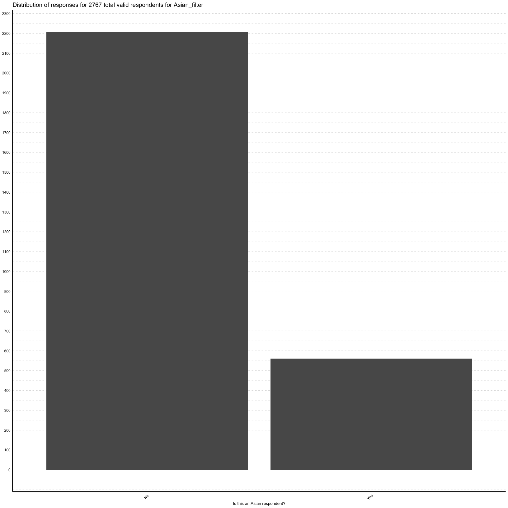<!-- -->

```
Frequencies  
Asian_filter  
Label: Is this an Asian respondent?  
Type: Factor  

              Freq   % Valid   % Valid Cum.   % Total   % Total Cum.
----------- ------ --------- -------------- --------- --------------
         No   2207     79.76          79.76     79.76          79.76
        Yes    560     20.24         100.00     20.24         100.00
       <NA>      0                               0.00         100.00
      Total   2767    100.00         100.00    100.00         100.00
```

```
Warning: Removed 313 rows containing non-finite values (stat_count).
```

<!-- -->

```
Frequencies  
MDQuintile  
Label: Sample frame (PV): IMD quintile within country  
Type: Numeric  

              Freq   % Valid   % Valid Cum.   % Total   % Total Cum.
----------- ------ --------- -------------- --------- --------------
          1    744     30.32          30.32     26.89          26.89
          2    559     22.78          53.10     20.20          47.09
          3    462     18.83          71.92     16.70          63.79
          4    344     14.02          85.94     12.43          76.22
          5    345     14.06         100.00     12.47          88.69
       <NA>    313                              11.31         100.00
      Total   2767    100.00         100.00    100.00         100.00
```

<!-- -->

```
Frequencies  
AGE_BAND  
Label: What is your age band?  
Type: Factor  

              Freq   % Valid   % Valid Cum.   % Total   % Total Cum.
----------- ------ --------- -------------- --------- --------------
      18-24    335     12.11          12.11     12.11          12.11
      25-34    569     20.56          32.67     20.56          32.67
      35-44    584     21.11          53.78     21.11          53.78
      45-54    436     15.76          69.53     15.76          69.53
      55-64    396     14.31          83.85     14.31          83.85
      65-74    301     10.88          94.72     10.88          94.72
        75+    146      5.28         100.00      5.28         100.00
       <NA>      0                               0.00         100.00
      Total   2767    100.00         100.00    100.00         100.00
```

<!-- -->

```
Frequencies  
SEX  
Label: Would you describe yourself as…  
Type: Factor  

                                Freq   % Valid   % Valid Cum.   % Total   % Total Cum.
----------------------------- ------ --------- -------------- --------- --------------
              Missing reponse      1     0.036          0.036     0.036          0.036
                         Male   1208    43.657         43.694    43.657         43.694
                       Female   1550    56.017         99.711    56.017         99.711
      Identify in another way      8     0.289        100.000     0.289        100.000
                         <NA>      0                              0.000        100.000
                        Total   2767   100.000        100.000   100.000        100.000
```

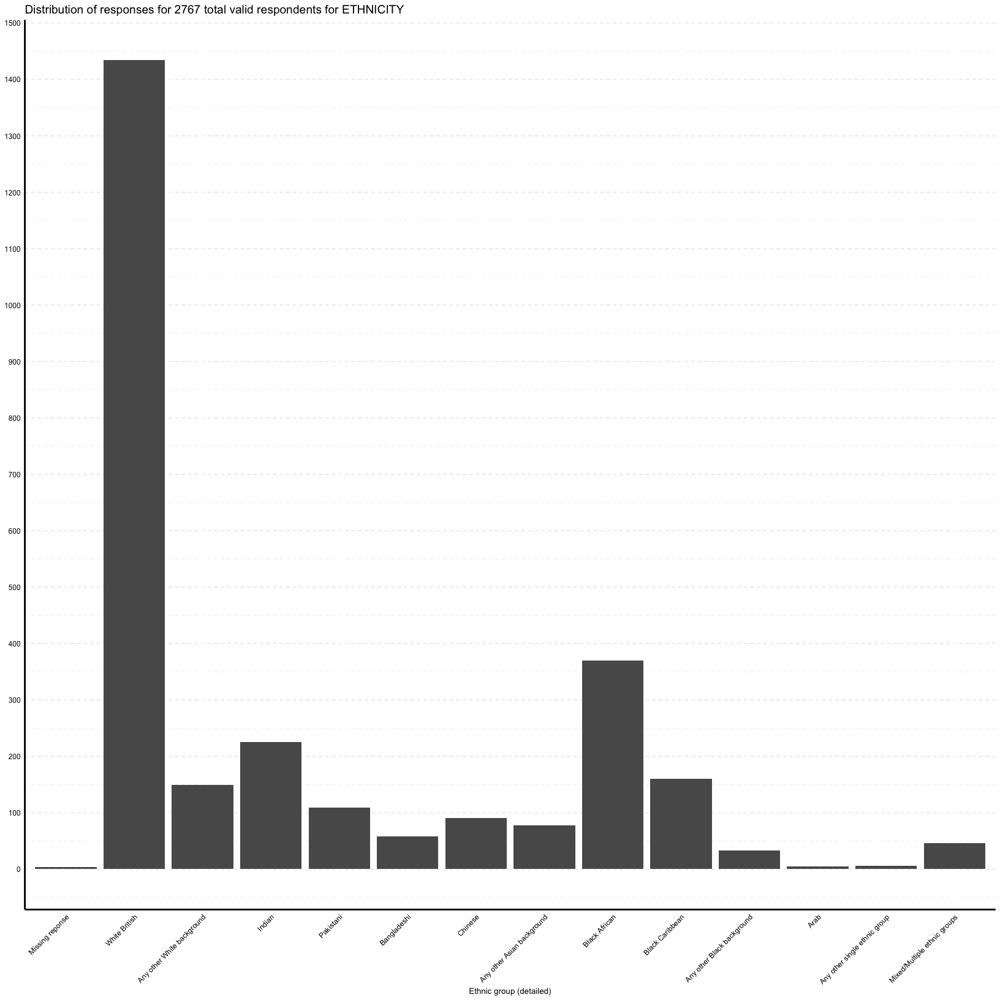<!-- -->

```
Frequencies  
ETHNICITY  
Label: Ethnic group (detailed)  
Type: Factor  

                                      Freq   % Valid   % Valid Cum.   % Total   % Total Cum.
----------------------------------- ------ --------- -------------- --------- --------------
                    Missing reponse      4      0.14           0.14      0.14           0.14
                      White British   1434     51.83          51.97     51.83          51.97
         Any other White background    149      5.38          57.35      5.38          57.35
                             Indian    225      8.13          65.49      8.13          65.49
                          Pakistani    109      3.94          69.43      3.94          69.43
                        Bangladeshi     58      2.10          71.52      2.10          71.52
                            Chinese     91      3.29          74.81      3.29          74.81
         Any other Asian background     77      2.78          77.59      2.78          77.59
                      Black African    370     13.37          90.96     13.37          90.96
                    Black Caribbean    160      5.78          96.75      5.78          96.75
         Any other Black background     33      1.19          97.94      1.19          97.94
                               Arab      5      0.18          98.12      0.18          98.12
      Any other single ethnic group      6      0.22          98.34      0.22          98.34
       Mixed/Multiple ethnic groups     46      1.66         100.00      1.66         100.00
                               <NA>      0                               0.00         100.00
                              Total   2767    100.00         100.00    100.00         100.00
```

<!-- -->

```
Frequencies  
ETHNICITY_LFS  
Label: Ethnic group in LFS format  
Type: Factor  

                                              Freq   % Valid   % Valid Cum.   % Total   % Total Cum.
------------------------------------------- ------ --------- -------------- --------- --------------
                            Missing reponse      4      0.14           0.14      0.14           0.14
                                      White   1583     57.21          57.35     57.21          57.35
               Mixed/Multiple ethnic groups     46      1.66          59.02      1.66          59.02
                                     Indian    225      8.13          67.15      8.13          67.15
                                  Pakistani    109      3.94          71.09      3.94          71.09
                                Bangladeshi     58      2.10          73.18      2.10          73.18
                                    Chinese     91      3.29          76.47      3.29          76.47
                 Any other Asian background     77      2.78          79.26      2.78          79.26
      Black/African/Caribbean/Black British    563     20.35          99.60     20.35          99.60
                         Other ethnic group     11      0.40         100.00      0.40         100.00
                                       <NA>      0                               0.00         100.00
                                      Total   2767    100.00         100.00    100.00         100.00
```

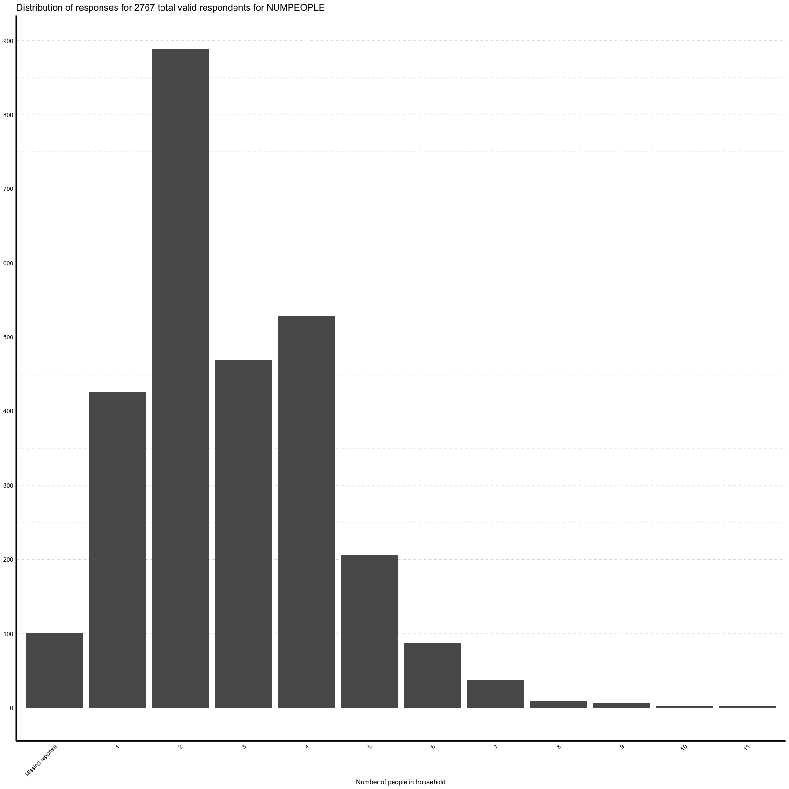<!-- -->

```
Frequencies  
NUMPEOPLE  
Label: Number of people in household  
Type: Factor  

                        Freq   % Valid   % Valid Cum.   % Total   % Total Cum.
--------------------- ------ --------- -------------- --------- --------------
      Missing reponse    101     3.650          3.650     3.650          3.650
                    1    426    15.396         19.046    15.396         19.046
                    2    889    32.129         51.175    32.129         51.175
                    3    469    16.950         68.124    16.950         68.124
                    4    528    19.082         87.206    19.082         87.206
                    5    206     7.445         94.651     7.445         94.651
                    6     88     3.180         97.832     3.180         97.832
                    7     38     1.373         99.205     1.373         99.205
                    8     10     0.361         99.566     0.361         99.566
                    9      7     0.253         99.819     0.253         99.819
                   10      3     0.108         99.928     0.108         99.928
                   11      2     0.072        100.000     0.072        100.000
                 <NA>      0                              0.000        100.000
                Total   2767   100.000        100.000   100.000        100.000
```

<!-- -->

```
Frequencies  
MARSTAT  
Type: Factor  

                                  Freq   % Valid   % Valid Cum.   % Total   % Total Cum.
------------------------------- ------ --------- -------------- --------- --------------
                Missing reponse    123      4.45           4.45      4.45           4.45
      Married/civil partnership   2454     88.69          93.13     88.69          93.13
                        Neither    190      6.87         100.00      6.87         100.00
              Prefer not to say      0      0.00         100.00      0.00         100.00
                           <NA>      0                               0.00         100.00
                          Total   2767    100.00         100.00    100.00         100.00
```

<!-- -->

```
Frequencies  
NumOwnChildrenU16HH  
Label: Number of cohabiting own child(ren) under age of 17  
Type: Factor  

                        Freq   % Valid   % Valid Cum.   % Total   % Total Cum.
--------------------- ------ --------- -------------- --------- --------------
      Missing reponse     21      0.76           0.76      0.76           0.76
                    0   2090     75.53          76.29     75.53          76.29
                    1    292     10.55          86.84     10.55          86.84
                    2    280     10.12          96.96     10.12          96.96
                    3     68      2.46          99.42      2.46          99.42
                    4     13      0.47          99.89      0.47          99.89
                    5      3      0.11         100.00      0.11         100.00
                 <NA>      0                               0.00         100.00
                Total   2767    100.00         100.00    100.00         100.00
```

<!-- -->

```
Frequencies  
OwnChildU16OutsideHH  
Label: Whether one or more own child(ren) under age of 16 living elsewhere  
Type: Factor  

                                          Freq   % Valid   % Valid Cum.   % Total   % Total Cum.
--------------------------------------- ------ --------- -------------- --------- --------------
                        Missing reponse     12      0.43           0.43      0.43           0.43
      No u16 own child living elsewhere   2626     94.90          95.34     94.90          95.34
         U16 own child living elsewhere    129      4.66         100.00      4.66         100.00
                                   <NA>      0                               0.00         100.00
                                  Total   2767    100.00         100.00    100.00         100.00
```

<!-- -->

```
Frequencies  
RELIGIOSITY  
Label: Religiosity  
Type: Factor  

                        Freq   % Valid   % Valid Cum.   % Total   % Total Cum.
--------------------- ------ --------- -------------- --------- --------------
      Missing reponse     10      0.36           0.36      0.36           0.36
           Practising    899     32.49          32.85     32.49          32.85
       Not practising    562     20.31          53.16     20.31          53.16
        Not religious   1296     46.84         100.00     46.84         100.00
                 <NA>      0                               0.00         100.00
                Total   2767    100.00         100.00    100.00         100.00
```

<!-- -->

```
Frequencies  
RELIGION  
Label: Religion  
Type: Factor  

                        Freq   % Valid   % Valid Cum.   % Total   % Total Cum.
--------------------- ------ --------- -------------- --------- --------------
      Missing reponse   1019     36.83          36.83     36.83          36.83
         Christianity    666     24.07          60.90     24.07          60.90
                Islam    181      6.54          67.44      6.54          67.44
             Hinduism     64      2.31          69.75      2.31          69.75
              Sikhism     34      1.23          70.98      1.23          70.98
              Judaism     11      0.40          71.38      0.40          71.38
             Buddhism     13      0.47          71.85      0.47          71.85
       Other religion     15      0.54          72.39      0.54          72.39
          No religion    764     27.61         100.00     27.61         100.00
                 <NA>      0                               0.00         100.00
                Total   2767    100.00         100.00    100.00         100.00
```

<!-- -->

```
Frequencies  
QUALTYPE  
Label: Qualification type(s)  
Type: Factor  

                                                                    Freq   % Valid   % Valid Cum.   % Total   % Total Cum.
----------------------------------------------------------------- ------ --------- -------------- --------- --------------
                                                  Missing reponse     24      0.87           0.87      0.87           0.87
                   Both educational and vocational qualifications   1724     62.31          63.17     62.31          63.17
      Educational qualifications but no vocational qualifications    780     28.19          91.36     28.19          91.36
      Vocational qualifications but no educational qualifications     55      1.99          93.35      1.99          93.35
                Neither educational nor vocational qualifications    184      6.65         100.00      6.65         100.00
                                                             <NA>      0                               0.00         100.00
                                                            Total   2767    100.00         100.00    100.00         100.00
```

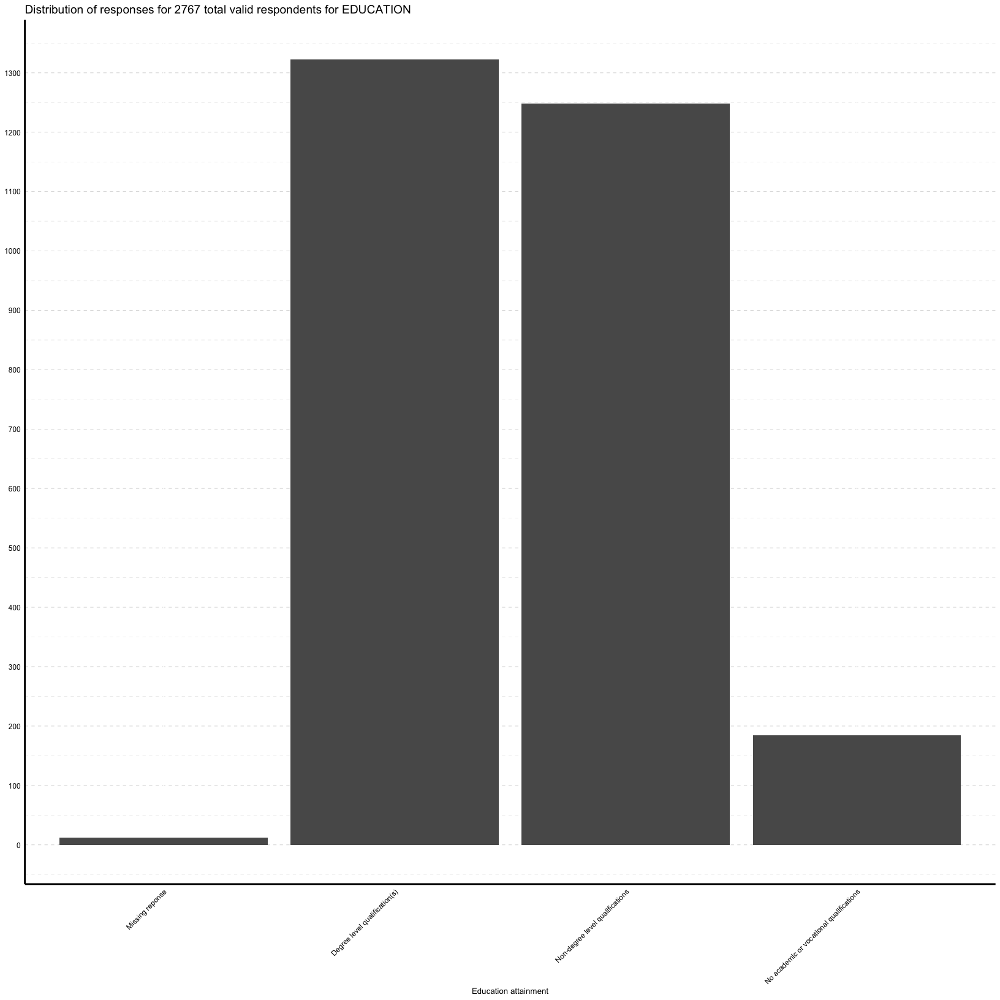<!-- -->

```
Frequencies  
EDUCATION  
Label: Education attainment  
Type: Factor  

                                                 Freq   % Valid   % Valid Cum.   % Total   % Total Cum.
---------------------------------------------- ------ --------- -------------- --------- --------------
                               Missing reponse     12      0.43           0.43      0.43           0.43
                 Degree level qualification(s)   1323     47.81          48.25     47.81          48.25
               Non-degree level qualifications   1248     45.10          93.35     45.10          93.35
      No academic or vocational qualifications    184      6.65         100.00      6.65         100.00
                                          <NA>      0                               0.00         100.00
                                         Total   2767    100.00         100.00    100.00         100.00
```

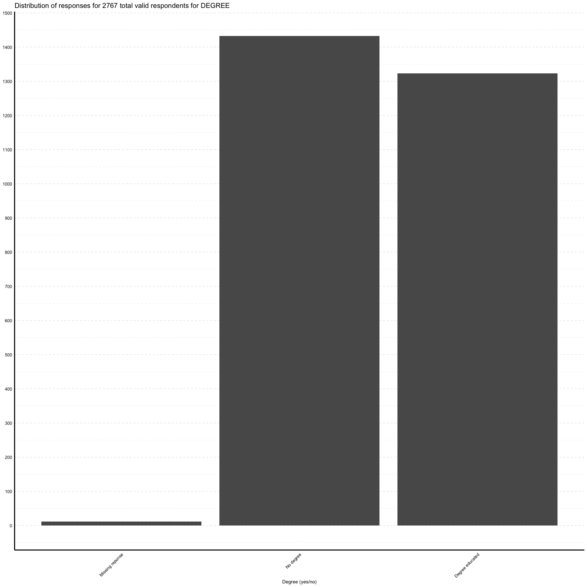<!-- -->

```
Frequencies  
DEGREE  
Label: Degree (yes/no)  
Type: Factor  

                        Freq   % Valid   % Valid Cum.   % Total   % Total Cum.
--------------------- ------ --------- -------------- --------- --------------
      Missing reponse     12      0.43           0.43      0.43           0.43
            No degree   1432     51.75          52.19     51.75          52.19
      Degree educated   1323     47.81         100.00     47.81         100.00
                 <NA>      0                               0.00         100.00
                Total   2767    100.00         100.00    100.00         100.00
```

<!-- -->

```
Frequencies  
WorkingStatus_PrePandemic  
Label: Working status before pandemic  
Type: Factor  

                                               Freq   % Valid   % Valid Cum.   % Total   % Total Cum.
-------------------------------------------- ------ --------- -------------- --------- --------------
                               Self employed    211     7.626          7.626     7.626          7.626
      In paid employment (full or part-time)   1539    55.620         63.245    55.620         63.245
                                  Unemployed    109     3.939         67.185     3.939         67.185
                                     Retired    425    15.360         82.544    15.360         82.544
                          On maternity leave     13     0.470         83.014     0.470         83.014
                Looking after family or home    107     3.867         86.881     3.867         86.881
                           Full-time student    252     9.107         95.988     9.107         95.988
                  Long-term sick or disabled     82     2.963         98.952     2.963         98.952
             On a government training scheme      2     0.072         99.024     0.072         99.024
            Unpaid worker in family business      1     0.036         99.060     0.036         99.060
                        Doing something else     26     0.940        100.000     0.940        100.000
                                        <NA>      0                              0.000        100.000
                                       Total   2767   100.000        100.000   100.000        100.000
```

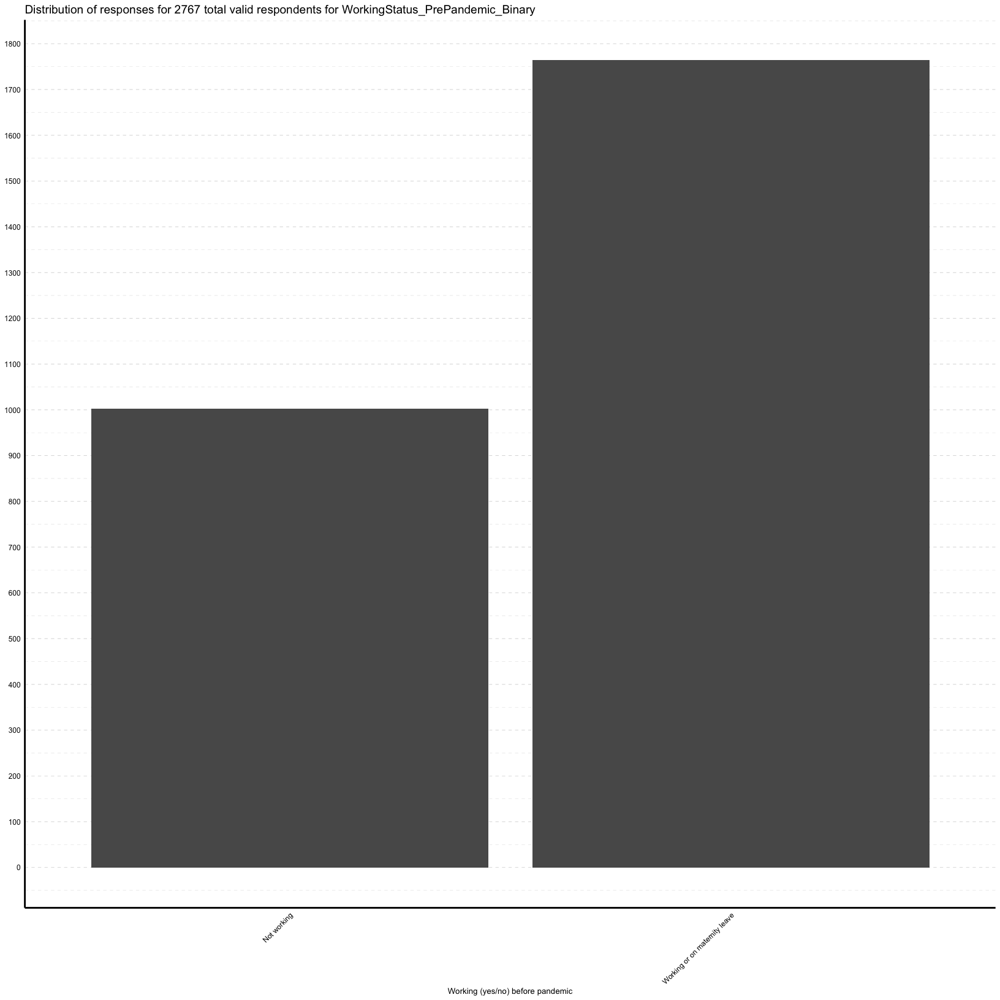<!-- -->

```
Frequencies  
WorkingStatus_PrePandemic_Binary  
Label: Working (yes/no) before pandemic  
Type: Factor  

                                      Freq   % Valid   % Valid Cum.   % Total   % Total Cum.
----------------------------------- ------ --------- -------------- --------- --------------
                        Not working   1003     36.25          36.25     36.25          36.25
      Working or on maternity leave   1764     63.75         100.00     63.75         100.00
                               <NA>      0                               0.00         100.00
                              Total   2767    100.00         100.00    100.00         100.00
```

<!-- -->

```
Frequencies  
WorkingStatus  
Label: Working status  
Type: Factor  

                                               Freq   % Valid   % Valid Cum.   % Total   % Total Cum.
-------------------------------------------- ------ --------- -------------- --------- --------------
                               Self employed    212     7.662          7.662     7.662          7.662
      In paid employment (full or part-time)   1504    54.355         62.017    54.355         62.017
                                  Unemployed    123     4.445         66.462     4.445         66.462
                                     Retired    447    16.155         82.617    16.155         82.617
                          On maternity leave     12     0.434         83.050     0.434         83.050
                Looking after family or home    112     4.048         87.098     4.048         87.098
                           Full-time student    241     8.710         95.808     8.710         95.808
                  Long-term sick or disabled     87     3.144         98.952     3.144         98.952
             On a government training scheme      3     0.108         99.060     0.108         99.060
            Unpaid worker in family business      1     0.036         99.096     0.036         99.096
                        Doing something else     24     0.867         99.964     0.867         99.964
                                 On furlough      1     0.036        100.000     0.036        100.000
                                        <NA>      0                              0.000        100.000
                                       Total   2767   100.000        100.000   100.000        100.000
```

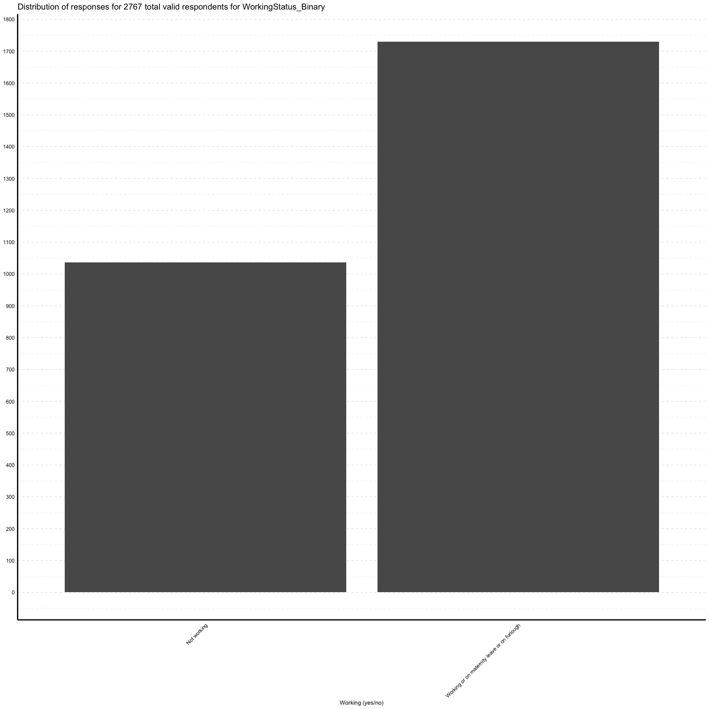<!-- -->

```
Frequencies  
WorkingStatus_Binary  
Label: Working (yes/no)  
Type: Factor  

                                                     Freq   % Valid   % Valid Cum.   % Total   % Total Cum.
-------------------------------------------------- ------ --------- -------------- --------- --------------
                                       Not working   1037     37.48          37.48     37.48          37.48
      Working or on maternity leave or on furlough   1730     62.52         100.00     62.52         100.00
                                              <NA>      0                               0.00         100.00
                                             Total   2767    100.00         100.00    100.00         100.00
```

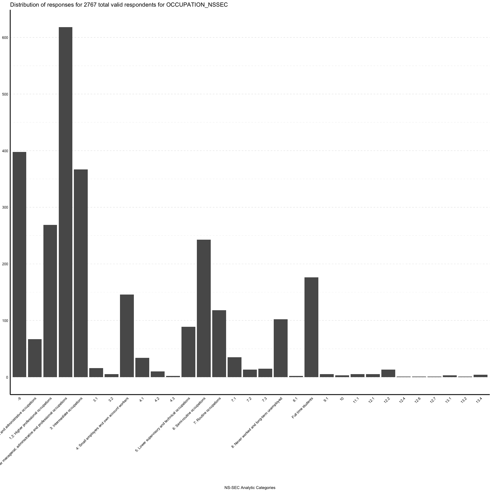<!-- -->

```
Frequencies  
OCCUPATION_NSSEC  
Label: NS-SEC Analytic Categories  
Type: Factor  

                                                                                  Freq   % Valid   % Valid Cum.   % Total   % Total Cum.
------------------------------------------------------------------------------- ------ --------- -------------- --------- --------------
                                                                             -9    398    14.384         14.384    14.384         14.384
              1: Higher managerial, administrative and professional occupations      0     0.000         14.384     0.000         14.384
      1.1: Large employers and higher managerial and administrative occupations     67     2.421         16.805     2.421         16.805
                                           1.2: Higher professional occupations    269     9.722         26.527     9.722         26.527
               2: Lower managerial, administrative and professional occupations    618    22.335         48.862    22.335         48.862
                                                    3: Intermediate occupations    367    13.263         62.125    13.263         62.125
                                                                            3.1     16     0.578         62.703     0.578         62.703
                                                                            3.2      5     0.181         62.884     0.181         62.884
                                     4: Small employers and own account workers    146     5.276         68.160     5.276         68.160
                                                                            4.1     34     1.229         69.389     1.229         69.389
                                                                            4.2     10     0.361         69.751     0.361         69.751
                                                                            4.3      2     0.072         69.823     0.072         69.823
                                 5: Lower supervisory and technical occupations     89     3.216         73.039     3.216         73.039
                                                    6: Semi-routine occupations    243     8.782         81.821     8.782         81.821
                                                         7: Routine occupations    118     4.265         86.086     4.265         86.086
                                                                            7.1     35     1.265         87.351     1.265         87.351
                                                                            7.2     13     0.470         87.821     0.470         87.821
                                                                            7.3     15     0.542         88.363     0.542         88.363
                                       8: Never worked and long-term unemployed    102     3.686         92.049     3.686         92.049
                                                                            8.1      2     0.072         92.121     0.072         92.121
                                                             Full time students    176     6.361         98.482     6.361         98.482
                                                                            9.1      5     0.181         98.663     0.181         98.663
                                                                             10      3     0.108         98.771     0.108         98.771
                                                                           11.1      5     0.181         98.952     0.181         98.952
                                                                           12.1      5     0.181         99.133     0.181         99.133
                                                                           12.2     13     0.470         99.602     0.470         99.602
                                                                           12.4      1     0.036         99.639     0.036         99.639
                                                                           12.6      1     0.036         99.675     0.036         99.675
                                                                           12.7      1     0.036         99.711     0.036         99.711
                                                                           13.1      3     0.108         99.819     0.108         99.819
                                                                           13.2      1     0.036         99.855     0.036         99.855
                                                                           13.4      4     0.145        100.000     0.145        100.000
                                                                           <NA>      0                              0.000        100.000
                                                                          Total   2767   100.000        100.000   100.000        100.000
```

<!-- -->

```
Frequencies  
TENURE  
Label: Housing tenure, reduced to 3 categories  
Type: Factor  

                                                 Freq   % Valid   % Valid Cum.   % Total   % Total Cum.
---------------------------------------------- ------ --------- -------------- --------- --------------
      Own it outright (no mortgage to pay off)    750     27.16          27.16     27.11          27.11
         Own it but with a mortgage to pay off    891     32.27          59.43     32.20          59.31
                                  Rent / other   1120     40.57         100.00     40.48          99.78
                                          <NA>      6                               0.22         100.00
                                         Total   2767    100.00         100.00    100.00         100.00
```

## outcome variables

```r
for (i in outcomes){
  frequency_and_plot(factor_df,i)
}
```

```
Note: Using an external vector in selections is ambiguous.
ℹ Use `all_of(i)` instead of `i` to silence this message.
ℹ See <https://tidyselect.r-lib.org/reference/faq-external-vector.html>.
This message is displayed once per session.
```

<!-- -->

```
Frequencies  
ofhact_agree  
Label: Would you take part in it if you were invited to?
Levels: Yes = Yes definitely Yes probably; No =  No, probably not No, definitely not Not sure / it depends  
Type: Factor  

              Freq   % Valid   % Valid Cum.   % Total   % Total Cum.
----------- ------ --------- -------------- --------- --------------
         No   1374     49.66          49.66     49.66          49.66
        Yes   1393     50.34         100.00     50.34         100.00
       <NA>      0                               0.00         100.00
      Total   2767    100.00         100.00    100.00         100.00
```

<!-- -->

```
Frequencies  
ofhact_all  
Label: Would you take part in it if you were invited to?
Levels: Yes = Yes definitely Yes probably; No =  No, probably not No, definitely not; Unsure = Not sure / it depends  
Type: Factor  

               Freq   % Valid   % Valid Cum.   % Total   % Total Cum.
------------ ------ --------- -------------- --------- --------------
          No    908     32.82          32.82     32.82          32.82
      Unsure    466     16.84          49.66     16.84          49.66
         Yes   1393     50.34         100.00     50.34         100.00
        <NA>      0                               0.00         100.00
       Total   2767    100.00         100.00    100.00         100.00
```

<!-- -->

```
Frequencies  
GENFBACK_prevent_agree  
Label: Genetic feedback for conditions that ARE prevetable or treatable (e.g. type 2 diabetes, heart disease)?
Levels: Yes = Yes definitely Yes probably; No =  No, probably not No, definitely not Not sure / it depends, prefer not to say  
Type: Factor  

              Freq   % Valid   % Valid Cum.   % Total   % Total Cum.
----------- ------ --------- -------------- --------- --------------
         No    633     22.88          22.88     22.88          22.88
        Yes   2134     77.12         100.00     77.12         100.00
       <NA>      0                               0.00         100.00
      Total   2767    100.00         100.00    100.00         100.00
```

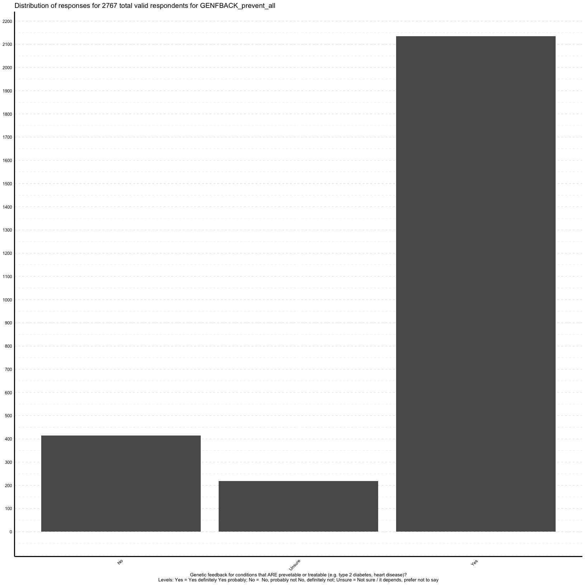<!-- -->

```
Frequencies  
GENFBACK_prevent_all  
Label: Genetic feedback for conditions that ARE prevetable or treatable (e.g. type 2 diabetes, heart disease)?
Levels: Yes = Yes definitely Yes probably; No =  No, probably not No, definitely not; Unsure = Not sure / it depends, prefer not to say  
Type: Factor  

               Freq   % Valid   % Valid Cum.   % Total   % Total Cum.
------------ ------ --------- -------------- --------- --------------
          No    415     15.00          15.00     15.00          15.00
      Unsure    218      7.88          22.88      7.88          22.88
         Yes   2134     77.12         100.00     77.12         100.00
        <NA>      0                               0.00         100.00
       Total   2767    100.00         100.00    100.00         100.00
```

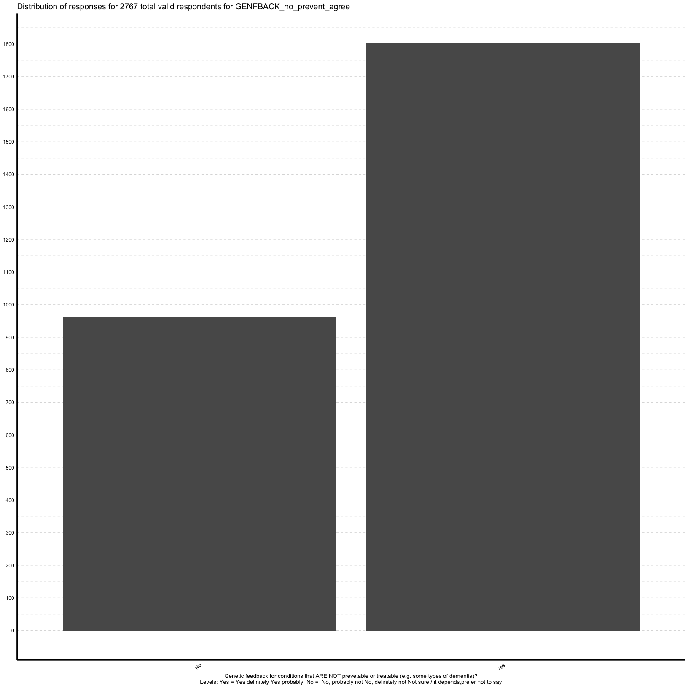<!-- -->

```
Frequencies  
GENFBACK_no_prevent_agree  
Label: Genetic feedback for conditions that ARE NOT prevetable or treatable (e.g. some types of dementia)?
Levels: Yes = Yes definitely Yes probably; No =  No, probably not No, definitely not Not sure / it depends,prefer not to say  
Type: Factor  

              Freq   % Valid   % Valid Cum.   % Total   % Total Cum.
----------- ------ --------- -------------- --------- --------------
         No    964     34.84          34.84     34.84          34.84
        Yes   1803     65.16         100.00     65.16         100.00
       <NA>      0                               0.00         100.00
      Total   2767    100.00         100.00    100.00         100.00
```

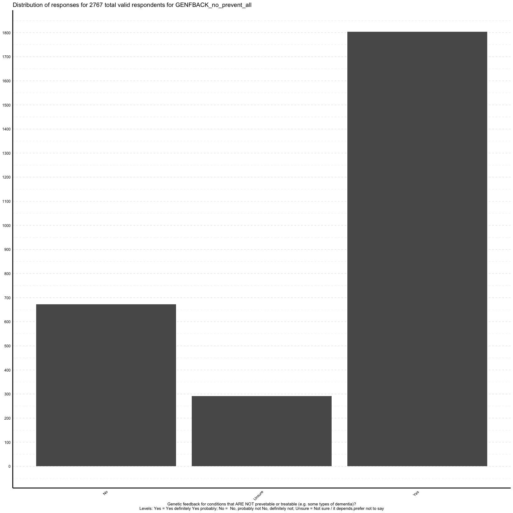<!-- -->

```
Frequencies  
GENFBACK_no_prevent_all  
Label: Genetic feedback for conditions that ARE NOT prevetable or treatable (e.g. some types of dementia)?
Levels: Yes = Yes definitely Yes probably; No =  No, probably not No, definitely not; Unsure = Not sure / it depends,prefer not to say  
Type: Factor  

               Freq   % Valid   % Valid Cum.   % Total   % Total Cum.
------------ ------ --------- -------------- --------- --------------
          No    673     24.32          24.32     24.32          24.32
      Unsure    291     10.52          34.84     10.52          34.84
         Yes   1803     65.16         100.00     65.16         100.00
        <NA>      0                               0.00         100.00
       Total   2767    100.00         100.00    100.00         100.00
```

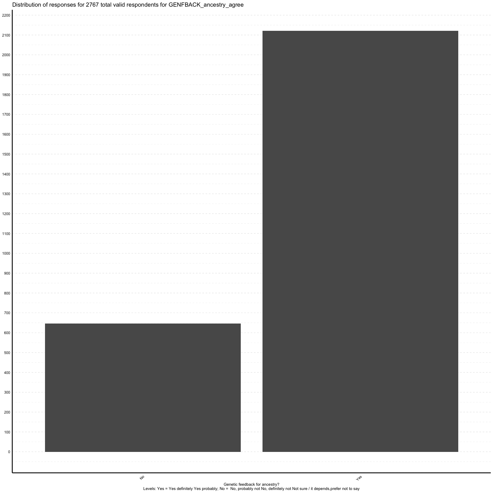<!-- -->

```
Frequencies  
GENFBACK_ancestry_agree  
Label: Genetic feedback for ancestry?
Levels: Yes = Yes definitely Yes probably; No =  No, probably not No, definitely not Not sure / it depends,prefer not to say  
Type: Factor  

              Freq   % Valid   % Valid Cum.   % Total   % Total Cum.
----------- ------ --------- -------------- --------- --------------
         No    646     23.35          23.35     23.35          23.35
        Yes   2121     76.65         100.00     76.65         100.00
       <NA>      0                               0.00         100.00
      Total   2767    100.00         100.00    100.00         100.00
```

<!-- -->

```
Frequencies  
GENFBACK_ancestry_all  
Label: Genetic feedback for ancestry?
Levels: Yes = Yes definitely Yes probably; No =  No, probably not No, definitely not; Unsure = Not sure / it depends,prefer not to say  
Type: Factor  

               Freq   % Valid   % Valid Cum.   % Total   % Total Cum.
------------ ------ --------- -------------- --------- --------------
          No    449     16.23          16.23     16.23          16.23
      Unsure    197      7.12          23.35      7.12          23.35
         Yes   2121     76.65         100.00     76.65         100.00
        <NA>      0                               0.00         100.00
       Total   2767    100.00         100.00    100.00         100.00
```
## predictor variables

```r
for (i in all.pred.vars){
  frequency_and_plot(factor_df,i)
}
```

```
Warning: Removed 313 rows containing non-finite values (stat_count).
```

<!-- -->

```
Frequencies  
MDQuintile  
Label: Sample frame (PV): IMD quintile within country  
Type: Numeric  

              Freq   % Valid   % Valid Cum.   % Total   % Total Cum.
----------- ------ --------- -------------- --------- --------------
          1    744     30.32          30.32     26.89          26.89
          2    559     22.78          53.10     20.20          47.09
          3    462     18.83          71.92     16.70          63.79
          4    344     14.02          85.94     12.43          76.22
          5    345     14.06         100.00     12.47          88.69
       <NA>    313                              11.31         100.00
      Total   2767    100.00         100.00    100.00         100.00
```

<!-- -->

```
Frequencies  
AGE_BAND  
Label: What is your age band?  
Type: Factor  

              Freq   % Valid   % Valid Cum.   % Total   % Total Cum.
----------- ------ --------- -------------- --------- --------------
      18-24    335     12.11          12.11     12.11          12.11
      25-34    569     20.56          32.67     20.56          32.67
      35-44    584     21.11          53.78     21.11          53.78
      45-54    436     15.76          69.53     15.76          69.53
      55-64    396     14.31          83.85     14.31          83.85
      65-74    301     10.88          94.72     10.88          94.72
        75+    146      5.28         100.00      5.28         100.00
       <NA>      0                               0.00         100.00
      Total   2767    100.00         100.00    100.00         100.00
```

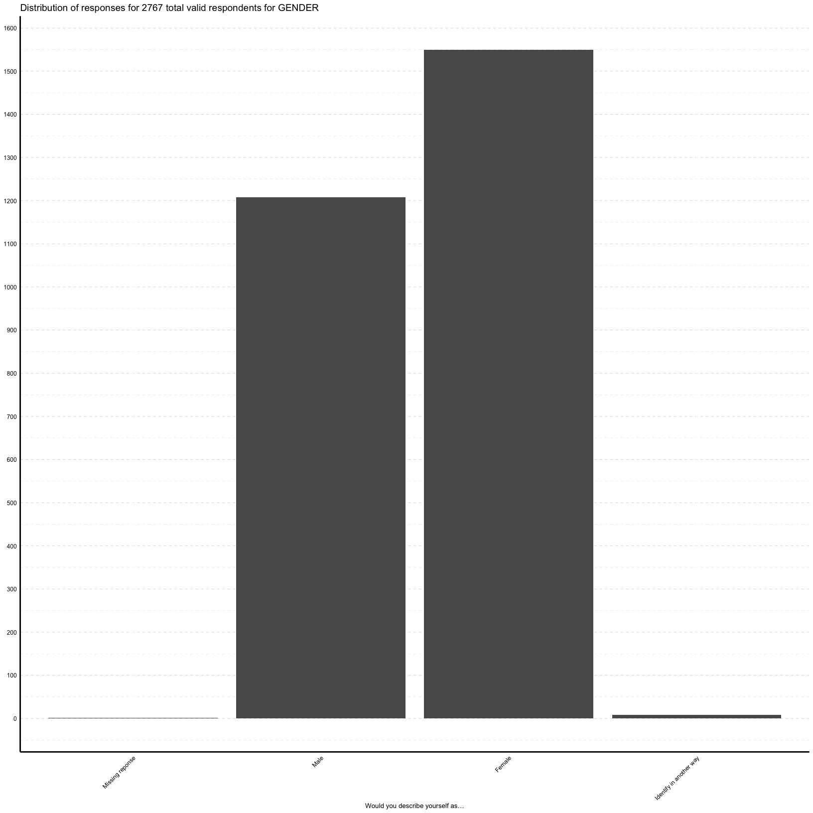<!-- -->

```
Frequencies  
SEX  
Label: Would you describe yourself as…  
Type: Factor  

                                Freq   % Valid   % Valid Cum.   % Total   % Total Cum.
----------------------------- ------ --------- -------------- --------- --------------
              Missing reponse      1     0.036          0.036     0.036          0.036
                         Male   1208    43.657         43.694    43.657         43.694
                       Female   1550    56.017         99.711    56.017         99.711
      Identify in another way      8     0.289        100.000     0.289        100.000
                         <NA>      0                              0.000        100.000
                        Total   2767   100.000        100.000   100.000        100.000
```

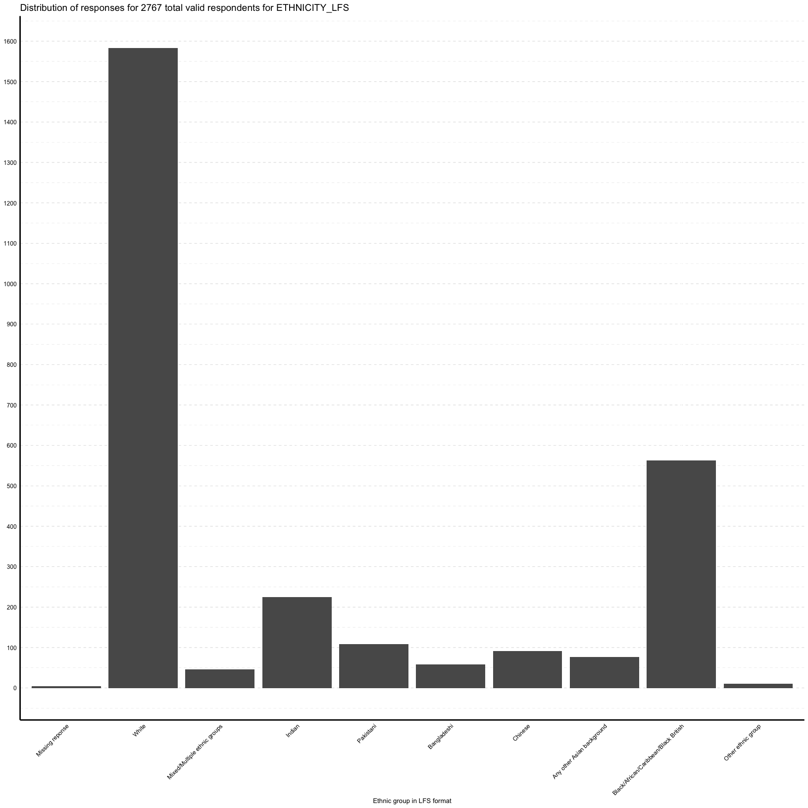<!-- -->

```
Frequencies  
ETHNICITY_LFS  
Label: Ethnic group in LFS format  
Type: Factor  

                                              Freq   % Valid   % Valid Cum.   % Total   % Total Cum.
------------------------------------------- ------ --------- -------------- --------- --------------
                            Missing reponse      4      0.14           0.14      0.14           0.14
                                      White   1583     57.21          57.35     57.21          57.35
               Mixed/Multiple ethnic groups     46      1.66          59.02      1.66          59.02
                                     Indian    225      8.13          67.15      8.13          67.15
                                  Pakistani    109      3.94          71.09      3.94          71.09
                                Bangladeshi     58      2.10          73.18      2.10          73.18
                                    Chinese     91      3.29          76.47      3.29          76.47
                 Any other Asian background     77      2.78          79.26      2.78          79.26
      Black/African/Caribbean/Black British    563     20.35          99.60     20.35          99.60
                         Other ethnic group     11      0.40         100.00      0.40         100.00
                                       <NA>      0                               0.00         100.00
                                      Total   2767    100.00         100.00    100.00         100.00
```

<!-- -->

```
Frequencies  
NUMPEOPLE  
Label: Number of people in household  
Type: Factor  

                        Freq   % Valid   % Valid Cum.   % Total   % Total Cum.
--------------------- ------ --------- -------------- --------- --------------
      Missing reponse    101     3.650          3.650     3.650          3.650
                    1    426    15.396         19.046    15.396         19.046
                    2    889    32.129         51.175    32.129         51.175
                    3    469    16.950         68.124    16.950         68.124
                    4    528    19.082         87.206    19.082         87.206
                    5    206     7.445         94.651     7.445         94.651
                    6     88     3.180         97.832     3.180         97.832
                    7     38     1.373         99.205     1.373         99.205
                    8     10     0.361         99.566     0.361         99.566
                    9      7     0.253         99.819     0.253         99.819
                   10      3     0.108         99.928     0.108         99.928
                   11      2     0.072        100.000     0.072        100.000
                 <NA>      0                              0.000        100.000
                Total   2767   100.000        100.000   100.000        100.000
```

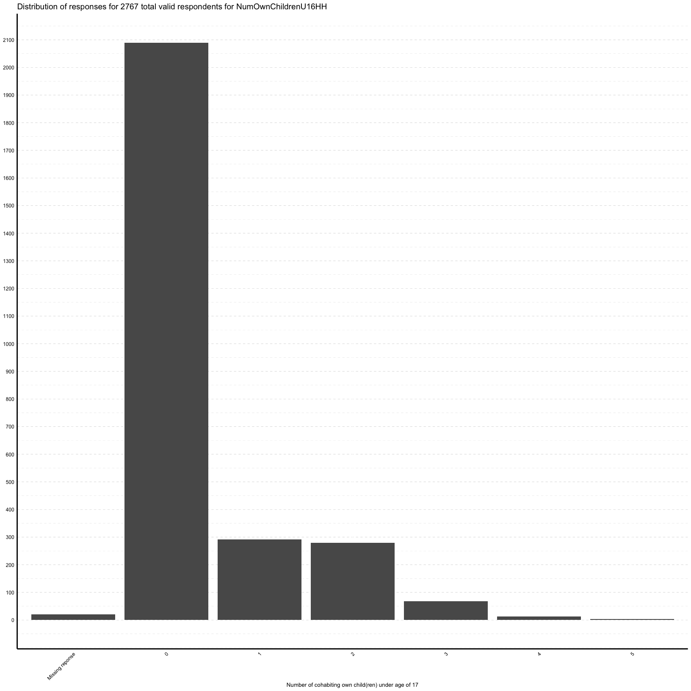<!-- -->

```
Frequencies  
NumOwnChildrenU16HH  
Label: Number of cohabiting own child(ren) under age of 17  
Type: Factor  

                        Freq   % Valid   % Valid Cum.   % Total   % Total Cum.
--------------------- ------ --------- -------------- --------- --------------
      Missing reponse     21      0.76           0.76      0.76           0.76
                    0   2090     75.53          76.29     75.53          76.29
                    1    292     10.55          86.84     10.55          86.84
                    2    280     10.12          96.96     10.12          96.96
                    3     68      2.46          99.42      2.46          99.42
                    4     13      0.47          99.89      0.47          99.89
                    5      3      0.11         100.00      0.11         100.00
                 <NA>      0                               0.00         100.00
                Total   2767    100.00         100.00    100.00         100.00
```

<!-- -->

```
Frequencies  
OwnChildU16OutsideHH  
Label: Whether one or more own child(ren) under age of 16 living elsewhere  
Type: Factor  

                                          Freq   % Valid   % Valid Cum.   % Total   % Total Cum.
--------------------------------------- ------ --------- -------------- --------- --------------
                        Missing reponse     12      0.43           0.43      0.43           0.43
      No u16 own child living elsewhere   2626     94.90          95.34     94.90          95.34
         U16 own child living elsewhere    129      4.66         100.00      4.66         100.00
                                   <NA>      0                               0.00         100.00
                                  Total   2767    100.00         100.00    100.00         100.00
```

<!-- -->

```
Frequencies  
INTERNET  
Label: Frequency of personal internet use  
Type: Factor  

                           Freq   % Valid   % Valid Cum.   % Total   % Total Cum.
------------------------ ------ --------- -------------- --------- --------------
               Every day   2407     86.99          86.99     86.99          86.99
               Most days    196      7.08          94.07      7.08          94.07
      A few times a week     79      2.86          96.93      2.86          96.93
              Less often     37      1.34          98.27      1.34          98.27
                   Never     48      1.73         100.00      1.73         100.00
                    <NA>      0                               0.00         100.00
                   Total   2767    100.00         100.00    100.00         100.00
```

<!-- -->

```
Frequencies  
DEVICE_SMRTPHNE  
Label: Has smartphone?  
Type: Factor  

              Freq   % Valid   % Valid Cum.   % Total   % Total Cum.
----------- ------ --------- -------------- --------- --------------
         No    173      6.25           6.25      6.25           6.25
        Yes   2594     93.75         100.00     93.75         100.00
       <NA>      0                               0.00         100.00
      Total   2767    100.00         100.00    100.00         100.00
```

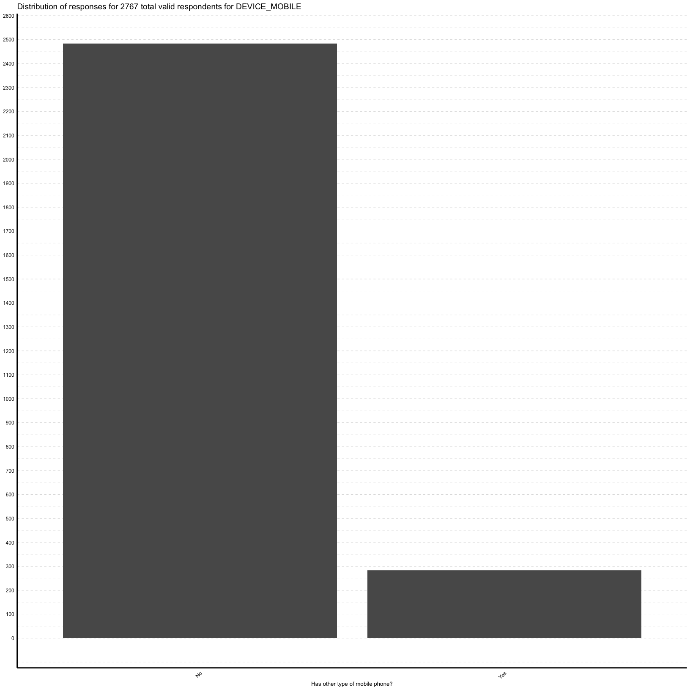<!-- -->

```
Frequencies  
DEVICE_MOBILE  
Label: Has other type of mobile phone?  
Type: Factor  

              Freq   % Valid   % Valid Cum.   % Total   % Total Cum.
----------- ------ --------- -------------- --------- --------------
         No   2484     89.77          89.77     89.77          89.77
        Yes    283     10.23         100.00     10.23         100.00
       <NA>      0                               0.00         100.00
      Total   2767    100.00         100.00    100.00         100.00
```

<!-- -->

```
Frequencies  
DEVICE_TABLET  
Label: Has tablet?  
Type: Factor  

              Freq   % Valid   % Valid Cum.   % Total   % Total Cum.
----------- ------ --------- -------------- --------- --------------
         No   1105     39.93          39.93     39.93          39.93
        Yes   1662     60.07         100.00     60.07         100.00
       <NA>      0                               0.00         100.00
      Total   2767    100.00         100.00    100.00         100.00
```

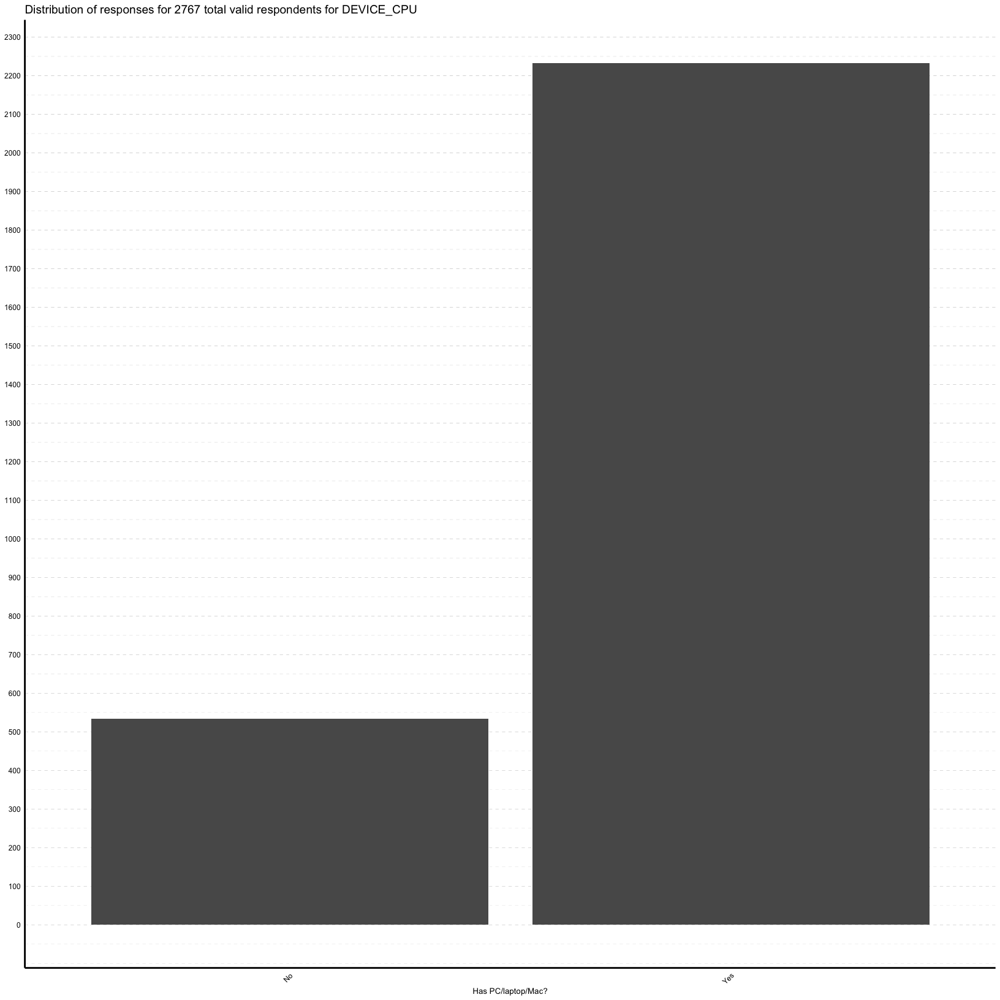<!-- -->

```
Frequencies  
DEVICE_CPU  
Label: Has PC/laptop/Mac?  
Type: Factor  

              Freq   % Valid   % Valid Cum.   % Total   % Total Cum.
----------- ------ --------- -------------- --------- --------------
         No    534     19.30          19.30     19.30          19.30
        Yes   2233     80.70         100.00     80.70         100.00
       <NA>      0                               0.00         100.00
      Total   2767    100.00         100.00    100.00         100.00
```

<!-- -->

```
Frequencies  
DEVICE_WEAR  
Label: Has some wearable tech (e.g. smartwatch, fitbit)?  
Type: Factor  

              Freq   % Valid   % Valid Cum.   % Total   % Total Cum.
----------- ------ --------- -------------- --------- --------------
         No   1977     71.45          71.45     71.45          71.45
        Yes    790     28.55         100.00     28.55         100.00
       <NA>      0                               0.00         100.00
      Total   2767    100.00         100.00    100.00         100.00
```

<!-- -->

```
Frequencies  
DEVICE_TOTAL  
Label: Number of listed technological devices (/9)  
Type: Numeric  

              Freq   % Valid   % Valid Cum.   % Total   % Total Cum.
----------- ------ --------- -------------- --------- --------------
          0      5      0.18           0.18      0.18           0.18
          1    143      5.17           5.35      5.17           5.35
          2    253      9.14          14.49      9.14          14.49
          3    404     14.60          29.09     14.60          29.09
          4    517     18.68          47.78     18.68          47.78
          5    524     18.94          66.71     18.94          66.71
          6    469     16.95          83.66     16.95          83.66
          7    297     10.73          94.40     10.73          94.40
          8    136      4.92          99.31      4.92          99.31
          9     19      0.69         100.00      0.69         100.00
       <NA>      0                               0.00         100.00
      Total   2767    100.00         100.00    100.00         100.00
```

<!-- -->

```
Frequencies  
DIGPROF_TOTAL  
Label: Composite score indicating overall ease of use of internet for life admin. Minimum 0 indicating not at all confident and maximum of 15 indicating very confident  
Type: Numeric  

              Freq   % Valid   % Valid Cum.   % Total   % Total Cum.
----------- ------ --------- -------------- --------- --------------
          0     41      1.48           1.48      1.48           1.48
          1      9      0.33           1.81      0.33           1.81
          2     14      0.51           2.31      0.51           2.31
          3     29      1.05           3.36      1.05           3.36
          4     23      0.83           4.19      0.83           4.19
          5     42      1.52           5.71      1.52           5.71
          6     35      1.26           6.98      1.26           6.98
          7     68      2.46           9.43      2.46           9.43
          8    119      4.30          13.73      4.30          13.73
          9    165      5.96          19.70      5.96          19.70
         10    307     11.10          30.79     11.10          30.79
         11    247      8.93          39.72      8.93          39.72
         12    274      9.90          49.62      9.90          49.62
         13    298     10.77          60.39     10.77          60.39
         14    259      9.36          69.75      9.36          69.75
         15    837     30.25         100.00     30.25         100.00
       <NA>      0                               0.00         100.00
      Total   2767    100.00         100.00    100.00         100.00
```

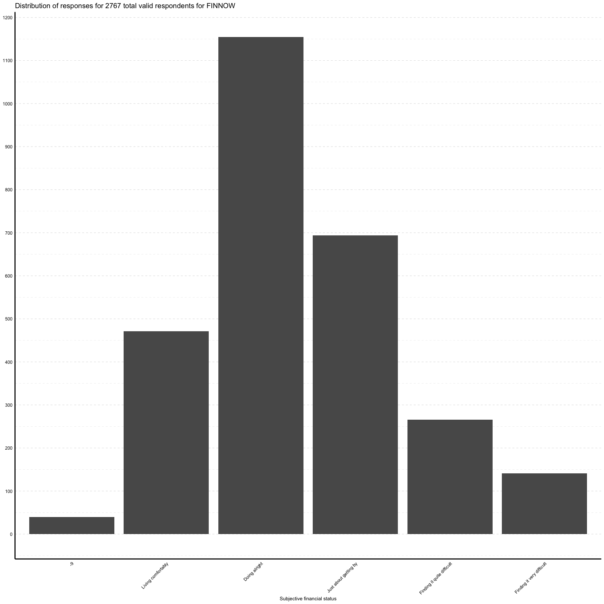<!-- -->

```
Frequencies  
FINNOW  
Label: Subjective financial status  
Type: Factor  

                                   Freq   % Valid   % Valid Cum.   % Total   % Total Cum.
-------------------------------- ------ --------- -------------- --------- --------------
                              -9     40      1.45           1.45      1.45           1.45
              Living comfortably    471     17.02          18.47     17.02          18.47
                   Doing alright   1155     41.74          60.21     41.74          60.21
           Just about getting by    694     25.08          85.29     25.08          85.29
      Finding it quite difficult    266      9.61          94.90      9.61          94.90
       Finding it very difficult    141      5.10         100.00      5.10         100.00
                            <NA>      0                               0.00         100.00
                           Total   2767    100.00         100.00    100.00         100.00
```

<!-- -->

```
Frequencies  
RELIGIOSITY  
Label: Religiosity  
Type: Factor  

                        Freq   % Valid   % Valid Cum.   % Total   % Total Cum.
--------------------- ------ --------- -------------- --------- --------------
      Missing reponse     10      0.36           0.36      0.36           0.36
           Practising    899     32.49          32.85     32.49          32.85
       Not practising    562     20.31          53.16     20.31          53.16
        Not religious   1296     46.84         100.00     46.84         100.00
                 <NA>      0                               0.00         100.00
                Total   2767    100.00         100.00    100.00         100.00
```

<!-- -->

```
Frequencies  
OCCUPATION_NSSEC  
Label: NS-SEC Analytic Categories  
Type: Factor  

                                                                                  Freq   % Valid   % Valid Cum.   % Total   % Total Cum.
------------------------------------------------------------------------------- ------ --------- -------------- --------- --------------
                                                                             -9    398    14.384         14.384    14.384         14.384
              1: Higher managerial, administrative and professional occupations      0     0.000         14.384     0.000         14.384
      1.1: Large employers and higher managerial and administrative occupations     67     2.421         16.805     2.421         16.805
                                           1.2: Higher professional occupations    269     9.722         26.527     9.722         26.527
               2: Lower managerial, administrative and professional occupations    618    22.335         48.862    22.335         48.862
                                                    3: Intermediate occupations    367    13.263         62.125    13.263         62.125
                                                                            3.1     16     0.578         62.703     0.578         62.703
                                                                            3.2      5     0.181         62.884     0.181         62.884
                                     4: Small employers and own account workers    146     5.276         68.160     5.276         68.160
                                                                            4.1     34     1.229         69.389     1.229         69.389
                                                                            4.2     10     0.361         69.751     0.361         69.751
                                                                            4.3      2     0.072         69.823     0.072         69.823
                                 5: Lower supervisory and technical occupations     89     3.216         73.039     3.216         73.039
                                                    6: Semi-routine occupations    243     8.782         81.821     8.782         81.821
                                                         7: Routine occupations    118     4.265         86.086     4.265         86.086
                                                                            7.1     35     1.265         87.351     1.265         87.351
                                                                            7.2     13     0.470         87.821     0.470         87.821
                                                                            7.3     15     0.542         88.363     0.542         88.363
                                       8: Never worked and long-term unemployed    102     3.686         92.049     3.686         92.049
                                                                            8.1      2     0.072         92.121     0.072         92.121
                                                             Full time students    176     6.361         98.482     6.361         98.482
                                                                            9.1      5     0.181         98.663     0.181         98.663
                                                                             10      3     0.108         98.771     0.108         98.771
                                                                           11.1      5     0.181         98.952     0.181         98.952
                                                                           12.1      5     0.181         99.133     0.181         99.133
                                                                           12.2     13     0.470         99.602     0.470         99.602
                                                                           12.4      1     0.036         99.639     0.036         99.639
                                                                           12.6      1     0.036         99.675     0.036         99.675
                                                                           12.7      1     0.036         99.711     0.036         99.711
                                                                           13.1      3     0.108         99.819     0.108         99.819
                                                                           13.2      1     0.036         99.855     0.036         99.855
                                                                           13.4      4     0.145        100.000     0.145        100.000
                                                                           <NA>      0                              0.000        100.000
                                                                          Total   2767   100.000        100.000   100.000        100.000
```

<!-- -->

```
Frequencies  
EDUCATION  
Label: Education attainment  
Type: Factor  

                                                 Freq   % Valid   % Valid Cum.   % Total   % Total Cum.
---------------------------------------------- ------ --------- -------------- --------- --------------
                               Missing reponse     12      0.43           0.43      0.43           0.43
                 Degree level qualification(s)   1323     47.81          48.25     47.81          48.25
               Non-degree level qualifications   1248     45.10          93.35     45.10          93.35
      No academic or vocational qualifications    184      6.65         100.00      6.65         100.00
                                          <NA>      0                               0.00         100.00
                                         Total   2767    100.00         100.00    100.00         100.00
```

<!-- -->

```
Frequencies  
WorkingStatus_Binary  
Label: Working (yes/no)  
Type: Factor  

                                                     Freq   % Valid   % Valid Cum.   % Total   % Total Cum.
-------------------------------------------------- ------ --------- -------------- --------- --------------
                                       Not working   1037     37.48          37.48     37.48          37.48
      Working or on maternity leave or on furlough   1730     62.52         100.00     62.52         100.00
                                              <NA>      0                               0.00         100.00
                                             Total   2767    100.00         100.00    100.00         100.00
```

<!-- -->

```
Frequencies  
LIFEEVENT  
Label: In the last 12 months have you experienced a major life event?  
Type: Factor  

                          Freq   % Valid   % Valid Cum.   % Total   % Total Cum.
----------------------- ------ --------- -------------- --------- --------------
                    Yes    998     36.07          36.07     36.07          36.07
                     No   1715     61.98          98.05     61.98          98.05
      Prefer not to say     54      1.95         100.00      1.95         100.00
                   <NA>      0                               0.00         100.00
                  Total   2767    100.00         100.00    100.00         100.00
```

<!-- -->

```
Frequencies  
PROSO_EVER_TOTAL  
Label: Composite score indicating number of pro social activities ever undertaken. Minimum score of 0 indicates none of the three were endorsed, maximum of 3 indicates all activities endorsed  
Type: Numeric  

              Freq   % Valid   % Valid Cum.   % Total   % Total Cum.
----------- ------ --------- -------------- --------- --------------
          0    305     11.02          11.02     11.02          11.02
          1    841     30.39          41.42     30.39          41.42
          2    739     26.71          68.12     26.71          68.12
          3    559     20.20          88.33     20.20          88.33
          4    323     11.67         100.00     11.67         100.00
       <NA>      0                               0.00         100.00
      Total   2767    100.00         100.00    100.00         100.00
```

```
Warning: Removed 352 rows containing non-finite values (stat_count).
```

<!-- -->

```
Frequencies  
PROSO4W_TOTAL  
Label: Composite score indicating number of pro social activities undertaken in the past 4 weeks. Minimum score of 0 indicates none of the three were endorsed, maximum of 3 indicates all activities endorsed  
Type: Numeric  

              Freq   % Valid   % Valid Cum.   % Total   % Total Cum.
----------- ------ --------- -------------- --------- --------------
          0   1008     41.74          41.74     36.43          36.43
          1   1193     49.40          91.14     43.12          79.54
          2    204      8.45          99.59      7.37          86.92
          3     10      0.41         100.00      0.36          87.28
       <NA>    352                              12.72         100.00
      Total   2767    100.00         100.00    100.00         100.00
```

<!-- -->

```
Frequencies  
GENFAM  
Label: Do you have a family history of any disease or health condition?  
Type: Factor  

                          Freq   % Valid   % Valid Cum.   % Total   % Total Cum.
----------------------- ------ --------- -------------- --------- --------------
                    Yes   1040     37.59          37.59     37.59          37.59
                     No   1309     47.31          84.89     47.31          84.89
             Don't know    353     12.76          97.65     12.76          97.65
      Prefer not to say     65      2.35         100.00      2.35         100.00
                   <NA>      0                               0.00         100.00
                  Total   2767    100.00         100.00    100.00         100.00
```

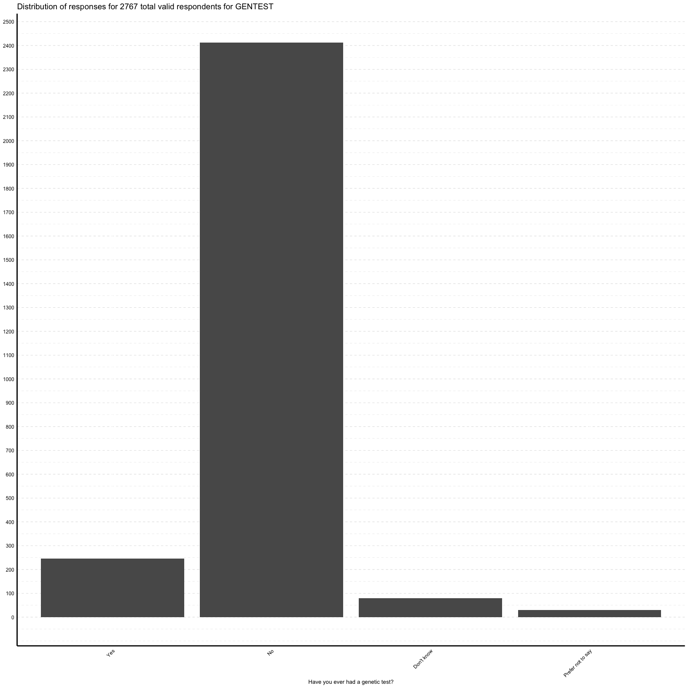<!-- -->

```
Frequencies  
GENTEST  
Label: Have you ever had a genetic test?  
Type: Factor  

                          Freq   % Valid   % Valid Cum.   % Total   % Total Cum.
----------------------- ------ --------- -------------- --------- --------------
                    Yes    245      8.85           8.85      8.85           8.85
                     No   2413     87.21          96.06     87.21          96.06
             Don't know     80      2.89          98.95      2.89          98.95
      Prefer not to say     29      1.05         100.00      1.05         100.00
                   <NA>      0                               0.00         100.00
                  Total   2767    100.00         100.00    100.00         100.00
```

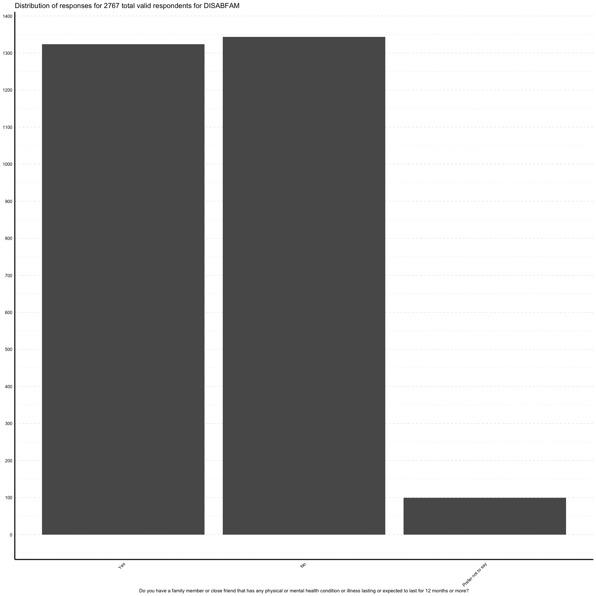<!-- -->

```
Frequencies  
DISABFAM  
Label: Do you have a family member or close friend that has any physical or mental health condition or illness lasting or expected to last for 12 months or more?  
Type: Factor  

                          Freq   % Valid   % Valid Cum.   % Total   % Total Cum.
----------------------- ------ --------- -------------- --------- --------------
                    Yes   1324     47.85          47.85     47.85          47.85
                     No   1344     48.57          96.42     48.57          96.42
      Prefer not to say     99      3.58         100.00      3.58         100.00
                   <NA>      0                               0.00         100.00
                  Total   2767    100.00         100.00    100.00         100.00
```

<!-- -->

```
Frequencies  
AID  
Label: Whether have caring responsibilities for someone with LT illness/disability inside/outside home  
Type: Factor  

                                   Freq   % Valid   % Valid Cum.   % Total   % Total Cum.
-------------------------------- ------ --------- -------------- --------- --------------
      No caring responsibilities   2254     83.51          83.51     81.46          81.46
       Caring responsibilit(ies)    445     16.49         100.00     16.08          97.54
                            <NA>     68                               2.46         100.00
                           Total   2767    100.00         100.00    100.00         100.00
```

<!-- -->

```
Frequencies  
HEALTH  
Label: To what extent do you agree or disagree - I am someone who looks after my health very well  
Type: Factor  

                          Freq   % Valid   % Valid Cum.   % Total   % Total Cum.
----------------------- ------ --------- -------------- --------- --------------
         Strongly agree    529     19.12          19.12     19.12          19.12
                  Agree   1523     55.04          74.16     55.04          74.16
               Disagree    646     23.35          97.51     23.35          97.51
      Strongly disagree     69      2.49         100.00      2.49         100.00
                   <NA>      0                               0.00         100.00
                  Total   2767    100.00         100.00    100.00         100.00
```

<!-- -->

```
Frequencies  
HRES_TOTAL  
Label: Summed score indicating research participation. Minimum value of 0 indicates no previous participation in research, maximum value of 3 indicates previous participation in survey, clinical trials and focus groups.  
Type: Numeric  

              Freq   % Valid   % Valid Cum.   % Total   % Total Cum.
----------- ------ --------- -------------- --------- --------------
          0   2767    100.00         100.00    100.00         100.00
       <NA>      0                               0.00         100.00
      Total   2767    100.00         100.00    100.00         100.00
```

<!-- -->

```
Frequencies  
HACT12_1  
Label: In the last 12 months, have you searched online for health-related information about...  
Type: Factor  

                                               Freq   % Valid   % Valid Cum.   % Total   % Total Cum.
-------------------------------------------- ------ --------- -------------- --------- --------------
                                    Covid-19    656     23.71          23.71     23.71          23.71
                        Another health topic    367     13.26          36.97     13.26          36.97
      Both Covid-19 AND another health topic   1329     48.03          85.00     48.03          85.00
                                     Neither    415     15.00         100.00     15.00         100.00
                                        <NA>      0                               0.00         100.00
                                       Total   2767    100.00         100.00    100.00         100.00
```

<!-- -->

```
Frequencies  
HACT12_2  
Label: In the last 12 months, have you read an article (in print or online) about...  
Type: Factor  

                                               Freq   % Valid   % Valid Cum.   % Total   % Total Cum.
-------------------------------------------- ------ --------- -------------- --------- --------------
                                    Covid-19    515     18.61          18.61     18.61          18.61
                        Another health topic    354     12.79          31.41     12.79          31.41
      Both Covid-19 AND another health topic   1598     57.75          89.16     57.75          89.16
                                     Neither    300     10.84         100.00     10.84         100.00
                                        <NA>      0                               0.00         100.00
                                       Total   2767    100.00         100.00    100.00         100.00
```

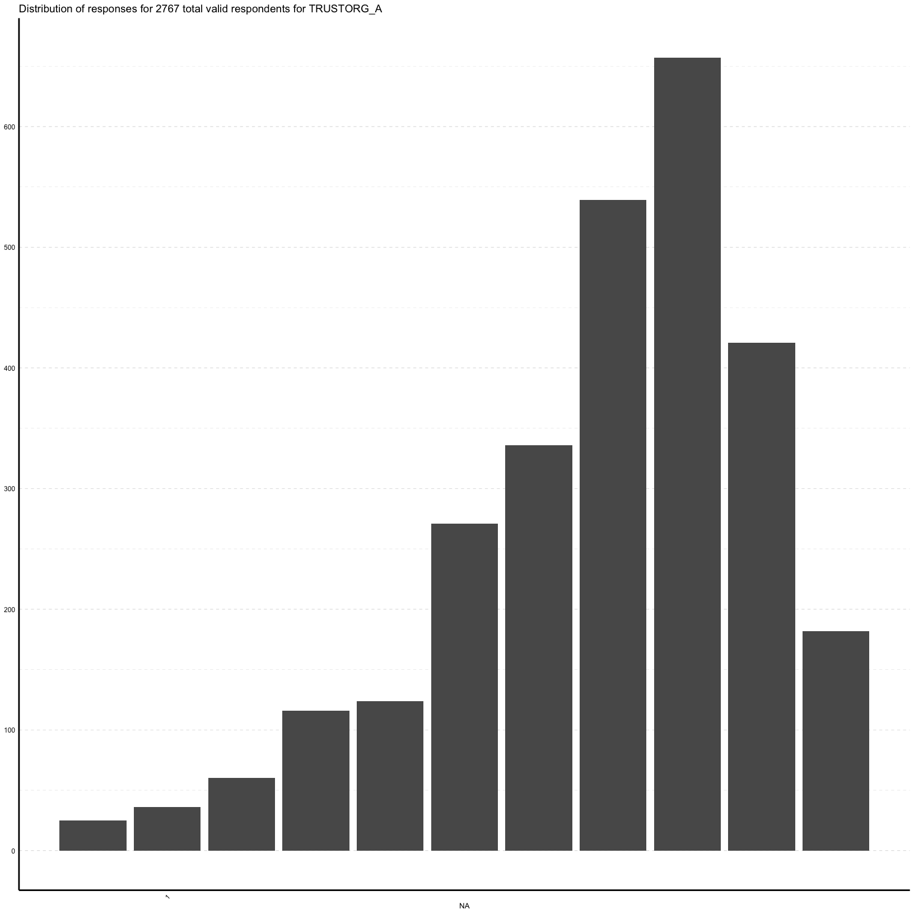<!-- -->

```
Frequencies  
HACT12_3  
Label: In the last 12 months, have you watched a TV programme, documentary, talk or online video (e.g. YouTube, Netflix) about…  
Type: Factor  

                                               Freq   % Valid   % Valid Cum.   % Total   % Total Cum.
-------------------------------------------- ------ --------- -------------- --------- --------------
                                    Covid-19    412     14.89          14.89     14.89          14.89
                        Another health topic    405     14.64          29.53     14.64          29.53
      Both Covid-19 AND another health topic   1077     38.92          68.45     38.92          68.45
                                     Neither    873     31.55         100.00     31.55         100.00
                                        <NA>      0                               0.00         100.00
                                       Total   2767    100.00         100.00    100.00         100.00
```

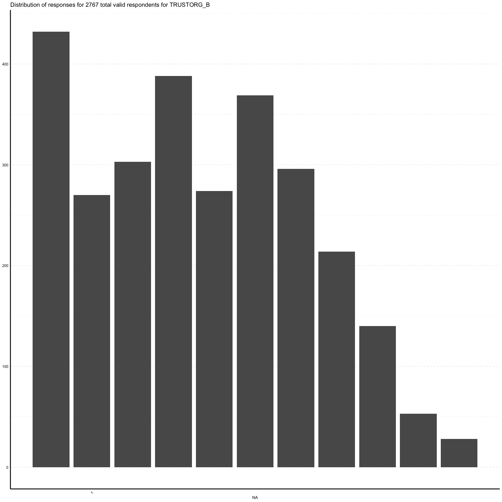<!-- -->

```
Frequencies  
HACT12_4  
Label: In the last 12 months, have you listened to a radio programme or podcast about…  
Type: Factor  

                                               Freq   % Valid   % Valid Cum.   % Total   % Total Cum.
-------------------------------------------- ------ --------- -------------- --------- --------------
                                    Covid-19    258      9.32           9.32      9.32           9.32
                        Another health topic    210      7.59          16.91      7.59          16.91
      Both Covid-19 AND another health topic    630     22.77          39.68     22.77          39.68
                                     Neither   1669     60.32         100.00     60.32         100.00
                                        <NA>      0                               0.00         100.00
                                       Total   2767    100.00         100.00    100.00         100.00
```

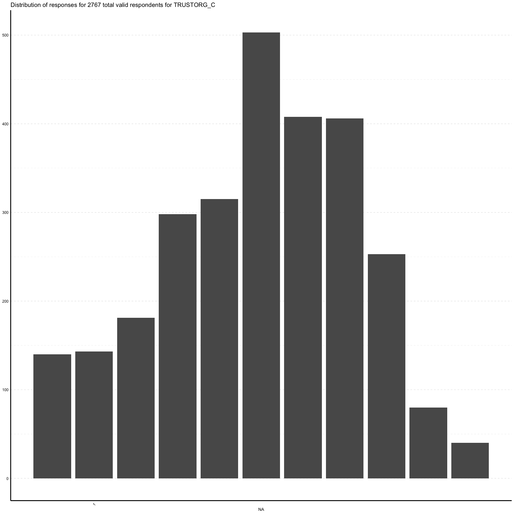<!-- -->

```
Frequencies  
TRUSTGEN  
Label: How much do you trust most people  
Type: Numeric  

              Freq   % Valid   % Valid Cum.   % Total   % Total Cum.
----------- ------ --------- -------------- --------- --------------
          0     31      1.12           1.12      1.12           1.12
          1     57      2.06           3.18      2.06           3.18
          2    148      5.35           8.53      5.35           8.53
          3    196      7.08          15.61      7.08          15.61
          4    193      6.98          22.59      6.98          22.59
          5    405     14.64          37.22     14.64          37.22
          6    414     14.96          52.19     14.96          52.19
          7    769     27.79          79.98     27.79          79.98
          8    448     16.19          96.17     16.19          96.17
          9     80      2.89          99.06      2.89          99.06
         10     26      0.94         100.00      0.94         100.00
       <NA>      0                               0.00         100.00
      Total   2767    100.00         100.00    100.00         100.00
```

<!-- -->

```
Frequencies  
TRUSTORG_A  
Label: How much do you trust the NHS  
Type: Numeric  

              Freq   % Valid   % Valid Cum.   % Total   % Total Cum.
----------- ------ --------- -------------- --------- --------------
          0     25      0.90           0.90      0.90           0.90
          1     36      1.30           2.20      1.30           2.20
          2     60      2.17           4.37      2.17           4.37
          3    116      4.19           8.57      4.19           8.57
          4    124      4.48          13.05      4.48          13.05
          5    271      9.79          22.84      9.79          22.84
          6    336     12.14          34.98     12.14          34.98
          7    539     19.48          54.46     19.48          54.46
          8    657     23.74          78.21     23.74          78.21
          9    421     15.22          93.42     15.22          93.42
         10    182      6.58         100.00      6.58         100.00
       <NA>      0                               0.00         100.00
      Total   2767    100.00         100.00    100.00         100.00
```

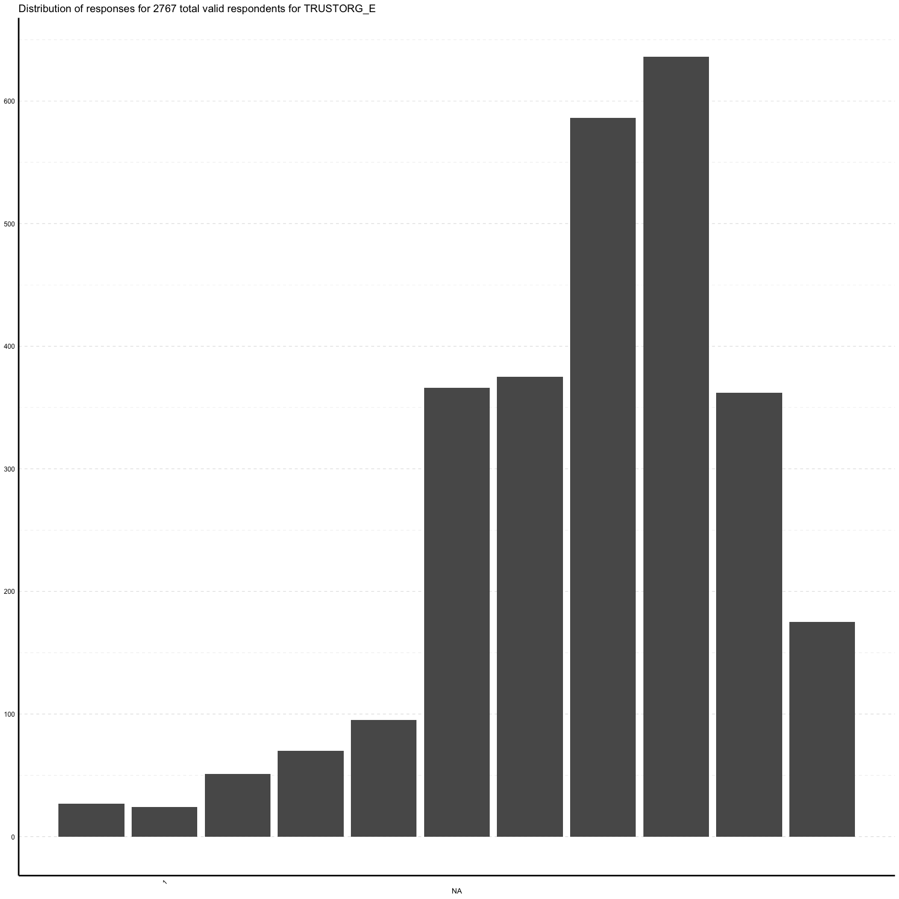<!-- -->

```
Frequencies  
TRUSTORG_B  
Label: How much do you trust the Government  
Type: Numeric  

              Freq   % Valid   % Valid Cum.   % Total   % Total Cum.
----------- ------ --------- -------------- --------- --------------
          0    432     15.61          15.61     15.61          15.61
          1    270      9.76          25.37      9.76          25.37
          2    303     10.95          36.32     10.95          36.32
          3    388     14.02          50.34     14.02          50.34
          4    274      9.90          60.25      9.90          60.25
          5    369     13.34          73.58     13.34          73.58
          6    296     10.70          84.28     10.70          84.28
          7    214      7.73          92.01      7.73          92.01
          8    140      5.06          97.07      5.06          97.07
          9     53      1.92          98.99      1.92          98.99
         10     28      1.01         100.00      1.01         100.00
       <NA>      0                               0.00         100.00
      Total   2767    100.00         100.00    100.00         100.00
```

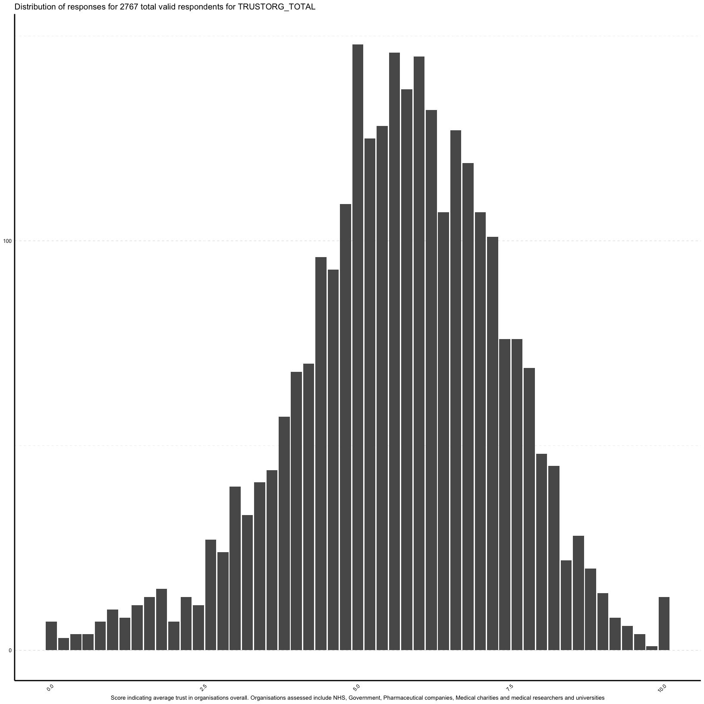<!-- -->

```
Frequencies  
TRUSTORG_C  
Label: How much do you trust Pharmaceutical companies  
Type: Numeric  

              Freq   % Valid   % Valid Cum.   % Total   % Total Cum.
----------- ------ --------- -------------- --------- --------------
          0    140      5.06           5.06      5.06           5.06
          1    143      5.17          10.23      5.17          10.23
          2    181      6.54          16.77      6.54          16.77
          3    298     10.77          27.54     10.77          27.54
          4    315     11.38          38.92     11.38          38.92
          5    503     18.18          57.10     18.18          57.10
          6    408     14.75          71.85     14.75          71.85
          7    406     14.67          86.52     14.67          86.52
          8    253      9.14          95.66      9.14          95.66
          9     80      2.89          98.55      2.89          98.55
         10     40      1.45         100.00      1.45         100.00
       <NA>      0                               0.00         100.00
      Total   2767    100.00         100.00    100.00         100.00
```

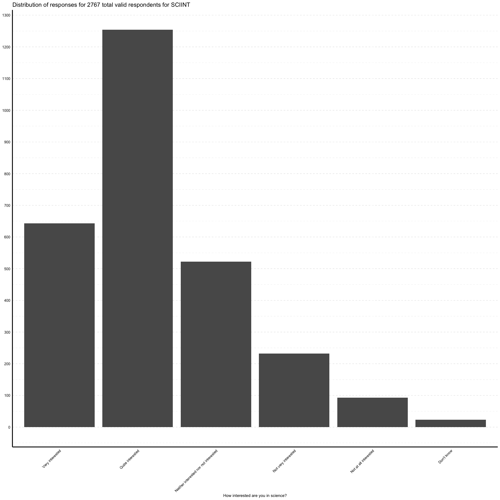<!-- -->

```
Frequencies  
TRUSTORG_D  
Label: How much do you trust Medical charities  
Type: Numeric  

              Freq   % Valid   % Valid Cum.   % Total   % Total Cum.
----------- ------ --------- -------------- --------- --------------
          0     57      2.06           2.06      2.06           2.06
          1     45      1.63           3.69      1.63           3.69
          2     89      3.22           6.90      3.22           6.90
          3    163      5.89          12.79      5.89          12.79
          4    215      7.77          20.56      7.77          20.56
          5    528     19.08          39.65     19.08          39.65
          6    450     16.26          55.91     16.26          55.91
          7    544     19.66          75.57     19.66          75.57
          8    435     15.72          91.29     15.72          91.29
          9    173      6.25          97.54      6.25          97.54
         10     68      2.46         100.00      2.46         100.00
       <NA>      0                               0.00         100.00
      Total   2767    100.00         100.00    100.00         100.00
```

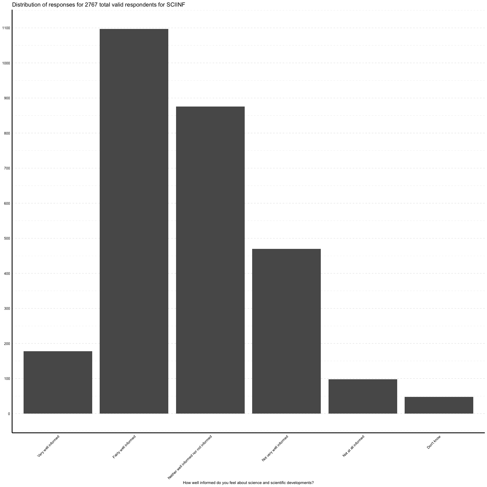<!-- -->

```
Frequencies  
TRUSTORG_E  
Label: How much do you trust Medical researchers in universities  
Type: Numeric  

              Freq   % Valid   % Valid Cum.   % Total   % Total Cum.
----------- ------ --------- -------------- --------- --------------
          0     27      0.98           0.98      0.98           0.98
          1     24      0.87           1.84      0.87           1.84
          2     51      1.84           3.69      1.84           3.69
          3     70      2.53           6.22      2.53           6.22
          4     95      3.43           9.65      3.43           9.65
          5    366     13.23          22.88     13.23          22.88
          6    375     13.55          36.43     13.55          36.43
          7    586     21.18          57.61     21.18          57.61
          8    636     22.99          80.59     22.99          80.59
          9    362     13.08          93.68     13.08          93.68
         10    175      6.32         100.00      6.32         100.00
       <NA>      0                               0.00         100.00
      Total   2767    100.00         100.00    100.00         100.00
```

<!-- -->

```
Frequencies  
SCIINT  
Label: How interested are you in science?  
Type: Factor  

                                              Freq   % Valid   % Valid Cum.   % Total   % Total Cum.
------------------------------------------- ------ --------- -------------- --------- --------------
                            Very interested    643     23.24          23.24     23.24          23.24
                           Quite interested   1254     45.32          68.56     45.32          68.56
      Neither interested nor not interested    522     18.87          87.42     18.87          87.42
                        Not very interested    232      8.38          95.81      8.38          95.81
                      Not at all interested     93      3.36          99.17      3.36          99.17
                                 Don't know     23      0.83         100.00      0.83         100.00
                                       <NA>      0                               0.00         100.00
                                      Total   2767    100.00         100.00    100.00         100.00
```

<!-- -->

```
Frequencies  
SCIINF  
Label: How well informed do you feel about science and scientific developments?  
Type: Factor  

                                               Freq   % Valid   % Valid Cum.   % Total   % Total Cum.
-------------------------------------------- ------ --------- -------------- --------- --------------
                          Very well informed    178      6.43           6.43      6.43           6.43
                        Fairly well informed   1097     39.65          46.08     39.65          46.08
      Neither well informed nor not informed    876     31.66          77.74     31.66          77.74
                      Not very well informed    470     16.99          94.72     16.99          94.72
                         Not at all informed     98      3.54          98.27      3.54          98.27
                                  Don't know     48      1.73         100.00      1.73         100.00
                                        <NA>      0                               0.00         100.00
                                       Total   2767    100.00         100.00    100.00         100.00
```

<!-- -->

```
Frequencies  
SCITRUST_TOTAL  
Label: Composite score indicating trust or distrust in science overall. A negative score indicates greater distrust overall and a positive score indicates greater trust overall.  
Type: Numeric  

              Freq   % Valid   % Valid Cum.   % Total   % Total Cum.
----------- ------ --------- -------------- --------- --------------
         -6      3      0.11           0.11      0.11           0.11
         -5      4      0.14           0.25      0.14           0.25
         -4     12      0.43           0.69      0.43           0.69
         -3     26      0.94           1.63      0.94           1.63
         -2     59      2.13           3.76      2.13           3.76
         -1    115      4.16           7.91      4.16           7.91
          0    441     15.94          23.85     15.94          23.85
          1    453     16.37          40.22     16.37          40.22
          2    576     20.82          61.04     20.82          61.04
          3    633     22.88          83.92     22.88          83.92
          4    226      8.17          92.09      8.17          92.09
          5    153      5.53          97.61      5.53          97.61
          6     66      2.39         100.00      2.39         100.00
       <NA>      0                               0.00         100.00
      Total   2767    100.00         100.00    100.00         100.00
```

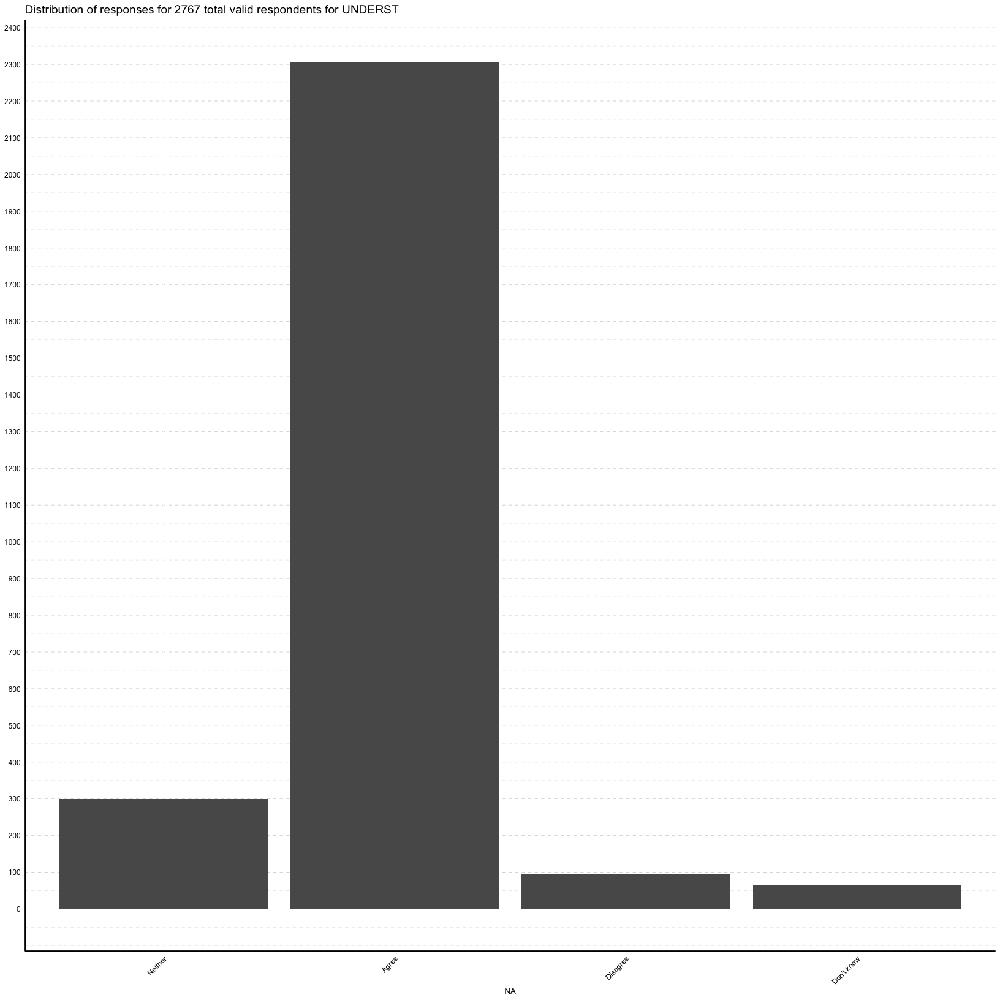<!-- -->

```
Frequencies  
COVRES  
Label: How much do you think scientific medical research has helped prevent and treat COVID-19?  
Type: Factor  

                      Freq   % Valid   % Valid Cum.   % Total   % Total Cum.
------------------- ------ --------- -------------- --------- --------------
              A lot   1217     43.98          43.98     43.98          43.98
        Quite a lot   1060     38.31          82.29     38.31          82.29
      Not very much    306     11.06          93.35     11.06          93.35
         Not at all     71      2.57          95.92      2.57          95.92
         Don't know    113      4.08         100.00      4.08         100.00
               <NA>      0                               0.00         100.00
              Total   2767    100.00         100.00    100.00         100.00
```

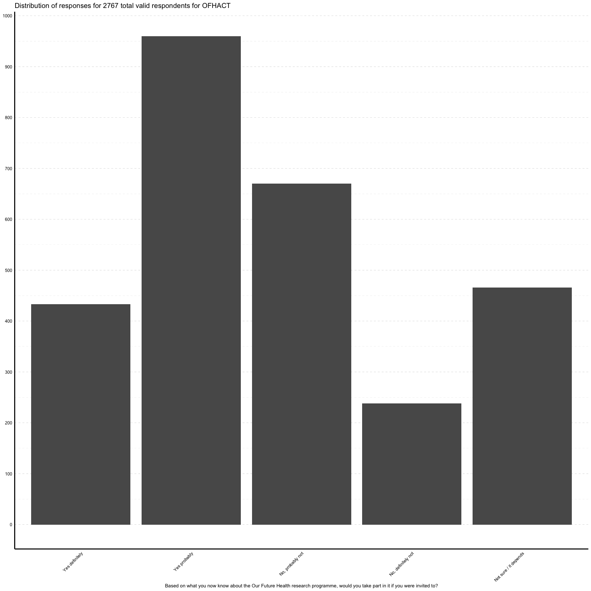<!-- -->

```
Frequencies  
OFHAWARE  
Label: Have you heard of the Our Future Health research programme?  
Type: Factor  

                 Freq   % Valid   % Valid Cum.   % Total   % Total Cum.
-------------- ------ --------- -------------- --------- --------------
           Yes    119      4.30           4.30      4.30           4.30
            No   2552     92.23          96.53     92.23          96.53
      Not sure     96      3.47         100.00      3.47         100.00
          <NA>      0                               0.00         100.00
         Total   2767    100.00         100.00    100.00         100.00
```

<!-- -->

```
Frequencies  
UNDERST  
Label: To what extent do you agree or disagree - I understand what I would be asked to do if I joined the Our Future Health research programme  
Type: Factor  

                                   Freq   % Valid   % Valid Cum.   % Total   % Total Cum.
-------------------------------- ------ --------- -------------- --------- --------------
                  Strongly agree    754     27.25          27.25     27.25          27.25
                           Agree   1552     56.09          83.34     56.09          83.34
      Neither agree nor disagree    300     10.84          94.18     10.84          94.18
                        Disagree     70      2.53          96.71      2.53          96.71
               Strongly disagree     26      0.94          97.65      0.94          97.65
                      Don't know     65      2.35         100.00      2.35         100.00
                            <NA>      0                               0.00         100.00
                           Total   2767    100.00         100.00    100.00         100.00
```

<!-- -->

```
Frequencies  
OFHACT  
Label: Based on what you now know about the Our Future Health research programme, would you take part in it if you were invited to?  
Type: Factor  

                              Freq   % Valid   % Valid Cum.   % Total   % Total Cum.
--------------------------- ------ --------- -------------- --------- --------------
             Yes definitely    433     15.65          15.65     15.65          15.65
               Yes probably    960     34.69          50.34     34.69          50.34
           No, probably not    670     24.21          74.56     24.21          74.56
         No, definitely not    238      8.60          83.16      8.60          83.16
      Not sure / it depends    466     16.84         100.00     16.84         100.00
                       <NA>      0                               0.00         100.00
                      Total   2767    100.00         100.00    100.00         100.00
```

<!-- -->

```
Frequencies  
OFHPAIR_A  
Label: How negative or positive do you feel about the idea of taking part in the Our Future Health research programme?  
Type: Factor  

                     Freq   % Valid   % Valid Cum.   % Total   % Total Cum.
------------------ ------ --------- -------------- --------- --------------
      1 - Negative    143      5.17           5.17      5.17           5.17
                 2    179      6.47          11.64      6.47          11.64
                 3    306     11.06          22.70     11.06          22.70
                 4    485     17.53          40.22     17.53          40.22
                 5    694     25.08          65.31     25.08          65.31
                 6    622     22.48          87.78     22.48          87.78
      7 - Positive    338     12.22         100.00     12.22         100.00
              <NA>      0                               0.00         100.00
             Total   2767    100.00         100.00    100.00         100.00
```

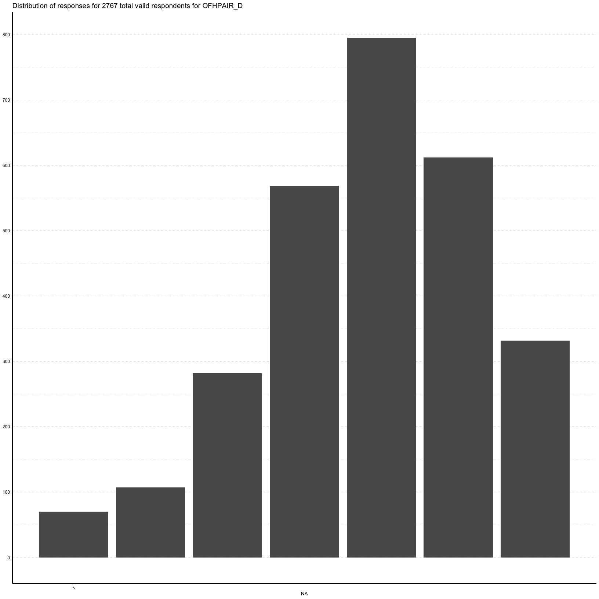<!-- -->

```
Frequencies  
OFHPAIR_B  
Label: How confusing or straightforward do you feel that taking part in the Our Future Health research programme would be?  
Type: Factor  

                            Freq   % Valid   % Valid Cum.   % Total   % Total Cum.
------------------------- ------ --------- -------------- --------- --------------
            1 - Confusing     50      1.81           1.81      1.81           1.81
                        2     92      3.32           5.13      3.32           5.13
                        3    247      8.93          14.06      8.93          14.06
                        4    492     17.78          31.84     17.78          31.84
                        5    751     27.14          58.98     27.14          58.98
                        6    713     25.77          84.75     25.77          84.75
      7 - Straightforward    422     15.25         100.00     15.25         100.00
                     <NA>      0                               0.00         100.00
                    Total   2767    100.00         100.00    100.00         100.00
```

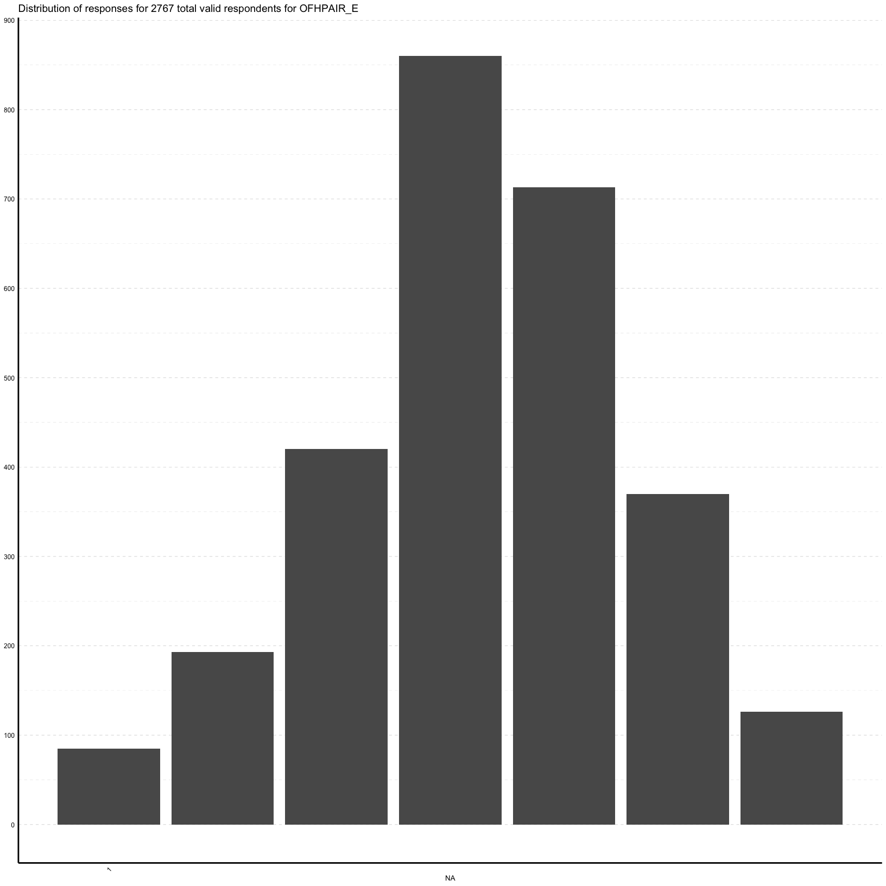<!-- -->

```
Frequencies  
OFHPAIR_C  
Label: How boring or interesting do you think taking part in the Our Future Health research programme would be?  
Type: Factor  

                        Freq   % Valid   % Valid Cum.   % Total   % Total Cum.
--------------------- ------ --------- -------------- --------- --------------
           1 - Boring     61      2.20           2.20      2.20           2.20
                    2    107      3.87           6.07      3.87           6.07
                    3    233      8.42          14.49      8.42          14.49
                    4    582     21.03          35.53     21.03          35.53
                    5    781     28.23          63.75     28.23          63.75
                    6    603     21.79          85.54     21.79          85.54
      7 - Interesting    400     14.46         100.00     14.46         100.00
                 <NA>      0                               0.00         100.00
                Total   2767    100.00         100.00    100.00         100.00
```

<!-- -->

```
Frequencies  
OFHPAIR_D  
Label: How hard or easy do you think taking part in the Our Future Health research programme would be?  
Type: Factor  

                 Freq   % Valid   % Valid Cum.   % Total   % Total Cum.
-------------- ------ --------- -------------- --------- --------------
      1 - Hard     70      2.53           2.53      2.53           2.53
             2    107      3.87           6.40      3.87           6.40
             3    282     10.19          16.59     10.19          16.59
             4    569     20.56          37.15     20.56          37.15
             5    795     28.73          65.88     28.73          65.88
             6    612     22.12          88.00     22.12          88.00
      7 - Easy    332     12.00         100.00     12.00         100.00
          <NA>      0                               0.00         100.00
         Total   2767    100.00         100.00    100.00         100.00
```

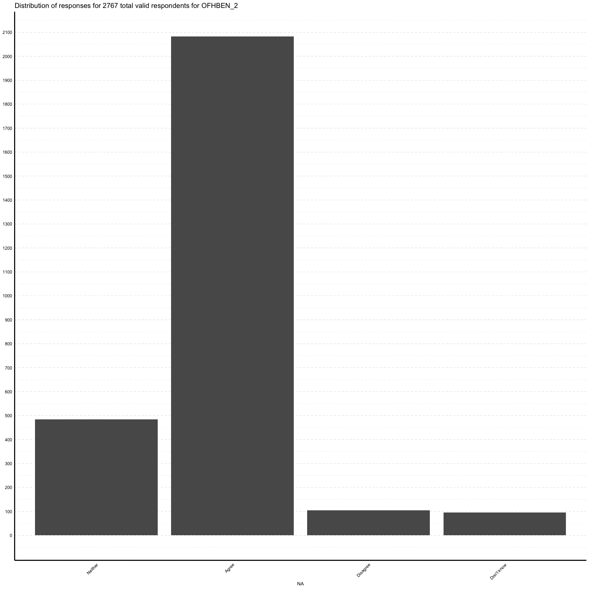<!-- -->

```
Frequencies  
OFHPAIR_E  
Label: How slow or fast you think taking part in the Our Future Health research programme would be?  
Type: Factor  

                 Freq   % Valid   % Valid Cum.   % Total   % Total Cum.
-------------- ------ --------- -------------- --------- --------------
      1 - Slow     85      3.07           3.07      3.07           3.07
             2    193      6.98          10.05      6.98          10.05
             3    420     15.18          25.23     15.18          25.23
             4    860     31.08          56.31     31.08          56.31
             5    713     25.77          82.07     25.77          82.07
             6    370     13.37          95.45     13.37          95.45
      7 - Fast    126      4.55         100.00      4.55         100.00
          <NA>      0                               0.00         100.00
         Total   2767    100.00         100.00    100.00         100.00
```

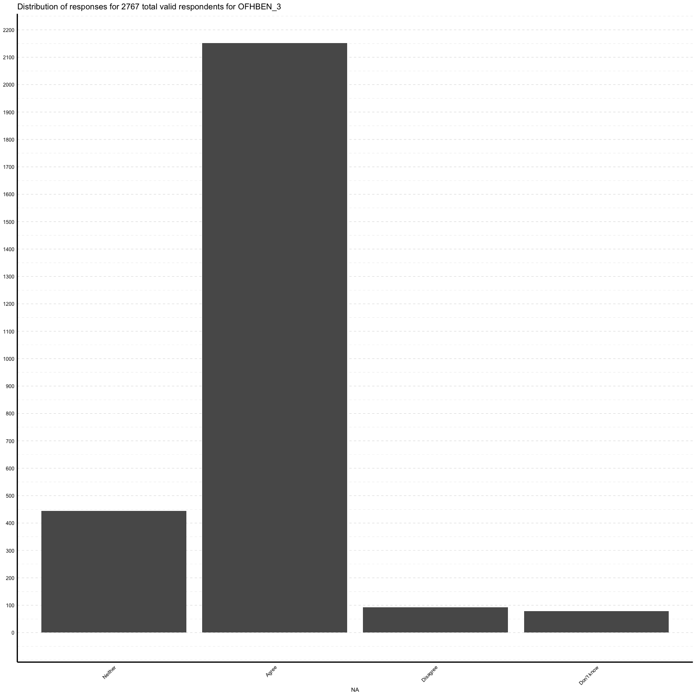<!-- -->

```
Frequencies  
OFHBEN_1  
Label: OFH will... advance medical research  
Type: Factor  

                                   Freq   % Valid   % Valid Cum.   % Total   % Total Cum.
-------------------------------- ------ --------- -------------- --------- --------------
                  Strongly agree    670     24.21          24.21     24.21          24.21
                           Agree   1329     48.03          72.24     48.03          72.24
      Neither agree nor disagree    549     19.84          92.09     19.84          92.09
                        Disagree     57      2.06          94.15      2.06          94.15
               Strongly disagree     58      2.10          96.24      2.10          96.24
                      Don't know    104      3.76         100.00      3.76         100.00
                            <NA>      0                               0.00         100.00
                           Total   2767    100.00         100.00    100.00         100.00
```

<!-- -->

```
Frequencies  
OFHBEN_2  
Label: OFH will... better treatments  
Type: Factor  

                                   Freq   % Valid   % Valid Cum.   % Total   % Total Cum.
-------------------------------- ------ --------- -------------- --------- --------------
                  Strongly agree    625     22.59          22.59     22.59          22.59
                           Agree   1457     52.66          75.24     52.66          75.24
      Neither agree nor disagree    484     17.49          92.74     17.49          92.74
                        Disagree     63      2.28          95.01      2.28          95.01
               Strongly disagree     42      1.52          96.53      1.52          96.53
                      Don't know     96      3.47         100.00      3.47         100.00
                            <NA>      0                               0.00         100.00
                           Total   2767    100.00         100.00    100.00         100.00
```

<!-- -->

```
Frequencies  
OFHBEN_3  
Label: OFH will... early detection  
Type: Factor  

                                   Freq   % Valid   % Valid Cum.   % Total   % Total Cum.
-------------------------------- ------ --------- -------------- --------- --------------
                  Strongly agree    675     24.39          24.39     24.39          24.39
                           Agree   1476     53.34          77.74     53.34          77.74
      Neither agree nor disagree    445     16.08          93.82     16.08          93.82
                        Disagree     55      1.99          95.81      1.99          95.81
               Strongly disagree     38      1.37          97.18      1.37          97.18
                      Don't know     78      2.82         100.00      2.82         100.00
                            <NA>      0                               0.00         100.00
                           Total   2767    100.00         100.00    100.00         100.00
```

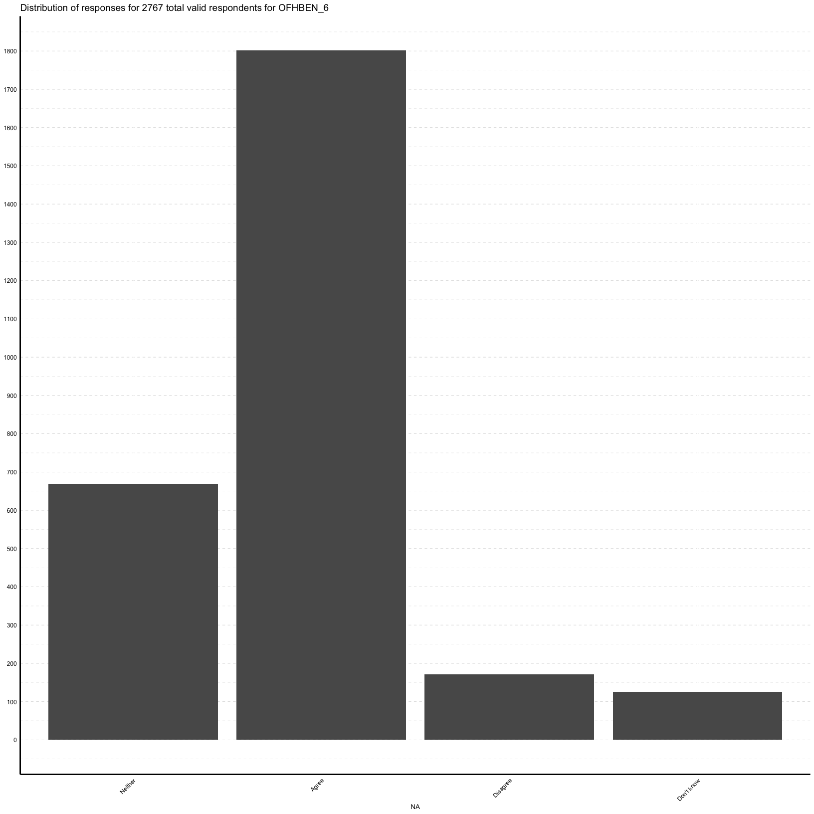<!-- -->

```
Frequencies  
OFHBEN_4  
Label: OFH will... help me  
Type: Factor  

                                   Freq   % Valid   % Valid Cum.   % Total   % Total Cum.
-------------------------------- ------ --------- -------------- --------- --------------
                  Strongly agree    248      8.96           8.96      8.96           8.96
                           Agree    765     27.65          36.61     27.65          36.61
      Neither agree nor disagree   1086     39.25          75.86     39.25          75.86
                        Disagree    393     14.20          90.06     14.20          90.06
               Strongly disagree    119      4.30          94.36      4.30          94.36
                      Don't know    156      5.64         100.00      5.64         100.00
                            <NA>      0                               0.00         100.00
                           Total   2767    100.00         100.00    100.00         100.00
```

<!-- -->

```
Frequencies  
OFHBEN_5  
Label: OFH will... help family/friends  
Type: Factor  

                                   Freq   % Valid   % Valid Cum.   % Total   % Total Cum.
-------------------------------- ------ --------- -------------- --------- --------------
                  Strongly agree    324     11.71          11.71     11.71          11.71
                           Agree   1087     39.28          50.99     39.28          50.99
      Neither agree nor disagree    916     33.10          84.10     33.10          84.10
                        Disagree    215      7.77          91.87      7.77          91.87
               Strongly disagree     82      2.96          94.83      2.96          94.83
                      Don't know    143      5.17         100.00      5.17         100.00
                            <NA>      0                               0.00         100.00
                           Total   2767    100.00         100.00    100.00         100.00
```

<!-- -->

```
Frequencies  
OFHBEN_6  
Label: OFH will... help community  
Type: Factor  

                                   Freq   % Valid   % Valid Cum.   % Total   % Total Cum.
-------------------------------- ------ --------- -------------- --------- --------------
                  Strongly agree    416     15.03          15.03     15.03          15.03
                           Agree   1385     50.05          65.09     50.05          65.09
      Neither agree nor disagree    669     24.18          89.27     24.18          89.27
                        Disagree    116      4.19          93.46      4.19          93.46
               Strongly disagree     55      1.99          95.45      1.99          95.45
                      Don't know    126      4.55         100.00      4.55         100.00
                            <NA>      0                               0.00         100.00
                           Total   2767    100.00         100.00    100.00         100.00
```

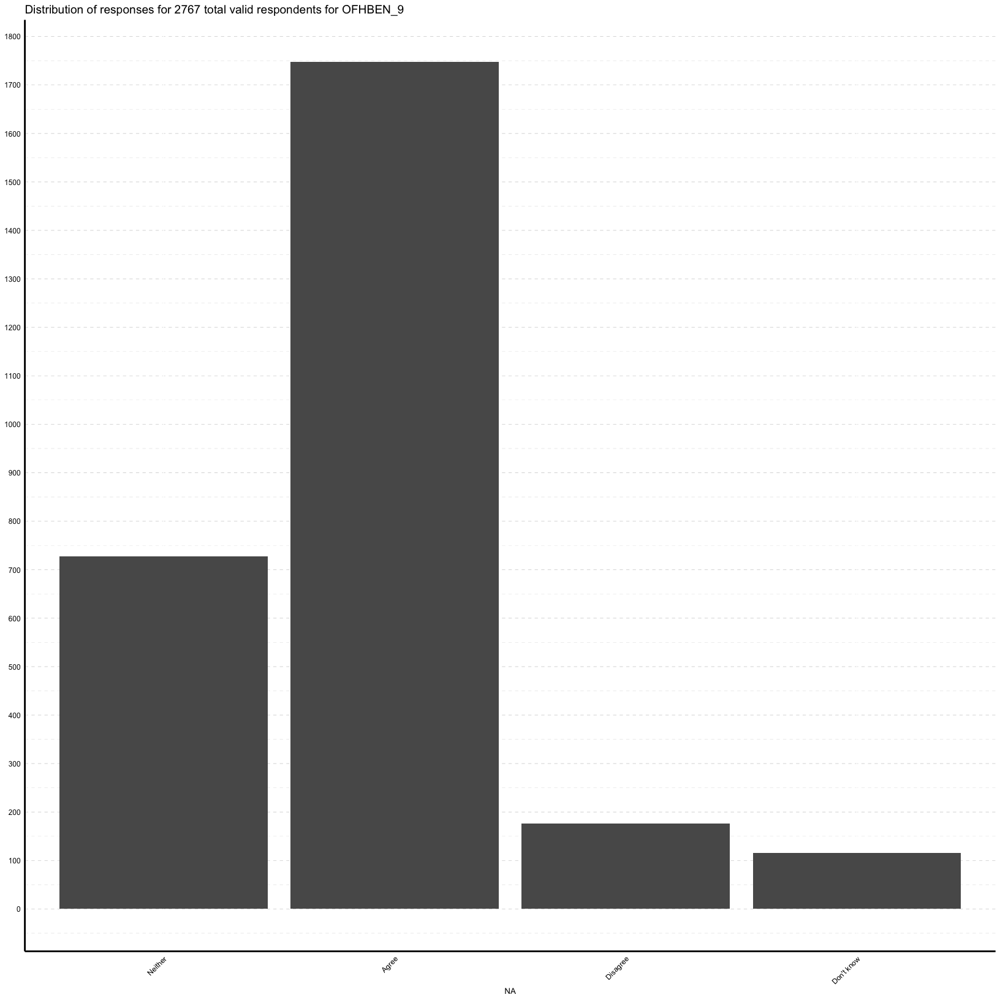<!-- -->

```
Frequencies  
OFHBEN_7  
Label: OFH will... help people in UK  
Type: Factor  

                                   Freq   % Valid   % Valid Cum.   % Total   % Total Cum.
-------------------------------- ------ --------- -------------- --------- --------------
                  Strongly agree    530     19.15          19.15     19.15          19.15
                           Agree   1506     54.43          73.58     54.43          73.58
      Neither agree nor disagree    525     18.97          92.56     18.97          92.56
                        Disagree     67      2.42          94.98      2.42          94.98
               Strongly disagree     44      1.59          96.57      1.59          96.57
                      Don't know     95      3.43         100.00      3.43         100.00
                            <NA>      0                               0.00         100.00
                           Total   2767    100.00         100.00    100.00         100.00
```

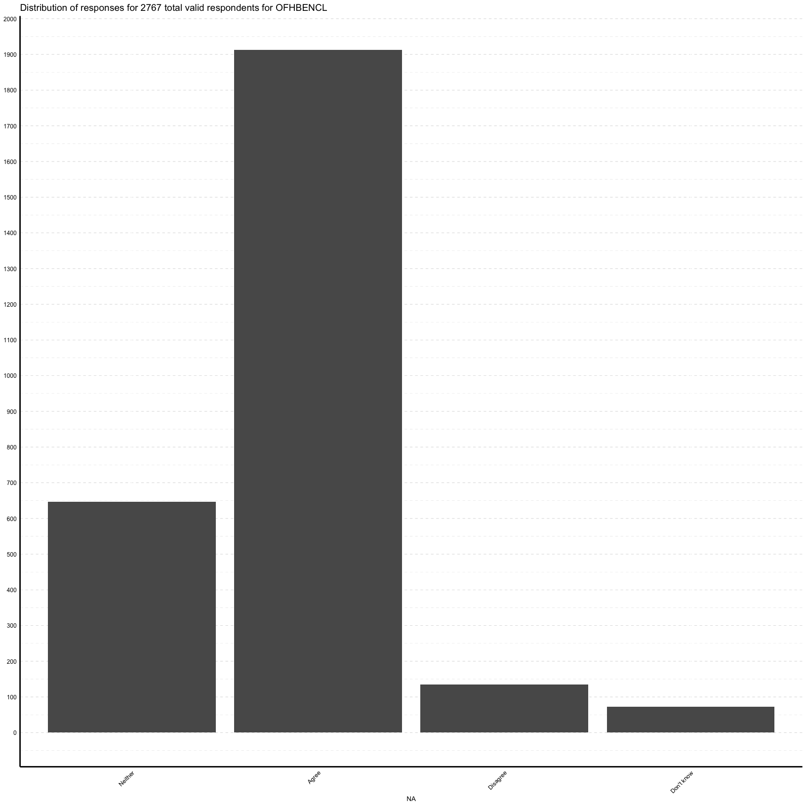<!-- -->

```
Frequencies  
OFHBEN_8  
Label: OFH will... help people in world  
Type: Factor  

                                   Freq   % Valid   % Valid Cum.   % Total   % Total Cum.
-------------------------------- ------ --------- -------------- --------- --------------
                  Strongly agree    512     18.50          18.50     18.50          18.50
                           Agree   1397     50.49          68.99     50.49          68.99
      Neither agree nor disagree    593     21.43          90.42     21.43          90.42
                        Disagree     93      3.36          93.78      3.36          93.78
               Strongly disagree     48      1.73          95.52      1.73          95.52
                      Don't know    124      4.48         100.00      4.48         100.00
                            <NA>      0                               0.00         100.00
                           Total   2767    100.00         100.00    100.00         100.00
```

<!-- -->

```
Frequencies  
OFHBEN_9  
Label: OFH will... help representation of people like me  
Type: Factor  

                                   Freq   % Valid   % Valid Cum.   % Total   % Total Cum.
-------------------------------- ------ --------- -------------- --------- --------------
                  Strongly agree    476     17.20          17.20     17.20          17.20
                           Agree   1271     45.93          63.14     45.93          63.14
      Neither agree nor disagree    728     26.31          89.45     26.31          89.45
                        Disagree    114      4.12          93.57      4.12          93.57
               Strongly disagree     62      2.24          95.81      2.24          95.81
                      Don't know    116      4.19         100.00      4.19         100.00
                            <NA>      0                               0.00         100.00
                           Total   2767    100.00         100.00    100.00         100.00
```

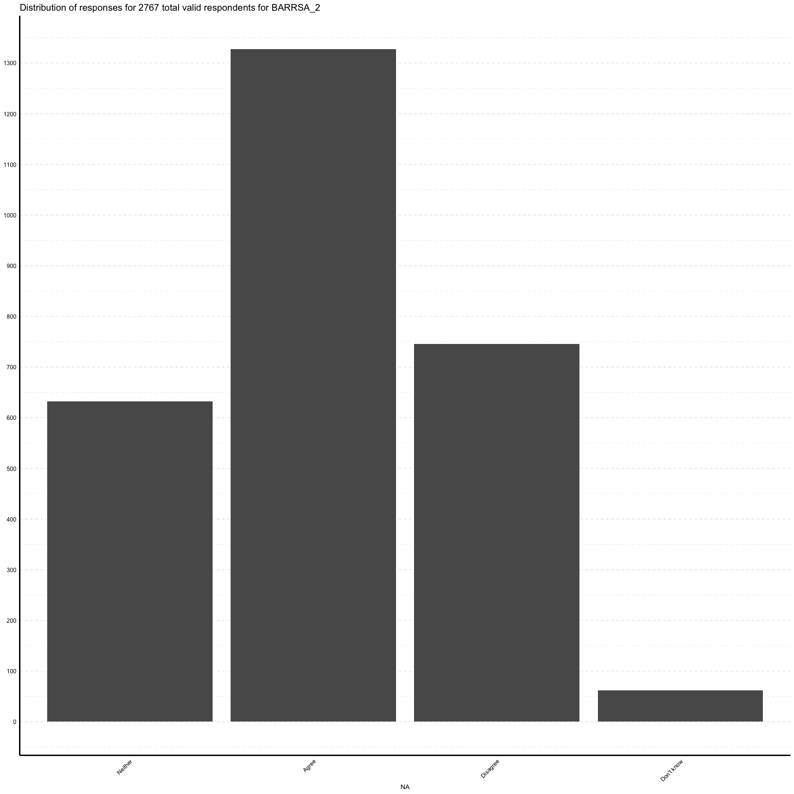<!-- -->

```
Frequencies  
OFHBENCL  
Label: The potential benefits of taking part in the Our Future Health research programme are clear to me  
Type: Factor  

                                   Freq   % Valid   % Valid Cum.   % Total   % Total Cum.
-------------------------------- ------ --------- -------------- --------- --------------
                  Strongly agree    463     16.73          16.73     16.73          16.73
                           Agree   1449     52.37          69.10     52.37          69.10
      Neither agree nor disagree    647     23.38          92.48     23.38          92.48
                        Disagree    107      3.87          96.35      3.87          96.35
               Strongly disagree     28      1.01          97.36      1.01          97.36
                      Don't know     73      2.64         100.00      2.64         100.00
                            <NA>      0                               0.00         100.00
                           Total   2767    100.00         100.00    100.00         100.00
```

<!-- -->

```
Frequencies  
BARRSA_1  
Label: Comfortable health info in large database  
Type: Factor  

                                   Freq   % Valid   % Valid Cum.   % Total   % Total Cum.
-------------------------------- ------ --------- -------------- --------- --------------
                  Strongly agree    288     10.41          10.41     10.41          10.41
                           Agree    886     32.02          42.43     32.02          42.43
      Neither agree nor disagree    635     22.95          65.38     22.95          65.38
                        Disagree    496     17.93          83.30     17.93          83.30
               Strongly disagree    384     13.88          97.18     13.88          97.18
                      Don't know     78      2.82         100.00      2.82         100.00
                            <NA>      0                               0.00         100.00
                           Total   2767    100.00         100.00    100.00         100.00
```

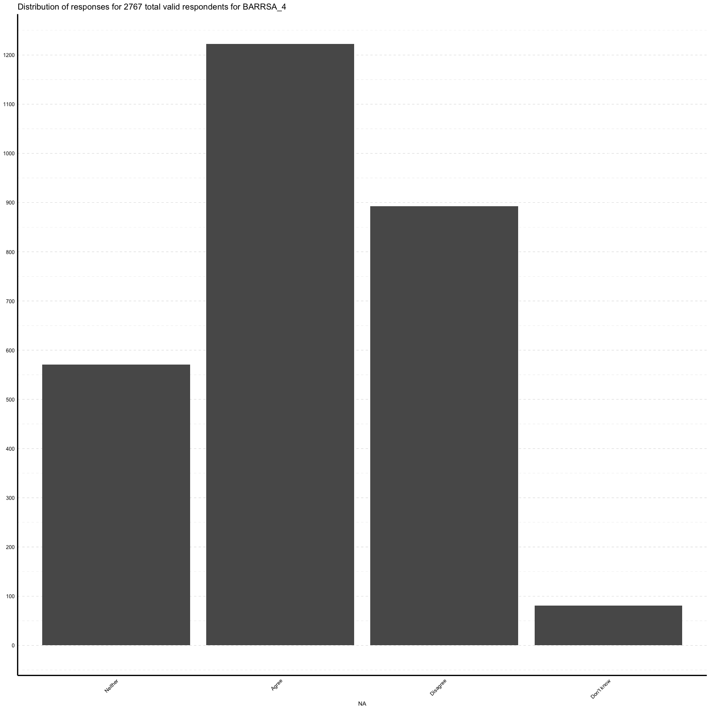<!-- -->

```
Frequencies  
BARRSA_2  
Label: Comfortable share health info with OFH  
Type: Factor  

                                   Freq   % Valid   % Valid Cum.   % Total   % Total Cum.
-------------------------------- ------ --------- -------------- --------- --------------
                  Strongly agree    294     10.63          10.63     10.63          10.63
                           Agree   1033     37.33          47.96     37.33          47.96
      Neither agree nor disagree    632     22.84          70.80     22.84          70.80
                        Disagree    427     15.43          86.23     15.43          86.23
               Strongly disagree    319     11.53          97.76     11.53          97.76
                      Don't know     62      2.24         100.00      2.24         100.00
                            <NA>      0                               0.00         100.00
                           Total   2767    100.00         100.00    100.00         100.00
```

<!-- -->

```
Frequencies  
BARRSA_3  
Label: Comfortable how OFH use health info  
Type: Factor  

                                   Freq   % Valid   % Valid Cum.   % Total   % Total Cum.
-------------------------------- ------ --------- -------------- --------- --------------
                  Strongly agree    278     10.05          10.05     10.05          10.05
                           Agree   1034     37.37          47.42     37.37          47.42
      Neither agree nor disagree    669     24.18          71.59     24.18          71.59
                        Disagree    420     15.18          86.77     15.18          86.77
               Strongly disagree    282     10.19          96.96     10.19          96.96
                      Don't know     84      3.04         100.00      3.04         100.00
                            <NA>      0                               0.00         100.00
                           Total   2767    100.00         100.00    100.00         100.00
```

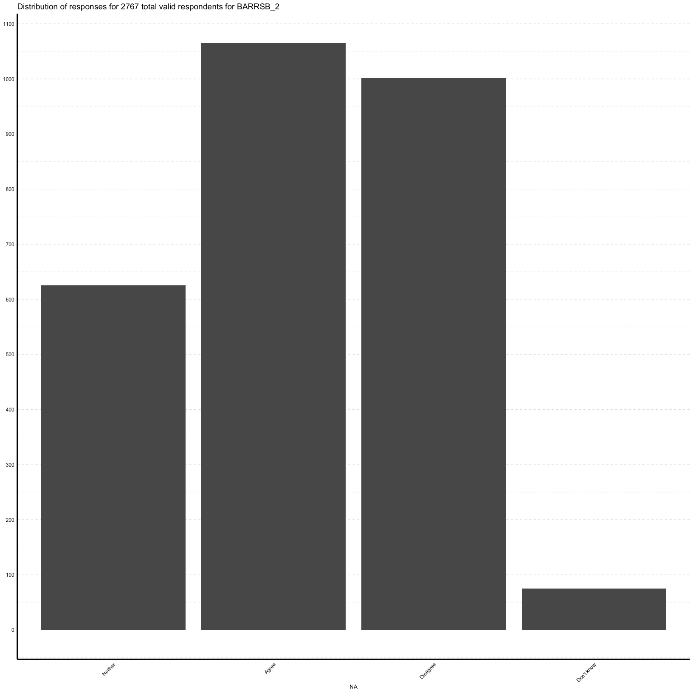<!-- -->

```
Frequencies  
BARRSA_4  
Label: Comfortable OFH access to medical records  
Type: Factor  

                                   Freq   % Valid   % Valid Cum.   % Total   % Total Cum.
-------------------------------- ------ --------- -------------- --------- --------------
                  Strongly agree    266      9.61           9.61      9.61           9.61
                           Agree    956     34.55          44.16     34.55          44.16
      Neither agree nor disagree    571     20.64          64.80     20.64          64.80
                        Disagree    523     18.90          83.70     18.90          83.70
               Strongly disagree    370     13.37          97.07     13.37          97.07
                      Don't know     81      2.93         100.00      2.93         100.00
                            <NA>      0                               0.00         100.00
                           Total   2767    100.00         100.00    100.00         100.00
```

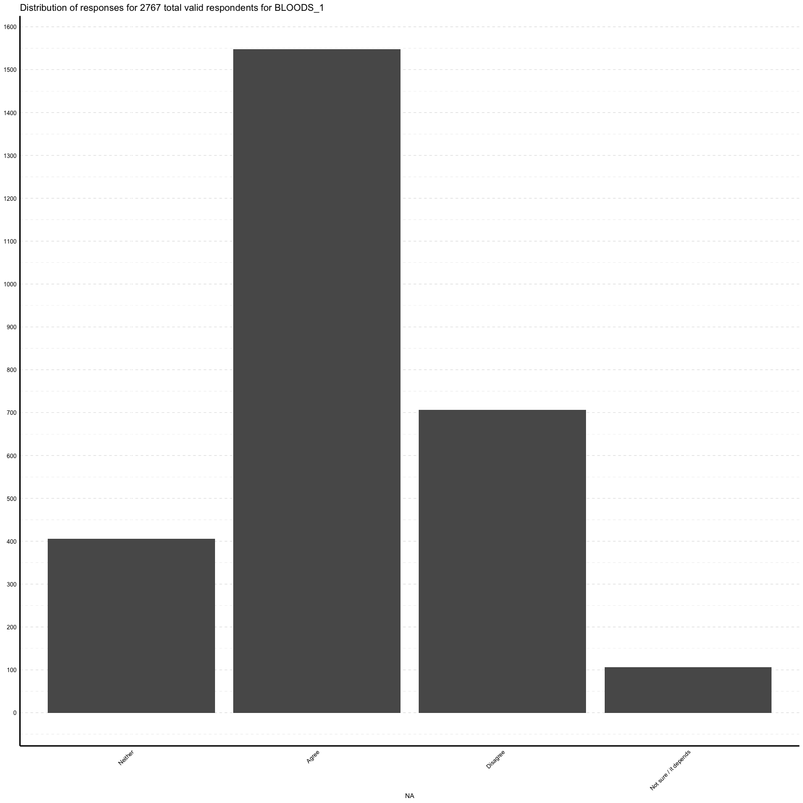<!-- -->

```
Frequencies  
BARRSB_1  
Label: Comfortable academics access to health records  
Type: Factor  

                                   Freq   % Valid   % Valid Cum.   % Total   % Total Cum.
-------------------------------- ------ --------- -------------- --------- --------------
                  Strongly agree    319     11.53          11.53     11.53          11.53
                           Agree   1081     39.07          50.60     39.07          50.60
      Neither agree nor disagree    556     20.09          70.69     20.09          70.69
                        Disagree    447     16.15          86.84     16.15          86.84
               Strongly disagree    292     10.55          97.40     10.55          97.40
                      Don't know     72      2.60         100.00      2.60         100.00
                            <NA>      0                               0.00         100.00
                           Total   2767    100.00         100.00    100.00         100.00
```

<!-- -->

```
Frequencies  
BARRSB_2  
Label: Comfortable companies access to health records  
Type: Factor  

                                   Freq   % Valid   % Valid Cum.   % Total   % Total Cum.
-------------------------------- ------ --------- -------------- --------- --------------
                  Strongly agree    231      8.35           8.35      8.35           8.35
                           Agree    834     30.14          38.49     30.14          38.49
      Neither agree nor disagree    625     22.59          61.08     22.59          61.08
                        Disagree    577     20.85          81.93     20.85          81.93
               Strongly disagree    425     15.36          97.29     15.36          97.29
                      Don't know     75      2.71         100.00      2.71         100.00
                            <NA>      0                               0.00         100.00
                           Total   2767    100.00         100.00    100.00         100.00
```

<!-- -->

```
Frequencies  
BLOODS_1  
Label: Willing give sample if part of routine blood test  
Type: Factor  

                                   Freq   % Valid   % Valid Cum.   % Total   % Total Cum.
-------------------------------- ------ --------- -------------- --------- --------------
                  Strongly agree    391     14.13          14.13     14.13          14.13
                           Agree   1157     41.81          55.95     41.81          55.95
      Neither agree nor disagree    406     14.67          70.62     14.67          70.62
                        Disagree    380     13.73          84.35     13.73          84.35
               Strongly disagree    327     11.82          96.17     11.82          96.17
           Not sure / it depends    106      3.83         100.00      3.83         100.00
                            <NA>      0                               0.00         100.00
                           Total   2767    100.00         100.00    100.00         100.00
```

<!-- -->

```
Frequencies  
BLOODS_2  
Label: Willing give sample if soley for OFH  
Type: Factor  

                                   Freq   % Valid   % Valid Cum.   % Total   % Total Cum.
-------------------------------- ------ --------- -------------- --------- --------------
                  Strongly agree    330     11.93          11.93     11.93          11.93
                           Agree    997     36.03          47.96     36.03          47.96
      Neither agree nor disagree    473     17.09          65.05     17.09          65.05
                        Disagree    482     17.42          82.47     17.42          82.47
               Strongly disagree    370     13.37          95.84     13.37          95.84
           Not sure / it depends    115      4.16         100.00      4.16         100.00
                            <NA>      0                               0.00         100.00
                           Total   2767    100.00         100.00    100.00         100.00
```

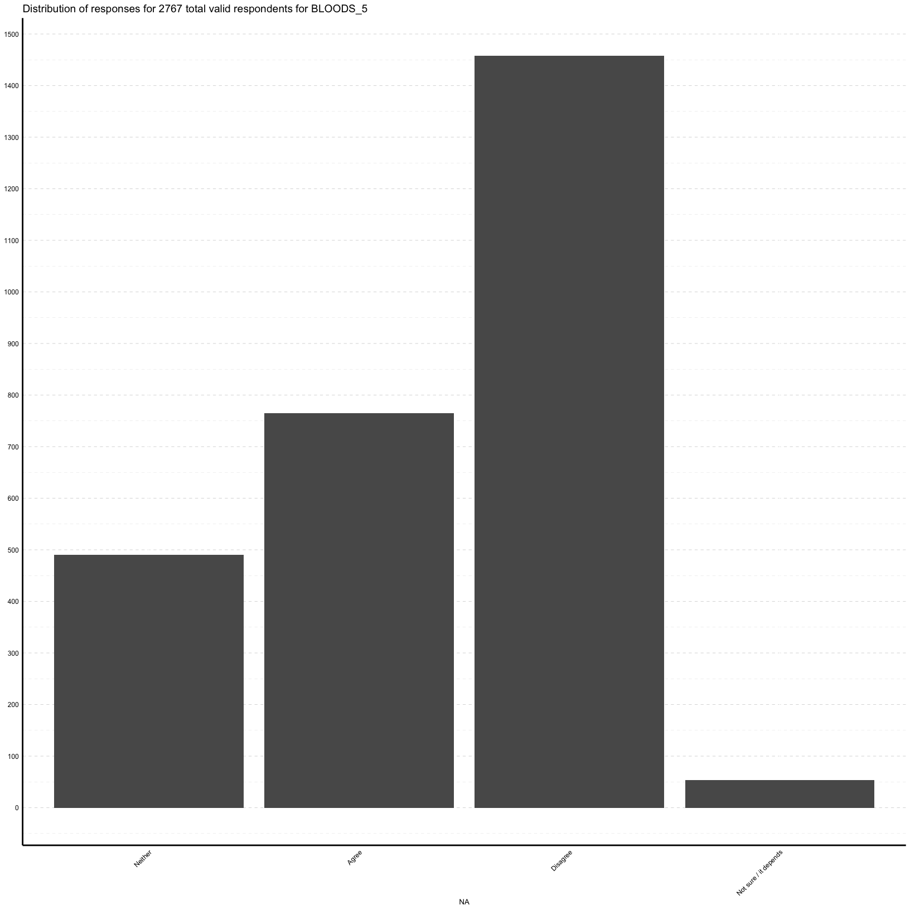<!-- -->

```
Frequencies  
BLOODS_3  
Label: Difficult to give sample on weekday  
Type: Factor  

                                   Freq   % Valid   % Valid Cum.   % Total   % Total Cum.
-------------------------------- ------ --------- -------------- --------- --------------
                  Strongly agree    310     11.20          11.20     11.20          11.20
                           Agree    664     24.00          35.20     24.00          35.20
      Neither agree nor disagree    590     21.32          56.52     21.32          56.52
                        Disagree    694     25.08          81.60     25.08          81.60
               Strongly disagree    384     13.88          95.48     13.88          95.48
           Not sure / it depends    125      4.52         100.00      4.52         100.00
                            <NA>      0                               0.00         100.00
                           Total   2767    100.00         100.00    100.00         100.00
```

<!-- -->

```
Frequencies  
BLOODS_4  
Label: Difficult to give sample on weekend  
Type: Factor  

                                   Freq   % Valid   % Valid Cum.   % Total   % Total Cum.
-------------------------------- ------ --------- -------------- --------- --------------
                  Strongly agree    187      6.76           6.76      6.76           6.76
                           Agree    476     17.20          23.96     17.20          23.96
      Neither agree nor disagree    638     23.06          47.02     23.06          47.02
                        Disagree    916     33.10          80.12     33.10          80.12
               Strongly disagree    412     14.89          95.01     14.89          95.01
           Not sure / it depends    138      4.99         100.00      4.99         100.00
                            <NA>      0                               0.00         100.00
                           Total   2767    100.00         100.00    100.00         100.00
```

<!-- -->

```
Frequencies  
BLOODS_5  
Label: The thought of providing a blood sample makes me anxious  
Type: Factor  

                                   Freq   % Valid   % Valid Cum.   % Total   % Total Cum.
-------------------------------- ------ --------- -------------- --------- --------------
                  Strongly agree    251      9.07           9.07      9.07           9.07
                           Agree    514     18.58          27.65     18.58          27.65
      Neither agree nor disagree    490     17.71          45.36     17.71          45.36
                        Disagree    800     28.91          74.27     28.91          74.27
               Strongly disagree    658     23.78          98.05     23.78          98.05
           Not sure / it depends     54      1.95         100.00      1.95         100.00
                            <NA>      0                               0.00         100.00
                           Total   2767    100.00         100.00    100.00         100.00
```

<!-- -->

```
Frequencies  
BLOODS_6  
Label: I have a fear of needles  
Type: Factor  

                                   Freq   % Valid   % Valid Cum.   % Total   % Total Cum.
-------------------------------- ------ --------- -------------- --------- --------------
                  Strongly agree    223      8.06           8.06      8.06           8.06
                           Agree    344     12.43          20.49     12.43          20.49
      Neither agree nor disagree    350     12.65          33.14     12.65          33.14
                        Disagree    964     34.84          67.98     34.84          67.98
               Strongly disagree    848     30.65          98.63     30.65          98.63
           Not sure / it depends     38      1.37         100.00      1.37         100.00
                            <NA>      0                               0.00         100.00
                           Total   2767    100.00         100.00    100.00         100.00
```

<!-- -->

```
Frequencies  
BLOODS_7  
Label: I have a fear of needles that would stop me from providing a blood sample  
Type: Factor  

                                   Freq   % Valid   % Valid Cum.   % Total   % Total Cum.
-------------------------------- ------ --------- -------------- --------- --------------
                  Strongly agree    145      5.24           5.24      5.24           5.24
                           Agree    204      7.37          12.61      7.37          12.61
      Neither agree nor disagree    325     11.75          24.36     11.75          24.36
                        Disagree   1054     38.09          62.45     38.09          62.45
               Strongly disagree    994     35.92          98.37     35.92          98.37
           Not sure / it depends     45      1.63         100.00      1.63         100.00
                            <NA>      0                               0.00         100.00
                           Total   2767    100.00         100.00    100.00         100.00
```

<!-- -->

```
Frequencies  
PRACBAR_1  
Label: I don't have time to take part in the Our Future Health research programme  
Type: Factor  

                                   Freq   % Valid   % Valid Cum.   % Total   % Total Cum.
-------------------------------- ------ --------- -------------- --------- --------------
                  Strongly agree    203      7.34           7.34      7.34           7.34
                           Agree    528     19.08          26.42     19.08          26.42
      Neither agree nor disagree    731     26.42          52.84     26.42          52.84
                        Disagree    839     30.32          83.16     30.32          83.16
               Strongly disagree    344     12.43          95.59     12.43          95.59
           Not sure / it depends    122      4.41         100.00      4.41         100.00
                            <NA>      0                               0.00         100.00
                           Total   2767    100.00         100.00    100.00         100.00
```

<!-- -->

```
Frequencies  
PRACBAR_2  
Label: have time for 10 min questionnaire  
Type: Factor  

                                   Freq   % Valid   % Valid Cum.   % Total   % Total Cum.
-------------------------------- ------ --------- -------------- --------- --------------
                  Strongly agree    582     21.03          21.03     21.03          21.03
                           Agree   1593     57.57          78.60     57.57          78.60
      Neither agree nor disagree    348     12.58          91.18     12.58          91.18
                        Disagree    111      4.01          95.19      4.01          95.19
               Strongly disagree     82      2.96          98.16      2.96          98.16
           Not sure / it depends     51      1.84         100.00      1.84         100.00
                            <NA>      0                               0.00         100.00
                           Total   2767    100.00         100.00    100.00         100.00
```

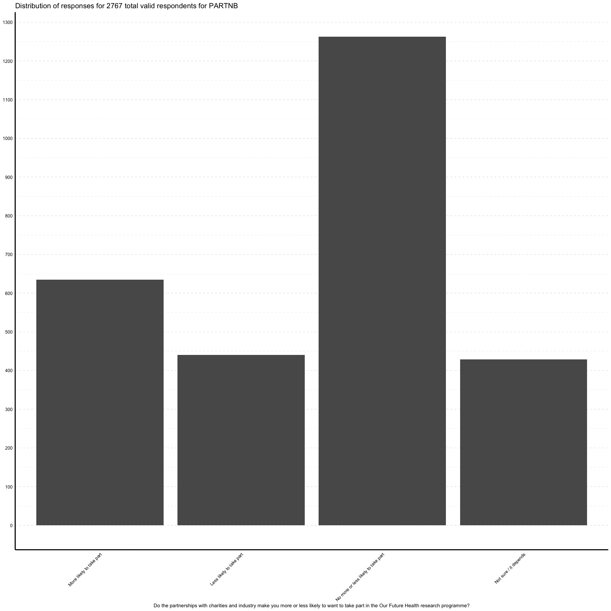<!-- -->

```
Frequencies  
PRACBAR_3  
Label: have time for 30 min questionnaire  
Type: Factor  

                                   Freq   % Valid   % Valid Cum.   % Total   % Total Cum.
-------------------------------- ------ --------- -------------- --------- --------------
                  Strongly agree    356     12.87          12.87     12.87          12.87
                           Agree   1122     40.55          53.42     40.55          53.42
      Neither agree nor disagree    587     21.21          74.63     21.21          74.63
                        Disagree    483     17.46          92.09     17.46          92.09
               Strongly disagree    138      4.99          97.07      4.99          97.07
           Not sure / it depends     81      2.93         100.00      2.93         100.00
                            <NA>      0                               0.00         100.00
                           Total   2767    100.00         100.00    100.00         100.00
```

<!-- -->

```
Frequencies  
PARTNA  
Label: Partnerships with charities and industry will improve the Our Future Health research programme  
Type: Factor  

                                   Freq   % Valid   % Valid Cum.   % Total   % Total Cum.
-------------------------------- ------ --------- -------------- --------- --------------
                  Strongly agree    402     14.53          14.53     14.53          14.53
                           Agree   1317     47.60          62.13     47.60          62.13
      Neither agree nor disagree    781     28.23          90.35     28.23          90.35
                        Disagree     89      3.22          93.57      3.22          93.57
               Strongly disagree     35      1.26          94.83      1.26          94.83
           Not sure / it depends    143      5.17         100.00      5.17         100.00
                            <NA>      0                               0.00         100.00
                           Total   2767    100.00         100.00    100.00         100.00
```

<!-- -->

```
Frequencies  
PARTNB  
Label: Do the partnerships with charities and industry make you more or less likely to want to take part in the Our Future Health research programme?  
Type: Factor  

                                            Freq   % Valid   % Valid Cum.   % Total   % Total Cum.
----------------------------------------- ------ --------- -------------- --------- --------------
                 More likely to take part    635     22.95          22.95     22.95          22.95
                 Less likely to take part    440     15.90          38.85     15.90          38.85
      No more or less likely to take part   1263     45.65          84.50     45.65          84.50
                    Not sure / it depends    429     15.50         100.00     15.50         100.00
                                     <NA>      0                               0.00         100.00
                                    Total   2767    100.00         100.00    100.00         100.00
```

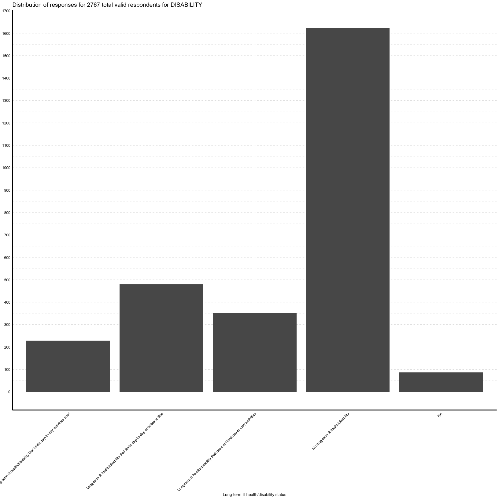<!-- -->

```
Frequencies  
OFHACT2  
Label: Based on what you now know about the Our Future Health research programme, would you take part in it if you were invited to?  
Type: Factor  

                              Freq   % Valid   % Valid Cum.   % Total   % Total Cum.
--------------------------- ------ --------- -------------- --------- --------------
            Yes, definitely    493     17.82          17.82     17.82          17.82
              Yes, probably    987     35.67          53.49     35.67          53.49
           No, probably not    612     22.12          75.61     22.12          75.61
         No, definitely not    257      9.29          84.89      9.29          84.89
      Not sure / it depends    418     15.11         100.00     15.11         100.00
                       <NA>      0                               0.00         100.00
                      Total   2767    100.00         100.00    100.00         100.00
```

<!-- -->

```
Frequencies  
RECONTACT  
Label: Recontact for future qualitative research  
Type: Factor  

              Freq   % Valid   % Valid Cum.   % Total   % Total Cum.
----------- ------ --------- -------------- --------- --------------
        Yes   2152    77.802         77.802    77.774         77.774
         No    614    22.198        100.000    22.190         99.964
       <NA>      1                              0.036        100.000
      Total   2767   100.000        100.000   100.000        100.000
```

<!-- -->

```
Frequencies  
DISABILITY  
Label: Long-term ill health/disability status  
Type: Factor  

                                                                                   Freq   % Valid   % Valid Cum.   % Total   % Total Cum.
-------------------------------------------------------------------------------- ------ --------- -------------- --------- --------------
         Long-term ill health/disability that limits day-to-day activities a lot    228      8.50           8.50      8.24           8.24
      Long-term ill health/disability that limits day-to-day activities a little    479     17.87          26.37     17.31          25.55
       Long-term ill health/disability that does not limit day-to-day activities    351     13.09          39.46     12.69          38.24
                                              No long-term ill health/disability   1623     60.54         100.00     58.66          96.89
                                                                            <NA>     86                               3.11         100.00
                                                                           Total   2767    100.00         100.00    100.00         100.00
```

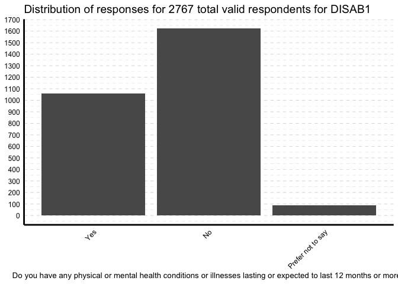<!-- -->

```
Frequencies  
DISAB1  
Label: Do you have any physical or mental health conditions or illnesses lasting or expected to last 12 months or more?  
Type: Factor  

                          Freq   % Valid   % Valid Cum.   % Total   % Total Cum.
----------------------- ------ --------- -------------- --------- --------------
                    Yes   1058     38.24          38.24     38.24          38.24
                     No   1623     58.66          96.89     58.66          96.89
      Prefer not to say     86      3.11         100.00      3.11         100.00
                   <NA>      0                               0.00         100.00
                  Total   2767    100.00         100.00    100.00         100.00
```

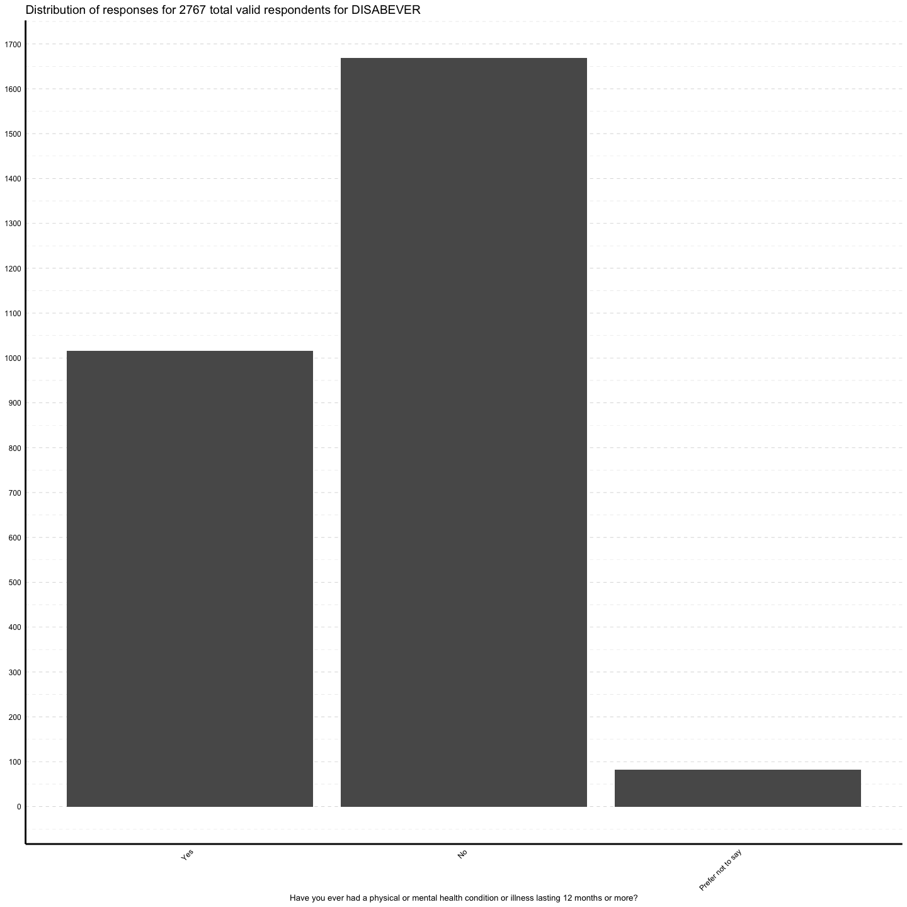<!-- -->

```
Frequencies  
DISABEVER  
Label: Have you ever had a physical or mental health condition or illness lasting 12 months or more?  
Type: Factor  

                          Freq   % Valid   % Valid Cum.   % Total   % Total Cum.
----------------------- ------ --------- -------------- --------- --------------
                    Yes   1016     36.72          36.72     36.72          36.72
                     No   1669     60.32          97.04     60.32          97.04
      Prefer not to say     82      2.96         100.00      2.96         100.00
                   <NA>      0                               0.00         100.00
                  Total   2767    100.00         100.00    100.00         100.00
```

# Analyses
## recode missing data

recode don't know, prefer not to say and and missing response as NA (missing data) in the analytic data set. 

Retain don't know and prefer not to say in factor df for summaries. 

Capture a list of variable labels as these get lost in the NA process


```r
label_list <- dput(sapply(factor_df,label))
```

first remove missing data and set to NA in the factor dataset


```r
factor_df <- factor_df %>%
  mutate(across(where(is.factor), 
                ~as.factor(case_when(. =="Missing reponse" ~ NA_character_, 
                                     TRUE ~ as.character(.)))))
```


then change all (dont know, prefer not to say, missing) to NA for the analytic data set


```r
regression_df <- factor_df %>%
  mutate(across(where(is.factor), 
                ~as.factor(case_when(. =="Don't know" ~ NA_character_,
                                     . =="Prefer not to say" ~ NA_character_,
                                     TRUE ~ as.character(.)))))
```


## set reference categories

Make the largest group the reference category using custom function


```r
regression_df <- regression_df %>%
  mutate(across(where(is.factor), 
                ~set.largest.ref(.)))
```


## add labels back to data set


```r
label(factor_df) = as.list(label_list[match(names(factor_df), names(label_list))])
label(regression_df) = as.list(label_list[match(names(regression_df), names(label_list))])
```


## univariable regressions 
Replicate Alice's regressions. identify which demographic features are important to use as covariates in multivariable regressions. 

* numeric outcomes: linear regression   

* binary outcomes:binomial logistic regression with estimates converted to OR and OR adjusted standard errors using coefficient variance (see https://www.andrewheiss.com/blog/2016/04/25/convert-logistic-regression-standard-errors-to-odds-ratios-with-r/)      

* 3 or more levels in outcome: multinomial regression    


### create formulas
Use function and loop to create a formula for every outcome/predictor pairing

#### demographic predictors

Run univariable regressions and output each set as a new row in a final summary table

create table 


```r
for (i in outcomes){
  for (x in dem.vars){
    do.univariable.regression(regression_df,i,x)
  }
}
```

<table class="table table-striped table-hover" style="margin-left: auto; margin-right: auto;">
<caption><b>Binomial logistic regression of Is this a black respondent? predicting Would you take part in it if you were invited to?
Levels: Yes = Yes definitely Yes probably; No =  No, probably not No, definitely not Not sure / it depends </b></caption>
 <thead>
  <tr>
   <th style="text-align:center;"> outcome </th>
   <th style="text-align:center;"> outcome.reference </th>
   <th style="text-align:center;"> predictor </th>
   <th style="text-align:center;"> predictor.reference </th>
   <th style="text-align:left;"> level.tested </th>
   <th style="text-align:center;"> LowerBoundOR </th>
   <th style="text-align:center;"> OR </th>
   <th style="text-align:center;"> UpperBoundOR </th>
   <th style="text-align:center;"> OR.StdError </th>
   <th style="text-align:center;"> z value </th>
   <th style="text-align:center;"> Pr(&gt;|z|) </th>
   <th style="text-align:center;"> Sig </th>
  </tr>
 </thead>
<tbody>
  <tr>
   <td style="text-align:center;"> ofhact_agree </td>
   <td style="text-align:center;"> Yes </td>
   <td style="text-align:center;"> Black_filter </td>
   <td style="text-align:center;"> No </td>
   <td style="text-align:left;"> (Intercept) </td>
   <td style="text-align:center;"> 0.89 </td>
   <td style="text-align:center;"> 0.97 </td>
   <td style="text-align:center;"> 1.05 </td>
   <td style="text-align:center;"> 0.04 </td>
   <td style="text-align:center;"> -0.7667917 </td>
   <td style="text-align:center;"> 0.443 </td>
   <td style="text-align:center;">  </td>
  </tr>
  <tr>
   <td style="text-align:center;"> ofhact_agree </td>
   <td style="text-align:center;"> Yes </td>
   <td style="text-align:center;"> Black_filter </td>
   <td style="text-align:center;"> No </td>
   <td style="text-align:left;"> Yes </td>
   <td style="text-align:center;"> 0.91 </td>
   <td style="text-align:center;"> 1.10 </td>
   <td style="text-align:center;"> 1.32 </td>
   <td style="text-align:center;"> 0.10 </td>
   <td style="text-align:center;"> 0.9851714 </td>
   <td style="text-align:center;"> 0.325 </td>
   <td style="text-align:center;">  </td>
  </tr>
</tbody>
</table><table class="table table-striped table-hover" style="margin-left: auto; margin-right: auto;">
<caption><b>Binomial logistic regression of Is this an Asian respondent? predicting Would you take part in it if you were invited to?
Levels: Yes = Yes definitely Yes probably; No =  No, probably not No, definitely not Not sure / it depends </b></caption>
 <thead>
  <tr>
   <th style="text-align:center;"> outcome </th>
   <th style="text-align:center;"> outcome.reference </th>
   <th style="text-align:center;"> predictor </th>
   <th style="text-align:center;"> predictor.reference </th>
   <th style="text-align:left;"> level.tested </th>
   <th style="text-align:center;"> LowerBoundOR </th>
   <th style="text-align:center;"> OR </th>
   <th style="text-align:center;"> UpperBoundOR </th>
   <th style="text-align:center;"> OR.StdError </th>
   <th style="text-align:center;"> z value </th>
   <th style="text-align:center;"> Pr(&gt;|z|) </th>
   <th style="text-align:center;"> Sig </th>
  </tr>
 </thead>
<tbody>
  <tr>
   <td style="text-align:center;"> ofhact_agree </td>
   <td style="text-align:center;"> Yes </td>
   <td style="text-align:center;"> Asian_filter </td>
   <td style="text-align:center;"> No </td>
   <td style="text-align:left;"> (Intercept) </td>
   <td style="text-align:center;"> 0.84 </td>
   <td style="text-align:center;"> 0.91 </td>
   <td style="text-align:center;"> 0.99 </td>
   <td style="text-align:center;"> 0.04 </td>
   <td style="text-align:center;"> -2.106630 </td>
   <td style="text-align:center;"> 0.035 </td>
   <td style="text-align:center;"> x </td>
  </tr>
  <tr>
   <td style="text-align:center;"> ofhact_agree </td>
   <td style="text-align:center;"> Yes </td>
   <td style="text-align:center;"> Asian_filter </td>
   <td style="text-align:center;"> No </td>
   <td style="text-align:left;"> Yes </td>
   <td style="text-align:center;"> 1.21 </td>
   <td style="text-align:center;"> 1.46 </td>
   <td style="text-align:center;"> 1.76 </td>
   <td style="text-align:center;"> 0.14 </td>
   <td style="text-align:center;"> 3.955208 </td>
   <td style="text-align:center;"> 0.000 </td>
   <td style="text-align:center;"> xxxx </td>
  </tr>
</tbody>
</table><table class="table table-striped table-hover" style="margin-left: auto; margin-right: auto;">
<caption><b>Binomial logistic regression of What is your age band? predicting Would you take part in it if you were invited to?
Levels: Yes = Yes definitely Yes probably; No =  No, probably not No, definitely not Not sure / it depends </b></caption>
 <thead>
  <tr>
   <th style="text-align:center;"> outcome </th>
   <th style="text-align:center;"> outcome.reference </th>
   <th style="text-align:center;"> predictor </th>
   <th style="text-align:center;"> predictor.reference </th>
   <th style="text-align:left;"> level.tested </th>
   <th style="text-align:center;"> LowerBoundOR </th>
   <th style="text-align:center;"> OR </th>
   <th style="text-align:center;"> UpperBoundOR </th>
   <th style="text-align:center;"> OR.StdError </th>
   <th style="text-align:center;"> z value </th>
   <th style="text-align:center;"> Pr(&gt;|z|) </th>
   <th style="text-align:center;"> Sig </th>
  </tr>
 </thead>
<tbody>
  <tr>
   <td style="text-align:center;"> ofhact_agree </td>
   <td style="text-align:center;"> Yes </td>
   <td style="text-align:center;"> AGE_BAND </td>
   <td style="text-align:center;"> 35-44 </td>
   <td style="text-align:left;"> (Intercept) </td>
   <td style="text-align:center;"> 0.89 </td>
   <td style="text-align:center;"> 1.05 </td>
   <td style="text-align:center;"> 1.23 </td>
   <td style="text-align:center;"> 0.09 </td>
   <td style="text-align:center;"> 0.5792686 </td>
   <td style="text-align:center;"> 0.562 </td>
   <td style="text-align:center;">  </td>
  </tr>
  <tr>
   <td style="text-align:center;"> ofhact_agree </td>
   <td style="text-align:center;"> Yes </td>
   <td style="text-align:center;"> AGE_BAND </td>
   <td style="text-align:center;"> 35-44 </td>
   <td style="text-align:left;"> 18-24 </td>
   <td style="text-align:center;"> 1.20 </td>
   <td style="text-align:center;"> 1.58 </td>
   <td style="text-align:center;"> 2.08 </td>
   <td style="text-align:center;"> 0.22 </td>
   <td style="text-align:center;"> 3.2742631 </td>
   <td style="text-align:center;"> 0.001 </td>
   <td style="text-align:center;"> xxxx </td>
  </tr>
  <tr>
   <td style="text-align:center;"> ofhact_agree </td>
   <td style="text-align:center;"> Yes </td>
   <td style="text-align:center;"> AGE_BAND </td>
   <td style="text-align:center;"> 35-44 </td>
   <td style="text-align:left;"> 25-34 </td>
   <td style="text-align:center;"> 0.74 </td>
   <td style="text-align:center;"> 0.93 </td>
   <td style="text-align:center;"> 1.17 </td>
   <td style="text-align:center;"> 0.11 </td>
   <td style="text-align:center;"> -0.6157978 </td>
   <td style="text-align:center;"> 0.538 </td>
   <td style="text-align:center;">  </td>
  </tr>
  <tr>
   <td style="text-align:center;"> ofhact_agree </td>
   <td style="text-align:center;"> Yes </td>
   <td style="text-align:center;"> AGE_BAND </td>
   <td style="text-align:center;"> 35-44 </td>
   <td style="text-align:left;"> 45-54 </td>
   <td style="text-align:center;"> 0.57 </td>
   <td style="text-align:center;"> 0.74 </td>
   <td style="text-align:center;"> 0.94 </td>
   <td style="text-align:center;"> 0.09 </td>
   <td style="text-align:center;"> -2.4075991 </td>
   <td style="text-align:center;"> 0.016 </td>
   <td style="text-align:center;"> x </td>
  </tr>
  <tr>
   <td style="text-align:center;"> ofhact_agree </td>
   <td style="text-align:center;"> Yes </td>
   <td style="text-align:center;"> AGE_BAND </td>
   <td style="text-align:center;"> 35-44 </td>
   <td style="text-align:left;"> 55-64 </td>
   <td style="text-align:center;"> 0.69 </td>
   <td style="text-align:center;"> 0.90 </td>
   <td style="text-align:center;"> 1.16 </td>
   <td style="text-align:center;"> 0.12 </td>
   <td style="text-align:center;"> -0.8336573 </td>
   <td style="text-align:center;"> 0.404 </td>
   <td style="text-align:center;">  </td>
  </tr>
  <tr>
   <td style="text-align:center;"> ofhact_agree </td>
   <td style="text-align:center;"> Yes </td>
   <td style="text-align:center;"> AGE_BAND </td>
   <td style="text-align:center;"> 35-44 </td>
   <td style="text-align:left;"> 65-74 </td>
   <td style="text-align:center;"> 0.50 </td>
   <td style="text-align:center;"> 0.67 </td>
   <td style="text-align:center;"> 0.88 </td>
   <td style="text-align:center;"> 0.10 </td>
   <td style="text-align:center;"> -2.8157880 </td>
   <td style="text-align:center;"> 0.005 </td>
   <td style="text-align:center;"> xxx </td>
  </tr>
  <tr>
   <td style="text-align:center;"> ofhact_agree </td>
   <td style="text-align:center;"> Yes </td>
   <td style="text-align:center;"> AGE_BAND </td>
   <td style="text-align:center;"> 35-44 </td>
   <td style="text-align:left;"> 75+ </td>
   <td style="text-align:center;"> 0.78 </td>
   <td style="text-align:center;"> 1.12 </td>
   <td style="text-align:center;"> 1.62 </td>
   <td style="text-align:center;"> 0.21 </td>
   <td style="text-align:center;"> 0.6294109 </td>
   <td style="text-align:center;"> 0.529 </td>
   <td style="text-align:center;">  </td>
  </tr>
</tbody>
</table><table class="table table-striped table-hover" style="margin-left: auto; margin-right: auto;">
<caption><b>Binomial logistic regression of Would you describe yourself as… predicting Would you take part in it if you were invited to?
Levels: Yes = Yes definitely Yes probably; No =  No, probably not No, definitely not Not sure / it depends </b></caption>
 <thead>
  <tr>
   <th style="text-align:center;"> outcome </th>
   <th style="text-align:center;"> outcome.reference </th>
   <th style="text-align:center;"> predictor </th>
   <th style="text-align:center;"> predictor.reference </th>
   <th style="text-align:left;"> level.tested </th>
   <th style="text-align:center;"> LowerBoundOR </th>
   <th style="text-align:center;"> OR </th>
   <th style="text-align:center;"> UpperBoundOR </th>
   <th style="text-align:center;"> OR.StdError </th>
   <th style="text-align:center;"> z value </th>
   <th style="text-align:center;"> Pr(&gt;|z|) </th>
   <th style="text-align:center;"> Sig </th>
  </tr>
 </thead>
<tbody>
  <tr>
   <td style="text-align:center;"> ofhact_agree </td>
   <td style="text-align:center;"> Yes </td>
   <td style="text-align:center;"> SEX </td>
   <td style="text-align:center;"> Female </td>
   <td style="text-align:left;"> (Intercept) </td>
   <td style="text-align:center;"> 0.94 </td>
   <td style="text-align:center;"> 1.03 </td>
   <td style="text-align:center;"> 1.14 </td>
   <td style="text-align:center;"> 0.05 </td>
   <td style="text-align:center;"> 0.6603697 </td>
   <td style="text-align:center;"> 0.509 </td>
   <td style="text-align:center;">  </td>
  </tr>
  <tr>
   <td style="text-align:center;"> ofhact_agree </td>
   <td style="text-align:center;"> Yes </td>
   <td style="text-align:center;"> SEX </td>
   <td style="text-align:center;"> Female </td>
   <td style="text-align:left;"> Identify in another way </td>
   <td style="text-align:center;"> 0.38 </td>
   <td style="text-align:center;"> 1.61 </td>
   <td style="text-align:center;"> 6.77 </td>
   <td style="text-align:center;"> 1.18 </td>
   <td style="text-align:center;"> 0.6520664 </td>
   <td style="text-align:center;"> 0.514 </td>
   <td style="text-align:center;">  </td>
  </tr>
  <tr>
   <td style="text-align:center;"> ofhact_agree </td>
   <td style="text-align:center;"> Yes </td>
   <td style="text-align:center;"> SEX </td>
   <td style="text-align:center;"> Female </td>
   <td style="text-align:left;"> Male </td>
   <td style="text-align:center;"> 0.77 </td>
   <td style="text-align:center;"> 0.89 </td>
   <td style="text-align:center;"> 1.04 </td>
   <td style="text-align:center;"> 0.07 </td>
   <td style="text-align:center;"> -1.4722290 </td>
   <td style="text-align:center;"> 0.141 </td>
   <td style="text-align:center;">  </td>
  </tr>
</tbody>
</table><table class="table table-striped table-hover" style="margin-left: auto; margin-right: auto;">
<caption><b>Binomial logistic regression of Ethnic group (detailed) predicting Would you take part in it if you were invited to?
Levels: Yes = Yes definitely Yes probably; No =  No, probably not No, definitely not Not sure / it depends </b></caption>
 <thead>
  <tr>
   <th style="text-align:center;"> outcome </th>
   <th style="text-align:center;"> outcome.reference </th>
   <th style="text-align:center;"> predictor </th>
   <th style="text-align:center;"> predictor.reference </th>
   <th style="text-align:left;"> level.tested </th>
   <th style="text-align:center;"> LowerBoundOR </th>
   <th style="text-align:center;"> OR </th>
   <th style="text-align:center;"> UpperBoundOR </th>
   <th style="text-align:center;"> OR.StdError </th>
   <th style="text-align:center;"> z value </th>
   <th style="text-align:center;"> Pr(&gt;|z|) </th>
   <th style="text-align:center;"> Sig </th>
  </tr>
 </thead>
<tbody>
  <tr>
   <td style="text-align:center;"> ofhact_agree </td>
   <td style="text-align:center;"> Yes </td>
   <td style="text-align:center;"> ETHNICITY </td>
   <td style="text-align:center;"> White British </td>
   <td style="text-align:left;"> (Intercept) </td>
   <td style="text-align:center;"> 0.81 </td>
   <td style="text-align:center;"> 0.90 </td>
   <td style="text-align:center;"> 0.99 </td>
   <td style="text-align:center;"> 0.05 </td>
   <td style="text-align:center;"> -2.0587588 </td>
   <td style="text-align:center;"> 0.040 </td>
   <td style="text-align:center;"> x </td>
  </tr>
  <tr>
   <td style="text-align:center;"> ofhact_agree </td>
   <td style="text-align:center;"> Yes </td>
   <td style="text-align:center;"> ETHNICITY </td>
   <td style="text-align:center;"> White British </td>
   <td style="text-align:left;"> Any other Asian background </td>
   <td style="text-align:center;"> 1.15 </td>
   <td style="text-align:center;"> 1.85 </td>
   <td style="text-align:center;"> 2.96 </td>
   <td style="text-align:center;"> 0.45 </td>
   <td style="text-align:center;"> 2.5420186 </td>
   <td style="text-align:center;"> 0.011 </td>
   <td style="text-align:center;"> x </td>
  </tr>
  <tr>
   <td style="text-align:center;"> ofhact_agree </td>
   <td style="text-align:center;"> Yes </td>
   <td style="text-align:center;"> ETHNICITY </td>
   <td style="text-align:center;"> White British </td>
   <td style="text-align:left;"> Any other Black background </td>
   <td style="text-align:center;"> 0.75 </td>
   <td style="text-align:center;"> 1.51 </td>
   <td style="text-align:center;"> 3.04 </td>
   <td style="text-align:center;"> 0.54 </td>
   <td style="text-align:center;"> 1.1631370 </td>
   <td style="text-align:center;"> 0.245 </td>
   <td style="text-align:center;">  </td>
  </tr>
  <tr>
   <td style="text-align:center;"> ofhact_agree </td>
   <td style="text-align:center;"> Yes </td>
   <td style="text-align:center;"> ETHNICITY </td>
   <td style="text-align:center;"> White British </td>
   <td style="text-align:left;"> Any other single ethnic group </td>
   <td style="text-align:center;"> 0.22 </td>
   <td style="text-align:center;"> 1.12 </td>
   <td style="text-align:center;"> 5.54 </td>
   <td style="text-align:center;"> 0.92 </td>
   <td style="text-align:center;"> 0.1330885 </td>
   <td style="text-align:center;"> 0.894 </td>
   <td style="text-align:center;">  </td>
  </tr>
  <tr>
   <td style="text-align:center;"> ofhact_agree </td>
   <td style="text-align:center;"> Yes </td>
   <td style="text-align:center;"> ETHNICITY </td>
   <td style="text-align:center;"> White British </td>
   <td style="text-align:left;"> Any other White background </td>
   <td style="text-align:center;"> 0.49 </td>
   <td style="text-align:center;"> 0.69 </td>
   <td style="text-align:center;"> 0.98 </td>
   <td style="text-align:center;"> 0.12 </td>
   <td style="text-align:center;"> -2.0934525 </td>
   <td style="text-align:center;"> 0.036 </td>
   <td style="text-align:center;"> x </td>
  </tr>
  <tr>
   <td style="text-align:center;"> ofhact_agree </td>
   <td style="text-align:center;"> Yes </td>
   <td style="text-align:center;"> ETHNICITY </td>
   <td style="text-align:center;"> White British </td>
   <td style="text-align:left;"> Arab </td>
   <td style="text-align:center;"> 0.28 </td>
   <td style="text-align:center;"> 1.67 </td>
   <td style="text-align:center;"> 10.04 </td>
   <td style="text-align:center;"> 1.53 </td>
   <td style="text-align:center;"> 0.5625088 </td>
   <td style="text-align:center;"> 0.574 </td>
   <td style="text-align:center;">  </td>
  </tr>
  <tr>
   <td style="text-align:center;"> ofhact_agree </td>
   <td style="text-align:center;"> Yes </td>
   <td style="text-align:center;"> ETHNICITY </td>
   <td style="text-align:center;"> White British </td>
   <td style="text-align:left;"> Bangladeshi </td>
   <td style="text-align:center;"> 0.76 </td>
   <td style="text-align:center;"> 1.28 </td>
   <td style="text-align:center;"> 2.17 </td>
   <td style="text-align:center;"> 0.34 </td>
   <td style="text-align:center;"> 0.9200876 </td>
   <td style="text-align:center;"> 0.358 </td>
   <td style="text-align:center;">  </td>
  </tr>
  <tr>
   <td style="text-align:center;"> ofhact_agree </td>
   <td style="text-align:center;"> Yes </td>
   <td style="text-align:center;"> ETHNICITY </td>
   <td style="text-align:center;"> White British </td>
   <td style="text-align:left;"> Black African </td>
   <td style="text-align:center;"> 0.80 </td>
   <td style="text-align:center;"> 1.01 </td>
   <td style="text-align:center;"> 1.27 </td>
   <td style="text-align:center;"> 0.12 </td>
   <td style="text-align:center;"> 0.0986588 </td>
   <td style="text-align:center;"> 0.921 </td>
   <td style="text-align:center;">  </td>
  </tr>
  <tr>
   <td style="text-align:center;"> ofhact_agree </td>
   <td style="text-align:center;"> Yes </td>
   <td style="text-align:center;"> ETHNICITY </td>
   <td style="text-align:center;"> White British </td>
   <td style="text-align:left;"> Black Caribbean </td>
   <td style="text-align:center;"> 1.17 </td>
   <td style="text-align:center;"> 1.63 </td>
   <td style="text-align:center;"> 2.27 </td>
   <td style="text-align:center;"> 0.28 </td>
   <td style="text-align:center;"> 2.8824056 </td>
   <td style="text-align:center;"> 0.004 </td>
   <td style="text-align:center;"> xxx </td>
  </tr>
  <tr>
   <td style="text-align:center;"> ofhact_agree </td>
   <td style="text-align:center;"> Yes </td>
   <td style="text-align:center;"> ETHNICITY </td>
   <td style="text-align:center;"> White British </td>
   <td style="text-align:left;"> Chinese </td>
   <td style="text-align:center;"> 1.11 </td>
   <td style="text-align:center;"> 1.70 </td>
   <td style="text-align:center;"> 2.63 </td>
   <td style="text-align:center;"> 0.38 </td>
   <td style="text-align:center;"> 2.4125137 </td>
   <td style="text-align:center;"> 0.016 </td>
   <td style="text-align:center;"> x </td>
  </tr>
  <tr>
   <td style="text-align:center;"> ofhact_agree </td>
   <td style="text-align:center;"> Yes </td>
   <td style="text-align:center;"> ETHNICITY </td>
   <td style="text-align:center;"> White British </td>
   <td style="text-align:left;"> Indian </td>
   <td style="text-align:center;"> 0.85 </td>
   <td style="text-align:center;"> 1.13 </td>
   <td style="text-align:center;"> 1.49 </td>
   <td style="text-align:center;"> 0.16 </td>
   <td style="text-align:center;"> 0.8211156 </td>
   <td style="text-align:center;"> 0.412 </td>
   <td style="text-align:center;">  </td>
  </tr>
  <tr>
   <td style="text-align:center;"> ofhact_agree </td>
   <td style="text-align:center;"> Yes </td>
   <td style="text-align:center;"> ETHNICITY </td>
   <td style="text-align:center;"> White British </td>
   <td style="text-align:left;"> Mixed/Multiple ethnic groups </td>
   <td style="text-align:center;"> 0.47 </td>
   <td style="text-align:center;"> 0.86 </td>
   <td style="text-align:center;"> 1.55 </td>
   <td style="text-align:center;"> 0.26 </td>
   <td style="text-align:center;"> -0.5080256 </td>
   <td style="text-align:center;"> 0.611 </td>
   <td style="text-align:center;">  </td>
  </tr>
  <tr>
   <td style="text-align:center;"> ofhact_agree </td>
   <td style="text-align:center;"> Yes </td>
   <td style="text-align:center;"> ETHNICITY </td>
   <td style="text-align:center;"> White British </td>
   <td style="text-align:left;"> Pakistani </td>
   <td style="text-align:center;"> 1.50 </td>
   <td style="text-align:center;"> 2.26 </td>
   <td style="text-align:center;"> 3.42 </td>
   <td style="text-align:center;"> 0.48 </td>
   <td style="text-align:center;"> 3.8772821 </td>
   <td style="text-align:center;"> 0.000 </td>
   <td style="text-align:center;"> xxxx </td>
  </tr>
</tbody>
</table><table class="table table-striped table-hover" style="margin-left: auto; margin-right: auto;">
<caption><b>Binomial logistic regression of Ethnic group in LFS format predicting Would you take part in it if you were invited to?
Levels: Yes = Yes definitely Yes probably; No =  No, probably not No, definitely not Not sure / it depends </b></caption>
 <thead>
  <tr>
   <th style="text-align:center;"> outcome </th>
   <th style="text-align:center;"> outcome.reference </th>
   <th style="text-align:center;"> predictor </th>
   <th style="text-align:center;"> predictor.reference </th>
   <th style="text-align:left;"> level.tested </th>
   <th style="text-align:center;"> LowerBoundOR </th>
   <th style="text-align:center;"> OR </th>
   <th style="text-align:center;"> UpperBoundOR </th>
   <th style="text-align:center;"> OR.StdError </th>
   <th style="text-align:center;"> z value </th>
   <th style="text-align:center;"> Pr(&gt;|z|) </th>
   <th style="text-align:center;"> Sig </th>
  </tr>
 </thead>
<tbody>
  <tr>
   <td style="text-align:center;"> ofhact_agree </td>
   <td style="text-align:center;"> Yes </td>
   <td style="text-align:center;"> ETHNICITY_LFS </td>
   <td style="text-align:center;"> White </td>
   <td style="text-align:left;"> (Intercept) </td>
   <td style="text-align:center;"> 0.79 </td>
   <td style="text-align:center;"> 0.87 </td>
   <td style="text-align:center;"> 0.96 </td>
   <td style="text-align:center;"> 0.04 </td>
   <td style="text-align:center;"> -2.8377097 </td>
   <td style="text-align:center;"> 0.005 </td>
   <td style="text-align:center;"> xxx </td>
  </tr>
  <tr>
   <td style="text-align:center;"> ofhact_agree </td>
   <td style="text-align:center;"> Yes </td>
   <td style="text-align:center;"> ETHNICITY_LFS </td>
   <td style="text-align:center;"> White </td>
   <td style="text-align:left;"> Any other Asian background </td>
   <td style="text-align:center;"> 1.19 </td>
   <td style="text-align:center;"> 1.91 </td>
   <td style="text-align:center;"> 3.06 </td>
   <td style="text-align:center;"> 0.46 </td>
   <td style="text-align:center;"> 2.6895132 </td>
   <td style="text-align:center;"> 0.007 </td>
   <td style="text-align:center;"> xx </td>
  </tr>
  <tr>
   <td style="text-align:center;"> ofhact_agree </td>
   <td style="text-align:center;"> Yes </td>
   <td style="text-align:center;"> ETHNICITY_LFS </td>
   <td style="text-align:center;"> White </td>
   <td style="text-align:left;"> Bangladeshi </td>
   <td style="text-align:center;"> 0.78 </td>
   <td style="text-align:center;"> 1.32 </td>
   <td style="text-align:center;"> 2.24 </td>
   <td style="text-align:center;"> 0.35 </td>
   <td style="text-align:center;"> 1.0490267 </td>
   <td style="text-align:center;"> 0.294 </td>
   <td style="text-align:center;">  </td>
  </tr>
  <tr>
   <td style="text-align:center;"> ofhact_agree </td>
   <td style="text-align:center;"> Yes </td>
   <td style="text-align:center;"> ETHNICITY_LFS </td>
   <td style="text-align:center;"> White </td>
   <td style="text-align:left;"> Black/African/Caribbean/Black British </td>
   <td style="text-align:center;"> 1.01 </td>
   <td style="text-align:center;"> 1.23 </td>
   <td style="text-align:center;"> 1.49 </td>
   <td style="text-align:center;"> 0.12 </td>
   <td style="text-align:center;"> 2.0706389 </td>
   <td style="text-align:center;"> 0.038 </td>
   <td style="text-align:center;"> x </td>
  </tr>
  <tr>
   <td style="text-align:center;"> ofhact_agree </td>
   <td style="text-align:center;"> Yes </td>
   <td style="text-align:center;"> ETHNICITY_LFS </td>
   <td style="text-align:center;"> White </td>
   <td style="text-align:left;"> Chinese </td>
   <td style="text-align:center;"> 1.14 </td>
   <td style="text-align:center;"> 1.76 </td>
   <td style="text-align:center;"> 2.71 </td>
   <td style="text-align:center;"> 0.39 </td>
   <td style="text-align:center;"> 2.5738333 </td>
   <td style="text-align:center;"> 0.010 </td>
   <td style="text-align:center;"> xx </td>
  </tr>
  <tr>
   <td style="text-align:center;"> ofhact_agree </td>
   <td style="text-align:center;"> Yes </td>
   <td style="text-align:center;"> ETHNICITY_LFS </td>
   <td style="text-align:center;"> White </td>
   <td style="text-align:left;"> Indian </td>
   <td style="text-align:center;"> 0.88 </td>
   <td style="text-align:center;"> 1.16 </td>
   <td style="text-align:center;"> 1.54 </td>
   <td style="text-align:center;"> 0.17 </td>
   <td style="text-align:center;"> 1.0656524 </td>
   <td style="text-align:center;"> 0.287 </td>
   <td style="text-align:center;">  </td>
  </tr>
  <tr>
   <td style="text-align:center;"> ofhact_agree </td>
   <td style="text-align:center;"> Yes </td>
   <td style="text-align:center;"> ETHNICITY_LFS </td>
   <td style="text-align:center;"> White </td>
   <td style="text-align:left;"> Mixed/Multiple ethnic groups </td>
   <td style="text-align:center;"> 0.49 </td>
   <td style="text-align:center;"> 0.89 </td>
   <td style="text-align:center;"> 1.60 </td>
   <td style="text-align:center;"> 0.27 </td>
   <td style="text-align:center;"> -0.3956522 </td>
   <td style="text-align:center;"> 0.692 </td>
   <td style="text-align:center;">  </td>
  </tr>
  <tr>
   <td style="text-align:center;"> ofhact_agree </td>
   <td style="text-align:center;"> Yes </td>
   <td style="text-align:center;"> ETHNICITY_LFS </td>
   <td style="text-align:center;"> White </td>
   <td style="text-align:left;"> Other ethnic group </td>
   <td style="text-align:center;"> 0.42 </td>
   <td style="text-align:center;"> 1.38 </td>
   <td style="text-align:center;"> 4.56 </td>
   <td style="text-align:center;"> 0.84 </td>
   <td style="text-align:center;"> 0.5354165 </td>
   <td style="text-align:center;"> 0.592 </td>
   <td style="text-align:center;">  </td>
  </tr>
  <tr>
   <td style="text-align:center;"> ofhact_agree </td>
   <td style="text-align:center;"> Yes </td>
   <td style="text-align:center;"> ETHNICITY_LFS </td>
   <td style="text-align:center;"> White </td>
   <td style="text-align:left;"> Pakistani </td>
   <td style="text-align:center;"> 1.55 </td>
   <td style="text-align:center;"> 2.34 </td>
   <td style="text-align:center;"> 3.53 </td>
   <td style="text-align:center;"> 0.49 </td>
   <td style="text-align:center;"> 4.0512359 </td>
   <td style="text-align:center;"> 0.000 </td>
   <td style="text-align:center;"> xxxx </td>
  </tr>
</tbody>
</table><table class="table table-striped table-hover" style="margin-left: auto; margin-right: auto;">
<caption><b>Binomial logistic regression of Number of people in household predicting Would you take part in it if you were invited to?
Levels: Yes = Yes definitely Yes probably; No =  No, probably not No, definitely not Not sure / it depends </b></caption>
 <thead>
  <tr>
   <th style="text-align:center;"> outcome </th>
   <th style="text-align:center;"> outcome.reference </th>
   <th style="text-align:center;"> predictor </th>
   <th style="text-align:center;"> predictor.reference </th>
   <th style="text-align:left;"> level.tested </th>
   <th style="text-align:center;"> LowerBoundOR </th>
   <th style="text-align:center;"> OR </th>
   <th style="text-align:center;"> UpperBoundOR </th>
   <th style="text-align:center;"> OR.StdError </th>
   <th style="text-align:center;"> z value </th>
   <th style="text-align:center;"> Pr(&gt;|z|) </th>
   <th style="text-align:center;"> Sig </th>
  </tr>
 </thead>
<tbody>
  <tr>
   <td style="text-align:center;"> ofhact_agree </td>
   <td style="text-align:center;"> Yes </td>
   <td style="text-align:center;"> NUMPEOPLE </td>
   <td style="text-align:center;"> 2 </td>
   <td style="text-align:left;"> (Intercept) </td>
   <td style="text-align:center;"> 0.78 </td>
   <td style="text-align:center;"> 0.89 </td>
   <td style="text-align:center;"> 1.02 </td>
   <td style="text-align:center;"> 0.06 </td>
   <td style="text-align:center;"> -1.7095452 </td>
   <td style="text-align:center;"> 0.087 </td>
   <td style="text-align:center;">  </td>
  </tr>
  <tr>
   <td style="text-align:center;"> ofhact_agree </td>
   <td style="text-align:center;"> Yes </td>
   <td style="text-align:center;"> NUMPEOPLE </td>
   <td style="text-align:center;"> 2 </td>
   <td style="text-align:left;"> 1 </td>
   <td style="text-align:center;"> 0.92 </td>
   <td style="text-align:center;"> 1.16 </td>
   <td style="text-align:center;"> 1.47 </td>
   <td style="text-align:center;"> 0.14 </td>
   <td style="text-align:center;"> 1.2925126 </td>
   <td style="text-align:center;"> 0.196 </td>
   <td style="text-align:center;">  </td>
  </tr>
  <tr>
   <td style="text-align:center;"> ofhact_agree </td>
   <td style="text-align:center;"> Yes </td>
   <td style="text-align:center;"> NUMPEOPLE </td>
   <td style="text-align:center;"> 2 </td>
   <td style="text-align:left;"> 10 </td>
   <td style="text-align:center;"> 0.05 </td>
   <td style="text-align:center;"> 0.56 </td>
   <td style="text-align:center;"> 6.21 </td>
   <td style="text-align:center;"> 0.69 </td>
   <td style="text-align:center;"> -0.4714592 </td>
   <td style="text-align:center;"> 0.637 </td>
   <td style="text-align:center;">  </td>
  </tr>
  <tr>
   <td style="text-align:center;"> ofhact_agree </td>
   <td style="text-align:center;"> Yes </td>
   <td style="text-align:center;"> NUMPEOPLE </td>
   <td style="text-align:center;"> 2 </td>
   <td style="text-align:left;"> 11 </td>
   <td style="text-align:center;"> 0.07 </td>
   <td style="text-align:center;"> 1.12 </td>
   <td style="text-align:center;"> 17.99 </td>
   <td style="text-align:center;"> 1.59 </td>
   <td style="text-align:center;"> 0.0811280 </td>
   <td style="text-align:center;"> 0.935 </td>
   <td style="text-align:center;">  </td>
  </tr>
  <tr>
   <td style="text-align:center;"> ofhact_agree </td>
   <td style="text-align:center;"> Yes </td>
   <td style="text-align:center;"> NUMPEOPLE </td>
   <td style="text-align:center;"> 2 </td>
   <td style="text-align:left;"> 3 </td>
   <td style="text-align:center;"> 0.83 </td>
   <td style="text-align:center;"> 1.04 </td>
   <td style="text-align:center;"> 1.31 </td>
   <td style="text-align:center;"> 0.12 </td>
   <td style="text-align:center;"> 0.3705324 </td>
   <td style="text-align:center;"> 0.711 </td>
   <td style="text-align:center;">  </td>
  </tr>
  <tr>
   <td style="text-align:center;"> ofhact_agree </td>
   <td style="text-align:center;"> Yes </td>
   <td style="text-align:center;"> NUMPEOPLE </td>
   <td style="text-align:center;"> 2 </td>
   <td style="text-align:left;"> 4 </td>
   <td style="text-align:center;"> 0.91 </td>
   <td style="text-align:center;"> 1.13 </td>
   <td style="text-align:center;"> 1.40 </td>
   <td style="text-align:center;"> 0.12 </td>
   <td style="text-align:center;"> 1.1135216 </td>
   <td style="text-align:center;"> 0.265 </td>
   <td style="text-align:center;">  </td>
  </tr>
  <tr>
   <td style="text-align:center;"> ofhact_agree </td>
   <td style="text-align:center;"> Yes </td>
   <td style="text-align:center;"> NUMPEOPLE </td>
   <td style="text-align:center;"> 2 </td>
   <td style="text-align:left;"> 5 </td>
   <td style="text-align:center;"> 0.86 </td>
   <td style="text-align:center;"> 1.17 </td>
   <td style="text-align:center;"> 1.58 </td>
   <td style="text-align:center;"> 0.18 </td>
   <td style="text-align:center;"> 0.9934009 </td>
   <td style="text-align:center;"> 0.321 </td>
   <td style="text-align:center;">  </td>
  </tr>
  <tr>
   <td style="text-align:center;"> ofhact_agree </td>
   <td style="text-align:center;"> Yes </td>
   <td style="text-align:center;"> NUMPEOPLE </td>
   <td style="text-align:center;"> 2 </td>
   <td style="text-align:left;"> 6 </td>
   <td style="text-align:center;"> 1.09 </td>
   <td style="text-align:center;"> 1.70 </td>
   <td style="text-align:center;"> 2.66 </td>
   <td style="text-align:center;"> 0.39 </td>
   <td style="text-align:center;"> 2.3243876 </td>
   <td style="text-align:center;"> 0.020 </td>
   <td style="text-align:center;"> x </td>
  </tr>
  <tr>
   <td style="text-align:center;"> ofhact_agree </td>
   <td style="text-align:center;"> Yes </td>
   <td style="text-align:center;"> NUMPEOPLE </td>
   <td style="text-align:center;"> 2 </td>
   <td style="text-align:left;"> 7 </td>
   <td style="text-align:center;"> 0.53 </td>
   <td style="text-align:center;"> 1.01 </td>
   <td style="text-align:center;"> 1.93 </td>
   <td style="text-align:center;"> 0.34 </td>
   <td style="text-align:center;"> 0.0286383 </td>
   <td style="text-align:center;"> 0.977 </td>
   <td style="text-align:center;">  </td>
  </tr>
  <tr>
   <td style="text-align:center;"> ofhact_agree </td>
   <td style="text-align:center;"> Yes </td>
   <td style="text-align:center;"> NUMPEOPLE </td>
   <td style="text-align:center;"> 2 </td>
   <td style="text-align:left;"> 8 </td>
   <td style="text-align:center;"> 0.67 </td>
   <td style="text-align:center;"> 2.62 </td>
   <td style="text-align:center;"> 10.19 </td>
   <td style="text-align:center;"> 1.82 </td>
   <td style="text-align:center;"> 1.3877401 </td>
   <td style="text-align:center;"> 0.165 </td>
   <td style="text-align:center;">  </td>
  </tr>
  <tr>
   <td style="text-align:center;"> ofhact_agree </td>
   <td style="text-align:center;"> Yes </td>
   <td style="text-align:center;"> NUMPEOPLE </td>
   <td style="text-align:center;"> 2 </td>
   <td style="text-align:left;"> 9 </td>
   <td style="text-align:center;"> 0.33 </td>
   <td style="text-align:center;"> 1.50 </td>
   <td style="text-align:center;"> 6.72 </td>
   <td style="text-align:center;"> 1.15 </td>
   <td style="text-align:center;"> 0.5250260 </td>
   <td style="text-align:center;"> 0.600 </td>
   <td style="text-align:center;">  </td>
  </tr>
</tbody>
</table><table class="table table-striped table-hover" style="margin-left: auto; margin-right: auto;">
<caption><b>Binomial logistic regression of NA predicting Would you take part in it if you were invited to?
Levels: Yes = Yes definitely Yes probably; No =  No, probably not No, definitely not Not sure / it depends </b></caption>
 <thead>
  <tr>
   <th style="text-align:center;"> outcome </th>
   <th style="text-align:center;"> outcome.reference </th>
   <th style="text-align:center;"> predictor </th>
   <th style="text-align:center;"> predictor.reference </th>
   <th style="text-align:left;"> level.tested </th>
   <th style="text-align:center;"> LowerBoundOR </th>
   <th style="text-align:center;"> OR </th>
   <th style="text-align:center;"> UpperBoundOR </th>
   <th style="text-align:center;"> OR.StdError </th>
   <th style="text-align:center;"> z value </th>
   <th style="text-align:center;"> Pr(&gt;|z|) </th>
   <th style="text-align:center;"> Sig </th>
  </tr>
 </thead>
<tbody>
  <tr>
   <td style="text-align:center;"> ofhact_agree </td>
   <td style="text-align:center;"> Yes </td>
   <td style="text-align:center;"> MARSTAT </td>
   <td style="text-align:center;"> Married/civil partnership </td>
   <td style="text-align:left;"> (Intercept) </td>
   <td style="text-align:center;"> 0.91 </td>
   <td style="text-align:center;"> 0.99 </td>
   <td style="text-align:center;"> 1.07 </td>
   <td style="text-align:center;"> 0.04 </td>
   <td style="text-align:center;"> -0.242238 </td>
   <td style="text-align:center;"> 0.809 </td>
   <td style="text-align:center;">  </td>
  </tr>
  <tr>
   <td style="text-align:center;"> ofhact_agree </td>
   <td style="text-align:center;"> Yes </td>
   <td style="text-align:center;"> MARSTAT </td>
   <td style="text-align:center;"> Married/civil partnership </td>
   <td style="text-align:left;"> Neither </td>
   <td style="text-align:center;"> 1.10 </td>
   <td style="text-align:center;"> 1.48 </td>
   <td style="text-align:center;"> 2.00 </td>
   <td style="text-align:center;"> 0.23 </td>
   <td style="text-align:center;"> 2.567984 </td>
   <td style="text-align:center;"> 0.010 </td>
   <td style="text-align:center;"> xx </td>
  </tr>
</tbody>
</table><table class="table table-striped table-hover" style="margin-left: auto; margin-right: auto;">
<caption><b>Binomial logistic regression of Number of cohabiting own child(ren) under age of 17 predicting Would you take part in it if you were invited to?
Levels: Yes = Yes definitely Yes probably; No =  No, probably not No, definitely not Not sure / it depends </b></caption>
 <thead>
  <tr>
   <th style="text-align:center;"> outcome </th>
   <th style="text-align:center;"> outcome.reference </th>
   <th style="text-align:center;"> predictor </th>
   <th style="text-align:center;"> predictor.reference </th>
   <th style="text-align:left;"> level.tested </th>
   <th style="text-align:center;"> LowerBoundOR </th>
   <th style="text-align:center;"> OR </th>
   <th style="text-align:center;"> UpperBoundOR </th>
   <th style="text-align:center;"> OR.StdError </th>
   <th style="text-align:center;"> z value </th>
   <th style="text-align:center;"> Pr(&gt;|z|) </th>
   <th style="text-align:center;"> Sig </th>
  </tr>
 </thead>
<tbody>
  <tr>
   <td style="text-align:center;"> ofhact_agree </td>
   <td style="text-align:center;"> Yes </td>
   <td style="text-align:center;"> NumOwnChildrenU16HH </td>
   <td style="text-align:center;"> 0 </td>
   <td style="text-align:left;"> (Intercept) </td>
   <td style="text-align:center;"> 0.90 </td>
   <td style="text-align:center;"> 0.98 </td>
   <td style="text-align:center;"> 1.07 </td>
   <td style="text-align:center;"> 0.04 </td>
   <td style="text-align:center;"> -0.4812176 </td>
   <td style="text-align:center;"> 0.630 </td>
   <td style="text-align:center;">  </td>
  </tr>
  <tr>
   <td style="text-align:center;"> ofhact_agree </td>
   <td style="text-align:center;"> Yes </td>
   <td style="text-align:center;"> NumOwnChildrenU16HH </td>
   <td style="text-align:center;"> 0 </td>
   <td style="text-align:left;"> 1 </td>
   <td style="text-align:center;"> 0.72 </td>
   <td style="text-align:center;"> 0.92 </td>
   <td style="text-align:center;"> 1.17 </td>
   <td style="text-align:center;"> 0.12 </td>
   <td style="text-align:center;"> -0.7085078 </td>
   <td style="text-align:center;"> 0.479 </td>
   <td style="text-align:center;">  </td>
  </tr>
  <tr>
   <td style="text-align:center;"> ofhact_agree </td>
   <td style="text-align:center;"> Yes </td>
   <td style="text-align:center;"> NumOwnChildrenU16HH </td>
   <td style="text-align:center;"> 0 </td>
   <td style="text-align:left;"> 2 </td>
   <td style="text-align:center;"> 0.89 </td>
   <td style="text-align:center;"> 1.15 </td>
   <td style="text-align:center;"> 1.47 </td>
   <td style="text-align:center;"> 0.15 </td>
   <td style="text-align:center;"> 1.0627768 </td>
   <td style="text-align:center;"> 0.288 </td>
   <td style="text-align:center;">  </td>
  </tr>
  <tr>
   <td style="text-align:center;"> ofhact_agree </td>
   <td style="text-align:center;"> Yes </td>
   <td style="text-align:center;"> NumOwnChildrenU16HH </td>
   <td style="text-align:center;"> 0 </td>
   <td style="text-align:left;"> 3 </td>
   <td style="text-align:center;"> 0.59 </td>
   <td style="text-align:center;"> 0.96 </td>
   <td style="text-align:center;"> 1.56 </td>
   <td style="text-align:center;"> 0.24 </td>
   <td style="text-align:center;"> -0.1532613 </td>
   <td style="text-align:center;"> 0.878 </td>
   <td style="text-align:center;">  </td>
  </tr>
  <tr>
   <td style="text-align:center;"> ofhact_agree </td>
   <td style="text-align:center;"> Yes </td>
   <td style="text-align:center;"> NumOwnChildrenU16HH </td>
   <td style="text-align:center;"> 0 </td>
   <td style="text-align:left;"> 4 </td>
   <td style="text-align:center;"> 0.40 </td>
   <td style="text-align:center;"> 1.19 </td>
   <td style="text-align:center;"> 3.56 </td>
   <td style="text-align:center;"> 0.66 </td>
   <td style="text-align:center;"> 0.3139491 </td>
   <td style="text-align:center;"> 0.754 </td>
   <td style="text-align:center;">  </td>
  </tr>
  <tr>
   <td style="text-align:center;"> ofhact_agree </td>
   <td style="text-align:center;"> Yes </td>
   <td style="text-align:center;"> NumOwnChildrenU16HH </td>
   <td style="text-align:center;"> 0 </td>
   <td style="text-align:left;"> 5 </td>
   <td style="text-align:center;"> 0.19 </td>
   <td style="text-align:center;"> 2.04 </td>
   <td style="text-align:center;"> 22.54 </td>
   <td style="text-align:center;"> 2.50 </td>
   <td style="text-align:center;"> 0.5830191 </td>
   <td style="text-align:center;"> 0.560 </td>
   <td style="text-align:center;">  </td>
  </tr>
</tbody>
</table><table class="table table-striped table-hover" style="margin-left: auto; margin-right: auto;">
<caption><b>Binomial logistic regression of Whether one or more own child(ren) under age of 16 living elsewhere predicting Would you take part in it if you were invited to?
Levels: Yes = Yes definitely Yes probably; No =  No, probably not No, definitely not Not sure / it depends </b></caption>
 <thead>
  <tr>
   <th style="text-align:center;"> outcome </th>
   <th style="text-align:center;"> outcome.reference </th>
   <th style="text-align:center;"> predictor </th>
   <th style="text-align:center;"> predictor.reference </th>
   <th style="text-align:left;"> level.tested </th>
   <th style="text-align:center;"> LowerBoundOR </th>
   <th style="text-align:center;"> OR </th>
   <th style="text-align:center;"> UpperBoundOR </th>
   <th style="text-align:center;"> OR.StdError </th>
   <th style="text-align:center;"> z value </th>
   <th style="text-align:center;"> Pr(&gt;|z|) </th>
   <th style="text-align:center;"> Sig </th>
  </tr>
 </thead>
<tbody>
  <tr>
   <td style="text-align:center;"> ofhact_agree </td>
   <td style="text-align:center;"> Yes </td>
   <td style="text-align:center;"> OwnChildU16OutsideHH </td>
   <td style="text-align:center;"> No u16 own child living elsewhere </td>
   <td style="text-align:left;"> (Intercept) </td>
   <td style="text-align:center;"> 0.93 </td>
   <td style="text-align:center;"> 1.00 </td>
   <td style="text-align:center;"> 1.08 </td>
   <td style="text-align:center;"> 0.04 </td>
   <td style="text-align:center;"> 0.0780571 </td>
   <td style="text-align:center;"> 0.938 </td>
   <td style="text-align:center;">  </td>
  </tr>
  <tr>
   <td style="text-align:center;"> ofhact_agree </td>
   <td style="text-align:center;"> Yes </td>
   <td style="text-align:center;"> OwnChildU16OutsideHH </td>
   <td style="text-align:center;"> No u16 own child living elsewhere </td>
   <td style="text-align:left;"> U16 own child living elsewhere </td>
   <td style="text-align:center;"> 0.54 </td>
   <td style="text-align:center;"> 0.76 </td>
   <td style="text-align:center;"> 1.09 </td>
   <td style="text-align:center;"> 0.14 </td>
   <td style="text-align:center;"> -1.4743978 </td>
   <td style="text-align:center;"> 0.140 </td>
   <td style="text-align:center;">  </td>
  </tr>
</tbody>
</table><table class="table table-striped table-hover" style="margin-left: auto; margin-right: auto;">
<caption><b>Binomial logistic regression of Religiosity predicting Would you take part in it if you were invited to?
Levels: Yes = Yes definitely Yes probably; No =  No, probably not No, definitely not Not sure / it depends </b></caption>
 <thead>
  <tr>
   <th style="text-align:center;"> outcome </th>
   <th style="text-align:center;"> outcome.reference </th>
   <th style="text-align:center;"> predictor </th>
   <th style="text-align:center;"> predictor.reference </th>
   <th style="text-align:left;"> level.tested </th>
   <th style="text-align:center;"> LowerBoundOR </th>
   <th style="text-align:center;"> OR </th>
   <th style="text-align:center;"> UpperBoundOR </th>
   <th style="text-align:center;"> OR.StdError </th>
   <th style="text-align:center;"> z value </th>
   <th style="text-align:center;"> Pr(&gt;|z|) </th>
   <th style="text-align:center;"> Sig </th>
  </tr>
 </thead>
<tbody>
  <tr>
   <td style="text-align:center;"> ofhact_agree </td>
   <td style="text-align:center;"> Yes </td>
   <td style="text-align:center;"> RELIGIOSITY </td>
   <td style="text-align:center;"> Not religious </td>
   <td style="text-align:left;"> (Intercept) </td>
   <td style="text-align:center;"> 0.83 </td>
   <td style="text-align:center;"> 0.93 </td>
   <td style="text-align:center;"> 1.04 </td>
   <td style="text-align:center;"> 0.05 </td>
   <td style="text-align:center;"> -1.3330284 </td>
   <td style="text-align:center;"> 0.183 </td>
   <td style="text-align:center;">  </td>
  </tr>
  <tr>
   <td style="text-align:center;"> ofhact_agree </td>
   <td style="text-align:center;"> Yes </td>
   <td style="text-align:center;"> RELIGIOSITY </td>
   <td style="text-align:center;"> Not religious </td>
   <td style="text-align:left;"> Not practising </td>
   <td style="text-align:center;"> 0.85 </td>
   <td style="text-align:center;"> 1.03 </td>
   <td style="text-align:center;"> 1.26 </td>
   <td style="text-align:center;"> 0.10 </td>
   <td style="text-align:center;"> 0.3107025 </td>
   <td style="text-align:center;"> 0.756 </td>
   <td style="text-align:center;">  </td>
  </tr>
  <tr>
   <td style="text-align:center;"> ofhact_agree </td>
   <td style="text-align:center;"> Yes </td>
   <td style="text-align:center;"> RELIGIOSITY </td>
   <td style="text-align:center;"> Not religious </td>
   <td style="text-align:left;"> Practising </td>
   <td style="text-align:center;"> 0.99 </td>
   <td style="text-align:center;"> 1.17 </td>
   <td style="text-align:center;"> 1.39 </td>
   <td style="text-align:center;"> 0.10 </td>
   <td style="text-align:center;"> 1.8522368 </td>
   <td style="text-align:center;"> 0.064 </td>
   <td style="text-align:center;">  </td>
  </tr>
</tbody>
</table><table class="table table-striped table-hover" style="margin-left: auto; margin-right: auto;">
<caption><b>Binomial logistic regression of Religion predicting Would you take part in it if you were invited to?
Levels: Yes = Yes definitely Yes probably; No =  No, probably not No, definitely not Not sure / it depends </b></caption>
 <thead>
  <tr>
   <th style="text-align:center;"> outcome </th>
   <th style="text-align:center;"> outcome.reference </th>
   <th style="text-align:center;"> predictor </th>
   <th style="text-align:center;"> predictor.reference </th>
   <th style="text-align:left;"> level.tested </th>
   <th style="text-align:center;"> LowerBoundOR </th>
   <th style="text-align:center;"> OR </th>
   <th style="text-align:center;"> UpperBoundOR </th>
   <th style="text-align:center;"> OR.StdError </th>
   <th style="text-align:center;"> z value </th>
   <th style="text-align:center;"> Pr(&gt;|z|) </th>
   <th style="text-align:center;"> Sig </th>
  </tr>
 </thead>
<tbody>
  <tr>
   <td style="text-align:center;"> ofhact_agree </td>
   <td style="text-align:center;"> Yes </td>
   <td style="text-align:center;"> RELIGION </td>
   <td style="text-align:center;"> No religion </td>
   <td style="text-align:left;"> (Intercept) </td>
   <td style="text-align:center;"> 0.86 </td>
   <td style="text-align:center;"> 0.99 </td>
   <td style="text-align:center;"> 1.14 </td>
   <td style="text-align:center;"> 0.07 </td>
   <td style="text-align:center;"> -0.1447143 </td>
   <td style="text-align:center;"> 0.885 </td>
   <td style="text-align:center;">  </td>
  </tr>
  <tr>
   <td style="text-align:center;"> ofhact_agree </td>
   <td style="text-align:center;"> Yes </td>
   <td style="text-align:center;"> RELIGION </td>
   <td style="text-align:center;"> No religion </td>
   <td style="text-align:left;"> Buddhism </td>
   <td style="text-align:center;"> 0.69 </td>
   <td style="text-align:center;"> 2.27 </td>
   <td style="text-align:center;"> 7.45 </td>
   <td style="text-align:center;"> 1.37 </td>
   <td style="text-align:center;"> 1.3570925 </td>
   <td style="text-align:center;"> 0.175 </td>
   <td style="text-align:center;">  </td>
  </tr>
  <tr>
   <td style="text-align:center;"> ofhact_agree </td>
   <td style="text-align:center;"> Yes </td>
   <td style="text-align:center;"> RELIGION </td>
   <td style="text-align:center;"> No religion </td>
   <td style="text-align:left;"> Christianity </td>
   <td style="text-align:center;"> 0.83 </td>
   <td style="text-align:center;"> 1.02 </td>
   <td style="text-align:center;"> 1.25 </td>
   <td style="text-align:center;"> 0.11 </td>
   <td style="text-align:center;"> 0.1554063 </td>
   <td style="text-align:center;"> 0.877 </td>
   <td style="text-align:center;">  </td>
  </tr>
  <tr>
   <td style="text-align:center;"> ofhact_agree </td>
   <td style="text-align:center;"> Yes </td>
   <td style="text-align:center;"> RELIGION </td>
   <td style="text-align:center;"> No religion </td>
   <td style="text-align:left;"> Hinduism </td>
   <td style="text-align:center;"> 0.53 </td>
   <td style="text-align:center;"> 0.89 </td>
   <td style="text-align:center;"> 1.49 </td>
   <td style="text-align:center;"> 0.23 </td>
   <td style="text-align:center;"> -0.4398851 </td>
   <td style="text-align:center;"> 0.660 </td>
   <td style="text-align:center;">  </td>
  </tr>
  <tr>
   <td style="text-align:center;"> ofhact_agree </td>
   <td style="text-align:center;"> Yes </td>
   <td style="text-align:center;"> RELIGION </td>
   <td style="text-align:center;"> No religion </td>
   <td style="text-align:left;"> Islam </td>
   <td style="text-align:center;"> 1.08 </td>
   <td style="text-align:center;"> 1.50 </td>
   <td style="text-align:center;"> 2.08 </td>
   <td style="text-align:center;"> 0.25 </td>
   <td style="text-align:center;"> 2.3949975 </td>
   <td style="text-align:center;"> 0.017 </td>
   <td style="text-align:center;"> x </td>
  </tr>
  <tr>
   <td style="text-align:center;"> ofhact_agree </td>
   <td style="text-align:center;"> Yes </td>
   <td style="text-align:center;"> RELIGION </td>
   <td style="text-align:center;"> No religion </td>
   <td style="text-align:left;"> Judaism </td>
   <td style="text-align:center;"> 0.37 </td>
   <td style="text-align:center;"> 1.21 </td>
   <td style="text-align:center;"> 4.01 </td>
   <td style="text-align:center;"> 0.74 </td>
   <td style="text-align:center;"> 0.3161378 </td>
   <td style="text-align:center;"> 0.752 </td>
   <td style="text-align:center;">  </td>
  </tr>
  <tr>
   <td style="text-align:center;"> ofhact_agree </td>
   <td style="text-align:center;"> Yes </td>
   <td style="text-align:center;"> RELIGION </td>
   <td style="text-align:center;"> No religion </td>
   <td style="text-align:left;"> Other religion </td>
   <td style="text-align:center;"> 0.68 </td>
   <td style="text-align:center;"> 2.02 </td>
   <td style="text-align:center;"> 5.97 </td>
   <td style="text-align:center;"> 1.12 </td>
   <td style="text-align:center;"> 1.2735606 </td>
   <td style="text-align:center;"> 0.203 </td>
   <td style="text-align:center;">  </td>
  </tr>
  <tr>
   <td style="text-align:center;"> ofhact_agree </td>
   <td style="text-align:center;"> Yes </td>
   <td style="text-align:center;"> RELIGION </td>
   <td style="text-align:center;"> No religion </td>
   <td style="text-align:left;"> Sikhism </td>
   <td style="text-align:center;"> 0.81 </td>
   <td style="text-align:center;"> 1.63 </td>
   <td style="text-align:center;"> 3.31 </td>
   <td style="text-align:center;"> 0.59 </td>
   <td style="text-align:center;"> 1.3603013 </td>
   <td style="text-align:center;"> 0.174 </td>
   <td style="text-align:center;">  </td>
  </tr>
</tbody>
</table><table class="table table-striped table-hover" style="margin-left: auto; margin-right: auto;">
<caption><b>Binomial logistic regression of Qualification type(s) predicting Would you take part in it if you were invited to?
Levels: Yes = Yes definitely Yes probably; No =  No, probably not No, definitely not Not sure / it depends </b></caption>
 <thead>
  <tr>
   <th style="text-align:center;"> outcome </th>
   <th style="text-align:center;"> outcome.reference </th>
   <th style="text-align:center;"> predictor </th>
   <th style="text-align:center;"> predictor.reference </th>
   <th style="text-align:left;"> level.tested </th>
   <th style="text-align:center;"> LowerBoundOR </th>
   <th style="text-align:center;"> OR </th>
   <th style="text-align:center;"> UpperBoundOR </th>
   <th style="text-align:center;"> OR.StdError </th>
   <th style="text-align:center;"> z value </th>
   <th style="text-align:center;"> Pr(&gt;|z|) </th>
   <th style="text-align:center;"> Sig </th>
  </tr>
 </thead>
<tbody>
  <tr>
   <td style="text-align:center;"> ofhact_agree </td>
   <td style="text-align:center;"> Yes </td>
   <td style="text-align:center;"> QUALTYPE </td>
   <td style="text-align:center;"> Both educational and vocational qualifications </td>
   <td style="text-align:left;"> (Intercept) </td>
   <td style="text-align:center;"> 0.79 </td>
   <td style="text-align:center;"> 0.87 </td>
   <td style="text-align:center;"> 0.96 </td>
   <td style="text-align:center;"> 0.04 </td>
   <td style="text-align:center;"> -2.8397053 </td>
   <td style="text-align:center;"> 0.005 </td>
   <td style="text-align:center;"> xxx </td>
  </tr>
  <tr>
   <td style="text-align:center;"> ofhact_agree </td>
   <td style="text-align:center;"> Yes </td>
   <td style="text-align:center;"> QUALTYPE </td>
   <td style="text-align:center;"> Both educational and vocational qualifications </td>
   <td style="text-align:left;"> Educational qualifications but no vocational qualifications </td>
   <td style="text-align:center;"> 1.11 </td>
   <td style="text-align:center;"> 1.31 </td>
   <td style="text-align:center;"> 1.55 </td>
   <td style="text-align:center;"> 0.11 </td>
   <td style="text-align:center;"> 3.1287575 </td>
   <td style="text-align:center;"> 0.002 </td>
   <td style="text-align:center;"> xxx </td>
  </tr>
  <tr>
   <td style="text-align:center;"> ofhact_agree </td>
   <td style="text-align:center;"> Yes </td>
   <td style="text-align:center;"> QUALTYPE </td>
   <td style="text-align:center;"> Both educational and vocational qualifications </td>
   <td style="text-align:left;"> Neither educational nor vocational qualifications </td>
   <td style="text-align:center;"> 1.34 </td>
   <td style="text-align:center;"> 1.83 </td>
   <td style="text-align:center;"> 2.49 </td>
   <td style="text-align:center;"> 0.29 </td>
   <td style="text-align:center;"> 3.7861746 </td>
   <td style="text-align:center;"> 0.000 </td>
   <td style="text-align:center;"> xxxx </td>
  </tr>
  <tr>
   <td style="text-align:center;"> ofhact_agree </td>
   <td style="text-align:center;"> Yes </td>
   <td style="text-align:center;"> QUALTYPE </td>
   <td style="text-align:center;"> Both educational and vocational qualifications </td>
   <td style="text-align:left;"> Vocational qualifications but no educational qualifications </td>
   <td style="text-align:center;"> 0.70 </td>
   <td style="text-align:center;"> 1.19 </td>
   <td style="text-align:center;"> 2.04 </td>
   <td style="text-align:center;"> 0.33 </td>
   <td style="text-align:center;"> 0.6330859 </td>
   <td style="text-align:center;"> 0.527 </td>
   <td style="text-align:center;">  </td>
  </tr>
</tbody>
</table><table class="table table-striped table-hover" style="margin-left: auto; margin-right: auto;">
<caption><b>Binomial logistic regression of Education attainment predicting Would you take part in it if you were invited to?
Levels: Yes = Yes definitely Yes probably; No =  No, probably not No, definitely not Not sure / it depends </b></caption>
 <thead>
  <tr>
   <th style="text-align:center;"> outcome </th>
   <th style="text-align:center;"> outcome.reference </th>
   <th style="text-align:center;"> predictor </th>
   <th style="text-align:center;"> predictor.reference </th>
   <th style="text-align:left;"> level.tested </th>
   <th style="text-align:center;"> LowerBoundOR </th>
   <th style="text-align:center;"> OR </th>
   <th style="text-align:center;"> UpperBoundOR </th>
   <th style="text-align:center;"> OR.StdError </th>
   <th style="text-align:center;"> z value </th>
   <th style="text-align:center;"> Pr(&gt;|z|) </th>
   <th style="text-align:center;"> Sig </th>
  </tr>
 </thead>
<tbody>
  <tr>
   <td style="text-align:center;"> ofhact_agree </td>
   <td style="text-align:center;"> Yes </td>
   <td style="text-align:center;"> EDUCATION </td>
   <td style="text-align:center;"> Degree level qualification(s) </td>
   <td style="text-align:left;"> (Intercept) </td>
   <td style="text-align:center;"> 0.75 </td>
   <td style="text-align:center;"> 0.83 </td>
   <td style="text-align:center;"> 0.93 </td>
   <td style="text-align:center;"> 0.05 </td>
   <td style="text-align:center;"> -3.321978 </td>
   <td style="text-align:center;"> 0.001 </td>
   <td style="text-align:center;"> xxxx </td>
  </tr>
  <tr>
   <td style="text-align:center;"> ofhact_agree </td>
   <td style="text-align:center;"> Yes </td>
   <td style="text-align:center;"> EDUCATION </td>
   <td style="text-align:center;"> Degree level qualification(s) </td>
   <td style="text-align:left;"> No academic or vocational qualifications </td>
   <td style="text-align:center;"> 1.39 </td>
   <td style="text-align:center;"> 1.91 </td>
   <td style="text-align:center;"> 2.62 </td>
   <td style="text-align:center;"> 0.31 </td>
   <td style="text-align:center;"> 4.020897 </td>
   <td style="text-align:center;"> 0.000 </td>
   <td style="text-align:center;"> xxxx </td>
  </tr>
  <tr>
   <td style="text-align:center;"> ofhact_agree </td>
   <td style="text-align:center;"> Yes </td>
   <td style="text-align:center;"> EDUCATION </td>
   <td style="text-align:center;"> Degree level qualification(s) </td>
   <td style="text-align:left;"> Non-degree level qualifications </td>
   <td style="text-align:center;"> 1.12 </td>
   <td style="text-align:center;"> 1.31 </td>
   <td style="text-align:center;"> 1.53 </td>
   <td style="text-align:center;"> 0.10 </td>
   <td style="text-align:center;"> 3.412798 </td>
   <td style="text-align:center;"> 0.001 </td>
   <td style="text-align:center;"> xxxx </td>
  </tr>
</tbody>
</table><table class="table table-striped table-hover" style="margin-left: auto; margin-right: auto;">
<caption><b>Binomial logistic regression of Degree (yes/no) predicting Would you take part in it if you were invited to?
Levels: Yes = Yes definitely Yes probably; No =  No, probably not No, definitely not Not sure / it depends </b></caption>
 <thead>
  <tr>
   <th style="text-align:center;"> outcome </th>
   <th style="text-align:center;"> outcome.reference </th>
   <th style="text-align:center;"> predictor </th>
   <th style="text-align:center;"> predictor.reference </th>
   <th style="text-align:left;"> level.tested </th>
   <th style="text-align:center;"> LowerBoundOR </th>
   <th style="text-align:center;"> OR </th>
   <th style="text-align:center;"> UpperBoundOR </th>
   <th style="text-align:center;"> OR.StdError </th>
   <th style="text-align:center;"> z value </th>
   <th style="text-align:center;"> Pr(&gt;|z|) </th>
   <th style="text-align:center;"> Sig </th>
  </tr>
 </thead>
<tbody>
  <tr>
   <td style="text-align:center;"> ofhact_agree </td>
   <td style="text-align:center;"> Yes </td>
   <td style="text-align:center;"> DEGREE </td>
   <td style="text-align:center;"> No degree </td>
   <td style="text-align:left;"> (Intercept) </td>
   <td style="text-align:center;"> 1.03 </td>
   <td style="text-align:center;"> 1.14 </td>
   <td style="text-align:center;"> 1.27 </td>
   <td style="text-align:center;"> 0.06 </td>
   <td style="text-align:center;"> 2.534977 </td>
   <td style="text-align:center;"> 0.011 </td>
   <td style="text-align:center;"> x </td>
  </tr>
  <tr>
   <td style="text-align:center;"> ofhact_agree </td>
   <td style="text-align:center;"> Yes </td>
   <td style="text-align:center;"> DEGREE </td>
   <td style="text-align:center;"> No degree </td>
   <td style="text-align:left;"> Degree educated </td>
   <td style="text-align:center;"> 0.63 </td>
   <td style="text-align:center;"> 0.73 </td>
   <td style="text-align:center;"> 0.85 </td>
   <td style="text-align:center;"> 0.06 </td>
   <td style="text-align:center;"> -4.152160 </td>
   <td style="text-align:center;"> 0.000 </td>
   <td style="text-align:center;"> xxxx </td>
  </tr>
</tbody>
</table><table class="table table-striped table-hover" style="margin-left: auto; margin-right: auto;">
<caption><b>Binomial logistic regression of Working status before pandemic predicting Would you take part in it if you were invited to?
Levels: Yes = Yes definitely Yes probably; No =  No, probably not No, definitely not Not sure / it depends </b></caption>
 <thead>
  <tr>
   <th style="text-align:center;"> outcome </th>
   <th style="text-align:center;"> outcome.reference </th>
   <th style="text-align:center;"> predictor </th>
   <th style="text-align:center;"> predictor.reference </th>
   <th style="text-align:left;"> level.tested </th>
   <th style="text-align:center;"> LowerBoundOR </th>
   <th style="text-align:center;"> OR </th>
   <th style="text-align:center;"> UpperBoundOR </th>
   <th style="text-align:center;"> OR.StdError </th>
   <th style="text-align:center;"> z value </th>
   <th style="text-align:center;"> Pr(&gt;|z|) </th>
   <th style="text-align:center;"> Sig </th>
  </tr>
 </thead>
<tbody>
  <tr>
   <td style="text-align:center;"> ofhact_agree </td>
   <td style="text-align:center;"> Yes </td>
   <td style="text-align:center;"> WorkingStatus_PrePandemic </td>
   <td style="text-align:center;"> In paid employment (full or part-time) </td>
   <td style="text-align:left;"> (Intercept) </td>
   <td style="text-align:center;"> 0.84 </td>
   <td style="text-align:center;"> 0.93 </td>
   <td style="text-align:center;"> 1.02000e+00 </td>
   <td style="text-align:center;"> 0.05 </td>
   <td style="text-align:center;"> -1.5035789 </td>
   <td style="text-align:center;"> 0.133 </td>
   <td style="text-align:center;">  </td>
  </tr>
  <tr>
   <td style="text-align:center;"> ofhact_agree </td>
   <td style="text-align:center;"> Yes </td>
   <td style="text-align:center;"> WorkingStatus_PrePandemic </td>
   <td style="text-align:center;"> In paid employment (full or part-time) </td>
   <td style="text-align:left;"> Doing something else </td>
   <td style="text-align:center;"> 0.90 </td>
   <td style="text-align:center;"> 2.04 </td>
   <td style="text-align:center;"> 4.60000e+00 </td>
   <td style="text-align:center;"> 0.85 </td>
   <td style="text-align:center;"> 1.7157920 </td>
   <td style="text-align:center;"> 0.086 </td>
   <td style="text-align:center;">  </td>
  </tr>
  <tr>
   <td style="text-align:center;"> ofhact_agree </td>
   <td style="text-align:center;"> Yes </td>
   <td style="text-align:center;"> WorkingStatus_PrePandemic </td>
   <td style="text-align:center;"> In paid employment (full or part-time) </td>
   <td style="text-align:left;"> Full-time student </td>
   <td style="text-align:center;"> 1.23 </td>
   <td style="text-align:center;"> 1.61 </td>
   <td style="text-align:center;"> 2.12000e+00 </td>
   <td style="text-align:center;"> 0.22 </td>
   <td style="text-align:center;"> 3.4625881 </td>
   <td style="text-align:center;"> 0.001 </td>
   <td style="text-align:center;"> xxxx </td>
  </tr>
  <tr>
   <td style="text-align:center;"> ofhact_agree </td>
   <td style="text-align:center;"> Yes </td>
   <td style="text-align:center;"> WorkingStatus_PrePandemic </td>
   <td style="text-align:center;"> In paid employment (full or part-time) </td>
   <td style="text-align:left;"> Long-term sick or disabled </td>
   <td style="text-align:center;"> 0.80 </td>
   <td style="text-align:center;"> 1.25 </td>
   <td style="text-align:center;"> 1.95000e+00 </td>
   <td style="text-align:center;"> 0.28 </td>
   <td style="text-align:center;"> 0.9826484 </td>
   <td style="text-align:center;"> 0.326 </td>
   <td style="text-align:center;">  </td>
  </tr>
  <tr>
   <td style="text-align:center;"> ofhact_agree </td>
   <td style="text-align:center;"> Yes </td>
   <td style="text-align:center;"> WorkingStatus_PrePandemic </td>
   <td style="text-align:center;"> In paid employment (full or part-time) </td>
   <td style="text-align:left;"> Looking after family or home </td>
   <td style="text-align:center;"> 0.96 </td>
   <td style="text-align:center;"> 1.43 </td>
   <td style="text-align:center;"> 2.13000e+00 </td>
   <td style="text-align:center;"> 0.29 </td>
   <td style="text-align:center;"> 1.7784403 </td>
   <td style="text-align:center;"> 0.075 </td>
   <td style="text-align:center;">  </td>
  </tr>
  <tr>
   <td style="text-align:center;"> ofhact_agree </td>
   <td style="text-align:center;"> Yes </td>
   <td style="text-align:center;"> WorkingStatus_PrePandemic </td>
   <td style="text-align:center;"> In paid employment (full or part-time) </td>
   <td style="text-align:left;"> On a government training scheme </td>
   <td style="text-align:center;"> 0.00 </td>
   <td style="text-align:center;"> 309518.69 </td>
   <td style="text-align:center;"> 9.00308e+200 </td>
   <td style="text-align:center;"> 71074304.86 </td>
   <td style="text-align:center;"> 0.0550575 </td>
   <td style="text-align:center;"> 0.956 </td>
   <td style="text-align:center;">  </td>
  </tr>
  <tr>
   <td style="text-align:center;"> ofhact_agree </td>
   <td style="text-align:center;"> Yes </td>
   <td style="text-align:center;"> WorkingStatus_PrePandemic </td>
   <td style="text-align:center;"> In paid employment (full or part-time) </td>
   <td style="text-align:left;"> On maternity leave </td>
   <td style="text-align:center;"> 0.09 </td>
   <td style="text-align:center;"> 0.32 </td>
   <td style="text-align:center;"> 1.18000e+00 </td>
   <td style="text-align:center;"> 0.21 </td>
   <td style="text-align:center;"> -1.7073140 </td>
   <td style="text-align:center;"> 0.088 </td>
   <td style="text-align:center;">  </td>
  </tr>
  <tr>
   <td style="text-align:center;"> ofhact_agree </td>
   <td style="text-align:center;"> Yes </td>
   <td style="text-align:center;"> WorkingStatus_PrePandemic </td>
   <td style="text-align:center;"> In paid employment (full or part-time) </td>
   <td style="text-align:left;"> Retired </td>
   <td style="text-align:center;"> 0.66 </td>
   <td style="text-align:center;"> 0.82 </td>
   <td style="text-align:center;"> 1.02000e+00 </td>
   <td style="text-align:center;"> 0.09 </td>
   <td style="text-align:center;"> -1.7496287 </td>
   <td style="text-align:center;"> 0.080 </td>
   <td style="text-align:center;">  </td>
  </tr>
  <tr>
   <td style="text-align:center;"> ofhact_agree </td>
   <td style="text-align:center;"> Yes </td>
   <td style="text-align:center;"> WorkingStatus_PrePandemic </td>
   <td style="text-align:center;"> In paid employment (full or part-time) </td>
   <td style="text-align:left;"> Self employed </td>
   <td style="text-align:center;"> 0.79 </td>
   <td style="text-align:center;"> 1.05 </td>
   <td style="text-align:center;"> 1.40000e+00 </td>
   <td style="text-align:center;"> 0.15 </td>
   <td style="text-align:center;"> 0.3287283 </td>
   <td style="text-align:center;"> 0.742 </td>
   <td style="text-align:center;">  </td>
  </tr>
  <tr>
   <td style="text-align:center;"> ofhact_agree </td>
   <td style="text-align:center;"> Yes </td>
   <td style="text-align:center;"> WorkingStatus_PrePandemic </td>
   <td style="text-align:center;"> In paid employment (full or part-time) </td>
   <td style="text-align:left;"> Unemployed </td>
   <td style="text-align:center;"> 1.20 </td>
   <td style="text-align:center;"> 1.79 </td>
   <td style="text-align:center;"> 2.67000e+00 </td>
   <td style="text-align:center;"> 0.37 </td>
   <td style="text-align:center;"> 2.8532645 </td>
   <td style="text-align:center;"> 0.004 </td>
   <td style="text-align:center;"> xxx </td>
  </tr>
  <tr>
   <td style="text-align:center;"> ofhact_agree </td>
   <td style="text-align:center;"> Yes </td>
   <td style="text-align:center;"> WorkingStatus_PrePandemic </td>
   <td style="text-align:center;"> In paid employment (full or part-time) </td>
   <td style="text-align:left;"> Unpaid worker in family business </td>
   <td style="text-align:center;"> 0.00 </td>
   <td style="text-align:center;"> 0.00 </td>
   <td style="text-align:center;"> 1.00777e+271 </td>
   <td style="text-align:center;"> 0.00 </td>
   <td style="text-align:center;"> -0.0384591 </td>
   <td style="text-align:center;"> 0.969 </td>
   <td style="text-align:center;">  </td>
  </tr>
</tbody>
</table><table class="table table-striped table-hover" style="margin-left: auto; margin-right: auto;">
<caption><b>Binomial logistic regression of Working (yes/no) before pandemic predicting Would you take part in it if you were invited to?
Levels: Yes = Yes definitely Yes probably; No =  No, probably not No, definitely not Not sure / it depends </b></caption>
 <thead>
  <tr>
   <th style="text-align:center;"> outcome </th>
   <th style="text-align:center;"> outcome.reference </th>
   <th style="text-align:center;"> predictor </th>
   <th style="text-align:center;"> predictor.reference </th>
   <th style="text-align:left;"> level.tested </th>
   <th style="text-align:center;"> LowerBoundOR </th>
   <th style="text-align:center;"> OR </th>
   <th style="text-align:center;"> UpperBoundOR </th>
   <th style="text-align:center;"> OR.StdError </th>
   <th style="text-align:center;"> z value </th>
   <th style="text-align:center;"> Pr(&gt;|z|) </th>
   <th style="text-align:center;"> Sig </th>
  </tr>
 </thead>
<tbody>
  <tr>
   <td style="text-align:center;"> ofhact_agree </td>
   <td style="text-align:center;"> Yes </td>
   <td style="text-align:center;"> WorkingStatus_PrePandemic_Binary </td>
   <td style="text-align:center;"> Working or on maternity leave </td>
   <td style="text-align:left;"> (Intercept) </td>
   <td style="text-align:center;"> 0.84 </td>
   <td style="text-align:center;"> 0.92 </td>
   <td style="text-align:center;"> 1.01 </td>
   <td style="text-align:center;"> 0.04 </td>
   <td style="text-align:center;"> -1.666229 </td>
   <td style="text-align:center;"> 0.096 </td>
   <td style="text-align:center;">  </td>
  </tr>
  <tr>
   <td style="text-align:center;"> ofhact_agree </td>
   <td style="text-align:center;"> Yes </td>
   <td style="text-align:center;"> WorkingStatus_PrePandemic_Binary </td>
   <td style="text-align:center;"> Working or on maternity leave </td>
   <td style="text-align:left;"> Not working </td>
   <td style="text-align:center;"> 1.03 </td>
   <td style="text-align:center;"> 1.20 </td>
   <td style="text-align:center;"> 1.40 </td>
   <td style="text-align:center;"> 0.10 </td>
   <td style="text-align:center;"> 2.288315 </td>
   <td style="text-align:center;"> 0.022 </td>
   <td style="text-align:center;"> x </td>
  </tr>
</tbody>
</table><table class="table table-striped table-hover" style="margin-left: auto; margin-right: auto;">
<caption><b>Binomial logistic regression of Working status predicting Would you take part in it if you were invited to?
Levels: Yes = Yes definitely Yes probably; No =  No, probably not No, definitely not Not sure / it depends </b></caption>
 <thead>
  <tr>
   <th style="text-align:center;"> outcome </th>
   <th style="text-align:center;"> outcome.reference </th>
   <th style="text-align:center;"> predictor </th>
   <th style="text-align:center;"> predictor.reference </th>
   <th style="text-align:left;"> level.tested </th>
   <th style="text-align:center;"> LowerBoundOR </th>
   <th style="text-align:center;"> OR </th>
   <th style="text-align:center;"> UpperBoundOR </th>
   <th style="text-align:center;"> OR.StdError </th>
   <th style="text-align:center;"> z value </th>
   <th style="text-align:center;"> Pr(&gt;|z|) </th>
   <th style="text-align:center;"> Sig </th>
  </tr>
 </thead>
<tbody>
  <tr>
   <td style="text-align:center;"> ofhact_agree </td>
   <td style="text-align:center;"> Yes </td>
   <td style="text-align:center;"> WorkingStatus </td>
   <td style="text-align:center;"> In paid employment (full or part-time) </td>
   <td style="text-align:left;"> (Intercept) </td>
   <td style="text-align:center;"> 0.84 </td>
   <td style="text-align:center;"> 0.93 </td>
   <td style="text-align:center;"> 1.030000e+00 </td>
   <td style="text-align:center;"> 0.05 </td>
   <td style="text-align:center;"> -1.4436558 </td>
   <td style="text-align:center;"> 0.149 </td>
   <td style="text-align:center;">  </td>
  </tr>
  <tr>
   <td style="text-align:center;"> ofhact_agree </td>
   <td style="text-align:center;"> Yes </td>
   <td style="text-align:center;"> WorkingStatus </td>
   <td style="text-align:center;"> In paid employment (full or part-time) </td>
   <td style="text-align:left;"> Doing something else </td>
   <td style="text-align:center;"> 0.67 </td>
   <td style="text-align:center;"> 1.51 </td>
   <td style="text-align:center;"> 3.420000e+00 </td>
   <td style="text-align:center;"> 0.63 </td>
   <td style="text-align:center;"> 0.9849767 </td>
   <td style="text-align:center;"> 0.325 </td>
   <td style="text-align:center;">  </td>
  </tr>
  <tr>
   <td style="text-align:center;"> ofhact_agree </td>
   <td style="text-align:center;"> Yes </td>
   <td style="text-align:center;"> WorkingStatus </td>
   <td style="text-align:center;"> In paid employment (full or part-time) </td>
   <td style="text-align:left;"> Full-time student </td>
   <td style="text-align:center;"> 1.19 </td>
   <td style="text-align:center;"> 1.57 </td>
   <td style="text-align:center;"> 2.070000e+00 </td>
   <td style="text-align:center;"> 0.22 </td>
   <td style="text-align:center;"> 3.2100336 </td>
   <td style="text-align:center;"> 0.001 </td>
   <td style="text-align:center;"> xxxx </td>
  </tr>
  <tr>
   <td style="text-align:center;"> ofhact_agree </td>
   <td style="text-align:center;"> Yes </td>
   <td style="text-align:center;"> WorkingStatus </td>
   <td style="text-align:center;"> In paid employment (full or part-time) </td>
   <td style="text-align:left;"> Long-term sick or disabled </td>
   <td style="text-align:center;"> 0.78 </td>
   <td style="text-align:center;"> 1.21 </td>
   <td style="text-align:center;"> 1.860000e+00 </td>
   <td style="text-align:center;"> 0.27 </td>
   <td style="text-align:center;"> 0.8582162 </td>
   <td style="text-align:center;"> 0.391 </td>
   <td style="text-align:center;">  </td>
  </tr>
  <tr>
   <td style="text-align:center;"> ofhact_agree </td>
   <td style="text-align:center;"> Yes </td>
   <td style="text-align:center;"> WorkingStatus </td>
   <td style="text-align:center;"> In paid employment (full or part-time) </td>
   <td style="text-align:left;"> Looking after family or home </td>
   <td style="text-align:center;"> 0.97 </td>
   <td style="text-align:center;"> 1.44 </td>
   <td style="text-align:center;"> 2.120000e+00 </td>
   <td style="text-align:center;"> 0.28 </td>
   <td style="text-align:center;"> 1.8311405 </td>
   <td style="text-align:center;"> 0.067 </td>
   <td style="text-align:center;">  </td>
  </tr>
  <tr>
   <td style="text-align:center;"> ofhact_agree </td>
   <td style="text-align:center;"> Yes </td>
   <td style="text-align:center;"> WorkingStatus </td>
   <td style="text-align:center;"> In paid employment (full or part-time) </td>
   <td style="text-align:left;"> On a government training scheme </td>
   <td style="text-align:center;"> 0.19 </td>
   <td style="text-align:center;"> 2.15 </td>
   <td style="text-align:center;"> 2.381000e+01 </td>
   <td style="text-align:center;"> 2.64 </td>
   <td style="text-align:center;"> 0.6262277 </td>
   <td style="text-align:center;"> 0.531 </td>
   <td style="text-align:center;">  </td>
  </tr>
  <tr>
   <td style="text-align:center;"> ofhact_agree </td>
   <td style="text-align:center;"> Yes </td>
   <td style="text-align:center;"> WorkingStatus </td>
   <td style="text-align:center;"> In paid employment (full or part-time) </td>
   <td style="text-align:left;"> On furlough </td>
   <td style="text-align:center;"> 0.00 </td>
   <td style="text-align:center;"> 0.00 </td>
   <td style="text-align:center;"> 1.005547e+271 </td>
   <td style="text-align:center;"> 0.00 </td>
   <td style="text-align:center;"> -0.0384659 </td>
   <td style="text-align:center;"> 0.969 </td>
   <td style="text-align:center;">  </td>
  </tr>
  <tr>
   <td style="text-align:center;"> ofhact_agree </td>
   <td style="text-align:center;"> Yes </td>
   <td style="text-align:center;"> WorkingStatus </td>
   <td style="text-align:center;"> In paid employment (full or part-time) </td>
   <td style="text-align:left;"> On maternity leave </td>
   <td style="text-align:center;"> 0.16 </td>
   <td style="text-align:center;"> 0.54 </td>
   <td style="text-align:center;"> 1.800000e+00 </td>
   <td style="text-align:center;"> 0.33 </td>
   <td style="text-align:center;"> -1.0066741 </td>
   <td style="text-align:center;"> 0.314 </td>
   <td style="text-align:center;">  </td>
  </tr>
  <tr>
   <td style="text-align:center;"> ofhact_agree </td>
   <td style="text-align:center;"> Yes </td>
   <td style="text-align:center;"> WorkingStatus </td>
   <td style="text-align:center;"> In paid employment (full or part-time) </td>
   <td style="text-align:left;"> Retired </td>
   <td style="text-align:center;"> 0.69 </td>
   <td style="text-align:center;"> 0.85 </td>
   <td style="text-align:center;"> 1.050000e+00 </td>
   <td style="text-align:center;"> 0.09 </td>
   <td style="text-align:center;"> -1.5113692 </td>
   <td style="text-align:center;"> 0.131 </td>
   <td style="text-align:center;">  </td>
  </tr>
  <tr>
   <td style="text-align:center;"> ofhact_agree </td>
   <td style="text-align:center;"> Yes </td>
   <td style="text-align:center;"> WorkingStatus </td>
   <td style="text-align:center;"> In paid employment (full or part-time) </td>
   <td style="text-align:left;"> Self employed </td>
   <td style="text-align:center;"> 0.78 </td>
   <td style="text-align:center;"> 1.04 </td>
   <td style="text-align:center;"> 1.380000e+00 </td>
   <td style="text-align:center;"> 0.15 </td>
   <td style="text-align:center;"> 0.2504954 </td>
   <td style="text-align:center;"> 0.802 </td>
   <td style="text-align:center;">  </td>
  </tr>
  <tr>
   <td style="text-align:center;"> ofhact_agree </td>
   <td style="text-align:center;"> Yes </td>
   <td style="text-align:center;"> WorkingStatus </td>
   <td style="text-align:center;"> In paid employment (full or part-time) </td>
   <td style="text-align:left;"> Unemployed </td>
   <td style="text-align:center;"> 1.19 </td>
   <td style="text-align:center;"> 1.74 </td>
   <td style="text-align:center;"> 2.540000e+00 </td>
   <td style="text-align:center;"> 0.34 </td>
   <td style="text-align:center;"> 2.8819618 </td>
   <td style="text-align:center;"> 0.004 </td>
   <td style="text-align:center;"> xxx </td>
  </tr>
  <tr>
   <td style="text-align:center;"> ofhact_agree </td>
   <td style="text-align:center;"> Yes </td>
   <td style="text-align:center;"> WorkingStatus </td>
   <td style="text-align:center;"> In paid employment (full or part-time) </td>
   <td style="text-align:left;"> Unpaid worker in family business </td>
   <td style="text-align:center;"> 0.00 </td>
   <td style="text-align:center;"> 0.00 </td>
   <td style="text-align:center;"> 1.005547e+271 </td>
   <td style="text-align:center;"> 0.00 </td>
   <td style="text-align:center;"> -0.0384659 </td>
   <td style="text-align:center;"> 0.969 </td>
   <td style="text-align:center;">  </td>
  </tr>
</tbody>
</table><table class="table table-striped table-hover" style="margin-left: auto; margin-right: auto;">
<caption><b>Binomial logistic regression of Working (yes/no) predicting Would you take part in it if you were invited to?
Levels: Yes = Yes definitely Yes probably; No =  No, probably not No, definitely not Not sure / it depends </b></caption>
 <thead>
  <tr>
   <th style="text-align:center;"> outcome </th>
   <th style="text-align:center;"> outcome.reference </th>
   <th style="text-align:center;"> predictor </th>
   <th style="text-align:center;"> predictor.reference </th>
   <th style="text-align:left;"> level.tested </th>
   <th style="text-align:center;"> LowerBoundOR </th>
   <th style="text-align:center;"> OR </th>
   <th style="text-align:center;"> UpperBoundOR </th>
   <th style="text-align:center;"> OR.StdError </th>
   <th style="text-align:center;"> z value </th>
   <th style="text-align:center;"> Pr(&gt;|z|) </th>
   <th style="text-align:center;"> Sig </th>
  </tr>
 </thead>
<tbody>
  <tr>
   <td style="text-align:center;"> ofhact_agree </td>
   <td style="text-align:center;"> Yes </td>
   <td style="text-align:center;"> WorkingStatus_Binary </td>
   <td style="text-align:center;"> Working or on maternity leave or on furlough </td>
   <td style="text-align:left;"> (Intercept) </td>
   <td style="text-align:center;"> 0.84 </td>
   <td style="text-align:center;"> 0.93 </td>
   <td style="text-align:center;"> 1.02 </td>
   <td style="text-align:center;"> 0.04 </td>
   <td style="text-align:center;"> -1.58641 </td>
   <td style="text-align:center;"> 0.113 </td>
   <td style="text-align:center;">  </td>
  </tr>
  <tr>
   <td style="text-align:center;"> ofhact_agree </td>
   <td style="text-align:center;"> Yes </td>
   <td style="text-align:center;"> WorkingStatus_Binary </td>
   <td style="text-align:center;"> Working or on maternity leave or on furlough </td>
   <td style="text-align:left;"> Not working </td>
   <td style="text-align:center;"> 1.01 </td>
   <td style="text-align:center;"> 1.18 </td>
   <td style="text-align:center;"> 1.38 </td>
   <td style="text-align:center;"> 0.09 </td>
   <td style="text-align:center;"> 2.12479 </td>
   <td style="text-align:center;"> 0.034 </td>
   <td style="text-align:center;"> x </td>
  </tr>
</tbody>
</table><table class="table table-striped table-hover" style="margin-left: auto; margin-right: auto;">
<caption><b>Binomial logistic regression of NS-SEC Analytic Categories predicting Would you take part in it if you were invited to?
Levels: Yes = Yes definitely Yes probably; No =  No, probably not No, definitely not Not sure / it depends </b></caption>
 <thead>
  <tr>
   <th style="text-align:center;"> outcome </th>
   <th style="text-align:center;"> outcome.reference </th>
   <th style="text-align:center;"> predictor </th>
   <th style="text-align:center;"> predictor.reference </th>
   <th style="text-align:left;"> level.tested </th>
   <th style="text-align:center;"> LowerBoundOR </th>
   <th style="text-align:center;"> OR </th>
   <th style="text-align:center;"> UpperBoundOR </th>
   <th style="text-align:center;"> OR.StdError </th>
   <th style="text-align:center;"> z value </th>
   <th style="text-align:center;"> Pr(&gt;|z|) </th>
   <th style="text-align:center;"> Sig </th>
  </tr>
 </thead>
<tbody>
  <tr>
   <td style="text-align:center;"> ofhact_agree </td>
   <td style="text-align:center;"> Yes </td>
   <td style="text-align:center;"> OCCUPATION_NSSEC </td>
   <td style="text-align:center;"> 2: Lower managerial, administrative and professional occupations </td>
   <td style="text-align:left;"> (Intercept) </td>
   <td style="text-align:center;"> 0.75 </td>
   <td style="text-align:center;"> 0.87 </td>
   <td style="text-align:center;"> 1.02 </td>
   <td style="text-align:center;"> 7.000000e-02 </td>
   <td style="text-align:center;"> -1.6881839 </td>
   <td style="text-align:center;"> 0.091 </td>
   <td style="text-align:center;">  </td>
  </tr>
  <tr>
   <td style="text-align:center;"> ofhact_agree </td>
   <td style="text-align:center;"> Yes </td>
   <td style="text-align:center;"> OCCUPATION_NSSEC </td>
   <td style="text-align:center;"> 2: Lower managerial, administrative and professional occupations </td>
   <td style="text-align:left;"> -9 </td>
   <td style="text-align:center;"> 0.97 </td>
   <td style="text-align:center;"> 1.25 </td>
   <td style="text-align:center;"> 1.61 </td>
   <td style="text-align:center;"> 1.600000e-01 </td>
   <td style="text-align:center;"> 1.7605279 </td>
   <td style="text-align:center;"> 0.078 </td>
   <td style="text-align:center;">  </td>
  </tr>
  <tr>
   <td style="text-align:center;"> ofhact_agree </td>
   <td style="text-align:center;"> Yes </td>
   <td style="text-align:center;"> OCCUPATION_NSSEC </td>
   <td style="text-align:center;"> 2: Lower managerial, administrative and professional occupations </td>
   <td style="text-align:left;"> 1.1: Large employers and higher managerial and administrative occupations </td>
   <td style="text-align:center;"> 0.41 </td>
   <td style="text-align:center;"> 0.68 </td>
   <td style="text-align:center;"> 1.15 </td>
   <td style="text-align:center;"> 1.800000e-01 </td>
   <td style="text-align:center;"> -1.4431120 </td>
   <td style="text-align:center;"> 0.149 </td>
   <td style="text-align:center;">  </td>
  </tr>
  <tr>
   <td style="text-align:center;"> ofhact_agree </td>
   <td style="text-align:center;"> Yes </td>
   <td style="text-align:center;"> OCCUPATION_NSSEC </td>
   <td style="text-align:center;"> 2: Lower managerial, administrative and professional occupations </td>
   <td style="text-align:left;"> 1.2: Higher professional occupations </td>
   <td style="text-align:center;"> 0.66 </td>
   <td style="text-align:center;"> 0.88 </td>
   <td style="text-align:center;"> 1.18 </td>
   <td style="text-align:center;"> 1.300000e-01 </td>
   <td style="text-align:center;"> -0.8538629 </td>
   <td style="text-align:center;"> 0.393 </td>
   <td style="text-align:center;">  </td>
  </tr>
  <tr>
   <td style="text-align:center;"> ofhact_agree </td>
   <td style="text-align:center;"> Yes </td>
   <td style="text-align:center;"> OCCUPATION_NSSEC </td>
   <td style="text-align:center;"> 2: Lower managerial, administrative and professional occupations </td>
   <td style="text-align:left;"> 10 </td>
   <td style="text-align:center;"> 0.00 </td>
   <td style="text-align:center;"> 0.00 </td>
   <td style="text-align:center;"> Inf </td>
   <td style="text-align:center;"> 0.000000e+00 </td>
   <td style="text-align:center;"> -0.0283133 </td>
   <td style="text-align:center;"> 0.977 </td>
   <td style="text-align:center;">  </td>
  </tr>
  <tr>
   <td style="text-align:center;"> ofhact_agree </td>
   <td style="text-align:center;"> Yes </td>
   <td style="text-align:center;"> OCCUPATION_NSSEC </td>
   <td style="text-align:center;"> 2: Lower managerial, administrative and professional occupations </td>
   <td style="text-align:left;"> 11.1 </td>
   <td style="text-align:center;"> 0.29 </td>
   <td style="text-align:center;"> 1.72 </td>
   <td style="text-align:center;"> 10.36 </td>
   <td style="text-align:center;"> 1.580000e+00 </td>
   <td style="text-align:center;"> 0.5909888 </td>
   <td style="text-align:center;"> 0.555 </td>
   <td style="text-align:center;">  </td>
  </tr>
  <tr>
   <td style="text-align:center;"> ofhact_agree </td>
   <td style="text-align:center;"> Yes </td>
   <td style="text-align:center;"> OCCUPATION_NSSEC </td>
   <td style="text-align:center;"> 2: Lower managerial, administrative and professional occupations </td>
   <td style="text-align:left;"> 12.1 </td>
   <td style="text-align:center;"> 0.29 </td>
   <td style="text-align:center;"> 1.72 </td>
   <td style="text-align:center;"> 10.36 </td>
   <td style="text-align:center;"> 1.580000e+00 </td>
   <td style="text-align:center;"> 0.5909888 </td>
   <td style="text-align:center;"> 0.555 </td>
   <td style="text-align:center;">  </td>
  </tr>
  <tr>
   <td style="text-align:center;"> ofhact_agree </td>
   <td style="text-align:center;"> Yes </td>
   <td style="text-align:center;"> OCCUPATION_NSSEC </td>
   <td style="text-align:center;"> 2: Lower managerial, administrative and professional occupations </td>
   <td style="text-align:left;"> 12.2 </td>
   <td style="text-align:center;"> 0.23 </td>
   <td style="text-align:center;"> 0.72 </td>
   <td style="text-align:center;"> 2.21 </td>
   <td style="text-align:center;"> 4.100000e-01 </td>
   <td style="text-align:center;"> -0.5798770 </td>
   <td style="text-align:center;"> 0.562 </td>
   <td style="text-align:center;">  </td>
  </tr>
  <tr>
   <td style="text-align:center;"> ofhact_agree </td>
   <td style="text-align:center;"> Yes </td>
   <td style="text-align:center;"> OCCUPATION_NSSEC </td>
   <td style="text-align:center;"> 2: Lower managerial, administrative and professional occupations </td>
   <td style="text-align:left;"> 12.4 </td>
   <td style="text-align:center;"> 0.00 </td>
   <td style="text-align:center;"> 0.00 </td>
   <td style="text-align:center;"> Inf </td>
   <td style="text-align:center;"> 0.000000e+00 </td>
   <td style="text-align:center;"> -0.0163467 </td>
   <td style="text-align:center;"> 0.987 </td>
   <td style="text-align:center;">  </td>
  </tr>
  <tr>
   <td style="text-align:center;"> ofhact_agree </td>
   <td style="text-align:center;"> Yes </td>
   <td style="text-align:center;"> OCCUPATION_NSSEC </td>
   <td style="text-align:center;"> 2: Lower managerial, administrative and professional occupations </td>
   <td style="text-align:left;"> 12.6 </td>
   <td style="text-align:center;"> 0.00 </td>
   <td style="text-align:center;"> 2427081.22 </td>
   <td style="text-align:center;"> Inf </td>
   <td style="text-align:center;"> 2.142490e+09 </td>
   <td style="text-align:center;"> 0.0166551 </td>
   <td style="text-align:center;"> 0.987 </td>
   <td style="text-align:center;">  </td>
  </tr>
  <tr>
   <td style="text-align:center;"> ofhact_agree </td>
   <td style="text-align:center;"> Yes </td>
   <td style="text-align:center;"> OCCUPATION_NSSEC </td>
   <td style="text-align:center;"> 2: Lower managerial, administrative and professional occupations </td>
   <td style="text-align:left;"> 12.7 </td>
   <td style="text-align:center;"> 0.00 </td>
   <td style="text-align:center;"> 2427081.22 </td>
   <td style="text-align:center;"> Inf </td>
   <td style="text-align:center;"> 2.142490e+09 </td>
   <td style="text-align:center;"> 0.0166551 </td>
   <td style="text-align:center;"> 0.987 </td>
   <td style="text-align:center;">  </td>
  </tr>
  <tr>
   <td style="text-align:center;"> ofhact_agree </td>
   <td style="text-align:center;"> Yes </td>
   <td style="text-align:center;"> OCCUPATION_NSSEC </td>
   <td style="text-align:center;"> 2: Lower managerial, administrative and professional occupations </td>
   <td style="text-align:left;"> 13.1 </td>
   <td style="text-align:center;"> 0.21 </td>
   <td style="text-align:center;"> 2.29 </td>
   <td style="text-align:center;"> 25.41 </td>
   <td style="text-align:center;"> 2.810000e+00 </td>
   <td style="text-align:center;"> 0.6756409 </td>
   <td style="text-align:center;"> 0.499 </td>
   <td style="text-align:center;">  </td>
  </tr>
  <tr>
   <td style="text-align:center;"> ofhact_agree </td>
   <td style="text-align:center;"> Yes </td>
   <td style="text-align:center;"> OCCUPATION_NSSEC </td>
   <td style="text-align:center;"> 2: Lower managerial, administrative and professional occupations </td>
   <td style="text-align:left;"> 13.2 </td>
   <td style="text-align:center;"> 0.00 </td>
   <td style="text-align:center;"> 2427081.22 </td>
   <td style="text-align:center;"> Inf </td>
   <td style="text-align:center;"> 2.142490e+09 </td>
   <td style="text-align:center;"> 0.0166551 </td>
   <td style="text-align:center;"> 0.987 </td>
   <td style="text-align:center;">  </td>
  </tr>
  <tr>
   <td style="text-align:center;"> ofhact_agree </td>
   <td style="text-align:center;"> Yes </td>
   <td style="text-align:center;"> OCCUPATION_NSSEC </td>
   <td style="text-align:center;"> 2: Lower managerial, administrative and professional occupations </td>
   <td style="text-align:left;"> 13.4 </td>
   <td style="text-align:center;"> 0.04 </td>
   <td style="text-align:center;"> 0.38 </td>
   <td style="text-align:center;"> 3.69 </td>
   <td style="text-align:center;"> 4.400000e-01 </td>
   <td style="text-align:center;"> -0.8315071 </td>
   <td style="text-align:center;"> 0.406 </td>
   <td style="text-align:center;">  </td>
  </tr>
  <tr>
   <td style="text-align:center;"> ofhact_agree </td>
   <td style="text-align:center;"> Yes </td>
   <td style="text-align:center;"> OCCUPATION_NSSEC </td>
   <td style="text-align:center;"> 2: Lower managerial, administrative and professional occupations </td>
   <td style="text-align:left;"> 3: Intermediate occupations </td>
   <td style="text-align:center;"> 0.94 </td>
   <td style="text-align:center;"> 1.22 </td>
   <td style="text-align:center;"> 1.58 </td>
   <td style="text-align:center;"> 1.600000e-01 </td>
   <td style="text-align:center;"> 1.4861058 </td>
   <td style="text-align:center;"> 0.137 </td>
   <td style="text-align:center;">  </td>
  </tr>
  <tr>
   <td style="text-align:center;"> ofhact_agree </td>
   <td style="text-align:center;"> Yes </td>
   <td style="text-align:center;"> OCCUPATION_NSSEC </td>
   <td style="text-align:center;"> 2: Lower managerial, administrative and professional occupations </td>
   <td style="text-align:left;"> 3.1 </td>
   <td style="text-align:center;"> 0.54 </td>
   <td style="text-align:center;"> 1.47 </td>
   <td style="text-align:center;"> 4.01 </td>
   <td style="text-align:center;"> 7.500000e-01 </td>
   <td style="text-align:center;"> 0.7591583 </td>
   <td style="text-align:center;"> 0.448 </td>
   <td style="text-align:center;">  </td>
  </tr>
  <tr>
   <td style="text-align:center;"> ofhact_agree </td>
   <td style="text-align:center;"> Yes </td>
   <td style="text-align:center;"> OCCUPATION_NSSEC </td>
   <td style="text-align:center;"> 2: Lower managerial, administrative and professional occupations </td>
   <td style="text-align:left;"> 3.2 </td>
   <td style="text-align:center;"> 0.03 </td>
   <td style="text-align:center;"> 0.29 </td>
   <td style="text-align:center;"> 2.58 </td>
   <td style="text-align:center;"> 3.300000e-01 </td>
   <td style="text-align:center;"> -1.1152820 </td>
   <td style="text-align:center;"> 0.265 </td>
   <td style="text-align:center;">  </td>
  </tr>
  <tr>
   <td style="text-align:center;"> ofhact_agree </td>
   <td style="text-align:center;"> Yes </td>
   <td style="text-align:center;"> OCCUPATION_NSSEC </td>
   <td style="text-align:center;"> 2: Lower managerial, administrative and professional occupations </td>
   <td style="text-align:left;"> 4: Small employers and own account workers </td>
   <td style="text-align:center;"> 0.66 </td>
   <td style="text-align:center;"> 0.95 </td>
   <td style="text-align:center;"> 1.36 </td>
   <td style="text-align:center;"> 1.800000e-01 </td>
   <td style="text-align:center;"> -0.3043141 </td>
   <td style="text-align:center;"> 0.761 </td>
   <td style="text-align:center;">  </td>
  </tr>
  <tr>
   <td style="text-align:center;"> ofhact_agree </td>
   <td style="text-align:center;"> Yes </td>
   <td style="text-align:center;"> OCCUPATION_NSSEC </td>
   <td style="text-align:center;"> 2: Lower managerial, administrative and professional occupations </td>
   <td style="text-align:left;"> 4.1 </td>
   <td style="text-align:center;"> 0.40 </td>
   <td style="text-align:center;"> 0.80 </td>
   <td style="text-align:center;"> 1.62 </td>
   <td style="text-align:center;"> 2.900000e-01 </td>
   <td style="text-align:center;"> -0.6166018 </td>
   <td style="text-align:center;"> 0.537 </td>
   <td style="text-align:center;">  </td>
  </tr>
  <tr>
   <td style="text-align:center;"> ofhact_agree </td>
   <td style="text-align:center;"> Yes </td>
   <td style="text-align:center;"> OCCUPATION_NSSEC </td>
   <td style="text-align:center;"> 2: Lower managerial, administrative and professional occupations </td>
   <td style="text-align:left;"> 4.2 </td>
   <td style="text-align:center;"> 0.33 </td>
   <td style="text-align:center;"> 1.15 </td>
   <td style="text-align:center;"> 4.00 </td>
   <td style="text-align:center;"> 7.300000e-01 </td>
   <td style="text-align:center;"> 0.2135154 </td>
   <td style="text-align:center;"> 0.831 </td>
   <td style="text-align:center;">  </td>
  </tr>
  <tr>
   <td style="text-align:center;"> ofhact_agree </td>
   <td style="text-align:center;"> Yes </td>
   <td style="text-align:center;"> OCCUPATION_NSSEC </td>
   <td style="text-align:center;"> 2: Lower managerial, administrative and professional occupations </td>
   <td style="text-align:left;"> 4.3 </td>
   <td style="text-align:center;"> 0.00 </td>
   <td style="text-align:center;"> 2427081.22 </td>
   <td style="text-align:center;"> Inf </td>
   <td style="text-align:center;"> 1.514969e+09 </td>
   <td style="text-align:center;"> 0.0235539 </td>
   <td style="text-align:center;"> 0.981 </td>
   <td style="text-align:center;">  </td>
  </tr>
  <tr>
   <td style="text-align:center;"> ofhact_agree </td>
   <td style="text-align:center;"> Yes </td>
   <td style="text-align:center;"> OCCUPATION_NSSEC </td>
   <td style="text-align:center;"> 2: Lower managerial, administrative and professional occupations </td>
   <td style="text-align:left;"> 5: Lower supervisory and technical occupations </td>
   <td style="text-align:center;"> 0.60 </td>
   <td style="text-align:center;"> 0.94 </td>
   <td style="text-align:center;"> 1.46 </td>
   <td style="text-align:center;"> 2.100000e-01 </td>
   <td style="text-align:center;"> -0.2932273 </td>
   <td style="text-align:center;"> 0.769 </td>
   <td style="text-align:center;">  </td>
  </tr>
  <tr>
   <td style="text-align:center;"> ofhact_agree </td>
   <td style="text-align:center;"> Yes </td>
   <td style="text-align:center;"> OCCUPATION_NSSEC </td>
   <td style="text-align:center;"> 2: Lower managerial, administrative and professional occupations </td>
   <td style="text-align:left;"> 6: Semi-routine occupations </td>
   <td style="text-align:center;"> 0.89 </td>
   <td style="text-align:center;"> 1.19 </td>
   <td style="text-align:center;"> 1.61 </td>
   <td style="text-align:center;"> 1.800000e-01 </td>
   <td style="text-align:center;"> 1.1697702 </td>
   <td style="text-align:center;"> 0.242 </td>
   <td style="text-align:center;">  </td>
  </tr>
  <tr>
   <td style="text-align:center;"> ofhact_agree </td>
   <td style="text-align:center;"> Yes </td>
   <td style="text-align:center;"> OCCUPATION_NSSEC </td>
   <td style="text-align:center;"> 2: Lower managerial, administrative and professional occupations </td>
   <td style="text-align:left;"> 7: Routine occupations </td>
   <td style="text-align:center;"> 1.12 </td>
   <td style="text-align:center;"> 1.67 </td>
   <td style="text-align:center;"> 2.49 </td>
   <td style="text-align:center;"> 3.400000e-01 </td>
   <td style="text-align:center;"> 2.5166276 </td>
   <td style="text-align:center;"> 0.012 </td>
   <td style="text-align:center;"> x </td>
  </tr>
  <tr>
   <td style="text-align:center;"> ofhact_agree </td>
   <td style="text-align:center;"> Yes </td>
   <td style="text-align:center;"> OCCUPATION_NSSEC </td>
   <td style="text-align:center;"> 2: Lower managerial, administrative and professional occupations </td>
   <td style="text-align:left;"> 7.1 </td>
   <td style="text-align:center;"> 0.61 </td>
   <td style="text-align:center;"> 1.21 </td>
   <td style="text-align:center;"> 2.40 </td>
   <td style="text-align:center;"> 4.200000e-01 </td>
   <td style="text-align:center;"> 0.5559434 </td>
   <td style="text-align:center;"> 0.578 </td>
   <td style="text-align:center;">  </td>
  </tr>
  <tr>
   <td style="text-align:center;"> ofhact_agree </td>
   <td style="text-align:center;"> Yes </td>
   <td style="text-align:center;"> OCCUPATION_NSSEC </td>
   <td style="text-align:center;"> 2: Lower managerial, administrative and professional occupations </td>
   <td style="text-align:left;"> 7.2 </td>
   <td style="text-align:center;"> 0.23 </td>
   <td style="text-align:center;"> 0.72 </td>
   <td style="text-align:center;"> 2.21 </td>
   <td style="text-align:center;"> 4.100000e-01 </td>
   <td style="text-align:center;"> -0.5798770 </td>
   <td style="text-align:center;"> 0.562 </td>
   <td style="text-align:center;">  </td>
  </tr>
  <tr>
   <td style="text-align:center;"> ofhact_agree </td>
   <td style="text-align:center;"> Yes </td>
   <td style="text-align:center;"> OCCUPATION_NSSEC </td>
   <td style="text-align:center;"> 2: Lower managerial, administrative and professional occupations </td>
   <td style="text-align:left;"> 7.3 </td>
   <td style="text-align:center;"> 0.36 </td>
   <td style="text-align:center;"> 1.00 </td>
   <td style="text-align:center;"> 2.80 </td>
   <td style="text-align:center;"> 5.200000e-01 </td>
   <td style="text-align:center;"> 0.0049653 </td>
   <td style="text-align:center;"> 0.996 </td>
   <td style="text-align:center;">  </td>
  </tr>
  <tr>
   <td style="text-align:center;"> ofhact_agree </td>
   <td style="text-align:center;"> Yes </td>
   <td style="text-align:center;"> OCCUPATION_NSSEC </td>
   <td style="text-align:center;"> 2: Lower managerial, administrative and professional occupations </td>
   <td style="text-align:left;"> 8: Never worked and long-term unemployed </td>
   <td style="text-align:center;"> 1.11 </td>
   <td style="text-align:center;"> 1.70 </td>
   <td style="text-align:center;"> 2.61 </td>
   <td style="text-align:center;"> 3.700000e-01 </td>
   <td style="text-align:center;"> 2.4530896 </td>
   <td style="text-align:center;"> 0.014 </td>
   <td style="text-align:center;"> x </td>
  </tr>
  <tr>
   <td style="text-align:center;"> ofhact_agree </td>
   <td style="text-align:center;"> Yes </td>
   <td style="text-align:center;"> OCCUPATION_NSSEC </td>
   <td style="text-align:center;"> 2: Lower managerial, administrative and professional occupations </td>
   <td style="text-align:left;"> 8.1 </td>
   <td style="text-align:center;"> 0.07 </td>
   <td style="text-align:center;"> 1.15 </td>
   <td style="text-align:center;"> 18.40 </td>
   <td style="text-align:center;"> 1.630000e+00 </td>
   <td style="text-align:center;"> 0.0961039 </td>
   <td style="text-align:center;"> 0.923 </td>
   <td style="text-align:center;">  </td>
  </tr>
  <tr>
   <td style="text-align:center;"> ofhact_agree </td>
   <td style="text-align:center;"> Yes </td>
   <td style="text-align:center;"> OCCUPATION_NSSEC </td>
   <td style="text-align:center;"> 2: Lower managerial, administrative and professional occupations </td>
   <td style="text-align:left;"> 9.1 </td>
   <td style="text-align:center;"> 0.13 </td>
   <td style="text-align:center;"> 0.76 </td>
   <td style="text-align:center;"> 4.60 </td>
   <td style="text-align:center;"> 7.000000e-01 </td>
   <td style="text-align:center;"> -0.2938950 </td>
   <td style="text-align:center;"> 0.769 </td>
   <td style="text-align:center;">  </td>
  </tr>
  <tr>
   <td style="text-align:center;"> ofhact_agree </td>
   <td style="text-align:center;"> Yes </td>
   <td style="text-align:center;"> OCCUPATION_NSSEC </td>
   <td style="text-align:center;"> 2: Lower managerial, administrative and professional occupations </td>
   <td style="text-align:left;"> Full time students </td>
   <td style="text-align:center;"> 1.21 </td>
   <td style="text-align:center;"> 1.69 </td>
   <td style="text-align:center;"> 2.38 </td>
   <td style="text-align:center;"> 2.900000e-01 </td>
   <td style="text-align:center;"> 3.0394086 </td>
   <td style="text-align:center;"> 0.002 </td>
   <td style="text-align:center;"> xxx </td>
  </tr>
</tbody>
</table><table class="table table-striped table-hover" style="margin-left: auto; margin-right: auto;">
<caption><b>Binomial logistic regression of Housing tenure, reduced to 3 categories predicting Would you take part in it if you were invited to?
Levels: Yes = Yes definitely Yes probably; No =  No, probably not No, definitely not Not sure / it depends </b></caption>
 <thead>
  <tr>
   <th style="text-align:center;"> outcome </th>
   <th style="text-align:center;"> outcome.reference </th>
   <th style="text-align:center;"> predictor </th>
   <th style="text-align:center;"> predictor.reference </th>
   <th style="text-align:left;"> level.tested </th>
   <th style="text-align:center;"> LowerBoundOR </th>
   <th style="text-align:center;"> OR </th>
   <th style="text-align:center;"> UpperBoundOR </th>
   <th style="text-align:center;"> OR.StdError </th>
   <th style="text-align:center;"> z value </th>
   <th style="text-align:center;"> Pr(&gt;|z|) </th>
   <th style="text-align:center;"> Sig </th>
  </tr>
 </thead>
<tbody>
  <tr>
   <td style="text-align:center;"> ofhact_agree </td>
   <td style="text-align:center;"> Yes </td>
   <td style="text-align:center;"> TENURE </td>
   <td style="text-align:center;"> Rent / other </td>
   <td style="text-align:left;"> (Intercept) </td>
   <td style="text-align:center;"> 0.98 </td>
   <td style="text-align:center;"> 1.10 </td>
   <td style="text-align:center;"> 1.24 </td>
   <td style="text-align:center;"> 0.07 </td>
   <td style="text-align:center;"> 1.612933 </td>
   <td style="text-align:center;"> 0.107 </td>
   <td style="text-align:center;">  </td>
  </tr>
  <tr>
   <td style="text-align:center;"> ofhact_agree </td>
   <td style="text-align:center;"> Yes </td>
   <td style="text-align:center;"> TENURE </td>
   <td style="text-align:center;"> Rent / other </td>
   <td style="text-align:left;"> Own it but with a mortgage to pay off </td>
   <td style="text-align:center;"> 0.73 </td>
   <td style="text-align:center;"> 0.87 </td>
   <td style="text-align:center;"> 1.04 </td>
   <td style="text-align:center;"> 0.08 </td>
   <td style="text-align:center;"> -1.499016 </td>
   <td style="text-align:center;"> 0.134 </td>
   <td style="text-align:center;">  </td>
  </tr>
  <tr>
   <td style="text-align:center;"> ofhact_agree </td>
   <td style="text-align:center;"> Yes </td>
   <td style="text-align:center;"> TENURE </td>
   <td style="text-align:center;"> Rent / other </td>
   <td style="text-align:left;"> Own it outright (no mortgage to pay off) </td>
   <td style="text-align:center;"> 0.65 </td>
   <td style="text-align:center;"> 0.78 </td>
   <td style="text-align:center;"> 0.94 </td>
   <td style="text-align:center;"> 0.07 </td>
   <td style="text-align:center;"> -2.658942 </td>
   <td style="text-align:center;"> 0.008 </td>
   <td style="text-align:center;"> xx </td>
  </tr>
</tbody>
</table># weights:  9 (4 variable)
initial  value 3039.860203 
final  value 2796.122389 
converged
[1] "ofhact_all ~ Black_filter"
Call:
multinom(formula = glm.formula, data = dataframe)

Coefficients:
       (Intercept) Black_filterYes
No      -0.4628866      0.16662025
Unsure  -1.0835487     -0.06001376

Residual Deviance: 5592.245 
AIC: 5600.245 
# weights:  9 (4 variable)
initial  value 3039.860203 
final  value 2789.939016 
converged
[1] "ofhact_all ~ Asian_filter"
Call:
multinom(formula = glm.formula, data = dataframe)

Coefficients:
       (Intercept) Asian_filterYes
No      -0.5004632       0.3621518
Unsure  -1.1779954       0.4068702

Residual Deviance: 5579.878 
AIC: 5587.878 
# weights:  9 (4 variable)
initial  value 2695.994556 
final  value 2484.221338 
converged
[1] "ofhact_all ~ MDQuintile"
Call:
multinom(formula = glm.formula, data = dataframe)

Coefficients:
       (Intercept)  MDQuintile
No      -0.3075016 -0.05149881
Unsure  -0.6406282 -0.16509667

Residual Deviance: 4968.443 
AIC: 4976.443 
# weights:  24 (14 variable)
initial  value 3039.860203 
iter  10 value 2769.665753
final  value 2766.390025 
converged
[1] "ofhact_all ~ AGE_BAND"
Call:
multinom(formula = glm.formula, data = dataframe)

Coefficients:
       (Intercept) AGE_BAND18-24 AGE_BAND25-34 AGE_BAND45-54 AGE_BAND55-64
No      -0.4707029     0.5322667   -0.05059026    -0.1001542    0.03539022
Unsure  -0.8566981     0.3379036   -0.10577929    -0.7168027   -0.36707132
       AGE_BAND65-74 AGE_BAND75+
No        -0.1836583   0.3931425
Unsure    -0.8537153  -0.5147782

Residual Deviance: 5532.78 
AIC: 5560.78 
# weights:  12 (6 variable)
initial  value 3038.761590 
final  value 2788.515317 
converged
[1] "ofhact_all ~ SEX"
Call:
multinom(formula = glm.formula, data = dataframe)

Coefficients:
       (Intercept) SEXIdentify in another way     SEXMale
No      -0.4394958                 0.03425307  0.02282923
Unsure  -0.9422098                 0.94227247 -0.38832937

Residual Deviance: 5577.031 
AIC: 5589.031 
# weights:  42 (26 variable)
initial  value 3035.465754 
iter  10 value 2767.993112
iter  20 value 2766.196818
iter  30 value 2765.992650
final  value 2765.959393 
converged
[1] "ofhact_all ~ ETHNICITY"
Call:
multinom(formula = glm.formula, data = dataframe)

Coefficients:
       (Intercept) ETHNICITYAny other Asian background
No       -0.532211                           0.5322060
Unsure   -1.172725                           0.7498666
       ETHNICITYAny other Black background
No                               0.3779837
Unsure                           0.4796349
       ETHNICITYAny other single ethnic group
No                                  0.5322625
Unsure                            -10.5262330
       ETHNICITYAny other White background ETHNICITYArab ETHNICITYBangladeshi
No                              -0.4342374     0.5320868           0.37183966
Unsure                          -0.2580203     0.4795953          -0.04367588
       ETHNICITYBlack African ETHNICITYBlack Caribbean ETHNICITYChinese
No                 0.09266375                0.5474727         0.382668
Unsure            -0.16331378                0.3656210         0.767251
       ETHNICITYIndian ETHNICITYMixed/Multiple ethnic groups ETHNICITYPakistani
No          0.15751360                            -0.4233402          0.8405130
Unsure      0.03773993                             0.2172102          0.7672638

Residual Deviance: 5531.919 
AIC: 5583.919 
# weights:  30 (18 variable)
initial  value 3035.465754 
iter  10 value 2774.645299
iter  20 value 2772.881398
final  value 2772.878892 
converged
[1] "ofhact_all ~ ETHNICITY_LFS"
Call:
multinom(formula = glm.formula, data = dataframe)

Coefficients:
       (Intercept) ETHNICITY_LFSAny other Asian background
No      -0.5711797                               0.5711779
Unsure  -1.1977030                               0.7748441
       ETHNICITY_LFSBangladeshi
No                   0.41083766
Unsure              -0.01869081
       ETHNICITY_LFSBlack/African/Caribbean/Black British ETHNICITY_LFSChinese
No                                             0.27491419            0.4216481
Unsure                                         0.05413966            0.7922371
       ETHNICITY_LFSIndian ETHNICITY_LFSMixed/Multiple ethnic groups
No              0.19648675                                -0.3843311
Unsure          0.06272461                                 0.2421921
       ETHNICITY_LFSOther ethnic group ETHNICITY_LFSPakistani
No                           0.5711867              0.8794783
Unsure                      -0.4117167              0.7922360

Residual Deviance: 5545.758 
AIC: 5581.758 
# weights:  36 (22 variable)
initial  value 2928.900362 
iter  10 value 2690.341767
iter  20 value 2686.065134
iter  30 value 2685.776377
final  value 2685.775982 
converged
[1] "ofhact_all ~ NUMPEOPLE"
Call:
multinom(formula = glm.formula, data = dataframe)

Coefficients:
       (Intercept) NUMPEOPLE1 NUMPEOPLE10 NUMPEOPLE11 NUMPEOPLE3 NUMPEOPLE4
No      -0.5179433  0.1243688  -0.1752074  -11.199392 0.02209405 0.06378321
Unsure  -1.2182586  0.2066577 -12.2233573    1.218281 0.08190602 0.23107224
       NUMPEOPLE5 NUMPEOPLE6  NUMPEOPLE7 NUMPEOPLE8  NUMPEOPLE9
No      0.1223304  0.5461145 0.007119454   1.211096   0.8056153
Unsure  0.2140560  0.4961238 0.014284015   0.119645 -12.9231606

Residual Deviance: 5371.552 
AIC: 5415.552 
# weights:  9 (4 variable)
initial  value 2904.730891 
final  value 2684.037178 
converged
[1] "ofhact_all ~ MARSTAT"
Call:
multinom(formula = glm.formula, data = dataframe)

Coefficients:
       (Intercept) MARSTATNeither
No      -0.4426421     0.54148724
Unsure  -1.0557503     0.04415046

Residual Deviance: 5368.074 
AIC: 5376.074 
# weights:  21 (12 variable)
initial  value 3016.789345 
iter  10 value 2773.077546
final  value 2772.915021 
converged
[1] "ofhact_all ~ NumOwnChildrenU16HH"
Call:
multinom(formula = glm.formula, data = dataframe)

Coefficients:
       (Intercept) NumOwnChildrenU16HH1 NumOwnChildrenU16HH2
No      -0.4183315          -0.14128466             0.035340
Unsure  -1.1362435           0.01131243             0.313885
       NumOwnChildrenU16HH3 NumOwnChildrenU16HH4 NumOwnChildrenU16HH5
No              -0.04597640           0.01283818            0.4183612
Unsure          -0.02121057           0.44305812            1.1362727

Residual Deviance: 5545.83 
AIC: 5569.83 
# weights:  9 (4 variable)
initial  value 3026.676855 
final  value 2786.559268 
converged
[1] "ofhact_all ~ OwnChildU16OutsideHH"
Call:
multinom(formula = glm.formula, data = dataframe)

Coefficients:
       (Intercept) OwnChildU16OutsideHHU16 own child living elsewhere
No      -0.4169715                                         -0.1599250
Unsure  -1.0670799                                         -0.5153318

Residual Deviance: 5573.119 
AIC: 5581.119 
# weights:  12 (6 variable)
initial  value 3028.874080 
iter  10 value 2783.456164
final  value 2783.456127 
converged
[1] "ofhact_all ~ RELIGIOSITY"
Call:
multinom(formula = glm.formula, data = dataframe)

Coefficients:
       (Intercept) RELIGIOSITYNot practising RELIGIOSITYPractising
No      -0.5162968                 0.1090883            0.19871486
Unsure  -1.1030870                -0.1255771            0.08915774

Residual Deviance: 5566.912 
AIC: 5578.912 
# weights:  27 (16 variable)
initial  value 1920.374281 
iter  10 value 1773.121998
final  value 1772.064167 
converged
[1] "ofhact_all ~ RELIGION"
Call:
multinom(formula = glm.formula, data = dataframe)

Coefficients:
       (Intercept) RELIGIONBuddhism RELIGIONChristianity RELIGIONHinduism
No      -0.4252035        0.6490307           0.05814227       -0.1054283
Unsure  -1.0908057        1.0905393          -0.06993676       -0.1330157
       RELIGIONIslam RELIGIONJudaism RELIGIONOther religion RELIGIONSikhism
No         0.4522153       0.2023631              0.7615250       0.1628599
Unsure     0.2968374       0.1745152              0.5790416       0.9237611

Residual Deviance: 3544.128 
AIC: 3576.128 
# weights:  15 (8 variable)
initial  value 3013.493508 
iter  10 value 2759.316570
final  value 2756.611659 
converged
[1] "ofhact_all ~ QUALTYPE"
Call:
multinom(formula = glm.formula, data = dataframe)

Coefficients:
       (Intercept)
No      -0.5793557
Unsure  -1.1659798
       QUALTYPEEducational qualifications but no vocational qualifications
No                                                               0.3134127
Unsure                                                           0.1888039
       QUALTYPENeither educational nor vocational qualifications
No                                                     0.7111358
Unsure                                                 0.3690404
       QUALTYPEVocational qualifications but no educational qualifications
No                                                               0.4615646
Unsure                                                          -0.7435602

Residual Deviance: 5513.223 
AIC: 5529.223 
# weights:  12 (6 variable)
initial  value 3026.676855 
iter  10 value 2766.178092
final  value 2766.178043 
converged
[1] "ofhact_all ~ EDUCATION"
Call:
multinom(formula = glm.formula, data = dataframe)

Coefficients:
       (Intercept) EDUCATIONNo academic or vocational qualifications
No      -0.6712281                                         0.8029984
Unsure  -1.1352892                                         0.3383545
       EDUCATIONNon-degree level qualifications
No                                   0.39520313
Unsure                               0.03163908

Residual Deviance: 5532.356 
AIC: 5544.356 
# weights:  9 (4 variable)
initial  value 3026.676855 
final  value 2769.063889 
converged
[1] "ofhact_all ~ DEGREE"
Call:
multinom(formula = glm.formula, data = dataframe)

Coefficients:
       (Intercept) DEGREEDegree educated
No      -0.2238929           -0.44733642
Unsure  -1.0662093           -0.06907941

Residual Deviance: 5538.128 
AIC: 5546.128 
# weights:  36 (22 variable)
initial  value 3039.860203 
iter  10 value 2773.548465
iter  20 value 2769.787878
iter  30 value 2769.295651
final  value 2769.294849 
converged
[1] "ofhact_all ~ WorkingStatus_PrePandemic"
Call:
multinom(formula = glm.formula, data = dataframe)

Coefficients:
       (Intercept) WorkingStatus_PrePandemicDoing something else
No      -0.5285028                                     0.5285025
Unsure  -1.0886496                                     0.9708660
       WorkingStatus_PrePandemicFull-time student
No                                      0.4983497
Unsure                                  0.4438209
       WorkingStatus_PrePandemicLong-term sick or disabled
No                                               0.2582122
Unsure                                           0.1591134
       WorkingStatus_PrePandemicLooking after family or home
No                                                 0.3887406
Unsure                                             0.3045308
       WorkingStatus_PrePandemicOn a government training scheme
No                                                    16.054281
Unsure                                                -2.754855
       WorkingStatus_PrePandemicOn maternity leave
No                                       -1.080935
Unsure                                   -1.213935
       WorkingStatus_PrePandemicRetired WorkingStatus_PrePandemicSelf employed
No                         -0.007534264                              0.1731619
Unsure                     -0.634947169                             -0.2168836
       WorkingStatus_PrePandemicUnemployed
No                               0.5285028
Unsure                           0.6709145
       WorkingStatus_PrePandemicUnpaid worker in family business
No                                                    -11.599314
Unsure                                                 -9.668661

Residual Deviance: 5538.59 
AIC: 5582.59 
# weights:  9 (4 variable)
initial  value 3039.860203 
final  value 2794.313099 
converged
[1] "ofhact_all ~ WorkingStatus_PrePandemic_Binary"
Call:
multinom(formula = glm.formula, data = dataframe)

Coefficients:
       (Intercept) WorkingStatus_PrePandemic_BinaryNot working
No      -0.5148323                                  0.23551866
Unsure  -1.1206645                                  0.07324066

Residual Deviance: 5588.626 
AIC: 5596.626 
# weights:  39 (24 variable)
initial  value 3039.860203 
iter  10 value 2778.049491
iter  20 value 2774.475228
iter  30 value 2773.556107
final  value 2773.553800 
converged
[1] "ofhact_all ~ WorkingStatus"
Call:
multinom(formula = glm.formula, data = dataframe)

Coefficients:
       (Intercept) WorkingStatusDoing something else
No      -0.5346106                         0.1779399
Unsure  -1.0720449                         0.7153754
       WorkingStatusFull-time student WorkingStatusLong-term sick or disabled
No                          0.5035191                               0.1883355
Unsure                      0.3582766                               0.1916878
       WorkingStatusLooking after family or home
No                                     0.4010796
Unsure                                 0.2918850
       WorkingStatusOn a government training scheme WorkingStatusOn furlough
No                                         1.227753                -13.49198
Unsure                                   -10.389023                -11.44094
       WorkingStatusOn maternity leave WorkingStatusRetired
No                          -0.4462177           0.03042955
Unsure                      -1.0073967          -0.62077497
       WorkingStatusSelf employed WorkingStatusUnemployed
No                      0.1291441               0.5964874
Unsure                 -0.1443513               0.4799927
       WorkingStatusUnpaid worker in family business
No                                         -13.49198
Unsure                                     -11.44094

Residual Deviance: 5547.108 
AIC: 5595.108 
# weights:  9 (4 variable)
initial  value 3039.860203 
final  value 2793.451721 
converged
[1] "ofhact_all ~ WorkingStatus_Binary"
Call:
multinom(formula = glm.formula, data = dataframe)

Coefficients:
       (Intercept) WorkingStatus_BinaryNot working
No      -0.5235266                     0.248558604
Unsure  -1.0963881                     0.003818848

Residual Deviance: 5586.903 
AIC: 5594.903 
# weights:  96 (62 variable)
initial  value 3039.860203 
iter  10 value 2769.229120
iter  20 value 2757.016676
iter  30 value 2753.503881
iter  40 value 2752.881914
iter  50 value 2752.867268
iter  50 value 2752.867249
iter  50 value 2752.867249
final  value 2752.867249 
converged
[1] "ofhact_all ~ OCCUPATION_NSSEC"
Call:
multinom(formula = glm.formula, data = dataframe)

Coefficients:
       (Intercept) OCCUPATION_NSSEC-9
No      -0.5679875         0.33824430
Unsure  -1.1839797        -0.01999124
       OCCUPATION_NSSEC1.1: Large employers and higher managerial and administrative occupations
No                                                                                    -0.1739491
Unsure                                                                                -0.9442529
       OCCUPATION_NSSEC1.2: Higher professional occupations OCCUPATION_NSSEC10
No                                              -0.22178230          -17.46520
Unsure                                           0.03130102          -15.69818
       OCCUPATION_NSSEC11.1 OCCUPATION_NSSEC12.1 OCCUPATION_NSSEC12.2
No                0.9734439            0.5679462           -0.8182291
Unsure          -13.1722470            0.4908354            0.2032674
       OCCUPATION_NSSEC12.4 OCCUPATION_NSSEC12.6 OCCUPATION_NSSEC12.7
No                 -13.2048            18.993830            18.993830
Unsure             -10.8573            -3.415039            -3.415039
       OCCUPATION_NSSEC13.1 OCCUPATION_NSSEC13.2 OCCUPATION_NSSEC13.4
No                0.5671312            -5.444675           -0.5306857
Unsure            1.1831032            22.013595          -15.5336013
       OCCUPATION_NSSEC3: Intermediate occupations OCCUPATION_NSSEC3.1
No                                       0.1397936           0.8193128
Unsure                                   0.2926552         -16.5374628
       OCCUPATION_NSSEC3.2
No              -0.8183437
Unsure         -16.6339902
       OCCUPATION_NSSEC4: Small employers and own account workers
No                                                    -0.02984641
Unsure                                                -0.10700198
       OCCUPATION_NSSEC4.1 OCCUPATION_NSSEC4.2 OCCUPATION_NSSEC4.3
No              0.05716886          0.05705539            16.40221
Unsure         -1.11858426          0.26767025            17.01818
       OCCUPATION_NSSEC5: Lower supervisory and technical occupations
No                                                         0.07736225
Unsure                                                    -0.40525941
       OCCUPATION_NSSEC6: Semi-routine occupations
No                                       0.1063533
Unsure                                   0.2966757
       OCCUPATION_NSSEC7: Routine occupations OCCUPATION_NSSEC7.1
No                                  0.6286154           0.3738283
Unsure                              0.2572321          -0.2629383
       OCCUPATION_NSSEC7.2 OCCUPATION_NSSEC7.3
No              -0.4126650           0.0980287
Unsure          -0.2023554          -0.2021897
       OCCUPATION_NSSEC8: Never worked and long-term unemployed
No                                                    0.5179801
Unsure                                                0.5614578
       OCCUPATION_NSSEC8.1 OCCUPATION_NSSEC9.1
No               0.5682179           0.1624892
Unsure         -10.7640964         -15.1641400
       OCCUPATION_NSSECFull time students
No                              0.4641923
Unsure                          0.6348750

Residual Deviance: 5505.734 
AIC: 5629.734 
# weights:  12 (6 variable)
initial  value 3033.268529 
iter  10 value 2782.707744
iter  10 value 2782.707742
iter  10 value 2782.707742
final  value 2782.707742 
converged
[1] "ofhact_all ~ TENURE"
Call:
multinom(formula = glm.formula, data = dataframe)

Coefficients:
       (Intercept) TENUREOwn it but with a mortgage to pay off
No      -0.3304863                                 -0.17813699
Unsure  -0.9603955                                 -0.05783103
       TENUREOwn it outright (no mortgage to pay off)
No                                         -0.1494652
Unsure                                     -0.4766610

Residual Deviance: 5565.415 
AIC: 5577.415 
<table class="table table-striped table-hover" style="margin-left: auto; margin-right: auto;">
<caption><b>Binomial logistic regression of Is this a black respondent? predicting Genetic feedback for conditions that ARE prevetable or treatable (e.g. type 2 diabetes, heart disease)?
Levels: Yes = Yes definitely Yes probably; No =  No, probably not No, definitely not Not sure / it depends, prefer not to say </b></caption>
 <thead>
  <tr>
   <th style="text-align:center;"> outcome </th>
   <th style="text-align:center;"> outcome.reference </th>
   <th style="text-align:center;"> predictor </th>
   <th style="text-align:center;"> predictor.reference </th>
   <th style="text-align:left;"> level.tested </th>
   <th style="text-align:center;"> LowerBoundOR </th>
   <th style="text-align:center;"> OR </th>
   <th style="text-align:center;"> UpperBoundOR </th>
   <th style="text-align:center;"> OR.StdError </th>
   <th style="text-align:center;"> z value </th>
   <th style="text-align:center;"> Pr(&gt;|z|) </th>
   <th style="text-align:center;"> Sig </th>
  </tr>
 </thead>
<tbody>
  <tr>
   <td style="text-align:center;"> GENFBACK_prevent_agree </td>
   <td style="text-align:center;"> Yes </td>
   <td style="text-align:center;"> Black_filter </td>
   <td style="text-align:center;"> No </td>
   <td style="text-align:left;"> (Intercept) </td>
   <td style="text-align:center;"> 0.25 </td>
   <td style="text-align:center;"> 0.28 </td>
   <td style="text-align:center;"> 0.31 </td>
   <td style="text-align:center;"> 0.01 </td>
   <td style="text-align:center;"> -24.808550 </td>
   <td style="text-align:center;"> 0.000 </td>
   <td style="text-align:center;"> xxxx </td>
  </tr>
  <tr>
   <td style="text-align:center;"> GENFBACK_prevent_agree </td>
   <td style="text-align:center;"> Yes </td>
   <td style="text-align:center;"> Black_filter </td>
   <td style="text-align:center;"> No </td>
   <td style="text-align:left;"> Yes </td>
   <td style="text-align:center;"> 1.10 </td>
   <td style="text-align:center;"> 1.36 </td>
   <td style="text-align:center;"> 1.67 </td>
   <td style="text-align:center;"> 0.15 </td>
   <td style="text-align:center;"> 2.826674 </td>
   <td style="text-align:center;"> 0.005 </td>
   <td style="text-align:center;"> xxx </td>
  </tr>
</tbody>
</table><table class="table table-striped table-hover" style="margin-left: auto; margin-right: auto;">
<caption><b>Binomial logistic regression of Is this an Asian respondent? predicting Genetic feedback for conditions that ARE prevetable or treatable (e.g. type 2 diabetes, heart disease)?
Levels: Yes = Yes definitely Yes probably; No =  No, probably not No, definitely not Not sure / it depends, prefer not to say </b></caption>
 <thead>
  <tr>
   <th style="text-align:center;"> outcome </th>
   <th style="text-align:center;"> outcome.reference </th>
   <th style="text-align:center;"> predictor </th>
   <th style="text-align:center;"> predictor.reference </th>
   <th style="text-align:left;"> level.tested </th>
   <th style="text-align:center;"> LowerBoundOR </th>
   <th style="text-align:center;"> OR </th>
   <th style="text-align:center;"> UpperBoundOR </th>
   <th style="text-align:center;"> OR.StdError </th>
   <th style="text-align:center;"> z value </th>
   <th style="text-align:center;"> Pr(&gt;|z|) </th>
   <th style="text-align:center;"> Sig </th>
  </tr>
 </thead>
<tbody>
  <tr>
   <td style="text-align:center;"> GENFBACK_prevent_agree </td>
   <td style="text-align:center;"> Yes </td>
   <td style="text-align:center;"> Asian_filter </td>
   <td style="text-align:center;"> No </td>
   <td style="text-align:left;"> (Intercept) </td>
   <td style="text-align:center;"> 0.26 </td>
   <td style="text-align:center;"> 0.29 </td>
   <td style="text-align:center;"> 0.32 </td>
   <td style="text-align:center;"> 0.01 </td>
   <td style="text-align:center;"> -24.34867 </td>
   <td style="text-align:center;"> 0.00 </td>
   <td style="text-align:center;"> xxxx </td>
  </tr>
  <tr>
   <td style="text-align:center;"> GENFBACK_prevent_agree </td>
   <td style="text-align:center;"> Yes </td>
   <td style="text-align:center;"> Asian_filter </td>
   <td style="text-align:center;"> No </td>
   <td style="text-align:left;"> Yes </td>
   <td style="text-align:center;"> 0.92 </td>
   <td style="text-align:center;"> 1.14 </td>
   <td style="text-align:center;"> 1.42 </td>
   <td style="text-align:center;"> 0.13 </td>
   <td style="text-align:center;"> 1.22614 </td>
   <td style="text-align:center;"> 0.22 </td>
   <td style="text-align:center;">  </td>
  </tr>
</tbody>
</table><table class="table table-striped table-hover" style="margin-left: auto; margin-right: auto;">
<caption><b>Binomial logistic regression of What is your age band? predicting Genetic feedback for conditions that ARE prevetable or treatable (e.g. type 2 diabetes, heart disease)?
Levels: Yes = Yes definitely Yes probably; No =  No, probably not No, definitely not Not sure / it depends, prefer not to say </b></caption>
 <thead>
  <tr>
   <th style="text-align:center;"> outcome </th>
   <th style="text-align:center;"> outcome.reference </th>
   <th style="text-align:center;"> predictor </th>
   <th style="text-align:center;"> predictor.reference </th>
   <th style="text-align:left;"> level.tested </th>
   <th style="text-align:center;"> LowerBoundOR </th>
   <th style="text-align:center;"> OR </th>
   <th style="text-align:center;"> UpperBoundOR </th>
   <th style="text-align:center;"> OR.StdError </th>
   <th style="text-align:center;"> z value </th>
   <th style="text-align:center;"> Pr(&gt;|z|) </th>
   <th style="text-align:center;"> Sig </th>
  </tr>
 </thead>
<tbody>
  <tr>
   <td style="text-align:center;"> GENFBACK_prevent_agree </td>
   <td style="text-align:center;"> Yes </td>
   <td style="text-align:center;"> AGE_BAND </td>
   <td style="text-align:center;"> 35-44 </td>
   <td style="text-align:left;"> (Intercept) </td>
   <td style="text-align:center;"> 0.19 </td>
   <td style="text-align:center;"> 0.24 </td>
   <td style="text-align:center;"> 0.29 </td>
   <td style="text-align:center;"> 0.03 </td>
   <td style="text-align:center;"> -13.6860306 </td>
   <td style="text-align:center;"> 0.000 </td>
   <td style="text-align:center;"> xxxx </td>
  </tr>
  <tr>
   <td style="text-align:center;"> GENFBACK_prevent_agree </td>
   <td style="text-align:center;"> Yes </td>
   <td style="text-align:center;"> AGE_BAND </td>
   <td style="text-align:center;"> 35-44 </td>
   <td style="text-align:left;"> 18-24 </td>
   <td style="text-align:center;"> 1.09 </td>
   <td style="text-align:center;"> 1.50 </td>
   <td style="text-align:center;"> 2.07 </td>
   <td style="text-align:center;"> 0.24 </td>
   <td style="text-align:center;"> 2.4985854 </td>
   <td style="text-align:center;"> 0.012 </td>
   <td style="text-align:center;"> x </td>
  </tr>
  <tr>
   <td style="text-align:center;"> GENFBACK_prevent_agree </td>
   <td style="text-align:center;"> Yes </td>
   <td style="text-align:center;"> AGE_BAND </td>
   <td style="text-align:center;"> 35-44 </td>
   <td style="text-align:left;"> 25-34 </td>
   <td style="text-align:center;"> 0.83 </td>
   <td style="text-align:center;"> 1.10 </td>
   <td style="text-align:center;"> 1.47 </td>
   <td style="text-align:center;"> 0.16 </td>
   <td style="text-align:center;"> 0.6626168 </td>
   <td style="text-align:center;"> 0.508 </td>
   <td style="text-align:center;">  </td>
  </tr>
  <tr>
   <td style="text-align:center;"> GENFBACK_prevent_agree </td>
   <td style="text-align:center;"> Yes </td>
   <td style="text-align:center;"> AGE_BAND </td>
   <td style="text-align:center;"> 35-44 </td>
   <td style="text-align:left;"> 45-54 </td>
   <td style="text-align:center;"> 0.71 </td>
   <td style="text-align:center;"> 0.98 </td>
   <td style="text-align:center;"> 1.34 </td>
   <td style="text-align:center;"> 0.16 </td>
   <td style="text-align:center;"> -0.1492539 </td>
   <td style="text-align:center;"> 0.881 </td>
   <td style="text-align:center;">  </td>
  </tr>
  <tr>
   <td style="text-align:center;"> GENFBACK_prevent_agree </td>
   <td style="text-align:center;"> Yes </td>
   <td style="text-align:center;"> AGE_BAND </td>
   <td style="text-align:center;"> 35-44 </td>
   <td style="text-align:left;"> 55-64 </td>
   <td style="text-align:center;"> 1.06 </td>
   <td style="text-align:center;"> 1.44 </td>
   <td style="text-align:center;"> 1.96 </td>
   <td style="text-align:center;"> 0.22 </td>
   <td style="text-align:center;"> 2.3500650 </td>
   <td style="text-align:center;"> 0.019 </td>
   <td style="text-align:center;"> x </td>
  </tr>
  <tr>
   <td style="text-align:center;"> GENFBACK_prevent_agree </td>
   <td style="text-align:center;"> Yes </td>
   <td style="text-align:center;"> AGE_BAND </td>
   <td style="text-align:center;"> 35-44 </td>
   <td style="text-align:left;"> 65-74 </td>
   <td style="text-align:center;"> 1.24 </td>
   <td style="text-align:center;"> 1.71 </td>
   <td style="text-align:center;"> 2.37 </td>
   <td style="text-align:center;"> 0.28 </td>
   <td style="text-align:center;"> 3.2637432 </td>
   <td style="text-align:center;"> 0.001 </td>
   <td style="text-align:center;"> xxxx </td>
  </tr>
  <tr>
   <td style="text-align:center;"> GENFBACK_prevent_agree </td>
   <td style="text-align:center;"> Yes </td>
   <td style="text-align:center;"> AGE_BAND </td>
   <td style="text-align:center;"> 35-44 </td>
   <td style="text-align:left;"> 75+ </td>
   <td style="text-align:center;"> 1.25 </td>
   <td style="text-align:center;"> 1.88 </td>
   <td style="text-align:center;"> 2.82 </td>
   <td style="text-align:center;"> 0.39 </td>
   <td style="text-align:center;"> 3.0322342 </td>
   <td style="text-align:center;"> 0.002 </td>
   <td style="text-align:center;"> xxx </td>
  </tr>
</tbody>
</table><table class="table table-striped table-hover" style="margin-left: auto; margin-right: auto;">
<caption><b>Binomial logistic regression of Would you describe yourself as… predicting Genetic feedback for conditions that ARE prevetable or treatable (e.g. type 2 diabetes, heart disease)?
Levels: Yes = Yes definitely Yes probably; No =  No, probably not No, definitely not Not sure / it depends, prefer not to say </b></caption>
 <thead>
  <tr>
   <th style="text-align:center;"> outcome </th>
   <th style="text-align:center;"> outcome.reference </th>
   <th style="text-align:center;"> predictor </th>
   <th style="text-align:center;"> predictor.reference </th>
   <th style="text-align:left;"> level.tested </th>
   <th style="text-align:center;"> LowerBoundOR </th>
   <th style="text-align:center;"> OR </th>
   <th style="text-align:center;"> UpperBoundOR </th>
   <th style="text-align:center;"> OR.StdError </th>
   <th style="text-align:center;"> z value </th>
   <th style="text-align:center;"> Pr(&gt;|z|) </th>
   <th style="text-align:center;"> Sig </th>
  </tr>
 </thead>
<tbody>
  <tr>
   <td style="text-align:center;"> GENFBACK_prevent_agree </td>
   <td style="text-align:center;"> Yes </td>
   <td style="text-align:center;"> SEX </td>
   <td style="text-align:center;"> Female </td>
   <td style="text-align:left;"> (Intercept) </td>
   <td style="text-align:center;"> 0.26 </td>
   <td style="text-align:center;"> 0.29 </td>
   <td style="text-align:center;"> 0.33 </td>
   <td style="text-align:center;"> 0.02 </td>
   <td style="text-align:center;"> -20.2824514 </td>
   <td style="text-align:center;"> 0.000 </td>
   <td style="text-align:center;"> xxxx </td>
  </tr>
  <tr>
   <td style="text-align:center;"> GENFBACK_prevent_agree </td>
   <td style="text-align:center;"> Yes </td>
   <td style="text-align:center;"> SEX </td>
   <td style="text-align:center;"> Female </td>
   <td style="text-align:left;"> Identify in another way </td>
   <td style="text-align:center;"> 0.23 </td>
   <td style="text-align:center;"> 1.14 </td>
   <td style="text-align:center;"> 5.69 </td>
   <td style="text-align:center;"> 0.93 </td>
   <td style="text-align:center;"> 0.1630912 </td>
   <td style="text-align:center;"> 0.870 </td>
   <td style="text-align:center;">  </td>
  </tr>
  <tr>
   <td style="text-align:center;"> GENFBACK_prevent_agree </td>
   <td style="text-align:center;"> Yes </td>
   <td style="text-align:center;"> SEX </td>
   <td style="text-align:center;"> Female </td>
   <td style="text-align:left;"> Male </td>
   <td style="text-align:center;"> 0.87 </td>
   <td style="text-align:center;"> 1.04 </td>
   <td style="text-align:center;"> 1.24 </td>
   <td style="text-align:center;"> 0.09 </td>
   <td style="text-align:center;"> 0.4223739 </td>
   <td style="text-align:center;"> 0.673 </td>
   <td style="text-align:center;">  </td>
  </tr>
</tbody>
</table><table class="table table-striped table-hover" style="margin-left: auto; margin-right: auto;">
<caption><b>Binomial logistic regression of Ethnic group (detailed) predicting Genetic feedback for conditions that ARE prevetable or treatable (e.g. type 2 diabetes, heart disease)?
Levels: Yes = Yes definitely Yes probably; No =  No, probably not No, definitely not Not sure / it depends, prefer not to say </b></caption>
 <thead>
  <tr>
   <th style="text-align:center;"> outcome </th>
   <th style="text-align:center;"> outcome.reference </th>
   <th style="text-align:center;"> predictor </th>
   <th style="text-align:center;"> predictor.reference </th>
   <th style="text-align:left;"> level.tested </th>
   <th style="text-align:center;"> LowerBoundOR </th>
   <th style="text-align:center;"> OR </th>
   <th style="text-align:center;"> UpperBoundOR </th>
   <th style="text-align:center;"> OR.StdError </th>
   <th style="text-align:center;"> z value </th>
   <th style="text-align:center;"> Pr(&gt;|z|) </th>
   <th style="text-align:center;"> Sig </th>
  </tr>
 </thead>
<tbody>
  <tr>
   <td style="text-align:center;"> GENFBACK_prevent_agree </td>
   <td style="text-align:center;"> Yes </td>
   <td style="text-align:center;"> ETHNICITY </td>
   <td style="text-align:center;"> White British </td>
   <td style="text-align:left;"> (Intercept) </td>
   <td style="text-align:center;"> 0.25 </td>
   <td style="text-align:center;"> 0.28 </td>
   <td style="text-align:center;"> 3.200000e-01 </td>
   <td style="text-align:center;"> 0.02 </td>
   <td style="text-align:center;"> -19.9560179 </td>
   <td style="text-align:center;"> 0.000 </td>
   <td style="text-align:center;"> xxxx </td>
  </tr>
  <tr>
   <td style="text-align:center;"> GENFBACK_prevent_agree </td>
   <td style="text-align:center;"> Yes </td>
   <td style="text-align:center;"> ETHNICITY </td>
   <td style="text-align:center;"> White British </td>
   <td style="text-align:left;"> Any other Asian background </td>
   <td style="text-align:center;"> 0.49 </td>
   <td style="text-align:center;"> 0.87 </td>
   <td style="text-align:center;"> 1.540000e+00 </td>
   <td style="text-align:center;"> 0.26 </td>
   <td style="text-align:center;"> -0.4861976 </td>
   <td style="text-align:center;"> 0.627 </td>
   <td style="text-align:center;">  </td>
  </tr>
  <tr>
   <td style="text-align:center;"> GENFBACK_prevent_agree </td>
   <td style="text-align:center;"> Yes </td>
   <td style="text-align:center;"> ETHNICITY </td>
   <td style="text-align:center;"> White British </td>
   <td style="text-align:left;"> Any other Black background </td>
   <td style="text-align:center;"> 1.15 </td>
   <td style="text-align:center;"> 2.33 </td>
   <td style="text-align:center;"> 4.730000e+00 </td>
   <td style="text-align:center;"> 0.84 </td>
   <td style="text-align:center;"> 2.3345300 </td>
   <td style="text-align:center;"> 0.020 </td>
   <td style="text-align:center;"> x </td>
  </tr>
  <tr>
   <td style="text-align:center;"> GENFBACK_prevent_agree </td>
   <td style="text-align:center;"> Yes </td>
   <td style="text-align:center;"> ETHNICITY </td>
   <td style="text-align:center;"> White British </td>
   <td style="text-align:left;"> Any other single ethnic group </td>
   <td style="text-align:center;"> 0.33 </td>
   <td style="text-align:center;"> 1.79 </td>
   <td style="text-align:center;"> 9.820000e+00 </td>
   <td style="text-align:center;"> 1.55 </td>
   <td style="text-align:center;"> 0.6709331 </td>
   <td style="text-align:center;"> 0.502 </td>
   <td style="text-align:center;">  </td>
  </tr>
  <tr>
   <td style="text-align:center;"> GENFBACK_prevent_agree </td>
   <td style="text-align:center;"> Yes </td>
   <td style="text-align:center;"> ETHNICITY </td>
   <td style="text-align:center;"> White British </td>
   <td style="text-align:left;"> Any other White background </td>
   <td style="text-align:center;"> 0.34 </td>
   <td style="text-align:center;"> 0.56 </td>
   <td style="text-align:center;"> 9.000000e-01 </td>
   <td style="text-align:center;"> 0.14 </td>
   <td style="text-align:center;"> -2.3657732 </td>
   <td style="text-align:center;"> 0.018 </td>
   <td style="text-align:center;"> x </td>
  </tr>
  <tr>
   <td style="text-align:center;"> GENFBACK_prevent_agree </td>
   <td style="text-align:center;"> Yes </td>
   <td style="text-align:center;"> ETHNICITY </td>
   <td style="text-align:center;"> White British </td>
   <td style="text-align:left;"> Arab </td>
   <td style="text-align:center;"> 0.00 </td>
   <td style="text-align:center;"> 0.00 </td>
   <td style="text-align:center;"> 3.023625e+198 </td>
   <td style="text-align:center;"> 0.00 </td>
   <td style="text-align:center;"> -0.0513286 </td>
   <td style="text-align:center;"> 0.959 </td>
   <td style="text-align:center;">  </td>
  </tr>
  <tr>
   <td style="text-align:center;"> GENFBACK_prevent_agree </td>
   <td style="text-align:center;"> Yes </td>
   <td style="text-align:center;"> ETHNICITY </td>
   <td style="text-align:center;"> White British </td>
   <td style="text-align:left;"> Bangladeshi </td>
   <td style="text-align:center;"> 1.08 </td>
   <td style="text-align:center;"> 1.88 </td>
   <td style="text-align:center;"> 3.290000e+00 </td>
   <td style="text-align:center;"> 0.53 </td>
   <td style="text-align:center;"> 2.2356231 </td>
   <td style="text-align:center;"> 0.025 </td>
   <td style="text-align:center;"> x </td>
  </tr>
  <tr>
   <td style="text-align:center;"> GENFBACK_prevent_agree </td>
   <td style="text-align:center;"> Yes </td>
   <td style="text-align:center;"> ETHNICITY </td>
   <td style="text-align:center;"> White British </td>
   <td style="text-align:left;"> Black African </td>
   <td style="text-align:center;"> 0.98 </td>
   <td style="text-align:center;"> 1.27 </td>
   <td style="text-align:center;"> 1.660000e+00 </td>
   <td style="text-align:center;"> 0.17 </td>
   <td style="text-align:center;"> 1.7934521 </td>
   <td style="text-align:center;"> 0.073 </td>
   <td style="text-align:center;">  </td>
  </tr>
  <tr>
   <td style="text-align:center;"> GENFBACK_prevent_agree </td>
   <td style="text-align:center;"> Yes </td>
   <td style="text-align:center;"> ETHNICITY </td>
   <td style="text-align:center;"> White British </td>
   <td style="text-align:left;"> Black Caribbean </td>
   <td style="text-align:center;"> 0.94 </td>
   <td style="text-align:center;"> 1.36 </td>
   <td style="text-align:center;"> 1.960000e+00 </td>
   <td style="text-align:center;"> 0.26 </td>
   <td style="text-align:center;"> 1.6275501 </td>
   <td style="text-align:center;"> 0.104 </td>
   <td style="text-align:center;">  </td>
  </tr>
  <tr>
   <td style="text-align:center;"> GENFBACK_prevent_agree </td>
   <td style="text-align:center;"> Yes </td>
   <td style="text-align:center;"> ETHNICITY </td>
   <td style="text-align:center;"> White British </td>
   <td style="text-align:left;"> Chinese </td>
   <td style="text-align:center;"> 0.70 </td>
   <td style="text-align:center;"> 1.14 </td>
   <td style="text-align:center;"> 1.880000e+00 </td>
   <td style="text-align:center;"> 0.29 </td>
   <td style="text-align:center;"> 0.5244388 </td>
   <td style="text-align:center;"> 0.600 </td>
   <td style="text-align:center;">  </td>
  </tr>
  <tr>
   <td style="text-align:center;"> GENFBACK_prevent_agree </td>
   <td style="text-align:center;"> Yes </td>
   <td style="text-align:center;"> ETHNICITY </td>
   <td style="text-align:center;"> White British </td>
   <td style="text-align:left;"> Indian </td>
   <td style="text-align:center;"> 0.71 </td>
   <td style="text-align:center;"> 1.00 </td>
   <td style="text-align:center;"> 1.400000e+00 </td>
   <td style="text-align:center;"> 0.17 </td>
   <td style="text-align:center;"> -0.0166391 </td>
   <td style="text-align:center;"> 0.987 </td>
   <td style="text-align:center;">  </td>
  </tr>
  <tr>
   <td style="text-align:center;"> GENFBACK_prevent_agree </td>
   <td style="text-align:center;"> Yes </td>
   <td style="text-align:center;"> ETHNICITY </td>
   <td style="text-align:center;"> White British </td>
   <td style="text-align:left;"> Mixed/Multiple ethnic groups </td>
   <td style="text-align:center;"> 0.12 </td>
   <td style="text-align:center;"> 0.34 </td>
   <td style="text-align:center;"> 9.600000e-01 </td>
   <td style="text-align:center;"> 0.18 </td>
   <td style="text-align:center;"> -2.0403755 </td>
   <td style="text-align:center;"> 0.041 </td>
   <td style="text-align:center;"> x </td>
  </tr>
  <tr>
   <td style="text-align:center;"> GENFBACK_prevent_agree </td>
   <td style="text-align:center;"> Yes </td>
   <td style="text-align:center;"> ETHNICITY </td>
   <td style="text-align:center;"> White British </td>
   <td style="text-align:left;"> Pakistani </td>
   <td style="text-align:center;"> 1.01 </td>
   <td style="text-align:center;"> 1.56 </td>
   <td style="text-align:center;"> 2.380000e+00 </td>
   <td style="text-align:center;"> 0.34 </td>
   <td style="text-align:center;"> 2.0249385 </td>
   <td style="text-align:center;"> 0.043 </td>
   <td style="text-align:center;"> x </td>
  </tr>
</tbody>
</table><table class="table table-striped table-hover" style="margin-left: auto; margin-right: auto;">
<caption><b>Binomial logistic regression of Ethnic group in LFS format predicting Genetic feedback for conditions that ARE prevetable or treatable (e.g. type 2 diabetes, heart disease)?
Levels: Yes = Yes definitely Yes probably; No =  No, probably not No, definitely not Not sure / it depends, prefer not to say </b></caption>
 <thead>
  <tr>
   <th style="text-align:center;"> outcome </th>
   <th style="text-align:center;"> outcome.reference </th>
   <th style="text-align:center;"> predictor </th>
   <th style="text-align:center;"> predictor.reference </th>
   <th style="text-align:left;"> level.tested </th>
   <th style="text-align:center;"> LowerBoundOR </th>
   <th style="text-align:center;"> OR </th>
   <th style="text-align:center;"> UpperBoundOR </th>
   <th style="text-align:center;"> OR.StdError </th>
   <th style="text-align:center;"> z value </th>
   <th style="text-align:center;"> Pr(&gt;|z|) </th>
   <th style="text-align:center;"> Sig </th>
  </tr>
 </thead>
<tbody>
  <tr>
   <td style="text-align:center;"> GENFBACK_prevent_agree </td>
   <td style="text-align:center;"> Yes </td>
   <td style="text-align:center;"> ETHNICITY_LFS </td>
   <td style="text-align:center;"> White </td>
   <td style="text-align:left;"> (Intercept) </td>
   <td style="text-align:center;"> 0.24 </td>
   <td style="text-align:center;"> 0.27 </td>
   <td style="text-align:center;"> 0.30 </td>
   <td style="text-align:center;"> 0.02 </td>
   <td style="text-align:center;"> -21.4494767 </td>
   <td style="text-align:center;"> 0.000 </td>
   <td style="text-align:center;"> xxxx </td>
  </tr>
  <tr>
   <td style="text-align:center;"> GENFBACK_prevent_agree </td>
   <td style="text-align:center;"> Yes </td>
   <td style="text-align:center;"> ETHNICITY_LFS </td>
   <td style="text-align:center;"> White </td>
   <td style="text-align:left;"> Any other Asian background </td>
   <td style="text-align:center;"> 0.51 </td>
   <td style="text-align:center;"> 0.91 </td>
   <td style="text-align:center;"> 1.62 </td>
   <td style="text-align:center;"> 0.27 </td>
   <td style="text-align:center;"> -0.3273379 </td>
   <td style="text-align:center;"> 0.743 </td>
   <td style="text-align:center;">  </td>
  </tr>
  <tr>
   <td style="text-align:center;"> GENFBACK_prevent_agree </td>
   <td style="text-align:center;"> Yes </td>
   <td style="text-align:center;"> ETHNICITY_LFS </td>
   <td style="text-align:center;"> White </td>
   <td style="text-align:left;"> Bangladeshi </td>
   <td style="text-align:center;"> 1.13 </td>
   <td style="text-align:center;"> 1.98 </td>
   <td style="text-align:center;"> 3.44 </td>
   <td style="text-align:center;"> 0.56 </td>
   <td style="text-align:center;"> 2.4055687 </td>
   <td style="text-align:center;"> 0.016 </td>
   <td style="text-align:center;"> x </td>
  </tr>
  <tr>
   <td style="text-align:center;"> GENFBACK_prevent_agree </td>
   <td style="text-align:center;"> Yes </td>
   <td style="text-align:center;"> ETHNICITY_LFS </td>
   <td style="text-align:center;"> White </td>
   <td style="text-align:left;"> Black/African/Caribbean/Black British </td>
   <td style="text-align:center;"> 1.13 </td>
   <td style="text-align:center;"> 1.41 </td>
   <td style="text-align:center;"> 1.76 </td>
   <td style="text-align:center;"> 0.16 </td>
   <td style="text-align:center;"> 3.0651967 </td>
   <td style="text-align:center;"> 0.002 </td>
   <td style="text-align:center;"> xxx </td>
  </tr>
  <tr>
   <td style="text-align:center;"> GENFBACK_prevent_agree </td>
   <td style="text-align:center;"> Yes </td>
   <td style="text-align:center;"> ETHNICITY_LFS </td>
   <td style="text-align:center;"> White </td>
   <td style="text-align:left;"> Chinese </td>
   <td style="text-align:center;"> 0.73 </td>
   <td style="text-align:center;"> 1.20 </td>
   <td style="text-align:center;"> 1.96 </td>
   <td style="text-align:center;"> 0.30 </td>
   <td style="text-align:center;"> 0.7116864 </td>
   <td style="text-align:center;"> 0.477 </td>
   <td style="text-align:center;">  </td>
  </tr>
  <tr>
   <td style="text-align:center;"> GENFBACK_prevent_agree </td>
   <td style="text-align:center;"> Yes </td>
   <td style="text-align:center;"> ETHNICITY_LFS </td>
   <td style="text-align:center;"> White </td>
   <td style="text-align:left;"> Indian </td>
   <td style="text-align:center;"> 0.74 </td>
   <td style="text-align:center;"> 1.05 </td>
   <td style="text-align:center;"> 1.47 </td>
   <td style="text-align:center;"> 0.18 </td>
   <td style="text-align:center;"> 0.2550244 </td>
   <td style="text-align:center;"> 0.799 </td>
   <td style="text-align:center;">  </td>
  </tr>
  <tr>
   <td style="text-align:center;"> GENFBACK_prevent_agree </td>
   <td style="text-align:center;"> Yes </td>
   <td style="text-align:center;"> ETHNICITY_LFS </td>
   <td style="text-align:center;"> White </td>
   <td style="text-align:left;"> Mixed/Multiple ethnic groups </td>
   <td style="text-align:center;"> 0.13 </td>
   <td style="text-align:center;"> 0.36 </td>
   <td style="text-align:center;"> 1.00 </td>
   <td style="text-align:center;"> 0.19 </td>
   <td style="text-align:center;"> -1.9528218 </td>
   <td style="text-align:center;"> 0.051 </td>
   <td style="text-align:center;">  </td>
  </tr>
  <tr>
   <td style="text-align:center;"> GENFBACK_prevent_agree </td>
   <td style="text-align:center;"> Yes </td>
   <td style="text-align:center;"> ETHNICITY_LFS </td>
   <td style="text-align:center;"> White </td>
   <td style="text-align:left;"> Other ethnic group </td>
   <td style="text-align:center;"> 0.18 </td>
   <td style="text-align:center;"> 0.83 </td>
   <td style="text-align:center;"> 3.88 </td>
   <td style="text-align:center;"> 0.65 </td>
   <td style="text-align:center;"> -0.2312283 </td>
   <td style="text-align:center;"> 0.817 </td>
   <td style="text-align:center;">  </td>
  </tr>
  <tr>
   <td style="text-align:center;"> GENFBACK_prevent_agree </td>
   <td style="text-align:center;"> Yes </td>
   <td style="text-align:center;"> ETHNICITY_LFS </td>
   <td style="text-align:center;"> White </td>
   <td style="text-align:left;"> Pakistani </td>
   <td style="text-align:center;"> 1.06 </td>
   <td style="text-align:center;"> 1.63 </td>
   <td style="text-align:center;"> 2.50 </td>
   <td style="text-align:center;"> 0.35 </td>
   <td style="text-align:center;"> 2.2471239 </td>
   <td style="text-align:center;"> 0.025 </td>
   <td style="text-align:center;"> x </td>
  </tr>
</tbody>
</table><table class="table table-striped table-hover" style="margin-left: auto; margin-right: auto;">
<caption><b>Binomial logistic regression of Number of people in household predicting Genetic feedback for conditions that ARE prevetable or treatable (e.g. type 2 diabetes, heart disease)?
Levels: Yes = Yes definitely Yes probably; No =  No, probably not No, definitely not Not sure / it depends, prefer not to say </b></caption>
 <thead>
  <tr>
   <th style="text-align:center;"> outcome </th>
   <th style="text-align:center;"> outcome.reference </th>
   <th style="text-align:center;"> predictor </th>
   <th style="text-align:center;"> predictor.reference </th>
   <th style="text-align:left;"> level.tested </th>
   <th style="text-align:center;"> LowerBoundOR </th>
   <th style="text-align:center;"> OR </th>
   <th style="text-align:center;"> UpperBoundOR </th>
   <th style="text-align:center;"> OR.StdError </th>
   <th style="text-align:center;"> z value </th>
   <th style="text-align:center;"> Pr(&gt;|z|) </th>
   <th style="text-align:center;"> Sig </th>
  </tr>
 </thead>
<tbody>
  <tr>
   <td style="text-align:center;"> GENFBACK_prevent_agree </td>
   <td style="text-align:center;"> Yes </td>
   <td style="text-align:center;"> NUMPEOPLE </td>
   <td style="text-align:center;"> 2 </td>
   <td style="text-align:left;"> (Intercept) </td>
   <td style="text-align:center;"> 0.24 </td>
   <td style="text-align:center;"> 0.29 </td>
   <td style="text-align:center;"> 3.400000e-01 </td>
   <td style="text-align:center;"> 0.02 </td>
   <td style="text-align:center;"> -15.5055278 </td>
   <td style="text-align:center;"> 0.000 </td>
   <td style="text-align:center;"> xxxx </td>
  </tr>
  <tr>
   <td style="text-align:center;"> GENFBACK_prevent_agree </td>
   <td style="text-align:center;"> Yes </td>
   <td style="text-align:center;"> NUMPEOPLE </td>
   <td style="text-align:center;"> 2 </td>
   <td style="text-align:left;"> 1 </td>
   <td style="text-align:center;"> 0.85 </td>
   <td style="text-align:center;"> 1.11 </td>
   <td style="text-align:center;"> 1.460000e+00 </td>
   <td style="text-align:center;"> 0.15 </td>
   <td style="text-align:center;"> 0.7697913 </td>
   <td style="text-align:center;"> 0.441 </td>
   <td style="text-align:center;">  </td>
  </tr>
  <tr>
   <td style="text-align:center;"> GENFBACK_prevent_agree </td>
   <td style="text-align:center;"> Yes </td>
   <td style="text-align:center;"> NUMPEOPLE </td>
   <td style="text-align:center;"> 2 </td>
   <td style="text-align:left;"> 10 </td>
   <td style="text-align:center;"> 0.16 </td>
   <td style="text-align:center;"> 1.74 </td>
   <td style="text-align:center;"> 1.934000e+01 </td>
   <td style="text-align:center;"> 2.14 </td>
   <td style="text-align:center;"> 0.4535832 </td>
   <td style="text-align:center;"> 0.650 </td>
   <td style="text-align:center;">  </td>
  </tr>
  <tr>
   <td style="text-align:center;"> GENFBACK_prevent_agree </td>
   <td style="text-align:center;"> Yes </td>
   <td style="text-align:center;"> NUMPEOPLE </td>
   <td style="text-align:center;"> 2 </td>
   <td style="text-align:left;"> 11 </td>
   <td style="text-align:center;"> 0.00 </td>
   <td style="text-align:center;"> 0.00 </td>
   <td style="text-align:center;"> 3.541217e+190 </td>
   <td style="text-align:center;"> 0.00 </td>
   <td style="text-align:center;"> -0.0492804 </td>
   <td style="text-align:center;"> 0.961 </td>
   <td style="text-align:center;">  </td>
  </tr>
  <tr>
   <td style="text-align:center;"> GENFBACK_prevent_agree </td>
   <td style="text-align:center;"> Yes </td>
   <td style="text-align:center;"> NUMPEOPLE </td>
   <td style="text-align:center;"> 2 </td>
   <td style="text-align:left;"> 3 </td>
   <td style="text-align:center;"> 0.68 </td>
   <td style="text-align:center;"> 0.90 </td>
   <td style="text-align:center;"> 1.180000e+00 </td>
   <td style="text-align:center;"> 0.13 </td>
   <td style="text-align:center;"> -0.7669305 </td>
   <td style="text-align:center;"> 0.443 </td>
   <td style="text-align:center;">  </td>
  </tr>
  <tr>
   <td style="text-align:center;"> GENFBACK_prevent_agree </td>
   <td style="text-align:center;"> Yes </td>
   <td style="text-align:center;"> NUMPEOPLE </td>
   <td style="text-align:center;"> 2 </td>
   <td style="text-align:left;"> 4 </td>
   <td style="text-align:center;"> 0.79 </td>
   <td style="text-align:center;"> 1.03 </td>
   <td style="text-align:center;"> 1.330000e+00 </td>
   <td style="text-align:center;"> 0.14 </td>
   <td style="text-align:center;"> 0.1985179 </td>
   <td style="text-align:center;"> 0.843 </td>
   <td style="text-align:center;">  </td>
  </tr>
  <tr>
   <td style="text-align:center;"> GENFBACK_prevent_agree </td>
   <td style="text-align:center;"> Yes </td>
   <td style="text-align:center;"> NUMPEOPLE </td>
   <td style="text-align:center;"> 2 </td>
   <td style="text-align:left;"> 5 </td>
   <td style="text-align:center;"> 0.72 </td>
   <td style="text-align:center;"> 1.03 </td>
   <td style="text-align:center;"> 1.480000e+00 </td>
   <td style="text-align:center;"> 0.19 </td>
   <td style="text-align:center;"> 0.1685937 </td>
   <td style="text-align:center;"> 0.866 </td>
   <td style="text-align:center;">  </td>
  </tr>
  <tr>
   <td style="text-align:center;"> GENFBACK_prevent_agree </td>
   <td style="text-align:center;"> Yes </td>
   <td style="text-align:center;"> NUMPEOPLE </td>
   <td style="text-align:center;"> 2 </td>
   <td style="text-align:left;"> 6 </td>
   <td style="text-align:center;"> 0.75 </td>
   <td style="text-align:center;"> 1.23 </td>
   <td style="text-align:center;"> 2.040000e+00 </td>
   <td style="text-align:center;"> 0.31 </td>
   <td style="text-align:center;"> 0.8252449 </td>
   <td style="text-align:center;"> 0.409 </td>
   <td style="text-align:center;">  </td>
  </tr>
  <tr>
   <td style="text-align:center;"> GENFBACK_prevent_agree </td>
   <td style="text-align:center;"> Yes </td>
   <td style="text-align:center;"> NUMPEOPLE </td>
   <td style="text-align:center;"> 2 </td>
   <td style="text-align:left;"> 7 </td>
   <td style="text-align:center;"> 0.60 </td>
   <td style="text-align:center;"> 1.25 </td>
   <td style="text-align:center;"> 2.610000e+00 </td>
   <td style="text-align:center;"> 0.47 </td>
   <td style="text-align:center;"> 0.5840560 </td>
   <td style="text-align:center;"> 0.559 </td>
   <td style="text-align:center;">  </td>
  </tr>
  <tr>
   <td style="text-align:center;"> GENFBACK_prevent_agree </td>
   <td style="text-align:center;"> Yes </td>
   <td style="text-align:center;"> NUMPEOPLE </td>
   <td style="text-align:center;"> 2 </td>
   <td style="text-align:left;"> 8 </td>
   <td style="text-align:center;"> 0.05 </td>
   <td style="text-align:center;"> 0.39 </td>
   <td style="text-align:center;"> 3.080000e+00 </td>
   <td style="text-align:center;"> 0.41 </td>
   <td style="text-align:center;"> -0.8961204 </td>
   <td style="text-align:center;"> 0.370 </td>
   <td style="text-align:center;">  </td>
  </tr>
  <tr>
   <td style="text-align:center;"> GENFBACK_prevent_agree </td>
   <td style="text-align:center;"> Yes </td>
   <td style="text-align:center;"> NUMPEOPLE </td>
   <td style="text-align:center;"> 2 </td>
   <td style="text-align:left;"> 9 </td>
   <td style="text-align:center;"> 0.27 </td>
   <td style="text-align:center;"> 1.40 </td>
   <td style="text-align:center;"> 7.250000e+00 </td>
   <td style="text-align:center;"> 1.18 </td>
   <td style="text-align:center;"> 0.3968691 </td>
   <td style="text-align:center;"> 0.691 </td>
   <td style="text-align:center;">  </td>
  </tr>
</tbody>
</table><table class="table table-striped table-hover" style="margin-left: auto; margin-right: auto;">
<caption><b>Binomial logistic regression of NA predicting Genetic feedback for conditions that ARE prevetable or treatable (e.g. type 2 diabetes, heart disease)?
Levels: Yes = Yes definitely Yes probably; No =  No, probably not No, definitely not Not sure / it depends, prefer not to say </b></caption>
 <thead>
  <tr>
   <th style="text-align:center;"> outcome </th>
   <th style="text-align:center;"> outcome.reference </th>
   <th style="text-align:center;"> predictor </th>
   <th style="text-align:center;"> predictor.reference </th>
   <th style="text-align:left;"> level.tested </th>
   <th style="text-align:center;"> LowerBoundOR </th>
   <th style="text-align:center;"> OR </th>
   <th style="text-align:center;"> UpperBoundOR </th>
   <th style="text-align:center;"> OR.StdError </th>
   <th style="text-align:center;"> z value </th>
   <th style="text-align:center;"> Pr(&gt;|z|) </th>
   <th style="text-align:center;"> Sig </th>
  </tr>
 </thead>
<tbody>
  <tr>
   <td style="text-align:center;"> GENFBACK_prevent_agree </td>
   <td style="text-align:center;"> Yes </td>
   <td style="text-align:center;"> MARSTAT </td>
   <td style="text-align:center;"> Married/civil partnership </td>
   <td style="text-align:left;"> (Intercept) </td>
   <td style="text-align:center;"> 0.25 </td>
   <td style="text-align:center;"> 0.28 </td>
   <td style="text-align:center;"> 0.31 </td>
   <td style="text-align:center;"> 0.01 </td>
   <td style="text-align:center;"> -26.094392 </td>
   <td style="text-align:center;"> 0 </td>
   <td style="text-align:center;"> xxxx </td>
  </tr>
  <tr>
   <td style="text-align:center;"> GENFBACK_prevent_agree </td>
   <td style="text-align:center;"> Yes </td>
   <td style="text-align:center;"> MARSTAT </td>
   <td style="text-align:center;"> Married/civil partnership </td>
   <td style="text-align:left;"> Neither </td>
   <td style="text-align:center;"> 1.53 </td>
   <td style="text-align:center;"> 2.09 </td>
   <td style="text-align:center;"> 2.85 </td>
   <td style="text-align:center;"> 0.33 </td>
   <td style="text-align:center;"> 4.653721 </td>
   <td style="text-align:center;"> 0 </td>
   <td style="text-align:center;"> xxxx </td>
  </tr>
</tbody>
</table><table class="table table-striped table-hover" style="margin-left: auto; margin-right: auto;">
<caption><b>Binomial logistic regression of Number of cohabiting own child(ren) under age of 17 predicting Genetic feedback for conditions that ARE prevetable or treatable (e.g. type 2 diabetes, heart disease)?
Levels: Yes = Yes definitely Yes probably; No =  No, probably not No, definitely not Not sure / it depends, prefer not to say </b></caption>
 <thead>
  <tr>
   <th style="text-align:center;"> outcome </th>
   <th style="text-align:center;"> outcome.reference </th>
   <th style="text-align:center;"> predictor </th>
   <th style="text-align:center;"> predictor.reference </th>
   <th style="text-align:left;"> level.tested </th>
   <th style="text-align:center;"> LowerBoundOR </th>
   <th style="text-align:center;"> OR </th>
   <th style="text-align:center;"> UpperBoundOR </th>
   <th style="text-align:center;"> OR.StdError </th>
   <th style="text-align:center;"> z value </th>
   <th style="text-align:center;"> Pr(&gt;|z|) </th>
   <th style="text-align:center;"> Sig </th>
  </tr>
 </thead>
<tbody>
  <tr>
   <td style="text-align:center;"> GENFBACK_prevent_agree </td>
   <td style="text-align:center;"> Yes </td>
   <td style="text-align:center;"> NumOwnChildrenU16HH </td>
   <td style="text-align:center;"> 0 </td>
   <td style="text-align:left;"> (Intercept) </td>
   <td style="text-align:center;"> 0.27 </td>
   <td style="text-align:center;"> 0.30 </td>
   <td style="text-align:center;"> 0.33 </td>
   <td style="text-align:center;"> 0.02 </td>
   <td style="text-align:center;"> -23.3061854 </td>
   <td style="text-align:center;"> 0.000 </td>
   <td style="text-align:center;"> xxxx </td>
  </tr>
  <tr>
   <td style="text-align:center;"> GENFBACK_prevent_agree </td>
   <td style="text-align:center;"> Yes </td>
   <td style="text-align:center;"> NumOwnChildrenU16HH </td>
   <td style="text-align:center;"> 0 </td>
   <td style="text-align:left;"> 1 </td>
   <td style="text-align:center;"> 0.72 </td>
   <td style="text-align:center;"> 0.96 </td>
   <td style="text-align:center;"> 1.29 </td>
   <td style="text-align:center;"> 0.14 </td>
   <td style="text-align:center;"> -0.2510293 </td>
   <td style="text-align:center;"> 0.802 </td>
   <td style="text-align:center;">  </td>
  </tr>
  <tr>
   <td style="text-align:center;"> GENFBACK_prevent_agree </td>
   <td style="text-align:center;"> Yes </td>
   <td style="text-align:center;"> NumOwnChildrenU16HH </td>
   <td style="text-align:center;"> 0 </td>
   <td style="text-align:left;"> 2 </td>
   <td style="text-align:center;"> 0.68 </td>
   <td style="text-align:center;"> 0.92 </td>
   <td style="text-align:center;"> 1.24 </td>
   <td style="text-align:center;"> 0.14 </td>
   <td style="text-align:center;"> -0.5584622 </td>
   <td style="text-align:center;"> 0.577 </td>
   <td style="text-align:center;">  </td>
  </tr>
  <tr>
   <td style="text-align:center;"> GENFBACK_prevent_agree </td>
   <td style="text-align:center;"> Yes </td>
   <td style="text-align:center;"> NumOwnChildrenU16HH </td>
   <td style="text-align:center;"> 0 </td>
   <td style="text-align:left;"> 3 </td>
   <td style="text-align:center;"> 0.53 </td>
   <td style="text-align:center;"> 0.95 </td>
   <td style="text-align:center;"> 1.70 </td>
   <td style="text-align:center;"> 0.28 </td>
   <td style="text-align:center;"> -0.1660689 </td>
   <td style="text-align:center;"> 0.868 </td>
   <td style="text-align:center;">  </td>
  </tr>
  <tr>
   <td style="text-align:center;"> GENFBACK_prevent_agree </td>
   <td style="text-align:center;"> Yes </td>
   <td style="text-align:center;"> NumOwnChildrenU16HH </td>
   <td style="text-align:center;"> 0 </td>
   <td style="text-align:left;"> 4 </td>
   <td style="text-align:center;"> 0.46 </td>
   <td style="text-align:center;"> 1.49 </td>
   <td style="text-align:center;"> 4.88 </td>
   <td style="text-align:center;"> 0.90 </td>
   <td style="text-align:center;"> 0.6664402 </td>
   <td style="text-align:center;"> 0.505 </td>
   <td style="text-align:center;">  </td>
  </tr>
  <tr>
   <td style="text-align:center;"> GENFBACK_prevent_agree </td>
   <td style="text-align:center;"> Yes </td>
   <td style="text-align:center;"> NumOwnChildrenU16HH </td>
   <td style="text-align:center;"> 0 </td>
   <td style="text-align:left;"> 5 </td>
   <td style="text-align:center;"> 0.61 </td>
   <td style="text-align:center;"> 6.73 </td>
   <td style="text-align:center;"> 74.35 </td>
   <td style="text-align:center;"> 8.25 </td>
   <td style="text-align:center;"> 1.5548862 </td>
   <td style="text-align:center;"> 0.120 </td>
   <td style="text-align:center;">  </td>
  </tr>
</tbody>
</table><table class="table table-striped table-hover" style="margin-left: auto; margin-right: auto;">
<caption><b>Binomial logistic regression of Whether one or more own child(ren) under age of 16 living elsewhere predicting Genetic feedback for conditions that ARE prevetable or treatable (e.g. type 2 diabetes, heart disease)?
Levels: Yes = Yes definitely Yes probably; No =  No, probably not No, definitely not Not sure / it depends, prefer not to say </b></caption>
 <thead>
  <tr>
   <th style="text-align:center;"> outcome </th>
   <th style="text-align:center;"> outcome.reference </th>
   <th style="text-align:center;"> predictor </th>
   <th style="text-align:center;"> predictor.reference </th>
   <th style="text-align:left;"> level.tested </th>
   <th style="text-align:center;"> LowerBoundOR </th>
   <th style="text-align:center;"> OR </th>
   <th style="text-align:center;"> UpperBoundOR </th>
   <th style="text-align:center;"> OR.StdError </th>
   <th style="text-align:center;"> z value </th>
   <th style="text-align:center;"> Pr(&gt;|z|) </th>
   <th style="text-align:center;"> Sig </th>
  </tr>
 </thead>
<tbody>
  <tr>
   <td style="text-align:center;"> GENFBACK_prevent_agree </td>
   <td style="text-align:center;"> Yes </td>
   <td style="text-align:center;"> OwnChildU16OutsideHH </td>
   <td style="text-align:center;"> No u16 own child living elsewhere </td>
   <td style="text-align:left;"> (Intercept) </td>
   <td style="text-align:center;"> 0.27 </td>
   <td style="text-align:center;"> 0.29 </td>
   <td style="text-align:center;"> 0.32 </td>
   <td style="text-align:center;"> 0.01 </td>
   <td style="text-align:center;"> -26.2439682 </td>
   <td style="text-align:center;"> 0.000 </td>
   <td style="text-align:center;"> xxxx </td>
  </tr>
  <tr>
   <td style="text-align:center;"> GENFBACK_prevent_agree </td>
   <td style="text-align:center;"> Yes </td>
   <td style="text-align:center;"> OwnChildU16OutsideHH </td>
   <td style="text-align:center;"> No u16 own child living elsewhere </td>
   <td style="text-align:left;"> U16 own child living elsewhere </td>
   <td style="text-align:center;"> 0.78 </td>
   <td style="text-align:center;"> 1.17 </td>
   <td style="text-align:center;"> 1.75 </td>
   <td style="text-align:center;"> 0.24 </td>
   <td style="text-align:center;"> 0.7406264 </td>
   <td style="text-align:center;"> 0.459 </td>
   <td style="text-align:center;">  </td>
  </tr>
</tbody>
</table><table class="table table-striped table-hover" style="margin-left: auto; margin-right: auto;">
<caption><b>Binomial logistic regression of Religiosity predicting Genetic feedback for conditions that ARE prevetable or treatable (e.g. type 2 diabetes, heart disease)?
Levels: Yes = Yes definitely Yes probably; No =  No, probably not No, definitely not Not sure / it depends, prefer not to say </b></caption>
 <thead>
  <tr>
   <th style="text-align:center;"> outcome </th>
   <th style="text-align:center;"> outcome.reference </th>
   <th style="text-align:center;"> predictor </th>
   <th style="text-align:center;"> predictor.reference </th>
   <th style="text-align:left;"> level.tested </th>
   <th style="text-align:center;"> LowerBoundOR </th>
   <th style="text-align:center;"> OR </th>
   <th style="text-align:center;"> UpperBoundOR </th>
   <th style="text-align:center;"> OR.StdError </th>
   <th style="text-align:center;"> z value </th>
   <th style="text-align:center;"> Pr(&gt;|z|) </th>
   <th style="text-align:center;"> Sig </th>
  </tr>
 </thead>
<tbody>
  <tr>
   <td style="text-align:center;"> GENFBACK_prevent_agree </td>
   <td style="text-align:center;"> Yes </td>
   <td style="text-align:center;"> RELIGIOSITY </td>
   <td style="text-align:center;"> Not religious </td>
   <td style="text-align:left;"> (Intercept) </td>
   <td style="text-align:center;"> 0.23 </td>
   <td style="text-align:center;"> 0.26 </td>
   <td style="text-align:center;"> 0.30 </td>
   <td style="text-align:center;"> 0.02 </td>
   <td style="text-align:center;"> -19.559691 </td>
   <td style="text-align:center;"> 0.000 </td>
   <td style="text-align:center;"> xxxx </td>
  </tr>
  <tr>
   <td style="text-align:center;"> GENFBACK_prevent_agree </td>
   <td style="text-align:center;"> Yes </td>
   <td style="text-align:center;"> RELIGIOSITY </td>
   <td style="text-align:center;"> Not religious </td>
   <td style="text-align:left;"> Not practising </td>
   <td style="text-align:center;"> 0.90 </td>
   <td style="text-align:center;"> 1.14 </td>
   <td style="text-align:center;"> 1.44 </td>
   <td style="text-align:center;"> 0.14 </td>
   <td style="text-align:center;"> 1.060105 </td>
   <td style="text-align:center;"> 0.289 </td>
   <td style="text-align:center;">  </td>
  </tr>
  <tr>
   <td style="text-align:center;"> GENFBACK_prevent_agree </td>
   <td style="text-align:center;"> Yes </td>
   <td style="text-align:center;"> RELIGIOSITY </td>
   <td style="text-align:center;"> Not religious </td>
   <td style="text-align:left;"> Practising </td>
   <td style="text-align:center;"> 1.08 </td>
   <td style="text-align:center;"> 1.32 </td>
   <td style="text-align:center;"> 1.61 </td>
   <td style="text-align:center;"> 0.14 </td>
   <td style="text-align:center;"> 2.708985 </td>
   <td style="text-align:center;"> 0.007 </td>
   <td style="text-align:center;"> xx </td>
  </tr>
</tbody>
</table><table class="table table-striped table-hover" style="margin-left: auto; margin-right: auto;">
<caption><b>Binomial logistic regression of Religion predicting Genetic feedback for conditions that ARE prevetable or treatable (e.g. type 2 diabetes, heart disease)?
Levels: Yes = Yes definitely Yes probably; No =  No, probably not No, definitely not Not sure / it depends, prefer not to say </b></caption>
 <thead>
  <tr>
   <th style="text-align:center;"> outcome </th>
   <th style="text-align:center;"> outcome.reference </th>
   <th style="text-align:center;"> predictor </th>
   <th style="text-align:center;"> predictor.reference </th>
   <th style="text-align:left;"> level.tested </th>
   <th style="text-align:center;"> LowerBoundOR </th>
   <th style="text-align:center;"> OR </th>
   <th style="text-align:center;"> UpperBoundOR </th>
   <th style="text-align:center;"> OR.StdError </th>
   <th style="text-align:center;"> z value </th>
   <th style="text-align:center;"> Pr(&gt;|z|) </th>
   <th style="text-align:center;"> Sig </th>
  </tr>
 </thead>
<tbody>
  <tr>
   <td style="text-align:center;"> GENFBACK_prevent_agree </td>
   <td style="text-align:center;"> Yes </td>
   <td style="text-align:center;"> RELIGION </td>
   <td style="text-align:center;"> No religion </td>
   <td style="text-align:left;"> (Intercept) </td>
   <td style="text-align:center;"> 0.23 </td>
   <td style="text-align:center;"> 0.28 </td>
   <td style="text-align:center;"> 0.33 </td>
   <td style="text-align:center;"> 0.02 </td>
   <td style="text-align:center;"> -14.6645366 </td>
   <td style="text-align:center;"> 0.000 </td>
   <td style="text-align:center;"> xxxx </td>
  </tr>
  <tr>
   <td style="text-align:center;"> GENFBACK_prevent_agree </td>
   <td style="text-align:center;"> Yes </td>
   <td style="text-align:center;"> RELIGION </td>
   <td style="text-align:center;"> No religion </td>
   <td style="text-align:left;"> Buddhism </td>
   <td style="text-align:center;"> 0.14 </td>
   <td style="text-align:center;"> 0.66 </td>
   <td style="text-align:center;"> 3.01 </td>
   <td style="text-align:center;"> 0.51 </td>
   <td style="text-align:center;"> -0.5369296 </td>
   <td style="text-align:center;"> 0.591 </td>
   <td style="text-align:center;">  </td>
  </tr>
  <tr>
   <td style="text-align:center;"> GENFBACK_prevent_agree </td>
   <td style="text-align:center;"> Yes </td>
   <td style="text-align:center;"> RELIGION </td>
   <td style="text-align:center;"> No religion </td>
   <td style="text-align:left;"> Christianity </td>
   <td style="text-align:center;"> 0.95 </td>
   <td style="text-align:center;"> 1.21 </td>
   <td style="text-align:center;"> 1.55 </td>
   <td style="text-align:center;"> 0.15 </td>
   <td style="text-align:center;"> 1.5528150 </td>
   <td style="text-align:center;"> 0.120 </td>
   <td style="text-align:center;">  </td>
  </tr>
  <tr>
   <td style="text-align:center;"> GENFBACK_prevent_agree </td>
   <td style="text-align:center;"> Yes </td>
   <td style="text-align:center;"> RELIGION </td>
   <td style="text-align:center;"> No religion </td>
   <td style="text-align:left;"> Hinduism </td>
   <td style="text-align:center;"> 0.38 </td>
   <td style="text-align:center;"> 0.75 </td>
   <td style="text-align:center;"> 1.48 </td>
   <td style="text-align:center;"> 0.26 </td>
   <td style="text-align:center;"> -0.8258059 </td>
   <td style="text-align:center;"> 0.409 </td>
   <td style="text-align:center;">  </td>
  </tr>
  <tr>
   <td style="text-align:center;"> GENFBACK_prevent_agree </td>
   <td style="text-align:center;"> Yes </td>
   <td style="text-align:center;"> RELIGION </td>
   <td style="text-align:center;"> No religion </td>
   <td style="text-align:left;"> Islam </td>
   <td style="text-align:center;"> 1.17 </td>
   <td style="text-align:center;"> 1.67 </td>
   <td style="text-align:center;"> 2.39 </td>
   <td style="text-align:center;"> 0.30 </td>
   <td style="text-align:center;"> 2.8045962 </td>
   <td style="text-align:center;"> 0.005 </td>
   <td style="text-align:center;"> xxx </td>
  </tr>
  <tr>
   <td style="text-align:center;"> GENFBACK_prevent_agree </td>
   <td style="text-align:center;"> Yes </td>
   <td style="text-align:center;"> RELIGION </td>
   <td style="text-align:center;"> No religion </td>
   <td style="text-align:left;"> Judaism </td>
   <td style="text-align:center;"> 0.91 </td>
   <td style="text-align:center;"> 3.03 </td>
   <td style="text-align:center;"> 10.04 </td>
   <td style="text-align:center;"> 1.85 </td>
   <td style="text-align:center;"> 1.8091704 </td>
   <td style="text-align:center;"> 0.070 </td>
   <td style="text-align:center;">  </td>
  </tr>
  <tr>
   <td style="text-align:center;"> GENFBACK_prevent_agree </td>
   <td style="text-align:center;"> Yes </td>
   <td style="text-align:center;"> RELIGION </td>
   <td style="text-align:center;"> No religion </td>
   <td style="text-align:left;"> Other religion </td>
   <td style="text-align:center;"> 0.25 </td>
   <td style="text-align:center;"> 0.91 </td>
   <td style="text-align:center;"> 3.25 </td>
   <td style="text-align:center;"> 0.59 </td>
   <td style="text-align:center;"> -0.1488636 </td>
   <td style="text-align:center;"> 0.882 </td>
   <td style="text-align:center;">  </td>
  </tr>
  <tr>
   <td style="text-align:center;"> GENFBACK_prevent_agree </td>
   <td style="text-align:center;"> Yes </td>
   <td style="text-align:center;"> RELIGION </td>
   <td style="text-align:center;"> No religion </td>
   <td style="text-align:left;"> Sikhism </td>
   <td style="text-align:center;"> 0.50 </td>
   <td style="text-align:center;"> 1.12 </td>
   <td style="text-align:center;"> 2.51 </td>
   <td style="text-align:center;"> 0.46 </td>
   <td style="text-align:center;"> 0.2674571 </td>
   <td style="text-align:center;"> 0.789 </td>
   <td style="text-align:center;">  </td>
  </tr>
</tbody>
</table><table class="table table-striped table-hover" style="margin-left: auto; margin-right: auto;">
<caption><b>Binomial logistic regression of Qualification type(s) predicting Genetic feedback for conditions that ARE prevetable or treatable (e.g. type 2 diabetes, heart disease)?
Levels: Yes = Yes definitely Yes probably; No =  No, probably not No, definitely not Not sure / it depends, prefer not to say </b></caption>
 <thead>
  <tr>
   <th style="text-align:center;"> outcome </th>
   <th style="text-align:center;"> outcome.reference </th>
   <th style="text-align:center;"> predictor </th>
   <th style="text-align:center;"> predictor.reference </th>
   <th style="text-align:left;"> level.tested </th>
   <th style="text-align:center;"> LowerBoundOR </th>
   <th style="text-align:center;"> OR </th>
   <th style="text-align:center;"> UpperBoundOR </th>
   <th style="text-align:center;"> OR.StdError </th>
   <th style="text-align:center;"> z value </th>
   <th style="text-align:center;"> Pr(&gt;|z|) </th>
   <th style="text-align:center;"> Sig </th>
  </tr>
 </thead>
<tbody>
  <tr>
   <td style="text-align:center;"> GENFBACK_prevent_agree </td>
   <td style="text-align:center;"> Yes </td>
   <td style="text-align:center;"> QUALTYPE </td>
   <td style="text-align:center;"> Both educational and vocational qualifications </td>
   <td style="text-align:left;"> (Intercept) </td>
   <td style="text-align:center;"> 0.23 </td>
   <td style="text-align:center;"> 0.26 </td>
   <td style="text-align:center;"> 0.29 </td>
   <td style="text-align:center;"> 0.02 </td>
   <td style="text-align:center;"> -22.661595 </td>
   <td style="text-align:center;"> 0.000 </td>
   <td style="text-align:center;"> xxxx </td>
  </tr>
  <tr>
   <td style="text-align:center;"> GENFBACK_prevent_agree </td>
   <td style="text-align:center;"> Yes </td>
   <td style="text-align:center;"> QUALTYPE </td>
   <td style="text-align:center;"> Both educational and vocational qualifications </td>
   <td style="text-align:left;"> Educational qualifications but no vocational qualifications </td>
   <td style="text-align:center;"> 0.97 </td>
   <td style="text-align:center;"> 1.18 </td>
   <td style="text-align:center;"> 1.45 </td>
   <td style="text-align:center;"> 0.12 </td>
   <td style="text-align:center;"> 1.618218 </td>
   <td style="text-align:center;"> 0.106 </td>
   <td style="text-align:center;">  </td>
  </tr>
  <tr>
   <td style="text-align:center;"> GENFBACK_prevent_agree </td>
   <td style="text-align:center;"> Yes </td>
   <td style="text-align:center;"> QUALTYPE </td>
   <td style="text-align:center;"> Both educational and vocational qualifications </td>
   <td style="text-align:left;"> Neither educational nor vocational qualifications </td>
   <td style="text-align:center;"> 1.80 </td>
   <td style="text-align:center;"> 2.48 </td>
   <td style="text-align:center;"> 3.41 </td>
   <td style="text-align:center;"> 0.40 </td>
   <td style="text-align:center;"> 5.591374 </td>
   <td style="text-align:center;"> 0.000 </td>
   <td style="text-align:center;"> xxxx </td>
  </tr>
  <tr>
   <td style="text-align:center;"> GENFBACK_prevent_agree </td>
   <td style="text-align:center;"> Yes </td>
   <td style="text-align:center;"> QUALTYPE </td>
   <td style="text-align:center;"> Both educational and vocational qualifications </td>
   <td style="text-align:left;"> Vocational qualifications but no educational qualifications </td>
   <td style="text-align:center;"> 1.06 </td>
   <td style="text-align:center;"> 1.88 </td>
   <td style="text-align:center;"> 3.33 </td>
   <td style="text-align:center;"> 0.55 </td>
   <td style="text-align:center;"> 2.143840 </td>
   <td style="text-align:center;"> 0.032 </td>
   <td style="text-align:center;"> x </td>
  </tr>
</tbody>
</table><table class="table table-striped table-hover" style="margin-left: auto; margin-right: auto;">
<caption><b>Binomial logistic regression of Education attainment predicting Genetic feedback for conditions that ARE prevetable or treatable (e.g. type 2 diabetes, heart disease)?
Levels: Yes = Yes definitely Yes probably; No =  No, probably not No, definitely not Not sure / it depends, prefer not to say </b></caption>
 <thead>
  <tr>
   <th style="text-align:center;"> outcome </th>
   <th style="text-align:center;"> outcome.reference </th>
   <th style="text-align:center;"> predictor </th>
   <th style="text-align:center;"> predictor.reference </th>
   <th style="text-align:left;"> level.tested </th>
   <th style="text-align:center;"> LowerBoundOR </th>
   <th style="text-align:center;"> OR </th>
   <th style="text-align:center;"> UpperBoundOR </th>
   <th style="text-align:center;"> OR.StdError </th>
   <th style="text-align:center;"> z value </th>
   <th style="text-align:center;"> Pr(&gt;|z|) </th>
   <th style="text-align:center;"> Sig </th>
  </tr>
 </thead>
<tbody>
  <tr>
   <td style="text-align:center;"> GENFBACK_prevent_agree </td>
   <td style="text-align:center;"> Yes </td>
   <td style="text-align:center;"> EDUCATION </td>
   <td style="text-align:center;"> Degree level qualification(s) </td>
   <td style="text-align:left;"> (Intercept) </td>
   <td style="text-align:center;"> 0.19 </td>
   <td style="text-align:center;"> 0.21 </td>
   <td style="text-align:center;"> 0.25 </td>
   <td style="text-align:center;"> 0.02 </td>
   <td style="text-align:center;"> -21.377038 </td>
   <td style="text-align:center;"> 0 </td>
   <td style="text-align:center;"> xxxx </td>
  </tr>
  <tr>
   <td style="text-align:center;"> GENFBACK_prevent_agree </td>
   <td style="text-align:center;"> Yes </td>
   <td style="text-align:center;"> EDUCATION </td>
   <td style="text-align:center;"> Degree level qualification(s) </td>
   <td style="text-align:left;"> No academic or vocational qualifications </td>
   <td style="text-align:center;"> 2.17 </td>
   <td style="text-align:center;"> 3.01 </td>
   <td style="text-align:center;"> 4.18 </td>
   <td style="text-align:center;"> 0.50 </td>
   <td style="text-align:center;"> 6.576963 </td>
   <td style="text-align:center;"> 0 </td>
   <td style="text-align:center;"> xxxx </td>
  </tr>
  <tr>
   <td style="text-align:center;"> GENFBACK_prevent_agree </td>
   <td style="text-align:center;"> Yes </td>
   <td style="text-align:center;"> EDUCATION </td>
   <td style="text-align:center;"> Degree level qualification(s) </td>
   <td style="text-align:left;"> Non-degree level qualifications </td>
   <td style="text-align:center;"> 1.37 </td>
   <td style="text-align:center;"> 1.65 </td>
   <td style="text-align:center;"> 2.00 </td>
   <td style="text-align:center;"> 0.16 </td>
   <td style="text-align:center;"> 5.201296 </td>
   <td style="text-align:center;"> 0 </td>
   <td style="text-align:center;"> xxxx </td>
  </tr>
</tbody>
</table><table class="table table-striped table-hover" style="margin-left: auto; margin-right: auto;">
<caption><b>Binomial logistic regression of Degree (yes/no) predicting Genetic feedback for conditions that ARE prevetable or treatable (e.g. type 2 diabetes, heart disease)?
Levels: Yes = Yes definitely Yes probably; No =  No, probably not No, definitely not Not sure / it depends, prefer not to say </b></caption>
 <thead>
  <tr>
   <th style="text-align:center;"> outcome </th>
   <th style="text-align:center;"> outcome.reference </th>
   <th style="text-align:center;"> predictor </th>
   <th style="text-align:center;"> predictor.reference </th>
   <th style="text-align:left;"> level.tested </th>
   <th style="text-align:center;"> LowerBoundOR </th>
   <th style="text-align:center;"> OR </th>
   <th style="text-align:center;"> UpperBoundOR </th>
   <th style="text-align:center;"> OR.StdError </th>
   <th style="text-align:center;"> z value </th>
   <th style="text-align:center;"> Pr(&gt;|z|) </th>
   <th style="text-align:center;"> Sig </th>
  </tr>
 </thead>
<tbody>
  <tr>
   <td style="text-align:center;"> GENFBACK_prevent_agree </td>
   <td style="text-align:center;"> Yes </td>
   <td style="text-align:center;"> DEGREE </td>
   <td style="text-align:center;"> No degree </td>
   <td style="text-align:left;"> (Intercept) </td>
   <td style="text-align:center;"> 0.34 </td>
   <td style="text-align:center;"> 0.38 </td>
   <td style="text-align:center;"> 0.43 </td>
   <td style="text-align:center;"> 0.02 </td>
   <td style="text-align:center;"> -16.185080 </td>
   <td style="text-align:center;"> 0 </td>
   <td style="text-align:center;"> xxxx </td>
  </tr>
  <tr>
   <td style="text-align:center;"> GENFBACK_prevent_agree </td>
   <td style="text-align:center;"> Yes </td>
   <td style="text-align:center;"> DEGREE </td>
   <td style="text-align:center;"> No degree </td>
   <td style="text-align:left;"> Degree educated </td>
   <td style="text-align:center;"> 0.46 </td>
   <td style="text-align:center;"> 0.56 </td>
   <td style="text-align:center;"> 0.67 </td>
   <td style="text-align:center;"> 0.05 </td>
   <td style="text-align:center;"> -6.309707 </td>
   <td style="text-align:center;"> 0 </td>
   <td style="text-align:center;"> xxxx </td>
  </tr>
</tbody>
</table><table class="table table-striped table-hover" style="margin-left: auto; margin-right: auto;">
<caption><b>Binomial logistic regression of Working status before pandemic predicting Genetic feedback for conditions that ARE prevetable or treatable (e.g. type 2 diabetes, heart disease)?
Levels: Yes = Yes definitely Yes probably; No =  No, probably not No, definitely not Not sure / it depends, prefer not to say </b></caption>
 <thead>
  <tr>
   <th style="text-align:center;"> outcome </th>
   <th style="text-align:center;"> outcome.reference </th>
   <th style="text-align:center;"> predictor </th>
   <th style="text-align:center;"> predictor.reference </th>
   <th style="text-align:left;"> level.tested </th>
   <th style="text-align:center;"> LowerBoundOR </th>
   <th style="text-align:center;"> OR </th>
   <th style="text-align:center;"> UpperBoundOR </th>
   <th style="text-align:center;"> OR.StdError </th>
   <th style="text-align:center;"> z value </th>
   <th style="text-align:center;"> Pr(&gt;|z|) </th>
   <th style="text-align:center;"> Sig </th>
  </tr>
 </thead>
<tbody>
  <tr>
   <td style="text-align:center;"> GENFBACK_prevent_agree </td>
   <td style="text-align:center;"> Yes </td>
   <td style="text-align:center;"> WorkingStatus_PrePandemic </td>
   <td style="text-align:center;"> In paid employment (full or part-time) </td>
   <td style="text-align:left;"> (Intercept) </td>
   <td style="text-align:center;"> 0.23 </td>
   <td style="text-align:center;"> 0.26 </td>
   <td style="text-align:center;"> 3.000000e-01 </td>
   <td style="text-align:center;"> 0.02 </td>
   <td style="text-align:center;"> -21.2931543 </td>
   <td style="text-align:center;"> 0.000 </td>
   <td style="text-align:center;"> xxxx </td>
  </tr>
  <tr>
   <td style="text-align:center;"> GENFBACK_prevent_agree </td>
   <td style="text-align:center;"> Yes </td>
   <td style="text-align:center;"> WorkingStatus_PrePandemic </td>
   <td style="text-align:center;"> In paid employment (full or part-time) </td>
   <td style="text-align:left;"> Doing something else </td>
   <td style="text-align:center;"> 1.07 </td>
   <td style="text-align:center;"> 2.38 </td>
   <td style="text-align:center;"> 5.300000e+00 </td>
   <td style="text-align:center;"> 0.97 </td>
   <td style="text-align:center;"> 2.1262503 </td>
   <td style="text-align:center;"> 0.033 </td>
   <td style="text-align:center;"> x </td>
  </tr>
  <tr>
   <td style="text-align:center;"> GENFBACK_prevent_agree </td>
   <td style="text-align:center;"> Yes </td>
   <td style="text-align:center;"> WorkingStatus_PrePandemic </td>
   <td style="text-align:center;"> In paid employment (full or part-time) </td>
   <td style="text-align:left;"> Full-time student </td>
   <td style="text-align:center;"> 0.77 </td>
   <td style="text-align:center;"> 1.06 </td>
   <td style="text-align:center;"> 1.470000e+00 </td>
   <td style="text-align:center;"> 0.17 </td>
   <td style="text-align:center;"> 0.3734494 </td>
   <td style="text-align:center;"> 0.709 </td>
   <td style="text-align:center;">  </td>
  </tr>
  <tr>
   <td style="text-align:center;"> GENFBACK_prevent_agree </td>
   <td style="text-align:center;"> Yes </td>
   <td style="text-align:center;"> WorkingStatus_PrePandemic </td>
   <td style="text-align:center;"> In paid employment (full or part-time) </td>
   <td style="text-align:left;"> Long-term sick or disabled </td>
   <td style="text-align:center;"> 0.68 </td>
   <td style="text-align:center;"> 1.15 </td>
   <td style="text-align:center;"> 1.950000e+00 </td>
   <td style="text-align:center;"> 0.31 </td>
   <td style="text-align:center;"> 0.5155546 </td>
   <td style="text-align:center;"> 0.606 </td>
   <td style="text-align:center;">  </td>
  </tr>
  <tr>
   <td style="text-align:center;"> GENFBACK_prevent_agree </td>
   <td style="text-align:center;"> Yes </td>
   <td style="text-align:center;"> WorkingStatus_PrePandemic </td>
   <td style="text-align:center;"> In paid employment (full or part-time) </td>
   <td style="text-align:left;"> Looking after family or home </td>
   <td style="text-align:center;"> 1.01 </td>
   <td style="text-align:center;"> 1.55 </td>
   <td style="text-align:center;"> 2.400000e+00 </td>
   <td style="text-align:center;"> 0.34 </td>
   <td style="text-align:center;"> 1.9836656 </td>
   <td style="text-align:center;"> 0.047 </td>
   <td style="text-align:center;"> x </td>
  </tr>
  <tr>
   <td style="text-align:center;"> GENFBACK_prevent_agree </td>
   <td style="text-align:center;"> Yes </td>
   <td style="text-align:center;"> WorkingStatus_PrePandemic </td>
   <td style="text-align:center;"> In paid employment (full or part-time) </td>
   <td style="text-align:left;"> On a government training scheme </td>
   <td style="text-align:center;"> 0.24 </td>
   <td style="text-align:center;"> 3.81 </td>
   <td style="text-align:center;"> 6.107000e+01 </td>
   <td style="text-align:center;"> 5.39 </td>
   <td style="text-align:center;"> 0.9447992 </td>
   <td style="text-align:center;"> 0.345 </td>
   <td style="text-align:center;">  </td>
  </tr>
  <tr>
   <td style="text-align:center;"> GENFBACK_prevent_agree </td>
   <td style="text-align:center;"> Yes </td>
   <td style="text-align:center;"> WorkingStatus_PrePandemic </td>
   <td style="text-align:center;"> In paid employment (full or part-time) </td>
   <td style="text-align:left;"> On maternity leave </td>
   <td style="text-align:center;"> 0.15 </td>
   <td style="text-align:center;"> 0.69 </td>
   <td style="text-align:center;"> 3.140000e+00 </td>
   <td style="text-align:center;"> 0.53 </td>
   <td style="text-align:center;"> -0.4762066 </td>
   <td style="text-align:center;"> 0.634 </td>
   <td style="text-align:center;">  </td>
  </tr>
  <tr>
   <td style="text-align:center;"> GENFBACK_prevent_agree </td>
   <td style="text-align:center;"> Yes </td>
   <td style="text-align:center;"> WorkingStatus_PrePandemic </td>
   <td style="text-align:center;"> In paid employment (full or part-time) </td>
   <td style="text-align:left;"> Retired </td>
   <td style="text-align:center;"> 1.16 </td>
   <td style="text-align:center;"> 1.48 </td>
   <td style="text-align:center;"> 1.890000e+00 </td>
   <td style="text-align:center;"> 0.18 </td>
   <td style="text-align:center;"> 3.1448656 </td>
   <td style="text-align:center;"> 0.002 </td>
   <td style="text-align:center;"> xxx </td>
  </tr>
  <tr>
   <td style="text-align:center;"> GENFBACK_prevent_agree </td>
   <td style="text-align:center;"> Yes </td>
   <td style="text-align:center;"> WorkingStatus_PrePandemic </td>
   <td style="text-align:center;"> In paid employment (full or part-time) </td>
   <td style="text-align:left;"> Self employed </td>
   <td style="text-align:center;"> 0.68 </td>
   <td style="text-align:center;"> 0.98 </td>
   <td style="text-align:center;"> 1.390000e+00 </td>
   <td style="text-align:center;"> 0.18 </td>
   <td style="text-align:center;"> -0.1389421 </td>
   <td style="text-align:center;"> 0.889 </td>
   <td style="text-align:center;">  </td>
  </tr>
  <tr>
   <td style="text-align:center;"> GENFBACK_prevent_agree </td>
   <td style="text-align:center;"> Yes </td>
   <td style="text-align:center;"> WorkingStatus_PrePandemic </td>
   <td style="text-align:center;"> In paid employment (full or part-time) </td>
   <td style="text-align:left;"> Unemployed </td>
   <td style="text-align:center;"> 1.08 </td>
   <td style="text-align:center;"> 1.65 </td>
   <td style="text-align:center;"> 2.530000e+00 </td>
   <td style="text-align:center;"> 0.36 </td>
   <td style="text-align:center;"> 2.3113021 </td>
   <td style="text-align:center;"> 0.021 </td>
   <td style="text-align:center;"> x </td>
  </tr>
  <tr>
   <td style="text-align:center;"> GENFBACK_prevent_agree </td>
   <td style="text-align:center;"> Yes </td>
   <td style="text-align:center;"> WorkingStatus_PrePandemic </td>
   <td style="text-align:center;"> In paid employment (full or part-time) </td>
   <td style="text-align:left;"> Unpaid worker in family business </td>
   <td style="text-align:center;"> 0.00 </td>
   <td style="text-align:center;"> 0.00 </td>
   <td style="text-align:center;"> 3.555509e+271 </td>
   <td style="text-align:center;"> 0.00 </td>
   <td style="text-align:center;"> -0.0345768 </td>
   <td style="text-align:center;"> 0.972 </td>
   <td style="text-align:center;">  </td>
  </tr>
</tbody>
</table><table class="table table-striped table-hover" style="margin-left: auto; margin-right: auto;">
<caption><b>Binomial logistic regression of Working (yes/no) before pandemic predicting Genetic feedback for conditions that ARE prevetable or treatable (e.g. type 2 diabetes, heart disease)?
Levels: Yes = Yes definitely Yes probably; No =  No, probably not No, definitely not Not sure / it depends, prefer not to say </b></caption>
 <thead>
  <tr>
   <th style="text-align:center;"> outcome </th>
   <th style="text-align:center;"> outcome.reference </th>
   <th style="text-align:center;"> predictor </th>
   <th style="text-align:center;"> predictor.reference </th>
   <th style="text-align:left;"> level.tested </th>
   <th style="text-align:center;"> LowerBoundOR </th>
   <th style="text-align:center;"> OR </th>
   <th style="text-align:center;"> UpperBoundOR </th>
   <th style="text-align:center;"> OR.StdError </th>
   <th style="text-align:center;"> z value </th>
   <th style="text-align:center;"> Pr(&gt;|z|) </th>
   <th style="text-align:center;"> Sig </th>
  </tr>
 </thead>
<tbody>
  <tr>
   <td style="text-align:center;"> GENFBACK_prevent_agree </td>
   <td style="text-align:center;"> Yes </td>
   <td style="text-align:center;"> WorkingStatus_PrePandemic_Binary </td>
   <td style="text-align:center;"> Working or on maternity leave </td>
   <td style="text-align:left;"> (Intercept) </td>
   <td style="text-align:center;"> 0.23 </td>
   <td style="text-align:center;"> 0.26 </td>
   <td style="text-align:center;"> 0.29 </td>
   <td style="text-align:center;"> 0.02 </td>
   <td style="text-align:center;"> -22.86026 </td>
   <td style="text-align:center;"> 0 </td>
   <td style="text-align:center;"> xxxx </td>
  </tr>
  <tr>
   <td style="text-align:center;"> GENFBACK_prevent_agree </td>
   <td style="text-align:center;"> Yes </td>
   <td style="text-align:center;"> WorkingStatus_PrePandemic_Binary </td>
   <td style="text-align:center;"> Working or on maternity leave </td>
   <td style="text-align:left;"> Not working </td>
   <td style="text-align:center;"> 1.17 </td>
   <td style="text-align:center;"> 1.40 </td>
   <td style="text-align:center;"> 1.68 </td>
   <td style="text-align:center;"> 0.13 </td>
   <td style="text-align:center;"> 3.62081 </td>
   <td style="text-align:center;"> 0 </td>
   <td style="text-align:center;"> xxxx </td>
  </tr>
</tbody>
</table><table class="table table-striped table-hover" style="margin-left: auto; margin-right: auto;">
<caption><b>Binomial logistic regression of Working status predicting Genetic feedback for conditions that ARE prevetable or treatable (e.g. type 2 diabetes, heart disease)?
Levels: Yes = Yes definitely Yes probably; No =  No, probably not No, definitely not Not sure / it depends, prefer not to say </b></caption>
 <thead>
  <tr>
   <th style="text-align:center;"> outcome </th>
   <th style="text-align:center;"> outcome.reference </th>
   <th style="text-align:center;"> predictor </th>
   <th style="text-align:center;"> predictor.reference </th>
   <th style="text-align:left;"> level.tested </th>
   <th style="text-align:center;"> LowerBoundOR </th>
   <th style="text-align:center;"> OR </th>
   <th style="text-align:center;"> UpperBoundOR </th>
   <th style="text-align:center;"> OR.StdError </th>
   <th style="text-align:center;"> z value </th>
   <th style="text-align:center;"> Pr(&gt;|z|) </th>
   <th style="text-align:center;"> Sig </th>
  </tr>
 </thead>
<tbody>
  <tr>
   <td style="text-align:center;"> GENFBACK_prevent_agree </td>
   <td style="text-align:center;"> Yes </td>
   <td style="text-align:center;"> WorkingStatus </td>
   <td style="text-align:center;"> In paid employment (full or part-time) </td>
   <td style="text-align:left;"> (Intercept) </td>
   <td style="text-align:center;"> 0.23 </td>
   <td style="text-align:center;"> 0.26 </td>
   <td style="text-align:center;"> 2.900000e-01 </td>
   <td style="text-align:center;"> 0.02 </td>
   <td style="text-align:center;"> -21.1547290 </td>
   <td style="text-align:center;"> 0.000 </td>
   <td style="text-align:center;"> xxxx </td>
  </tr>
  <tr>
   <td style="text-align:center;"> GENFBACK_prevent_agree </td>
   <td style="text-align:center;"> Yes </td>
   <td style="text-align:center;"> WorkingStatus </td>
   <td style="text-align:center;"> In paid employment (full or part-time) </td>
   <td style="text-align:left;"> Doing something else </td>
   <td style="text-align:center;"> 1.00 </td>
   <td style="text-align:center;"> 2.31 </td>
   <td style="text-align:center;"> 5.330000e+00 </td>
   <td style="text-align:center;"> 0.99 </td>
   <td style="text-align:center;"> 1.9643779 </td>
   <td style="text-align:center;"> 0.049 </td>
   <td style="text-align:center;"> x </td>
  </tr>
  <tr>
   <td style="text-align:center;"> GENFBACK_prevent_agree </td>
   <td style="text-align:center;"> Yes </td>
   <td style="text-align:center;"> WorkingStatus </td>
   <td style="text-align:center;"> In paid employment (full or part-time) </td>
   <td style="text-align:left;"> Full-time student </td>
   <td style="text-align:center;"> 0.76 </td>
   <td style="text-align:center;"> 1.06 </td>
   <td style="text-align:center;"> 1.480000e+00 </td>
   <td style="text-align:center;"> 0.18 </td>
   <td style="text-align:center;"> 0.3429837 </td>
   <td style="text-align:center;"> 0.732 </td>
   <td style="text-align:center;">  </td>
  </tr>
  <tr>
   <td style="text-align:center;"> GENFBACK_prevent_agree </td>
   <td style="text-align:center;"> Yes </td>
   <td style="text-align:center;"> WorkingStatus </td>
   <td style="text-align:center;"> In paid employment (full or part-time) </td>
   <td style="text-align:left;"> Long-term sick or disabled </td>
   <td style="text-align:center;"> 0.69 </td>
   <td style="text-align:center;"> 1.15 </td>
   <td style="text-align:center;"> 1.920000e+00 </td>
   <td style="text-align:center;"> 0.30 </td>
   <td style="text-align:center;"> 0.5312314 </td>
   <td style="text-align:center;"> 0.595 </td>
   <td style="text-align:center;">  </td>
  </tr>
  <tr>
   <td style="text-align:center;"> GENFBACK_prevent_agree </td>
   <td style="text-align:center;"> Yes </td>
   <td style="text-align:center;"> WorkingStatus </td>
   <td style="text-align:center;"> In paid employment (full or part-time) </td>
   <td style="text-align:left;"> Looking after family or home </td>
   <td style="text-align:center;"> 0.96 </td>
   <td style="text-align:center;"> 1.47 </td>
   <td style="text-align:center;"> 2.270000e+00 </td>
   <td style="text-align:center;"> 0.32 </td>
   <td style="text-align:center;"> 1.7589267 </td>
   <td style="text-align:center;"> 0.079 </td>
   <td style="text-align:center;">  </td>
  </tr>
  <tr>
   <td style="text-align:center;"> GENFBACK_prevent_agree </td>
   <td style="text-align:center;"> Yes </td>
   <td style="text-align:center;"> WorkingStatus </td>
   <td style="text-align:center;"> In paid employment (full or part-time) </td>
   <td style="text-align:left;"> On a government training scheme </td>
   <td style="text-align:center;"> 0.17 </td>
   <td style="text-align:center;"> 1.93 </td>
   <td style="text-align:center;"> 2.131000e+01 </td>
   <td style="text-align:center;"> 2.37 </td>
   <td style="text-align:center;"> 0.5343635 </td>
   <td style="text-align:center;"> 0.593 </td>
   <td style="text-align:center;">  </td>
  </tr>
  <tr>
   <td style="text-align:center;"> GENFBACK_prevent_agree </td>
   <td style="text-align:center;"> Yes </td>
   <td style="text-align:center;"> WorkingStatus </td>
   <td style="text-align:center;"> In paid employment (full or part-time) </td>
   <td style="text-align:left;"> On furlough </td>
   <td style="text-align:center;"> 0.00 </td>
   <td style="text-align:center;"> 0.00 </td>
   <td style="text-align:center;"> 3.594933e+271 </td>
   <td style="text-align:center;"> 0.00 </td>
   <td style="text-align:center;"> -0.0345428 </td>
   <td style="text-align:center;"> 0.972 </td>
   <td style="text-align:center;">  </td>
  </tr>
  <tr>
   <td style="text-align:center;"> GENFBACK_prevent_agree </td>
   <td style="text-align:center;"> Yes </td>
   <td style="text-align:center;"> WorkingStatus </td>
   <td style="text-align:center;"> In paid employment (full or part-time) </td>
   <td style="text-align:left;"> On maternity leave </td>
   <td style="text-align:center;"> 0.17 </td>
   <td style="text-align:center;"> 0.77 </td>
   <td style="text-align:center;"> 3.530000e+00 </td>
   <td style="text-align:center;"> 0.60 </td>
   <td style="text-align:center;"> -0.3357448 </td>
   <td style="text-align:center;"> 0.737 </td>
   <td style="text-align:center;">  </td>
  </tr>
  <tr>
   <td style="text-align:center;"> GENFBACK_prevent_agree </td>
   <td style="text-align:center;"> Yes </td>
   <td style="text-align:center;"> WorkingStatus </td>
   <td style="text-align:center;"> In paid employment (full or part-time) </td>
   <td style="text-align:left;"> Retired </td>
   <td style="text-align:center;"> 1.19 </td>
   <td style="text-align:center;"> 1.51 </td>
   <td style="text-align:center;"> 1.920000e+00 </td>
   <td style="text-align:center;"> 0.19 </td>
   <td style="text-align:center;"> 3.3619739 </td>
   <td style="text-align:center;"> 0.001 </td>
   <td style="text-align:center;"> xxxx </td>
  </tr>
  <tr>
   <td style="text-align:center;"> GENFBACK_prevent_agree </td>
   <td style="text-align:center;"> Yes </td>
   <td style="text-align:center;"> WorkingStatus </td>
   <td style="text-align:center;"> In paid employment (full or part-time) </td>
   <td style="text-align:left;"> Self employed </td>
   <td style="text-align:center;"> 0.71 </td>
   <td style="text-align:center;"> 1.01 </td>
   <td style="text-align:center;"> 1.440000e+00 </td>
   <td style="text-align:center;"> 0.18 </td>
   <td style="text-align:center;"> 0.0481771 </td>
   <td style="text-align:center;"> 0.962 </td>
   <td style="text-align:center;">  </td>
  </tr>
  <tr>
   <td style="text-align:center;"> GENFBACK_prevent_agree </td>
   <td style="text-align:center;"> Yes </td>
   <td style="text-align:center;"> WorkingStatus </td>
   <td style="text-align:center;"> In paid employment (full or part-time) </td>
   <td style="text-align:left;"> Unemployed </td>
   <td style="text-align:center;"> 1.15 </td>
   <td style="text-align:center;"> 1.72 </td>
   <td style="text-align:center;"> 2.570000e+00 </td>
   <td style="text-align:center;"> 0.35 </td>
   <td style="text-align:center;"> 2.6471233 </td>
   <td style="text-align:center;"> 0.008 </td>
   <td style="text-align:center;"> xx </td>
  </tr>
  <tr>
   <td style="text-align:center;"> GENFBACK_prevent_agree </td>
   <td style="text-align:center;"> Yes </td>
   <td style="text-align:center;"> WorkingStatus </td>
   <td style="text-align:center;"> In paid employment (full or part-time) </td>
   <td style="text-align:left;"> Unpaid worker in family business </td>
   <td style="text-align:center;"> 0.00 </td>
   <td style="text-align:center;"> 0.00 </td>
   <td style="text-align:center;"> 3.594933e+271 </td>
   <td style="text-align:center;"> 0.00 </td>
   <td style="text-align:center;"> -0.0345428 </td>
   <td style="text-align:center;"> 0.972 </td>
   <td style="text-align:center;">  </td>
  </tr>
</tbody>
</table><table class="table table-striped table-hover" style="margin-left: auto; margin-right: auto;">
<caption><b>Binomial logistic regression of Working (yes/no) predicting Genetic feedback for conditions that ARE prevetable or treatable (e.g. type 2 diabetes, heart disease)?
Levels: Yes = Yes definitely Yes probably; No =  No, probably not No, definitely not Not sure / it depends, prefer not to say </b></caption>
 <thead>
  <tr>
   <th style="text-align:center;"> outcome </th>
   <th style="text-align:center;"> outcome.reference </th>
   <th style="text-align:center;"> predictor </th>
   <th style="text-align:center;"> predictor.reference </th>
   <th style="text-align:left;"> level.tested </th>
   <th style="text-align:center;"> LowerBoundOR </th>
   <th style="text-align:center;"> OR </th>
   <th style="text-align:center;"> UpperBoundOR </th>
   <th style="text-align:center;"> OR.StdError </th>
   <th style="text-align:center;"> z value </th>
   <th style="text-align:center;"> Pr(&gt;|z|) </th>
   <th style="text-align:center;"> Sig </th>
  </tr>
 </thead>
<tbody>
  <tr>
   <td style="text-align:center;"> GENFBACK_prevent_agree </td>
   <td style="text-align:center;"> Yes </td>
   <td style="text-align:center;"> WorkingStatus_Binary </td>
   <td style="text-align:center;"> Working or on maternity leave or on furlough </td>
   <td style="text-align:left;"> (Intercept) </td>
   <td style="text-align:center;"> 0.23 </td>
   <td style="text-align:center;"> 0.26 </td>
   <td style="text-align:center;"> 0.29 </td>
   <td style="text-align:center;"> 0.02 </td>
   <td style="text-align:center;"> -22.709437 </td>
   <td style="text-align:center;"> 0 </td>
   <td style="text-align:center;"> xxxx </td>
  </tr>
  <tr>
   <td style="text-align:center;"> GENFBACK_prevent_agree </td>
   <td style="text-align:center;"> Yes </td>
   <td style="text-align:center;"> WorkingStatus_Binary </td>
   <td style="text-align:center;"> Working or on maternity leave or on furlough </td>
   <td style="text-align:left;"> Not working </td>
   <td style="text-align:center;"> 1.17 </td>
   <td style="text-align:center;"> 1.41 </td>
   <td style="text-align:center;"> 1.68 </td>
   <td style="text-align:center;"> 0.13 </td>
   <td style="text-align:center;"> 3.709527 </td>
   <td style="text-align:center;"> 0 </td>
   <td style="text-align:center;"> xxxx </td>
  </tr>
</tbody>
</table><table class="table table-striped table-hover" style="margin-left: auto; margin-right: auto;">
<caption><b>Binomial logistic regression of NS-SEC Analytic Categories predicting Genetic feedback for conditions that ARE prevetable or treatable (e.g. type 2 diabetes, heart disease)?
Levels: Yes = Yes definitely Yes probably; No =  No, probably not No, definitely not Not sure / it depends, prefer not to say </b></caption>
 <thead>
  <tr>
   <th style="text-align:center;"> outcome </th>
   <th style="text-align:center;"> outcome.reference </th>
   <th style="text-align:center;"> predictor </th>
   <th style="text-align:center;"> predictor.reference </th>
   <th style="text-align:left;"> level.tested </th>
   <th style="text-align:center;"> LowerBoundOR </th>
   <th style="text-align:center;"> OR </th>
   <th style="text-align:center;"> UpperBoundOR </th>
   <th style="text-align:center;"> OR.StdError </th>
   <th style="text-align:center;"> z value </th>
   <th style="text-align:center;"> Pr(&gt;|z|) </th>
   <th style="text-align:center;"> Sig </th>
  </tr>
 </thead>
<tbody>
  <tr>
   <td style="text-align:center;"> GENFBACK_prevent_agree </td>
   <td style="text-align:center;"> Yes </td>
   <td style="text-align:center;"> OCCUPATION_NSSEC </td>
   <td style="text-align:center;"> 2: Lower managerial, administrative and professional occupations </td>
   <td style="text-align:left;"> (Intercept) </td>
   <td style="text-align:center;"> 0.20 </td>
   <td style="text-align:center;"> 0.24 </td>
   <td style="text-align:center;"> 0.29 </td>
   <td style="text-align:center;"> 2.000000e-02 </td>
   <td style="text-align:center;"> -13.9942304 </td>
   <td style="text-align:center;"> 0.000 </td>
   <td style="text-align:center;"> xxxx </td>
  </tr>
  <tr>
   <td style="text-align:center;"> GENFBACK_prevent_agree </td>
   <td style="text-align:center;"> Yes </td>
   <td style="text-align:center;"> OCCUPATION_NSSEC </td>
   <td style="text-align:center;"> 2: Lower managerial, administrative and professional occupations </td>
   <td style="text-align:left;"> -9 </td>
   <td style="text-align:center;"> 1.49 </td>
   <td style="text-align:center;"> 1.99 </td>
   <td style="text-align:center;"> 2.66 </td>
   <td style="text-align:center;"> 2.900000e-01 </td>
   <td style="text-align:center;"> 4.6599904 </td>
   <td style="text-align:center;"> 0.000 </td>
   <td style="text-align:center;"> xxxx </td>
  </tr>
  <tr>
   <td style="text-align:center;"> GENFBACK_prevent_agree </td>
   <td style="text-align:center;"> Yes </td>
   <td style="text-align:center;"> OCCUPATION_NSSEC </td>
   <td style="text-align:center;"> 2: Lower managerial, administrative and professional occupations </td>
   <td style="text-align:left;"> 1.1: Large employers and higher managerial and administrative occupations </td>
   <td style="text-align:center;"> 0.31 </td>
   <td style="text-align:center;"> 0.64 </td>
   <td style="text-align:center;"> 1.34 </td>
   <td style="text-align:center;"> 2.400000e-01 </td>
   <td style="text-align:center;"> -1.1817694 </td>
   <td style="text-align:center;"> 0.237 </td>
   <td style="text-align:center;">  </td>
  </tr>
  <tr>
   <td style="text-align:center;"> GENFBACK_prevent_agree </td>
   <td style="text-align:center;"> Yes </td>
   <td style="text-align:center;"> OCCUPATION_NSSEC </td>
   <td style="text-align:center;"> 2: Lower managerial, administrative and professional occupations </td>
   <td style="text-align:left;"> 1.2: Higher professional occupations </td>
   <td style="text-align:center;"> 0.44 </td>
   <td style="text-align:center;"> 0.66 </td>
   <td style="text-align:center;"> 0.99 </td>
   <td style="text-align:center;"> 1.300000e-01 </td>
   <td style="text-align:center;"> -2.0215705 </td>
   <td style="text-align:center;"> 0.043 </td>
   <td style="text-align:center;"> x </td>
  </tr>
  <tr>
   <td style="text-align:center;"> GENFBACK_prevent_agree </td>
   <td style="text-align:center;"> Yes </td>
   <td style="text-align:center;"> OCCUPATION_NSSEC </td>
   <td style="text-align:center;"> 2: Lower managerial, administrative and professional occupations </td>
   <td style="text-align:left;"> 10 </td>
   <td style="text-align:center;"> 0.19 </td>
   <td style="text-align:center;"> 2.08 </td>
   <td style="text-align:center;"> 23.07 </td>
   <td style="text-align:center;"> 2.560000e+00 </td>
   <td style="text-align:center;"> 0.5939668 </td>
   <td style="text-align:center;"> 0.553 </td>
   <td style="text-align:center;">  </td>
  </tr>
  <tr>
   <td style="text-align:center;"> GENFBACK_prevent_agree </td>
   <td style="text-align:center;"> Yes </td>
   <td style="text-align:center;"> OCCUPATION_NSSEC </td>
   <td style="text-align:center;"> 2: Lower managerial, administrative and professional occupations </td>
   <td style="text-align:left;"> 11.1 </td>
   <td style="text-align:center;"> 0.11 </td>
   <td style="text-align:center;"> 1.04 </td>
   <td style="text-align:center;"> 9.37 </td>
   <td style="text-align:center;"> 1.170000e+00 </td>
   <td style="text-align:center;"> 0.0327921 </td>
   <td style="text-align:center;"> 0.974 </td>
   <td style="text-align:center;">  </td>
  </tr>
  <tr>
   <td style="text-align:center;"> GENFBACK_prevent_agree </td>
   <td style="text-align:center;"> Yes </td>
   <td style="text-align:center;"> OCCUPATION_NSSEC </td>
   <td style="text-align:center;"> 2: Lower managerial, administrative and professional occupations </td>
   <td style="text-align:left;"> 12.1 </td>
   <td style="text-align:center;"> 0.11 </td>
   <td style="text-align:center;"> 1.04 </td>
   <td style="text-align:center;"> 9.37 </td>
   <td style="text-align:center;"> 1.170000e+00 </td>
   <td style="text-align:center;"> 0.0327921 </td>
   <td style="text-align:center;"> 0.974 </td>
   <td style="text-align:center;">  </td>
  </tr>
  <tr>
   <td style="text-align:center;"> GENFBACK_prevent_agree </td>
   <td style="text-align:center;"> Yes </td>
   <td style="text-align:center;"> OCCUPATION_NSSEC </td>
   <td style="text-align:center;"> 2: Lower managerial, administrative and professional occupations </td>
   <td style="text-align:left;"> 12.2 </td>
   <td style="text-align:center;"> 1.17 </td>
   <td style="text-align:center;"> 3.56 </td>
   <td style="text-align:center;"> 10.78 </td>
   <td style="text-align:center;"> 2.010000e+00 </td>
   <td style="text-align:center;"> 2.2436941 </td>
   <td style="text-align:center;"> 0.025 </td>
   <td style="text-align:center;"> x </td>
  </tr>
  <tr>
   <td style="text-align:center;"> GENFBACK_prevent_agree </td>
   <td style="text-align:center;"> Yes </td>
   <td style="text-align:center;"> OCCUPATION_NSSEC </td>
   <td style="text-align:center;"> 2: Lower managerial, administrative and professional occupations </td>
   <td style="text-align:left;"> 12.4 </td>
   <td style="text-align:center;"> 0.00 </td>
   <td style="text-align:center;"> 0.00 </td>
   <td style="text-align:center;"> Inf </td>
   <td style="text-align:center;"> 0.000000e+00 </td>
   <td style="text-align:center;"> -0.0097176 </td>
   <td style="text-align:center;"> 0.992 </td>
   <td style="text-align:center;">  </td>
  </tr>
  <tr>
   <td style="text-align:center;"> GENFBACK_prevent_agree </td>
   <td style="text-align:center;"> Yes </td>
   <td style="text-align:center;"> OCCUPATION_NSSEC </td>
   <td style="text-align:center;"> 2: Lower managerial, administrative and professional occupations </td>
   <td style="text-align:left;"> 12.6 </td>
   <td style="text-align:center;"> 0.00 </td>
   <td style="text-align:center;"> 23894923.37 </td>
   <td style="text-align:center;"> Inf </td>
   <td style="text-align:center;"> 3.477661e+10 </td>
   <td style="text-align:center;"> 0.0116732 </td>
   <td style="text-align:center;"> 0.991 </td>
   <td style="text-align:center;">  </td>
  </tr>
  <tr>
   <td style="text-align:center;"> GENFBACK_prevent_agree </td>
   <td style="text-align:center;"> Yes </td>
   <td style="text-align:center;"> OCCUPATION_NSSEC </td>
   <td style="text-align:center;"> 2: Lower managerial, administrative and professional occupations </td>
   <td style="text-align:left;"> 12.7 </td>
   <td style="text-align:center;"> 0.00 </td>
   <td style="text-align:center;"> 0.00 </td>
   <td style="text-align:center;"> Inf </td>
   <td style="text-align:center;"> 0.000000e+00 </td>
   <td style="text-align:center;"> -0.0097176 </td>
   <td style="text-align:center;"> 0.992 </td>
   <td style="text-align:center;">  </td>
  </tr>
  <tr>
   <td style="text-align:center;"> GENFBACK_prevent_agree </td>
   <td style="text-align:center;"> Yes </td>
   <td style="text-align:center;"> OCCUPATION_NSSEC </td>
   <td style="text-align:center;"> 2: Lower managerial, administrative and professional occupations </td>
   <td style="text-align:left;"> 13.1 </td>
   <td style="text-align:center;"> 0.00 </td>
   <td style="text-align:center;"> 0.00 </td>
   <td style="text-align:center;"> Inf </td>
   <td style="text-align:center;"> 0.000000e+00 </td>
   <td style="text-align:center;"> -0.0168314 </td>
   <td style="text-align:center;"> 0.987 </td>
   <td style="text-align:center;">  </td>
  </tr>
  <tr>
   <td style="text-align:center;"> GENFBACK_prevent_agree </td>
   <td style="text-align:center;"> Yes </td>
   <td style="text-align:center;"> OCCUPATION_NSSEC </td>
   <td style="text-align:center;"> 2: Lower managerial, administrative and professional occupations </td>
   <td style="text-align:left;"> 13.2 </td>
   <td style="text-align:center;"> 0.00 </td>
   <td style="text-align:center;"> 0.00 </td>
   <td style="text-align:center;"> Inf </td>
   <td style="text-align:center;"> 0.000000e+00 </td>
   <td style="text-align:center;"> -0.0097176 </td>
   <td style="text-align:center;"> 0.992 </td>
   <td style="text-align:center;">  </td>
  </tr>
  <tr>
   <td style="text-align:center;"> GENFBACK_prevent_agree </td>
   <td style="text-align:center;"> Yes </td>
   <td style="text-align:center;"> OCCUPATION_NSSEC </td>
   <td style="text-align:center;"> 2: Lower managerial, administrative and professional occupations </td>
   <td style="text-align:left;"> 13.4 </td>
   <td style="text-align:center;"> 0.14 </td>
   <td style="text-align:center;"> 1.38 </td>
   <td style="text-align:center;"> 13.42 </td>
   <td style="text-align:center;"> 1.600000e+00 </td>
   <td style="text-align:center;"> 0.2799383 </td>
   <td style="text-align:center;"> 0.780 </td>
   <td style="text-align:center;">  </td>
  </tr>
  <tr>
   <td style="text-align:center;"> GENFBACK_prevent_agree </td>
   <td style="text-align:center;"> Yes </td>
   <td style="text-align:center;"> OCCUPATION_NSSEC </td>
   <td style="text-align:center;"> 2: Lower managerial, administrative and professional occupations </td>
   <td style="text-align:left;"> 3: Intermediate occupations </td>
   <td style="text-align:center;"> 0.90 </td>
   <td style="text-align:center;"> 1.23 </td>
   <td style="text-align:center;"> 1.69 </td>
   <td style="text-align:center;"> 2.000000e-01 </td>
   <td style="text-align:center;"> 1.2984398 </td>
   <td style="text-align:center;"> 0.194 </td>
   <td style="text-align:center;">  </td>
  </tr>
  <tr>
   <td style="text-align:center;"> GENFBACK_prevent_agree </td>
   <td style="text-align:center;"> Yes </td>
   <td style="text-align:center;"> OCCUPATION_NSSEC </td>
   <td style="text-align:center;"> 2: Lower managerial, administrative and professional occupations </td>
   <td style="text-align:left;"> 3.1 </td>
   <td style="text-align:center;"> 1.18 </td>
   <td style="text-align:center;"> 3.23 </td>
   <td style="text-align:center;"> 8.84 </td>
   <td style="text-align:center;"> 1.660000e+00 </td>
   <td style="text-align:center;"> 2.2792646 </td>
   <td style="text-align:center;"> 0.023 </td>
   <td style="text-align:center;"> x </td>
  </tr>
  <tr>
   <td style="text-align:center;"> GENFBACK_prevent_agree </td>
   <td style="text-align:center;"> Yes </td>
   <td style="text-align:center;"> OCCUPATION_NSSEC </td>
   <td style="text-align:center;"> 2: Lower managerial, administrative and professional occupations </td>
   <td style="text-align:left;"> 3.2 </td>
   <td style="text-align:center;"> 0.11 </td>
   <td style="text-align:center;"> 1.04 </td>
   <td style="text-align:center;"> 9.37 </td>
   <td style="text-align:center;"> 1.170000e+00 </td>
   <td style="text-align:center;"> 0.0327921 </td>
   <td style="text-align:center;"> 0.974 </td>
   <td style="text-align:center;">  </td>
  </tr>
  <tr>
   <td style="text-align:center;"> GENFBACK_prevent_agree </td>
   <td style="text-align:center;"> Yes </td>
   <td style="text-align:center;"> OCCUPATION_NSSEC </td>
   <td style="text-align:center;"> 2: Lower managerial, administrative and professional occupations </td>
   <td style="text-align:left;"> 4: Small employers and own account workers </td>
   <td style="text-align:center;"> 0.50 </td>
   <td style="text-align:center;"> 0.82 </td>
   <td style="text-align:center;"> 1.32 </td>
   <td style="text-align:center;"> 2.000000e-01 </td>
   <td style="text-align:center;"> -0.8267584 </td>
   <td style="text-align:center;"> 0.408 </td>
   <td style="text-align:center;">  </td>
  </tr>
  <tr>
   <td style="text-align:center;"> GENFBACK_prevent_agree </td>
   <td style="text-align:center;"> Yes </td>
   <td style="text-align:center;"> OCCUPATION_NSSEC </td>
   <td style="text-align:center;"> 2: Lower managerial, administrative and professional occupations </td>
   <td style="text-align:left;"> 4.1 </td>
   <td style="text-align:center;"> 0.94 </td>
   <td style="text-align:center;"> 1.98 </td>
   <td style="text-align:center;"> 4.18 </td>
   <td style="text-align:center;"> 7.500000e-01 </td>
   <td style="text-align:center;"> 1.8019223 </td>
   <td style="text-align:center;"> 0.072 </td>
   <td style="text-align:center;">  </td>
  </tr>
  <tr>
   <td style="text-align:center;"> GENFBACK_prevent_agree </td>
   <td style="text-align:center;"> Yes </td>
   <td style="text-align:center;"> OCCUPATION_NSSEC </td>
   <td style="text-align:center;"> 2: Lower managerial, administrative and professional occupations </td>
   <td style="text-align:left;"> 4.2 </td>
   <td style="text-align:center;"> 0.00 </td>
   <td style="text-align:center;"> 0.00 </td>
   <td style="text-align:center;"> Inf </td>
   <td style="text-align:center;"> 0.000000e+00 </td>
   <td style="text-align:center;"> -0.0307297 </td>
   <td style="text-align:center;"> 0.975 </td>
   <td style="text-align:center;">  </td>
  </tr>
  <tr>
   <td style="text-align:center;"> GENFBACK_prevent_agree </td>
   <td style="text-align:center;"> Yes </td>
   <td style="text-align:center;"> OCCUPATION_NSSEC </td>
   <td style="text-align:center;"> 2: Lower managerial, administrative and professional occupations </td>
   <td style="text-align:left;"> 4.3 </td>
   <td style="text-align:center;"> 0.00 </td>
   <td style="text-align:center;"> 0.00 </td>
   <td style="text-align:center;"> Inf </td>
   <td style="text-align:center;"> 0.000000e+00 </td>
   <td style="text-align:center;"> -0.0137428 </td>
   <td style="text-align:center;"> 0.989 </td>
   <td style="text-align:center;">  </td>
  </tr>
  <tr>
   <td style="text-align:center;"> GENFBACK_prevent_agree </td>
   <td style="text-align:center;"> Yes </td>
   <td style="text-align:center;"> OCCUPATION_NSSEC </td>
   <td style="text-align:center;"> 2: Lower managerial, administrative and professional occupations </td>
   <td style="text-align:left;"> 5: Lower supervisory and technical occupations </td>
   <td style="text-align:center;"> 0.65 </td>
   <td style="text-align:center;"> 1.13 </td>
   <td style="text-align:center;"> 1.94 </td>
   <td style="text-align:center;"> 3.100000e-01 </td>
   <td style="text-align:center;"> 0.4283151 </td>
   <td style="text-align:center;"> 0.668 </td>
   <td style="text-align:center;">  </td>
  </tr>
  <tr>
   <td style="text-align:center;"> GENFBACK_prevent_agree </td>
   <td style="text-align:center;"> Yes </td>
   <td style="text-align:center;"> OCCUPATION_NSSEC </td>
   <td style="text-align:center;"> 2: Lower managerial, administrative and professional occupations </td>
   <td style="text-align:left;"> 6: Semi-routine occupations </td>
   <td style="text-align:center;"> 0.91 </td>
   <td style="text-align:center;"> 1.30 </td>
   <td style="text-align:center;"> 1.86 </td>
   <td style="text-align:center;"> 2.400000e-01 </td>
   <td style="text-align:center;"> 1.4491039 </td>
   <td style="text-align:center;"> 0.147 </td>
   <td style="text-align:center;">  </td>
  </tr>
  <tr>
   <td style="text-align:center;"> GENFBACK_prevent_agree </td>
   <td style="text-align:center;"> Yes </td>
   <td style="text-align:center;"> OCCUPATION_NSSEC </td>
   <td style="text-align:center;"> 2: Lower managerial, administrative and professional occupations </td>
   <td style="text-align:left;"> 7: Routine occupations </td>
   <td style="text-align:center;"> 1.56 </td>
   <td style="text-align:center;"> 2.38 </td>
   <td style="text-align:center;"> 3.64 </td>
   <td style="text-align:center;"> 5.200000e-01 </td>
   <td style="text-align:center;"> 4.0013030 </td>
   <td style="text-align:center;"> 0.000 </td>
   <td style="text-align:center;"> xxxx </td>
  </tr>
  <tr>
   <td style="text-align:center;"> GENFBACK_prevent_agree </td>
   <td style="text-align:center;"> Yes </td>
   <td style="text-align:center;"> OCCUPATION_NSSEC </td>
   <td style="text-align:center;"> 2: Lower managerial, administrative and professional occupations </td>
   <td style="text-align:left;"> 7.1 </td>
   <td style="text-align:center;"> 0.66 </td>
   <td style="text-align:center;"> 1.44 </td>
   <td style="text-align:center;"> 3.15 </td>
   <td style="text-align:center;"> 5.800000e-01 </td>
   <td style="text-align:center;"> 0.9058344 </td>
   <td style="text-align:center;"> 0.365 </td>
   <td style="text-align:center;">  </td>
  </tr>
  <tr>
   <td style="text-align:center;"> GENFBACK_prevent_agree </td>
   <td style="text-align:center;"> Yes </td>
   <td style="text-align:center;"> OCCUPATION_NSSEC </td>
   <td style="text-align:center;"> 2: Lower managerial, administrative and professional occupations </td>
   <td style="text-align:left;"> 7.2 </td>
   <td style="text-align:center;"> 0.56 </td>
   <td style="text-align:center;"> 1.84 </td>
   <td style="text-align:center;"> 6.09 </td>
   <td style="text-align:center;"> 1.120000e+00 </td>
   <td style="text-align:center;"> 1.0044450 </td>
   <td style="text-align:center;"> 0.315 </td>
   <td style="text-align:center;">  </td>
  </tr>
  <tr>
   <td style="text-align:center;"> GENFBACK_prevent_agree </td>
   <td style="text-align:center;"> Yes </td>
   <td style="text-align:center;"> OCCUPATION_NSSEC </td>
   <td style="text-align:center;"> 2: Lower managerial, administrative and professional occupations </td>
   <td style="text-align:left;"> 7.3 </td>
   <td style="text-align:center;"> 0.47 </td>
   <td style="text-align:center;"> 1.51 </td>
   <td style="text-align:center;"> 4.82 </td>
   <td style="text-align:center;"> 8.900000e-01 </td>
   <td style="text-align:center;"> 0.6943353 </td>
   <td style="text-align:center;"> 0.487 </td>
   <td style="text-align:center;">  </td>
  </tr>
  <tr>
   <td style="text-align:center;"> GENFBACK_prevent_agree </td>
   <td style="text-align:center;"> Yes </td>
   <td style="text-align:center;"> OCCUPATION_NSSEC </td>
   <td style="text-align:center;"> 2: Lower managerial, administrative and professional occupations </td>
   <td style="text-align:left;"> 8: Never worked and long-term unemployed </td>
   <td style="text-align:center;"> 0.78 </td>
   <td style="text-align:center;"> 1.28 </td>
   <td style="text-align:center;"> 2.10 </td>
   <td style="text-align:center;"> 3.300000e-01 </td>
   <td style="text-align:center;"> 0.9600920 </td>
   <td style="text-align:center;"> 0.337 </td>
   <td style="text-align:center;">  </td>
  </tr>
  <tr>
   <td style="text-align:center;"> GENFBACK_prevent_agree </td>
   <td style="text-align:center;"> Yes </td>
   <td style="text-align:center;"> OCCUPATION_NSSEC </td>
   <td style="text-align:center;"> 2: Lower managerial, administrative and professional occupations </td>
   <td style="text-align:left;"> 8.1 </td>
   <td style="text-align:center;"> 0.26 </td>
   <td style="text-align:center;"> 4.15 </td>
   <td style="text-align:center;"> 66.83 </td>
   <td style="text-align:center;"> 5.880000e+00 </td>
   <td style="text-align:center;"> 1.0036980 </td>
   <td style="text-align:center;"> 0.316 </td>
   <td style="text-align:center;">  </td>
  </tr>
  <tr>
   <td style="text-align:center;"> GENFBACK_prevent_agree </td>
   <td style="text-align:center;"> Yes </td>
   <td style="text-align:center;"> OCCUPATION_NSSEC </td>
   <td style="text-align:center;"> 2: Lower managerial, administrative and professional occupations </td>
   <td style="text-align:left;"> 9.1 </td>
   <td style="text-align:center;"> 0.11 </td>
   <td style="text-align:center;"> 1.04 </td>
   <td style="text-align:center;"> 9.37 </td>
   <td style="text-align:center;"> 1.170000e+00 </td>
   <td style="text-align:center;"> 0.0327921 </td>
   <td style="text-align:center;"> 0.974 </td>
   <td style="text-align:center;">  </td>
  </tr>
  <tr>
   <td style="text-align:center;"> GENFBACK_prevent_agree </td>
   <td style="text-align:center;"> Yes </td>
   <td style="text-align:center;"> OCCUPATION_NSSEC </td>
   <td style="text-align:center;"> 2: Lower managerial, administrative and professional occupations </td>
   <td style="text-align:left;"> Full time students </td>
   <td style="text-align:center;"> 0.73 </td>
   <td style="text-align:center;"> 1.10 </td>
   <td style="text-align:center;"> 1.67 </td>
   <td style="text-align:center;"> 2.300000e-01 </td>
   <td style="text-align:center;"> 0.4715914 </td>
   <td style="text-align:center;"> 0.637 </td>
   <td style="text-align:center;">  </td>
  </tr>
</tbody>
</table><table class="table table-striped table-hover" style="margin-left: auto; margin-right: auto;">
<caption><b>Binomial logistic regression of Housing tenure, reduced to 3 categories predicting Genetic feedback for conditions that ARE prevetable or treatable (e.g. type 2 diabetes, heart disease)?
Levels: Yes = Yes definitely Yes probably; No =  No, probably not No, definitely not Not sure / it depends, prefer not to say </b></caption>
 <thead>
  <tr>
   <th style="text-align:center;"> outcome </th>
   <th style="text-align:center;"> outcome.reference </th>
   <th style="text-align:center;"> predictor </th>
   <th style="text-align:center;"> predictor.reference </th>
   <th style="text-align:left;"> level.tested </th>
   <th style="text-align:center;"> LowerBoundOR </th>
   <th style="text-align:center;"> OR </th>
   <th style="text-align:center;"> UpperBoundOR </th>
   <th style="text-align:center;"> OR.StdError </th>
   <th style="text-align:center;"> z value </th>
   <th style="text-align:center;"> Pr(&gt;|z|) </th>
   <th style="text-align:center;"> Sig </th>
  </tr>
 </thead>
<tbody>
  <tr>
   <td style="text-align:center;"> GENFBACK_prevent_agree </td>
   <td style="text-align:center;"> Yes </td>
   <td style="text-align:center;"> TENURE </td>
   <td style="text-align:center;"> Rent / other </td>
   <td style="text-align:left;"> (Intercept) </td>
   <td style="text-align:center;"> 0.29 </td>
   <td style="text-align:center;"> 0.33 </td>
   <td style="text-align:center;"> 0.37 </td>
   <td style="text-align:center;"> 0.02 </td>
   <td style="text-align:center;"> -16.119903 </td>
   <td style="text-align:center;"> 0.000 </td>
   <td style="text-align:center;"> xxxx </td>
  </tr>
  <tr>
   <td style="text-align:center;"> GENFBACK_prevent_agree </td>
   <td style="text-align:center;"> Yes </td>
   <td style="text-align:center;"> TENURE </td>
   <td style="text-align:center;"> Rent / other </td>
   <td style="text-align:left;"> Own it but with a mortgage to pay off </td>
   <td style="text-align:center;"> 0.60 </td>
   <td style="text-align:center;"> 0.74 </td>
   <td style="text-align:center;"> 0.92 </td>
   <td style="text-align:center;"> 0.08 </td>
   <td style="text-align:center;"> -2.728519 </td>
   <td style="text-align:center;"> 0.006 </td>
   <td style="text-align:center;"> xx </td>
  </tr>
  <tr>
   <td style="text-align:center;"> GENFBACK_prevent_agree </td>
   <td style="text-align:center;"> Yes </td>
   <td style="text-align:center;"> TENURE </td>
   <td style="text-align:center;"> Rent / other </td>
   <td style="text-align:left;"> Own it outright (no mortgage to pay off) </td>
   <td style="text-align:center;"> 0.78 </td>
   <td style="text-align:center;"> 0.97 </td>
   <td style="text-align:center;"> 1.20 </td>
   <td style="text-align:center;"> 0.11 </td>
   <td style="text-align:center;"> -0.317291 </td>
   <td style="text-align:center;"> 0.751 </td>
   <td style="text-align:center;">  </td>
  </tr>
</tbody>
</table># weights:  9 (4 variable)
initial  value 3039.860203 
iter  10 value 1891.673051
final  value 1891.672692 
converged
[1] "GENFBACK_prevent_all ~ Black_filter"
Call:
multinom(formula = glm.formula, data = dataframe)

Coefficients:
       (Intercept) Black_filterYes
No       -1.697240       0.2786437
Unsure   -2.359232       0.3528500

Residual Deviance: 3783.345 
AIC: 3791.345 
# weights:  9 (4 variable)
initial  value 3039.860203 
iter  10 value 1894.138914
iter  10 value 1894.138911
final  value 1894.138911 
converged
[1] "GENFBACK_prevent_all ~ Asian_filter"
Call:
multinom(formula = glm.formula, data = dataframe)

Coefficients:
       (Intercept) Asian_filterYes
No       -1.646475      0.04675778
Unsure   -2.346512      0.29332624

Residual Deviance: 3788.278 
AIC: 3796.278 
# weights:  9 (4 variable)
initial  value 2695.994556 
iter  10 value 1627.143559
iter  10 value 1627.143558
final  value 1627.143558 
converged
[1] "GENFBACK_prevent_all ~ MDQuintile"
Call:
multinom(formula = glm.formula, data = dataframe)

Coefficients:
       (Intercept)  MDQuintile
No       -1.519475 -0.06647452
Unsure   -1.981064 -0.15069802

Residual Deviance: 3254.287 
AIC: 3262.287 
# weights:  24 (14 variable)
initial  value 3039.860203 
iter  10 value 1901.277879
iter  20 value 1881.338046
final  value 1881.337222 
converged
[1] "GENFBACK_prevent_all ~ AGE_BAND"
Call:
multinom(formula = glm.formula, data = dataframe)

Coefficients:
       (Intercept) AGE_BAND18-24 AGE_BAND25-34 AGE_BAND45-54 AGE_BAND55-64
No       -1.922869     0.5078374    0.16810524    0.04257452     0.3467602
Unsure   -2.395785     0.2185933   -0.02680675   -0.14129996     0.3976797
       AGE_BAND65-74 AGE_BAND75+
No         0.6840364   0.7417395
Unsure     0.2486870   0.4196835

Residual Deviance: 3762.674 
AIC: 3790.674 
# weights:  12 (6 variable)
initial  value 3038.761590 
iter  10 value 1895.077779
final  value 1895.077718 
converged
[1] "GENFBACK_prevent_all ~ SEX"
Call:
multinom(formula = glm.formula, data = dataframe)

Coefficients:
       (Intercept) SEXIdentify in another way     SEXMale
No       -1.665108                 -0.1265853  0.06425562
Unsure   -2.277902                  0.4861866 -0.01068442

Residual Deviance: 3790.155 
AIC: 3802.155 
# weights:  42 (26 variable)
initial  value 3035.465754 
iter  10 value 1898.207378
iter  20 value 1869.170823
iter  30 value 1868.820621
iter  40 value 1868.798669
iter  40 value 1868.798654
iter  40 value 1868.798654
final  value 1868.798654 
converged
[1] "GENFBACK_prevent_all ~ ETHNICITY"
Call:
multinom(formula = glm.formula, data = dataframe)

Coefficients:
       (Intercept) ETHNICITYAny other Asian background
No       -1.651335                          -0.2786084
Unsure   -2.437016                           0.1016073
       ETHNICITYAny other Black background
No                               0.4473514
Unsure                           1.3872185
       ETHNICITYAny other single ethnic group
No                                  0.9582955
Unsure                            -10.9012524
       ETHNICITYAny other White background ETHNICITYArab ETHNICITYBangladeshi
No                              -0.8106024     -12.46439            0.5787096
Unsure                          -0.2255798     -11.48494            0.7453160
       ETHNICITYBlack African ETHNICITYBlack Caribbean ETHNICITYChinese
No                  0.2613629                0.1166483      -0.09787717
Unsure              0.1948817                0.6278705       0.50550850
       ETHNICITYIndian ETHNICITYMixed/Multiple ethnic groups ETHNICITYPakistani
No         -0.02262002                            -0.9876388          0.2109573
Unsure      0.03913466                            -1.3005964          0.8143600

Residual Deviance: 3737.597 
AIC: 3789.597 
# weights:  30 (18 variable)
initial  value 3035.465754 
iter  10 value 1921.016907
iter  20 value 1877.639712
iter  30 value 1877.500316
final  value 1877.499613 
converged
[1] "GENFBACK_prevent_all ~ ETHNICITY_LFS"
Call:
multinom(formula = glm.formula, data = dataframe)

Coefficients:
       (Intercept) ETHNICITY_LFSAny other Asian background
No       -1.710352                              -0.2195645
Unsure   -2.458065                               0.1226849
       ETHNICITY_LFSBangladeshi
No                    0.6377029
Unsure                0.7663815
       ETHNICITY_LFSBlack/African/Caribbean/Black British ETHNICITY_LFSChinese
No                                              0.2917455          -0.03884469
Unsure                                          0.4517194           0.52648776
       ETHNICITY_LFSIndian ETHNICITY_LFSMixed/Multiple ethnic groups
No              0.03640285                                -0.9287314
Unsure          0.06004057                                -1.2794810
       ETHNICITY_LFSOther ethnic group ETHNICITY_LFSPakistani
No                           0.2062891              0.2700384
Unsure                     -10.9757283              0.8353634

Residual Deviance: 3754.999 
AIC: 3790.999 
# weights:  36 (22 variable)
initial  value 2928.900362 
iter  10 value 1836.261413
iter  20 value 1804.251761
iter  30 value 1803.776834
final  value 1803.775689 
converged
[1] "GENFBACK_prevent_all ~ NUMPEOPLE"
Call:
multinom(formula = glm.formula, data = dataframe)

Coefficients:
       (Intercept) NUMPEOPLE1 NUMPEOPLE10 NUMPEOPLE11  NUMPEOPLE3 NUMPEOPLE4
No       -1.640298 0.12533488   0.9471092   -13.33384 -0.22084587 -0.0142500
Unsure   -2.379275 0.06732668 -10.5082117   -10.64667  0.09529873  0.1056565
        NUMPEOPLE5  NUMPEOPLE6  NUMPEOPLE7  NUMPEOPLE8  NUMPEOPLE9
No     0.005386423 -0.04915573 -0.08247359  -0.5569085   0.7240095
Unsure 0.082947637  0.60280775  0.65652683 -16.4308448 -14.5841417

Residual Deviance: 3607.551 
AIC: 3651.551 
# weights:  9 (4 variable)
initial  value 2904.730891 
iter  10 value 1803.583723
final  value 1803.255396 
converged
[1] "GENFBACK_prevent_all ~ MARSTAT"
Call:
multinom(formula = glm.formula, data = dataframe)

Coefficients:
       (Intercept) MARSTATNeither
No       -1.689741      0.6634491
Unsure   -2.355032      0.8633761

Residual Deviance: 3606.511 
AIC: 3614.511 
# weights:  21 (12 variable)
initial  value 3016.789345 
iter  10 value 1969.180771
iter  20 value 1867.482052
iter  30 value 1867.447250
iter  40 value 1867.443761
final  value 1867.438999 
converged
[1] "GENFBACK_prevent_all ~ NumOwnChildrenU16HH"
Call:
multinom(formula = glm.formula, data = dataframe)

Coefficients:
       (Intercept) NumOwnChildrenU16HH1 NumOwnChildrenU16HH2
No       -1.600788          -0.08649876           -0.3270985
Unsure   -2.347683           0.05820124            0.2862201
       NumOwnChildrenU16HH3 NumOwnChildrenU16HH4 NumOwnChildrenU16HH5
No              -0.06695986           -0.5965401             2.293971
Unsure          -0.01350461            1.2496133            -8.339508

Residual Deviance: 3734.878 
AIC: 3758.878 
# weights:  9 (4 variable)
initial  value 3026.676855 
iter  10 value 1908.610073
final  value 1887.927618 
converged
[1] "GENFBACK_prevent_all ~ OwnChildU16OutsideHH"
Call:
multinom(formula = glm.formula, data = dataframe)

Coefficients:
       (Intercept) OwnChildU16OutsideHHU16 own child living elsewhere
No       -1.648657                                         0.26235867
Unsure   -2.277276                                        -0.08980483

Residual Deviance: 3775.855 
AIC: 3783.855 
# weights:  12 (6 variable)
initial  value 3028.874080 
iter  10 value 1880.368201
final  value 1880.141773 
converged
[1] "GENFBACK_prevent_all ~ RELIGIOSITY"
Call:
multinom(formula = glm.formula, data = dataframe)

Coefficients:
       (Intercept) RELIGIOSITYNot practising RELIGIOSITYPractising
No       -1.752562                0.02561535             0.3108744
Unsure   -2.423516                0.30401505             0.2096456

Residual Deviance: 3760.284 
AIC: 3772.284 
# weights:  27 (16 variable)
initial  value 1920.374281 
iter  10 value 1253.793873
iter  20 value 1223.344456
iter  30 value 1223.291663
final  value 1223.291598 
converged
[1] "GENFBACK_prevent_all ~ RELIGION"
Call:
multinom(formula = glm.formula, data = dataframe)

Coefficients:
       (Intercept) RELIGIONBuddhism RELIGIONChristianity RELIGIONHinduism
No       -1.713128      -0.68475995            0.1826563       -0.3112161
Unsure   -2.352251      -0.04568617            0.2171973       -0.2316628
       RELIGIONIslam RELIGIONJudaism RELIGIONOther religion RELIGIONSikhism
No         0.4192007        1.530732             -0.7717646       0.2468318
Unsure     0.6674715      -10.979897              0.5604174      -0.2127274

Residual Deviance: 2446.583 
AIC: 2478.583 
# weights:  15 (8 variable)
initial  value 3013.493508 
iter  10 value 1886.932429
final  value 1861.615564 
converged
[1] "GENFBACK_prevent_all ~ QUALTYPE"
Call:
multinom(formula = glm.formula, data = dataframe)

Coefficients:
       (Intercept)
No       -1.737103
Unsure   -2.485333
       QUALTYPEEducational qualifications but no vocational qualifications
No                                                              0.09015474
Unsure                                                          0.31295683
       QUALTYPENeither educational nor vocational qualifications
No                                                     0.8685431
Unsure                                                 0.9851595
       QUALTYPEVocational qualifications but no educational qualifications
No                                                               0.5231820
Unsure                                                           0.8178178

Residual Deviance: 3723.231 
AIC: 3739.231 
# weights:  12 (6 variable)
initial  value 3026.676855 
iter  10 value 1859.738678
final  value 1859.301118 
converged
[1] "GENFBACK_prevent_all ~ EDUCATION"
Call:
multinom(formula = glm.formula, data = dataframe)

Coefficients:
       (Intercept) EDUCATIONNo academic or vocational qualifications
No       -1.894029                                          1.025813
Unsure   -2.759587                                          1.260412
       EDUCATIONNon-degree level qualifications
No                                    0.3855539
Unsure                                0.7369823

Residual Deviance: 3718.602 
AIC: 3730.602 
# weights:  9 (4 variable)
initial  value 3026.676855 
iter  10 value 1865.776061
final  value 1865.776009 
converged
[1] "GENFBACK_prevent_all ~ DEGREE"
Call:
multinom(formula = glm.formula, data = dataframe)

Coefficients:
       (Intercept) DEGREEDegree educated
No       -1.415759            -0.4782867
Unsure   -1.950780            -0.8091281

Residual Deviance: 3731.552 
AIC: 3739.552 
# weights:  36 (22 variable)
initial  value 3039.860203 
iter  10 value 1904.381169
iter  20 value 1880.795062
iter  30 value 1880.430765
final  value 1880.424392 
converged
[1] "GENFBACK_prevent_all ~ WorkingStatus_PrePandemic"
Call:
multinom(formula = glm.formula, data = dataframe)

Coefficients:
       (Intercept) WorkingStatus_PrePandemicDoing something else
No       -1.773094                                     0.7922351
Unsure   -2.378434                                     0.9921627
       WorkingStatus_PrePandemicFull-time student
No                                     0.12745308
Unsure                                -0.07161333
       WorkingStatus_PrePandemicLong-term sick or disabled
No                                               0.1949098
Unsure                                           0.0270458
       WorkingStatus_PrePandemicLooking after family or home
No                                                 0.2755810
Unsure                                             0.6867694
       WorkingStatus_PrePandemicOn a government training scheme
No                                                   -10.696378
Unsure                                                 2.379678
       WorkingStatus_PrePandemicOn maternity leave
No                                      0.06829849
Unsure                                -19.40410578
       WorkingStatus_PrePandemicRetired WorkingStatus_PrePandemicSelf employed
No                            0.5038215                            -0.05504884
Unsure                        0.1514464                             0.02701967
       WorkingStatus_PrePandemicUnemployed
No                               0.3867916
Unsure                           0.6867526
       WorkingStatus_PrePandemicUnpaid worker in family business
No                                                     -11.76153
Unsure                                                  -8.99026

Residual Deviance: 3760.849 
AIC: 3804.849 
# weights:  9 (4 variable)
initial  value 3039.860203 
iter  10 value 1888.991519
final  value 1888.991188 
converged
[1] "GENFBACK_prevent_all ~ WorkingStatus_PrePandemic_Binary"
Call:
multinom(formula = glm.formula, data = dataframe)

Coefficients:
       (Intercept) WorkingStatus_PrePandemic_BinaryNot working
No       -1.779750                                   0.3671856
Unsure   -2.383719                                   0.2728096

Residual Deviance: 3777.982 
AIC: 3785.982 
# weights:  39 (24 variable)
initial  value 3039.860203 
iter  10 value 1900.748766
iter  20 value 1880.364110
iter  30 value 1879.798351
final  value 1879.791722 
converged
[1] "GENFBACK_prevent_all ~ WorkingStatus"
Call:
multinom(formula = glm.formula, data = dataframe)

Coefficients:
       (Intercept) WorkingStatusDoing something else
No       -1.801895                         0.7033039
Unsure   -2.357751                         1.0360071
       WorkingStatusFull-time student WorkingStatusLong-term sick or disabled
No                           0.171057                              0.16213698
Unsure                      -0.176036                              0.09890662
       WorkingStatusLooking after family or home
No                                     0.2978834
Unsure                                 0.5282687
       WorkingStatusOn a government training scheme WorkingStatusOn furlough
No                                       -14.268747               -11.884486
Unsure                                     1.664693                -9.218626
       WorkingStatusOn maternity leave WorkingStatusRetired
No                           0.1923851            0.5521897
Unsure                     -19.7840157            0.1127607
       WorkingStatusSelf employed WorkingStatusUnemployed
No                    0.010079201               0.4946969
Unsure                0.006324289               0.6231563
       WorkingStatusUnpaid worker in family business
No                                        -11.884486
Unsure                                     -9.218626

Residual Deviance: 3759.583 
AIC: 3807.583 
# weights:  9 (4 variable)
initial  value 3039.860203 
iter  10 value 1888.235070
final  value 1888.232371 
converged
[1] "GENFBACK_prevent_all ~ WorkingStatus_Binary"
Call:
multinom(formula = glm.formula, data = dataframe)

Coefficients:
       (Intercept) WorkingStatus_BinaryNot working
No       -1.800531                       0.4036554
Unsure   -2.365669                       0.2209870

Residual Deviance: 3776.465 
AIC: 3784.465 
# weights:  96 (62 variable)
initial  value 3039.860203 
iter  10 value 1891.758790
iter  20 value 1844.267424
iter  30 value 1841.807074
iter  40 value 1841.042973
iter  50 value 1841.025787
final  value 1841.025737 
converged
[1] "GENFBACK_prevent_all ~ OCCUPATION_NSSEC"
Call:
multinom(formula = glm.formula, data = dataframe)

Coefficients:
       (Intercept) OCCUPATION_NSSEC-9
No       -1.803875          0.6977969
Unsure   -2.573024          0.6671802
       OCCUPATION_NSSEC1.1: Large employers and higher managerial and administrative occupations
No                                                                                     -0.464792
Unsure                                                                                 -0.388767
       OCCUPATION_NSSEC1.2: Higher professional occupations OCCUPATION_NSSEC10
No                                               -0.2416388         -16.237615
Unsure                                           -0.9277427           1.879867
       OCCUPATION_NSSEC11.1 OCCUPATION_NSSEC12.1 OCCUPATION_NSSEC12.2
No                0.4175997            -18.71862            0.9565788
Unsure          -17.1207307              1.18675            1.7257255
       OCCUPATION_NSSEC12.4 OCCUPATION_NSSEC12.6 OCCUPATION_NSSEC12.7
No               -14.012724            33.306212           -14.012724
Unsure            -9.687847            -1.921868            -9.687847
       OCCUPATION_NSSEC13.1 OCCUPATION_NSSEC13.2 OCCUPATION_NSSEC13.4
No                -19.35806           -14.012724            0.7052848
Unsure            -16.03463            -9.687847          -15.6065757
       OCCUPATION_NSSEC3: Intermediate occupations OCCUPATION_NSSEC3.1
No                                     0.008597718           1.3984391
Unsure                                 0.538472281           0.3758561
       OCCUPATION_NSSEC3.2
No               -18.71862
Unsure             1.18675
       OCCUPATION_NSSEC4: Small employers and own account workers
No                                                     -0.1669324
Unsure                                                 -0.2850552
       OCCUPATION_NSSEC4.1 OCCUPATION_NSSEC4.2 OCCUPATION_NSSEC4.3
No                0.277797           -18.64138           -17.78934
Unsure            1.229241           -20.88458           -13.68839
       OCCUPATION_NSSEC5: Lower supervisory and technical occupations
No                                                         0.19444907
Unsure                                                    -0.06602399
       OCCUPATION_NSSEC6: Semi-routine occupations
No                                      0.04925985
Unsure                                  0.61075236
       OCCUPATION_NSSEC7: Routine occupations OCCUPATION_NSSEC7.1
No                                  0.8537047           0.3375608
Unsure                              0.8945729           0.4135110
       OCCUPATION_NSSEC7.2 OCCUPATION_NSSEC7.3
No               0.2999688           0.0990037
Unsure           1.0690093           0.8681164
       OCCUPATION_NSSEC8: Never worked and long-term unemployed
No                                                  0.337547445
Unsure                                              0.008079296
       OCCUPATION_NSSEC8.1 OCCUPATION_NSSEC9.1
No              -12.457795           0.4175997
Unsure            2.574229         -17.1207307
       OCCUPATION_NSSECFull time students
No                            0.004905427
Unsure                        0.277603302

Residual Deviance: 3682.051 
AIC: 3806.051 
# weights:  12 (6 variable)
initial  value 3033.268529 
iter  10 value 1882.463722
final  value 1881.835167 
converged
[1] "GENFBACK_prevent_all ~ TENURE"
Call:
multinom(formula = glm.formula, data = dataframe)

Coefficients:
       (Intercept) TENUREOwn it but with a mortgage to pay off
No       -1.506964                                 -0.42350782
Unsure   -2.249718                                 -0.07662546
       TENUREOwn it outright (no mortgage to pay off)
No                                         -0.0261577
Unsure                                     -0.0526085

Residual Deviance: 3763.67 
AIC: 3775.67 
<table class="table table-striped table-hover" style="margin-left: auto; margin-right: auto;">
<caption><b>Binomial logistic regression of Is this a black respondent? predicting Genetic feedback for conditions that ARE NOT prevetable or treatable (e.g. some types of dementia)?
Levels: Yes = Yes definitely Yes probably; No =  No, probably not No, definitely not Not sure / it depends,prefer not to say </b></caption>
 <thead>
  <tr>
   <th style="text-align:center;"> outcome </th>
   <th style="text-align:center;"> outcome.reference </th>
   <th style="text-align:center;"> predictor </th>
   <th style="text-align:center;"> predictor.reference </th>
   <th style="text-align:left;"> level.tested </th>
   <th style="text-align:center;"> LowerBoundOR </th>
   <th style="text-align:center;"> OR </th>
   <th style="text-align:center;"> UpperBoundOR </th>
   <th style="text-align:center;"> OR.StdError </th>
   <th style="text-align:center;"> z value </th>
   <th style="text-align:center;"> Pr(&gt;|z|) </th>
   <th style="text-align:center;"> Sig </th>
  </tr>
 </thead>
<tbody>
  <tr>
   <td style="text-align:center;"> GENFBACK_no_prevent_agree </td>
   <td style="text-align:center;"> Yes </td>
   <td style="text-align:center;"> Black_filter </td>
   <td style="text-align:center;"> No </td>
   <td style="text-align:left;"> (Intercept) </td>
   <td style="text-align:center;"> 0.49 </td>
   <td style="text-align:center;"> 0.54 </td>
   <td style="text-align:center;"> 0.59 </td>
   <td style="text-align:center;"> 0.02 </td>
   <td style="text-align:center;"> -13.9183453 </td>
   <td style="text-align:center;"> 0.000 </td>
   <td style="text-align:center;"> xxxx </td>
  </tr>
  <tr>
   <td style="text-align:center;"> GENFBACK_no_prevent_agree </td>
   <td style="text-align:center;"> Yes </td>
   <td style="text-align:center;"> Black_filter </td>
   <td style="text-align:center;"> No </td>
   <td style="text-align:left;"> Yes </td>
   <td style="text-align:center;"> 0.81 </td>
   <td style="text-align:center;"> 0.98 </td>
   <td style="text-align:center;"> 1.19 </td>
   <td style="text-align:center;"> 0.10 </td>
   <td style="text-align:center;"> -0.2125452 </td>
   <td style="text-align:center;"> 0.832 </td>
   <td style="text-align:center;">  </td>
  </tr>
</tbody>
</table><table class="table table-striped table-hover" style="margin-left: auto; margin-right: auto;">
<caption><b>Binomial logistic regression of Is this an Asian respondent? predicting Genetic feedback for conditions that ARE NOT prevetable or treatable (e.g. some types of dementia)?
Levels: Yes = Yes definitely Yes probably; No =  No, probably not No, definitely not Not sure / it depends,prefer not to say </b></caption>
 <thead>
  <tr>
   <th style="text-align:center;"> outcome </th>
   <th style="text-align:center;"> outcome.reference </th>
   <th style="text-align:center;"> predictor </th>
   <th style="text-align:center;"> predictor.reference </th>
   <th style="text-align:left;"> level.tested </th>
   <th style="text-align:center;"> LowerBoundOR </th>
   <th style="text-align:center;"> OR </th>
   <th style="text-align:center;"> UpperBoundOR </th>
   <th style="text-align:center;"> OR.StdError </th>
   <th style="text-align:center;"> z value </th>
   <th style="text-align:center;"> Pr(&gt;|z|) </th>
   <th style="text-align:center;"> Sig </th>
  </tr>
 </thead>
<tbody>
  <tr>
   <td style="text-align:center;"> GENFBACK_no_prevent_agree </td>
   <td style="text-align:center;"> Yes </td>
   <td style="text-align:center;"> Asian_filter </td>
   <td style="text-align:center;"> No </td>
   <td style="text-align:left;"> (Intercept) </td>
   <td style="text-align:center;"> 0.49 </td>
   <td style="text-align:center;"> 0.54 </td>
   <td style="text-align:center;"> 0.59 </td>
   <td style="text-align:center;"> 0.02 </td>
   <td style="text-align:center;"> -13.8892897 </td>
   <td style="text-align:center;"> 0.000 </td>
   <td style="text-align:center;"> xxxx </td>
  </tr>
  <tr>
   <td style="text-align:center;"> GENFBACK_no_prevent_agree </td>
   <td style="text-align:center;"> Yes </td>
   <td style="text-align:center;"> Asian_filter </td>
   <td style="text-align:center;"> No </td>
   <td style="text-align:left;"> Yes </td>
   <td style="text-align:center;"> 0.80 </td>
   <td style="text-align:center;"> 0.97 </td>
   <td style="text-align:center;"> 1.18 </td>
   <td style="text-align:center;"> 0.10 </td>
   <td style="text-align:center;"> -0.3077856 </td>
   <td style="text-align:center;"> 0.758 </td>
   <td style="text-align:center;">  </td>
  </tr>
</tbody>
</table><table class="table table-striped table-hover" style="margin-left: auto; margin-right: auto;">
<caption><b>Binomial logistic regression of What is your age band? predicting Genetic feedback for conditions that ARE NOT prevetable or treatable (e.g. some types of dementia)?
Levels: Yes = Yes definitely Yes probably; No =  No, probably not No, definitely not Not sure / it depends,prefer not to say </b></caption>
 <thead>
  <tr>
   <th style="text-align:center;"> outcome </th>
   <th style="text-align:center;"> outcome.reference </th>
   <th style="text-align:center;"> predictor </th>
   <th style="text-align:center;"> predictor.reference </th>
   <th style="text-align:left;"> level.tested </th>
   <th style="text-align:center;"> LowerBoundOR </th>
   <th style="text-align:center;"> OR </th>
   <th style="text-align:center;"> UpperBoundOR </th>
   <th style="text-align:center;"> OR.StdError </th>
   <th style="text-align:center;"> z value </th>
   <th style="text-align:center;"> Pr(&gt;|z|) </th>
   <th style="text-align:center;"> Sig </th>
  </tr>
 </thead>
<tbody>
  <tr>
   <td style="text-align:center;"> GENFBACK_no_prevent_agree </td>
   <td style="text-align:center;"> Yes </td>
   <td style="text-align:center;"> AGE_BAND </td>
   <td style="text-align:center;"> 35-44 </td>
   <td style="text-align:left;"> (Intercept) </td>
   <td style="text-align:center;"> 0.38 </td>
   <td style="text-align:center;"> 0.46 </td>
   <td style="text-align:center;"> 0.54 </td>
   <td style="text-align:center;"> 0.04 </td>
   <td style="text-align:center;"> -8.7936812 </td>
   <td style="text-align:center;"> 0.000 </td>
   <td style="text-align:center;"> xxxx </td>
  </tr>
  <tr>
   <td style="text-align:center;"> GENFBACK_no_prevent_agree </td>
   <td style="text-align:center;"> Yes </td>
   <td style="text-align:center;"> AGE_BAND </td>
   <td style="text-align:center;"> 35-44 </td>
   <td style="text-align:left;"> 18-24 </td>
   <td style="text-align:center;"> 1.06 </td>
   <td style="text-align:center;"> 1.41 </td>
   <td style="text-align:center;"> 1.86 </td>
   <td style="text-align:center;"> 0.20 </td>
   <td style="text-align:center;"> 2.3858683 </td>
   <td style="text-align:center;"> 0.017 </td>
   <td style="text-align:center;"> x </td>
  </tr>
  <tr>
   <td style="text-align:center;"> GENFBACK_no_prevent_agree </td>
   <td style="text-align:center;"> Yes </td>
   <td style="text-align:center;"> AGE_BAND </td>
   <td style="text-align:center;"> 35-44 </td>
   <td style="text-align:left;"> 25-34 </td>
   <td style="text-align:center;"> 0.84 </td>
   <td style="text-align:center;"> 1.08 </td>
   <td style="text-align:center;"> 1.38 </td>
   <td style="text-align:center;"> 0.14 </td>
   <td style="text-align:center;"> 0.6194748 </td>
   <td style="text-align:center;"> 0.536 </td>
   <td style="text-align:center;">  </td>
  </tr>
  <tr>
   <td style="text-align:center;"> GENFBACK_no_prevent_agree </td>
   <td style="text-align:center;"> Yes </td>
   <td style="text-align:center;"> AGE_BAND </td>
   <td style="text-align:center;"> 35-44 </td>
   <td style="text-align:left;"> 45-54 </td>
   <td style="text-align:center;"> 0.72 </td>
   <td style="text-align:center;"> 0.94 </td>
   <td style="text-align:center;"> 1.23 </td>
   <td style="text-align:center;"> 0.13 </td>
   <td style="text-align:center;"> -0.4414297 </td>
   <td style="text-align:center;"> 0.659 </td>
   <td style="text-align:center;">  </td>
  </tr>
  <tr>
   <td style="text-align:center;"> GENFBACK_no_prevent_agree </td>
   <td style="text-align:center;"> Yes </td>
   <td style="text-align:center;"> AGE_BAND </td>
   <td style="text-align:center;"> 35-44 </td>
   <td style="text-align:left;"> 55-64 </td>
   <td style="text-align:center;"> 1.03 </td>
   <td style="text-align:center;"> 1.35 </td>
   <td style="text-align:center;"> 1.77 </td>
   <td style="text-align:center;"> 0.18 </td>
   <td style="text-align:center;"> 2.1996641 </td>
   <td style="text-align:center;"> 0.028 </td>
   <td style="text-align:center;"> x </td>
  </tr>
  <tr>
   <td style="text-align:center;"> GENFBACK_no_prevent_agree </td>
   <td style="text-align:center;"> Yes </td>
   <td style="text-align:center;"> AGE_BAND </td>
   <td style="text-align:center;"> 35-44 </td>
   <td style="text-align:left;"> 65-74 </td>
   <td style="text-align:center;"> 1.04 </td>
   <td style="text-align:center;"> 1.39 </td>
   <td style="text-align:center;"> 1.86 </td>
   <td style="text-align:center;"> 0.21 </td>
   <td style="text-align:center;"> 2.2394659 </td>
   <td style="text-align:center;"> 0.025 </td>
   <td style="text-align:center;"> x </td>
  </tr>
  <tr>
   <td style="text-align:center;"> GENFBACK_no_prevent_agree </td>
   <td style="text-align:center;"> Yes </td>
   <td style="text-align:center;"> AGE_BAND </td>
   <td style="text-align:center;"> 35-44 </td>
   <td style="text-align:left;"> 75+ </td>
   <td style="text-align:center;"> 1.15 </td>
   <td style="text-align:center;"> 1.66 </td>
   <td style="text-align:center;"> 2.41 </td>
   <td style="text-align:center;"> 0.31 </td>
   <td style="text-align:center;"> 2.6859510 </td>
   <td style="text-align:center;"> 0.007 </td>
   <td style="text-align:center;"> xx </td>
  </tr>
</tbody>
</table><table class="table table-striped table-hover" style="margin-left: auto; margin-right: auto;">
<caption><b>Binomial logistic regression of Would you describe yourself as… predicting Genetic feedback for conditions that ARE NOT prevetable or treatable (e.g. some types of dementia)?
Levels: Yes = Yes definitely Yes probably; No =  No, probably not No, definitely not Not sure / it depends,prefer not to say </b></caption>
 <thead>
  <tr>
   <th style="text-align:center;"> outcome </th>
   <th style="text-align:center;"> outcome.reference </th>
   <th style="text-align:center;"> predictor </th>
   <th style="text-align:center;"> predictor.reference </th>
   <th style="text-align:left;"> level.tested </th>
   <th style="text-align:center;"> LowerBoundOR </th>
   <th style="text-align:center;"> OR </th>
   <th style="text-align:center;"> UpperBoundOR </th>
   <th style="text-align:center;"> OR.StdError </th>
   <th style="text-align:center;"> z value </th>
   <th style="text-align:center;"> Pr(&gt;|z|) </th>
   <th style="text-align:center;"> Sig </th>
  </tr>
 </thead>
<tbody>
  <tr>
   <td style="text-align:center;"> GENFBACK_no_prevent_agree </td>
   <td style="text-align:center;"> Yes </td>
   <td style="text-align:center;"> SEX </td>
   <td style="text-align:center;"> Female </td>
   <td style="text-align:left;"> (Intercept) </td>
   <td style="text-align:center;"> 0.52 </td>
   <td style="text-align:center;"> 0.58 </td>
   <td style="text-align:center;"> 0.64 </td>
   <td style="text-align:center;"> 0.03 </td>
   <td style="text-align:center;"> -10.4342771 </td>
   <td style="text-align:center;"> 0.000 </td>
   <td style="text-align:center;"> xxxx </td>
  </tr>
  <tr>
   <td style="text-align:center;"> GENFBACK_no_prevent_agree </td>
   <td style="text-align:center;"> Yes </td>
   <td style="text-align:center;"> SEX </td>
   <td style="text-align:center;"> Female </td>
   <td style="text-align:left;"> Identify in another way </td>
   <td style="text-align:center;"> 0.12 </td>
   <td style="text-align:center;"> 0.58 </td>
   <td style="text-align:center;"> 2.87 </td>
   <td style="text-align:center;"> 0.47 </td>
   <td style="text-align:center;"> -0.6702083 </td>
   <td style="text-align:center;"> 0.503 </td>
   <td style="text-align:center;">  </td>
  </tr>
  <tr>
   <td style="text-align:center;"> GENFBACK_no_prevent_agree </td>
   <td style="text-align:center;"> Yes </td>
   <td style="text-align:center;"> SEX </td>
   <td style="text-align:center;"> Female </td>
   <td style="text-align:left;"> Male </td>
   <td style="text-align:center;"> 0.72 </td>
   <td style="text-align:center;"> 0.84 </td>
   <td style="text-align:center;"> 0.99 </td>
   <td style="text-align:center;"> 0.07 </td>
   <td style="text-align:center;"> -2.1214372 </td>
   <td style="text-align:center;"> 0.034 </td>
   <td style="text-align:center;"> x </td>
  </tr>
</tbody>
</table><table class="table table-striped table-hover" style="margin-left: auto; margin-right: auto;">
<caption><b>Binomial logistic regression of Ethnic group (detailed) predicting Genetic feedback for conditions that ARE NOT prevetable or treatable (e.g. some types of dementia)?
Levels: Yes = Yes definitely Yes probably; No =  No, probably not No, definitely not Not sure / it depends,prefer not to say </b></caption>
 <thead>
  <tr>
   <th style="text-align:center;"> outcome </th>
   <th style="text-align:center;"> outcome.reference </th>
   <th style="text-align:center;"> predictor </th>
   <th style="text-align:center;"> predictor.reference </th>
   <th style="text-align:left;"> level.tested </th>
   <th style="text-align:center;"> LowerBoundOR </th>
   <th style="text-align:center;"> OR </th>
   <th style="text-align:center;"> UpperBoundOR </th>
   <th style="text-align:center;"> OR.StdError </th>
   <th style="text-align:center;"> z value </th>
   <th style="text-align:center;"> Pr(&gt;|z|) </th>
   <th style="text-align:center;"> Sig </th>
  </tr>
 </thead>
<tbody>
  <tr>
   <td style="text-align:center;"> GENFBACK_no_prevent_agree </td>
   <td style="text-align:center;"> Yes </td>
   <td style="text-align:center;"> ETHNICITY </td>
   <td style="text-align:center;"> White British </td>
   <td style="text-align:left;"> (Intercept) </td>
   <td style="text-align:center;"> 0.52 </td>
   <td style="text-align:center;"> 0.57 </td>
   <td style="text-align:center;"> 6.400000e-01 </td>
   <td style="text-align:center;"> 0.03 </td>
   <td style="text-align:center;"> -10.1157540 </td>
   <td style="text-align:center;"> 0.000 </td>
   <td style="text-align:center;"> xxxx </td>
  </tr>
  <tr>
   <td style="text-align:center;"> GENFBACK_no_prevent_agree </td>
   <td style="text-align:center;"> Yes </td>
   <td style="text-align:center;"> ETHNICITY </td>
   <td style="text-align:center;"> White British </td>
   <td style="text-align:left;"> Any other Asian background </td>
   <td style="text-align:center;"> 0.36 </td>
   <td style="text-align:center;"> 0.61 </td>
   <td style="text-align:center;"> 1.030000e+00 </td>
   <td style="text-align:center;"> 0.16 </td>
   <td style="text-align:center;"> -1.8536213 </td>
   <td style="text-align:center;"> 0.064 </td>
   <td style="text-align:center;">  </td>
  </tr>
  <tr>
   <td style="text-align:center;"> GENFBACK_no_prevent_agree </td>
   <td style="text-align:center;"> Yes </td>
   <td style="text-align:center;"> ETHNICITY </td>
   <td style="text-align:center;"> White British </td>
   <td style="text-align:left;"> Any other Black background </td>
   <td style="text-align:center;"> 0.93 </td>
   <td style="text-align:center;"> 1.85 </td>
   <td style="text-align:center;"> 3.690000e+00 </td>
   <td style="text-align:center;"> 0.65 </td>
   <td style="text-align:center;"> 1.7458024 </td>
   <td style="text-align:center;"> 0.081 </td>
   <td style="text-align:center;">  </td>
  </tr>
  <tr>
   <td style="text-align:center;"> GENFBACK_no_prevent_agree </td>
   <td style="text-align:center;"> Yes </td>
   <td style="text-align:center;"> ETHNICITY </td>
   <td style="text-align:center;"> White British </td>
   <td style="text-align:left;"> Any other single ethnic group </td>
   <td style="text-align:center;"> 0.16 </td>
   <td style="text-align:center;"> 0.87 </td>
   <td style="text-align:center;"> 4.770000e+00 </td>
   <td style="text-align:center;"> 0.75 </td>
   <td style="text-align:center;"> -0.1592440 </td>
   <td style="text-align:center;"> 0.873 </td>
   <td style="text-align:center;">  </td>
  </tr>
  <tr>
   <td style="text-align:center;"> GENFBACK_no_prevent_agree </td>
   <td style="text-align:center;"> Yes </td>
   <td style="text-align:center;"> ETHNICITY </td>
   <td style="text-align:center;"> White British </td>
   <td style="text-align:left;"> Any other White background </td>
   <td style="text-align:center;"> 0.38 </td>
   <td style="text-align:center;"> 0.55 </td>
   <td style="text-align:center;"> 8.200000e-01 </td>
   <td style="text-align:center;"> 0.11 </td>
   <td style="text-align:center;"> -2.9579869 </td>
   <td style="text-align:center;"> 0.003 </td>
   <td style="text-align:center;"> xxx </td>
  </tr>
  <tr>
   <td style="text-align:center;"> GENFBACK_no_prevent_agree </td>
   <td style="text-align:center;"> Yes </td>
   <td style="text-align:center;"> ETHNICITY </td>
   <td style="text-align:center;"> White British </td>
   <td style="text-align:left;"> Arab </td>
   <td style="text-align:center;"> 0.00 </td>
   <td style="text-align:center;"> 0.00 </td>
   <td style="text-align:center;"> 1.470555e+198 </td>
   <td style="text-align:center;"> 0.00 </td>
   <td style="text-align:center;"> -0.0543390 </td>
   <td style="text-align:center;"> 0.957 </td>
   <td style="text-align:center;">  </td>
  </tr>
  <tr>
   <td style="text-align:center;"> GENFBACK_no_prevent_agree </td>
   <td style="text-align:center;"> Yes </td>
   <td style="text-align:center;"> ETHNICITY </td>
   <td style="text-align:center;"> White British </td>
   <td style="text-align:left;"> Bangladeshi </td>
   <td style="text-align:center;"> 0.67 </td>
   <td style="text-align:center;"> 1.14 </td>
   <td style="text-align:center;"> 1.960000e+00 </td>
   <td style="text-align:center;"> 0.31 </td>
   <td style="text-align:center;"> 0.4931478 </td>
   <td style="text-align:center;"> 0.622 </td>
   <td style="text-align:center;">  </td>
  </tr>
  <tr>
   <td style="text-align:center;"> GENFBACK_no_prevent_agree </td>
   <td style="text-align:center;"> Yes </td>
   <td style="text-align:center;"> ETHNICITY </td>
   <td style="text-align:center;"> White British </td>
   <td style="text-align:left;"> Black African </td>
   <td style="text-align:center;"> 0.66 </td>
   <td style="text-align:center;"> 0.85 </td>
   <td style="text-align:center;"> 1.080000e+00 </td>
   <td style="text-align:center;"> 0.11 </td>
   <td style="text-align:center;"> -1.3481259 </td>
   <td style="text-align:center;"> 0.178 </td>
   <td style="text-align:center;">  </td>
  </tr>
  <tr>
   <td style="text-align:center;"> GENFBACK_no_prevent_agree </td>
   <td style="text-align:center;"> Yes </td>
   <td style="text-align:center;"> ETHNICITY </td>
   <td style="text-align:center;"> White British </td>
   <td style="text-align:left;"> Black Caribbean </td>
   <td style="text-align:center;"> 0.67 </td>
   <td style="text-align:center;"> 0.94 </td>
   <td style="text-align:center;"> 1.320000e+00 </td>
   <td style="text-align:center;"> 0.16 </td>
   <td style="text-align:center;"> -0.3670150 </td>
   <td style="text-align:center;"> 0.714 </td>
   <td style="text-align:center;">  </td>
  </tr>
  <tr>
   <td style="text-align:center;"> GENFBACK_no_prevent_agree </td>
   <td style="text-align:center;"> Yes </td>
   <td style="text-align:center;"> ETHNICITY </td>
   <td style="text-align:center;"> White British </td>
   <td style="text-align:left;"> Chinese </td>
   <td style="text-align:center;"> 0.81 </td>
   <td style="text-align:center;"> 1.25 </td>
   <td style="text-align:center;"> 1.920000e+00 </td>
   <td style="text-align:center;"> 0.27 </td>
   <td style="text-align:center;"> 1.0124156 </td>
   <td style="text-align:center;"> 0.311 </td>
   <td style="text-align:center;">  </td>
  </tr>
  <tr>
   <td style="text-align:center;"> GENFBACK_no_prevent_agree </td>
   <td style="text-align:center;"> Yes </td>
   <td style="text-align:center;"> ETHNICITY </td>
   <td style="text-align:center;"> White British </td>
   <td style="text-align:left;"> Indian </td>
   <td style="text-align:center;"> 0.63 </td>
   <td style="text-align:center;"> 0.85 </td>
   <td style="text-align:center;"> 1.150000e+00 </td>
   <td style="text-align:center;"> 0.13 </td>
   <td style="text-align:center;"> -1.0402003 </td>
   <td style="text-align:center;"> 0.298 </td>
   <td style="text-align:center;">  </td>
  </tr>
  <tr>
   <td style="text-align:center;"> GENFBACK_no_prevent_agree </td>
   <td style="text-align:center;"> Yes </td>
   <td style="text-align:center;"> ETHNICITY </td>
   <td style="text-align:center;"> White British </td>
   <td style="text-align:left;"> Mixed/Multiple ethnic groups </td>
   <td style="text-align:center;"> 0.40 </td>
   <td style="text-align:center;"> 0.76 </td>
   <td style="text-align:center;"> 1.440000e+00 </td>
   <td style="text-align:center;"> 0.25 </td>
   <td style="text-align:center;"> -0.8358023 </td>
   <td style="text-align:center;"> 0.403 </td>
   <td style="text-align:center;">  </td>
  </tr>
  <tr>
   <td style="text-align:center;"> GENFBACK_no_prevent_agree </td>
   <td style="text-align:center;"> Yes </td>
   <td style="text-align:center;"> ETHNICITY </td>
   <td style="text-align:center;"> White British </td>
   <td style="text-align:left;"> Pakistani </td>
   <td style="text-align:center;"> 0.59 </td>
   <td style="text-align:center;"> 0.90 </td>
   <td style="text-align:center;"> 1.350000e+00 </td>
   <td style="text-align:center;"> 0.19 </td>
   <td style="text-align:center;"> -0.5286020 </td>
   <td style="text-align:center;"> 0.597 </td>
   <td style="text-align:center;">  </td>
  </tr>
</tbody>
</table><table class="table table-striped table-hover" style="margin-left: auto; margin-right: auto;">
<caption><b>Binomial logistic regression of Ethnic group in LFS format predicting Genetic feedback for conditions that ARE NOT prevetable or treatable (e.g. some types of dementia)?
Levels: Yes = Yes definitely Yes probably; No =  No, probably not No, definitely not Not sure / it depends,prefer not to say </b></caption>
 <thead>
  <tr>
   <th style="text-align:center;"> outcome </th>
   <th style="text-align:center;"> outcome.reference </th>
   <th style="text-align:center;"> predictor </th>
   <th style="text-align:center;"> predictor.reference </th>
   <th style="text-align:left;"> level.tested </th>
   <th style="text-align:center;"> LowerBoundOR </th>
   <th style="text-align:center;"> OR </th>
   <th style="text-align:center;"> UpperBoundOR </th>
   <th style="text-align:center;"> OR.StdError </th>
   <th style="text-align:center;"> z value </th>
   <th style="text-align:center;"> Pr(&gt;|z|) </th>
   <th style="text-align:center;"> Sig </th>
  </tr>
 </thead>
<tbody>
  <tr>
   <td style="text-align:center;"> GENFBACK_no_prevent_agree </td>
   <td style="text-align:center;"> Yes </td>
   <td style="text-align:center;"> ETHNICITY_LFS </td>
   <td style="text-align:center;"> White </td>
   <td style="text-align:left;"> (Intercept) </td>
   <td style="text-align:center;"> 0.49 </td>
   <td style="text-align:center;"> 0.55 </td>
   <td style="text-align:center;"> 0.61 </td>
   <td style="text-align:center;"> 0.03 </td>
   <td style="text-align:center;"> -11.5107112 </td>
   <td style="text-align:center;"> 0.000 </td>
   <td style="text-align:center;"> xxxx </td>
  </tr>
  <tr>
   <td style="text-align:center;"> GENFBACK_no_prevent_agree </td>
   <td style="text-align:center;"> Yes </td>
   <td style="text-align:center;"> ETHNICITY_LFS </td>
   <td style="text-align:center;"> White </td>
   <td style="text-align:left;"> Any other Asian background </td>
   <td style="text-align:center;"> 0.38 </td>
   <td style="text-align:center;"> 0.64 </td>
   <td style="text-align:center;"> 1.08 </td>
   <td style="text-align:center;"> 0.17 </td>
   <td style="text-align:center;"> -1.6669127 </td>
   <td style="text-align:center;"> 0.096 </td>
   <td style="text-align:center;">  </td>
  </tr>
  <tr>
   <td style="text-align:center;"> GENFBACK_no_prevent_agree </td>
   <td style="text-align:center;"> Yes </td>
   <td style="text-align:center;"> ETHNICITY_LFS </td>
   <td style="text-align:center;"> White </td>
   <td style="text-align:left;"> Bangladeshi </td>
   <td style="text-align:center;"> 0.70 </td>
   <td style="text-align:center;"> 1.20 </td>
   <td style="text-align:center;"> 2.06 </td>
   <td style="text-align:center;"> 0.33 </td>
   <td style="text-align:center;"> 0.6780712 </td>
   <td style="text-align:center;"> 0.498 </td>
   <td style="text-align:center;">  </td>
  </tr>
  <tr>
   <td style="text-align:center;"> GENFBACK_no_prevent_agree </td>
   <td style="text-align:center;"> Yes </td>
   <td style="text-align:center;"> ETHNICITY_LFS </td>
   <td style="text-align:center;"> White </td>
   <td style="text-align:left;"> Black/African/Caribbean/Black British </td>
   <td style="text-align:center;"> 0.79 </td>
   <td style="text-align:center;"> 0.96 </td>
   <td style="text-align:center;"> 1.18 </td>
   <td style="text-align:center;"> 0.10 </td>
   <td style="text-align:center;"> -0.3648421 </td>
   <td style="text-align:center;"> 0.715 </td>
   <td style="text-align:center;">  </td>
  </tr>
  <tr>
   <td style="text-align:center;"> GENFBACK_no_prevent_agree </td>
   <td style="text-align:center;"> Yes </td>
   <td style="text-align:center;"> ETHNICITY_LFS </td>
   <td style="text-align:center;"> White </td>
   <td style="text-align:left;"> Chinese </td>
   <td style="text-align:center;"> 0.86 </td>
   <td style="text-align:center;"> 1.31 </td>
   <td style="text-align:center;"> 2.02 </td>
   <td style="text-align:center;"> 0.29 </td>
   <td style="text-align:center;"> 1.2449779 </td>
   <td style="text-align:center;"> 0.213 </td>
   <td style="text-align:center;">  </td>
  </tr>
  <tr>
   <td style="text-align:center;"> GENFBACK_no_prevent_agree </td>
   <td style="text-align:center;"> Yes </td>
   <td style="text-align:center;"> ETHNICITY_LFS </td>
   <td style="text-align:center;"> White </td>
   <td style="text-align:left;"> Indian </td>
   <td style="text-align:center;"> 0.67 </td>
   <td style="text-align:center;"> 0.90 </td>
   <td style="text-align:center;"> 1.21 </td>
   <td style="text-align:center;"> 0.14 </td>
   <td style="text-align:center;"> -0.7129499 </td>
   <td style="text-align:center;"> 0.476 </td>
   <td style="text-align:center;">  </td>
  </tr>
  <tr>
   <td style="text-align:center;"> GENFBACK_no_prevent_agree </td>
   <td style="text-align:center;"> Yes </td>
   <td style="text-align:center;"> ETHNICITY_LFS </td>
   <td style="text-align:center;"> White </td>
   <td style="text-align:left;"> Mixed/Multiple ethnic groups </td>
   <td style="text-align:center;"> 0.42 </td>
   <td style="text-align:center;"> 0.80 </td>
   <td style="text-align:center;"> 1.51 </td>
   <td style="text-align:center;"> 0.26 </td>
   <td style="text-align:center;"> -0.6816806 </td>
   <td style="text-align:center;"> 0.495 </td>
   <td style="text-align:center;">  </td>
  </tr>
  <tr>
   <td style="text-align:center;"> GENFBACK_no_prevent_agree </td>
   <td style="text-align:center;"> Yes </td>
   <td style="text-align:center;"> ETHNICITY_LFS </td>
   <td style="text-align:center;"> White </td>
   <td style="text-align:left;"> Other ethnic group </td>
   <td style="text-align:center;"> 0.09 </td>
   <td style="text-align:center;"> 0.41 </td>
   <td style="text-align:center;"> 1.89 </td>
   <td style="text-align:center;"> 0.32 </td>
   <td style="text-align:center;"> -1.1470988 </td>
   <td style="text-align:center;"> 0.251 </td>
   <td style="text-align:center;">  </td>
  </tr>
  <tr>
   <td style="text-align:center;"> GENFBACK_no_prevent_agree </td>
   <td style="text-align:center;"> Yes </td>
   <td style="text-align:center;"> ETHNICITY_LFS </td>
   <td style="text-align:center;"> White </td>
   <td style="text-align:left;"> Pakistani </td>
   <td style="text-align:center;"> 0.62 </td>
   <td style="text-align:center;"> 0.94 </td>
   <td style="text-align:center;"> 1.42 </td>
   <td style="text-align:center;"> 0.20 </td>
   <td style="text-align:center;"> -0.2891178 </td>
   <td style="text-align:center;"> 0.772 </td>
   <td style="text-align:center;">  </td>
  </tr>
</tbody>
</table><table class="table table-striped table-hover" style="margin-left: auto; margin-right: auto;">
<caption><b>Binomial logistic regression of Number of people in household predicting Genetic feedback for conditions that ARE NOT prevetable or treatable (e.g. some types of dementia)?
Levels: Yes = Yes definitely Yes probably; No =  No, probably not No, definitely not Not sure / it depends,prefer not to say </b></caption>
 <thead>
  <tr>
   <th style="text-align:center;"> outcome </th>
   <th style="text-align:center;"> outcome.reference </th>
   <th style="text-align:center;"> predictor </th>
   <th style="text-align:center;"> predictor.reference </th>
   <th style="text-align:left;"> level.tested </th>
   <th style="text-align:center;"> LowerBoundOR </th>
   <th style="text-align:center;"> OR </th>
   <th style="text-align:center;"> UpperBoundOR </th>
   <th style="text-align:center;"> OR.StdError </th>
   <th style="text-align:center;"> z value </th>
   <th style="text-align:center;"> Pr(&gt;|z|) </th>
   <th style="text-align:center;"> Sig </th>
  </tr>
 </thead>
<tbody>
  <tr>
   <td style="text-align:center;"> GENFBACK_no_prevent_agree </td>
   <td style="text-align:center;"> Yes </td>
   <td style="text-align:center;"> NUMPEOPLE </td>
   <td style="text-align:center;"> 2 </td>
   <td style="text-align:left;"> (Intercept) </td>
   <td style="text-align:center;"> 0.50 </td>
   <td style="text-align:center;"> 0.57 </td>
   <td style="text-align:center;"> 6.600000e-01 </td>
   <td style="text-align:center;"> 0.04 </td>
   <td style="text-align:center;"> -7.9796686 </td>
   <td style="text-align:center;"> 0.000 </td>
   <td style="text-align:center;"> xxxx </td>
  </tr>
  <tr>
   <td style="text-align:center;"> GENFBACK_no_prevent_agree </td>
   <td style="text-align:center;"> Yes </td>
   <td style="text-align:center;"> NUMPEOPLE </td>
   <td style="text-align:center;"> 2 </td>
   <td style="text-align:left;"> 1 </td>
   <td style="text-align:center;"> 0.78 </td>
   <td style="text-align:center;"> 1.00 </td>
   <td style="text-align:center;"> 1.270000e+00 </td>
   <td style="text-align:center;"> 0.12 </td>
   <td style="text-align:center;"> -0.0213242 </td>
   <td style="text-align:center;"> 0.983 </td>
   <td style="text-align:center;">  </td>
  </tr>
  <tr>
   <td style="text-align:center;"> GENFBACK_no_prevent_agree </td>
   <td style="text-align:center;"> Yes </td>
   <td style="text-align:center;"> NUMPEOPLE </td>
   <td style="text-align:center;"> 2 </td>
   <td style="text-align:left;"> 10 </td>
   <td style="text-align:center;"> 0.08 </td>
   <td style="text-align:center;"> 0.87 </td>
   <td style="text-align:center;"> 9.650000e+00 </td>
   <td style="text-align:center;"> 1.07 </td>
   <td style="text-align:center;"> -0.1117324 </td>
   <td style="text-align:center;"> 0.911 </td>
   <td style="text-align:center;">  </td>
  </tr>
  <tr>
   <td style="text-align:center;"> GENFBACK_no_prevent_agree </td>
   <td style="text-align:center;"> Yes </td>
   <td style="text-align:center;"> NUMPEOPLE </td>
   <td style="text-align:center;"> 2 </td>
   <td style="text-align:left;"> 11 </td>
   <td style="text-align:center;"> 0.00 </td>
   <td style="text-align:center;"> 0.00 </td>
   <td style="text-align:center;"> 1.769457e+190 </td>
   <td style="text-align:center;"> 0.00 </td>
   <td style="text-align:center;"> -0.0523018 </td>
   <td style="text-align:center;"> 0.958 </td>
   <td style="text-align:center;">  </td>
  </tr>
  <tr>
   <td style="text-align:center;"> GENFBACK_no_prevent_agree </td>
   <td style="text-align:center;"> Yes </td>
   <td style="text-align:center;"> NUMPEOPLE </td>
   <td style="text-align:center;"> 2 </td>
   <td style="text-align:left;"> 3 </td>
   <td style="text-align:center;"> 0.60 </td>
   <td style="text-align:center;"> 0.76 </td>
   <td style="text-align:center;"> 9.700000e-01 </td>
   <td style="text-align:center;"> 0.09 </td>
   <td style="text-align:center;"> -2.1940619 </td>
   <td style="text-align:center;"> 0.028 </td>
   <td style="text-align:center;"> x </td>
  </tr>
  <tr>
   <td style="text-align:center;"> GENFBACK_no_prevent_agree </td>
   <td style="text-align:center;"> Yes </td>
   <td style="text-align:center;"> NUMPEOPLE </td>
   <td style="text-align:center;"> 2 </td>
   <td style="text-align:left;"> 4 </td>
   <td style="text-align:center;"> 0.80 </td>
   <td style="text-align:center;"> 1.00 </td>
   <td style="text-align:center;"> 1.250000e+00 </td>
   <td style="text-align:center;"> 0.11 </td>
   <td style="text-align:center;"> -0.0309429 </td>
   <td style="text-align:center;"> 0.975 </td>
   <td style="text-align:center;">  </td>
  </tr>
  <tr>
   <td style="text-align:center;"> GENFBACK_no_prevent_agree </td>
   <td style="text-align:center;"> Yes </td>
   <td style="text-align:center;"> NUMPEOPLE </td>
   <td style="text-align:center;"> 2 </td>
   <td style="text-align:left;"> 5 </td>
   <td style="text-align:center;"> 0.50 </td>
   <td style="text-align:center;"> 0.70 </td>
   <td style="text-align:center;"> 9.800000e-01 </td>
   <td style="text-align:center;"> 0.12 </td>
   <td style="text-align:center;"> -2.1095765 </td>
   <td style="text-align:center;"> 0.035 </td>
   <td style="text-align:center;"> x </td>
  </tr>
  <tr>
   <td style="text-align:center;"> GENFBACK_no_prevent_agree </td>
   <td style="text-align:center;"> Yes </td>
   <td style="text-align:center;"> NUMPEOPLE </td>
   <td style="text-align:center;"> 2 </td>
   <td style="text-align:left;"> 6 </td>
   <td style="text-align:center;"> 0.70 </td>
   <td style="text-align:center;"> 1.10 </td>
   <td style="text-align:center;"> 1.720000e+00 </td>
   <td style="text-align:center;"> 0.25 </td>
   <td style="text-align:center;"> 0.4067783 </td>
   <td style="text-align:center;"> 0.684 </td>
   <td style="text-align:center;">  </td>
  </tr>
  <tr>
   <td style="text-align:center;"> GENFBACK_no_prevent_agree </td>
   <td style="text-align:center;"> Yes </td>
   <td style="text-align:center;"> NUMPEOPLE </td>
   <td style="text-align:center;"> 2 </td>
   <td style="text-align:left;"> 7 </td>
   <td style="text-align:center;"> 0.40 </td>
   <td style="text-align:center;"> 0.80 </td>
   <td style="text-align:center;"> 1.620000e+00 </td>
   <td style="text-align:center;"> 0.28 </td>
   <td style="text-align:center;"> -0.6100571 </td>
   <td style="text-align:center;"> 0.542 </td>
   <td style="text-align:center;">  </td>
  </tr>
  <tr>
   <td style="text-align:center;"> GENFBACK_no_prevent_agree </td>
   <td style="text-align:center;"> Yes </td>
   <td style="text-align:center;"> NUMPEOPLE </td>
   <td style="text-align:center;"> 2 </td>
   <td style="text-align:left;"> 8 </td>
   <td style="text-align:center;"> 0.19 </td>
   <td style="text-align:center;"> 0.75 </td>
   <td style="text-align:center;"> 2.910000e+00 </td>
   <td style="text-align:center;"> 0.52 </td>
   <td style="text-align:center;"> -0.4198760 </td>
   <td style="text-align:center;"> 0.675 </td>
   <td style="text-align:center;">  </td>
  </tr>
  <tr>
   <td style="text-align:center;"> GENFBACK_no_prevent_agree </td>
   <td style="text-align:center;"> Yes </td>
   <td style="text-align:center;"> NUMPEOPLE </td>
   <td style="text-align:center;"> 2 </td>
   <td style="text-align:left;"> 9 </td>
   <td style="text-align:center;"> 0.29 </td>
   <td style="text-align:center;"> 1.31 </td>
   <td style="text-align:center;"> 5.880000e+00 </td>
   <td style="text-align:center;"> 1.00 </td>
   <td style="text-align:center;"> 0.3499645 </td>
   <td style="text-align:center;"> 0.726 </td>
   <td style="text-align:center;">  </td>
  </tr>
</tbody>
</table><table class="table table-striped table-hover" style="margin-left: auto; margin-right: auto;">
<caption><b>Binomial logistic regression of NA predicting Genetic feedback for conditions that ARE NOT prevetable or treatable (e.g. some types of dementia)?
Levels: Yes = Yes definitely Yes probably; No =  No, probably not No, definitely not Not sure / it depends,prefer not to say </b></caption>
 <thead>
  <tr>
   <th style="text-align:center;"> outcome </th>
   <th style="text-align:center;"> outcome.reference </th>
   <th style="text-align:center;"> predictor </th>
   <th style="text-align:center;"> predictor.reference </th>
   <th style="text-align:left;"> level.tested </th>
   <th style="text-align:center;"> LowerBoundOR </th>
   <th style="text-align:center;"> OR </th>
   <th style="text-align:center;"> UpperBoundOR </th>
   <th style="text-align:center;"> OR.StdError </th>
   <th style="text-align:center;"> z value </th>
   <th style="text-align:center;"> Pr(&gt;|z|) </th>
   <th style="text-align:center;"> Sig </th>
  </tr>
 </thead>
<tbody>
  <tr>
   <td style="text-align:center;"> GENFBACK_no_prevent_agree </td>
   <td style="text-align:center;"> Yes </td>
   <td style="text-align:center;"> MARSTAT </td>
   <td style="text-align:center;"> Married/civil partnership </td>
   <td style="text-align:left;"> (Intercept) </td>
   <td style="text-align:center;"> 0.49 </td>
   <td style="text-align:center;"> 0.53 </td>
   <td style="text-align:center;"> 0.58 </td>
   <td style="text-align:center;"> 0.02 </td>
   <td style="text-align:center;"> -14.967919 </td>
   <td style="text-align:center;"> 0.000 </td>
   <td style="text-align:center;"> xxxx </td>
  </tr>
  <tr>
   <td style="text-align:center;"> GENFBACK_no_prevent_agree </td>
   <td style="text-align:center;"> Yes </td>
   <td style="text-align:center;"> MARSTAT </td>
   <td style="text-align:center;"> Married/civil partnership </td>
   <td style="text-align:left;"> Neither </td>
   <td style="text-align:center;"> 1.04 </td>
   <td style="text-align:center;"> 1.40 </td>
   <td style="text-align:center;"> 1.89 </td>
   <td style="text-align:center;"> 0.21 </td>
   <td style="text-align:center;"> 2.214157 </td>
   <td style="text-align:center;"> 0.027 </td>
   <td style="text-align:center;"> x </td>
  </tr>
</tbody>
</table><table class="table table-striped table-hover" style="margin-left: auto; margin-right: auto;">
<caption><b>Binomial logistic regression of Number of cohabiting own child(ren) under age of 17 predicting Genetic feedback for conditions that ARE NOT prevetable or treatable (e.g. some types of dementia)?
Levels: Yes = Yes definitely Yes probably; No =  No, probably not No, definitely not Not sure / it depends,prefer not to say </b></caption>
 <thead>
  <tr>
   <th style="text-align:center;"> outcome </th>
   <th style="text-align:center;"> outcome.reference </th>
   <th style="text-align:center;"> predictor </th>
   <th style="text-align:center;"> predictor.reference </th>
   <th style="text-align:left;"> level.tested </th>
   <th style="text-align:center;"> LowerBoundOR </th>
   <th style="text-align:center;"> OR </th>
   <th style="text-align:center;"> UpperBoundOR </th>
   <th style="text-align:center;"> OR.StdError </th>
   <th style="text-align:center;"> z value </th>
   <th style="text-align:center;"> Pr(&gt;|z|) </th>
   <th style="text-align:center;"> Sig </th>
  </tr>
 </thead>
<tbody>
  <tr>
   <td style="text-align:center;"> GENFBACK_no_prevent_agree </td>
   <td style="text-align:center;"> Yes </td>
   <td style="text-align:center;"> NumOwnChildrenU16HH </td>
   <td style="text-align:center;"> 0 </td>
   <td style="text-align:left;"> (Intercept) </td>
   <td style="text-align:center;"> 0.50 </td>
   <td style="text-align:center;"> 0.54 </td>
   <td style="text-align:center;"> 0.60 </td>
   <td style="text-align:center;"> 0.02 </td>
   <td style="text-align:center;"> -13.2693580 </td>
   <td style="text-align:center;"> 0.000 </td>
   <td style="text-align:center;"> xxxx </td>
  </tr>
  <tr>
   <td style="text-align:center;"> GENFBACK_no_prevent_agree </td>
   <td style="text-align:center;"> Yes </td>
   <td style="text-align:center;"> NumOwnChildrenU16HH </td>
   <td style="text-align:center;"> 0 </td>
   <td style="text-align:left;"> 1 </td>
   <td style="text-align:center;"> 0.69 </td>
   <td style="text-align:center;"> 0.90 </td>
   <td style="text-align:center;"> 1.17 </td>
   <td style="text-align:center;"> 0.12 </td>
   <td style="text-align:center;"> -0.8007427 </td>
   <td style="text-align:center;"> 0.423 </td>
   <td style="text-align:center;">  </td>
  </tr>
  <tr>
   <td style="text-align:center;"> GENFBACK_no_prevent_agree </td>
   <td style="text-align:center;"> Yes </td>
   <td style="text-align:center;"> NumOwnChildrenU16HH </td>
   <td style="text-align:center;"> 0 </td>
   <td style="text-align:left;"> 2 </td>
   <td style="text-align:center;"> 0.76 </td>
   <td style="text-align:center;"> 0.99 </td>
   <td style="text-align:center;"> 1.28 </td>
   <td style="text-align:center;"> 0.13 </td>
   <td style="text-align:center;"> -0.0865653 </td>
   <td style="text-align:center;"> 0.931 </td>
   <td style="text-align:center;">  </td>
  </tr>
  <tr>
   <td style="text-align:center;"> GENFBACK_no_prevent_agree </td>
   <td style="text-align:center;"> Yes </td>
   <td style="text-align:center;"> NumOwnChildrenU16HH </td>
   <td style="text-align:center;"> 0 </td>
   <td style="text-align:left;"> 3 </td>
   <td style="text-align:center;"> 0.42 </td>
   <td style="text-align:center;"> 0.71 </td>
   <td style="text-align:center;"> 1.22 </td>
   <td style="text-align:center;"> 0.19 </td>
   <td style="text-align:center;"> -1.2399809 </td>
   <td style="text-align:center;"> 0.215 </td>
   <td style="text-align:center;">  </td>
  </tr>
  <tr>
   <td style="text-align:center;"> GENFBACK_no_prevent_agree </td>
   <td style="text-align:center;"> Yes </td>
   <td style="text-align:center;"> NumOwnChildrenU16HH </td>
   <td style="text-align:center;"> 0 </td>
   <td style="text-align:left;"> 4 </td>
   <td style="text-align:center;"> 0.25 </td>
   <td style="text-align:center;"> 0.82 </td>
   <td style="text-align:center;"> 2.66 </td>
   <td style="text-align:center;"> 0.49 </td>
   <td style="text-align:center;"> -0.3375640 </td>
   <td style="text-align:center;"> 0.736 </td>
   <td style="text-align:center;">  </td>
  </tr>
  <tr>
   <td style="text-align:center;"> GENFBACK_no_prevent_agree </td>
   <td style="text-align:center;"> Yes </td>
   <td style="text-align:center;"> NumOwnChildrenU16HH </td>
   <td style="text-align:center;"> 0 </td>
   <td style="text-align:left;"> 5 </td>
   <td style="text-align:center;"> 0.08 </td>
   <td style="text-align:center;"> 0.92 </td>
   <td style="text-align:center;"> 10.14 </td>
   <td style="text-align:center;"> 1.13 </td>
   <td style="text-align:center;"> -0.0698886 </td>
   <td style="text-align:center;"> 0.944 </td>
   <td style="text-align:center;">  </td>
  </tr>
</tbody>
</table><table class="table table-striped table-hover" style="margin-left: auto; margin-right: auto;">
<caption><b>Binomial logistic regression of Whether one or more own child(ren) under age of 16 living elsewhere predicting Genetic feedback for conditions that ARE NOT prevetable or treatable (e.g. some types of dementia)?
Levels: Yes = Yes definitely Yes probably; No =  No, probably not No, definitely not Not sure / it depends,prefer not to say </b></caption>
 <thead>
  <tr>
   <th style="text-align:center;"> outcome </th>
   <th style="text-align:center;"> outcome.reference </th>
   <th style="text-align:center;"> predictor </th>
   <th style="text-align:center;"> predictor.reference </th>
   <th style="text-align:left;"> level.tested </th>
   <th style="text-align:center;"> LowerBoundOR </th>
   <th style="text-align:center;"> OR </th>
   <th style="text-align:center;"> UpperBoundOR </th>
   <th style="text-align:center;"> OR.StdError </th>
   <th style="text-align:center;"> z value </th>
   <th style="text-align:center;"> Pr(&gt;|z|) </th>
   <th style="text-align:center;"> Sig </th>
  </tr>
 </thead>
<tbody>
  <tr>
   <td style="text-align:center;"> GENFBACK_no_prevent_agree </td>
   <td style="text-align:center;"> Yes </td>
   <td style="text-align:center;"> OwnChildU16OutsideHH </td>
   <td style="text-align:center;"> No u16 own child living elsewhere </td>
   <td style="text-align:left;"> (Intercept) </td>
   <td style="text-align:center;"> 0.49 </td>
   <td style="text-align:center;"> 0.53 </td>
   <td style="text-align:center;"> 0.58 </td>
   <td style="text-align:center;"> 0.02 </td>
   <td style="text-align:center;"> -15.3568011 </td>
   <td style="text-align:center;"> 0.000 </td>
   <td style="text-align:center;"> xxxx </td>
  </tr>
  <tr>
   <td style="text-align:center;"> GENFBACK_no_prevent_agree </td>
   <td style="text-align:center;"> Yes </td>
   <td style="text-align:center;"> OwnChildU16OutsideHH </td>
   <td style="text-align:center;"> No u16 own child living elsewhere </td>
   <td style="text-align:left;"> U16 own child living elsewhere </td>
   <td style="text-align:center;"> 0.74 </td>
   <td style="text-align:center;"> 1.08 </td>
   <td style="text-align:center;"> 1.55 </td>
   <td style="text-align:center;"> 0.20 </td>
   <td style="text-align:center;"> 0.3877314 </td>
   <td style="text-align:center;"> 0.698 </td>
   <td style="text-align:center;">  </td>
  </tr>
</tbody>
</table><table class="table table-striped table-hover" style="margin-left: auto; margin-right: auto;">
<caption><b>Binomial logistic regression of Religiosity predicting Genetic feedback for conditions that ARE NOT prevetable or treatable (e.g. some types of dementia)?
Levels: Yes = Yes definitely Yes probably; No =  No, probably not No, definitely not Not sure / it depends,prefer not to say </b></caption>
 <thead>
  <tr>
   <th style="text-align:center;"> outcome </th>
   <th style="text-align:center;"> outcome.reference </th>
   <th style="text-align:center;"> predictor </th>
   <th style="text-align:center;"> predictor.reference </th>
   <th style="text-align:left;"> level.tested </th>
   <th style="text-align:center;"> LowerBoundOR </th>
   <th style="text-align:center;"> OR </th>
   <th style="text-align:center;"> UpperBoundOR </th>
   <th style="text-align:center;"> OR.StdError </th>
   <th style="text-align:center;"> z value </th>
   <th style="text-align:center;"> Pr(&gt;|z|) </th>
   <th style="text-align:center;"> Sig </th>
  </tr>
 </thead>
<tbody>
  <tr>
   <td style="text-align:center;"> GENFBACK_no_prevent_agree </td>
   <td style="text-align:center;"> Yes </td>
   <td style="text-align:center;"> RELIGIOSITY </td>
   <td style="text-align:center;"> Not religious </td>
   <td style="text-align:left;"> (Intercept) </td>
   <td style="text-align:center;"> 0.49 </td>
   <td style="text-align:center;"> 0.55 </td>
   <td style="text-align:center;"> 0.61 </td>
   <td style="text-align:center;"> 0.03 </td>
   <td style="text-align:center;"> -10.3967185 </td>
   <td style="text-align:center;"> 0.000 </td>
   <td style="text-align:center;"> xxxx </td>
  </tr>
  <tr>
   <td style="text-align:center;"> GENFBACK_no_prevent_agree </td>
   <td style="text-align:center;"> Yes </td>
   <td style="text-align:center;"> RELIGIOSITY </td>
   <td style="text-align:center;"> Not religious </td>
   <td style="text-align:left;"> Not practising </td>
   <td style="text-align:center;"> 0.77 </td>
   <td style="text-align:center;"> 0.95 </td>
   <td style="text-align:center;"> 1.17 </td>
   <td style="text-align:center;"> 0.10 </td>
   <td style="text-align:center;"> -0.4881103 </td>
   <td style="text-align:center;"> 0.625 </td>
   <td style="text-align:center;">  </td>
  </tr>
  <tr>
   <td style="text-align:center;"> GENFBACK_no_prevent_agree </td>
   <td style="text-align:center;"> Yes </td>
   <td style="text-align:center;"> RELIGIOSITY </td>
   <td style="text-align:center;"> Not religious </td>
   <td style="text-align:left;"> Practising </td>
   <td style="text-align:center;"> 0.80 </td>
   <td style="text-align:center;"> 0.95 </td>
   <td style="text-align:center;"> 1.14 </td>
   <td style="text-align:center;"> 0.09 </td>
   <td style="text-align:center;"> -0.5216316 </td>
   <td style="text-align:center;"> 0.602 </td>
   <td style="text-align:center;">  </td>
  </tr>
</tbody>
</table><table class="table table-striped table-hover" style="margin-left: auto; margin-right: auto;">
<caption><b>Binomial logistic regression of Religion predicting Genetic feedback for conditions that ARE NOT prevetable or treatable (e.g. some types of dementia)?
Levels: Yes = Yes definitely Yes probably; No =  No, probably not No, definitely not Not sure / it depends,prefer not to say </b></caption>
 <thead>
  <tr>
   <th style="text-align:center;"> outcome </th>
   <th style="text-align:center;"> outcome.reference </th>
   <th style="text-align:center;"> predictor </th>
   <th style="text-align:center;"> predictor.reference </th>
   <th style="text-align:left;"> level.tested </th>
   <th style="text-align:center;"> LowerBoundOR </th>
   <th style="text-align:center;"> OR </th>
   <th style="text-align:center;"> UpperBoundOR </th>
   <th style="text-align:center;"> OR.StdError </th>
   <th style="text-align:center;"> z value </th>
   <th style="text-align:center;"> Pr(&gt;|z|) </th>
   <th style="text-align:center;"> Sig </th>
  </tr>
 </thead>
<tbody>
  <tr>
   <td style="text-align:center;"> GENFBACK_no_prevent_agree </td>
   <td style="text-align:center;"> Yes </td>
   <td style="text-align:center;"> RELIGION </td>
   <td style="text-align:center;"> No religion </td>
   <td style="text-align:left;"> (Intercept) </td>
   <td style="text-align:center;"> 0.47 </td>
   <td style="text-align:center;"> 0.54 </td>
   <td style="text-align:center;"> 0.63 </td>
   <td style="text-align:center;"> 0.04 </td>
   <td style="text-align:center;"> -8.1199323 </td>
   <td style="text-align:center;"> 0.000 </td>
   <td style="text-align:center;"> xxxx </td>
  </tr>
  <tr>
   <td style="text-align:center;"> GENFBACK_no_prevent_agree </td>
   <td style="text-align:center;"> Yes </td>
   <td style="text-align:center;"> RELIGION </td>
   <td style="text-align:center;"> No religion </td>
   <td style="text-align:left;"> Buddhism </td>
   <td style="text-align:center;"> 0.15 </td>
   <td style="text-align:center;"> 0.56 </td>
   <td style="text-align:center;"> 2.03 </td>
   <td style="text-align:center;"> 0.37 </td>
   <td style="text-align:center;"> -0.8879507 </td>
   <td style="text-align:center;"> 0.375 </td>
   <td style="text-align:center;">  </td>
  </tr>
  <tr>
   <td style="text-align:center;"> GENFBACK_no_prevent_agree </td>
   <td style="text-align:center;"> Yes </td>
   <td style="text-align:center;"> RELIGION </td>
   <td style="text-align:center;"> No religion </td>
   <td style="text-align:left;"> Christianity </td>
   <td style="text-align:center;"> 0.76 </td>
   <td style="text-align:center;"> 0.95 </td>
   <td style="text-align:center;"> 1.18 </td>
   <td style="text-align:center;"> 0.11 </td>
   <td style="text-align:center;"> -0.4540348 </td>
   <td style="text-align:center;"> 0.650 </td>
   <td style="text-align:center;">  </td>
  </tr>
  <tr>
   <td style="text-align:center;"> GENFBACK_no_prevent_agree </td>
   <td style="text-align:center;"> Yes </td>
   <td style="text-align:center;"> RELIGION </td>
   <td style="text-align:center;"> No religion </td>
   <td style="text-align:left;"> Hinduism </td>
   <td style="text-align:center;"> 0.31 </td>
   <td style="text-align:center;"> 0.57 </td>
   <td style="text-align:center;"> 1.03 </td>
   <td style="text-align:center;"> 0.17 </td>
   <td style="text-align:center;"> -1.8649233 </td>
   <td style="text-align:center;"> 0.062 </td>
   <td style="text-align:center;">  </td>
  </tr>
  <tr>
   <td style="text-align:center;"> GENFBACK_no_prevent_agree </td>
   <td style="text-align:center;"> Yes </td>
   <td style="text-align:center;"> RELIGION </td>
   <td style="text-align:center;"> No religion </td>
   <td style="text-align:left;"> Islam </td>
   <td style="text-align:center;"> 0.80 </td>
   <td style="text-align:center;"> 1.11 </td>
   <td style="text-align:center;"> 1.56 </td>
   <td style="text-align:center;"> 0.19 </td>
   <td style="text-align:center;"> 0.6292105 </td>
   <td style="text-align:center;"> 0.529 </td>
   <td style="text-align:center;">  </td>
  </tr>
  <tr>
   <td style="text-align:center;"> GENFBACK_no_prevent_agree </td>
   <td style="text-align:center;"> Yes </td>
   <td style="text-align:center;"> RELIGION </td>
   <td style="text-align:center;"> No religion </td>
   <td style="text-align:left;"> Judaism </td>
   <td style="text-align:center;"> 0.47 </td>
   <td style="text-align:center;"> 1.54 </td>
   <td style="text-align:center;"> 5.10 </td>
   <td style="text-align:center;"> 0.94 </td>
   <td style="text-align:center;"> 0.7099748 </td>
   <td style="text-align:center;"> 0.478 </td>
   <td style="text-align:center;">  </td>
  </tr>
  <tr>
   <td style="text-align:center;"> GENFBACK_no_prevent_agree </td>
   <td style="text-align:center;"> Yes </td>
   <td style="text-align:center;"> RELIGION </td>
   <td style="text-align:center;"> No religion </td>
   <td style="text-align:left;"> Other religion </td>
   <td style="text-align:center;"> 0.76 </td>
   <td style="text-align:center;"> 2.12 </td>
   <td style="text-align:center;"> 5.90 </td>
   <td style="text-align:center;"> 1.11 </td>
   <td style="text-align:center;"> 1.4321545 </td>
   <td style="text-align:center;"> 0.152 </td>
   <td style="text-align:center;">  </td>
  </tr>
  <tr>
   <td style="text-align:center;"> GENFBACK_no_prevent_agree </td>
   <td style="text-align:center;"> Yes </td>
   <td style="text-align:center;"> RELIGION </td>
   <td style="text-align:center;"> No religion </td>
   <td style="text-align:left;"> Sikhism </td>
   <td style="text-align:center;"> 0.42 </td>
   <td style="text-align:center;"> 0.89 </td>
   <td style="text-align:center;"> 1.84 </td>
   <td style="text-align:center;"> 0.33 </td>
   <td style="text-align:center;"> -0.3259286 </td>
   <td style="text-align:center;"> 0.744 </td>
   <td style="text-align:center;">  </td>
  </tr>
</tbody>
</table><table class="table table-striped table-hover" style="margin-left: auto; margin-right: auto;">
<caption><b>Binomial logistic regression of Qualification type(s) predicting Genetic feedback for conditions that ARE NOT prevetable or treatable (e.g. some types of dementia)?
Levels: Yes = Yes definitely Yes probably; No =  No, probably not No, definitely not Not sure / it depends,prefer not to say </b></caption>
 <thead>
  <tr>
   <th style="text-align:center;"> outcome </th>
   <th style="text-align:center;"> outcome.reference </th>
   <th style="text-align:center;"> predictor </th>
   <th style="text-align:center;"> predictor.reference </th>
   <th style="text-align:left;"> level.tested </th>
   <th style="text-align:center;"> LowerBoundOR </th>
   <th style="text-align:center;"> OR </th>
   <th style="text-align:center;"> UpperBoundOR </th>
   <th style="text-align:center;"> OR.StdError </th>
   <th style="text-align:center;"> z value </th>
   <th style="text-align:center;"> Pr(&gt;|z|) </th>
   <th style="text-align:center;"> Sig </th>
  </tr>
 </thead>
<tbody>
  <tr>
   <td style="text-align:center;"> GENFBACK_no_prevent_agree </td>
   <td style="text-align:center;"> Yes </td>
   <td style="text-align:center;"> QUALTYPE </td>
   <td style="text-align:center;"> Both educational and vocational qualifications </td>
   <td style="text-align:left;"> (Intercept) </td>
   <td style="text-align:center;"> 0.43 </td>
   <td style="text-align:center;"> 0.47 </td>
   <td style="text-align:center;"> 0.53 </td>
   <td style="text-align:center;"> 0.02 </td>
   <td style="text-align:center;"> -14.4512065 </td>
   <td style="text-align:center;"> 0.000 </td>
   <td style="text-align:center;"> xxxx </td>
  </tr>
  <tr>
   <td style="text-align:center;"> GENFBACK_no_prevent_agree </td>
   <td style="text-align:center;"> Yes </td>
   <td style="text-align:center;"> QUALTYPE </td>
   <td style="text-align:center;"> Both educational and vocational qualifications </td>
   <td style="text-align:left;"> Educational qualifications but no vocational qualifications </td>
   <td style="text-align:center;"> 1.08 </td>
   <td style="text-align:center;"> 1.29 </td>
   <td style="text-align:center;"> 1.54 </td>
   <td style="text-align:center;"> 0.12 </td>
   <td style="text-align:center;"> 2.8131491 </td>
   <td style="text-align:center;"> 0.005 </td>
   <td style="text-align:center;"> xxx </td>
  </tr>
  <tr>
   <td style="text-align:center;"> GENFBACK_no_prevent_agree </td>
   <td style="text-align:center;"> Yes </td>
   <td style="text-align:center;"> QUALTYPE </td>
   <td style="text-align:center;"> Both educational and vocational qualifications </td>
   <td style="text-align:left;"> Neither educational nor vocational qualifications </td>
   <td style="text-align:center;"> 1.33 </td>
   <td style="text-align:center;"> 1.81 </td>
   <td style="text-align:center;"> 2.46 </td>
   <td style="text-align:center;"> 0.28 </td>
   <td style="text-align:center;"> 3.7833630 </td>
   <td style="text-align:center;"> 0.000 </td>
   <td style="text-align:center;"> xxxx </td>
  </tr>
  <tr>
   <td style="text-align:center;"> GENFBACK_no_prevent_agree </td>
   <td style="text-align:center;"> Yes </td>
   <td style="text-align:center;"> QUALTYPE </td>
   <td style="text-align:center;"> Both educational and vocational qualifications </td>
   <td style="text-align:left;"> Vocational qualifications but no educational qualifications </td>
   <td style="text-align:center;"> 0.69 </td>
   <td style="text-align:center;"> 1.20 </td>
   <td style="text-align:center;"> 2.10 </td>
   <td style="text-align:center;"> 0.34 </td>
   <td style="text-align:center;"> 0.6502312 </td>
   <td style="text-align:center;"> 0.516 </td>
   <td style="text-align:center;">  </td>
  </tr>
</tbody>
</table><table class="table table-striped table-hover" style="margin-left: auto; margin-right: auto;">
<caption><b>Binomial logistic regression of Education attainment predicting Genetic feedback for conditions that ARE NOT prevetable or treatable (e.g. some types of dementia)?
Levels: Yes = Yes definitely Yes probably; No =  No, probably not No, definitely not Not sure / it depends,prefer not to say </b></caption>
 <thead>
  <tr>
   <th style="text-align:center;"> outcome </th>
   <th style="text-align:center;"> outcome.reference </th>
   <th style="text-align:center;"> predictor </th>
   <th style="text-align:center;"> predictor.reference </th>
   <th style="text-align:left;"> level.tested </th>
   <th style="text-align:center;"> LowerBoundOR </th>
   <th style="text-align:center;"> OR </th>
   <th style="text-align:center;"> UpperBoundOR </th>
   <th style="text-align:center;"> OR.StdError </th>
   <th style="text-align:center;"> z value </th>
   <th style="text-align:center;"> Pr(&gt;|z|) </th>
   <th style="text-align:center;"> Sig </th>
  </tr>
 </thead>
<tbody>
  <tr>
   <td style="text-align:center;"> GENFBACK_no_prevent_agree </td>
   <td style="text-align:center;"> Yes </td>
   <td style="text-align:center;"> EDUCATION </td>
   <td style="text-align:center;"> Degree level qualification(s) </td>
   <td style="text-align:left;"> (Intercept) </td>
   <td style="text-align:center;"> 0.40 </td>
   <td style="text-align:center;"> 0.44 </td>
   <td style="text-align:center;"> 0.50 </td>
   <td style="text-align:center;"> 0.03 </td>
   <td style="text-align:center;"> -13.617420 </td>
   <td style="text-align:center;"> 0 </td>
   <td style="text-align:center;"> xxxx </td>
  </tr>
  <tr>
   <td style="text-align:center;"> GENFBACK_no_prevent_agree </td>
   <td style="text-align:center;"> Yes </td>
   <td style="text-align:center;"> EDUCATION </td>
   <td style="text-align:center;"> Degree level qualification(s) </td>
   <td style="text-align:left;"> No academic or vocational qualifications </td>
   <td style="text-align:center;"> 1.41 </td>
   <td style="text-align:center;"> 1.93 </td>
   <td style="text-align:center;"> 2.64 </td>
   <td style="text-align:center;"> 0.31 </td>
   <td style="text-align:center;"> 4.132096 </td>
   <td style="text-align:center;"> 0 </td>
   <td style="text-align:center;"> xxxx </td>
  </tr>
  <tr>
   <td style="text-align:center;"> GENFBACK_no_prevent_agree </td>
   <td style="text-align:center;"> Yes </td>
   <td style="text-align:center;"> EDUCATION </td>
   <td style="text-align:center;"> Degree level qualification(s) </td>
   <td style="text-align:left;"> Non-degree level qualifications </td>
   <td style="text-align:center;"> 1.15 </td>
   <td style="text-align:center;"> 1.35 </td>
   <td style="text-align:center;"> 1.60 </td>
   <td style="text-align:center;"> 0.11 </td>
   <td style="text-align:center;"> 3.640261 </td>
   <td style="text-align:center;"> 0 </td>
   <td style="text-align:center;"> xxxx </td>
  </tr>
</tbody>
</table><table class="table table-striped table-hover" style="margin-left: auto; margin-right: auto;">
<caption><b>Binomial logistic regression of Degree (yes/no) predicting Genetic feedback for conditions that ARE NOT prevetable or treatable (e.g. some types of dementia)?
Levels: Yes = Yes definitely Yes probably; No =  No, probably not No, definitely not Not sure / it depends,prefer not to say </b></caption>
 <thead>
  <tr>
   <th style="text-align:center;"> outcome </th>
   <th style="text-align:center;"> outcome.reference </th>
   <th style="text-align:center;"> predictor </th>
   <th style="text-align:center;"> predictor.reference </th>
   <th style="text-align:left;"> level.tested </th>
   <th style="text-align:center;"> LowerBoundOR </th>
   <th style="text-align:center;"> OR </th>
   <th style="text-align:center;"> UpperBoundOR </th>
   <th style="text-align:center;"> OR.StdError </th>
   <th style="text-align:center;"> z value </th>
   <th style="text-align:center;"> Pr(&gt;|z|) </th>
   <th style="text-align:center;"> Sig </th>
  </tr>
 </thead>
<tbody>
  <tr>
   <td style="text-align:center;"> GENFBACK_no_prevent_agree </td>
   <td style="text-align:center;"> Yes </td>
   <td style="text-align:center;"> DEGREE </td>
   <td style="text-align:center;"> No degree </td>
   <td style="text-align:left;"> (Intercept) </td>
   <td style="text-align:center;"> 0.57 </td>
   <td style="text-align:center;"> 0.63 </td>
   <td style="text-align:center;"> 0.70 </td>
   <td style="text-align:center;"> 0.03 </td>
   <td style="text-align:center;"> -8.486785 </td>
   <td style="text-align:center;"> 0 </td>
   <td style="text-align:center;"> xxxx </td>
  </tr>
  <tr>
   <td style="text-align:center;"> GENFBACK_no_prevent_agree </td>
   <td style="text-align:center;"> Yes </td>
   <td style="text-align:center;"> DEGREE </td>
   <td style="text-align:center;"> No degree </td>
   <td style="text-align:left;"> Degree educated </td>
   <td style="text-align:center;"> 0.60 </td>
   <td style="text-align:center;"> 0.70 </td>
   <td style="text-align:center;"> 0.82 </td>
   <td style="text-align:center;"> 0.06 </td>
   <td style="text-align:center;"> -4.352604 </td>
   <td style="text-align:center;"> 0 </td>
   <td style="text-align:center;"> xxxx </td>
  </tr>
</tbody>
</table><table class="table table-striped table-hover" style="margin-left: auto; margin-right: auto;">
<caption><b>Binomial logistic regression of Working status before pandemic predicting Genetic feedback for conditions that ARE NOT prevetable or treatable (e.g. some types of dementia)?
Levels: Yes = Yes definitely Yes probably; No =  No, probably not No, definitely not Not sure / it depends,prefer not to say </b></caption>
 <thead>
  <tr>
   <th style="text-align:center;"> outcome </th>
   <th style="text-align:center;"> outcome.reference </th>
   <th style="text-align:center;"> predictor </th>
   <th style="text-align:center;"> predictor.reference </th>
   <th style="text-align:left;"> level.tested </th>
   <th style="text-align:center;"> LowerBoundOR </th>
   <th style="text-align:center;"> OR </th>
   <th style="text-align:center;"> UpperBoundOR </th>
   <th style="text-align:center;"> OR.StdError </th>
   <th style="text-align:center;"> z value </th>
   <th style="text-align:center;"> Pr(&gt;|z|) </th>
   <th style="text-align:center;"> Sig </th>
  </tr>
 </thead>
<tbody>
  <tr>
   <td style="text-align:center;"> GENFBACK_no_prevent_agree </td>
   <td style="text-align:center;"> Yes </td>
   <td style="text-align:center;"> WorkingStatus_PrePandemic </td>
   <td style="text-align:center;"> In paid employment (full or part-time) </td>
   <td style="text-align:left;"> (Intercept) </td>
   <td style="text-align:center;"> 0.44 </td>
   <td style="text-align:center;"> 0.49 </td>
   <td style="text-align:center;"> 5.500000e-01 </td>
   <td style="text-align:center;"> 0.03 </td>
   <td style="text-align:center;"> -13.0096255 </td>
   <td style="text-align:center;"> 0.000 </td>
   <td style="text-align:center;"> xxxx </td>
  </tr>
  <tr>
   <td style="text-align:center;"> GENFBACK_no_prevent_agree </td>
   <td style="text-align:center;"> Yes </td>
   <td style="text-align:center;"> WorkingStatus_PrePandemic </td>
   <td style="text-align:center;"> In paid employment (full or part-time) </td>
   <td style="text-align:left;"> Doing something else </td>
   <td style="text-align:center;"> 1.46 </td>
   <td style="text-align:center;"> 3.24 </td>
   <td style="text-align:center;"> 7.190000e+00 </td>
   <td style="text-align:center;"> 1.32 </td>
   <td style="text-align:center;"> 2.8885197 </td>
   <td style="text-align:center;"> 0.004 </td>
   <td style="text-align:center;"> xxx </td>
  </tr>
  <tr>
   <td style="text-align:center;"> GENFBACK_no_prevent_agree </td>
   <td style="text-align:center;"> Yes </td>
   <td style="text-align:center;"> WorkingStatus_PrePandemic </td>
   <td style="text-align:center;"> In paid employment (full or part-time) </td>
   <td style="text-align:left;"> Full-time student </td>
   <td style="text-align:center;"> 0.95 </td>
   <td style="text-align:center;"> 1.25 </td>
   <td style="text-align:center;"> 1.640000e+00 </td>
   <td style="text-align:center;"> 0.18 </td>
   <td style="text-align:center;"> 1.5603922 </td>
   <td style="text-align:center;"> 0.119 </td>
   <td style="text-align:center;">  </td>
  </tr>
  <tr>
   <td style="text-align:center;"> GENFBACK_no_prevent_agree </td>
   <td style="text-align:center;"> Yes </td>
   <td style="text-align:center;"> WorkingStatus_PrePandemic </td>
   <td style="text-align:center;"> In paid employment (full or part-time) </td>
   <td style="text-align:left;"> Long-term sick or disabled </td>
   <td style="text-align:center;"> 0.51 </td>
   <td style="text-align:center;"> 0.84 </td>
   <td style="text-align:center;"> 1.360000e+00 </td>
   <td style="text-align:center;"> 0.21 </td>
   <td style="text-align:center;"> -0.7138512 </td>
   <td style="text-align:center;"> 0.475 </td>
   <td style="text-align:center;">  </td>
  </tr>
  <tr>
   <td style="text-align:center;"> GENFBACK_no_prevent_agree </td>
   <td style="text-align:center;"> Yes </td>
   <td style="text-align:center;"> WorkingStatus_PrePandemic </td>
   <td style="text-align:center;"> In paid employment (full or part-time) </td>
   <td style="text-align:left;"> Looking after family or home </td>
   <td style="text-align:center;"> 0.95 </td>
   <td style="text-align:center;"> 1.41 </td>
   <td style="text-align:center;"> 2.110000e+00 </td>
   <td style="text-align:center;"> 0.29 </td>
   <td style="text-align:center;"> 1.6973273 </td>
   <td style="text-align:center;"> 0.090 </td>
   <td style="text-align:center;">  </td>
  </tr>
  <tr>
   <td style="text-align:center;"> GENFBACK_no_prevent_agree </td>
   <td style="text-align:center;"> Yes </td>
   <td style="text-align:center;"> WorkingStatus_PrePandemic </td>
   <td style="text-align:center;"> In paid employment (full or part-time) </td>
   <td style="text-align:left;"> On a government training scheme </td>
   <td style="text-align:center;"> 0.13 </td>
   <td style="text-align:center;"> 2.02 </td>
   <td style="text-align:center;"> 3.242000e+01 </td>
   <td style="text-align:center;"> 2.86 </td>
   <td style="text-align:center;"> 0.4980502 </td>
   <td style="text-align:center;"> 0.618 </td>
   <td style="text-align:center;">  </td>
  </tr>
  <tr>
   <td style="text-align:center;"> GENFBACK_no_prevent_agree </td>
   <td style="text-align:center;"> Yes </td>
   <td style="text-align:center;"> WorkingStatus_PrePandemic </td>
   <td style="text-align:center;"> In paid employment (full or part-time) </td>
   <td style="text-align:left;"> On maternity leave </td>
   <td style="text-align:center;"> 0.17 </td>
   <td style="text-align:center;"> 0.61 </td>
   <td style="text-align:center;"> 2.220000e+00 </td>
   <td style="text-align:center;"> 0.40 </td>
   <td style="text-align:center;"> -0.7556424 </td>
   <td style="text-align:center;"> 0.450 </td>
   <td style="text-align:center;">  </td>
  </tr>
  <tr>
   <td style="text-align:center;"> GENFBACK_no_prevent_agree </td>
   <td style="text-align:center;"> Yes </td>
   <td style="text-align:center;"> WorkingStatus_PrePandemic </td>
   <td style="text-align:center;"> In paid employment (full or part-time) </td>
   <td style="text-align:left;"> Retired </td>
   <td style="text-align:center;"> 1.09 </td>
   <td style="text-align:center;"> 1.36 </td>
   <td style="text-align:center;"> 1.700000e+00 </td>
   <td style="text-align:center;"> 0.15 </td>
   <td style="text-align:center;"> 2.7414565 </td>
   <td style="text-align:center;"> 0.006 </td>
   <td style="text-align:center;"> xx </td>
  </tr>
  <tr>
   <td style="text-align:center;"> GENFBACK_no_prevent_agree </td>
   <td style="text-align:center;"> Yes </td>
   <td style="text-align:center;"> WorkingStatus_PrePandemic </td>
   <td style="text-align:center;"> In paid employment (full or part-time) </td>
   <td style="text-align:left;"> Self employed </td>
   <td style="text-align:center;"> 0.68 </td>
   <td style="text-align:center;"> 0.92 </td>
   <td style="text-align:center;"> 1.260000e+00 </td>
   <td style="text-align:center;"> 0.15 </td>
   <td style="text-align:center;"> -0.5201311 </td>
   <td style="text-align:center;"> 0.603 </td>
   <td style="text-align:center;">  </td>
  </tr>
  <tr>
   <td style="text-align:center;"> GENFBACK_no_prevent_agree </td>
   <td style="text-align:center;"> Yes </td>
   <td style="text-align:center;"> WorkingStatus_PrePandemic </td>
   <td style="text-align:center;"> In paid employment (full or part-time) </td>
   <td style="text-align:left;"> Unemployed </td>
   <td style="text-align:center;"> 0.60 </td>
   <td style="text-align:center;"> 0.92 </td>
   <td style="text-align:center;"> 1.390000e+00 </td>
   <td style="text-align:center;"> 0.20 </td>
   <td style="text-align:center;"> -0.4036000 </td>
   <td style="text-align:center;"> 0.687 </td>
   <td style="text-align:center;">  </td>
  </tr>
  <tr>
   <td style="text-align:center;"> GENFBACK_no_prevent_agree </td>
   <td style="text-align:center;"> Yes </td>
   <td style="text-align:center;"> WorkingStatus_PrePandemic </td>
   <td style="text-align:center;"> In paid employment (full or part-time) </td>
   <td style="text-align:left;"> Unpaid worker in family business </td>
   <td style="text-align:center;"> 0.00 </td>
   <td style="text-align:center;"> 0.00 </td>
   <td style="text-align:center;"> 8.817099e+162 </td>
   <td style="text-align:center;"> 0.00 </td>
   <td style="text-align:center;"> -0.0551420 </td>
   <td style="text-align:center;"> 0.956 </td>
   <td style="text-align:center;">  </td>
  </tr>
</tbody>
</table><table class="table table-striped table-hover" style="margin-left: auto; margin-right: auto;">
<caption><b>Binomial logistic regression of Working (yes/no) before pandemic predicting Genetic feedback for conditions that ARE NOT prevetable or treatable (e.g. some types of dementia)?
Levels: Yes = Yes definitely Yes probably; No =  No, probably not No, definitely not Not sure / it depends,prefer not to say </b></caption>
 <thead>
  <tr>
   <th style="text-align:center;"> outcome </th>
   <th style="text-align:center;"> outcome.reference </th>
   <th style="text-align:center;"> predictor </th>
   <th style="text-align:center;"> predictor.reference </th>
   <th style="text-align:left;"> level.tested </th>
   <th style="text-align:center;"> LowerBoundOR </th>
   <th style="text-align:center;"> OR </th>
   <th style="text-align:center;"> UpperBoundOR </th>
   <th style="text-align:center;"> OR.StdError </th>
   <th style="text-align:center;"> z value </th>
   <th style="text-align:center;"> Pr(&gt;|z|) </th>
   <th style="text-align:center;"> Sig </th>
  </tr>
 </thead>
<tbody>
  <tr>
   <td style="text-align:center;"> GENFBACK_no_prevent_agree </td>
   <td style="text-align:center;"> Yes </td>
   <td style="text-align:center;"> WorkingStatus_PrePandemic_Binary </td>
   <td style="text-align:center;"> Working or on maternity leave </td>
   <td style="text-align:left;"> (Intercept) </td>
   <td style="text-align:center;"> 0.44 </td>
   <td style="text-align:center;"> 0.49 </td>
   <td style="text-align:center;"> 0.54 </td>
   <td style="text-align:center;"> 0.02 </td>
   <td style="text-align:center;"> -14.169210 </td>
   <td style="text-align:center;"> 0.000 </td>
   <td style="text-align:center;"> xxxx </td>
  </tr>
  <tr>
   <td style="text-align:center;"> GENFBACK_no_prevent_agree </td>
   <td style="text-align:center;"> Yes </td>
   <td style="text-align:center;"> WorkingStatus_PrePandemic_Binary </td>
   <td style="text-align:center;"> Working or on maternity leave </td>
   <td style="text-align:left;"> Not working </td>
   <td style="text-align:center;"> 1.09 </td>
   <td style="text-align:center;"> 1.28 </td>
   <td style="text-align:center;"> 1.51 </td>
   <td style="text-align:center;"> 0.11 </td>
   <td style="text-align:center;"> 3.031909 </td>
   <td style="text-align:center;"> 0.002 </td>
   <td style="text-align:center;"> xxx </td>
  </tr>
</tbody>
</table><table class="table table-striped table-hover" style="margin-left: auto; margin-right: auto;">
<caption><b>Binomial logistic regression of Working status predicting Genetic feedback for conditions that ARE NOT prevetable or treatable (e.g. some types of dementia)?
Levels: Yes = Yes definitely Yes probably; No =  No, probably not No, definitely not Not sure / it depends,prefer not to say </b></caption>
 <thead>
  <tr>
   <th style="text-align:center;"> outcome </th>
   <th style="text-align:center;"> outcome.reference </th>
   <th style="text-align:center;"> predictor </th>
   <th style="text-align:center;"> predictor.reference </th>
   <th style="text-align:left;"> level.tested </th>
   <th style="text-align:center;"> LowerBoundOR </th>
   <th style="text-align:center;"> OR </th>
   <th style="text-align:center;"> UpperBoundOR </th>
   <th style="text-align:center;"> OR.StdError </th>
   <th style="text-align:center;"> z value </th>
   <th style="text-align:center;"> Pr(&gt;|z|) </th>
   <th style="text-align:center;"> Sig </th>
  </tr>
 </thead>
<tbody>
  <tr>
   <td style="text-align:center;"> GENFBACK_no_prevent_agree </td>
   <td style="text-align:center;"> Yes </td>
   <td style="text-align:center;"> WorkingStatus </td>
   <td style="text-align:center;"> In paid employment (full or part-time) </td>
   <td style="text-align:left;"> (Intercept) </td>
   <td style="text-align:center;"> 0.44 </td>
   <td style="text-align:center;"> 0.49 </td>
   <td style="text-align:center;"> 5.500000e-01 </td>
   <td style="text-align:center;"> 0.03 </td>
   <td style="text-align:center;"> -12.8813197 </td>
   <td style="text-align:center;"> 0.000 </td>
   <td style="text-align:center;"> xxxx </td>
  </tr>
  <tr>
   <td style="text-align:center;"> GENFBACK_no_prevent_agree </td>
   <td style="text-align:center;"> Yes </td>
   <td style="text-align:center;"> WorkingStatus </td>
   <td style="text-align:center;"> In paid employment (full or part-time) </td>
   <td style="text-align:left;"> Doing something else </td>
   <td style="text-align:center;"> 0.90 </td>
   <td style="text-align:center;"> 2.03 </td>
   <td style="text-align:center;"> 4.540000e+00 </td>
   <td style="text-align:center;"> 0.84 </td>
   <td style="text-align:center;"> 1.7142988 </td>
   <td style="text-align:center;"> 0.086 </td>
   <td style="text-align:center;">  </td>
  </tr>
  <tr>
   <td style="text-align:center;"> GENFBACK_no_prevent_agree </td>
   <td style="text-align:center;"> Yes </td>
   <td style="text-align:center;"> WorkingStatus </td>
   <td style="text-align:center;"> In paid employment (full or part-time) </td>
   <td style="text-align:left;"> Full-time student </td>
   <td style="text-align:center;"> 0.93 </td>
   <td style="text-align:center;"> 1.23 </td>
   <td style="text-align:center;"> 1.630000e+00 </td>
   <td style="text-align:center;"> 0.18 </td>
   <td style="text-align:center;"> 1.4356965 </td>
   <td style="text-align:center;"> 0.151 </td>
   <td style="text-align:center;">  </td>
  </tr>
  <tr>
   <td style="text-align:center;"> GENFBACK_no_prevent_agree </td>
   <td style="text-align:center;"> Yes </td>
   <td style="text-align:center;"> WorkingStatus </td>
   <td style="text-align:center;"> In paid employment (full or part-time) </td>
   <td style="text-align:left;"> Long-term sick or disabled </td>
   <td style="text-align:center;"> 0.51 </td>
   <td style="text-align:center;"> 0.82 </td>
   <td style="text-align:center;"> 1.320000e+00 </td>
   <td style="text-align:center;"> 0.20 </td>
   <td style="text-align:center;"> -0.8311610 </td>
   <td style="text-align:center;"> 0.406 </td>
   <td style="text-align:center;">  </td>
  </tr>
  <tr>
   <td style="text-align:center;"> GENFBACK_no_prevent_agree </td>
   <td style="text-align:center;"> Yes </td>
   <td style="text-align:center;"> WorkingStatus </td>
   <td style="text-align:center;"> In paid employment (full or part-time) </td>
   <td style="text-align:left;"> Looking after family or home </td>
   <td style="text-align:center;"> 0.95 </td>
   <td style="text-align:center;"> 1.41 </td>
   <td style="text-align:center;"> 2.090000e+00 </td>
   <td style="text-align:center;"> 0.28 </td>
   <td style="text-align:center;"> 1.7278904 </td>
   <td style="text-align:center;"> 0.084 </td>
   <td style="text-align:center;">  </td>
  </tr>
  <tr>
   <td style="text-align:center;"> GENFBACK_no_prevent_agree </td>
   <td style="text-align:center;"> Yes </td>
   <td style="text-align:center;"> WorkingStatus </td>
   <td style="text-align:center;"> In paid employment (full or part-time) </td>
   <td style="text-align:left;"> On a government training scheme </td>
   <td style="text-align:center;"> 0.37 </td>
   <td style="text-align:center;"> 4.05 </td>
   <td style="text-align:center;"> 4.480000e+01 </td>
   <td style="text-align:center;"> 4.97 </td>
   <td style="text-align:center;"> 1.1413712 </td>
   <td style="text-align:center;"> 0.254 </td>
   <td style="text-align:center;">  </td>
  </tr>
  <tr>
   <td style="text-align:center;"> GENFBACK_no_prevent_agree </td>
   <td style="text-align:center;"> Yes </td>
   <td style="text-align:center;"> WorkingStatus </td>
   <td style="text-align:center;"> In paid employment (full or part-time) </td>
   <td style="text-align:left;"> On furlough </td>
   <td style="text-align:center;"> 0.00 </td>
   <td style="text-align:center;"> 0.00 </td>
   <td style="text-align:center;"> 1.891123e+271 </td>
   <td style="text-align:center;"> 0.00 </td>
   <td style="text-align:center;"> -0.0365209 </td>
   <td style="text-align:center;"> 0.971 </td>
   <td style="text-align:center;">  </td>
  </tr>
  <tr>
   <td style="text-align:center;"> GENFBACK_no_prevent_agree </td>
   <td style="text-align:center;"> Yes </td>
   <td style="text-align:center;"> WorkingStatus </td>
   <td style="text-align:center;"> In paid employment (full or part-time) </td>
   <td style="text-align:left;"> On maternity leave </td>
   <td style="text-align:center;"> 0.18 </td>
   <td style="text-align:center;"> 0.68 </td>
   <td style="text-align:center;"> 2.510000e+00 </td>
   <td style="text-align:center;"> 0.45 </td>
   <td style="text-align:center;"> -0.5867269 </td>
   <td style="text-align:center;"> 0.557 </td>
   <td style="text-align:center;">  </td>
  </tr>
  <tr>
   <td style="text-align:center;"> GENFBACK_no_prevent_agree </td>
   <td style="text-align:center;"> Yes </td>
   <td style="text-align:center;"> WorkingStatus </td>
   <td style="text-align:center;"> In paid employment (full or part-time) </td>
   <td style="text-align:left;"> Retired </td>
   <td style="text-align:center;"> 1.11 </td>
   <td style="text-align:center;"> 1.38 </td>
   <td style="text-align:center;"> 1.710000e+00 </td>
   <td style="text-align:center;"> 0.15 </td>
   <td style="text-align:center;"> 2.8968869 </td>
   <td style="text-align:center;"> 0.004 </td>
   <td style="text-align:center;"> xxx </td>
  </tr>
  <tr>
   <td style="text-align:center;"> GENFBACK_no_prevent_agree </td>
   <td style="text-align:center;"> Yes </td>
   <td style="text-align:center;"> WorkingStatus </td>
   <td style="text-align:center;"> In paid employment (full or part-time) </td>
   <td style="text-align:left;"> Self employed </td>
   <td style="text-align:center;"> 0.70 </td>
   <td style="text-align:center;"> 0.96 </td>
   <td style="text-align:center;"> 1.300000e+00 </td>
   <td style="text-align:center;"> 0.15 </td>
   <td style="text-align:center;"> -0.2812672 </td>
   <td style="text-align:center;"> 0.779 </td>
   <td style="text-align:center;">  </td>
  </tr>
  <tr>
   <td style="text-align:center;"> GENFBACK_no_prevent_agree </td>
   <td style="text-align:center;"> Yes </td>
   <td style="text-align:center;"> WorkingStatus </td>
   <td style="text-align:center;"> In paid employment (full or part-time) </td>
   <td style="text-align:left;"> Unemployed </td>
   <td style="text-align:center;"> 0.63 </td>
   <td style="text-align:center;"> 0.94 </td>
   <td style="text-align:center;"> 1.400000e+00 </td>
   <td style="text-align:center;"> 0.19 </td>
   <td style="text-align:center;"> -0.3034886 </td>
   <td style="text-align:center;"> 0.762 </td>
   <td style="text-align:center;">  </td>
  </tr>
  <tr>
   <td style="text-align:center;"> GENFBACK_no_prevent_agree </td>
   <td style="text-align:center;"> Yes </td>
   <td style="text-align:center;"> WorkingStatus </td>
   <td style="text-align:center;"> In paid employment (full or part-time) </td>
   <td style="text-align:left;"> Unpaid worker in family business </td>
   <td style="text-align:center;"> 0.00 </td>
   <td style="text-align:center;"> 0.00 </td>
   <td style="text-align:center;"> 1.891123e+271 </td>
   <td style="text-align:center;"> 0.00 </td>
   <td style="text-align:center;"> -0.0365209 </td>
   <td style="text-align:center;"> 0.971 </td>
   <td style="text-align:center;">  </td>
  </tr>
</tbody>
</table><table class="table table-striped table-hover" style="margin-left: auto; margin-right: auto;">
<caption><b>Binomial logistic regression of Working (yes/no) predicting Genetic feedback for conditions that ARE NOT prevetable or treatable (e.g. some types of dementia)?
Levels: Yes = Yes definitely Yes probably; No =  No, probably not No, definitely not Not sure / it depends,prefer not to say </b></caption>
 <thead>
  <tr>
   <th style="text-align:center;"> outcome </th>
   <th style="text-align:center;"> outcome.reference </th>
   <th style="text-align:center;"> predictor </th>
   <th style="text-align:center;"> predictor.reference </th>
   <th style="text-align:left;"> level.tested </th>
   <th style="text-align:center;"> LowerBoundOR </th>
   <th style="text-align:center;"> OR </th>
   <th style="text-align:center;"> UpperBoundOR </th>
   <th style="text-align:center;"> OR.StdError </th>
   <th style="text-align:center;"> z value </th>
   <th style="text-align:center;"> Pr(&gt;|z|) </th>
   <th style="text-align:center;"> Sig </th>
  </tr>
 </thead>
<tbody>
  <tr>
   <td style="text-align:center;"> GENFBACK_no_prevent_agree </td>
   <td style="text-align:center;"> Yes </td>
   <td style="text-align:center;"> WorkingStatus_Binary </td>
   <td style="text-align:center;"> Working or on maternity leave or on furlough </td>
   <td style="text-align:left;"> (Intercept) </td>
   <td style="text-align:center;"> 0.44 </td>
   <td style="text-align:center;"> 0.49 </td>
   <td style="text-align:center;"> 0.54 </td>
   <td style="text-align:center;"> 0.03 </td>
   <td style="text-align:center;"> -13.980790 </td>
   <td style="text-align:center;"> 0.000 </td>
   <td style="text-align:center;"> xxxx </td>
  </tr>
  <tr>
   <td style="text-align:center;"> GENFBACK_no_prevent_agree </td>
   <td style="text-align:center;"> Yes </td>
   <td style="text-align:center;"> WorkingStatus_Binary </td>
   <td style="text-align:center;"> Working or on maternity leave or on furlough </td>
   <td style="text-align:left;"> Not working </td>
   <td style="text-align:center;"> 1.08 </td>
   <td style="text-align:center;"> 1.26 </td>
   <td style="text-align:center;"> 1.48 </td>
   <td style="text-align:center;"> 0.10 </td>
   <td style="text-align:center;"> 2.859357 </td>
   <td style="text-align:center;"> 0.004 </td>
   <td style="text-align:center;"> xxx </td>
  </tr>
</tbody>
</table><table class="table table-striped table-hover" style="margin-left: auto; margin-right: auto;">
<caption><b>Binomial logistic regression of NS-SEC Analytic Categories predicting Genetic feedback for conditions that ARE NOT prevetable or treatable (e.g. some types of dementia)?
Levels: Yes = Yes definitely Yes probably; No =  No, probably not No, definitely not Not sure / it depends,prefer not to say </b></caption>
 <thead>
  <tr>
   <th style="text-align:center;"> outcome </th>
   <th style="text-align:center;"> outcome.reference </th>
   <th style="text-align:center;"> predictor </th>
   <th style="text-align:center;"> predictor.reference </th>
   <th style="text-align:left;"> level.tested </th>
   <th style="text-align:center;"> LowerBoundOR </th>
   <th style="text-align:center;"> OR </th>
   <th style="text-align:center;"> UpperBoundOR </th>
   <th style="text-align:center;"> OR.StdError </th>
   <th style="text-align:center;"> z value </th>
   <th style="text-align:center;"> Pr(&gt;|z|) </th>
   <th style="text-align:center;"> Sig </th>
  </tr>
 </thead>
<tbody>
  <tr>
   <td style="text-align:center;"> GENFBACK_no_prevent_agree </td>
   <td style="text-align:center;"> Yes </td>
   <td style="text-align:center;"> OCCUPATION_NSSEC </td>
   <td style="text-align:center;"> 2: Lower managerial, administrative and professional occupations </td>
   <td style="text-align:left;"> (Intercept) </td>
   <td style="text-align:center;"> 0.45 </td>
   <td style="text-align:center;"> 0.53 </td>
   <td style="text-align:center;"> 0.63 </td>
   <td style="text-align:center;"> 0.04 </td>
   <td style="text-align:center;"> -7.5158327 </td>
   <td style="text-align:center;"> 0.000 </td>
   <td style="text-align:center;"> xxxx </td>
  </tr>
  <tr>
   <td style="text-align:center;"> GENFBACK_no_prevent_agree </td>
   <td style="text-align:center;"> Yes </td>
   <td style="text-align:center;"> OCCUPATION_NSSEC </td>
   <td style="text-align:center;"> 2: Lower managerial, administrative and professional occupations </td>
   <td style="text-align:left;"> -9 </td>
   <td style="text-align:center;"> 1.03 </td>
   <td style="text-align:center;"> 1.34 </td>
   <td style="text-align:center;"> 1.73 </td>
   <td style="text-align:center;"> 0.18 </td>
   <td style="text-align:center;"> 2.1947712 </td>
   <td style="text-align:center;"> 0.028 </td>
   <td style="text-align:center;"> x </td>
  </tr>
  <tr>
   <td style="text-align:center;"> GENFBACK_no_prevent_agree </td>
   <td style="text-align:center;"> Yes </td>
   <td style="text-align:center;"> OCCUPATION_NSSEC </td>
   <td style="text-align:center;"> 2: Lower managerial, administrative and professional occupations </td>
   <td style="text-align:left;"> 1.1: Large employers and higher managerial and administrative occupations </td>
   <td style="text-align:center;"> 0.33 </td>
   <td style="text-align:center;"> 0.59 </td>
   <td style="text-align:center;"> 1.06 </td>
   <td style="text-align:center;"> 0.18 </td>
   <td style="text-align:center;"> -1.7532554 </td>
   <td style="text-align:center;"> 0.080 </td>
   <td style="text-align:center;">  </td>
  </tr>
  <tr>
   <td style="text-align:center;"> GENFBACK_no_prevent_agree </td>
   <td style="text-align:center;"> Yes </td>
   <td style="text-align:center;"> OCCUPATION_NSSEC </td>
   <td style="text-align:center;"> 2: Lower managerial, administrative and professional occupations </td>
   <td style="text-align:left;"> 1.2: Higher professional occupations </td>
   <td style="text-align:center;"> 0.50 </td>
   <td style="text-align:center;"> 0.69 </td>
   <td style="text-align:center;"> 0.95 </td>
   <td style="text-align:center;"> 0.11 </td>
   <td style="text-align:center;"> -2.2964640 </td>
   <td style="text-align:center;"> 0.022 </td>
   <td style="text-align:center;"> x </td>
  </tr>
  <tr>
   <td style="text-align:center;"> GENFBACK_no_prevent_agree </td>
   <td style="text-align:center;"> Yes </td>
   <td style="text-align:center;"> OCCUPATION_NSSEC </td>
   <td style="text-align:center;"> 2: Lower managerial, administrative and professional occupations </td>
   <td style="text-align:left;"> 10 </td>
   <td style="text-align:center;"> 0.09 </td>
   <td style="text-align:center;"> 0.94 </td>
   <td style="text-align:center;"> 10.47 </td>
   <td style="text-align:center;"> 1.15 </td>
   <td style="text-align:center;"> -0.0470068 </td>
   <td style="text-align:center;"> 0.963 </td>
   <td style="text-align:center;">  </td>
  </tr>
  <tr>
   <td style="text-align:center;"> GENFBACK_no_prevent_agree </td>
   <td style="text-align:center;"> Yes </td>
   <td style="text-align:center;"> OCCUPATION_NSSEC </td>
   <td style="text-align:center;"> 2: Lower managerial, administrative and professional occupations </td>
   <td style="text-align:left;"> 11.1 </td>
   <td style="text-align:center;"> 0.47 </td>
   <td style="text-align:center;"> 2.83 </td>
   <td style="text-align:center;"> 17.08 </td>
   <td style="text-align:center;"> 2.59 </td>
   <td style="text-align:center;"> 1.1353940 </td>
   <td style="text-align:center;"> 0.256 </td>
   <td style="text-align:center;">  </td>
  </tr>
  <tr>
   <td style="text-align:center;"> GENFBACK_no_prevent_agree </td>
   <td style="text-align:center;"> Yes </td>
   <td style="text-align:center;"> OCCUPATION_NSSEC </td>
   <td style="text-align:center;"> 2: Lower managerial, administrative and professional occupations </td>
   <td style="text-align:left;"> 12.1 </td>
   <td style="text-align:center;"> 0.05 </td>
   <td style="text-align:center;"> 0.47 </td>
   <td style="text-align:center;"> 4.25 </td>
   <td style="text-align:center;"> 0.53 </td>
   <td style="text-align:center;"> -0.6696735 </td>
   <td style="text-align:center;"> 0.503 </td>
   <td style="text-align:center;">  </td>
  </tr>
  <tr>
   <td style="text-align:center;"> GENFBACK_no_prevent_agree </td>
   <td style="text-align:center;"> Yes </td>
   <td style="text-align:center;"> OCCUPATION_NSSEC </td>
   <td style="text-align:center;"> 2: Lower managerial, administrative and professional occupations </td>
   <td style="text-align:left;"> 12.2 </td>
   <td style="text-align:center;"> 0.38 </td>
   <td style="text-align:center;"> 1.18 </td>
   <td style="text-align:center;"> 3.65 </td>
   <td style="text-align:center;"> 0.68 </td>
   <td style="text-align:center;"> 0.2870530 </td>
   <td style="text-align:center;"> 0.774 </td>
   <td style="text-align:center;">  </td>
  </tr>
  <tr>
   <td style="text-align:center;"> GENFBACK_no_prevent_agree </td>
   <td style="text-align:center;"> Yes </td>
   <td style="text-align:center;"> OCCUPATION_NSSEC </td>
   <td style="text-align:center;"> 2: Lower managerial, administrative and professional occupations </td>
   <td style="text-align:left;"> 12.4 </td>
   <td style="text-align:center;"> 0.00 </td>
   <td style="text-align:center;"> 0.00 </td>
   <td style="text-align:center;"> Inf </td>
   <td style="text-align:center;"> 0.00 </td>
   <td style="text-align:center;"> -0.0241508 </td>
   <td style="text-align:center;"> 0.981 </td>
   <td style="text-align:center;">  </td>
  </tr>
  <tr>
   <td style="text-align:center;"> GENFBACK_no_prevent_agree </td>
   <td style="text-align:center;"> Yes </td>
   <td style="text-align:center;"> OCCUPATION_NSSEC </td>
   <td style="text-align:center;"> 2: Lower managerial, administrative and professional occupations </td>
   <td style="text-align:left;"> 12.6 </td>
   <td style="text-align:center;"> 0.00 </td>
   <td style="text-align:center;"> 1471077.02 </td>
   <td style="text-align:center;"> Inf </td>
   <td style="text-align:center;"> 787631075.98 </td>
   <td style="text-align:center;"> 0.0265245 </td>
   <td style="text-align:center;"> 0.979 </td>
   <td style="text-align:center;">  </td>
  </tr>
  <tr>
   <td style="text-align:center;"> GENFBACK_no_prevent_agree </td>
   <td style="text-align:center;"> Yes </td>
   <td style="text-align:center;"> OCCUPATION_NSSEC </td>
   <td style="text-align:center;"> 2: Lower managerial, administrative and professional occupations </td>
   <td style="text-align:left;"> 12.7 </td>
   <td style="text-align:center;"> 0.00 </td>
   <td style="text-align:center;"> 0.00 </td>
   <td style="text-align:center;"> Inf </td>
   <td style="text-align:center;"> 0.00 </td>
   <td style="text-align:center;"> -0.0241508 </td>
   <td style="text-align:center;"> 0.981 </td>
   <td style="text-align:center;">  </td>
  </tr>
  <tr>
   <td style="text-align:center;"> GENFBACK_no_prevent_agree </td>
   <td style="text-align:center;"> Yes </td>
   <td style="text-align:center;"> OCCUPATION_NSSEC </td>
   <td style="text-align:center;"> 2: Lower managerial, administrative and professional occupations </td>
   <td style="text-align:left;"> 13.1 </td>
   <td style="text-align:center;"> 0.09 </td>
   <td style="text-align:center;"> 0.94 </td>
   <td style="text-align:center;"> 10.47 </td>
   <td style="text-align:center;"> 1.15 </td>
   <td style="text-align:center;"> -0.0470068 </td>
   <td style="text-align:center;"> 0.963 </td>
   <td style="text-align:center;">  </td>
  </tr>
  <tr>
   <td style="text-align:center;"> GENFBACK_no_prevent_agree </td>
   <td style="text-align:center;"> Yes </td>
   <td style="text-align:center;"> OCCUPATION_NSSEC </td>
   <td style="text-align:center;"> 2: Lower managerial, administrative and professional occupations </td>
   <td style="text-align:left;"> 13.2 </td>
   <td style="text-align:center;"> 0.00 </td>
   <td style="text-align:center;"> 1471077.02 </td>
   <td style="text-align:center;"> Inf </td>
   <td style="text-align:center;"> 787631075.99 </td>
   <td style="text-align:center;"> 0.0265245 </td>
   <td style="text-align:center;"> 0.979 </td>
   <td style="text-align:center;">  </td>
  </tr>
  <tr>
   <td style="text-align:center;"> GENFBACK_no_prevent_agree </td>
   <td style="text-align:center;"> Yes </td>
   <td style="text-align:center;"> OCCUPATION_NSSEC </td>
   <td style="text-align:center;"> 2: Lower managerial, administrative and professional occupations </td>
   <td style="text-align:left;"> 13.4 </td>
   <td style="text-align:center;"> 0.07 </td>
   <td style="text-align:center;"> 0.63 </td>
   <td style="text-align:center;"> 6.09 </td>
   <td style="text-align:center;"> 0.73 </td>
   <td style="text-align:center;"> -0.4000490 </td>
   <td style="text-align:center;"> 0.689 </td>
   <td style="text-align:center;">  </td>
  </tr>
  <tr>
   <td style="text-align:center;"> GENFBACK_no_prevent_agree </td>
   <td style="text-align:center;"> Yes </td>
   <td style="text-align:center;"> OCCUPATION_NSSEC </td>
   <td style="text-align:center;"> 2: Lower managerial, administrative and professional occupations </td>
   <td style="text-align:left;"> 3: Intermediate occupations </td>
   <td style="text-align:center;"> 0.78 </td>
   <td style="text-align:center;"> 1.02 </td>
   <td style="text-align:center;"> 1.34 </td>
   <td style="text-align:center;"> 0.14 </td>
   <td style="text-align:center;"> 0.1662741 </td>
   <td style="text-align:center;"> 0.868 </td>
   <td style="text-align:center;">  </td>
  </tr>
  <tr>
   <td style="text-align:center;"> GENFBACK_no_prevent_agree </td>
   <td style="text-align:center;"> Yes </td>
   <td style="text-align:center;"> OCCUPATION_NSSEC </td>
   <td style="text-align:center;"> 2: Lower managerial, administrative and professional occupations </td>
   <td style="text-align:left;"> 3.1 </td>
   <td style="text-align:center;"> 0.54 </td>
   <td style="text-align:center;"> 1.47 </td>
   <td style="text-align:center;"> 4.00 </td>
   <td style="text-align:center;"> 0.75 </td>
   <td style="text-align:center;"> 0.7517178 </td>
   <td style="text-align:center;"> 0.452 </td>
   <td style="text-align:center;">  </td>
  </tr>
  <tr>
   <td style="text-align:center;"> GENFBACK_no_prevent_agree </td>
   <td style="text-align:center;"> Yes </td>
   <td style="text-align:center;"> OCCUPATION_NSSEC </td>
   <td style="text-align:center;"> 2: Lower managerial, administrative and professional occupations </td>
   <td style="text-align:left;"> 3.2 </td>
   <td style="text-align:center;"> 0.21 </td>
   <td style="text-align:center;"> 1.26 </td>
   <td style="text-align:center;"> 7.59 </td>
   <td style="text-align:center;"> 1.16 </td>
   <td style="text-align:center;"> 0.2508501 </td>
   <td style="text-align:center;"> 0.802 </td>
   <td style="text-align:center;">  </td>
  </tr>
  <tr>
   <td style="text-align:center;"> GENFBACK_no_prevent_agree </td>
   <td style="text-align:center;"> Yes </td>
   <td style="text-align:center;"> OCCUPATION_NSSEC </td>
   <td style="text-align:center;"> 2: Lower managerial, administrative and professional occupations </td>
   <td style="text-align:left;"> 4: Small employers and own account workers </td>
   <td style="text-align:center;"> 0.48 </td>
   <td style="text-align:center;"> 0.71 </td>
   <td style="text-align:center;"> 1.06 </td>
   <td style="text-align:center;"> 0.14 </td>
   <td style="text-align:center;"> -1.6630341 </td>
   <td style="text-align:center;"> 0.096 </td>
   <td style="text-align:center;">  </td>
  </tr>
  <tr>
   <td style="text-align:center;"> GENFBACK_no_prevent_agree </td>
   <td style="text-align:center;"> Yes </td>
   <td style="text-align:center;"> OCCUPATION_NSSEC </td>
   <td style="text-align:center;"> 2: Lower managerial, administrative and professional occupations </td>
   <td style="text-align:left;"> 4.1 </td>
   <td style="text-align:center;"> 0.37 </td>
   <td style="text-align:center;"> 0.79 </td>
   <td style="text-align:center;"> 1.68 </td>
   <td style="text-align:center;"> 0.30 </td>
   <td style="text-align:center;"> -0.6222175 </td>
   <td style="text-align:center;"> 0.534 </td>
   <td style="text-align:center;">  </td>
  </tr>
  <tr>
   <td style="text-align:center;"> GENFBACK_no_prevent_agree </td>
   <td style="text-align:center;"> Yes </td>
   <td style="text-align:center;"> OCCUPATION_NSSEC </td>
   <td style="text-align:center;"> 2: Lower managerial, administrative and professional occupations </td>
   <td style="text-align:left;"> 4.2 </td>
   <td style="text-align:center;"> 0.10 </td>
   <td style="text-align:center;"> 0.47 </td>
   <td style="text-align:center;"> 2.24 </td>
   <td style="text-align:center;"> 0.37 </td>
   <td style="text-align:center;"> -0.9443803 </td>
   <td style="text-align:center;"> 0.345 </td>
   <td style="text-align:center;">  </td>
  </tr>
  <tr>
   <td style="text-align:center;"> GENFBACK_no_prevent_agree </td>
   <td style="text-align:center;"> Yes </td>
   <td style="text-align:center;"> OCCUPATION_NSSEC </td>
   <td style="text-align:center;"> 2: Lower managerial, administrative and professional occupations </td>
   <td style="text-align:left;"> 4.3 </td>
   <td style="text-align:center;"> 0.00 </td>
   <td style="text-align:center;"> 0.00 </td>
   <td style="text-align:center;"> Inf </td>
   <td style="text-align:center;"> 0.00 </td>
   <td style="text-align:center;"> -0.0341544 </td>
   <td style="text-align:center;"> 0.973 </td>
   <td style="text-align:center;">  </td>
  </tr>
  <tr>
   <td style="text-align:center;"> GENFBACK_no_prevent_agree </td>
   <td style="text-align:center;"> Yes </td>
   <td style="text-align:center;"> OCCUPATION_NSSEC </td>
   <td style="text-align:center;"> 2: Lower managerial, administrative and professional occupations </td>
   <td style="text-align:left;"> 5: Lower supervisory and technical occupations </td>
   <td style="text-align:center;"> 0.67 </td>
   <td style="text-align:center;"> 1.06 </td>
   <td style="text-align:center;"> 1.68 </td>
   <td style="text-align:center;"> 0.25 </td>
   <td style="text-align:center;"> 0.2457439 </td>
   <td style="text-align:center;"> 0.806 </td>
   <td style="text-align:center;">  </td>
  </tr>
  <tr>
   <td style="text-align:center;"> GENFBACK_no_prevent_agree </td>
   <td style="text-align:center;"> Yes </td>
   <td style="text-align:center;"> OCCUPATION_NSSEC </td>
   <td style="text-align:center;"> 2: Lower managerial, administrative and professional occupations </td>
   <td style="text-align:left;"> 6: Semi-routine occupations </td>
   <td style="text-align:center;"> 0.83 </td>
   <td style="text-align:center;"> 1.13 </td>
   <td style="text-align:center;"> 1.54 </td>
   <td style="text-align:center;"> 0.18 </td>
   <td style="text-align:center;"> 0.7786723 </td>
   <td style="text-align:center;"> 0.436 </td>
   <td style="text-align:center;">  </td>
  </tr>
  <tr>
   <td style="text-align:center;"> GENFBACK_no_prevent_agree </td>
   <td style="text-align:center;"> Yes </td>
   <td style="text-align:center;"> OCCUPATION_NSSEC </td>
   <td style="text-align:center;"> 2: Lower managerial, administrative and professional occupations </td>
   <td style="text-align:left;"> 7: Routine occupations </td>
   <td style="text-align:center;"> 0.87 </td>
   <td style="text-align:center;"> 1.29 </td>
   <td style="text-align:center;"> 1.94 </td>
   <td style="text-align:center;"> 0.27 </td>
   <td style="text-align:center;"> 1.2556292 </td>
   <td style="text-align:center;"> 0.209 </td>
   <td style="text-align:center;">  </td>
  </tr>
  <tr>
   <td style="text-align:center;"> GENFBACK_no_prevent_agree </td>
   <td style="text-align:center;"> Yes </td>
   <td style="text-align:center;"> OCCUPATION_NSSEC </td>
   <td style="text-align:center;"> 2: Lower managerial, administrative and professional occupations </td>
   <td style="text-align:left;"> 7.1 </td>
   <td style="text-align:center;"> 0.42 </td>
   <td style="text-align:center;"> 0.87 </td>
   <td style="text-align:center;"> 1.80 </td>
   <td style="text-align:center;"> 0.33 </td>
   <td style="text-align:center;"> -0.3871616 </td>
   <td style="text-align:center;"> 0.699 </td>
   <td style="text-align:center;">  </td>
  </tr>
  <tr>
   <td style="text-align:center;"> GENFBACK_no_prevent_agree </td>
   <td style="text-align:center;"> Yes </td>
   <td style="text-align:center;"> OCCUPATION_NSSEC </td>
   <td style="text-align:center;"> 2: Lower managerial, administrative and professional occupations </td>
   <td style="text-align:left;"> 7.2 </td>
   <td style="text-align:center;"> 0.26 </td>
   <td style="text-align:center;"> 0.84 </td>
   <td style="text-align:center;"> 2.76 </td>
   <td style="text-align:center;"> 0.51 </td>
   <td style="text-align:center;"> -0.2891871 </td>
   <td style="text-align:center;"> 0.772 </td>
   <td style="text-align:center;">  </td>
  </tr>
  <tr>
   <td style="text-align:center;"> GENFBACK_no_prevent_agree </td>
   <td style="text-align:center;"> Yes </td>
   <td style="text-align:center;"> OCCUPATION_NSSEC </td>
   <td style="text-align:center;"> 2: Lower managerial, administrative and professional occupations </td>
   <td style="text-align:left;"> 7.3 </td>
   <td style="text-align:center;"> 0.13 </td>
   <td style="text-align:center;"> 0.47 </td>
   <td style="text-align:center;"> 1.69 </td>
   <td style="text-align:center;"> 0.31 </td>
   <td style="text-align:center;"> -1.1533691 </td>
   <td style="text-align:center;"> 0.249 </td>
   <td style="text-align:center;">  </td>
  </tr>
  <tr>
   <td style="text-align:center;"> GENFBACK_no_prevent_agree </td>
   <td style="text-align:center;"> Yes </td>
   <td style="text-align:center;"> OCCUPATION_NSSEC </td>
   <td style="text-align:center;"> 2: Lower managerial, administrative and professional occupations </td>
   <td style="text-align:left;"> 8: Never worked and long-term unemployed </td>
   <td style="text-align:center;"> 0.47 </td>
   <td style="text-align:center;"> 0.75 </td>
   <td style="text-align:center;"> 1.19 </td>
   <td style="text-align:center;"> 0.18 </td>
   <td style="text-align:center;"> -1.2232035 </td>
   <td style="text-align:center;"> 0.221 </td>
   <td style="text-align:center;">  </td>
  </tr>
  <tr>
   <td style="text-align:center;"> GENFBACK_no_prevent_agree </td>
   <td style="text-align:center;"> Yes </td>
   <td style="text-align:center;"> OCCUPATION_NSSEC </td>
   <td style="text-align:center;"> 2: Lower managerial, administrative and professional occupations </td>
   <td style="text-align:left;"> 8.1 </td>
   <td style="text-align:center;"> 0.12 </td>
   <td style="text-align:center;"> 1.89 </td>
   <td style="text-align:center;"> 30.33 </td>
   <td style="text-align:center;"> 2.68 </td>
   <td style="text-align:center;"> 0.4485223 </td>
   <td style="text-align:center;"> 0.654 </td>
   <td style="text-align:center;">  </td>
  </tr>
  <tr>
   <td style="text-align:center;"> GENFBACK_no_prevent_agree </td>
   <td style="text-align:center;"> Yes </td>
   <td style="text-align:center;"> OCCUPATION_NSSEC </td>
   <td style="text-align:center;"> 2: Lower managerial, administrative and professional occupations </td>
   <td style="text-align:left;"> 9.1 </td>
   <td style="text-align:center;"> 0.21 </td>
   <td style="text-align:center;"> 1.26 </td>
   <td style="text-align:center;"> 7.59 </td>
   <td style="text-align:center;"> 1.16 </td>
   <td style="text-align:center;"> 0.2508501 </td>
   <td style="text-align:center;"> 0.802 </td>
   <td style="text-align:center;">  </td>
  </tr>
  <tr>
   <td style="text-align:center;"> GENFBACK_no_prevent_agree </td>
   <td style="text-align:center;"> Yes </td>
   <td style="text-align:center;"> OCCUPATION_NSSEC </td>
   <td style="text-align:center;"> 2: Lower managerial, administrative and professional occupations </td>
   <td style="text-align:left;"> Full time students </td>
   <td style="text-align:center;"> 0.93 </td>
   <td style="text-align:center;"> 1.31 </td>
   <td style="text-align:center;"> 1.84 </td>
   <td style="text-align:center;"> 0.23 </td>
   <td style="text-align:center;"> 1.5291104 </td>
   <td style="text-align:center;"> 0.126 </td>
   <td style="text-align:center;">  </td>
  </tr>
</tbody>
</table><table class="table table-striped table-hover" style="margin-left: auto; margin-right: auto;">
<caption><b>Binomial logistic regression of Housing tenure, reduced to 3 categories predicting Genetic feedback for conditions that ARE NOT prevetable or treatable (e.g. some types of dementia)?
Levels: Yes = Yes definitely Yes probably; No =  No, probably not No, definitely not Not sure / it depends,prefer not to say </b></caption>
 <thead>
  <tr>
   <th style="text-align:center;"> outcome </th>
   <th style="text-align:center;"> outcome.reference </th>
   <th style="text-align:center;"> predictor </th>
   <th style="text-align:center;"> predictor.reference </th>
   <th style="text-align:left;"> level.tested </th>
   <th style="text-align:center;"> LowerBoundOR </th>
   <th style="text-align:center;"> OR </th>
   <th style="text-align:center;"> UpperBoundOR </th>
   <th style="text-align:center;"> OR.StdError </th>
   <th style="text-align:center;"> z value </th>
   <th style="text-align:center;"> Pr(&gt;|z|) </th>
   <th style="text-align:center;"> Sig </th>
  </tr>
 </thead>
<tbody>
  <tr>
   <td style="text-align:center;"> GENFBACK_no_prevent_agree </td>
   <td style="text-align:center;"> Yes </td>
   <td style="text-align:center;"> TENURE </td>
   <td style="text-align:center;"> Rent / other </td>
   <td style="text-align:left;"> (Intercept) </td>
   <td style="text-align:center;"> 0.47 </td>
   <td style="text-align:center;"> 0.53 </td>
   <td style="text-align:center;"> 0.60 </td>
   <td style="text-align:center;"> 0.03 </td>
   <td style="text-align:center;"> -10.1083989 </td>
   <td style="text-align:center;"> 0.000 </td>
   <td style="text-align:center;"> xxxx </td>
  </tr>
  <tr>
   <td style="text-align:center;"> GENFBACK_no_prevent_agree </td>
   <td style="text-align:center;"> Yes </td>
   <td style="text-align:center;"> TENURE </td>
   <td style="text-align:center;"> Rent / other </td>
   <td style="text-align:left;"> Own it but with a mortgage to pay off </td>
   <td style="text-align:center;"> 0.77 </td>
   <td style="text-align:center;"> 0.92 </td>
   <td style="text-align:center;"> 1.11 </td>
   <td style="text-align:center;"> 0.09 </td>
   <td style="text-align:center;"> -0.8276535 </td>
   <td style="text-align:center;"> 0.408 </td>
   <td style="text-align:center;">  </td>
  </tr>
  <tr>
   <td style="text-align:center;"> GENFBACK_no_prevent_agree </td>
   <td style="text-align:center;"> Yes </td>
   <td style="text-align:center;"> TENURE </td>
   <td style="text-align:center;"> Rent / other </td>
   <td style="text-align:left;"> Own it outright (no mortgage to pay off) </td>
   <td style="text-align:center;"> 0.93 </td>
   <td style="text-align:center;"> 1.12 </td>
   <td style="text-align:center;"> 1.36 </td>
   <td style="text-align:center;"> 0.11 </td>
   <td style="text-align:center;"> 1.1897801 </td>
   <td style="text-align:center;"> 0.234 </td>
   <td style="text-align:center;">  </td>
  </tr>
</tbody>
</table># weights:  9 (4 variable)
initial  value 3039.860203 
iter  10 value 2379.079170
iter  10 value 2379.079169
final  value 2379.079169 
converged
[1] "GENFBACK_no_prevent_all ~ Black_filter"
Call:
multinom(formula = glm.formula, data = dataframe)

Coefficients:
       (Intercept) Black_filterYes
No      -0.9803956     -0.02506477
Unsure  -1.8215776     -0.01159003

Residual Deviance: 4758.158 
AIC: 4766.158 
# weights:  9 (4 variable)
initial  value 3039.860203 
iter  10 value 2377.535342
iter  10 value 2377.535333
final  value 2377.535333 
converged
[1] "GENFBACK_no_prevent_all ~ Asian_filter"
Call:
multinom(formula = glm.formula, data = dataframe)

Coefficients:
       (Intercept) Asian_filterYes
No       -0.960832      -0.1270515
Unsure   -1.862004       0.1735822

Residual Deviance: 4755.071 
AIC: 4763.071 
# weights:  9 (4 variable)
initial  value 2695.994556 
final  value 2099.273553 
converged
[1] "GENFBACK_no_prevent_all ~ MDQuintile"
Call:
multinom(formula = glm.formula, data = dataframe)

Coefficients:
       (Intercept)  MDQuintile
No       -1.019664  0.01134938
Unsure   -1.591997 -0.10019479

Residual Deviance: 4198.547 
AIC: 4206.547 
# weights:  24 (14 variable)
initial  value 3039.860203 
iter  10 value 2381.255432
iter  20 value 2367.632259
final  value 2367.632194 
converged
[1] "GENFBACK_no_prevent_all ~ AGE_BAND"
Call:
multinom(formula = glm.formula, data = dataframe)

Coefficients:
       (Intercept) AGE_BAND18-24 AGE_BAND25-34 AGE_BAND45-54 AGE_BAND55-64
No       -1.173684     0.3099037    0.10607429    0.01771714     0.3358641
Unsure   -1.916417     0.4049662    0.01668233   -0.24854703     0.2218234
       AGE_BAND65-74 AGE_BAND75+
No         0.3654660   0.6260385
Unsure     0.2568326   0.2056380

Residual Deviance: 4735.264 
AIC: 4763.264 
# weights:  12 (6 variable)
initial  value 3038.761590 
final  value 2375.688721 
converged
[1] "GENFBACK_no_prevent_all ~ SEX"
Call:
multinom(formula = glm.formula, data = dataframe)

Coefficients:
       (Intercept) SEXIdentify in another way    SEXMale
No      -0.9244685                -0.86753892 -0.1343434
Unsure  -1.7144914                -0.07745055 -0.2588536

Residual Deviance: 4751.377 
AIC: 4763.377 
# weights:  42 (26 variable)
initial  value 3035.465754 
iter  10 value 2374.078256
iter  20 value 2358.119435
iter  30 value 2357.470295
iter  40 value 2357.362588
final  value 2357.362490 
converged
[1] "GENFBACK_no_prevent_all ~ ETHNICITY"
Call:
multinom(formula = glm.formula, data = dataframe)

Coefficients:
       (Intercept) ETHNICITYAny other Asian background
No      -0.8876164                          -0.6705272
Unsure  -1.8173299                          -0.1462789
       ETHNICITYAny other Black background
No                               0.4176108
Unsure                           0.9906506
       ETHNICITYAny other single ethnic group
No                                  0.1943907
Unsure                            -11.7794941
       ETHNICITYAny other White background ETHNICITYArab ETHNICITYBangladeshi
No                              -0.6208955     -13.11552            0.1048568
Unsure                          -0.5121637     -12.05743            0.2078878
       ETHNICITYBlack African ETHNICITYBlack Caribbean ETHNICITYChinese
No                 -0.1754901             -0.093212843        0.2131621
Unsure             -0.1447751              0.006150777        0.2449347
       ETHNICITYIndian ETHNICITYMixed/Multiple ethnic groups ETHNICITYPakistani
No         -0.25846241                            -0.2755347         -0.3445281
Unsure      0.05814692                            -0.2621115          0.3132501

Residual Deviance: 4714.725 
AIC: 4766.725 
# weights:  30 (18 variable)
initial  value 3035.465754 
iter  10 value 2386.056859
iter  20 value 2366.490559
iter  30 value 2366.314199
final  value 2366.312867 
converged
[1] "GENFBACK_no_prevent_all ~ ETHNICITY_LFS"
Call:
multinom(formula = glm.formula, data = dataframe)

Coefficients:
       (Intercept) ETHNICITY_LFSAny other Asian background
No      -0.9400198                              -0.6181147
Unsure  -1.8625664                              -0.1011370
       ETHNICITY_LFSBangladeshi
No                    0.1572016
Unsure                0.2531361
       ETHNICITY_LFSBlack/African/Caribbean/Black British ETHNICITY_LFSChinese
No                                            -0.06550454            0.2657305
Unsure                                         0.02930782            0.2902201
       ETHNICITY_LFSIndian ETHNICITY_LFSMixed/Multiple ethnic groups
No              -0.2060863                                -0.2230559
Unsure           0.1034163                                -0.2167493
       ETHNICITY_LFSOther ethnic group ETHNICITY_LFSPakistani
No                          -0.5639589             -0.2921541
Unsure                     -11.0265119              0.3585142

Residual Deviance: 4732.626 
AIC: 4768.626 
# weights:  36 (22 variable)
initial  value 2928.900362 
iter  10 value 2297.537043
iter  20 value 2279.445485
iter  30 value 2278.776311
final  value 2278.775270 
converged
[1] "GENFBACK_no_prevent_all ~ NUMPEOPLE"
Call:
multinom(formula = glm.formula, data = dataframe)

Coefficients:
       (Intercept) NUMPEOPLE1 NUMPEOPLE10 NUMPEOPLE11  NUMPEOPLE3  NUMPEOPLE4
No      -0.8987464  0.0673122  -11.992180   -12.67573 -0.36636218 -0.03556275
Unsure  -1.7935311 -0.1976690    1.100392   -10.69487 -0.06154086  0.07076448
       NUMPEOPLE5   NUMPEOPLE6 NUMPEOPLE7 NUMPEOPLE8 NUMPEOPLE9
No     -0.4541002 0.0008048804 -0.4134399 -0.3540164   0.611064
Unsure -0.1523791 0.2894538674  0.1448726 -0.1523789 -12.845690

Residual Deviance: 4557.551 
AIC: 4601.551 
# weights:  9 (4 variable)
initial  value 2904.730891 
iter  10 value 2281.324407
final  value 2281.324284 
converged
[1] "GENFBACK_no_prevent_all ~ MARSTAT"
Call:
multinom(formula = glm.formula, data = dataframe)

Coefficients:
       (Intercept) MARSTATNeither
No      -0.9895527      0.3241674
Unsure  -1.8428912      0.3729949

Residual Deviance: 4562.649 
AIC: 4570.649 
# weights:  21 (12 variable)
initial  value 3016.789345 
iter  10 value 2357.516014
iter  20 value 2352.761926
final  value 2352.756441 
converged
[1] "GENFBACK_no_prevent_all ~ NumOwnChildrenU16HH"
Call:
multinom(formula = glm.formula, data = dataframe)

Coefficients:
       (Intercept) NumOwnChildrenU16HH1 NumOwnChildrenU16HH2
No      -0.9466808          -0.17257399          -0.09846604
Unsure  -1.8535397           0.04123845           0.17597761
       NumOwnChildrenU16HH3 NumOwnChildrenU16HH4 NumOwnChildrenU16HH5
No               -0.3059648           -1.2501398            0.2532194
Unsure           -0.4288597            0.7552856           -8.1213750

Residual Deviance: 4705.513 
AIC: 4729.513 
# weights:  9 (4 variable)
initial  value 3026.676855 
final  value 2368.268813 
converged
[1] "GENFBACK_no_prevent_all ~ OwnChildU16OutsideHH"
Call:
multinom(formula = glm.formula, data = dataframe)

Coefficients:
       (Intercept) OwnChildU16OutsideHHU16 own child living elsewhere
No      -0.9876687                                         0.07753603
Unsure  -1.8292271                                         0.06142371

Residual Deviance: 4736.538 
AIC: 4744.538 
# weights:  12 (6 variable)
initial  value 3028.874080 
iter  10 value 2366.886584
final  value 2366.869151 
converged
[1] "GENFBACK_no_prevent_all ~ RELIGIOSITY"
Call:
multinom(formula = glm.formula, data = dataframe)

Coefficients:
       (Intercept) RELIGIOSITYNot practising RELIGIOSITYPractising
No      -0.9533456               -0.08487370           -0.05779059
Unsure  -1.8257717                0.02316875           -0.02347857

Residual Deviance: 4733.738 
AIC: 4745.738 
# weights:  27 (16 variable)
initial  value 1920.374281 
iter  10 value 1500.458538
iter  20 value 1495.626048
iter  30 value 1495.576676
final  value 1495.576645 
converged
[1] "GENFBACK_no_prevent_all ~ RELIGION"
Call:
multinom(formula = glm.formula, data = dataframe)

Coefficients:
       (Intercept) RELIGIONBuddhism RELIGIONChristianity RELIGIONHinduism
No      -0.9754652       -0.6339761          -0.09402907       -0.8369051
Unsure  -1.8121242       -0.4904559           0.04284186       -0.1337887
       RELIGIONIslam RELIGIONJudaism RELIGIONOther religion RELIGIONSikhism
No        0.13989719       0.7931717               0.128164     -0.21410656
Unsure    0.02917132     -11.4613621               1.475656      0.06289465

Residual Deviance: 2991.153 
AIC: 3023.153 
# weights:  15 (8 variable)
initial  value 3013.493508 
iter  10 value 2348.376518
final  value 2347.890905 
converged
[1] "GENFBACK_no_prevent_all ~ QUALTYPE"
Call:
multinom(formula = glm.formula, data = dataframe)

Coefficients:
       (Intercept)
No       -1.102894
Unsure   -1.945942
       QUALTYPEEducational qualifications but no vocational qualifications
No                                                               0.2486863
Unsure                                                           0.2636580
       QUALTYPENeither educational nor vocational qualifications
No                                                     0.6349018
Unsure                                                 0.4866274
       QUALTYPEVocational qualifications but no educational qualifications
No                                                               0.1125141
Unsure                                                           0.3366430

Residual Deviance: 4695.782 
AIC: 4711.782 
# weights:  12 (6 variable)
initial  value 3026.676855 
iter  10 value 2356.123760
final  value 2356.121891 
converged
[1] "GENFBACK_no_prevent_all ~ EDUCATION"
Call:
multinom(formula = glm.formula, data = dataframe)

Coefficients:
       (Intercept) EDUCATIONNo academic or vocational qualifications
No       -1.139847                                         0.6718618
Unsure   -2.083830                                         0.6242016
       EDUCATIONNon-degree level qualifications
No                                    0.2407420
Unsure                                0.4496969

Residual Deviance: 4712.244 
AIC: 4724.244 
# weights:  9 (4 variable)
initial  value 3026.676855 
final  value 2359.077526 
converged
[1] "GENFBACK_no_prevent_all ~ DEGREE"
Call:
multinom(formula = glm.formula, data = dataframe)

Coefficients:
       (Intercept) DEGREEDegree educated
No      -0.8401051            -0.2997435
Unsure  -1.6128311            -0.4709635

Residual Deviance: 4718.155 
AIC: 4726.155 
# weights:  36 (22 variable)
initial  value 3039.860203 
iter  10 value 2397.994493
iter  20 value 2363.947648
iter  30 value 2363.615489
final  value 2363.611656 
converged
[1] "GENFBACK_no_prevent_all ~ WorkingStatus_PrePandemic"
Call:
multinom(formula = glm.formula, data = dataframe)

Coefficients:
       (Intercept) WorkingStatus_PrePandemicDoing something else
No       -1.048430                                      1.048434
Unsure   -1.940118                                      1.429267
       WorkingStatus_PrePandemicFull-time student
No                                      0.1094548
Unsure                                  0.4455778
       WorkingStatus_PrePandemicLong-term sick or disabled
No                                              -0.1787961
Unsure                                          -0.1744558
       WorkingStatus_PrePandemicLooking after family or home
No                                                 0.2011285
Unsure                                             0.6301719
       WorkingStatus_PrePandemicOn a government training scheme
No                                                   -11.284485
Unsure                                                 1.939362
       WorkingStatus_PrePandemicOn maternity leave
No                                      -0.5610347
Unsure                                  -0.3624900
       WorkingStatus_PrePandemicRetired WorkingStatus_PrePandemicSelf employed
No                            0.3473709                            -0.07816826
Unsure                        0.2095512                            -0.09222548
       WorkingStatus_PrePandemicUnemployed
No                              -0.1780368
Unsure                           0.1075177
       WorkingStatus_PrePandemicUnpaid worker in family business
No                                                    -12.890529
Unsure                                                 -9.248604

Residual Deviance: 4727.223 
AIC: 4771.223 
# weights:  9 (4 variable)
initial  value 3039.860203 
iter  10 value 2374.098582
iter  10 value 2374.098582
final  value 2374.098582 
converged
[1] "GENFBACK_no_prevent_all ~ WorkingStatus_PrePandemic_Binary"
Call:
multinom(formula = glm.formula, data = dataframe)

Coefficients:
       (Intercept) WorkingStatus_PrePandemic_BinaryNot working
No       -1.062177                                   0.2094520
Unsure   -1.954381                                   0.3416943

Residual Deviance: 4748.197 
AIC: 4756.197 
# weights:  39 (24 variable)
initial  value 3039.860203 
iter  10 value 2393.390915
iter  20 value 2364.838043
iter  30 value 2364.274517
final  value 2364.267062 
converged
[1] "GENFBACK_no_prevent_all ~ WorkingStatus"
Call:
multinom(formula = glm.formula, data = dataframe)

Coefficients:
       (Intercept) WorkingStatusDoing something else
No       -1.059653                         0.5206511
Unsure   -1.917515                         1.0420768
       WorkingStatusFull-time student WorkingStatusLong-term sick or disabled
No                          0.1265487                              -0.1770849
Unsure                      0.3726335                              -0.2637090
       WorkingStatusLooking after family or home
No                                     0.2711888
Unsure                                 0.5004512
       WorkingStatusOn a government training scheme WorkingStatusOn furlough
No                                       -11.052154                -13.92480
Unsure                                     2.610656                -10.24491
       WorkingStatusOn maternity leave WorkingStatusRetired
No                          -0.4443706            0.3888200
Unsure                      -0.2797123            0.1406842
       WorkingStatusSelf employed WorkingStatusUnemployed
No                     -0.1035079             -0.07535007
Unsure                  0.0832017             -0.02838420
       WorkingStatusUnpaid worker in family business
No                                         -13.92480
Unsure                                     -10.24491

Residual Deviance: 4728.534 
AIC: 4776.534 
# weights:  9 (4 variable)
initial  value 3039.860203 
final  value 2375.028197 
converged
[1] "GENFBACK_no_prevent_all ~ WorkingStatus_Binary"
Call:
multinom(formula = glm.formula, data = dataframe)

Coefficients:
       (Intercept) WorkingStatus_BinaryNot working
No       -1.076451                       0.2374527
Unsure   -1.910368                       0.2263546

Residual Deviance: 4750.056 
AIC: 4758.056 
# weights:  96 (62 variable)
initial  value 3039.860203 
iter  10 value 2359.928765
iter  20 value 2343.383869
iter  30 value 2340.837677
iter  40 value 2339.920847
iter  50 value 2339.898021
iter  50 value 2339.898002
iter  50 value 2339.898002
final  value 2339.898002 
converged
[1] "GENFBACK_no_prevent_all ~ OCCUPATION_NSSEC"
Call:
multinom(formula = glm.formula, data = dataframe)

Coefficients:
       (Intercept) OCCUPATION_NSSEC-9
No      -0.9451812          0.2390732
Unsure  -1.9583819          0.4193810
       OCCUPATION_NSSEC1.1: Large employers and higher managerial and administrative occupations
No                                                                                    -0.5887391
Unsure                                                                                -0.3640192
       OCCUPATION_NSSEC1.2: Higher professional occupations OCCUPATION_NSSEC10
No                                               -0.2949698          0.2520337
Unsure                                           -0.6167922        -13.2813465
       OCCUPATION_NSSEC11.1 OCCUPATION_NSSEC12.1 OCCUPATION_NSSEC12.2
No                 1.350585          -17.4613056           -0.4408399
Unsure           -13.420328            0.5720638            0.9777408
       OCCUPATION_NSSEC12.4 OCCUPATION_NSSEC12.6 OCCUPATION_NSSEC12.7
No                -14.47842            21.724168            -14.47842
Unsure            -10.22790            -2.126261            -10.22790
       OCCUPATION_NSSEC13.1 OCCUPATION_NSSEC13.2 OCCUPATION_NSSEC13.4
No                0.2520337            21.724168           -0.1534408
Unsure          -13.2813465            -2.126261          -14.9605939
       OCCUPATION_NSSEC3: Intermediate occupations OCCUPATION_NSSEC3.1
No                                      -0.1203727           0.3574224
Unsure                                   0.3362610           0.4544295
       OCCUPATION_NSSEC3.2
No              -16.537985
Unsure            1.552834
       OCCUPATION_NSSEC4: Small employers and own account workers
No                                                     -0.2842752
Unsure                                                 -0.5078578
       OCCUPATION_NSSEC4.1 OCCUPATION_NSSEC4.2 OCCUPATION_NSSEC4.3
No              -0.2869663          -1.1342578           -16.80005
Unsure          -0.1210513          -0.1210982           -13.48555
       OCCUPATION_NSSEC5: Lower supervisory and technical occupations
No                                                          0.1602395
Unsure                                                     -0.2929056
       OCCUPATION_NSSEC6: Semi-routine occupations
No                                     -0.05335992
Unsure                                  0.48985273
       OCCUPATION_NSSEC7: Routine occupations OCCUPATION_NSSEC7.1
No                                  0.3075971          -0.2869759
Unsure                              0.1077663           0.1666208
       OCCUPATION_NSSEC7.2 OCCUPATION_NSSEC7.3
No              -0.1534394          -0.8466149
Unsure          -0.2388814          -0.5265587
       OCCUPATION_NSSEC8: Never worked and long-term unemployed
No                                                   -0.3007268
Unsure                                               -0.2526250
       OCCUPATION_NSSEC8.1 OCCUPATION_NSSEC9.1
No               0.9452377          -0.1534332
Unsure         -10.0561276           0.8597525
       OCCUPATION_NSSECFull time students
No                             0.06200516
Unsure                         0.68129744

Residual Deviance: 4679.796 
AIC: 4803.796 
# weights:  12 (6 variable)
initial  value 3033.268529 
iter  10 value 2369.603152
final  value 2369.602196 
converged
[1] "GENFBACK_no_prevent_all ~ TENURE"
Call:
multinom(formula = glm.formula, data = dataframe)

Coefficients:
       (Intercept) TENUREOwn it but with a mortgage to pay off
No       -0.989991                                -0.110292461
Unsure   -1.842218                                -0.007998719
       TENUREOwn it outright (no mortgage to pay off)
No                                         0.14054258
Unsure                                     0.05887405

Residual Deviance: 4739.204 
AIC: 4751.204 
<table class="table table-striped table-hover" style="margin-left: auto; margin-right: auto;">
<caption><b>Binomial logistic regression of Is this a black respondent? predicting Genetic feedback for ancestry?
Levels: Yes = Yes definitely Yes probably; No =  No, probably not No, definitely not Not sure / it depends,prefer not to say </b></caption>
 <thead>
  <tr>
   <th style="text-align:center;"> outcome </th>
   <th style="text-align:center;"> outcome.reference </th>
   <th style="text-align:center;"> predictor </th>
   <th style="text-align:center;"> predictor.reference </th>
   <th style="text-align:left;"> level.tested </th>
   <th style="text-align:center;"> LowerBoundOR </th>
   <th style="text-align:center;"> OR </th>
   <th style="text-align:center;"> UpperBoundOR </th>
   <th style="text-align:center;"> OR.StdError </th>
   <th style="text-align:center;"> z value </th>
   <th style="text-align:center;"> Pr(&gt;|z|) </th>
   <th style="text-align:center;"> Sig </th>
  </tr>
 </thead>
<tbody>
  <tr>
   <td style="text-align:center;"> GENFBACK_ancestry_agree </td>
   <td style="text-align:center;"> Yes </td>
   <td style="text-align:center;"> Black_filter </td>
   <td style="text-align:center;"> No </td>
   <td style="text-align:left;"> (Intercept) </td>
   <td style="text-align:center;"> 0.26 </td>
   <td style="text-align:center;"> 0.29 </td>
   <td style="text-align:center;"> 0.32 </td>
   <td style="text-align:center;"> 0.01 </td>
   <td style="text-align:center;"> -24.443567 </td>
   <td style="text-align:center;"> 0.000 </td>
   <td style="text-align:center;"> xxxx </td>
  </tr>
  <tr>
   <td style="text-align:center;"> GENFBACK_ancestry_agree </td>
   <td style="text-align:center;"> Yes </td>
   <td style="text-align:center;"> Black_filter </td>
   <td style="text-align:center;"> No </td>
   <td style="text-align:left;"> Yes </td>
   <td style="text-align:center;"> 1.09 </td>
   <td style="text-align:center;"> 1.34 </td>
   <td style="text-align:center;"> 1.65 </td>
   <td style="text-align:center;"> 0.14 </td>
   <td style="text-align:center;"> 2.735327 </td>
   <td style="text-align:center;"> 0.006 </td>
   <td style="text-align:center;"> xx </td>
  </tr>
</tbody>
</table><table class="table table-striped table-hover" style="margin-left: auto; margin-right: auto;">
<caption><b>Binomial logistic regression of Is this an Asian respondent? predicting Genetic feedback for ancestry?
Levels: Yes = Yes definitely Yes probably; No =  No, probably not No, definitely not Not sure / it depends,prefer not to say </b></caption>
 <thead>
  <tr>
   <th style="text-align:center;"> outcome </th>
   <th style="text-align:center;"> outcome.reference </th>
   <th style="text-align:center;"> predictor </th>
   <th style="text-align:center;"> predictor.reference </th>
   <th style="text-align:left;"> level.tested </th>
   <th style="text-align:center;"> LowerBoundOR </th>
   <th style="text-align:center;"> OR </th>
   <th style="text-align:center;"> UpperBoundOR </th>
   <th style="text-align:center;"> OR.StdError </th>
   <th style="text-align:center;"> z value </th>
   <th style="text-align:center;"> Pr(&gt;|z|) </th>
   <th style="text-align:center;"> Sig </th>
  </tr>
 </thead>
<tbody>
  <tr>
   <td style="text-align:center;"> GENFBACK_ancestry_agree </td>
   <td style="text-align:center;"> Yes </td>
   <td style="text-align:center;"> Asian_filter </td>
   <td style="text-align:center;"> No </td>
   <td style="text-align:left;"> (Intercept) </td>
   <td style="text-align:center;"> 0.25 </td>
   <td style="text-align:center;"> 0.28 </td>
   <td style="text-align:center;"> 0.31 </td>
   <td style="text-align:center;"> 0.01 </td>
   <td style="text-align:center;"> -24.846882 </td>
   <td style="text-align:center;"> 0 </td>
   <td style="text-align:center;"> xxxx </td>
  </tr>
  <tr>
   <td style="text-align:center;"> GENFBACK_ancestry_agree </td>
   <td style="text-align:center;"> Yes </td>
   <td style="text-align:center;"> Asian_filter </td>
   <td style="text-align:center;"> No </td>
   <td style="text-align:left;"> Yes </td>
   <td style="text-align:center;"> 1.25 </td>
   <td style="text-align:center;"> 1.53 </td>
   <td style="text-align:center;"> 1.89 </td>
   <td style="text-align:center;"> 0.16 </td>
   <td style="text-align:center;"> 4.036887 </td>
   <td style="text-align:center;"> 0 </td>
   <td style="text-align:center;"> xxxx </td>
  </tr>
</tbody>
</table><table class="table table-striped table-hover" style="margin-left: auto; margin-right: auto;">
<caption><b>Binomial logistic regression of What is your age band? predicting Genetic feedback for ancestry?
Levels: Yes = Yes definitely Yes probably; No =  No, probably not No, definitely not Not sure / it depends,prefer not to say </b></caption>
 <thead>
  <tr>
   <th style="text-align:center;"> outcome </th>
   <th style="text-align:center;"> outcome.reference </th>
   <th style="text-align:center;"> predictor </th>
   <th style="text-align:center;"> predictor.reference </th>
   <th style="text-align:left;"> level.tested </th>
   <th style="text-align:center;"> LowerBoundOR </th>
   <th style="text-align:center;"> OR </th>
   <th style="text-align:center;"> UpperBoundOR </th>
   <th style="text-align:center;"> OR.StdError </th>
   <th style="text-align:center;"> z value </th>
   <th style="text-align:center;"> Pr(&gt;|z|) </th>
   <th style="text-align:center;"> Sig </th>
  </tr>
 </thead>
<tbody>
  <tr>
   <td style="text-align:center;"> GENFBACK_ancestry_agree </td>
   <td style="text-align:center;"> Yes </td>
   <td style="text-align:center;"> AGE_BAND </td>
   <td style="text-align:center;"> 35-44 </td>
   <td style="text-align:left;"> (Intercept) </td>
   <td style="text-align:center;"> 0.23 </td>
   <td style="text-align:center;"> 0.28 </td>
   <td style="text-align:center;"> 0.34 </td>
   <td style="text-align:center;"> 0.03 </td>
   <td style="text-align:center;"> -12.6366535 </td>
   <td style="text-align:center;"> 0.000 </td>
   <td style="text-align:center;"> xxxx </td>
  </tr>
  <tr>
   <td style="text-align:center;"> GENFBACK_ancestry_agree </td>
   <td style="text-align:center;"> Yes </td>
   <td style="text-align:center;"> AGE_BAND </td>
   <td style="text-align:center;"> 35-44 </td>
   <td style="text-align:left;"> 18-24 </td>
   <td style="text-align:center;"> 0.79 </td>
   <td style="text-align:center;"> 1.09 </td>
   <td style="text-align:center;"> 1.50 </td>
   <td style="text-align:center;"> 0.18 </td>
   <td style="text-align:center;"> 0.5205092 </td>
   <td style="text-align:center;"> 0.603 </td>
   <td style="text-align:center;">  </td>
  </tr>
  <tr>
   <td style="text-align:center;"> GENFBACK_ancestry_agree </td>
   <td style="text-align:center;"> Yes </td>
   <td style="text-align:center;"> AGE_BAND </td>
   <td style="text-align:center;"> 35-44 </td>
   <td style="text-align:left;"> 25-34 </td>
   <td style="text-align:center;"> 0.80 </td>
   <td style="text-align:center;"> 1.05 </td>
   <td style="text-align:center;"> 1.39 </td>
   <td style="text-align:center;"> 0.15 </td>
   <td style="text-align:center;"> 0.3793125 </td>
   <td style="text-align:center;"> 0.704 </td>
   <td style="text-align:center;">  </td>
  </tr>
  <tr>
   <td style="text-align:center;"> GENFBACK_ancestry_agree </td>
   <td style="text-align:center;"> Yes </td>
   <td style="text-align:center;"> AGE_BAND </td>
   <td style="text-align:center;"> 35-44 </td>
   <td style="text-align:left;"> 45-54 </td>
   <td style="text-align:center;"> 0.74 </td>
   <td style="text-align:center;"> 1.00 </td>
   <td style="text-align:center;"> 1.34 </td>
   <td style="text-align:center;"> 0.15 </td>
   <td style="text-align:center;"> -0.0269369 </td>
   <td style="text-align:center;"> 0.979 </td>
   <td style="text-align:center;">  </td>
  </tr>
  <tr>
   <td style="text-align:center;"> GENFBACK_ancestry_agree </td>
   <td style="text-align:center;"> Yes </td>
   <td style="text-align:center;"> AGE_BAND </td>
   <td style="text-align:center;"> 35-44 </td>
   <td style="text-align:left;"> 55-64 </td>
   <td style="text-align:center;"> 0.86 </td>
   <td style="text-align:center;"> 1.16 </td>
   <td style="text-align:center;"> 1.57 </td>
   <td style="text-align:center;"> 0.18 </td>
   <td style="text-align:center;"> 0.9675921 </td>
   <td style="text-align:center;"> 0.333 </td>
   <td style="text-align:center;">  </td>
  </tr>
  <tr>
   <td style="text-align:center;"> GENFBACK_ancestry_agree </td>
   <td style="text-align:center;"> Yes </td>
   <td style="text-align:center;"> AGE_BAND </td>
   <td style="text-align:center;"> 35-44 </td>
   <td style="text-align:left;"> 65-74 </td>
   <td style="text-align:center;"> 0.78 </td>
   <td style="text-align:center;"> 1.09 </td>
   <td style="text-align:center;"> 1.51 </td>
   <td style="text-align:center;"> 0.18 </td>
   <td style="text-align:center;"> 0.5050498 </td>
   <td style="text-align:center;"> 0.614 </td>
   <td style="text-align:center;">  </td>
  </tr>
  <tr>
   <td style="text-align:center;"> GENFBACK_ancestry_agree </td>
   <td style="text-align:center;"> Yes </td>
   <td style="text-align:center;"> AGE_BAND </td>
   <td style="text-align:center;"> 35-44 </td>
   <td style="text-align:left;"> 75+ </td>
   <td style="text-align:center;"> 0.95 </td>
   <td style="text-align:center;"> 1.42 </td>
   <td style="text-align:center;"> 2.14 </td>
   <td style="text-align:center;"> 0.30 </td>
   <td style="text-align:center;"> 1.6986175 </td>
   <td style="text-align:center;"> 0.089 </td>
   <td style="text-align:center;">  </td>
  </tr>
</tbody>
</table><table class="table table-striped table-hover" style="margin-left: auto; margin-right: auto;">
<caption><b>Binomial logistic regression of Would you describe yourself as… predicting Genetic feedback for ancestry?
Levels: Yes = Yes definitely Yes probably; No =  No, probably not No, definitely not Not sure / it depends,prefer not to say </b></caption>
 <thead>
  <tr>
   <th style="text-align:center;"> outcome </th>
   <th style="text-align:center;"> outcome.reference </th>
   <th style="text-align:center;"> predictor </th>
   <th style="text-align:center;"> predictor.reference </th>
   <th style="text-align:left;"> level.tested </th>
   <th style="text-align:center;"> LowerBoundOR </th>
   <th style="text-align:center;"> OR </th>
   <th style="text-align:center;"> UpperBoundOR </th>
   <th style="text-align:center;"> OR.StdError </th>
   <th style="text-align:center;"> z value </th>
   <th style="text-align:center;"> Pr(&gt;|z|) </th>
   <th style="text-align:center;"> Sig </th>
  </tr>
 </thead>
<tbody>
  <tr>
   <td style="text-align:center;"> GENFBACK_ancestry_agree </td>
   <td style="text-align:center;"> Yes </td>
   <td style="text-align:center;"> SEX </td>
   <td style="text-align:center;"> Female </td>
   <td style="text-align:left;"> (Intercept) </td>
   <td style="text-align:center;"> 0.27 </td>
   <td style="text-align:center;"> 0.30 </td>
   <td style="text-align:center;"> 0.34 </td>
   <td style="text-align:center;"> 0.02 </td>
   <td style="text-align:center;"> -19.9584744 </td>
   <td style="text-align:center;"> 0.000 </td>
   <td style="text-align:center;"> xxxx </td>
  </tr>
  <tr>
   <td style="text-align:center;"> GENFBACK_ancestry_agree </td>
   <td style="text-align:center;"> Yes </td>
   <td style="text-align:center;"> SEX </td>
   <td style="text-align:center;"> Female </td>
   <td style="text-align:left;"> Identify in another way </td>
   <td style="text-align:center;"> 0.22 </td>
   <td style="text-align:center;"> 1.11 </td>
   <td style="text-align:center;"> 5.52 </td>
   <td style="text-align:center;"> 0.91 </td>
   <td style="text-align:center;"> 0.1273243 </td>
   <td style="text-align:center;"> 0.899 </td>
   <td style="text-align:center;">  </td>
  </tr>
  <tr>
   <td style="text-align:center;"> GENFBACK_ancestry_agree </td>
   <td style="text-align:center;"> Yes </td>
   <td style="text-align:center;"> SEX </td>
   <td style="text-align:center;"> Female </td>
   <td style="text-align:left;"> Male </td>
   <td style="text-align:center;"> 0.86 </td>
   <td style="text-align:center;"> 1.03 </td>
   <td style="text-align:center;"> 1.23 </td>
   <td style="text-align:center;"> 0.09 </td>
   <td style="text-align:center;"> 0.3564206 </td>
   <td style="text-align:center;"> 0.722 </td>
   <td style="text-align:center;">  </td>
  </tr>
</tbody>
</table><table class="table table-striped table-hover" style="margin-left: auto; margin-right: auto;">
<caption><b>Binomial logistic regression of Ethnic group (detailed) predicting Genetic feedback for ancestry?
Levels: Yes = Yes definitely Yes probably; No =  No, probably not No, definitely not Not sure / it depends,prefer not to say </b></caption>
 <thead>
  <tr>
   <th style="text-align:center;"> outcome </th>
   <th style="text-align:center;"> outcome.reference </th>
   <th style="text-align:center;"> predictor </th>
   <th style="text-align:center;"> predictor.reference </th>
   <th style="text-align:left;"> level.tested </th>
   <th style="text-align:center;"> LowerBoundOR </th>
   <th style="text-align:center;"> OR </th>
   <th style="text-align:center;"> UpperBoundOR </th>
   <th style="text-align:center;"> OR.StdError </th>
   <th style="text-align:center;"> z value </th>
   <th style="text-align:center;"> Pr(&gt;|z|) </th>
   <th style="text-align:center;"> Sig </th>
  </tr>
 </thead>
<tbody>
  <tr>
   <td style="text-align:center;"> GENFBACK_ancestry_agree </td>
   <td style="text-align:center;"> Yes </td>
   <td style="text-align:center;"> ETHNICITY </td>
   <td style="text-align:center;"> White British </td>
   <td style="text-align:left;"> (Intercept) </td>
   <td style="text-align:center;"> 0.22 </td>
   <td style="text-align:center;"> 0.25 </td>
   <td style="text-align:center;"> 0.29 </td>
   <td style="text-align:center;"> 0.02 </td>
   <td style="text-align:center;"> -20.8357588 </td>
   <td style="text-align:center;"> 0.000 </td>
   <td style="text-align:center;"> xxxx </td>
  </tr>
  <tr>
   <td style="text-align:center;"> GENFBACK_ancestry_agree </td>
   <td style="text-align:center;"> Yes </td>
   <td style="text-align:center;"> ETHNICITY </td>
   <td style="text-align:center;"> White British </td>
   <td style="text-align:left;"> Any other Asian background </td>
   <td style="text-align:center;"> 0.94 </td>
   <td style="text-align:center;"> 1.57 </td>
   <td style="text-align:center;"> 2.62 </td>
   <td style="text-align:center;"> 0.41 </td>
   <td style="text-align:center;"> 1.7332329 </td>
   <td style="text-align:center;"> 0.083 </td>
   <td style="text-align:center;">  </td>
  </tr>
  <tr>
   <td style="text-align:center;"> GENFBACK_ancestry_agree </td>
   <td style="text-align:center;"> Yes </td>
   <td style="text-align:center;"> ETHNICITY </td>
   <td style="text-align:center;"> White British </td>
   <td style="text-align:left;"> Any other Black background </td>
   <td style="text-align:center;"> 1.26 </td>
   <td style="text-align:center;"> 2.55 </td>
   <td style="text-align:center;"> 5.19 </td>
   <td style="text-align:center;"> 0.92 </td>
   <td style="text-align:center;"> 2.5873628 </td>
   <td style="text-align:center;"> 0.010 </td>
   <td style="text-align:center;"> xx </td>
  </tr>
  <tr>
   <td style="text-align:center;"> GENFBACK_ancestry_agree </td>
   <td style="text-align:center;"> Yes </td>
   <td style="text-align:center;"> ETHNICITY </td>
   <td style="text-align:center;"> White British </td>
   <td style="text-align:left;"> Any other single ethnic group </td>
   <td style="text-align:center;"> 0.36 </td>
   <td style="text-align:center;"> 1.96 </td>
   <td style="text-align:center;"> 10.77 </td>
   <td style="text-align:center;"> 1.70 </td>
   <td style="text-align:center;"> 0.7771247 </td>
   <td style="text-align:center;"> 0.437 </td>
   <td style="text-align:center;">  </td>
  </tr>
  <tr>
   <td style="text-align:center;"> GENFBACK_ancestry_agree </td>
   <td style="text-align:center;"> Yes </td>
   <td style="text-align:center;"> ETHNICITY </td>
   <td style="text-align:center;"> White British </td>
   <td style="text-align:left;"> Any other White background </td>
   <td style="text-align:center;"> 0.45 </td>
   <td style="text-align:center;"> 0.72 </td>
   <td style="text-align:center;"> 1.14 </td>
   <td style="text-align:center;"> 0.17 </td>
   <td style="text-align:center;"> -1.4093622 </td>
   <td style="text-align:center;"> 0.159 </td>
   <td style="text-align:center;">  </td>
  </tr>
  <tr>
   <td style="text-align:center;"> GENFBACK_ancestry_agree </td>
   <td style="text-align:center;"> Yes </td>
   <td style="text-align:center;"> ETHNICITY </td>
   <td style="text-align:center;"> White British </td>
   <td style="text-align:left;"> Arab </td>
   <td style="text-align:center;"> 0.11 </td>
   <td style="text-align:center;"> 0.98 </td>
   <td style="text-align:center;"> 8.82 </td>
   <td style="text-align:center;"> 1.10 </td>
   <td style="text-align:center;"> -0.0162559 </td>
   <td style="text-align:center;"> 0.987 </td>
   <td style="text-align:center;">  </td>
  </tr>
  <tr>
   <td style="text-align:center;"> GENFBACK_ancestry_agree </td>
   <td style="text-align:center;"> Yes </td>
   <td style="text-align:center;"> ETHNICITY </td>
   <td style="text-align:center;"> White British </td>
   <td style="text-align:left;"> Bangladeshi </td>
   <td style="text-align:center;"> 1.39 </td>
   <td style="text-align:center;"> 2.40 </td>
   <td style="text-align:center;"> 4.14 </td>
   <td style="text-align:center;"> 0.67 </td>
   <td style="text-align:center;"> 3.1444058 </td>
   <td style="text-align:center;"> 0.002 </td>
   <td style="text-align:center;"> xxx </td>
  </tr>
  <tr>
   <td style="text-align:center;"> GENFBACK_ancestry_agree </td>
   <td style="text-align:center;"> Yes </td>
   <td style="text-align:center;"> ETHNICITY </td>
   <td style="text-align:center;"> White British </td>
   <td style="text-align:left;"> Black African </td>
   <td style="text-align:center;"> 1.17 </td>
   <td style="text-align:center;"> 1.52 </td>
   <td style="text-align:center;"> 1.97 </td>
   <td style="text-align:center;"> 0.20 </td>
   <td style="text-align:center;"> 3.1178553 </td>
   <td style="text-align:center;"> 0.002 </td>
   <td style="text-align:center;"> xxx </td>
  </tr>
  <tr>
   <td style="text-align:center;"> GENFBACK_ancestry_agree </td>
   <td style="text-align:center;"> Yes </td>
   <td style="text-align:center;"> ETHNICITY </td>
   <td style="text-align:center;"> White British </td>
   <td style="text-align:left;"> Black Caribbean </td>
   <td style="text-align:center;"> 0.90 </td>
   <td style="text-align:center;"> 1.31 </td>
   <td style="text-align:center;"> 1.92 </td>
   <td style="text-align:center;"> 0.25 </td>
   <td style="text-align:center;"> 1.3888936 </td>
   <td style="text-align:center;"> 0.165 </td>
   <td style="text-align:center;">  </td>
  </tr>
  <tr>
   <td style="text-align:center;"> GENFBACK_ancestry_agree </td>
   <td style="text-align:center;"> Yes </td>
   <td style="text-align:center;"> ETHNICITY </td>
   <td style="text-align:center;"> White British </td>
   <td style="text-align:left;"> Chinese </td>
   <td style="text-align:center;"> 0.98 </td>
   <td style="text-align:center;"> 1.57 </td>
   <td style="text-align:center;"> 2.52 </td>
   <td style="text-align:center;"> 0.38 </td>
   <td style="text-align:center;"> 1.8734474 </td>
   <td style="text-align:center;"> 0.061 </td>
   <td style="text-align:center;">  </td>
  </tr>
  <tr>
   <td style="text-align:center;"> GENFBACK_ancestry_agree </td>
   <td style="text-align:center;"> Yes </td>
   <td style="text-align:center;"> ETHNICITY </td>
   <td style="text-align:center;"> White British </td>
   <td style="text-align:left;"> Indian </td>
   <td style="text-align:center;"> 1.11 </td>
   <td style="text-align:center;"> 1.53 </td>
   <td style="text-align:center;"> 2.10 </td>
   <td style="text-align:center;"> 0.25 </td>
   <td style="text-align:center;"> 2.6093617 </td>
   <td style="text-align:center;"> 0.009 </td>
   <td style="text-align:center;"> xx </td>
  </tr>
  <tr>
   <td style="text-align:center;"> GENFBACK_ancestry_agree </td>
   <td style="text-align:center;"> Yes </td>
   <td style="text-align:center;"> ETHNICITY </td>
   <td style="text-align:center;"> White British </td>
   <td style="text-align:left;"> Mixed/Multiple ethnic groups </td>
   <td style="text-align:center;"> 0.19 </td>
   <td style="text-align:center;"> 0.48 </td>
   <td style="text-align:center;"> 1.22 </td>
   <td style="text-align:center;"> 0.23 </td>
   <td style="text-align:center;"> -1.5391603 </td>
   <td style="text-align:center;"> 0.124 </td>
   <td style="text-align:center;">  </td>
  </tr>
  <tr>
   <td style="text-align:center;"> GENFBACK_ancestry_agree </td>
   <td style="text-align:center;"> Yes </td>
   <td style="text-align:center;"> ETHNICITY </td>
   <td style="text-align:center;"> White British </td>
   <td style="text-align:left;"> Pakistani </td>
   <td style="text-align:center;"> 1.16 </td>
   <td style="text-align:center;"> 1.78 </td>
   <td style="text-align:center;"> 2.72 </td>
   <td style="text-align:center;"> 0.39 </td>
   <td style="text-align:center;"> 2.6597269 </td>
   <td style="text-align:center;"> 0.008 </td>
   <td style="text-align:center;"> xx </td>
  </tr>
</tbody>
</table><table class="table table-striped table-hover" style="margin-left: auto; margin-right: auto;">
<caption><b>Binomial logistic regression of Ethnic group in LFS format predicting Genetic feedback for ancestry?
Levels: Yes = Yes definitely Yes probably; No =  No, probably not No, definitely not Not sure / it depends,prefer not to say </b></caption>
 <thead>
  <tr>
   <th style="text-align:center;"> outcome </th>
   <th style="text-align:center;"> outcome.reference </th>
   <th style="text-align:center;"> predictor </th>
   <th style="text-align:center;"> predictor.reference </th>
   <th style="text-align:left;"> level.tested </th>
   <th style="text-align:center;"> LowerBoundOR </th>
   <th style="text-align:center;"> OR </th>
   <th style="text-align:center;"> UpperBoundOR </th>
   <th style="text-align:center;"> OR.StdError </th>
   <th style="text-align:center;"> z value </th>
   <th style="text-align:center;"> Pr(&gt;|z|) </th>
   <th style="text-align:center;"> Sig </th>
  </tr>
 </thead>
<tbody>
  <tr>
   <td style="text-align:center;"> GENFBACK_ancestry_agree </td>
   <td style="text-align:center;"> Yes </td>
   <td style="text-align:center;"> ETHNICITY_LFS </td>
   <td style="text-align:center;"> White </td>
   <td style="text-align:left;"> (Intercept) </td>
   <td style="text-align:center;"> 0.22 </td>
   <td style="text-align:center;"> 0.25 </td>
   <td style="text-align:center;"> 0.28 </td>
   <td style="text-align:center;"> 0.02 </td>
   <td style="text-align:center;"> -22.1576992 </td>
   <td style="text-align:center;"> 0.000 </td>
   <td style="text-align:center;"> xxxx </td>
  </tr>
  <tr>
   <td style="text-align:center;"> GENFBACK_ancestry_agree </td>
   <td style="text-align:center;"> Yes </td>
   <td style="text-align:center;"> ETHNICITY_LFS </td>
   <td style="text-align:center;"> White </td>
   <td style="text-align:left;"> Any other Asian background </td>
   <td style="text-align:center;"> 0.97 </td>
   <td style="text-align:center;"> 1.62 </td>
   <td style="text-align:center;"> 2.69 </td>
   <td style="text-align:center;"> 0.42 </td>
   <td style="text-align:center;"> 1.8471874 </td>
   <td style="text-align:center;"> 0.065 </td>
   <td style="text-align:center;">  </td>
  </tr>
  <tr>
   <td style="text-align:center;"> GENFBACK_ancestry_agree </td>
   <td style="text-align:center;"> Yes </td>
   <td style="text-align:center;"> ETHNICITY_LFS </td>
   <td style="text-align:center;"> White </td>
   <td style="text-align:left;"> Bangladeshi </td>
   <td style="text-align:center;"> 1.43 </td>
   <td style="text-align:center;"> 2.47 </td>
   <td style="text-align:center;"> 4.26 </td>
   <td style="text-align:center;"> 0.69 </td>
   <td style="text-align:center;"> 3.2538746 </td>
   <td style="text-align:center;"> 0.001 </td>
   <td style="text-align:center;"> xxxx </td>
  </tr>
  <tr>
   <td style="text-align:center;"> GENFBACK_ancestry_agree </td>
   <td style="text-align:center;"> Yes </td>
   <td style="text-align:center;"> ETHNICITY_LFS </td>
   <td style="text-align:center;"> White </td>
   <td style="text-align:left;"> Black/African/Caribbean/Black British </td>
   <td style="text-align:center;"> 1.24 </td>
   <td style="text-align:center;"> 1.55 </td>
   <td style="text-align:center;"> 1.93 </td>
   <td style="text-align:center;"> 0.18 </td>
   <td style="text-align:center;"> 3.8621505 </td>
   <td style="text-align:center;"> 0.000 </td>
   <td style="text-align:center;"> xxxx </td>
  </tr>
  <tr>
   <td style="text-align:center;"> GENFBACK_ancestry_agree </td>
   <td style="text-align:center;"> Yes </td>
   <td style="text-align:center;"> ETHNICITY_LFS </td>
   <td style="text-align:center;"> White </td>
   <td style="text-align:left;"> Chinese </td>
   <td style="text-align:center;"> 1.01 </td>
   <td style="text-align:center;"> 1.62 </td>
   <td style="text-align:center;"> 2.59 </td>
   <td style="text-align:center;"> 0.39 </td>
   <td style="text-align:center;"> 1.9974626 </td>
   <td style="text-align:center;"> 0.046 </td>
   <td style="text-align:center;"> x </td>
  </tr>
  <tr>
   <td style="text-align:center;"> GENFBACK_ancestry_agree </td>
   <td style="text-align:center;"> Yes </td>
   <td style="text-align:center;"> ETHNICITY_LFS </td>
   <td style="text-align:center;"> White </td>
   <td style="text-align:left;"> Indian </td>
   <td style="text-align:center;"> 1.15 </td>
   <td style="text-align:center;"> 1.57 </td>
   <td style="text-align:center;"> 2.16 </td>
   <td style="text-align:center;"> 0.25 </td>
   <td style="text-align:center;"> 2.8029903 </td>
   <td style="text-align:center;"> 0.005 </td>
   <td style="text-align:center;"> xxx </td>
  </tr>
  <tr>
   <td style="text-align:center;"> GENFBACK_ancestry_agree </td>
   <td style="text-align:center;"> Yes </td>
   <td style="text-align:center;"> ETHNICITY_LFS </td>
   <td style="text-align:center;"> White </td>
   <td style="text-align:left;"> Mixed/Multiple ethnic groups </td>
   <td style="text-align:center;"> 0.19 </td>
   <td style="text-align:center;"> 0.49 </td>
   <td style="text-align:center;"> 1.26 </td>
   <td style="text-align:center;"> 0.23 </td>
   <td style="text-align:center;"> -1.4806534 </td>
   <td style="text-align:center;"> 0.139 </td>
   <td style="text-align:center;">  </td>
  </tr>
  <tr>
   <td style="text-align:center;"> GENFBACK_ancestry_agree </td>
   <td style="text-align:center;"> Yes </td>
   <td style="text-align:center;"> ETHNICITY_LFS </td>
   <td style="text-align:center;"> White </td>
   <td style="text-align:left;"> Other ethnic group </td>
   <td style="text-align:center;"> 0.40 </td>
   <td style="text-align:center;"> 1.52 </td>
   <td style="text-align:center;"> 5.75 </td>
   <td style="text-align:center;"> 1.03 </td>
   <td style="text-align:center;"> 0.6114776 </td>
   <td style="text-align:center;"> 0.541 </td>
   <td style="text-align:center;">  </td>
  </tr>
  <tr>
   <td style="text-align:center;"> GENFBACK_ancestry_agree </td>
   <td style="text-align:center;"> Yes </td>
   <td style="text-align:center;"> ETHNICITY_LFS </td>
   <td style="text-align:center;"> White </td>
   <td style="text-align:left;"> Pakistani </td>
   <td style="text-align:center;"> 1.20 </td>
   <td style="text-align:center;"> 1.83 </td>
   <td style="text-align:center;"> 2.80 </td>
   <td style="text-align:center;"> 0.40 </td>
   <td style="text-align:center;"> 2.8012189 </td>
   <td style="text-align:center;"> 0.005 </td>
   <td style="text-align:center;"> xxx </td>
  </tr>
</tbody>
</table><table class="table table-striped table-hover" style="margin-left: auto; margin-right: auto;">
<caption><b>Binomial logistic regression of Number of people in household predicting Genetic feedback for ancestry?
Levels: Yes = Yes definitely Yes probably; No =  No, probably not No, definitely not Not sure / it depends,prefer not to say </b></caption>
 <thead>
  <tr>
   <th style="text-align:center;"> outcome </th>
   <th style="text-align:center;"> outcome.reference </th>
   <th style="text-align:center;"> predictor </th>
   <th style="text-align:center;"> predictor.reference </th>
   <th style="text-align:left;"> level.tested </th>
   <th style="text-align:center;"> LowerBoundOR </th>
   <th style="text-align:center;"> OR </th>
   <th style="text-align:center;"> UpperBoundOR </th>
   <th style="text-align:center;"> OR.StdError </th>
   <th style="text-align:center;"> z value </th>
   <th style="text-align:center;"> Pr(&gt;|z|) </th>
   <th style="text-align:center;"> Sig </th>
  </tr>
 </thead>
<tbody>
  <tr>
   <td style="text-align:center;"> GENFBACK_ancestry_agree </td>
   <td style="text-align:center;"> Yes </td>
   <td style="text-align:center;"> NUMPEOPLE </td>
   <td style="text-align:center;"> 2 </td>
   <td style="text-align:left;"> (Intercept) </td>
   <td style="text-align:center;"> 0.22 </td>
   <td style="text-align:center;"> 0.26 </td>
   <td style="text-align:center;"> 3.000000e-01 </td>
   <td style="text-align:center;"> 0.02 </td>
   <td style="text-align:center;"> -16.2761734 </td>
   <td style="text-align:center;"> 0.000 </td>
   <td style="text-align:center;"> xxxx </td>
  </tr>
  <tr>
   <td style="text-align:center;"> GENFBACK_ancestry_agree </td>
   <td style="text-align:center;"> Yes </td>
   <td style="text-align:center;"> NUMPEOPLE </td>
   <td style="text-align:center;"> 2 </td>
   <td style="text-align:left;"> 1 </td>
   <td style="text-align:center;"> 0.85 </td>
   <td style="text-align:center;"> 1.12 </td>
   <td style="text-align:center;"> 1.480000e+00 </td>
   <td style="text-align:center;"> 0.16 </td>
   <td style="text-align:center;"> 0.8092857 </td>
   <td style="text-align:center;"> 0.418 </td>
   <td style="text-align:center;">  </td>
  </tr>
  <tr>
   <td style="text-align:center;"> GENFBACK_ancestry_agree </td>
   <td style="text-align:center;"> Yes </td>
   <td style="text-align:center;"> NUMPEOPLE </td>
   <td style="text-align:center;"> 2 </td>
   <td style="text-align:left;"> 10 </td>
   <td style="text-align:center;"> 0.17 </td>
   <td style="text-align:center;"> 1.93 </td>
   <td style="text-align:center;"> 2.139000e+01 </td>
   <td style="text-align:center;"> 2.37 </td>
   <td style="text-align:center;"> 0.5351973 </td>
   <td style="text-align:center;"> 0.593 </td>
   <td style="text-align:center;">  </td>
  </tr>
  <tr>
   <td style="text-align:center;"> GENFBACK_ancestry_agree </td>
   <td style="text-align:center;"> Yes </td>
   <td style="text-align:center;"> NUMPEOPLE </td>
   <td style="text-align:center;"> 2 </td>
   <td style="text-align:left;"> 11 </td>
   <td style="text-align:center;"> 0.00 </td>
   <td style="text-align:center;"> 0.00 </td>
   <td style="text-align:center;"> 3.914659e+190 </td>
   <td style="text-align:center;"> 0.00 </td>
   <td style="text-align:center;"> -0.0488438 </td>
   <td style="text-align:center;"> 0.961 </td>
   <td style="text-align:center;">  </td>
  </tr>
  <tr>
   <td style="text-align:center;"> GENFBACK_ancestry_agree </td>
   <td style="text-align:center;"> Yes </td>
   <td style="text-align:center;"> NUMPEOPLE </td>
   <td style="text-align:center;"> 2 </td>
   <td style="text-align:left;"> 3 </td>
   <td style="text-align:center;"> 0.95 </td>
   <td style="text-align:center;"> 1.24 </td>
   <td style="text-align:center;"> 1.620000e+00 </td>
   <td style="text-align:center;"> 0.17 </td>
   <td style="text-align:center;"> 1.5761908 </td>
   <td style="text-align:center;"> 0.115 </td>
   <td style="text-align:center;">  </td>
  </tr>
  <tr>
   <td style="text-align:center;"> GENFBACK_ancestry_agree </td>
   <td style="text-align:center;"> Yes </td>
   <td style="text-align:center;"> NUMPEOPLE </td>
   <td style="text-align:center;"> 2 </td>
   <td style="text-align:left;"> 4 </td>
   <td style="text-align:center;"> 1.01 </td>
   <td style="text-align:center;"> 1.30 </td>
   <td style="text-align:center;"> 1.680000e+00 </td>
   <td style="text-align:center;"> 0.17 </td>
   <td style="text-align:center;"> 2.0103856 </td>
   <td style="text-align:center;"> 0.044 </td>
   <td style="text-align:center;"> x </td>
  </tr>
  <tr>
   <td style="text-align:center;"> GENFBACK_ancestry_agree </td>
   <td style="text-align:center;"> Yes </td>
   <td style="text-align:center;"> NUMPEOPLE </td>
   <td style="text-align:center;"> 2 </td>
   <td style="text-align:left;"> 5 </td>
   <td style="text-align:center;"> 0.86 </td>
   <td style="text-align:center;"> 1.24 </td>
   <td style="text-align:center;"> 1.770000e+00 </td>
   <td style="text-align:center;"> 0.23 </td>
   <td style="text-align:center;"> 1.1635297 </td>
   <td style="text-align:center;"> 0.245 </td>
   <td style="text-align:center;">  </td>
  </tr>
  <tr>
   <td style="text-align:center;"> GENFBACK_ancestry_agree </td>
   <td style="text-align:center;"> Yes </td>
   <td style="text-align:center;"> NUMPEOPLE </td>
   <td style="text-align:center;"> 2 </td>
   <td style="text-align:left;"> 6 </td>
   <td style="text-align:center;"> 0.67 </td>
   <td style="text-align:center;"> 1.13 </td>
   <td style="text-align:center;"> 1.920000e+00 </td>
   <td style="text-align:center;"> 0.30 </td>
   <td style="text-align:center;"> 0.4722493 </td>
   <td style="text-align:center;"> 0.637 </td>
   <td style="text-align:center;">  </td>
  </tr>
  <tr>
   <td style="text-align:center;"> GENFBACK_ancestry_agree </td>
   <td style="text-align:center;"> Yes </td>
   <td style="text-align:center;"> NUMPEOPLE </td>
   <td style="text-align:center;"> 2 </td>
   <td style="text-align:left;"> 7 </td>
   <td style="text-align:center;"> 1.01 </td>
   <td style="text-align:center;"> 2.01 </td>
   <td style="text-align:center;"> 4.000000e+00 </td>
   <td style="text-align:center;"> 0.71 </td>
   <td style="text-align:center;"> 1.9786471 </td>
   <td style="text-align:center;"> 0.048 </td>
   <td style="text-align:center;"> x </td>
  </tr>
  <tr>
   <td style="text-align:center;"> GENFBACK_ancestry_agree </td>
   <td style="text-align:center;"> Yes </td>
   <td style="text-align:center;"> NUMPEOPLE </td>
   <td style="text-align:center;"> 2 </td>
   <td style="text-align:left;"> 8 </td>
   <td style="text-align:center;"> 0.05 </td>
   <td style="text-align:center;"> 0.43 </td>
   <td style="text-align:center;"> 3.410000e+00 </td>
   <td style="text-align:center;"> 0.45 </td>
   <td style="text-align:center;"> -0.8011485 </td>
   <td style="text-align:center;"> 0.423 </td>
   <td style="text-align:center;">  </td>
  </tr>
  <tr>
   <td style="text-align:center;"> GENFBACK_ancestry_agree </td>
   <td style="text-align:center;"> Yes </td>
   <td style="text-align:center;"> NUMPEOPLE </td>
   <td style="text-align:center;"> 2 </td>
   <td style="text-align:left;"> 9 </td>
   <td style="text-align:center;"> 0.30 </td>
   <td style="text-align:center;"> 1.54 </td>
   <td style="text-align:center;"> 8.020000e+00 </td>
   <td style="text-align:center;"> 1.29 </td>
   <td style="text-align:center;"> 0.5160061 </td>
   <td style="text-align:center;"> 0.606 </td>
   <td style="text-align:center;">  </td>
  </tr>
</tbody>
</table><table class="table table-striped table-hover" style="margin-left: auto; margin-right: auto;">
<caption><b>Binomial logistic regression of NA predicting Genetic feedback for ancestry?
Levels: Yes = Yes definitely Yes probably; No =  No, probably not No, definitely not Not sure / it depends,prefer not to say </b></caption>
 <thead>
  <tr>
   <th style="text-align:center;"> outcome </th>
   <th style="text-align:center;"> outcome.reference </th>
   <th style="text-align:center;"> predictor </th>
   <th style="text-align:center;"> predictor.reference </th>
   <th style="text-align:left;"> level.tested </th>
   <th style="text-align:center;"> LowerBoundOR </th>
   <th style="text-align:center;"> OR </th>
   <th style="text-align:center;"> UpperBoundOR </th>
   <th style="text-align:center;"> OR.StdError </th>
   <th style="text-align:center;"> z value </th>
   <th style="text-align:center;"> Pr(&gt;|z|) </th>
   <th style="text-align:center;"> Sig </th>
  </tr>
 </thead>
<tbody>
  <tr>
   <td style="text-align:center;"> GENFBACK_ancestry_agree </td>
   <td style="text-align:center;"> Yes </td>
   <td style="text-align:center;"> MARSTAT </td>
   <td style="text-align:center;"> Married/civil partnership </td>
   <td style="text-align:left;"> (Intercept) </td>
   <td style="text-align:center;"> 0.26 </td>
   <td style="text-align:center;"> 0.28 </td>
   <td style="text-align:center;"> 0.31 </td>
   <td style="text-align:center;"> 0.01 </td>
   <td style="text-align:center;"> -25.905820 </td>
   <td style="text-align:center;"> 0 </td>
   <td style="text-align:center;"> xxxx </td>
  </tr>
  <tr>
   <td style="text-align:center;"> GENFBACK_ancestry_agree </td>
   <td style="text-align:center;"> Yes </td>
   <td style="text-align:center;"> MARSTAT </td>
   <td style="text-align:center;"> Married/civil partnership </td>
   <td style="text-align:left;"> Neither </td>
   <td style="text-align:center;"> 1.44 </td>
   <td style="text-align:center;"> 1.97 </td>
   <td style="text-align:center;"> 2.69 </td>
   <td style="text-align:center;"> 0.31 </td>
   <td style="text-align:center;"> 4.253236 </td>
   <td style="text-align:center;"> 0 </td>
   <td style="text-align:center;"> xxxx </td>
  </tr>
</tbody>
</table><table class="table table-striped table-hover" style="margin-left: auto; margin-right: auto;">
<caption><b>Binomial logistic regression of Number of cohabiting own child(ren) under age of 17 predicting Genetic feedback for ancestry?
Levels: Yes = Yes definitely Yes probably; No =  No, probably not No, definitely not Not sure / it depends,prefer not to say </b></caption>
 <thead>
  <tr>
   <th style="text-align:center;"> outcome </th>
   <th style="text-align:center;"> outcome.reference </th>
   <th style="text-align:center;"> predictor </th>
   <th style="text-align:center;"> predictor.reference </th>
   <th style="text-align:left;"> level.tested </th>
   <th style="text-align:center;"> LowerBoundOR </th>
   <th style="text-align:center;"> OR </th>
   <th style="text-align:center;"> UpperBoundOR </th>
   <th style="text-align:center;"> OR.StdError </th>
   <th style="text-align:center;"> z value </th>
   <th style="text-align:center;"> Pr(&gt;|z|) </th>
   <th style="text-align:center;"> Sig </th>
  </tr>
 </thead>
<tbody>
  <tr>
   <td style="text-align:center;"> GENFBACK_ancestry_agree </td>
   <td style="text-align:center;"> Yes </td>
   <td style="text-align:center;"> NumOwnChildrenU16HH </td>
   <td style="text-align:center;"> 0 </td>
   <td style="text-align:left;"> (Intercept) </td>
   <td style="text-align:center;"> 0.26 </td>
   <td style="text-align:center;"> 0.28 </td>
   <td style="text-align:center;"> 0.31 </td>
   <td style="text-align:center;"> 0.01 </td>
   <td style="text-align:center;"> -23.8939631 </td>
   <td style="text-align:center;"> 0.000 </td>
   <td style="text-align:center;"> xxxx </td>
  </tr>
  <tr>
   <td style="text-align:center;"> GENFBACK_ancestry_agree </td>
   <td style="text-align:center;"> Yes </td>
   <td style="text-align:center;"> NumOwnChildrenU16HH </td>
   <td style="text-align:center;"> 0 </td>
   <td style="text-align:left;"> 1 </td>
   <td style="text-align:center;"> 1.01 </td>
   <td style="text-align:center;"> 1.33 </td>
   <td style="text-align:center;"> 1.75 </td>
   <td style="text-align:center;"> 0.19 </td>
   <td style="text-align:center;"> 2.0153507 </td>
   <td style="text-align:center;"> 0.044 </td>
   <td style="text-align:center;"> x </td>
  </tr>
  <tr>
   <td style="text-align:center;"> GENFBACK_ancestry_agree </td>
   <td style="text-align:center;"> Yes </td>
   <td style="text-align:center;"> NumOwnChildrenU16HH </td>
   <td style="text-align:center;"> 0 </td>
   <td style="text-align:left;"> 2 </td>
   <td style="text-align:center;"> 0.90 </td>
   <td style="text-align:center;"> 1.20 </td>
   <td style="text-align:center;"> 1.60 </td>
   <td style="text-align:center;"> 0.18 </td>
   <td style="text-align:center;"> 1.2226295 </td>
   <td style="text-align:center;"> 0.221 </td>
   <td style="text-align:center;">  </td>
  </tr>
  <tr>
   <td style="text-align:center;"> GENFBACK_ancestry_agree </td>
   <td style="text-align:center;"> Yes </td>
   <td style="text-align:center;"> NumOwnChildrenU16HH </td>
   <td style="text-align:center;"> 0 </td>
   <td style="text-align:left;"> 3 </td>
   <td style="text-align:center;"> 0.73 </td>
   <td style="text-align:center;"> 1.27 </td>
   <td style="text-align:center;"> 2.20 </td>
   <td style="text-align:center;"> 0.36 </td>
   <td style="text-align:center;"> 0.8499690 </td>
   <td style="text-align:center;"> 0.395 </td>
   <td style="text-align:center;">  </td>
  </tr>
  <tr>
   <td style="text-align:center;"> GENFBACK_ancestry_agree </td>
   <td style="text-align:center;"> Yes </td>
   <td style="text-align:center;"> NumOwnChildrenU16HH </td>
   <td style="text-align:center;"> 0 </td>
   <td style="text-align:left;"> 4 </td>
   <td style="text-align:center;"> 0.72 </td>
   <td style="text-align:center;"> 2.20 </td>
   <td style="text-align:center;"> 6.76 </td>
   <td style="text-align:center;"> 1.26 </td>
   <td style="text-align:center;"> 1.3790602 </td>
   <td style="text-align:center;"> 0.168 </td>
   <td style="text-align:center;">  </td>
  </tr>
  <tr>
   <td style="text-align:center;"> GENFBACK_ancestry_agree </td>
   <td style="text-align:center;"> Yes </td>
   <td style="text-align:center;"> NumOwnChildrenU16HH </td>
   <td style="text-align:center;"> 0 </td>
   <td style="text-align:left;"> 5 </td>
   <td style="text-align:center;"> 0.16 </td>
   <td style="text-align:center;"> 1.76 </td>
   <td style="text-align:center;"> 19.47 </td>
   <td style="text-align:center;"> 2.16 </td>
   <td style="text-align:center;"> 0.4620323 </td>
   <td style="text-align:center;"> 0.644 </td>
   <td style="text-align:center;">  </td>
  </tr>
</tbody>
</table><table class="table table-striped table-hover" style="margin-left: auto; margin-right: auto;">
<caption><b>Binomial logistic regression of Whether one or more own child(ren) under age of 16 living elsewhere predicting Genetic feedback for ancestry?
Levels: Yes = Yes definitely Yes probably; No =  No, probably not No, definitely not Not sure / it depends,prefer not to say </b></caption>
 <thead>
  <tr>
   <th style="text-align:center;"> outcome </th>
   <th style="text-align:center;"> outcome.reference </th>
   <th style="text-align:center;"> predictor </th>
   <th style="text-align:center;"> predictor.reference </th>
   <th style="text-align:left;"> level.tested </th>
   <th style="text-align:center;"> LowerBoundOR </th>
   <th style="text-align:center;"> OR </th>
   <th style="text-align:center;"> UpperBoundOR </th>
   <th style="text-align:center;"> OR.StdError </th>
   <th style="text-align:center;"> z value </th>
   <th style="text-align:center;"> Pr(&gt;|z|) </th>
   <th style="text-align:center;"> Sig </th>
  </tr>
 </thead>
<tbody>
  <tr>
   <td style="text-align:center;"> GENFBACK_ancestry_agree </td>
   <td style="text-align:center;"> Yes </td>
   <td style="text-align:center;"> OwnChildU16OutsideHH </td>
   <td style="text-align:center;"> No u16 own child living elsewhere </td>
   <td style="text-align:left;"> (Intercept) </td>
   <td style="text-align:center;"> 0.27 </td>
   <td style="text-align:center;"> 0.30 </td>
   <td style="text-align:center;"> 0.33 </td>
   <td style="text-align:center;"> 0.01 </td>
   <td style="text-align:center;"> -25.994510 </td>
   <td style="text-align:center;"> 0.000 </td>
   <td style="text-align:center;"> xxxx </td>
  </tr>
  <tr>
   <td style="text-align:center;"> GENFBACK_ancestry_agree </td>
   <td style="text-align:center;"> Yes </td>
   <td style="text-align:center;"> OwnChildU16OutsideHH </td>
   <td style="text-align:center;"> No u16 own child living elsewhere </td>
   <td style="text-align:left;"> U16 own child living elsewhere </td>
   <td style="text-align:center;"> 0.91 </td>
   <td style="text-align:center;"> 1.34 </td>
   <td style="text-align:center;"> 1.98 </td>
   <td style="text-align:center;"> 0.27 </td>
   <td style="text-align:center;"> 1.464746 </td>
   <td style="text-align:center;"> 0.143 </td>
   <td style="text-align:center;">  </td>
  </tr>
</tbody>
</table><table class="table table-striped table-hover" style="margin-left: auto; margin-right: auto;">
<caption><b>Binomial logistic regression of Religiosity predicting Genetic feedback for ancestry?
Levels: Yes = Yes definitely Yes probably; No =  No, probably not No, definitely not Not sure / it depends,prefer not to say </b></caption>
 <thead>
  <tr>
   <th style="text-align:center;"> outcome </th>
   <th style="text-align:center;"> outcome.reference </th>
   <th style="text-align:center;"> predictor </th>
   <th style="text-align:center;"> predictor.reference </th>
   <th style="text-align:left;"> level.tested </th>
   <th style="text-align:center;"> LowerBoundOR </th>
   <th style="text-align:center;"> OR </th>
   <th style="text-align:center;"> UpperBoundOR </th>
   <th style="text-align:center;"> OR.StdError </th>
   <th style="text-align:center;"> z value </th>
   <th style="text-align:center;"> Pr(&gt;|z|) </th>
   <th style="text-align:center;"> Sig </th>
  </tr>
 </thead>
<tbody>
  <tr>
   <td style="text-align:center;"> GENFBACK_ancestry_agree </td>
   <td style="text-align:center;"> Yes </td>
   <td style="text-align:center;"> RELIGIOSITY </td>
   <td style="text-align:center;"> Not religious </td>
   <td style="text-align:left;"> (Intercept) </td>
   <td style="text-align:center;"> 0.23 </td>
   <td style="text-align:center;"> 0.26 </td>
   <td style="text-align:center;"> 0.30 </td>
   <td style="text-align:center;"> 0.02 </td>
   <td style="text-align:center;"> -19.4761600 </td>
   <td style="text-align:center;"> 0.00 </td>
   <td style="text-align:center;"> xxxx </td>
  </tr>
  <tr>
   <td style="text-align:center;"> GENFBACK_ancestry_agree </td>
   <td style="text-align:center;"> Yes </td>
   <td style="text-align:center;"> RELIGIOSITY </td>
   <td style="text-align:center;"> Not religious </td>
   <td style="text-align:left;"> Not practising </td>
   <td style="text-align:center;"> 0.75 </td>
   <td style="text-align:center;"> 0.96 </td>
   <td style="text-align:center;"> 1.23 </td>
   <td style="text-align:center;"> 0.12 </td>
   <td style="text-align:center;"> -0.3056887 </td>
   <td style="text-align:center;"> 0.76 </td>
   <td style="text-align:center;">  </td>
  </tr>
  <tr>
   <td style="text-align:center;"> GENFBACK_ancestry_agree </td>
   <td style="text-align:center;"> Yes </td>
   <td style="text-align:center;"> RELIGIOSITY </td>
   <td style="text-align:center;"> Not religious </td>
   <td style="text-align:left;"> Practising </td>
   <td style="text-align:center;"> 1.24 </td>
   <td style="text-align:center;"> 1.51 </td>
   <td style="text-align:center;"> 1.84 </td>
   <td style="text-align:center;"> 0.15 </td>
   <td style="text-align:center;"> 4.1246592 </td>
   <td style="text-align:center;"> 0.00 </td>
   <td style="text-align:center;"> xxxx </td>
  </tr>
</tbody>
</table><table class="table table-striped table-hover" style="margin-left: auto; margin-right: auto;">
<caption><b>Binomial logistic regression of Religion predicting Genetic feedback for ancestry?
Levels: Yes = Yes definitely Yes probably; No =  No, probably not No, definitely not Not sure / it depends,prefer not to say </b></caption>
 <thead>
  <tr>
   <th style="text-align:center;"> outcome </th>
   <th style="text-align:center;"> outcome.reference </th>
   <th style="text-align:center;"> predictor </th>
   <th style="text-align:center;"> predictor.reference </th>
   <th style="text-align:left;"> level.tested </th>
   <th style="text-align:center;"> LowerBoundOR </th>
   <th style="text-align:center;"> OR </th>
   <th style="text-align:center;"> UpperBoundOR </th>
   <th style="text-align:center;"> OR.StdError </th>
   <th style="text-align:center;"> z value </th>
   <th style="text-align:center;"> Pr(&gt;|z|) </th>
   <th style="text-align:center;"> Sig </th>
  </tr>
 </thead>
<tbody>
  <tr>
   <td style="text-align:center;"> GENFBACK_ancestry_agree </td>
   <td style="text-align:center;"> Yes </td>
   <td style="text-align:center;"> RELIGION </td>
   <td style="text-align:center;"> No religion </td>
   <td style="text-align:left;"> (Intercept) </td>
   <td style="text-align:center;"> 0.24 </td>
   <td style="text-align:center;"> 0.28 </td>
   <td style="text-align:center;"> 0.33 </td>
   <td style="text-align:center;"> 0.02 </td>
   <td style="text-align:center;"> -14.4963931 </td>
   <td style="text-align:center;"> 0.000 </td>
   <td style="text-align:center;"> xxxx </td>
  </tr>
  <tr>
   <td style="text-align:center;"> GENFBACK_ancestry_agree </td>
   <td style="text-align:center;"> Yes </td>
   <td style="text-align:center;"> RELIGION </td>
   <td style="text-align:center;"> No religion </td>
   <td style="text-align:left;"> Buddhism </td>
   <td style="text-align:center;"> 0.14 </td>
   <td style="text-align:center;"> 0.65 </td>
   <td style="text-align:center;"> 2.94 </td>
   <td style="text-align:center;"> 0.50 </td>
   <td style="text-align:center;"> -0.5667544 </td>
   <td style="text-align:center;"> 0.571 </td>
   <td style="text-align:center;">  </td>
  </tr>
  <tr>
   <td style="text-align:center;"> GENFBACK_ancestry_agree </td>
   <td style="text-align:center;"> Yes </td>
   <td style="text-align:center;"> RELIGION </td>
   <td style="text-align:center;"> No religion </td>
   <td style="text-align:left;"> Christianity </td>
   <td style="text-align:center;"> 1.02 </td>
   <td style="text-align:center;"> 1.29 </td>
   <td style="text-align:center;"> 1.65 </td>
   <td style="text-align:center;"> 0.16 </td>
   <td style="text-align:center;"> 2.0839226 </td>
   <td style="text-align:center;"> 0.037 </td>
   <td style="text-align:center;"> x </td>
  </tr>
  <tr>
   <td style="text-align:center;"> GENFBACK_ancestry_agree </td>
   <td style="text-align:center;"> Yes </td>
   <td style="text-align:center;"> RELIGION </td>
   <td style="text-align:center;"> No religion </td>
   <td style="text-align:left;"> Hinduism </td>
   <td style="text-align:center;"> 0.54 </td>
   <td style="text-align:center;"> 0.99 </td>
   <td style="text-align:center;"> 1.84 </td>
   <td style="text-align:center;"> 0.31 </td>
   <td style="text-align:center;"> -0.0212527 </td>
   <td style="text-align:center;"> 0.983 </td>
   <td style="text-align:center;">  </td>
  </tr>
  <tr>
   <td style="text-align:center;"> GENFBACK_ancestry_agree </td>
   <td style="text-align:center;"> Yes </td>
   <td style="text-align:center;"> RELIGION </td>
   <td style="text-align:center;"> No religion </td>
   <td style="text-align:left;"> Islam </td>
   <td style="text-align:center;"> 1.37 </td>
   <td style="text-align:center;"> 1.94 </td>
   <td style="text-align:center;"> 2.75 </td>
   <td style="text-align:center;"> 0.35 </td>
   <td style="text-align:center;"> 3.7177097 </td>
   <td style="text-align:center;"> 0.000 </td>
   <td style="text-align:center;"> xxxx </td>
  </tr>
  <tr>
   <td style="text-align:center;"> GENFBACK_ancestry_agree </td>
   <td style="text-align:center;"> Yes </td>
   <td style="text-align:center;"> RELIGION </td>
   <td style="text-align:center;"> No religion </td>
   <td style="text-align:left;"> Judaism </td>
   <td style="text-align:center;"> 0.59 </td>
   <td style="text-align:center;"> 2.03 </td>
   <td style="text-align:center;"> 7.01 </td>
   <td style="text-align:center;"> 1.28 </td>
   <td style="text-align:center;"> 1.1166490 </td>
   <td style="text-align:center;"> 0.264 </td>
   <td style="text-align:center;">  </td>
  </tr>
  <tr>
   <td style="text-align:center;"> GENFBACK_ancestry_agree </td>
   <td style="text-align:center;"> Yes </td>
   <td style="text-align:center;"> RELIGION </td>
   <td style="text-align:center;"> No religion </td>
   <td style="text-align:left;"> Other religion </td>
   <td style="text-align:center;"> 0.25 </td>
   <td style="text-align:center;"> 0.89 </td>
   <td style="text-align:center;"> 3.18 </td>
   <td style="text-align:center;"> 0.58 </td>
   <td style="text-align:center;"> -0.1842512 </td>
   <td style="text-align:center;"> 0.854 </td>
   <td style="text-align:center;">  </td>
  </tr>
  <tr>
   <td style="text-align:center;"> GENFBACK_ancestry_agree </td>
   <td style="text-align:center;"> Yes </td>
   <td style="text-align:center;"> RELIGION </td>
   <td style="text-align:center;"> No religion </td>
   <td style="text-align:left;"> Sikhism </td>
   <td style="text-align:center;"> 0.81 </td>
   <td style="text-align:center;"> 1.70 </td>
   <td style="text-align:center;"> 3.55 </td>
   <td style="text-align:center;"> 0.64 </td>
   <td style="text-align:center;"> 1.4028786 </td>
   <td style="text-align:center;"> 0.161 </td>
   <td style="text-align:center;">  </td>
  </tr>
</tbody>
</table><table class="table table-striped table-hover" style="margin-left: auto; margin-right: auto;">
<caption><b>Binomial logistic regression of Qualification type(s) predicting Genetic feedback for ancestry?
Levels: Yes = Yes definitely Yes probably; No =  No, probably not No, definitely not Not sure / it depends,prefer not to say </b></caption>
 <thead>
  <tr>
   <th style="text-align:center;"> outcome </th>
   <th style="text-align:center;"> outcome.reference </th>
   <th style="text-align:center;"> predictor </th>
   <th style="text-align:center;"> predictor.reference </th>
   <th style="text-align:left;"> level.tested </th>
   <th style="text-align:center;"> LowerBoundOR </th>
   <th style="text-align:center;"> OR </th>
   <th style="text-align:center;"> UpperBoundOR </th>
   <th style="text-align:center;"> OR.StdError </th>
   <th style="text-align:center;"> z value </th>
   <th style="text-align:center;"> Pr(&gt;|z|) </th>
   <th style="text-align:center;"> Sig </th>
  </tr>
 </thead>
<tbody>
  <tr>
   <td style="text-align:center;"> GENFBACK_ancestry_agree </td>
   <td style="text-align:center;"> Yes </td>
   <td style="text-align:center;"> QUALTYPE </td>
   <td style="text-align:center;"> Both educational and vocational qualifications </td>
   <td style="text-align:left;"> (Intercept) </td>
   <td style="text-align:center;"> 0.24 </td>
   <td style="text-align:center;"> 0.27 </td>
   <td style="text-align:center;"> 0.31 </td>
   <td style="text-align:center;"> 0.02 </td>
   <td style="text-align:center;"> -22.1519323 </td>
   <td style="text-align:center;"> 0.000 </td>
   <td style="text-align:center;"> xxxx </td>
  </tr>
  <tr>
   <td style="text-align:center;"> GENFBACK_ancestry_agree </td>
   <td style="text-align:center;"> Yes </td>
   <td style="text-align:center;"> QUALTYPE </td>
   <td style="text-align:center;"> Both educational and vocational qualifications </td>
   <td style="text-align:left;"> Educational qualifications but no vocational qualifications </td>
   <td style="text-align:center;"> 0.95 </td>
   <td style="text-align:center;"> 1.17 </td>
   <td style="text-align:center;"> 1.42 </td>
   <td style="text-align:center;"> 0.12 </td>
   <td style="text-align:center;"> 1.5030406 </td>
   <td style="text-align:center;"> 0.133 </td>
   <td style="text-align:center;">  </td>
  </tr>
  <tr>
   <td style="text-align:center;"> GENFBACK_ancestry_agree </td>
   <td style="text-align:center;"> Yes </td>
   <td style="text-align:center;"> QUALTYPE </td>
   <td style="text-align:center;"> Both educational and vocational qualifications </td>
   <td style="text-align:left;"> Neither educational nor vocational qualifications </td>
   <td style="text-align:center;"> 1.56 </td>
   <td style="text-align:center;"> 2.15 </td>
   <td style="text-align:center;"> 2.97 </td>
   <td style="text-align:center;"> 0.35 </td>
   <td style="text-align:center;"> 4.6854496 </td>
   <td style="text-align:center;"> 0.000 </td>
   <td style="text-align:center;"> xxxx </td>
  </tr>
  <tr>
   <td style="text-align:center;"> GENFBACK_ancestry_agree </td>
   <td style="text-align:center;"> Yes </td>
   <td style="text-align:center;"> QUALTYPE </td>
   <td style="text-align:center;"> Both educational and vocational qualifications </td>
   <td style="text-align:left;"> Vocational qualifications but no educational qualifications </td>
   <td style="text-align:center;"> 0.68 </td>
   <td style="text-align:center;"> 1.25 </td>
   <td style="text-align:center;"> 2.33 </td>
   <td style="text-align:center;"> 0.39 </td>
   <td style="text-align:center;"> 0.7180884 </td>
   <td style="text-align:center;"> 0.473 </td>
   <td style="text-align:center;">  </td>
  </tr>
</tbody>
</table><table class="table table-striped table-hover" style="margin-left: auto; margin-right: auto;">
<caption><b>Binomial logistic regression of Education attainment predicting Genetic feedback for ancestry?
Levels: Yes = Yes definitely Yes probably; No =  No, probably not No, definitely not Not sure / it depends,prefer not to say </b></caption>
 <thead>
  <tr>
   <th style="text-align:center;"> outcome </th>
   <th style="text-align:center;"> outcome.reference </th>
   <th style="text-align:center;"> predictor </th>
   <th style="text-align:center;"> predictor.reference </th>
   <th style="text-align:left;"> level.tested </th>
   <th style="text-align:center;"> LowerBoundOR </th>
   <th style="text-align:center;"> OR </th>
   <th style="text-align:center;"> UpperBoundOR </th>
   <th style="text-align:center;"> OR.StdError </th>
   <th style="text-align:center;"> z value </th>
   <th style="text-align:center;"> Pr(&gt;|z|) </th>
   <th style="text-align:center;"> Sig </th>
  </tr>
 </thead>
<tbody>
  <tr>
   <td style="text-align:center;"> GENFBACK_ancestry_agree </td>
   <td style="text-align:center;"> Yes </td>
   <td style="text-align:center;"> EDUCATION </td>
   <td style="text-align:center;"> Degree level qualification(s) </td>
   <td style="text-align:left;"> (Intercept) </td>
   <td style="text-align:center;"> 0.21 </td>
   <td style="text-align:center;"> 0.24 </td>
   <td style="text-align:center;"> 0.28 </td>
   <td style="text-align:center;"> 0.02 </td>
   <td style="text-align:center;"> -20.471319 </td>
   <td style="text-align:center;"> 0 </td>
   <td style="text-align:center;"> xxxx </td>
  </tr>
  <tr>
   <td style="text-align:center;"> GENFBACK_ancestry_agree </td>
   <td style="text-align:center;"> Yes </td>
   <td style="text-align:center;"> EDUCATION </td>
   <td style="text-align:center;"> Degree level qualification(s) </td>
   <td style="text-align:left;"> No academic or vocational qualifications </td>
   <td style="text-align:center;"> 1.75 </td>
   <td style="text-align:center;"> 2.43 </td>
   <td style="text-align:center;"> 3.38 </td>
   <td style="text-align:center;"> 0.41 </td>
   <td style="text-align:center;"> 5.295160 </td>
   <td style="text-align:center;"> 0 </td>
   <td style="text-align:center;"> xxxx </td>
  </tr>
  <tr>
   <td style="text-align:center;"> GENFBACK_ancestry_agree </td>
   <td style="text-align:center;"> Yes </td>
   <td style="text-align:center;"> EDUCATION </td>
   <td style="text-align:center;"> Degree level qualification(s) </td>
   <td style="text-align:left;"> Non-degree level qualifications </td>
   <td style="text-align:center;"> 1.18 </td>
   <td style="text-align:center;"> 1.42 </td>
   <td style="text-align:center;"> 1.72 </td>
   <td style="text-align:center;"> 0.14 </td>
   <td style="text-align:center;"> 3.719731 </td>
   <td style="text-align:center;"> 0 </td>
   <td style="text-align:center;"> xxxx </td>
  </tr>
</tbody>
</table><table class="table table-striped table-hover" style="margin-left: auto; margin-right: auto;">
<caption><b>Binomial logistic regression of Degree (yes/no) predicting Genetic feedback for ancestry?
Levels: Yes = Yes definitely Yes probably; No =  No, probably not No, definitely not Not sure / it depends,prefer not to say </b></caption>
 <thead>
  <tr>
   <th style="text-align:center;"> outcome </th>
   <th style="text-align:center;"> outcome.reference </th>
   <th style="text-align:center;"> predictor </th>
   <th style="text-align:center;"> predictor.reference </th>
   <th style="text-align:left;"> level.tested </th>
   <th style="text-align:center;"> LowerBoundOR </th>
   <th style="text-align:center;"> OR </th>
   <th style="text-align:center;"> UpperBoundOR </th>
   <th style="text-align:center;"> OR.StdError </th>
   <th style="text-align:center;"> z value </th>
   <th style="text-align:center;"> Pr(&gt;|z|) </th>
   <th style="text-align:center;"> Sig </th>
  </tr>
 </thead>
<tbody>
  <tr>
   <td style="text-align:center;"> GENFBACK_ancestry_agree </td>
   <td style="text-align:center;"> Yes </td>
   <td style="text-align:center;"> DEGREE </td>
   <td style="text-align:center;"> No degree </td>
   <td style="text-align:left;"> (Intercept) </td>
   <td style="text-align:center;"> 0.33 </td>
   <td style="text-align:center;"> 0.37 </td>
   <td style="text-align:center;"> 0.42 </td>
   <td style="text-align:center;"> 0.02 </td>
   <td style="text-align:center;"> -16.69336 </td>
   <td style="text-align:center;"> 0 </td>
   <td style="text-align:center;"> xxxx </td>
  </tr>
  <tr>
   <td style="text-align:center;"> GENFBACK_ancestry_agree </td>
   <td style="text-align:center;"> Yes </td>
   <td style="text-align:center;"> DEGREE </td>
   <td style="text-align:center;"> No degree </td>
   <td style="text-align:left;"> Degree educated </td>
   <td style="text-align:center;"> 0.54 </td>
   <td style="text-align:center;"> 0.65 </td>
   <td style="text-align:center;"> 0.78 </td>
   <td style="text-align:center;"> 0.06 </td>
   <td style="text-align:center;"> -4.69182 </td>
   <td style="text-align:center;"> 0 </td>
   <td style="text-align:center;"> xxxx </td>
  </tr>
</tbody>
</table><table class="table table-striped table-hover" style="margin-left: auto; margin-right: auto;">
<caption><b>Binomial logistic regression of Working status before pandemic predicting Genetic feedback for ancestry?
Levels: Yes = Yes definitely Yes probably; No =  No, probably not No, definitely not Not sure / it depends,prefer not to say </b></caption>
 <thead>
  <tr>
   <th style="text-align:center;"> outcome </th>
   <th style="text-align:center;"> outcome.reference </th>
   <th style="text-align:center;"> predictor </th>
   <th style="text-align:center;"> predictor.reference </th>
   <th style="text-align:left;"> level.tested </th>
   <th style="text-align:center;"> LowerBoundOR </th>
   <th style="text-align:center;"> OR </th>
   <th style="text-align:center;"> UpperBoundOR </th>
   <th style="text-align:center;"> OR.StdError </th>
   <th style="text-align:center;"> z value </th>
   <th style="text-align:center;"> Pr(&gt;|z|) </th>
   <th style="text-align:center;"> Sig </th>
  </tr>
 </thead>
<tbody>
  <tr>
   <td style="text-align:center;"> GENFBACK_ancestry_agree </td>
   <td style="text-align:center;"> Yes </td>
   <td style="text-align:center;"> WorkingStatus_PrePandemic </td>
   <td style="text-align:center;"> In paid employment (full or part-time) </td>
   <td style="text-align:left;"> (Intercept) </td>
   <td style="text-align:center;"> 0.24 </td>
   <td style="text-align:center;"> 0.27 </td>
   <td style="text-align:center;"> 3.100000e-01 </td>
   <td style="text-align:center;"> 0.02 </td>
   <td style="text-align:center;"> -20.8672281 </td>
   <td style="text-align:center;"> 0.000 </td>
   <td style="text-align:center;"> xxxx </td>
  </tr>
  <tr>
   <td style="text-align:center;"> GENFBACK_ancestry_agree </td>
   <td style="text-align:center;"> Yes </td>
   <td style="text-align:center;"> WorkingStatus_PrePandemic </td>
   <td style="text-align:center;"> In paid employment (full or part-time) </td>
   <td style="text-align:left;"> Doing something else </td>
   <td style="text-align:center;"> 1.43 </td>
   <td style="text-align:center;"> 3.13 </td>
   <td style="text-align:center;"> 6.830000e+00 </td>
   <td style="text-align:center;"> 1.25 </td>
   <td style="text-align:center;"> 2.8635889 </td>
   <td style="text-align:center;"> 0.004 </td>
   <td style="text-align:center;"> xxx </td>
  </tr>
  <tr>
   <td style="text-align:center;"> GENFBACK_ancestry_agree </td>
   <td style="text-align:center;"> Yes </td>
   <td style="text-align:center;"> WorkingStatus_PrePandemic </td>
   <td style="text-align:center;"> In paid employment (full or part-time) </td>
   <td style="text-align:left;"> Full-time student </td>
   <td style="text-align:center;"> 0.68 </td>
   <td style="text-align:center;"> 0.95 </td>
   <td style="text-align:center;"> 1.320000e+00 </td>
   <td style="text-align:center;"> 0.16 </td>
   <td style="text-align:center;"> -0.3131266 </td>
   <td style="text-align:center;"> 0.754 </td>
   <td style="text-align:center;">  </td>
  </tr>
  <tr>
   <td style="text-align:center;"> GENFBACK_ancestry_agree </td>
   <td style="text-align:center;"> Yes </td>
   <td style="text-align:center;"> WorkingStatus_PrePandemic </td>
   <td style="text-align:center;"> In paid employment (full or part-time) </td>
   <td style="text-align:left;"> Long-term sick or disabled </td>
   <td style="text-align:center;"> 0.87 </td>
   <td style="text-align:center;"> 1.42 </td>
   <td style="text-align:center;"> 2.340000e+00 </td>
   <td style="text-align:center;"> 0.36 </td>
   <td style="text-align:center;"> 1.3906155 </td>
   <td style="text-align:center;"> 0.164 </td>
   <td style="text-align:center;">  </td>
  </tr>
  <tr>
   <td style="text-align:center;"> GENFBACK_ancestry_agree </td>
   <td style="text-align:center;"> Yes </td>
   <td style="text-align:center;"> WorkingStatus_PrePandemic </td>
   <td style="text-align:center;"> In paid employment (full or part-time) </td>
   <td style="text-align:left;"> Looking after family or home </td>
   <td style="text-align:center;"> 1.39 </td>
   <td style="text-align:center;"> 2.09 </td>
   <td style="text-align:center;"> 3.160000e+00 </td>
   <td style="text-align:center;"> 0.44 </td>
   <td style="text-align:center;"> 3.5135969 </td>
   <td style="text-align:center;"> 0.000 </td>
   <td style="text-align:center;"> xxxx </td>
  </tr>
  <tr>
   <td style="text-align:center;"> GENFBACK_ancestry_agree </td>
   <td style="text-align:center;"> Yes </td>
   <td style="text-align:center;"> WorkingStatus_PrePandemic </td>
   <td style="text-align:center;"> In paid employment (full or part-time) </td>
   <td style="text-align:left;"> On a government training scheme </td>
   <td style="text-align:center;"> 0.23 </td>
   <td style="text-align:center;"> 3.65 </td>
   <td style="text-align:center;"> 5.851000e+01 </td>
   <td style="text-align:center;"> 5.17 </td>
   <td style="text-align:center;"> 0.9145430 </td>
   <td style="text-align:center;"> 0.360 </td>
   <td style="text-align:center;">  </td>
  </tr>
  <tr>
   <td style="text-align:center;"> GENFBACK_ancestry_agree </td>
   <td style="text-align:center;"> Yes </td>
   <td style="text-align:center;"> WorkingStatus_PrePandemic </td>
   <td style="text-align:center;"> In paid employment (full or part-time) </td>
   <td style="text-align:left;"> On maternity leave </td>
   <td style="text-align:center;"> 0.30 </td>
   <td style="text-align:center;"> 1.09 </td>
   <td style="text-align:center;"> 4.000000e+00 </td>
   <td style="text-align:center;"> 0.72 </td>
   <td style="text-align:center;"> 0.1370698 </td>
   <td style="text-align:center;"> 0.891 </td>
   <td style="text-align:center;">  </td>
  </tr>
  <tr>
   <td style="text-align:center;"> GENFBACK_ancestry_agree </td>
   <td style="text-align:center;"> Yes </td>
   <td style="text-align:center;"> WorkingStatus_PrePandemic </td>
   <td style="text-align:center;"> In paid employment (full or part-time) </td>
   <td style="text-align:left;"> Retired </td>
   <td style="text-align:center;"> 0.97 </td>
   <td style="text-align:center;"> 1.24 </td>
   <td style="text-align:center;"> 1.600000e+00 </td>
   <td style="text-align:center;"> 0.16 </td>
   <td style="text-align:center;"> 1.7081460 </td>
   <td style="text-align:center;"> 0.088 </td>
   <td style="text-align:center;">  </td>
  </tr>
  <tr>
   <td style="text-align:center;"> GENFBACK_ancestry_agree </td>
   <td style="text-align:center;"> Yes </td>
   <td style="text-align:center;"> WorkingStatus_PrePandemic </td>
   <td style="text-align:center;"> In paid employment (full or part-time) </td>
   <td style="text-align:left;"> Self employed </td>
   <td style="text-align:center;"> 0.68 </td>
   <td style="text-align:center;"> 0.96 </td>
   <td style="text-align:center;"> 1.370000e+00 </td>
   <td style="text-align:center;"> 0.17 </td>
   <td style="text-align:center;"> -0.2172343 </td>
   <td style="text-align:center;"> 0.828 </td>
   <td style="text-align:center;">  </td>
  </tr>
  <tr>
   <td style="text-align:center;"> GENFBACK_ancestry_agree </td>
   <td style="text-align:center;"> Yes </td>
   <td style="text-align:center;"> WorkingStatus_PrePandemic </td>
   <td style="text-align:center;"> In paid employment (full or part-time) </td>
   <td style="text-align:left;"> Unemployed </td>
   <td style="text-align:center;"> 1.03 </td>
   <td style="text-align:center;"> 1.58 </td>
   <td style="text-align:center;"> 2.430000e+00 </td>
   <td style="text-align:center;"> 0.34 </td>
   <td style="text-align:center;"> 2.1165955 </td>
   <td style="text-align:center;"> 0.034 </td>
   <td style="text-align:center;"> x </td>
  </tr>
  <tr>
   <td style="text-align:center;"> GENFBACK_ancestry_agree </td>
   <td style="text-align:center;"> Yes </td>
   <td style="text-align:center;"> WorkingStatus_PrePandemic </td>
   <td style="text-align:center;"> In paid employment (full or part-time) </td>
   <td style="text-align:left;"> Unpaid worker in family business </td>
   <td style="text-align:center;"> 0.00 </td>
   <td style="text-align:center;"> 0.00 </td>
   <td style="text-align:center;"> 3.406331e+271 </td>
   <td style="text-align:center;"> 0.00 </td>
   <td style="text-align:center;"> -0.0347088 </td>
   <td style="text-align:center;"> 0.972 </td>
   <td style="text-align:center;">  </td>
  </tr>
</tbody>
</table><table class="table table-striped table-hover" style="margin-left: auto; margin-right: auto;">
<caption><b>Binomial logistic regression of Working (yes/no) before pandemic predicting Genetic feedback for ancestry?
Levels: Yes = Yes definitely Yes probably; No =  No, probably not No, definitely not Not sure / it depends,prefer not to say </b></caption>
 <thead>
  <tr>
   <th style="text-align:center;"> outcome </th>
   <th style="text-align:center;"> outcome.reference </th>
   <th style="text-align:center;"> predictor </th>
   <th style="text-align:center;"> predictor.reference </th>
   <th style="text-align:left;"> level.tested </th>
   <th style="text-align:center;"> LowerBoundOR </th>
   <th style="text-align:center;"> OR </th>
   <th style="text-align:center;"> UpperBoundOR </th>
   <th style="text-align:center;"> OR.StdError </th>
   <th style="text-align:center;"> z value </th>
   <th style="text-align:center;"> Pr(&gt;|z|) </th>
   <th style="text-align:center;"> Sig </th>
  </tr>
 </thead>
<tbody>
  <tr>
   <td style="text-align:center;"> GENFBACK_ancestry_agree </td>
   <td style="text-align:center;"> Yes </td>
   <td style="text-align:center;"> WorkingStatus_PrePandemic_Binary </td>
   <td style="text-align:center;"> Working or on maternity leave </td>
   <td style="text-align:left;"> (Intercept) </td>
   <td style="text-align:center;"> 0.24 </td>
   <td style="text-align:center;"> 0.27 </td>
   <td style="text-align:center;"> 0.31 </td>
   <td style="text-align:center;"> 0.02 </td>
   <td style="text-align:center;"> -22.391448 </td>
   <td style="text-align:center;"> 0.000 </td>
   <td style="text-align:center;"> xxxx </td>
  </tr>
  <tr>
   <td style="text-align:center;"> GENFBACK_ancestry_agree </td>
   <td style="text-align:center;"> Yes </td>
   <td style="text-align:center;"> WorkingStatus_PrePandemic_Binary </td>
   <td style="text-align:center;"> Working or on maternity leave </td>
   <td style="text-align:left;"> Not working </td>
   <td style="text-align:center;"> 1.12 </td>
   <td style="text-align:center;"> 1.34 </td>
   <td style="text-align:center;"> 1.60 </td>
   <td style="text-align:center;"> 0.12 </td>
   <td style="text-align:center;"> 3.157471 </td>
   <td style="text-align:center;"> 0.002 </td>
   <td style="text-align:center;"> xxx </td>
  </tr>
</tbody>
</table><table class="table table-striped table-hover" style="margin-left: auto; margin-right: auto;">
<caption><b>Binomial logistic regression of Working status predicting Genetic feedback for ancestry?
Levels: Yes = Yes definitely Yes probably; No =  No, probably not No, definitely not Not sure / it depends,prefer not to say </b></caption>
 <thead>
  <tr>
   <th style="text-align:center;"> outcome </th>
   <th style="text-align:center;"> outcome.reference </th>
   <th style="text-align:center;"> predictor </th>
   <th style="text-align:center;"> predictor.reference </th>
   <th style="text-align:left;"> level.tested </th>
   <th style="text-align:center;"> LowerBoundOR </th>
   <th style="text-align:center;"> OR </th>
   <th style="text-align:center;"> UpperBoundOR </th>
   <th style="text-align:center;"> OR.StdError </th>
   <th style="text-align:center;"> z value </th>
   <th style="text-align:center;"> Pr(&gt;|z|) </th>
   <th style="text-align:center;"> Sig </th>
  </tr>
 </thead>
<tbody>
  <tr>
   <td style="text-align:center;"> GENFBACK_ancestry_agree </td>
   <td style="text-align:center;"> Yes </td>
   <td style="text-align:center;"> WorkingStatus </td>
   <td style="text-align:center;"> In paid employment (full or part-time) </td>
   <td style="text-align:left;"> (Intercept) </td>
   <td style="text-align:center;"> 0.24 </td>
   <td style="text-align:center;"> 0.27 </td>
   <td style="text-align:center;"> 3.100000e-01 </td>
   <td style="text-align:center;"> 0.02 </td>
   <td style="text-align:center;"> -20.7656322 </td>
   <td style="text-align:center;"> 0.000 </td>
   <td style="text-align:center;"> xxxx </td>
  </tr>
  <tr>
   <td style="text-align:center;"> GENFBACK_ancestry_agree </td>
   <td style="text-align:center;"> Yes </td>
   <td style="text-align:center;"> WorkingStatus </td>
   <td style="text-align:center;"> In paid employment (full or part-time) </td>
   <td style="text-align:left;"> Doing something else </td>
   <td style="text-align:center;"> 1.16 </td>
   <td style="text-align:center;"> 2.64 </td>
   <td style="text-align:center;"> 6.010000e+00 </td>
   <td style="text-align:center;"> 1.11 </td>
   <td style="text-align:center;"> 2.3205527 </td>
   <td style="text-align:center;"> 0.020 </td>
   <td style="text-align:center;"> x </td>
  </tr>
  <tr>
   <td style="text-align:center;"> GENFBACK_ancestry_agree </td>
   <td style="text-align:center;"> Yes </td>
   <td style="text-align:center;"> WorkingStatus </td>
   <td style="text-align:center;"> In paid employment (full or part-time) </td>
   <td style="text-align:left;"> Full-time student </td>
   <td style="text-align:center;"> 0.75 </td>
   <td style="text-align:center;"> 1.04 </td>
   <td style="text-align:center;"> 1.450000e+00 </td>
   <td style="text-align:center;"> 0.17 </td>
   <td style="text-align:center;"> 0.2513880 </td>
   <td style="text-align:center;"> 0.802 </td>
   <td style="text-align:center;">  </td>
  </tr>
  <tr>
   <td style="text-align:center;"> GENFBACK_ancestry_agree </td>
   <td style="text-align:center;"> Yes </td>
   <td style="text-align:center;"> WorkingStatus </td>
   <td style="text-align:center;"> In paid employment (full or part-time) </td>
   <td style="text-align:left;"> Long-term sick or disabled </td>
   <td style="text-align:center;"> 0.87 </td>
   <td style="text-align:center;"> 1.41 </td>
   <td style="text-align:center;"> 2.290000e+00 </td>
   <td style="text-align:center;"> 0.35 </td>
   <td style="text-align:center;"> 1.3840210 </td>
   <td style="text-align:center;"> 0.166 </td>
   <td style="text-align:center;">  </td>
  </tr>
  <tr>
   <td style="text-align:center;"> GENFBACK_ancestry_agree </td>
   <td style="text-align:center;"> Yes </td>
   <td style="text-align:center;"> WorkingStatus </td>
   <td style="text-align:center;"> In paid employment (full or part-time) </td>
   <td style="text-align:left;"> Looking after family or home </td>
   <td style="text-align:center;"> 1.31 </td>
   <td style="text-align:center;"> 1.98 </td>
   <td style="text-align:center;"> 2.970000e+00 </td>
   <td style="text-align:center;"> 0.41 </td>
   <td style="text-align:center;"> 3.2744180 </td>
   <td style="text-align:center;"> 0.001 </td>
   <td style="text-align:center;"> xxxx </td>
  </tr>
  <tr>
   <td style="text-align:center;"> GENFBACK_ancestry_agree </td>
   <td style="text-align:center;"> Yes </td>
   <td style="text-align:center;"> WorkingStatus </td>
   <td style="text-align:center;"> In paid employment (full or part-time) </td>
   <td style="text-align:left;"> On a government training scheme </td>
   <td style="text-align:center;"> 0.17 </td>
   <td style="text-align:center;"> 1.85 </td>
   <td style="text-align:center;"> 2.047000e+01 </td>
   <td style="text-align:center;"> 2.27 </td>
   <td style="text-align:center;"> 0.5016336 </td>
   <td style="text-align:center;"> 0.616 </td>
   <td style="text-align:center;">  </td>
  </tr>
  <tr>
   <td style="text-align:center;"> GENFBACK_ancestry_agree </td>
   <td style="text-align:center;"> Yes </td>
   <td style="text-align:center;"> WorkingStatus </td>
   <td style="text-align:center;"> In paid employment (full or part-time) </td>
   <td style="text-align:left;"> On furlough </td>
   <td style="text-align:center;"> 0.00 </td>
   <td style="text-align:center;"> 0.00 </td>
   <td style="text-align:center;"> 3.453423e+271 </td>
   <td style="text-align:center;"> 0.00 </td>
   <td style="text-align:center;"> -0.0346665 </td>
   <td style="text-align:center;"> 0.972 </td>
   <td style="text-align:center;">  </td>
  </tr>
  <tr>
   <td style="text-align:center;"> GENFBACK_ancestry_agree </td>
   <td style="text-align:center;"> Yes </td>
   <td style="text-align:center;"> WorkingStatus </td>
   <td style="text-align:center;"> In paid employment (full or part-time) </td>
   <td style="text-align:left;"> On maternity leave </td>
   <td style="text-align:center;"> 0.33 </td>
   <td style="text-align:center;"> 1.23 </td>
   <td style="text-align:center;"> 4.580000e+00 </td>
   <td style="text-align:center;"> 0.82 </td>
   <td style="text-align:center;"> 0.3131853 </td>
   <td style="text-align:center;"> 0.754 </td>
   <td style="text-align:center;">  </td>
  </tr>
  <tr>
   <td style="text-align:center;"> GENFBACK_ancestry_agree </td>
   <td style="text-align:center;"> Yes </td>
   <td style="text-align:center;"> WorkingStatus </td>
   <td style="text-align:center;"> In paid employment (full or part-time) </td>
   <td style="text-align:left;"> Retired </td>
   <td style="text-align:center;"> 0.97 </td>
   <td style="text-align:center;"> 1.24 </td>
   <td style="text-align:center;"> 1.580000e+00 </td>
   <td style="text-align:center;"> 0.16 </td>
   <td style="text-align:center;"> 1.6877196 </td>
   <td style="text-align:center;"> 0.091 </td>
   <td style="text-align:center;">  </td>
  </tr>
  <tr>
   <td style="text-align:center;"> GENFBACK_ancestry_agree </td>
   <td style="text-align:center;"> Yes </td>
   <td style="text-align:center;"> WorkingStatus </td>
   <td style="text-align:center;"> In paid employment (full or part-time) </td>
   <td style="text-align:left;"> Self employed </td>
   <td style="text-align:center;"> 0.72 </td>
   <td style="text-align:center;"> 1.03 </td>
   <td style="text-align:center;"> 1.450000e+00 </td>
   <td style="text-align:center;"> 0.18 </td>
   <td style="text-align:center;"> 0.1402652 </td>
   <td style="text-align:center;"> 0.888 </td>
   <td style="text-align:center;">  </td>
  </tr>
  <tr>
   <td style="text-align:center;"> GENFBACK_ancestry_agree </td>
   <td style="text-align:center;"> Yes </td>
   <td style="text-align:center;"> WorkingStatus </td>
   <td style="text-align:center;"> In paid employment (full or part-time) </td>
   <td style="text-align:left;"> Unemployed </td>
   <td style="text-align:center;"> 1.11 </td>
   <td style="text-align:center;"> 1.65 </td>
   <td style="text-align:center;"> 2.470000e+00 </td>
   <td style="text-align:center;"> 0.34 </td>
   <td style="text-align:center;"> 2.4542320 </td>
   <td style="text-align:center;"> 0.014 </td>
   <td style="text-align:center;"> x </td>
  </tr>
  <tr>
   <td style="text-align:center;"> GENFBACK_ancestry_agree </td>
   <td style="text-align:center;"> Yes </td>
   <td style="text-align:center;"> WorkingStatus </td>
   <td style="text-align:center;"> In paid employment (full or part-time) </td>
   <td style="text-align:left;"> Unpaid worker in family business </td>
   <td style="text-align:center;"> 0.00 </td>
   <td style="text-align:center;"> 0.00 </td>
   <td style="text-align:center;"> 3.453423e+271 </td>
   <td style="text-align:center;"> 0.00 </td>
   <td style="text-align:center;"> -0.0346665 </td>
   <td style="text-align:center;"> 0.972 </td>
   <td style="text-align:center;">  </td>
  </tr>
</tbody>
</table><table class="table table-striped table-hover" style="margin-left: auto; margin-right: auto;">
<caption><b>Binomial logistic regression of Working (yes/no) predicting Genetic feedback for ancestry?
Levels: Yes = Yes definitely Yes probably; No =  No, probably not No, definitely not Not sure / it depends,prefer not to say </b></caption>
 <thead>
  <tr>
   <th style="text-align:center;"> outcome </th>
   <th style="text-align:center;"> outcome.reference </th>
   <th style="text-align:center;"> predictor </th>
   <th style="text-align:center;"> predictor.reference </th>
   <th style="text-align:left;"> level.tested </th>
   <th style="text-align:center;"> LowerBoundOR </th>
   <th style="text-align:center;"> OR </th>
   <th style="text-align:center;"> UpperBoundOR </th>
   <th style="text-align:center;"> OR.StdError </th>
   <th style="text-align:center;"> z value </th>
   <th style="text-align:center;"> Pr(&gt;|z|) </th>
   <th style="text-align:center;"> Sig </th>
  </tr>
 </thead>
<tbody>
  <tr>
   <td style="text-align:center;"> GENFBACK_ancestry_agree </td>
   <td style="text-align:center;"> Yes </td>
   <td style="text-align:center;"> WorkingStatus_Binary </td>
   <td style="text-align:center;"> Working or on maternity leave or on furlough </td>
   <td style="text-align:left;"> (Intercept) </td>
   <td style="text-align:center;"> 0.24 </td>
   <td style="text-align:center;"> 0.27 </td>
   <td style="text-align:center;"> 0.30 </td>
   <td style="text-align:center;"> 0.02 </td>
   <td style="text-align:center;"> -22.237669 </td>
   <td style="text-align:center;"> 0.000 </td>
   <td style="text-align:center;"> xxxx </td>
  </tr>
  <tr>
   <td style="text-align:center;"> GENFBACK_ancestry_agree </td>
   <td style="text-align:center;"> Yes </td>
   <td style="text-align:center;"> WorkingStatus_Binary </td>
   <td style="text-align:center;"> Working or on maternity leave or on furlough </td>
   <td style="text-align:left;"> Not working </td>
   <td style="text-align:center;"> 1.12 </td>
   <td style="text-align:center;"> 1.34 </td>
   <td style="text-align:center;"> 1.61 </td>
   <td style="text-align:center;"> 0.12 </td>
   <td style="text-align:center;"> 3.233939 </td>
   <td style="text-align:center;"> 0.001 </td>
   <td style="text-align:center;"> xxxx </td>
  </tr>
</tbody>
</table><table class="table table-striped table-hover" style="margin-left: auto; margin-right: auto;">
<caption><b>Binomial logistic regression of NS-SEC Analytic Categories predicting Genetic feedback for ancestry?
Levels: Yes = Yes definitely Yes probably; No =  No, probably not No, definitely not Not sure / it depends,prefer not to say </b></caption>
 <thead>
  <tr>
   <th style="text-align:center;"> outcome </th>
   <th style="text-align:center;"> outcome.reference </th>
   <th style="text-align:center;"> predictor </th>
   <th style="text-align:center;"> predictor.reference </th>
   <th style="text-align:left;"> level.tested </th>
   <th style="text-align:center;"> LowerBoundOR </th>
   <th style="text-align:center;"> OR </th>
   <th style="text-align:center;"> UpperBoundOR </th>
   <th style="text-align:center;"> OR.StdError </th>
   <th style="text-align:center;"> z value </th>
   <th style="text-align:center;"> Pr(&gt;|z|) </th>
   <th style="text-align:center;"> Sig </th>
  </tr>
 </thead>
<tbody>
  <tr>
   <td style="text-align:center;"> GENFBACK_ancestry_agree </td>
   <td style="text-align:center;"> Yes </td>
   <td style="text-align:center;"> OCCUPATION_NSSEC </td>
   <td style="text-align:center;"> 2: Lower managerial, administrative and professional occupations </td>
   <td style="text-align:left;"> (Intercept) </td>
   <td style="text-align:center;"> 0.18 </td>
   <td style="text-align:center;"> 0.22 </td>
   <td style="text-align:center;"> 0.27 </td>
   <td style="text-align:center;"> 2.000000e-02 </td>
   <td style="text-align:center;"> -14.4951768 </td>
   <td style="text-align:center;"> 0.000 </td>
   <td style="text-align:center;"> xxxx </td>
  </tr>
  <tr>
   <td style="text-align:center;"> GENFBACK_ancestry_agree </td>
   <td style="text-align:center;"> Yes </td>
   <td style="text-align:center;"> OCCUPATION_NSSEC </td>
   <td style="text-align:center;"> 2: Lower managerial, administrative and professional occupations </td>
   <td style="text-align:left;"> -9 </td>
   <td style="text-align:center;"> 1.61 </td>
   <td style="text-align:center;"> 2.17 </td>
   <td style="text-align:center;"> 2.91 </td>
   <td style="text-align:center;"> 3.300000e-01 </td>
   <td style="text-align:center;"> 5.1508688 </td>
   <td style="text-align:center;"> 0.000 </td>
   <td style="text-align:center;"> xxxx </td>
  </tr>
  <tr>
   <td style="text-align:center;"> GENFBACK_ancestry_agree </td>
   <td style="text-align:center;"> Yes </td>
   <td style="text-align:center;"> OCCUPATION_NSSEC </td>
   <td style="text-align:center;"> 2: Lower managerial, administrative and professional occupations </td>
   <td style="text-align:left;"> 1.1: Large employers and higher managerial and administrative occupations </td>
   <td style="text-align:center;"> 0.40 </td>
   <td style="text-align:center;"> 0.80 </td>
   <td style="text-align:center;"> 1.62 </td>
   <td style="text-align:center;"> 2.900000e-01 </td>
   <td style="text-align:center;"> -0.6178041 </td>
   <td style="text-align:center;"> 0.537 </td>
   <td style="text-align:center;">  </td>
  </tr>
  <tr>
   <td style="text-align:center;"> GENFBACK_ancestry_agree </td>
   <td style="text-align:center;"> Yes </td>
   <td style="text-align:center;"> OCCUPATION_NSSEC </td>
   <td style="text-align:center;"> 2: Lower managerial, administrative and professional occupations </td>
   <td style="text-align:left;"> 1.2: Higher professional occupations </td>
   <td style="text-align:center;"> 0.52 </td>
   <td style="text-align:center;"> 0.77 </td>
   <td style="text-align:center;"> 1.15 </td>
   <td style="text-align:center;"> 1.600000e-01 </td>
   <td style="text-align:center;"> -1.2624648 </td>
   <td style="text-align:center;"> 0.207 </td>
   <td style="text-align:center;">  </td>
  </tr>
  <tr>
   <td style="text-align:center;"> GENFBACK_ancestry_agree </td>
   <td style="text-align:center;"> Yes </td>
   <td style="text-align:center;"> OCCUPATION_NSSEC </td>
   <td style="text-align:center;"> 2: Lower managerial, administrative and professional occupations </td>
   <td style="text-align:left;"> 10 </td>
   <td style="text-align:center;"> 0.21 </td>
   <td style="text-align:center;"> 2.28 </td>
   <td style="text-align:center;"> 25.41 </td>
   <td style="text-align:center;"> 2.800000e+00 </td>
   <td style="text-align:center;"> 0.6718356 </td>
   <td style="text-align:center;"> 0.502 </td>
   <td style="text-align:center;">  </td>
  </tr>
  <tr>
   <td style="text-align:center;"> GENFBACK_ancestry_agree </td>
   <td style="text-align:center;"> Yes </td>
   <td style="text-align:center;"> OCCUPATION_NSSEC </td>
   <td style="text-align:center;"> 2: Lower managerial, administrative and professional occupations </td>
   <td style="text-align:left;"> 11.1 </td>
   <td style="text-align:center;"> 0.13 </td>
   <td style="text-align:center;"> 1.14 </td>
   <td style="text-align:center;"> 10.32 </td>
   <td style="text-align:center;"> 1.280000e+00 </td>
   <td style="text-align:center;"> 0.1181605 </td>
   <td style="text-align:center;"> 0.906 </td>
   <td style="text-align:center;">  </td>
  </tr>
  <tr>
   <td style="text-align:center;"> GENFBACK_ancestry_agree </td>
   <td style="text-align:center;"> Yes </td>
   <td style="text-align:center;"> OCCUPATION_NSSEC </td>
   <td style="text-align:center;"> 2: Lower managerial, administrative and professional occupations </td>
   <td style="text-align:left;"> 12.1 </td>
   <td style="text-align:center;"> 0.13 </td>
   <td style="text-align:center;"> 1.14 </td>
   <td style="text-align:center;"> 10.32 </td>
   <td style="text-align:center;"> 1.280000e+00 </td>
   <td style="text-align:center;"> 0.1181605 </td>
   <td style="text-align:center;"> 0.906 </td>
   <td style="text-align:center;">  </td>
  </tr>
  <tr>
   <td style="text-align:center;"> GENFBACK_ancestry_agree </td>
   <td style="text-align:center;"> Yes </td>
   <td style="text-align:center;"> OCCUPATION_NSSEC </td>
   <td style="text-align:center;"> 2: Lower managerial, administrative and professional occupations </td>
   <td style="text-align:left;"> 12.2 </td>
   <td style="text-align:center;"> 3.11 </td>
   <td style="text-align:center;"> 10.28 </td>
   <td style="text-align:center;"> 33.97 </td>
   <td style="text-align:center;"> 6.270000e+00 </td>
   <td style="text-align:center;"> 3.8195647 </td>
   <td style="text-align:center;"> 0.000 </td>
   <td style="text-align:center;"> xxxx </td>
  </tr>
  <tr>
   <td style="text-align:center;"> GENFBACK_ancestry_agree </td>
   <td style="text-align:center;"> Yes </td>
   <td style="text-align:center;"> OCCUPATION_NSSEC </td>
   <td style="text-align:center;"> 2: Lower managerial, administrative and professional occupations </td>
   <td style="text-align:left;"> 12.4 </td>
   <td style="text-align:center;"> 0.00 </td>
   <td style="text-align:center;"> 0.00 </td>
   <td style="text-align:center;"> Inf </td>
   <td style="text-align:center;"> 0.000000e+00 </td>
   <td style="text-align:center;"> -0.0147802 </td>
   <td style="text-align:center;"> 0.988 </td>
   <td style="text-align:center;">  </td>
  </tr>
  <tr>
   <td style="text-align:center;"> GENFBACK_ancestry_agree </td>
   <td style="text-align:center;"> Yes </td>
   <td style="text-align:center;"> OCCUPATION_NSSEC </td>
   <td style="text-align:center;"> 2: Lower managerial, administrative and professional occupations </td>
   <td style="text-align:left;"> 12.6 </td>
   <td style="text-align:center;"> 0.00 </td>
   <td style="text-align:center;"> 9674930.17 </td>
   <td style="text-align:center;"> Inf </td>
   <td style="text-align:center;"> 8.540481e+09 </td>
   <td style="text-align:center;"> 0.0182217 </td>
   <td style="text-align:center;"> 0.985 </td>
   <td style="text-align:center;">  </td>
  </tr>
  <tr>
   <td style="text-align:center;"> GENFBACK_ancestry_agree </td>
   <td style="text-align:center;"> Yes </td>
   <td style="text-align:center;"> OCCUPATION_NSSEC </td>
   <td style="text-align:center;"> 2: Lower managerial, administrative and professional occupations </td>
   <td style="text-align:left;"> 12.7 </td>
   <td style="text-align:center;"> 0.00 </td>
   <td style="text-align:center;"> 0.00 </td>
   <td style="text-align:center;"> Inf </td>
   <td style="text-align:center;"> 0.000000e+00 </td>
   <td style="text-align:center;"> -0.0147802 </td>
   <td style="text-align:center;"> 0.988 </td>
   <td style="text-align:center;">  </td>
  </tr>
  <tr>
   <td style="text-align:center;"> GENFBACK_ancestry_agree </td>
   <td style="text-align:center;"> Yes </td>
   <td style="text-align:center;"> OCCUPATION_NSSEC </td>
   <td style="text-align:center;"> 2: Lower managerial, administrative and professional occupations </td>
   <td style="text-align:left;"> 13.1 </td>
   <td style="text-align:center;"> 0.00 </td>
   <td style="text-align:center;"> 0.00 </td>
   <td style="text-align:center;"> Inf </td>
   <td style="text-align:center;"> 0.000000e+00 </td>
   <td style="text-align:center;"> -0.0256000 </td>
   <td style="text-align:center;"> 0.980 </td>
   <td style="text-align:center;">  </td>
  </tr>
  <tr>
   <td style="text-align:center;"> GENFBACK_ancestry_agree </td>
   <td style="text-align:center;"> Yes </td>
   <td style="text-align:center;"> OCCUPATION_NSSEC </td>
   <td style="text-align:center;"> 2: Lower managerial, administrative and professional occupations </td>
   <td style="text-align:left;"> 13.2 </td>
   <td style="text-align:center;"> 0.00 </td>
   <td style="text-align:center;"> 9674930.17 </td>
   <td style="text-align:center;"> Inf </td>
   <td style="text-align:center;"> 8.540481e+09 </td>
   <td style="text-align:center;"> 0.0182217 </td>
   <td style="text-align:center;"> 0.985 </td>
   <td style="text-align:center;">  </td>
  </tr>
  <tr>
   <td style="text-align:center;"> GENFBACK_ancestry_agree </td>
   <td style="text-align:center;"> Yes </td>
   <td style="text-align:center;"> OCCUPATION_NSSEC </td>
   <td style="text-align:center;"> 2: Lower managerial, administrative and professional occupations </td>
   <td style="text-align:left;"> 13.4 </td>
   <td style="text-align:center;"> 0.16 </td>
   <td style="text-align:center;"> 1.52 </td>
   <td style="text-align:center;"> 14.77 </td>
   <td style="text-align:center;"> 1.760000e+00 </td>
   <td style="text-align:center;"> 0.3625598 </td>
   <td style="text-align:center;"> 0.717 </td>
   <td style="text-align:center;">  </td>
  </tr>
  <tr>
   <td style="text-align:center;"> GENFBACK_ancestry_agree </td>
   <td style="text-align:center;"> Yes </td>
   <td style="text-align:center;"> OCCUPATION_NSSEC </td>
   <td style="text-align:center;"> 2: Lower managerial, administrative and professional occupations </td>
   <td style="text-align:left;"> 3: Intermediate occupations </td>
   <td style="text-align:center;"> 1.05 </td>
   <td style="text-align:center;"> 1.44 </td>
   <td style="text-align:center;"> 1.98 </td>
   <td style="text-align:center;"> 2.300000e-01 </td>
   <td style="text-align:center;"> 2.2673768 </td>
   <td style="text-align:center;"> 0.023 </td>
   <td style="text-align:center;"> x </td>
  </tr>
  <tr>
   <td style="text-align:center;"> GENFBACK_ancestry_agree </td>
   <td style="text-align:center;"> Yes </td>
   <td style="text-align:center;"> OCCUPATION_NSSEC </td>
   <td style="text-align:center;"> 2: Lower managerial, administrative and professional occupations </td>
   <td style="text-align:left;"> 3.1 </td>
   <td style="text-align:center;"> 1.68 </td>
   <td style="text-align:center;"> 4.57 </td>
   <td style="text-align:center;"> 12.43 </td>
   <td style="text-align:center;"> 2.330000e+00 </td>
   <td style="text-align:center;"> 2.9733601 </td>
   <td style="text-align:center;"> 0.003 </td>
   <td style="text-align:center;"> xxx </td>
  </tr>
  <tr>
   <td style="text-align:center;"> GENFBACK_ancestry_agree </td>
   <td style="text-align:center;"> Yes </td>
   <td style="text-align:center;"> OCCUPATION_NSSEC </td>
   <td style="text-align:center;"> 2: Lower managerial, administrative and professional occupations </td>
   <td style="text-align:left;"> 3.2 </td>
   <td style="text-align:center;"> 0.00 </td>
   <td style="text-align:center;"> 0.00 </td>
   <td style="text-align:center;"> Inf </td>
   <td style="text-align:center;"> 0.000000e+00 </td>
   <td style="text-align:center;"> -0.0330494 </td>
   <td style="text-align:center;"> 0.974 </td>
   <td style="text-align:center;">  </td>
  </tr>
  <tr>
   <td style="text-align:center;"> GENFBACK_ancestry_agree </td>
   <td style="text-align:center;"> Yes </td>
   <td style="text-align:center;"> OCCUPATION_NSSEC </td>
   <td style="text-align:center;"> 2: Lower managerial, administrative and professional occupations </td>
   <td style="text-align:left;"> 4: Small employers and own account workers </td>
   <td style="text-align:center;"> 0.72 </td>
   <td style="text-align:center;"> 1.13 </td>
   <td style="text-align:center;"> 1.79 </td>
   <td style="text-align:center;"> 2.600000e-01 </td>
   <td style="text-align:center;"> 0.5339978 </td>
   <td style="text-align:center;"> 0.593 </td>
   <td style="text-align:center;">  </td>
  </tr>
  <tr>
   <td style="text-align:center;"> GENFBACK_ancestry_agree </td>
   <td style="text-align:center;"> Yes </td>
   <td style="text-align:center;"> OCCUPATION_NSSEC </td>
   <td style="text-align:center;"> 2: Lower managerial, administrative and professional occupations </td>
   <td style="text-align:left;"> 4.1 </td>
   <td style="text-align:center;"> 0.75 </td>
   <td style="text-align:center;"> 1.64 </td>
   <td style="text-align:center;"> 3.62 </td>
   <td style="text-align:center;"> 6.600000e-01 </td>
   <td style="text-align:center;"> 1.2352726 </td>
   <td style="text-align:center;"> 0.217 </td>
   <td style="text-align:center;">  </td>
  </tr>
  <tr>
   <td style="text-align:center;"> GENFBACK_ancestry_agree </td>
   <td style="text-align:center;"> Yes </td>
   <td style="text-align:center;"> OCCUPATION_NSSEC </td>
   <td style="text-align:center;"> 2: Lower managerial, administrative and professional occupations </td>
   <td style="text-align:left;"> 4.2 </td>
   <td style="text-align:center;"> 0.06 </td>
   <td style="text-align:center;"> 0.51 </td>
   <td style="text-align:center;"> 4.05 </td>
   <td style="text-align:center;"> 5.400000e-01 </td>
   <td style="text-align:center;"> -0.6402823 </td>
   <td style="text-align:center;"> 0.522 </td>
   <td style="text-align:center;">  </td>
  </tr>
  <tr>
   <td style="text-align:center;"> GENFBACK_ancestry_agree </td>
   <td style="text-align:center;"> Yes </td>
   <td style="text-align:center;"> OCCUPATION_NSSEC </td>
   <td style="text-align:center;"> 2: Lower managerial, administrative and professional occupations </td>
   <td style="text-align:left;"> 4.3 </td>
   <td style="text-align:center;"> 0.00 </td>
   <td style="text-align:center;"> 0.00 </td>
   <td style="text-align:center;"> Inf </td>
   <td style="text-align:center;"> 0.000000e+00 </td>
   <td style="text-align:center;"> -0.0209023 </td>
   <td style="text-align:center;"> 0.983 </td>
   <td style="text-align:center;">  </td>
  </tr>
  <tr>
   <td style="text-align:center;"> GENFBACK_ancestry_agree </td>
   <td style="text-align:center;"> Yes </td>
   <td style="text-align:center;"> OCCUPATION_NSSEC </td>
   <td style="text-align:center;"> 2: Lower managerial, administrative and professional occupations </td>
   <td style="text-align:left;"> 5: Lower supervisory and technical occupations </td>
   <td style="text-align:center;"> 0.56 </td>
   <td style="text-align:center;"> 1.00 </td>
   <td style="text-align:center;"> 1.79 </td>
   <td style="text-align:center;"> 3.000000e-01 </td>
   <td style="text-align:center;"> 0.0037596 </td>
   <td style="text-align:center;"> 0.997 </td>
   <td style="text-align:center;">  </td>
  </tr>
  <tr>
   <td style="text-align:center;"> GENFBACK_ancestry_agree </td>
   <td style="text-align:center;"> Yes </td>
   <td style="text-align:center;"> OCCUPATION_NSSEC </td>
   <td style="text-align:center;"> 2: Lower managerial, administrative and professional occupations </td>
   <td style="text-align:left;"> 6: Semi-routine occupations </td>
   <td style="text-align:center;"> 1.05 </td>
   <td style="text-align:center;"> 1.50 </td>
   <td style="text-align:center;"> 2.14 </td>
   <td style="text-align:center;"> 2.700000e-01 </td>
   <td style="text-align:center;"> 2.2192806 </td>
   <td style="text-align:center;"> 0.026 </td>
   <td style="text-align:center;"> x </td>
  </tr>
  <tr>
   <td style="text-align:center;"> GENFBACK_ancestry_agree </td>
   <td style="text-align:center;"> Yes </td>
   <td style="text-align:center;"> OCCUPATION_NSSEC </td>
   <td style="text-align:center;"> 2: Lower managerial, administrative and professional occupations </td>
   <td style="text-align:left;"> 7: Routine occupations </td>
   <td style="text-align:center;"> 1.58 </td>
   <td style="text-align:center;"> 2.43 </td>
   <td style="text-align:center;"> 3.74 </td>
   <td style="text-align:center;"> 5.300000e-01 </td>
   <td style="text-align:center;"> 4.0414878 </td>
   <td style="text-align:center;"> 0.000 </td>
   <td style="text-align:center;"> xxxx </td>
  </tr>
  <tr>
   <td style="text-align:center;"> GENFBACK_ancestry_agree </td>
   <td style="text-align:center;"> Yes </td>
   <td style="text-align:center;"> OCCUPATION_NSSEC </td>
   <td style="text-align:center;"> 2: Lower managerial, administrative and professional occupations </td>
   <td style="text-align:left;"> 7.1 </td>
   <td style="text-align:center;"> 1.32 </td>
   <td style="text-align:center;"> 2.70 </td>
   <td style="text-align:center;"> 5.52 </td>
   <td style="text-align:center;"> 9.900000e-01 </td>
   <td style="text-align:center;"> 2.7188731 </td>
   <td style="text-align:center;"> 0.007 </td>
   <td style="text-align:center;"> xx </td>
  </tr>
  <tr>
   <td style="text-align:center;"> GENFBACK_ancestry_agree </td>
   <td style="text-align:center;"> Yes </td>
   <td style="text-align:center;"> OCCUPATION_NSSEC </td>
   <td style="text-align:center;"> 2: Lower managerial, administrative and professional occupations </td>
   <td style="text-align:left;"> 7.2 </td>
   <td style="text-align:center;"> 0.61 </td>
   <td style="text-align:center;"> 2.03 </td>
   <td style="text-align:center;"> 6.71 </td>
   <td style="text-align:center;"> 1.240000e+00 </td>
   <td style="text-align:center;"> 1.1607504 </td>
   <td style="text-align:center;"> 0.246 </td>
   <td style="text-align:center;">  </td>
  </tr>
  <tr>
   <td style="text-align:center;"> GENFBACK_ancestry_agree </td>
   <td style="text-align:center;"> Yes </td>
   <td style="text-align:center;"> OCCUPATION_NSSEC </td>
   <td style="text-align:center;"> 2: Lower managerial, administrative and professional occupations </td>
   <td style="text-align:left;"> 7.3 </td>
   <td style="text-align:center;"> 0.52 </td>
   <td style="text-align:center;"> 1.66 </td>
   <td style="text-align:center;"> 5.31 </td>
   <td style="text-align:center;"> 9.800000e-01 </td>
   <td style="text-align:center;"> 0.8553217 </td>
   <td style="text-align:center;"> 0.392 </td>
   <td style="text-align:center;">  </td>
  </tr>
  <tr>
   <td style="text-align:center;"> GENFBACK_ancestry_agree </td>
   <td style="text-align:center;"> Yes </td>
   <td style="text-align:center;"> OCCUPATION_NSSEC </td>
   <td style="text-align:center;"> 2: Lower managerial, administrative and professional occupations </td>
   <td style="text-align:left;"> 8: Never worked and long-term unemployed </td>
   <td style="text-align:center;"> 1.19 </td>
   <td style="text-align:center;"> 1.90 </td>
   <td style="text-align:center;"> 3.05 </td>
   <td style="text-align:center;"> 4.600000e-01 </td>
   <td style="text-align:center;"> 2.6673604 </td>
   <td style="text-align:center;"> 0.008 </td>
   <td style="text-align:center;"> xx </td>
  </tr>
  <tr>
   <td style="text-align:center;"> GENFBACK_ancestry_agree </td>
   <td style="text-align:center;"> Yes </td>
   <td style="text-align:center;"> OCCUPATION_NSSEC </td>
   <td style="text-align:center;"> 2: Lower managerial, administrative and professional occupations </td>
   <td style="text-align:left;"> 8.1 </td>
   <td style="text-align:center;"> 0.28 </td>
   <td style="text-align:center;"> 4.57 </td>
   <td style="text-align:center;"> 73.58 </td>
   <td style="text-align:center;"> 6.480000e+00 </td>
   <td style="text-align:center;"> 1.0711450 </td>
   <td style="text-align:center;"> 0.284 </td>
   <td style="text-align:center;">  </td>
  </tr>
  <tr>
   <td style="text-align:center;"> GENFBACK_ancestry_agree </td>
   <td style="text-align:center;"> Yes </td>
   <td style="text-align:center;"> OCCUPATION_NSSEC </td>
   <td style="text-align:center;"> 2: Lower managerial, administrative and professional occupations </td>
   <td style="text-align:left;"> 9.1 </td>
   <td style="text-align:center;"> 0.50 </td>
   <td style="text-align:center;"> 3.05 </td>
   <td style="text-align:center;"> 18.44 </td>
   <td style="text-align:center;"> 2.800000e+00 </td>
   <td style="text-align:center;"> 1.2118369 </td>
   <td style="text-align:center;"> 0.226 </td>
   <td style="text-align:center;">  </td>
  </tr>
  <tr>
   <td style="text-align:center;"> GENFBACK_ancestry_agree </td>
   <td style="text-align:center;"> Yes </td>
   <td style="text-align:center;"> OCCUPATION_NSSEC </td>
   <td style="text-align:center;"> 2: Lower managerial, administrative and professional occupations </td>
   <td style="text-align:left;"> Full time students </td>
   <td style="text-align:center;"> 0.80 </td>
   <td style="text-align:center;"> 1.22 </td>
   <td style="text-align:center;"> 1.84 </td>
   <td style="text-align:center;"> 2.600000e-01 </td>
   <td style="text-align:center;"> 0.9191737 </td>
   <td style="text-align:center;"> 0.358 </td>
   <td style="text-align:center;">  </td>
  </tr>
</tbody>
</table><table class="table table-striped table-hover" style="margin-left: auto; margin-right: auto;">
<caption><b>Binomial logistic regression of Housing tenure, reduced to 3 categories predicting Genetic feedback for ancestry?
Levels: Yes = Yes definitely Yes probably; No =  No, probably not No, definitely not Not sure / it depends,prefer not to say </b></caption>
 <thead>
  <tr>
   <th style="text-align:center;"> outcome </th>
   <th style="text-align:center;"> outcome.reference </th>
   <th style="text-align:center;"> predictor </th>
   <th style="text-align:center;"> predictor.reference </th>
   <th style="text-align:left;"> level.tested </th>
   <th style="text-align:center;"> LowerBoundOR </th>
   <th style="text-align:center;"> OR </th>
   <th style="text-align:center;"> UpperBoundOR </th>
   <th style="text-align:center;"> OR.StdError </th>
   <th style="text-align:center;"> z value </th>
   <th style="text-align:center;"> Pr(&gt;|z|) </th>
   <th style="text-align:center;"> Sig </th>
  </tr>
 </thead>
<tbody>
  <tr>
   <td style="text-align:center;"> GENFBACK_ancestry_agree </td>
   <td style="text-align:center;"> Yes </td>
   <td style="text-align:center;"> TENURE </td>
   <td style="text-align:center;"> Rent / other </td>
   <td style="text-align:left;"> (Intercept) </td>
   <td style="text-align:center;"> 0.29 </td>
   <td style="text-align:center;"> 0.33 </td>
   <td style="text-align:center;"> 0.38 </td>
   <td style="text-align:center;"> 0.02 </td>
   <td style="text-align:center;"> -16.0701701 </td>
   <td style="text-align:center;"> 0.000 </td>
   <td style="text-align:center;"> xxxx </td>
  </tr>
  <tr>
   <td style="text-align:center;"> GENFBACK_ancestry_agree </td>
   <td style="text-align:center;"> Yes </td>
   <td style="text-align:center;"> TENURE </td>
   <td style="text-align:center;"> Rent / other </td>
   <td style="text-align:left;"> Own it but with a mortgage to pay off </td>
   <td style="text-align:center;"> 0.66 </td>
   <td style="text-align:center;"> 0.82 </td>
   <td style="text-align:center;"> 1.01 </td>
   <td style="text-align:center;"> 0.09 </td>
   <td style="text-align:center;"> -1.8569383 </td>
   <td style="text-align:center;"> 0.063 </td>
   <td style="text-align:center;">  </td>
  </tr>
  <tr>
   <td style="text-align:center;"> GENFBACK_ancestry_agree </td>
   <td style="text-align:center;"> Yes </td>
   <td style="text-align:center;"> TENURE </td>
   <td style="text-align:center;"> Rent / other </td>
   <td style="text-align:left;"> Own it outright (no mortgage to pay off) </td>
   <td style="text-align:center;"> 0.76 </td>
   <td style="text-align:center;"> 0.94 </td>
   <td style="text-align:center;"> 1.17 </td>
   <td style="text-align:center;"> 0.10 </td>
   <td style="text-align:center;"> -0.5595898 </td>
   <td style="text-align:center;"> 0.576 </td>
   <td style="text-align:center;">  </td>
  </tr>
</tbody>
</table># weights:  9 (4 variable)
initial  value 3039.860203 
iter  10 value 1900.964324
final  value 1897.308235 
converged
[1] "GENFBACK_ancestry_all ~ Black_filter"
Call:
multinom(formula = glm.formula, data = dataframe)

Coefficients:
       (Intercept) Black_filterYes
No       -1.617638       0.3001721
Unsure   -2.435951       0.2772763

Residual Deviance: 3794.616 
AIC: 3802.616 
# weights:  9 (4 variable)
initial  value 3039.860203 
iter  10 value 1901.815494
final  value 1892.383030 
converged
[1] "GENFBACK_ancestry_all ~ Asian_filter"
Call:
multinom(formula = glm.formula, data = dataframe)

Coefficients:
       (Intercept) Asian_filterYes
No       -1.628719       0.3553912
Unsure   -2.513078       0.5823195

Residual Deviance: 3784.766 
AIC: 3792.766 
# weights:  9 (4 variable)
initial  value 2695.994556 
iter  10 value 1626.956684
iter  10 value 1626.956684
final  value 1626.956684 
converged
[1] "GENFBACK_ancestry_all ~ MDQuintile"
Call:
multinom(formula = glm.formula, data = dataframe)

Coefficients:
       (Intercept)  MDQuintile
No       -1.428397 -0.07773846
Unsure   -2.221651 -0.08766609

Residual Deviance: 3253.913 
AIC: 3261.913 
# weights:  24 (14 variable)
initial  value 3039.860203 
iter  10 value 1925.559156
iter  20 value 1898.016351
final  value 1898.013268 
converged
[1] "GENFBACK_ancestry_all ~ AGE_BAND"
Call:
multinom(formula = glm.formula, data = dataframe)

Coefficients:
       (Intercept) AGE_BAND18-24 AGE_BAND25-34 AGE_BAND45-54 AGE_BAND55-64
No       -1.620528    0.06430029    0.02697647    0.06829167     0.1576130
Unsure   -2.456932    0.13052892    0.11258521   -0.19419278     0.1271157
       AGE_BAND65-74 AGE_BAND75+
No        0.03252101   0.3083682
Unsure    0.19677330   0.4515065

Residual Deviance: 3796.027 
AIC: 3824.027 
# weights:  12 (6 variable)
initial  value 3038.761590 
iter  10 value 1900.325177
final  value 1900.325099 
converged
[1] "GENFBACK_ancestry_all ~ SEX"
Call:
multinom(formula = glm.formula, data = dataframe)

Coefficients:
       (Intercept) SEXIdentify in another way     SEXMale
No       -1.578026                 -0.2135879  0.05973945
Unsure   -2.364910                  0.5732244 -0.03072230

Residual Deviance: 3800.65 
AIC: 3812.65 
# weights:  42 (26 variable)
initial  value 3035.465754 
iter  10 value 2149.891159
iter  20 value 1876.498249
iter  30 value 1872.173982
iter  40 value 1872.075560
final  value 1872.074818 
converged
[1] "GENFBACK_ancestry_all ~ ETHNICITY"
Call:
multinom(formula = glm.formula, data = dataframe)

Coefficients:
       (Intercept) ETHNICITYAny other Asian background
No       -1.713527                           0.3452056
Unsure   -2.598799                           0.6708604
       ETHNICITYAny other Black background
No                                0.509587
Unsure                            1.549009
       ETHNICITYAny other single ethnic group
No                                   1.020458
Unsure                             -10.417536
       ETHNICITYAny other White background ETHNICITYArab ETHNICITYBangladeshi
No                              -0.2895735      0.327237            0.8381121
Unsure                          -0.4456773    -11.038632            0.9613499
       ETHNICITYBlack African ETHNICITYBlack Caribbean ETHNICITYChinese
No                  0.4700847                0.1841392        0.3117079
Unsure              0.2697303                0.4504092        0.7270149
       ETHNICITYIndian ETHNICITYMixed/Multiple ethnic groups ETHNICITYPakistani
No           0.3871470                             -0.613813          0.4870752
Unsure       0.5069106                             -1.114634          0.7662053

Residual Deviance: 3744.15 
AIC: 3796.15 
# weights:  30 (18 variable)
initial  value 3035.465754 
iter  10 value 1902.636118
iter  20 value 1877.221419
iter  30 value 1877.058225
final  value 1877.057398 
converged
[1] "GENFBACK_ancestry_all ~ ETHNICITY_LFS"
Call:
multinom(formula = glm.formula, data = dataframe)

Coefficients:
       (Intercept) ETHNICITY_LFSAny other Asian background
No       -1.738818                               0.3705365
Unsure   -2.635113                               0.7072555
       ETHNICITY_LFSBangladeshi
No                    0.8633594
Unsure                0.9974258
       ETHNICITY_LFSBlack/African/Caribbean/Black British ETHNICITY_LFSChinese
No                                              0.4213341            0.3370615
Unsure                                          0.4764912            0.7633701
       ETHNICITY_LFSIndian ETHNICITY_LFSMixed/Multiple ethnic groups
No               0.4124323                                -0.5885587
Unsure           0.5432703                                -1.0784009
       ETHNICITY_LFSOther ethnic group ETHNICITY_LFSPakistani
No                           0.7579069              0.5123744
Unsure                     -10.5989588              0.8025455

Residual Deviance: 3754.115 
AIC: 3790.115 
# weights:  36 (22 variable)
initial  value 2928.900362 
iter  10 value 1829.713939
iter  20 value 1808.435888
iter  30 value 1807.991595
final  value 1807.990844 
converged
[1] "GENFBACK_ancestry_all ~ NUMPEOPLE"
Call:
multinom(formula = glm.formula, data = dataframe)

Coefficients:
       (Intercept) NUMPEOPLE1 NUMPEOPLE10 NUMPEOPLE11 NUMPEOPLE3 NUMPEOPLE4
No       -1.723327 0.15835119  -11.751440  -12.694515  0.1552675  0.2877489
Unsure   -2.516585 0.01341591    1.823403   -9.765295  0.3333493  0.2011442
       NUMPEOPLE5 NUMPEOPLE6 NUMPEOPLE7  NUMPEOPLE8  NUMPEOPLE9
No      0.2570116  0.0687909  0.7016974  -0.4738784   0.8070205
Unsure  0.1057745  0.2429696  0.6839818 -15.4841929 -13.5894893

Residual Deviance: 3615.982 
AIC: 3659.982 
# weights:  9 (4 variable)
initial  value 2904.730891 
iter  10 value 1796.628091
final  value 1796.352269 
converged
[1] "GENFBACK_ancestry_all ~ MARSTAT"
Call:
multinom(formula = glm.formula, data = dataframe)

Coefficients:
       (Intercept) MARSTATNeither
No       -1.626317      0.6509529
Unsure   -2.443921      0.7309575

Residual Deviance: 3592.705 
AIC: 3600.705 
# weights:  21 (12 variable)
initial  value 3016.789345 
iter  10 value 1927.322699
iter  20 value 1874.707240
final  value 1874.659121 
converged
[1] "GENFBACK_ancestry_all ~ NumOwnChildrenU16HH"
Call:
multinom(formula = glm.formula, data = dataframe)

Coefficients:
       (Intercept) NumOwnChildrenU16HH1 NumOwnChildrenU16HH2
No       -1.614161            0.2651037            0.1221856
Unsure   -2.467320            0.3294585            0.3021292
       NumOwnChildrenU16HH3 NumOwnChildrenU16HH4 NumOwnChildrenU16HH5
No                0.1856197            0.9204815            0.9196431
Unsure            0.3456546            0.3874656           -4.4795079

Residual Deviance: 3749.318 
AIC: 3773.318 
# weights:  9 (4 variable)
initial  value 3026.676855 
iter  10 value 1892.253881
final  value 1890.391427 
converged
[1] "GENFBACK_ancestry_all ~ OwnChildU16OutsideHH"
Call:
multinom(formula = glm.formula, data = dataframe)

Coefficients:
       (Intercept) OwnChildU16OutsideHHU16 own child living elsewhere
No       -1.563481                                          0.2605671
Unsure   -2.401367                                          0.3644843

Residual Deviance: 3780.783 
AIC: 3788.783 
# weights:  12 (6 variable)
initial  value 3028.874080 
iter  10 value 1880.375339
final  value 1880.030119 
converged
[1] "GENFBACK_ancestry_all ~ RELIGIOSITY"
Call:
multinom(formula = glm.formula, data = dataframe)

Coefficients:
       (Intercept) RELIGIOSITYNot practising RELIGIOSITYPractising
No       -1.706793               -0.01555712             0.4406635
Unsure   -2.489804               -0.08851393             0.3554753

Residual Deviance: 3760.06 
AIC: 3772.06 
# weights:  27 (16 variable)
initial  value 1920.374281 
iter  10 value 1263.197638
iter  20 value 1257.582727
iter  30 value 1257.536244
final  value 1257.536209 
converged
[1] "GENFBACK_ancestry_all ~ RELIGION"
Call:
multinom(formula = glm.formula, data = dataframe)

Coefficients:
       (Intercept) RELIGIONBuddhism RELIGIONChristianity RELIGIONHinduism
No       -1.645296       -0.7526458            0.2424654       -0.1872562
Unsure   -2.419944        0.0220543            0.2900756        0.2996899
       RELIGIONIslam RELIGIONJudaism RELIGIONOther religion RELIGIONSikhism
No         0.7117608        1.085678             -0.8396902       0.3016067
Unsure     0.5481210      -10.880258              0.6282358       0.8938979

Residual Deviance: 2515.072 
AIC: 2547.072 
# weights:  15 (8 variable)
initial  value 3013.493508 
iter  10 value 1912.514413
iter  20 value 1867.891305
final  value 1867.840726 
converged
[1] "GENFBACK_ancestry_all ~ QUALTYPE"
Call:
multinom(formula = glm.formula, data = dataframe)

Coefficients:
       (Intercept)
No       -1.635608
Unsure   -2.557596
       QUALTYPEEducational qualifications but no vocational qualifications
No                                                              0.04789149
Unsure                                                          0.37878214
       QUALTYPENeither educational nor vocational qualifications
No                                                     0.8332610
Unsure                                                 0.5765941
       QUALTYPEVocational qualifications but no educational qualifications
No                                                             0.001478133
Unsure                                                         0.635783993

Residual Deviance: 3735.681 
AIC: 3751.681 
# weights:  12 (6 variable)
initial  value 3026.676855 
iter  10 value 1874.846817
final  value 1874.683437 
converged
[1] "GENFBACK_ancestry_all ~ EDUCATION"
Call:
multinom(formula = glm.formula, data = dataframe)

Coefficients:
       (Intercept) EDUCATIONNo academic or vocational qualifications
No       -1.735271                                         0.9329179
Unsure   -2.737426                                         0.7557052
       EDUCATIONNon-degree level qualifications
No                                    0.2387112
Unsure                                0.6129603

Residual Deviance: 3749.367 
AIC: 3761.367 
# weights:  9 (4 variable)
initial  value 3026.676855 
iter  10 value 1881.373269
final  value 1881.373138 
converged
[1] "GENFBACK_ancestry_all ~ DEGREE"
Call:
multinom(formula = glm.formula, data = dataframe)

Coefficients:
       (Intercept) DEGREEDegree educated
No       -1.391167            -0.3440648
Unsure   -2.107607            -0.6292987

Residual Deviance: 3762.746 
AIC: 3770.746 
# weights:  36 (22 variable)
initial  value 3039.860203 
iter  10 value 2057.097325
iter  20 value 1883.739633
iter  30 value 1883.179686
iter  40 value 1883.153873
final  value 1883.153845 
converged
[1] "GENFBACK_ancestry_all ~ WorkingStatus_PrePandemic"
Call:
multinom(formula = glm.formula, data = dataframe)

Coefficients:
       (Intercept) WorkingStatus_PrePandemicDoing something else
No       -1.628666                                     0.9355242
Unsure   -2.553431                                     1.5238060
       WorkingStatus_PrePandemicFull-time student
No                                     -0.1432887
Unsure                                  0.1454873
       WorkingStatus_PrePandemicLong-term sick or disabled
No                                               0.3843191
Unsure                                           0.2676516
       WorkingStatus_PrePandemicLooking after family or home
No                                                 0.5446682
Unsure                                             1.1064989
       WorkingStatus_PrePandemicOn a government training scheme
No                                                   -12.583506
Unsure                                                 2.553702
       WorkingStatus_PrePandemicOn maternity leave
No                                       0.4246917
Unsure                                 -12.1013003
       WorkingStatus_PrePandemicRetired WorkingStatus_PrePandemicSelf employed
No                            0.2135609                            -0.08813518
Unsure                        0.2285129                             0.07450826
       WorkingStatus_PrePandemicUnemployed
No                               0.3424438
Unsure                           0.7076008
       WorkingStatus_PrePandemicUnpaid worker in family business
No                                                    -14.591453
Unsure                                                 -9.839597

Residual Deviance: 3766.308 
AIC: 3810.308 
# weights:  9 (4 variable)
initial  value 3039.860203 
iter  10 value 1895.233614
final  value 1895.232272 
converged
[1] "GENFBACK_ancestry_all ~ WorkingStatus_PrePandemic_Binary"
Call:
multinom(formula = glm.formula, data = dataframe)

Coefficients:
       (Intercept) WorkingStatus_PrePandemic_BinaryNot working
No       -1.635733                                   0.2233406
Unsure   -2.552276                                   0.4409709

Residual Deviance: 3790.465 
AIC: 3798.465 
# weights:  39 (24 variable)
initial  value 3039.860203 
iter  10 value 2195.775649
iter  20 value 1887.122031
iter  30 value 1885.733562
iter  40 value 1885.688635
final  value 1885.688557 
converged
[1] "GENFBACK_ancestry_all ~ WorkingStatus"
Call:
multinom(formula = glm.formula, data = dataframe)

Coefficients:
       (Intercept) WorkingStatusDoing something else
No       -1.660552                         0.6308199
Unsure   -2.522774                         1.4930092
       WorkingStatusFull-time student WorkingStatusLong-term sick or disabled
No                        0.007579365                               0.4077609
Unsure                    0.119538797                               0.1713948
       WorkingStatusLooking after family or home
No                                     0.5481660
Unsure                                 0.9403695
       WorkingStatusOn a government training scheme WorkingStatusOn furlough
No                                       -14.558245               -13.823462
Unsure                                     1.829824                -9.847567
       WorkingStatusOn maternity leave WorkingStatusRetired
No                           0.5619551            0.2408755
Unsure                     -12.2245115            0.1426181
       WorkingStatusSelf employed WorkingStatusUnemployed
No                    -0.01737502               0.4759935
Unsure                 0.11885153               0.5649555
       WorkingStatusUnpaid worker in family business
No                                        -13.823462
Unsure                                     -9.847567

Residual Deviance: 3771.377 
AIC: 3819.377 
# weights:  9 (4 variable)
initial  value 3039.860203 
iter  10 value 1895.681560
final  value 1895.681230 
converged
[1] "GENFBACK_ancestry_all ~ WorkingStatus_Binary"
Call:
multinom(formula = glm.formula, data = dataframe)

Coefficients:
       (Intercept) WorkingStatus_BinaryNot working
No       -1.659186                       0.2729827
Unsure   -2.515642                       0.3482895

Residual Deviance: 3791.362 
AIC: 3799.362 
# weights:  96 (62 variable)
initial  value 3039.860203 
iter  10 value 1877.252112
iter  20 value 1836.870151
iter  30 value 1834.841613
iter  40 value 1834.068228
iter  50 value 1834.024086
final  value 1834.023980 
converged
[1] "GENFBACK_ancestry_all ~ OCCUPATION_NSSEC"
Call:
multinom(formula = glm.formula, data = dataframe)

Coefficients:
       (Intercept) OCCUPATION_NSSEC-9
No       -1.834066          0.7015340
Unsure   -2.827352          0.9426137
       OCCUPATION_NSSEC1.1: Large employers and higher managerial and administrative occupations
No                                                                                    -0.2630695
Unsure                                                                                -0.1171107
       OCCUPATION_NSSEC1.2: Higher professional occupations OCCUPATION_NSSEC10
No                                              -0.04867937           1.140945
Unsure                                          -1.22460989         -13.221378
       OCCUPATION_NSSEC11.1 OCCUPATION_NSSEC12.1 OCCUPATION_NSSEC12.2
No               -19.644870           -19.644870             2.057136
Unsure             1.441044             1.441044             2.827258
       OCCUPATION_NSSEC12.4 OCCUPATION_NSSEC12.6 OCCUPATION_NSSEC12.7
No               -14.677206            31.403379           -14.677206
Unsure            -9.375555            -1.518964            -9.375555
       OCCUPATION_NSSEC13.1 OCCUPATION_NSSEC13.2 OCCUPATION_NSSEC13.4
No                -19.54255            31.403379            0.7354593
Unsure            -15.62687            -1.518964          -15.6496292
       OCCUPATION_NSSEC3: Intermediate occupations OCCUPATION_NSSEC3.1
No                                       0.1148762           1.7005173
Unsure                                   0.8337170           0.7478363
       OCCUPATION_NSSEC3.2
No               -20.79230
Unsure           -18.46916
       OCCUPATION_NSSEC4: Small employers and own account workers
No                                                     0.16291342
Unsure                                                 0.01106074
       OCCUPATION_NSSEC4.1 OCCUPATION_NSSEC4.2 OCCUPATION_NSSEC4.3
No               0.2246398         -21.7583430           -18.08261
Unsure           0.9947683           0.6300974           -13.27661
       OCCUPATION_NSSEC5: Lower supervisory and technical occupations
No                                                         0.02852330
Unsure                                                    -0.07684369
       OCCUPATION_NSSEC6: Semi-routine occupations
No                                       0.1799241
Unsure                                   0.8367350
       OCCUPATION_NSSEC7: Routine occupations OCCUPATION_NSSEC7.1
No                                  0.9560065           1.1409133
Unsure                              0.6807286           0.4294612
       OCCUPATION_NSSEC7.2 OCCUPATION_NSSEC7.3
No               0.7354115            0.534795
Unsure           0.6300937            0.429411
       OCCUPATION_NSSEC8: Never worked and long-term unemployed
No                                                    0.7354530
Unsure                                                0.3424323
       OCCUPATION_NSSEC8.1 OCCUPATION_NSSEC9.1
No                1.833594            1.428613
Unsure           -9.278833          -16.058018
       OCCUPATION_NSSECFull time students
No                             0.03505731
Unsure                         0.53191307

Residual Deviance: 3668.048 
AIC: 3792.048 
# weights:  12 (6 variable)
initial  value 3033.268529 
iter  10 value 1891.860084
final  value 1891.795581 
converged
[1] "GENFBACK_ancestry_all ~ TENURE"
Call:
multinom(formula = glm.formula, data = dataframe)

Coefficients:
       (Intercept) TENUREOwn it but with a mortgage to pay off
No       -1.453763                                 -0.24812505
Unsure   -2.354931                                 -0.08811129
       TENUREOwn it outright (no mortgage to pay off)
No                                         -0.0931207
Unsure                                      0.0114005

Residual Deviance: 3783.591 
AIC: 3795.591 

## multivariable regressions

### forest plots

