# set up

## Environment


```
##         ./functions/frequency_and_plot.R ./functions/is.labelled.R
## value   ?                                ?                        
## visible FALSE                            FALSE                    
##         ./functions/load_package.R
## value   ?                         
## visible FALSE
```

```
## 
## Attaching package: 'psych'
```

```
## The following objects are masked from 'package:ggplot2':
## 
##     %+%, alpha
```

```
## 
## Attaching package: 'haven'
```

```
## The following object is masked _by_ '.GlobalEnv':
## 
##     is.labelled
```

```
## Loading required package: maditr
```

```
## 
## To drop variable use NULL: let(mtcars, am = NULL) %>% head()
```

```
## 
## Attaching package: 'maditr'
```

```
## The following object is masked from 'package:readr':
## 
##     cols
```

```
## The following object is masked from 'package:skimr':
## 
##     to_long
```

```
## The following object is masked from 'package:purrr':
## 
##     transpose
```

```
## 
## Attaching package: 'expss'
```

```
## The following object is masked _by_ '.GlobalEnv':
## 
##     is.labelled
```

```
## The following objects are masked from 'package:haven':
## 
##     is.labelled, read_spss
```

```
## The following object is masked from 'package:skimr':
## 
##     contains
```

```
## The following objects are masked from 'package:purrr':
## 
##     keep, modify, modify_if, when
```

```
## The following objects are masked from 'package:gtsummary':
## 
##     contains, vars
```

```
## The following object is masked from 'package:ggplot2':
## 
##     vars
```

```
## 
## Attaching package: 'stringr'
```

```
## The following objects are masked from 'package:expss':
## 
##     fixed, regex
```

```
## 
## Attaching package: 'dplyr'
```

```
## The following objects are masked from 'package:expss':
## 
##     compute, contains, na_if, recode, vars
```

```
## The following objects are masked from 'package:maditr':
## 
##     between, coalesce, first, last
```

```
## The following object is masked from 'package:kableExtra':
## 
##     group_rows
```

```
## The following objects are masked from 'package:stats':
## 
##     filter, lag
```

```
## The following objects are masked from 'package:base':
## 
##     intersect, setdiff, setequal, union
```

```
## 
## Attaching package: 'tidyr'
```

```
## The following objects are masked from 'package:expss':
## 
##     contains, nest
```

```
## [1] "This project uses the following packages:"
```

```
## $ggplot2
## [1] 3 3 5
## 
## $gtsummary
## [1] 1 5 0
## 
## $kableExtra
## [1] 1 3 4
## 
## $purrr
## [1] 0 3 4
## 
## $skimr
## [1] 2 1 3
## 
## $readr
## [1] 2 0 2
## 
## $readxl
## [1] 1 3 1
## 
## $psych
## [1] 2 1 9
## 
## $haven
## [1] 2 4 3
## 
## $expss
## [1]  0 11  1
## 
## $summarytools
## [1] 1 0 1
## 
## $stringr
## [1] 1 4 0
## 
## $dplyr
## [1] 1 0 7
## 
## $tidyr
## [1] 1 1 4
```

Set up ggplot theme for the plots


```r
theme_personal <-  function(){theme(
    text = element_text(color = "black"),
    title = element_text(size = 12),
    axis.title = element_text(color = "black",
                              size = 10),
    axis.text = element_text(color = "black",
                             size=9),
    axis.title.y = element_blank(), 
    axis.line = element_line(colour = "black", 
                      size = 1, linetype = "solid"),
    legend.background = element_blank(),
    legend.box.background = element_blank(),
    panel.background = element_blank(), 
    panel.grid.minor.y = element_line(
      colour = "gray",
      linetype = "dashed",
      size = 0.1
      ),
    panel.grid.major.y = element_line(
      colour = "gray",
      linetype = "dashed",
      size = 0.2
      ),
    axis.ticks = element_blank()
    )}
```
# read in raw data


```r
#import data
df <- read_sav("/Users/kirstinpurves/Library/CloudStorage/OneDrive-SharedLibraries-OurFutureHealth/Main Share - Documents/Our Future Health - Project Team/Behavioural Science/Public attitudes survey 2021/Raw data DO NOT EDIT/262323129-40C_Our Future Health_Dataset_FINAL.sav")
```

skim the data for missingness, completeness and unique values


```r
skim(df)
```


<table style='width: auto;'
        class='table table-condensed'>
<caption>Data summary</caption>
 <thead>
  <tr>
   <th style="text-align:left;">   </th>
   <th style="text-align:left;">   </th>
  </tr>
 </thead>
<tbody>
  <tr>
   <td style="text-align:left;"> Name </td>
   <td style="text-align:left;"> df </td>
  </tr>
  <tr>
   <td style="text-align:left;"> Number of rows </td>
   <td style="text-align:left;"> 2767 </td>
  </tr>
  <tr>
   <td style="text-align:left;"> Number of columns </td>
   <td style="text-align:left;"> 157 </td>
  </tr>
  <tr>
   <td style="text-align:left;"> _______________________ </td>
   <td style="text-align:left;">  </td>
  </tr>
  <tr>
   <td style="text-align:left;"> Column type frequency: </td>
   <td style="text-align:left;">  </td>
  </tr>
  <tr>
   <td style="text-align:left;"> character </td>
   <td style="text-align:left;"> 145 </td>
  </tr>
  <tr>
   <td style="text-align:left;"> Date </td>
   <td style="text-align:left;"> 1 </td>
  </tr>
  <tr>
   <td style="text-align:left;"> numeric </td>
   <td style="text-align:left;"> 9 </td>
  </tr>
  <tr>
   <td style="text-align:left;"> POSIXct </td>
   <td style="text-align:left;"> 2 </td>
  </tr>
  <tr>
   <td style="text-align:left;"> ________________________ </td>
   <td style="text-align:left;">  </td>
  </tr>
  <tr>
   <td style="text-align:left;"> Group variables </td>
   <td style="text-align:left;"> None </td>
  </tr>
</tbody>
</table>


**Variable type: character**

<table>
 <thead>
  <tr>
   <th style="text-align:left;"> skim_variable </th>
   <th style="text-align:right;"> n_missing </th>
   <th style="text-align:right;"> complete_rate </th>
   <th style="text-align:right;"> min </th>
   <th style="text-align:right;"> max </th>
   <th style="text-align:right;"> empty </th>
   <th style="text-align:right;"> n_unique </th>
   <th style="text-align:right;"> whitespace </th>
  </tr>
 </thead>
<tbody>
  <tr>
   <td style="text-align:left;"> PV16_Mode </td>
   <td style="text-align:right;"> 313 </td>
   <td style="text-align:right;"> 0.89 </td>
   <td style="text-align:right;"> 1 </td>
   <td style="text-align:right;"> 1 </td>
   <td style="text-align:right;"> 0 </td>
   <td style="text-align:right;"> 2 </td>
   <td style="text-align:right;"> 0 </td>
  </tr>
  <tr>
   <td style="text-align:left;"> PV16_SampleSource </td>
   <td style="text-align:right;"> 0 </td>
   <td style="text-align:right;"> 1.00 </td>
   <td style="text-align:right;"> 1 </td>
   <td style="text-align:right;"> 1 </td>
   <td style="text-align:right;"> 0 </td>
   <td style="text-align:right;"> 2 </td>
   <td style="text-align:right;"> 0 </td>
  </tr>
  <tr>
   <td style="text-align:left;"> Black_filter </td>
   <td style="text-align:right;"> 0 </td>
   <td style="text-align:right;"> 1.00 </td>
   <td style="text-align:right;"> 1 </td>
   <td style="text-align:right;"> 1 </td>
   <td style="text-align:right;"> 0 </td>
   <td style="text-align:right;"> 2 </td>
   <td style="text-align:right;"> 0 </td>
  </tr>
  <tr>
   <td style="text-align:left;"> Asian_filter </td>
   <td style="text-align:right;"> 0 </td>
   <td style="text-align:right;"> 1.00 </td>
   <td style="text-align:right;"> 1 </td>
   <td style="text-align:right;"> 1 </td>
   <td style="text-align:right;"> 0 </td>
   <td style="text-align:right;"> 2 </td>
   <td style="text-align:right;"> 0 </td>
  </tr>
  <tr>
   <td style="text-align:left;"> AGE_BAND </td>
   <td style="text-align:right;"> 0 </td>
   <td style="text-align:right;"> 1.00 </td>
   <td style="text-align:right;"> 1 </td>
   <td style="text-align:right;"> 1 </td>
   <td style="text-align:right;"> 0 </td>
   <td style="text-align:right;"> 7 </td>
   <td style="text-align:right;"> 0 </td>
  </tr>
  <tr>
   <td style="text-align:left;"> SEX </td>
   <td style="text-align:right;"> 0 </td>
   <td style="text-align:right;"> 1.00 </td>
   <td style="text-align:right;"> 1 </td>
   <td style="text-align:right;"> 2 </td>
   <td style="text-align:right;"> 0 </td>
   <td style="text-align:right;"> 4 </td>
   <td style="text-align:right;"> 0 </td>
  </tr>
  <tr>
   <td style="text-align:left;"> ETHNICITY </td>
   <td style="text-align:right;"> 0 </td>
   <td style="text-align:right;"> 1.00 </td>
   <td style="text-align:right;"> 1 </td>
   <td style="text-align:right;"> 2 </td>
   <td style="text-align:right;"> 0 </td>
   <td style="text-align:right;"> 14 </td>
   <td style="text-align:right;"> 0 </td>
  </tr>
  <tr>
   <td style="text-align:left;"> ETHNICITY_LFS </td>
   <td style="text-align:right;"> 0 </td>
   <td style="text-align:right;"> 1.00 </td>
   <td style="text-align:right;"> 1 </td>
   <td style="text-align:right;"> 2 </td>
   <td style="text-align:right;"> 0 </td>
   <td style="text-align:right;"> 10 </td>
   <td style="text-align:right;"> 0 </td>
  </tr>
  <tr>
   <td style="text-align:left;"> NUMPEOPLE </td>
   <td style="text-align:right;"> 0 </td>
   <td style="text-align:right;"> 1.00 </td>
   <td style="text-align:right;"> 1 </td>
   <td style="text-align:right;"> 2 </td>
   <td style="text-align:right;"> 0 </td>
   <td style="text-align:right;"> 12 </td>
   <td style="text-align:right;"> 0 </td>
  </tr>
  <tr>
   <td style="text-align:left;"> NUMADULTS </td>
   <td style="text-align:right;"> 0 </td>
   <td style="text-align:right;"> 1.00 </td>
   <td style="text-align:right;"> 1 </td>
   <td style="text-align:right;"> 2 </td>
   <td style="text-align:right;"> 0 </td>
   <td style="text-align:right;"> 11 </td>
   <td style="text-align:right;"> 0 </td>
  </tr>
  <tr>
   <td style="text-align:left;"> NUMCHILDU16 </td>
   <td style="text-align:right;"> 0 </td>
   <td style="text-align:right;"> 1.00 </td>
   <td style="text-align:right;"> 1 </td>
   <td style="text-align:right;"> 2 </td>
   <td style="text-align:right;"> 0 </td>
   <td style="text-align:right;"> 8 </td>
   <td style="text-align:right;"> 0 </td>
  </tr>
  <tr>
   <td style="text-align:left;"> COHAB </td>
   <td style="text-align:right;"> 0 </td>
   <td style="text-align:right;"> 1.00 </td>
   <td style="text-align:right;"> 1 </td>
   <td style="text-align:right;"> 2 </td>
   <td style="text-align:right;"> 0 </td>
   <td style="text-align:right;"> 6 </td>
   <td style="text-align:right;"> 0 </td>
  </tr>
  <tr>
   <td style="text-align:left;"> COHAB_BINARY </td>
   <td style="text-align:right;"> 0 </td>
   <td style="text-align:right;"> 1.00 </td>
   <td style="text-align:right;"> 1 </td>
   <td style="text-align:right;"> 2 </td>
   <td style="text-align:right;"> 0 </td>
   <td style="text-align:right;"> 3 </td>
   <td style="text-align:right;"> 0 </td>
  </tr>
  <tr>
   <td style="text-align:left;"> MARSTAT </td>
   <td style="text-align:right;"> 0 </td>
   <td style="text-align:right;"> 1.00 </td>
   <td style="text-align:right;"> 1 </td>
   <td style="text-align:right;"> 2 </td>
   <td style="text-align:right;"> 0 </td>
   <td style="text-align:right;"> 4 </td>
   <td style="text-align:right;"> 0 </td>
  </tr>
  <tr>
   <td style="text-align:left;"> CHILDHERE </td>
   <td style="text-align:right;"> 0 </td>
   <td style="text-align:right;"> 1.00 </td>
   <td style="text-align:right;"> 1 </td>
   <td style="text-align:right;"> 2 </td>
   <td style="text-align:right;"> 0 </td>
   <td style="text-align:right;"> 3 </td>
   <td style="text-align:right;"> 0 </td>
  </tr>
  <tr>
   <td style="text-align:left;"> NumOwnChildrenU16HH </td>
   <td style="text-align:right;"> 0 </td>
   <td style="text-align:right;"> 1.00 </td>
   <td style="text-align:right;"> 1 </td>
   <td style="text-align:right;"> 2 </td>
   <td style="text-align:right;"> 0 </td>
   <td style="text-align:right;"> 7 </td>
   <td style="text-align:right;"> 0 </td>
  </tr>
  <tr>
   <td style="text-align:left;"> OwnChildU16OutsideHH </td>
   <td style="text-align:right;"> 0 </td>
   <td style="text-align:right;"> 1.00 </td>
   <td style="text-align:right;"> 1 </td>
   <td style="text-align:right;"> 2 </td>
   <td style="text-align:right;"> 0 </td>
   <td style="text-align:right;"> 3 </td>
   <td style="text-align:right;"> 0 </td>
  </tr>
  <tr>
   <td style="text-align:left;"> HHSTRUCTURE </td>
   <td style="text-align:right;"> 0 </td>
   <td style="text-align:right;"> 1.00 </td>
   <td style="text-align:right;"> 1 </td>
   <td style="text-align:right;"> 2 </td>
   <td style="text-align:right;"> 0 </td>
   <td style="text-align:right;"> 7 </td>
   <td style="text-align:right;"> 0 </td>
  </tr>
  <tr>
   <td style="text-align:left;"> PLACEINHH </td>
   <td style="text-align:right;"> 0 </td>
   <td style="text-align:right;"> 1.00 </td>
   <td style="text-align:right;"> 1 </td>
   <td style="text-align:right;"> 2 </td>
   <td style="text-align:right;"> 0 </td>
   <td style="text-align:right;"> 6 </td>
   <td style="text-align:right;"> 0 </td>
  </tr>
  <tr>
   <td style="text-align:left;"> INTERNET </td>
   <td style="text-align:right;"> 0 </td>
   <td style="text-align:right;"> 1.00 </td>
   <td style="text-align:right;"> 1 </td>
   <td style="text-align:right;"> 1 </td>
   <td style="text-align:right;"> 0 </td>
   <td style="text-align:right;"> 5 </td>
   <td style="text-align:right;"> 0 </td>
  </tr>
  <tr>
   <td style="text-align:left;"> DEVICE_SMRTPHNE </td>
   <td style="text-align:right;"> 0 </td>
   <td style="text-align:right;"> 1.00 </td>
   <td style="text-align:right;"> 1 </td>
   <td style="text-align:right;"> 1 </td>
   <td style="text-align:right;"> 0 </td>
   <td style="text-align:right;"> 2 </td>
   <td style="text-align:right;"> 0 </td>
  </tr>
  <tr>
   <td style="text-align:left;"> DEVICE_MOBILE </td>
   <td style="text-align:right;"> 0 </td>
   <td style="text-align:right;"> 1.00 </td>
   <td style="text-align:right;"> 1 </td>
   <td style="text-align:right;"> 1 </td>
   <td style="text-align:right;"> 0 </td>
   <td style="text-align:right;"> 2 </td>
   <td style="text-align:right;"> 0 </td>
  </tr>
  <tr>
   <td style="text-align:left;"> DEVICE_LANDLINE </td>
   <td style="text-align:right;"> 0 </td>
   <td style="text-align:right;"> 1.00 </td>
   <td style="text-align:right;"> 1 </td>
   <td style="text-align:right;"> 1 </td>
   <td style="text-align:right;"> 0 </td>
   <td style="text-align:right;"> 2 </td>
   <td style="text-align:right;"> 0 </td>
  </tr>
  <tr>
   <td style="text-align:left;"> DEVICE_TABLET </td>
   <td style="text-align:right;"> 0 </td>
   <td style="text-align:right;"> 1.00 </td>
   <td style="text-align:right;"> 1 </td>
   <td style="text-align:right;"> 1 </td>
   <td style="text-align:right;"> 0 </td>
   <td style="text-align:right;"> 2 </td>
   <td style="text-align:right;"> 0 </td>
  </tr>
  <tr>
   <td style="text-align:left;"> DEVICE_CPU </td>
   <td style="text-align:right;"> 0 </td>
   <td style="text-align:right;"> 1.00 </td>
   <td style="text-align:right;"> 1 </td>
   <td style="text-align:right;"> 1 </td>
   <td style="text-align:right;"> 0 </td>
   <td style="text-align:right;"> 2 </td>
   <td style="text-align:right;"> 0 </td>
  </tr>
  <tr>
   <td style="text-align:left;"> DEVICE_SMRTTV </td>
   <td style="text-align:right;"> 0 </td>
   <td style="text-align:right;"> 1.00 </td>
   <td style="text-align:right;"> 1 </td>
   <td style="text-align:right;"> 1 </td>
   <td style="text-align:right;"> 0 </td>
   <td style="text-align:right;"> 2 </td>
   <td style="text-align:right;"> 0 </td>
  </tr>
  <tr>
   <td style="text-align:left;"> DEVICE_GAME </td>
   <td style="text-align:right;"> 0 </td>
   <td style="text-align:right;"> 1.00 </td>
   <td style="text-align:right;"> 1 </td>
   <td style="text-align:right;"> 1 </td>
   <td style="text-align:right;"> 0 </td>
   <td style="text-align:right;"> 2 </td>
   <td style="text-align:right;"> 0 </td>
  </tr>
  <tr>
   <td style="text-align:left;"> DEVICE_STREAM </td>
   <td style="text-align:right;"> 0 </td>
   <td style="text-align:right;"> 1.00 </td>
   <td style="text-align:right;"> 1 </td>
   <td style="text-align:right;"> 1 </td>
   <td style="text-align:right;"> 0 </td>
   <td style="text-align:right;"> 2 </td>
   <td style="text-align:right;"> 0 </td>
  </tr>
  <tr>
   <td style="text-align:left;"> DEVICE_WEAR </td>
   <td style="text-align:right;"> 0 </td>
   <td style="text-align:right;"> 1.00 </td>
   <td style="text-align:right;"> 1 </td>
   <td style="text-align:right;"> 1 </td>
   <td style="text-align:right;"> 0 </td>
   <td style="text-align:right;"> 2 </td>
   <td style="text-align:right;"> 0 </td>
  </tr>
  <tr>
   <td style="text-align:left;"> DIGPROF_BANK </td>
   <td style="text-align:right;"> 0 </td>
   <td style="text-align:right;"> 1.00 </td>
   <td style="text-align:right;"> 1 </td>
   <td style="text-align:right;"> 1 </td>
   <td style="text-align:right;"> 0 </td>
   <td style="text-align:right;"> 5 </td>
   <td style="text-align:right;"> 0 </td>
  </tr>
  <tr>
   <td style="text-align:left;"> DIGPROF_FORMS </td>
   <td style="text-align:right;"> 0 </td>
   <td style="text-align:right;"> 1.00 </td>
   <td style="text-align:right;"> 1 </td>
   <td style="text-align:right;"> 1 </td>
   <td style="text-align:right;"> 0 </td>
   <td style="text-align:right;"> 5 </td>
   <td style="text-align:right;"> 0 </td>
  </tr>
  <tr>
   <td style="text-align:left;"> DIGPROF_HINFO </td>
   <td style="text-align:right;"> 0 </td>
   <td style="text-align:right;"> 1.00 </td>
   <td style="text-align:right;"> 1 </td>
   <td style="text-align:right;"> 1 </td>
   <td style="text-align:right;"> 0 </td>
   <td style="text-align:right;"> 5 </td>
   <td style="text-align:right;"> 0 </td>
  </tr>
  <tr>
   <td style="text-align:left;"> DIGPROF_APPOINT </td>
   <td style="text-align:right;"> 0 </td>
   <td style="text-align:right;"> 1.00 </td>
   <td style="text-align:right;"> 1 </td>
   <td style="text-align:right;"> 1 </td>
   <td style="text-align:right;"> 0 </td>
   <td style="text-align:right;"> 5 </td>
   <td style="text-align:right;"> 0 </td>
  </tr>
  <tr>
   <td style="text-align:left;"> DIGPROF_APP </td>
   <td style="text-align:right;"> 0 </td>
   <td style="text-align:right;"> 1.00 </td>
   <td style="text-align:right;"> 1 </td>
   <td style="text-align:right;"> 1 </td>
   <td style="text-align:right;"> 0 </td>
   <td style="text-align:right;"> 5 </td>
   <td style="text-align:right;"> 0 </td>
  </tr>
  <tr>
   <td style="text-align:left;"> FINNOW </td>
   <td style="text-align:right;"> 0 </td>
   <td style="text-align:right;"> 1.00 </td>
   <td style="text-align:right;"> 1 </td>
   <td style="text-align:right;"> 2 </td>
   <td style="text-align:right;"> 0 </td>
   <td style="text-align:right;"> 6 </td>
   <td style="text-align:right;"> 0 </td>
  </tr>
  <tr>
   <td style="text-align:left;"> RELIGIOSITY </td>
   <td style="text-align:right;"> 0 </td>
   <td style="text-align:right;"> 1.00 </td>
   <td style="text-align:right;"> 1 </td>
   <td style="text-align:right;"> 2 </td>
   <td style="text-align:right;"> 0 </td>
   <td style="text-align:right;"> 4 </td>
   <td style="text-align:right;"> 0 </td>
  </tr>
  <tr>
   <td style="text-align:left;"> RELIGION </td>
   <td style="text-align:right;"> 0 </td>
   <td style="text-align:right;"> 1.00 </td>
   <td style="text-align:right;"> 1 </td>
   <td style="text-align:right;"> 2 </td>
   <td style="text-align:right;"> 0 </td>
   <td style="text-align:right;"> 9 </td>
   <td style="text-align:right;"> 0 </td>
  </tr>
  <tr>
   <td style="text-align:left;"> QUALTYPE </td>
   <td style="text-align:right;"> 0 </td>
   <td style="text-align:right;"> 1.00 </td>
   <td style="text-align:right;"> 1 </td>
   <td style="text-align:right;"> 2 </td>
   <td style="text-align:right;"> 0 </td>
   <td style="text-align:right;"> 5 </td>
   <td style="text-align:right;"> 0 </td>
  </tr>
  <tr>
   <td style="text-align:left;"> EDUCATION </td>
   <td style="text-align:right;"> 0 </td>
   <td style="text-align:right;"> 1.00 </td>
   <td style="text-align:right;"> 1 </td>
   <td style="text-align:right;"> 2 </td>
   <td style="text-align:right;"> 0 </td>
   <td style="text-align:right;"> 4 </td>
   <td style="text-align:right;"> 0 </td>
  </tr>
  <tr>
   <td style="text-align:left;"> DEGREE </td>
   <td style="text-align:right;"> 0 </td>
   <td style="text-align:right;"> 1.00 </td>
   <td style="text-align:right;"> 1 </td>
   <td style="text-align:right;"> 2 </td>
   <td style="text-align:right;"> 0 </td>
   <td style="text-align:right;"> 3 </td>
   <td style="text-align:right;"> 0 </td>
  </tr>
  <tr>
   <td style="text-align:left;"> WorkingStatus_PrePandemic </td>
   <td style="text-align:right;"> 0 </td>
   <td style="text-align:right;"> 1.00 </td>
   <td style="text-align:right;"> 1 </td>
   <td style="text-align:right;"> 2 </td>
   <td style="text-align:right;"> 0 </td>
   <td style="text-align:right;"> 11 </td>
   <td style="text-align:right;"> 0 </td>
  </tr>
  <tr>
   <td style="text-align:left;"> WorkingStatus_PrePandemic_Binary </td>
   <td style="text-align:right;"> 0 </td>
   <td style="text-align:right;"> 1.00 </td>
   <td style="text-align:right;"> 1 </td>
   <td style="text-align:right;"> 1 </td>
   <td style="text-align:right;"> 0 </td>
   <td style="text-align:right;"> 2 </td>
   <td style="text-align:right;"> 0 </td>
  </tr>
  <tr>
   <td style="text-align:left;"> WorkingStatus </td>
   <td style="text-align:right;"> 0 </td>
   <td style="text-align:right;"> 1.00 </td>
   <td style="text-align:right;"> 1 </td>
   <td style="text-align:right;"> 2 </td>
   <td style="text-align:right;"> 0 </td>
   <td style="text-align:right;"> 12 </td>
   <td style="text-align:right;"> 0 </td>
  </tr>
  <tr>
   <td style="text-align:left;"> WorkingStatus_Binary </td>
   <td style="text-align:right;"> 0 </td>
   <td style="text-align:right;"> 1.00 </td>
   <td style="text-align:right;"> 1 </td>
   <td style="text-align:right;"> 1 </td>
   <td style="text-align:right;"> 0 </td>
   <td style="text-align:right;"> 2 </td>
   <td style="text-align:right;"> 0 </td>
  </tr>
  <tr>
   <td style="text-align:left;"> OCCUPATION_SOC2010 </td>
   <td style="text-align:right;"> 0 </td>
   <td style="text-align:right;"> 1.00 </td>
   <td style="text-align:right;"> 2 </td>
   <td style="text-align:right;"> 4 </td>
   <td style="text-align:right;"> 0 </td>
   <td style="text-align:right;"> 292 </td>
   <td style="text-align:right;"> 0 </td>
  </tr>
  <tr>
   <td style="text-align:left;"> OCCUPATION_NSSEC </td>
   <td style="text-align:right;"> 0 </td>
   <td style="text-align:right;"> 1.00 </td>
   <td style="text-align:right;"> 1 </td>
   <td style="text-align:right;"> 4 </td>
   <td style="text-align:right;"> 0 </td>
   <td style="text-align:right;"> 31 </td>
   <td style="text-align:right;"> 0 </td>
  </tr>
  <tr>
   <td style="text-align:left;"> TENURE </td>
   <td style="text-align:right;"> 6 </td>
   <td style="text-align:right;"> 1.00 </td>
   <td style="text-align:right;"> 1 </td>
   <td style="text-align:right;"> 1 </td>
   <td style="text-align:right;"> 0 </td>
   <td style="text-align:right;"> 3 </td>
   <td style="text-align:right;"> 0 </td>
  </tr>
  <tr>
   <td style="text-align:left;"> LIFEEVENT </td>
   <td style="text-align:right;"> 0 </td>
   <td style="text-align:right;"> 1.00 </td>
   <td style="text-align:right;"> 1 </td>
   <td style="text-align:right;"> 1 </td>
   <td style="text-align:right;"> 0 </td>
   <td style="text-align:right;"> 3 </td>
   <td style="text-align:right;"> 0 </td>
  </tr>
  <tr>
   <td style="text-align:left;"> PROSO_VOLUNTEER </td>
   <td style="text-align:right;"> 0 </td>
   <td style="text-align:right;"> 1.00 </td>
   <td style="text-align:right;"> 1 </td>
   <td style="text-align:right;"> 1 </td>
   <td style="text-align:right;"> 0 </td>
   <td style="text-align:right;"> 2 </td>
   <td style="text-align:right;"> 0 </td>
  </tr>
  <tr>
   <td style="text-align:left;"> PROSO_DONATE </td>
   <td style="text-align:right;"> 0 </td>
   <td style="text-align:right;"> 1.00 </td>
   <td style="text-align:right;"> 1 </td>
   <td style="text-align:right;"> 1 </td>
   <td style="text-align:right;"> 0 </td>
   <td style="text-align:right;"> 2 </td>
   <td style="text-align:right;"> 0 </td>
  </tr>
  <tr>
   <td style="text-align:left;"> PROSO_BLOOD </td>
   <td style="text-align:right;"> 0 </td>
   <td style="text-align:right;"> 1.00 </td>
   <td style="text-align:right;"> 1 </td>
   <td style="text-align:right;"> 1 </td>
   <td style="text-align:right;"> 0 </td>
   <td style="text-align:right;"> 2 </td>
   <td style="text-align:right;"> 0 </td>
  </tr>
  <tr>
   <td style="text-align:left;"> PROSO_ORGAN </td>
   <td style="text-align:right;"> 0 </td>
   <td style="text-align:right;"> 1.00 </td>
   <td style="text-align:right;"> 1 </td>
   <td style="text-align:right;"> 1 </td>
   <td style="text-align:right;"> 0 </td>
   <td style="text-align:right;"> 2 </td>
   <td style="text-align:right;"> 0 </td>
  </tr>
  <tr>
   <td style="text-align:left;"> PROSO_NONE </td>
   <td style="text-align:right;"> 0 </td>
   <td style="text-align:right;"> 1.00 </td>
   <td style="text-align:right;"> 1 </td>
   <td style="text-align:right;"> 1 </td>
   <td style="text-align:right;"> 0 </td>
   <td style="text-align:right;"> 2 </td>
   <td style="text-align:right;"> 0 </td>
  </tr>
  <tr>
   <td style="text-align:left;"> PROSO4W_VOLUNTEER </td>
   <td style="text-align:right;"> 352 </td>
   <td style="text-align:right;"> 0.87 </td>
   <td style="text-align:right;"> 1 </td>
   <td style="text-align:right;"> 1 </td>
   <td style="text-align:right;"> 0 </td>
   <td style="text-align:right;"> 2 </td>
   <td style="text-align:right;"> 0 </td>
  </tr>
  <tr>
   <td style="text-align:left;"> PROSO4W_DONATE </td>
   <td style="text-align:right;"> 352 </td>
   <td style="text-align:right;"> 0.87 </td>
   <td style="text-align:right;"> 1 </td>
   <td style="text-align:right;"> 1 </td>
   <td style="text-align:right;"> 0 </td>
   <td style="text-align:right;"> 2 </td>
   <td style="text-align:right;"> 0 </td>
  </tr>
  <tr>
   <td style="text-align:left;"> PROSO4W_BLOOD </td>
   <td style="text-align:right;"> 352 </td>
   <td style="text-align:right;"> 0.87 </td>
   <td style="text-align:right;"> 1 </td>
   <td style="text-align:right;"> 1 </td>
   <td style="text-align:right;"> 0 </td>
   <td style="text-align:right;"> 2 </td>
   <td style="text-align:right;"> 0 </td>
  </tr>
  <tr>
   <td style="text-align:left;"> PROSO4W_NONE </td>
   <td style="text-align:right;"> 352 </td>
   <td style="text-align:right;"> 0.87 </td>
   <td style="text-align:right;"> 1 </td>
   <td style="text-align:right;"> 1 </td>
   <td style="text-align:right;"> 0 </td>
   <td style="text-align:right;"> 2 </td>
   <td style="text-align:right;"> 0 </td>
  </tr>
  <tr>
   <td style="text-align:left;"> DISABILITY </td>
   <td style="text-align:right;"> 86 </td>
   <td style="text-align:right;"> 0.97 </td>
   <td style="text-align:right;"> 1 </td>
   <td style="text-align:right;"> 1 </td>
   <td style="text-align:right;"> 0 </td>
   <td style="text-align:right;"> 4 </td>
   <td style="text-align:right;"> 0 </td>
  </tr>
  <tr>
   <td style="text-align:left;"> DISAB1 </td>
   <td style="text-align:right;"> 0 </td>
   <td style="text-align:right;"> 1.00 </td>
   <td style="text-align:right;"> 1 </td>
   <td style="text-align:right;"> 1 </td>
   <td style="text-align:right;"> 0 </td>
   <td style="text-align:right;"> 3 </td>
   <td style="text-align:right;"> 0 </td>
  </tr>
  <tr>
   <td style="text-align:left;"> DISAB2 </td>
   <td style="text-align:right;"> 1709 </td>
   <td style="text-align:right;"> 0.38 </td>
   <td style="text-align:right;"> 1 </td>
   <td style="text-align:right;"> 1 </td>
   <td style="text-align:right;"> 0 </td>
   <td style="text-align:right;"> 4 </td>
   <td style="text-align:right;"> 0 </td>
  </tr>
  <tr>
   <td style="text-align:left;"> DISABEVER </td>
   <td style="text-align:right;"> 0 </td>
   <td style="text-align:right;"> 1.00 </td>
   <td style="text-align:right;"> 1 </td>
   <td style="text-align:right;"> 1 </td>
   <td style="text-align:right;"> 0 </td>
   <td style="text-align:right;"> 3 </td>
   <td style="text-align:right;"> 0 </td>
  </tr>
  <tr>
   <td style="text-align:left;"> GENFAM </td>
   <td style="text-align:right;"> 0 </td>
   <td style="text-align:right;"> 1.00 </td>
   <td style="text-align:right;"> 1 </td>
   <td style="text-align:right;"> 1 </td>
   <td style="text-align:right;"> 0 </td>
   <td style="text-align:right;"> 4 </td>
   <td style="text-align:right;"> 0 </td>
  </tr>
  <tr>
   <td style="text-align:left;"> GENTEST </td>
   <td style="text-align:right;"> 0 </td>
   <td style="text-align:right;"> 1.00 </td>
   <td style="text-align:right;"> 1 </td>
   <td style="text-align:right;"> 1 </td>
   <td style="text-align:right;"> 0 </td>
   <td style="text-align:right;"> 4 </td>
   <td style="text-align:right;"> 0 </td>
  </tr>
  <tr>
   <td style="text-align:left;"> GENTEST_1 </td>
   <td style="text-align:right;"> 2522 </td>
   <td style="text-align:right;"> 0.09 </td>
   <td style="text-align:right;"> 1 </td>
   <td style="text-align:right;"> 1 </td>
   <td style="text-align:right;"> 0 </td>
   <td style="text-align:right;"> 2 </td>
   <td style="text-align:right;"> 0 </td>
  </tr>
  <tr>
   <td style="text-align:left;"> GENTEST_2 </td>
   <td style="text-align:right;"> 2522 </td>
   <td style="text-align:right;"> 0.09 </td>
   <td style="text-align:right;"> 1 </td>
   <td style="text-align:right;"> 1 </td>
   <td style="text-align:right;"> 0 </td>
   <td style="text-align:right;"> 2 </td>
   <td style="text-align:right;"> 0 </td>
  </tr>
  <tr>
   <td style="text-align:left;"> GENTEST_3 </td>
   <td style="text-align:right;"> 2522 </td>
   <td style="text-align:right;"> 0.09 </td>
   <td style="text-align:right;"> 1 </td>
   <td style="text-align:right;"> 1 </td>
   <td style="text-align:right;"> 0 </td>
   <td style="text-align:right;"> 2 </td>
   <td style="text-align:right;"> 0 </td>
  </tr>
  <tr>
   <td style="text-align:left;"> GENTEST_4 </td>
   <td style="text-align:right;"> 2522 </td>
   <td style="text-align:right;"> 0.09 </td>
   <td style="text-align:right;"> 1 </td>
   <td style="text-align:right;"> 1 </td>
   <td style="text-align:right;"> 0 </td>
   <td style="text-align:right;"> 2 </td>
   <td style="text-align:right;"> 0 </td>
  </tr>
  <tr>
   <td style="text-align:left;"> GENTEST_5 </td>
   <td style="text-align:right;"> 2522 </td>
   <td style="text-align:right;"> 0.09 </td>
   <td style="text-align:right;"> 1 </td>
   <td style="text-align:right;"> 1 </td>
   <td style="text-align:right;"> 0 </td>
   <td style="text-align:right;"> 2 </td>
   <td style="text-align:right;"> 0 </td>
  </tr>
  <tr>
   <td style="text-align:left;"> GENTEST_5OPEN </td>
   <td style="text-align:right;"> 0 </td>
   <td style="text-align:right;"> 1.00 </td>
   <td style="text-align:right;"> 0 </td>
   <td style="text-align:right;"> 68 </td>
   <td style="text-align:right;"> 2759 </td>
   <td style="text-align:right;"> 9 </td>
   <td style="text-align:right;"> 0 </td>
  </tr>
  <tr>
   <td style="text-align:left;"> GENTTYP_1 </td>
   <td style="text-align:right;"> 2522 </td>
   <td style="text-align:right;"> 0.09 </td>
   <td style="text-align:right;"> 1 </td>
   <td style="text-align:right;"> 1 </td>
   <td style="text-align:right;"> 0 </td>
   <td style="text-align:right;"> 4 </td>
   <td style="text-align:right;"> 0 </td>
  </tr>
  <tr>
   <td style="text-align:left;"> GENTTYP_2 </td>
   <td style="text-align:right;"> 2522 </td>
   <td style="text-align:right;"> 0.09 </td>
   <td style="text-align:right;"> 1 </td>
   <td style="text-align:right;"> 1 </td>
   <td style="text-align:right;"> 0 </td>
   <td style="text-align:right;"> 4 </td>
   <td style="text-align:right;"> 0 </td>
  </tr>
  <tr>
   <td style="text-align:left;"> GENTTYP_3 </td>
   <td style="text-align:right;"> 2522 </td>
   <td style="text-align:right;"> 0.09 </td>
   <td style="text-align:right;"> 1 </td>
   <td style="text-align:right;"> 1 </td>
   <td style="text-align:right;"> 0 </td>
   <td style="text-align:right;"> 4 </td>
   <td style="text-align:right;"> 0 </td>
  </tr>
  <tr>
   <td style="text-align:left;"> GENTTYP_4 </td>
   <td style="text-align:right;"> 2522 </td>
   <td style="text-align:right;"> 0.09 </td>
   <td style="text-align:right;"> 1 </td>
   <td style="text-align:right;"> 1 </td>
   <td style="text-align:right;"> 0 </td>
   <td style="text-align:right;"> 4 </td>
   <td style="text-align:right;"> 0 </td>
  </tr>
  <tr>
   <td style="text-align:left;"> GENTTYP_5 </td>
   <td style="text-align:right;"> 2522 </td>
   <td style="text-align:right;"> 0.09 </td>
   <td style="text-align:right;"> 1 </td>
   <td style="text-align:right;"> 1 </td>
   <td style="text-align:right;"> 0 </td>
   <td style="text-align:right;"> 4 </td>
   <td style="text-align:right;"> 0 </td>
  </tr>
  <tr>
   <td style="text-align:left;"> DISABFAM </td>
   <td style="text-align:right;"> 0 </td>
   <td style="text-align:right;"> 1.00 </td>
   <td style="text-align:right;"> 1 </td>
   <td style="text-align:right;"> 1 </td>
   <td style="text-align:right;"> 0 </td>
   <td style="text-align:right;"> 3 </td>
   <td style="text-align:right;"> 0 </td>
  </tr>
  <tr>
   <td style="text-align:left;"> AID </td>
   <td style="text-align:right;"> 68 </td>
   <td style="text-align:right;"> 0.98 </td>
   <td style="text-align:right;"> 1 </td>
   <td style="text-align:right;"> 1 </td>
   <td style="text-align:right;"> 0 </td>
   <td style="text-align:right;"> 2 </td>
   <td style="text-align:right;"> 0 </td>
  </tr>
  <tr>
   <td style="text-align:left;"> HEALTH </td>
   <td style="text-align:right;"> 0 </td>
   <td style="text-align:right;"> 1.00 </td>
   <td style="text-align:right;"> 1 </td>
   <td style="text-align:right;"> 1 </td>
   <td style="text-align:right;"> 0 </td>
   <td style="text-align:right;"> 4 </td>
   <td style="text-align:right;"> 0 </td>
  </tr>
  <tr>
   <td style="text-align:left;"> HRES_TRIAL </td>
   <td style="text-align:right;"> 0 </td>
   <td style="text-align:right;"> 1.00 </td>
   <td style="text-align:right;"> 1 </td>
   <td style="text-align:right;"> 1 </td>
   <td style="text-align:right;"> 0 </td>
   <td style="text-align:right;"> 2 </td>
   <td style="text-align:right;"> 0 </td>
  </tr>
  <tr>
   <td style="text-align:left;"> HRES_FGROUP </td>
   <td style="text-align:right;"> 0 </td>
   <td style="text-align:right;"> 1.00 </td>
   <td style="text-align:right;"> 1 </td>
   <td style="text-align:right;"> 1 </td>
   <td style="text-align:right;"> 0 </td>
   <td style="text-align:right;"> 2 </td>
   <td style="text-align:right;"> 0 </td>
  </tr>
  <tr>
   <td style="text-align:left;"> HRES_SURVEY </td>
   <td style="text-align:right;"> 0 </td>
   <td style="text-align:right;"> 1.00 </td>
   <td style="text-align:right;"> 1 </td>
   <td style="text-align:right;"> 1 </td>
   <td style="text-align:right;"> 0 </td>
   <td style="text-align:right;"> 2 </td>
   <td style="text-align:right;"> 0 </td>
  </tr>
  <tr>
   <td style="text-align:left;"> HRES_NONE </td>
   <td style="text-align:right;"> 0 </td>
   <td style="text-align:right;"> 1.00 </td>
   <td style="text-align:right;"> 1 </td>
   <td style="text-align:right;"> 1 </td>
   <td style="text-align:right;"> 0 </td>
   <td style="text-align:right;"> 2 </td>
   <td style="text-align:right;"> 0 </td>
  </tr>
  <tr>
   <td style="text-align:left;"> HRES_DK </td>
   <td style="text-align:right;"> 0 </td>
   <td style="text-align:right;"> 1.00 </td>
   <td style="text-align:right;"> 1 </td>
   <td style="text-align:right;"> 1 </td>
   <td style="text-align:right;"> 0 </td>
   <td style="text-align:right;"> 2 </td>
   <td style="text-align:right;"> 0 </td>
  </tr>
  <tr>
   <td style="text-align:left;"> HACT12_1 </td>
   <td style="text-align:right;"> 0 </td>
   <td style="text-align:right;"> 1.00 </td>
   <td style="text-align:right;"> 1 </td>
   <td style="text-align:right;"> 1 </td>
   <td style="text-align:right;"> 0 </td>
   <td style="text-align:right;"> 4 </td>
   <td style="text-align:right;"> 0 </td>
  </tr>
  <tr>
   <td style="text-align:left;"> HACT12_2 </td>
   <td style="text-align:right;"> 0 </td>
   <td style="text-align:right;"> 1.00 </td>
   <td style="text-align:right;"> 1 </td>
   <td style="text-align:right;"> 1 </td>
   <td style="text-align:right;"> 0 </td>
   <td style="text-align:right;"> 4 </td>
   <td style="text-align:right;"> 0 </td>
  </tr>
  <tr>
   <td style="text-align:left;"> HACT12_3 </td>
   <td style="text-align:right;"> 0 </td>
   <td style="text-align:right;"> 1.00 </td>
   <td style="text-align:right;"> 1 </td>
   <td style="text-align:right;"> 1 </td>
   <td style="text-align:right;"> 0 </td>
   <td style="text-align:right;"> 4 </td>
   <td style="text-align:right;"> 0 </td>
  </tr>
  <tr>
   <td style="text-align:left;"> HACT12_4 </td>
   <td style="text-align:right;"> 0 </td>
   <td style="text-align:right;"> 1.00 </td>
   <td style="text-align:right;"> 1 </td>
   <td style="text-align:right;"> 1 </td>
   <td style="text-align:right;"> 0 </td>
   <td style="text-align:right;"> 4 </td>
   <td style="text-align:right;"> 0 </td>
  </tr>
  <tr>
   <td style="text-align:left;"> TRUSTGEN </td>
   <td style="text-align:right;"> 0 </td>
   <td style="text-align:right;"> 1.00 </td>
   <td style="text-align:right;"> 1 </td>
   <td style="text-align:right;"> 2 </td>
   <td style="text-align:right;"> 0 </td>
   <td style="text-align:right;"> 11 </td>
   <td style="text-align:right;"> 0 </td>
  </tr>
  <tr>
   <td style="text-align:left;"> TRUSTORG_A </td>
   <td style="text-align:right;"> 0 </td>
   <td style="text-align:right;"> 1.00 </td>
   <td style="text-align:right;"> 1 </td>
   <td style="text-align:right;"> 2 </td>
   <td style="text-align:right;"> 0 </td>
   <td style="text-align:right;"> 11 </td>
   <td style="text-align:right;"> 0 </td>
  </tr>
  <tr>
   <td style="text-align:left;"> TRUSTORG_B </td>
   <td style="text-align:right;"> 0 </td>
   <td style="text-align:right;"> 1.00 </td>
   <td style="text-align:right;"> 1 </td>
   <td style="text-align:right;"> 2 </td>
   <td style="text-align:right;"> 0 </td>
   <td style="text-align:right;"> 11 </td>
   <td style="text-align:right;"> 0 </td>
  </tr>
  <tr>
   <td style="text-align:left;"> TRUSTORG_C </td>
   <td style="text-align:right;"> 0 </td>
   <td style="text-align:right;"> 1.00 </td>
   <td style="text-align:right;"> 1 </td>
   <td style="text-align:right;"> 2 </td>
   <td style="text-align:right;"> 0 </td>
   <td style="text-align:right;"> 11 </td>
   <td style="text-align:right;"> 0 </td>
  </tr>
  <tr>
   <td style="text-align:left;"> TRUSTORG_D </td>
   <td style="text-align:right;"> 0 </td>
   <td style="text-align:right;"> 1.00 </td>
   <td style="text-align:right;"> 1 </td>
   <td style="text-align:right;"> 2 </td>
   <td style="text-align:right;"> 0 </td>
   <td style="text-align:right;"> 11 </td>
   <td style="text-align:right;"> 0 </td>
  </tr>
  <tr>
   <td style="text-align:left;"> TRUSTORG_E </td>
   <td style="text-align:right;"> 0 </td>
   <td style="text-align:right;"> 1.00 </td>
   <td style="text-align:right;"> 1 </td>
   <td style="text-align:right;"> 2 </td>
   <td style="text-align:right;"> 0 </td>
   <td style="text-align:right;"> 11 </td>
   <td style="text-align:right;"> 0 </td>
  </tr>
  <tr>
   <td style="text-align:left;"> SCIINT </td>
   <td style="text-align:right;"> 0 </td>
   <td style="text-align:right;"> 1.00 </td>
   <td style="text-align:right;"> 1 </td>
   <td style="text-align:right;"> 1 </td>
   <td style="text-align:right;"> 0 </td>
   <td style="text-align:right;"> 6 </td>
   <td style="text-align:right;"> 0 </td>
  </tr>
  <tr>
   <td style="text-align:left;"> SCIINF </td>
   <td style="text-align:right;"> 0 </td>
   <td style="text-align:right;"> 1.00 </td>
   <td style="text-align:right;"> 1 </td>
   <td style="text-align:right;"> 1 </td>
   <td style="text-align:right;"> 0 </td>
   <td style="text-align:right;"> 6 </td>
   <td style="text-align:right;"> 0 </td>
  </tr>
  <tr>
   <td style="text-align:left;"> SCITRU </td>
   <td style="text-align:right;"> 0 </td>
   <td style="text-align:right;"> 1.00 </td>
   <td style="text-align:right;"> 1 </td>
   <td style="text-align:right;"> 1 </td>
   <td style="text-align:right;"> 0 </td>
   <td style="text-align:right;"> 6 </td>
   <td style="text-align:right;"> 0 </td>
  </tr>
  <tr>
   <td style="text-align:left;"> SCILIFE </td>
   <td style="text-align:right;"> 0 </td>
   <td style="text-align:right;"> 1.00 </td>
   <td style="text-align:right;"> 1 </td>
   <td style="text-align:right;"> 1 </td>
   <td style="text-align:right;"> 0 </td>
   <td style="text-align:right;"> 6 </td>
   <td style="text-align:right;"> 0 </td>
  </tr>
  <tr>
   <td style="text-align:left;"> SCIBEN </td>
   <td style="text-align:right;"> 0 </td>
   <td style="text-align:right;"> 1.00 </td>
   <td style="text-align:right;"> 1 </td>
   <td style="text-align:right;"> 1 </td>
   <td style="text-align:right;"> 0 </td>
   <td style="text-align:right;"> 6 </td>
   <td style="text-align:right;"> 0 </td>
  </tr>
  <tr>
   <td style="text-align:left;"> COVRES </td>
   <td style="text-align:right;"> 0 </td>
   <td style="text-align:right;"> 1.00 </td>
   <td style="text-align:right;"> 1 </td>
   <td style="text-align:right;"> 1 </td>
   <td style="text-align:right;"> 0 </td>
   <td style="text-align:right;"> 5 </td>
   <td style="text-align:right;"> 0 </td>
  </tr>
  <tr>
   <td style="text-align:left;"> OFHAWARE </td>
   <td style="text-align:right;"> 0 </td>
   <td style="text-align:right;"> 1.00 </td>
   <td style="text-align:right;"> 1 </td>
   <td style="text-align:right;"> 1 </td>
   <td style="text-align:right;"> 0 </td>
   <td style="text-align:right;"> 3 </td>
   <td style="text-align:right;"> 0 </td>
  </tr>
  <tr>
   <td style="text-align:left;"> UNDERST </td>
   <td style="text-align:right;"> 0 </td>
   <td style="text-align:right;"> 1.00 </td>
   <td style="text-align:right;"> 1 </td>
   <td style="text-align:right;"> 1 </td>
   <td style="text-align:right;"> 0 </td>
   <td style="text-align:right;"> 6 </td>
   <td style="text-align:right;"> 0 </td>
  </tr>
  <tr>
   <td style="text-align:left;"> OFHACT </td>
   <td style="text-align:right;"> 0 </td>
   <td style="text-align:right;"> 1.00 </td>
   <td style="text-align:right;"> 1 </td>
   <td style="text-align:right;"> 1 </td>
   <td style="text-align:right;"> 0 </td>
   <td style="text-align:right;"> 5 </td>
   <td style="text-align:right;"> 0 </td>
  </tr>
  <tr>
   <td style="text-align:left;"> OFHYN_FREQ </td>
   <td style="text-align:right;"> 466 </td>
   <td style="text-align:right;"> 0.83 </td>
   <td style="text-align:right;"> 1 </td>
   <td style="text-align:right;"> 1 </td>
   <td style="text-align:right;"> 0 </td>
   <td style="text-align:right;"> 1 </td>
   <td style="text-align:right;"> 0 </td>
  </tr>
  <tr>
   <td style="text-align:left;"> OFHYN_OPEN </td>
   <td style="text-align:right;"> 0 </td>
   <td style="text-align:right;"> 1.00 </td>
   <td style="text-align:right;"> 0 </td>
   <td style="text-align:right;"> 1024 </td>
   <td style="text-align:right;"> 466 </td>
   <td style="text-align:right;"> 2149 </td>
   <td style="text-align:right;"> 0 </td>
  </tr>
  <tr>
   <td style="text-align:left;"> OFHDK_FREQ </td>
   <td style="text-align:right;"> 2301 </td>
   <td style="text-align:right;"> 0.17 </td>
   <td style="text-align:right;"> 1 </td>
   <td style="text-align:right;"> 1 </td>
   <td style="text-align:right;"> 0 </td>
   <td style="text-align:right;"> 2 </td>
   <td style="text-align:right;"> 0 </td>
  </tr>
  <tr>
   <td style="text-align:left;"> OFHDK_OPEN </td>
   <td style="text-align:right;"> 0 </td>
   <td style="text-align:right;"> 1.00 </td>
   <td style="text-align:right;"> 0 </td>
   <td style="text-align:right;"> 440 </td>
   <td style="text-align:right;"> 2618 </td>
   <td style="text-align:right;"> 148 </td>
   <td style="text-align:right;"> 0 </td>
  </tr>
  <tr>
   <td style="text-align:left;"> OFHDK2_FREQ </td>
   <td style="text-align:right;"> 2450 </td>
   <td style="text-align:right;"> 0.11 </td>
   <td style="text-align:right;"> 1 </td>
   <td style="text-align:right;"> 1 </td>
   <td style="text-align:right;"> 0 </td>
   <td style="text-align:right;"> 1 </td>
   <td style="text-align:right;"> 0 </td>
  </tr>
  <tr>
   <td style="text-align:left;"> OFHDK2_OPEN </td>
   <td style="text-align:right;"> 0 </td>
   <td style="text-align:right;"> 1.00 </td>
   <td style="text-align:right;"> 0 </td>
   <td style="text-align:right;"> 315 </td>
   <td style="text-align:right;"> 2450 </td>
   <td style="text-align:right;"> 304 </td>
   <td style="text-align:right;"> 0 </td>
  </tr>
  <tr>
   <td style="text-align:left;"> OFHPAIR_A </td>
   <td style="text-align:right;"> 0 </td>
   <td style="text-align:right;"> 1.00 </td>
   <td style="text-align:right;"> 1 </td>
   <td style="text-align:right;"> 1 </td>
   <td style="text-align:right;"> 0 </td>
   <td style="text-align:right;"> 7 </td>
   <td style="text-align:right;"> 0 </td>
  </tr>
  <tr>
   <td style="text-align:left;"> OFHPAIR_B </td>
   <td style="text-align:right;"> 0 </td>
   <td style="text-align:right;"> 1.00 </td>
   <td style="text-align:right;"> 1 </td>
   <td style="text-align:right;"> 1 </td>
   <td style="text-align:right;"> 0 </td>
   <td style="text-align:right;"> 7 </td>
   <td style="text-align:right;"> 0 </td>
  </tr>
  <tr>
   <td style="text-align:left;"> OFHPAIR_C </td>
   <td style="text-align:right;"> 0 </td>
   <td style="text-align:right;"> 1.00 </td>
   <td style="text-align:right;"> 1 </td>
   <td style="text-align:right;"> 1 </td>
   <td style="text-align:right;"> 0 </td>
   <td style="text-align:right;"> 7 </td>
   <td style="text-align:right;"> 0 </td>
  </tr>
  <tr>
   <td style="text-align:left;"> OFHPAIR_D </td>
   <td style="text-align:right;"> 0 </td>
   <td style="text-align:right;"> 1.00 </td>
   <td style="text-align:right;"> 1 </td>
   <td style="text-align:right;"> 1 </td>
   <td style="text-align:right;"> 0 </td>
   <td style="text-align:right;"> 7 </td>
   <td style="text-align:right;"> 0 </td>
  </tr>
  <tr>
   <td style="text-align:left;"> OFHPAIR_E </td>
   <td style="text-align:right;"> 0 </td>
   <td style="text-align:right;"> 1.00 </td>
   <td style="text-align:right;"> 1 </td>
   <td style="text-align:right;"> 1 </td>
   <td style="text-align:right;"> 0 </td>
   <td style="text-align:right;"> 7 </td>
   <td style="text-align:right;"> 0 </td>
  </tr>
  <tr>
   <td style="text-align:left;"> OFHBEN_1 </td>
   <td style="text-align:right;"> 0 </td>
   <td style="text-align:right;"> 1.00 </td>
   <td style="text-align:right;"> 1 </td>
   <td style="text-align:right;"> 1 </td>
   <td style="text-align:right;"> 0 </td>
   <td style="text-align:right;"> 6 </td>
   <td style="text-align:right;"> 0 </td>
  </tr>
  <tr>
   <td style="text-align:left;"> OFHBEN_2 </td>
   <td style="text-align:right;"> 0 </td>
   <td style="text-align:right;"> 1.00 </td>
   <td style="text-align:right;"> 1 </td>
   <td style="text-align:right;"> 1 </td>
   <td style="text-align:right;"> 0 </td>
   <td style="text-align:right;"> 6 </td>
   <td style="text-align:right;"> 0 </td>
  </tr>
  <tr>
   <td style="text-align:left;"> OFHBEN_3 </td>
   <td style="text-align:right;"> 0 </td>
   <td style="text-align:right;"> 1.00 </td>
   <td style="text-align:right;"> 1 </td>
   <td style="text-align:right;"> 1 </td>
   <td style="text-align:right;"> 0 </td>
   <td style="text-align:right;"> 6 </td>
   <td style="text-align:right;"> 0 </td>
  </tr>
  <tr>
   <td style="text-align:left;"> OFHBEN_4 </td>
   <td style="text-align:right;"> 0 </td>
   <td style="text-align:right;"> 1.00 </td>
   <td style="text-align:right;"> 1 </td>
   <td style="text-align:right;"> 1 </td>
   <td style="text-align:right;"> 0 </td>
   <td style="text-align:right;"> 6 </td>
   <td style="text-align:right;"> 0 </td>
  </tr>
  <tr>
   <td style="text-align:left;"> OFHBEN_5 </td>
   <td style="text-align:right;"> 0 </td>
   <td style="text-align:right;"> 1.00 </td>
   <td style="text-align:right;"> 1 </td>
   <td style="text-align:right;"> 1 </td>
   <td style="text-align:right;"> 0 </td>
   <td style="text-align:right;"> 6 </td>
   <td style="text-align:right;"> 0 </td>
  </tr>
  <tr>
   <td style="text-align:left;"> OFHBEN_6 </td>
   <td style="text-align:right;"> 0 </td>
   <td style="text-align:right;"> 1.00 </td>
   <td style="text-align:right;"> 1 </td>
   <td style="text-align:right;"> 1 </td>
   <td style="text-align:right;"> 0 </td>
   <td style="text-align:right;"> 6 </td>
   <td style="text-align:right;"> 0 </td>
  </tr>
  <tr>
   <td style="text-align:left;"> OFHBEN_7 </td>
   <td style="text-align:right;"> 0 </td>
   <td style="text-align:right;"> 1.00 </td>
   <td style="text-align:right;"> 1 </td>
   <td style="text-align:right;"> 1 </td>
   <td style="text-align:right;"> 0 </td>
   <td style="text-align:right;"> 6 </td>
   <td style="text-align:right;"> 0 </td>
  </tr>
  <tr>
   <td style="text-align:left;"> OFHBEN_8 </td>
   <td style="text-align:right;"> 0 </td>
   <td style="text-align:right;"> 1.00 </td>
   <td style="text-align:right;"> 1 </td>
   <td style="text-align:right;"> 1 </td>
   <td style="text-align:right;"> 0 </td>
   <td style="text-align:right;"> 6 </td>
   <td style="text-align:right;"> 0 </td>
  </tr>
  <tr>
   <td style="text-align:left;"> OFHBEN_9 </td>
   <td style="text-align:right;"> 0 </td>
   <td style="text-align:right;"> 1.00 </td>
   <td style="text-align:right;"> 1 </td>
   <td style="text-align:right;"> 1 </td>
   <td style="text-align:right;"> 0 </td>
   <td style="text-align:right;"> 6 </td>
   <td style="text-align:right;"> 0 </td>
  </tr>
  <tr>
   <td style="text-align:left;"> OFHBENCL </td>
   <td style="text-align:right;"> 0 </td>
   <td style="text-align:right;"> 1.00 </td>
   <td style="text-align:right;"> 1 </td>
   <td style="text-align:right;"> 1 </td>
   <td style="text-align:right;"> 0 </td>
   <td style="text-align:right;"> 6 </td>
   <td style="text-align:right;"> 0 </td>
  </tr>
  <tr>
   <td style="text-align:left;"> BARRSA_1 </td>
   <td style="text-align:right;"> 0 </td>
   <td style="text-align:right;"> 1.00 </td>
   <td style="text-align:right;"> 1 </td>
   <td style="text-align:right;"> 1 </td>
   <td style="text-align:right;"> 0 </td>
   <td style="text-align:right;"> 6 </td>
   <td style="text-align:right;"> 0 </td>
  </tr>
  <tr>
   <td style="text-align:left;"> BARRSA_2 </td>
   <td style="text-align:right;"> 0 </td>
   <td style="text-align:right;"> 1.00 </td>
   <td style="text-align:right;"> 1 </td>
   <td style="text-align:right;"> 1 </td>
   <td style="text-align:right;"> 0 </td>
   <td style="text-align:right;"> 6 </td>
   <td style="text-align:right;"> 0 </td>
  </tr>
  <tr>
   <td style="text-align:left;"> BARRSA_3 </td>
   <td style="text-align:right;"> 0 </td>
   <td style="text-align:right;"> 1.00 </td>
   <td style="text-align:right;"> 1 </td>
   <td style="text-align:right;"> 1 </td>
   <td style="text-align:right;"> 0 </td>
   <td style="text-align:right;"> 6 </td>
   <td style="text-align:right;"> 0 </td>
  </tr>
  <tr>
   <td style="text-align:left;"> BARRSA_4 </td>
   <td style="text-align:right;"> 0 </td>
   <td style="text-align:right;"> 1.00 </td>
   <td style="text-align:right;"> 1 </td>
   <td style="text-align:right;"> 1 </td>
   <td style="text-align:right;"> 0 </td>
   <td style="text-align:right;"> 6 </td>
   <td style="text-align:right;"> 0 </td>
  </tr>
  <tr>
   <td style="text-align:left;"> BARRSB_1 </td>
   <td style="text-align:right;"> 0 </td>
   <td style="text-align:right;"> 1.00 </td>
   <td style="text-align:right;"> 1 </td>
   <td style="text-align:right;"> 1 </td>
   <td style="text-align:right;"> 0 </td>
   <td style="text-align:right;"> 6 </td>
   <td style="text-align:right;"> 0 </td>
  </tr>
  <tr>
   <td style="text-align:left;"> BARRSB_2 </td>
   <td style="text-align:right;"> 0 </td>
   <td style="text-align:right;"> 1.00 </td>
   <td style="text-align:right;"> 1 </td>
   <td style="text-align:right;"> 1 </td>
   <td style="text-align:right;"> 0 </td>
   <td style="text-align:right;"> 6 </td>
   <td style="text-align:right;"> 0 </td>
  </tr>
  <tr>
   <td style="text-align:left;"> BLOODS_1 </td>
   <td style="text-align:right;"> 0 </td>
   <td style="text-align:right;"> 1.00 </td>
   <td style="text-align:right;"> 1 </td>
   <td style="text-align:right;"> 1 </td>
   <td style="text-align:right;"> 0 </td>
   <td style="text-align:right;"> 6 </td>
   <td style="text-align:right;"> 0 </td>
  </tr>
  <tr>
   <td style="text-align:left;"> BLOODS_2 </td>
   <td style="text-align:right;"> 0 </td>
   <td style="text-align:right;"> 1.00 </td>
   <td style="text-align:right;"> 1 </td>
   <td style="text-align:right;"> 1 </td>
   <td style="text-align:right;"> 0 </td>
   <td style="text-align:right;"> 6 </td>
   <td style="text-align:right;"> 0 </td>
  </tr>
  <tr>
   <td style="text-align:left;"> BLOODS_3 </td>
   <td style="text-align:right;"> 0 </td>
   <td style="text-align:right;"> 1.00 </td>
   <td style="text-align:right;"> 1 </td>
   <td style="text-align:right;"> 1 </td>
   <td style="text-align:right;"> 0 </td>
   <td style="text-align:right;"> 6 </td>
   <td style="text-align:right;"> 0 </td>
  </tr>
  <tr>
   <td style="text-align:left;"> BLOODS_4 </td>
   <td style="text-align:right;"> 0 </td>
   <td style="text-align:right;"> 1.00 </td>
   <td style="text-align:right;"> 1 </td>
   <td style="text-align:right;"> 1 </td>
   <td style="text-align:right;"> 0 </td>
   <td style="text-align:right;"> 6 </td>
   <td style="text-align:right;"> 0 </td>
  </tr>
  <tr>
   <td style="text-align:left;"> BLOODS_5 </td>
   <td style="text-align:right;"> 0 </td>
   <td style="text-align:right;"> 1.00 </td>
   <td style="text-align:right;"> 1 </td>
   <td style="text-align:right;"> 1 </td>
   <td style="text-align:right;"> 0 </td>
   <td style="text-align:right;"> 6 </td>
   <td style="text-align:right;"> 0 </td>
  </tr>
  <tr>
   <td style="text-align:left;"> BLOODS_6 </td>
   <td style="text-align:right;"> 0 </td>
   <td style="text-align:right;"> 1.00 </td>
   <td style="text-align:right;"> 1 </td>
   <td style="text-align:right;"> 1 </td>
   <td style="text-align:right;"> 0 </td>
   <td style="text-align:right;"> 6 </td>
   <td style="text-align:right;"> 0 </td>
  </tr>
  <tr>
   <td style="text-align:left;"> BLOODS_7 </td>
   <td style="text-align:right;"> 0 </td>
   <td style="text-align:right;"> 1.00 </td>
   <td style="text-align:right;"> 1 </td>
   <td style="text-align:right;"> 1 </td>
   <td style="text-align:right;"> 0 </td>
   <td style="text-align:right;"> 6 </td>
   <td style="text-align:right;"> 0 </td>
  </tr>
  <tr>
   <td style="text-align:left;"> PRACBAR_1 </td>
   <td style="text-align:right;"> 0 </td>
   <td style="text-align:right;"> 1.00 </td>
   <td style="text-align:right;"> 1 </td>
   <td style="text-align:right;"> 1 </td>
   <td style="text-align:right;"> 0 </td>
   <td style="text-align:right;"> 6 </td>
   <td style="text-align:right;"> 0 </td>
  </tr>
  <tr>
   <td style="text-align:left;"> PRACBAR_2 </td>
   <td style="text-align:right;"> 0 </td>
   <td style="text-align:right;"> 1.00 </td>
   <td style="text-align:right;"> 1 </td>
   <td style="text-align:right;"> 1 </td>
   <td style="text-align:right;"> 0 </td>
   <td style="text-align:right;"> 6 </td>
   <td style="text-align:right;"> 0 </td>
  </tr>
  <tr>
   <td style="text-align:left;"> PRACBAR_3 </td>
   <td style="text-align:right;"> 0 </td>
   <td style="text-align:right;"> 1.00 </td>
   <td style="text-align:right;"> 1 </td>
   <td style="text-align:right;"> 1 </td>
   <td style="text-align:right;"> 0 </td>
   <td style="text-align:right;"> 6 </td>
   <td style="text-align:right;"> 0 </td>
  </tr>
  <tr>
   <td style="text-align:left;"> GENFBACK_1 </td>
   <td style="text-align:right;"> 0 </td>
   <td style="text-align:right;"> 1.00 </td>
   <td style="text-align:right;"> 1 </td>
   <td style="text-align:right;"> 1 </td>
   <td style="text-align:right;"> 0 </td>
   <td style="text-align:right;"> 6 </td>
   <td style="text-align:right;"> 0 </td>
  </tr>
  <tr>
   <td style="text-align:left;"> GENFBACK_2 </td>
   <td style="text-align:right;"> 0 </td>
   <td style="text-align:right;"> 1.00 </td>
   <td style="text-align:right;"> 1 </td>
   <td style="text-align:right;"> 1 </td>
   <td style="text-align:right;"> 0 </td>
   <td style="text-align:right;"> 6 </td>
   <td style="text-align:right;"> 0 </td>
  </tr>
  <tr>
   <td style="text-align:left;"> GENFBACK_3 </td>
   <td style="text-align:right;"> 0 </td>
   <td style="text-align:right;"> 1.00 </td>
   <td style="text-align:right;"> 1 </td>
   <td style="text-align:right;"> 1 </td>
   <td style="text-align:right;"> 0 </td>
   <td style="text-align:right;"> 6 </td>
   <td style="text-align:right;"> 0 </td>
  </tr>
  <tr>
   <td style="text-align:left;"> PARTNA </td>
   <td style="text-align:right;"> 0 </td>
   <td style="text-align:right;"> 1.00 </td>
   <td style="text-align:right;"> 1 </td>
   <td style="text-align:right;"> 1 </td>
   <td style="text-align:right;"> 0 </td>
   <td style="text-align:right;"> 6 </td>
   <td style="text-align:right;"> 0 </td>
  </tr>
  <tr>
   <td style="text-align:left;"> PARTNB </td>
   <td style="text-align:right;"> 0 </td>
   <td style="text-align:right;"> 1.00 </td>
   <td style="text-align:right;"> 1 </td>
   <td style="text-align:right;"> 1 </td>
   <td style="text-align:right;"> 0 </td>
   <td style="text-align:right;"> 4 </td>
   <td style="text-align:right;"> 0 </td>
  </tr>
  <tr>
   <td style="text-align:left;"> OFHACT2 </td>
   <td style="text-align:right;"> 0 </td>
   <td style="text-align:right;"> 1.00 </td>
   <td style="text-align:right;"> 1 </td>
   <td style="text-align:right;"> 1 </td>
   <td style="text-align:right;"> 0 </td>
   <td style="text-align:right;"> 5 </td>
   <td style="text-align:right;"> 0 </td>
  </tr>
  <tr>
   <td style="text-align:left;"> RECONTACT </td>
   <td style="text-align:right;"> 1 </td>
   <td style="text-align:right;"> 1.00 </td>
   <td style="text-align:right;"> 1 </td>
   <td style="text-align:right;"> 1 </td>
   <td style="text-align:right;"> 0 </td>
   <td style="text-align:right;"> 2 </td>
   <td style="text-align:right;"> 0 </td>
  </tr>
</tbody>
</table>


**Variable type: Date**

<table>
 <thead>
  <tr>
   <th style="text-align:left;"> skim_variable </th>
   <th style="text-align:right;"> n_missing </th>
   <th style="text-align:right;"> complete_rate </th>
   <th style="text-align:left;"> min </th>
   <th style="text-align:left;"> max </th>
   <th style="text-align:left;"> median </th>
   <th style="text-align:right;"> n_unique </th>
  </tr>
 </thead>
<tbody>
  <tr>
   <td style="text-align:left;"> PV16_DataCollectionDate </td>
   <td style="text-align:right;"> 0 </td>
   <td style="text-align:right;"> 1 </td>
   <td style="text-align:left;"> 2022-03-24 </td>
   <td style="text-align:left;"> 2022-05-03 </td>
   <td style="text-align:left;"> 2022-04-09 </td>
   <td style="text-align:right;"> 37 </td>
  </tr>
</tbody>
</table>


**Variable type: numeric**

<table>
 <thead>
  <tr>
   <th style="text-align:left;"> skim_variable </th>
   <th style="text-align:right;"> n_missing </th>
   <th style="text-align:right;"> complete_rate </th>
   <th style="text-align:right;"> mean </th>
   <th style="text-align:right;"> sd </th>
   <th style="text-align:right;"> p0 </th>
   <th style="text-align:right;"> p25 </th>
   <th style="text-align:right;"> p50 </th>
   <th style="text-align:right;"> p75 </th>
   <th style="text-align:right;"> p100 </th>
   <th style="text-align:left;"> hist </th>
  </tr>
 </thead>
<tbody>
  <tr>
   <td style="text-align:left;"> ClientSerialNumber </td>
   <td style="text-align:right;"> 0 </td>
   <td style="text-align:right;"> 1.00 </td>
   <td style="text-align:right;"> 1384.00 </td>
   <td style="text-align:right;"> 798.91 </td>
   <td style="text-align:right;"> 1.00 </td>
   <td style="text-align:right;"> 692.50 </td>
   <td style="text-align:right;"> 1384.00 </td>
   <td style="text-align:right;"> 2075.50 </td>
   <td style="text-align:right;"> 2767.00 </td>
   <td style="text-align:left;"> ▇▇▇▇▇ </td>
  </tr>
  <tr>
   <td style="text-align:left;"> PV16_LengthInMinutes </td>
   <td style="text-align:right;"> 0 </td>
   <td style="text-align:right;"> 1.00 </td>
   <td style="text-align:right;"> 23.32 </td>
   <td style="text-align:right;"> 11.34 </td>
   <td style="text-align:right;"> 8.00 </td>
   <td style="text-align:right;"> 15.00 </td>
   <td style="text-align:right;"> 21.00 </td>
   <td style="text-align:right;"> 28.00 </td>
   <td style="text-align:right;"> 127.00 </td>
   <td style="text-align:left;"> ▇▂▁▁▁ </td>
  </tr>
  <tr>
   <td style="text-align:left;"> PV16_Weight_BothSamples </td>
   <td style="text-align:right;"> 0 </td>
   <td style="text-align:right;"> 1.00 </td>
   <td style="text-align:right;"> 1.00 </td>
   <td style="text-align:right;"> 0.96 </td>
   <td style="text-align:right;"> 0.02 </td>
   <td style="text-align:right;"> 0.25 </td>
   <td style="text-align:right;"> 0.77 </td>
   <td style="text-align:right;"> 1.47 </td>
   <td style="text-align:right;"> 8.91 </td>
   <td style="text-align:left;"> ▇▁▁▁▁ </td>
  </tr>
  <tr>
   <td style="text-align:left;"> PV16_Weight_PVonly </td>
   <td style="text-align:right;"> 313 </td>
   <td style="text-align:right;"> 0.89 </td>
   <td style="text-align:right;"> 1.00 </td>
   <td style="text-align:right;"> 0.85 </td>
   <td style="text-align:right;"> 0.13 </td>
   <td style="text-align:right;"> 0.27 </td>
   <td style="text-align:right;"> 0.85 </td>
   <td style="text-align:right;"> 1.38 </td>
   <td style="text-align:right;"> 7.91 </td>
   <td style="text-align:left;"> ▇▁▁▁▁ </td>
  </tr>
  <tr>
   <td style="text-align:left;"> MDQuintile </td>
   <td style="text-align:right;"> 313 </td>
   <td style="text-align:right;"> 0.89 </td>
   <td style="text-align:right;"> 2.59 </td>
   <td style="text-align:right;"> 1.40 </td>
   <td style="text-align:right;"> 1.00 </td>
   <td style="text-align:right;"> 1.00 </td>
   <td style="text-align:right;"> 2.00 </td>
   <td style="text-align:right;"> 4.00 </td>
   <td style="text-align:right;"> 5.00 </td>
   <td style="text-align:left;"> ▇▆▅▃▃ </td>
  </tr>
  <tr>
   <td style="text-align:left;"> AGE </td>
   <td style="text-align:right;"> 12 </td>
   <td style="text-align:right;"> 1.00 </td>
   <td style="text-align:right;"> 44.85 </td>
   <td style="text-align:right;"> 17.09 </td>
   <td style="text-align:right;"> 18.00 </td>
   <td style="text-align:right;"> 31.00 </td>
   <td style="text-align:right;"> 42.00 </td>
   <td style="text-align:right;"> 58.00 </td>
   <td style="text-align:right;"> 93.00 </td>
   <td style="text-align:left;"> ▇▇▆▃▁ </td>
  </tr>
  <tr>
   <td style="text-align:left;"> DEVICE_TOTAL </td>
   <td style="text-align:right;"> 0 </td>
   <td style="text-align:right;"> 1.00 </td>
   <td style="text-align:right;"> 4.59 </td>
   <td style="text-align:right;"> 1.86 </td>
   <td style="text-align:right;"> 0.00 </td>
   <td style="text-align:right;"> 3.00 </td>
   <td style="text-align:right;"> 5.00 </td>
   <td style="text-align:right;"> 6.00 </td>
   <td style="text-align:right;"> 9.00 </td>
   <td style="text-align:left;"> ▁▅▇▆▁ </td>
  </tr>
  <tr>
   <td style="text-align:left;"> VIDEO </td>
   <td style="text-align:right;"> 497 </td>
   <td style="text-align:right;"> 0.82 </td>
   <td style="text-align:right;"> 1.00 </td>
   <td style="text-align:right;"> 0.00 </td>
   <td style="text-align:right;"> 1.00 </td>
   <td style="text-align:right;"> 1.00 </td>
   <td style="text-align:right;"> 1.00 </td>
   <td style="text-align:right;"> 1.00 </td>
   <td style="text-align:right;"> 1.00 </td>
   <td style="text-align:left;"> ▁▁▇▁▁ </td>
  </tr>
  <tr>
   <td style="text-align:left;"> AUDIO </td>
   <td style="text-align:right;"> 2583 </td>
   <td style="text-align:right;"> 0.07 </td>
   <td style="text-align:right;"> 1.00 </td>
   <td style="text-align:right;"> 0.00 </td>
   <td style="text-align:right;"> 1.00 </td>
   <td style="text-align:right;"> 1.00 </td>
   <td style="text-align:right;"> 1.00 </td>
   <td style="text-align:right;"> 1.00 </td>
   <td style="text-align:right;"> 1.00 </td>
   <td style="text-align:left;"> ▁▁▇▁▁ </td>
  </tr>
</tbody>
</table>


**Variable type: POSIXct**

<table>
 <thead>
  <tr>
   <th style="text-align:left;"> skim_variable </th>
   <th style="text-align:right;"> n_missing </th>
   <th style="text-align:right;"> complete_rate </th>
   <th style="text-align:left;"> min </th>
   <th style="text-align:left;"> max </th>
   <th style="text-align:left;"> median </th>
   <th style="text-align:right;"> n_unique </th>
  </tr>
 </thead>
<tbody>
  <tr>
   <td style="text-align:left;"> DataCollection_StartTime </td>
   <td style="text-align:right;"> 0 </td>
   <td style="text-align:right;"> 1 </td>
   <td style="text-align:left;"> 2022-03-24 16:46:00 </td>
   <td style="text-align:left;"> 2022-05-03 10:56:00 </td>
   <td style="text-align:left;"> 2022-04-09 19:27:00 </td>
   <td style="text-align:right;"> 2342 </td>
  </tr>
  <tr>
   <td style="text-align:left;"> DataCollection_FinishTime </td>
   <td style="text-align:right;"> 0 </td>
   <td style="text-align:right;"> 1 </td>
   <td style="text-align:left;"> 2022-03-24 17:13:20 </td>
   <td style="text-align:left;"> 2022-05-03 11:05:10 </td>
   <td style="text-align:left;"> 2022-04-09 19:43:42 </td>
   <td style="text-align:right;"> 2754 </td>
  </tr>
</tbody>
</table>

Turn character variables into factors using labels instead of values. Use is.labelled function from custom function library


```r
factor_df <- df %>%
  mutate_if(is.labelled,as_factor)
```

Skim new factor labelled data. We can use this for anything where labels are useful. Retain original df for dummy coding.


```r
skim(factor_df)
```


<table style='width: auto;'
        class='table table-condensed'>
<caption>Data summary</caption>
 <thead>
  <tr>
   <th style="text-align:left;">   </th>
   <th style="text-align:left;">   </th>
  </tr>
 </thead>
<tbody>
  <tr>
   <td style="text-align:left;"> Name </td>
   <td style="text-align:left;"> factor_df </td>
  </tr>
  <tr>
   <td style="text-align:left;"> Number of rows </td>
   <td style="text-align:left;"> 2767 </td>
  </tr>
  <tr>
   <td style="text-align:left;"> Number of columns </td>
   <td style="text-align:left;"> 157 </td>
  </tr>
  <tr>
   <td style="text-align:left;"> _______________________ </td>
   <td style="text-align:left;">  </td>
  </tr>
  <tr>
   <td style="text-align:left;"> Column type frequency: </td>
   <td style="text-align:left;">  </td>
  </tr>
  <tr>
   <td style="text-align:left;"> character </td>
   <td style="text-align:left;"> 4 </td>
  </tr>
  <tr>
   <td style="text-align:left;"> Date </td>
   <td style="text-align:left;"> 1 </td>
  </tr>
  <tr>
   <td style="text-align:left;"> factor </td>
   <td style="text-align:left;"> 141 </td>
  </tr>
  <tr>
   <td style="text-align:left;"> numeric </td>
   <td style="text-align:left;"> 9 </td>
  </tr>
  <tr>
   <td style="text-align:left;"> POSIXct </td>
   <td style="text-align:left;"> 2 </td>
  </tr>
  <tr>
   <td style="text-align:left;"> ________________________ </td>
   <td style="text-align:left;">  </td>
  </tr>
  <tr>
   <td style="text-align:left;"> Group variables </td>
   <td style="text-align:left;"> None </td>
  </tr>
</tbody>
</table>


**Variable type: character**

<table>
 <thead>
  <tr>
   <th style="text-align:left;"> skim_variable </th>
   <th style="text-align:right;"> n_missing </th>
   <th style="text-align:right;"> complete_rate </th>
   <th style="text-align:right;"> min </th>
   <th style="text-align:right;"> max </th>
   <th style="text-align:right;"> empty </th>
   <th style="text-align:right;"> n_unique </th>
   <th style="text-align:right;"> whitespace </th>
  </tr>
 </thead>
<tbody>
  <tr>
   <td style="text-align:left;"> GENTEST_5OPEN </td>
   <td style="text-align:right;"> 0 </td>
   <td style="text-align:right;"> 1 </td>
   <td style="text-align:right;"> 0 </td>
   <td style="text-align:right;"> 68 </td>
   <td style="text-align:right;"> 2759 </td>
   <td style="text-align:right;"> 9 </td>
   <td style="text-align:right;"> 0 </td>
  </tr>
  <tr>
   <td style="text-align:left;"> OFHYN_OPEN </td>
   <td style="text-align:right;"> 0 </td>
   <td style="text-align:right;"> 1 </td>
   <td style="text-align:right;"> 0 </td>
   <td style="text-align:right;"> 1024 </td>
   <td style="text-align:right;"> 466 </td>
   <td style="text-align:right;"> 2149 </td>
   <td style="text-align:right;"> 0 </td>
  </tr>
  <tr>
   <td style="text-align:left;"> OFHDK_OPEN </td>
   <td style="text-align:right;"> 0 </td>
   <td style="text-align:right;"> 1 </td>
   <td style="text-align:right;"> 0 </td>
   <td style="text-align:right;"> 440 </td>
   <td style="text-align:right;"> 2618 </td>
   <td style="text-align:right;"> 148 </td>
   <td style="text-align:right;"> 0 </td>
  </tr>
  <tr>
   <td style="text-align:left;"> OFHDK2_OPEN </td>
   <td style="text-align:right;"> 0 </td>
   <td style="text-align:right;"> 1 </td>
   <td style="text-align:right;"> 0 </td>
   <td style="text-align:right;"> 315 </td>
   <td style="text-align:right;"> 2450 </td>
   <td style="text-align:right;"> 304 </td>
   <td style="text-align:right;"> 0 </td>
  </tr>
</tbody>
</table>


**Variable type: Date**

<table>
 <thead>
  <tr>
   <th style="text-align:left;"> skim_variable </th>
   <th style="text-align:right;"> n_missing </th>
   <th style="text-align:right;"> complete_rate </th>
   <th style="text-align:left;"> min </th>
   <th style="text-align:left;"> max </th>
   <th style="text-align:left;"> median </th>
   <th style="text-align:right;"> n_unique </th>
  </tr>
 </thead>
<tbody>
  <tr>
   <td style="text-align:left;"> PV16_DataCollectionDate </td>
   <td style="text-align:right;"> 0 </td>
   <td style="text-align:right;"> 1 </td>
   <td style="text-align:left;"> 2022-03-24 </td>
   <td style="text-align:left;"> 2022-05-03 </td>
   <td style="text-align:left;"> 2022-04-09 </td>
   <td style="text-align:right;"> 37 </td>
  </tr>
</tbody>
</table>


**Variable type: factor**

<table>
 <thead>
  <tr>
   <th style="text-align:left;"> skim_variable </th>
   <th style="text-align:right;"> n_missing </th>
   <th style="text-align:right;"> complete_rate </th>
   <th style="text-align:left;"> ordered </th>
   <th style="text-align:right;"> n_unique </th>
   <th style="text-align:left;"> top_counts </th>
  </tr>
 </thead>
<tbody>
  <tr>
   <td style="text-align:left;"> PV16_Mode </td>
   <td style="text-align:right;"> 313 </td>
   <td style="text-align:right;"> 0.89 </td>
   <td style="text-align:left;"> FALSE </td>
   <td style="text-align:right;"> 2 </td>
   <td style="text-align:left;"> Onl: 2270, Tel: 184, No : 0 </td>
  </tr>
  <tr>
   <td style="text-align:left;"> PV16_SampleSource </td>
   <td style="text-align:right;"> 0 </td>
   <td style="text-align:right;"> 1.00 </td>
   <td style="text-align:left;"> FALSE </td>
   <td style="text-align:right;"> 2 </td>
   <td style="text-align:left;"> Pub: 2454, Pro: 313 </td>
  </tr>
  <tr>
   <td style="text-align:left;"> Black_filter </td>
   <td style="text-align:right;"> 0 </td>
   <td style="text-align:right;"> 1.00 </td>
   <td style="text-align:left;"> FALSE </td>
   <td style="text-align:right;"> 2 </td>
   <td style="text-align:left;"> No: 2204, Yes: 563 </td>
  </tr>
  <tr>
   <td style="text-align:left;"> Asian_filter </td>
   <td style="text-align:right;"> 0 </td>
   <td style="text-align:right;"> 1.00 </td>
   <td style="text-align:left;"> FALSE </td>
   <td style="text-align:right;"> 2 </td>
   <td style="text-align:left;"> No: 2207, Yes: 560 </td>
  </tr>
  <tr>
   <td style="text-align:left;"> AGE_BAND </td>
   <td style="text-align:right;"> 0 </td>
   <td style="text-align:right;"> 1.00 </td>
   <td style="text-align:left;"> FALSE </td>
   <td style="text-align:right;"> 7 </td>
   <td style="text-align:left;"> 35-: 584, 25-: 569, 45-: 436, 55-: 396 </td>
  </tr>
  <tr>
   <td style="text-align:left;"> SEX </td>
   <td style="text-align:right;"> 0 </td>
   <td style="text-align:right;"> 1.00 </td>
   <td style="text-align:left;"> FALSE </td>
   <td style="text-align:right;"> 4 </td>
   <td style="text-align:left;"> Fem: 1550, Mal: 1208, Ide: 8, Mis: 1 </td>
  </tr>
  <tr>
   <td style="text-align:left;"> ETHNICITY </td>
   <td style="text-align:right;"> 0 </td>
   <td style="text-align:right;"> 1.00 </td>
   <td style="text-align:left;"> FALSE </td>
   <td style="text-align:right;"> 14 </td>
   <td style="text-align:left;"> Whi: 1434, Bla: 370, Ind: 225, Bla: 160 </td>
  </tr>
  <tr>
   <td style="text-align:left;"> ETHNICITY_LFS </td>
   <td style="text-align:right;"> 0 </td>
   <td style="text-align:right;"> 1.00 </td>
   <td style="text-align:left;"> FALSE </td>
   <td style="text-align:right;"> 10 </td>
   <td style="text-align:left;"> Whi: 1583, Bla: 563, Ind: 225, Pak: 109 </td>
  </tr>
  <tr>
   <td style="text-align:left;"> NUMPEOPLE </td>
   <td style="text-align:right;"> 0 </td>
   <td style="text-align:right;"> 1.00 </td>
   <td style="text-align:left;"> FALSE </td>
   <td style="text-align:right;"> 12 </td>
   <td style="text-align:left;"> 2: 889, 4: 528, 3: 469, 1: 426 </td>
  </tr>
  <tr>
   <td style="text-align:left;"> NUMADULTS </td>
   <td style="text-align:right;"> 0 </td>
   <td style="text-align:right;"> 1.00 </td>
   <td style="text-align:left;"> FALSE </td>
   <td style="text-align:right;"> 11 </td>
   <td style="text-align:left;"> 2: 1288, 1: 568, 3: 434, 4: 240 </td>
  </tr>
  <tr>
   <td style="text-align:left;"> NUMCHILDU16 </td>
   <td style="text-align:right;"> 0 </td>
   <td style="text-align:right;"> 1.00 </td>
   <td style="text-align:left;"> FALSE </td>
   <td style="text-align:right;"> 8 </td>
   <td style="text-align:left;"> 0: 1693, 1: 507, 2: 321, Mis: 135 </td>
  </tr>
  <tr>
   <td style="text-align:left;"> COHAB </td>
   <td style="text-align:right;"> 0 </td>
   <td style="text-align:right;"> 1.00 </td>
   <td style="text-align:left;"> FALSE </td>
   <td style="text-align:right;"> 6 </td>
   <td style="text-align:left;"> Not: 1276, Mar: 1135, Coh: 313, Mis: 23 </td>
  </tr>
  <tr>
   <td style="text-align:left;"> COHAB_BINARY </td>
   <td style="text-align:right;"> 0 </td>
   <td style="text-align:right;"> 1.00 </td>
   <td style="text-align:left;"> FALSE </td>
   <td style="text-align:right;"> 3 </td>
   <td style="text-align:left;"> Coh: 1468, Not: 1276, Mis: 23 </td>
  </tr>
  <tr>
   <td style="text-align:left;"> MARSTAT </td>
   <td style="text-align:right;"> 0 </td>
   <td style="text-align:right;"> 1.00 </td>
   <td style="text-align:left;"> FALSE </td>
   <td style="text-align:right;"> 4 </td>
   <td style="text-align:left;"> Mis: 2454, Nei: 190, Mar: 117, In : 6 </td>
  </tr>
  <tr>
   <td style="text-align:left;"> CHILDHERE </td>
   <td style="text-align:right;"> 0 </td>
   <td style="text-align:right;"> 1.00 </td>
   <td style="text-align:left;"> FALSE </td>
   <td style="text-align:right;"> 3 </td>
   <td style="text-align:left;"> Doe: 2001, Liv: 753, Mis: 13 </td>
  </tr>
  <tr>
   <td style="text-align:left;"> NumOwnChildrenU16HH </td>
   <td style="text-align:right;"> 0 </td>
   <td style="text-align:right;"> 1.00 </td>
   <td style="text-align:left;"> FALSE </td>
   <td style="text-align:right;"> 7 </td>
   <td style="text-align:left;"> 0: 2090, 1: 292, 2: 280, 3: 68 </td>
  </tr>
  <tr>
   <td style="text-align:left;"> OwnChildU16OutsideHH </td>
   <td style="text-align:right;"> 0 </td>
   <td style="text-align:right;"> 1.00 </td>
   <td style="text-align:left;"> FALSE </td>
   <td style="text-align:right;"> 3 </td>
   <td style="text-align:left;"> No : 2626, U16: 129, Mis: 12 </td>
  </tr>
  <tr>
   <td style="text-align:left;"> HHSTRUCTURE </td>
   <td style="text-align:right;"> 0 </td>
   <td style="text-align:right;"> 1.00 </td>
   <td style="text-align:left;"> FALSE </td>
   <td style="text-align:right;"> 7 </td>
   <td style="text-align:left;"> Two: 779, Thr: 488, Two: 482, One: 426 </td>
  </tr>
  <tr>
   <td style="text-align:left;"> PLACEINHH </td>
   <td style="text-align:right;"> 0 </td>
   <td style="text-align:right;"> 1.00 </td>
   <td style="text-align:left;"> FALSE </td>
   <td style="text-align:right;"> 6 </td>
   <td style="text-align:left;"> Coh: 934, Liv: 593, Coh: 530, Liv: 426 </td>
  </tr>
  <tr>
   <td style="text-align:left;"> INTERNET </td>
   <td style="text-align:right;"> 0 </td>
   <td style="text-align:right;"> 1.00 </td>
   <td style="text-align:left;"> FALSE </td>
   <td style="text-align:right;"> 5 </td>
   <td style="text-align:left;"> Eve: 2407, Mos: 196, A f: 79, Nev: 48 </td>
  </tr>
  <tr>
   <td style="text-align:left;"> DEVICE_SMRTPHNE </td>
   <td style="text-align:right;"> 0 </td>
   <td style="text-align:right;"> 1.00 </td>
   <td style="text-align:left;"> FALSE </td>
   <td style="text-align:right;"> 2 </td>
   <td style="text-align:left;"> Yes: 2594, No: 173 </td>
  </tr>
  <tr>
   <td style="text-align:left;"> DEVICE_MOBILE </td>
   <td style="text-align:right;"> 0 </td>
   <td style="text-align:right;"> 1.00 </td>
   <td style="text-align:left;"> FALSE </td>
   <td style="text-align:right;"> 2 </td>
   <td style="text-align:left;"> No: 2484, Yes: 283 </td>
  </tr>
  <tr>
   <td style="text-align:left;"> DEVICE_LANDLINE </td>
   <td style="text-align:right;"> 0 </td>
   <td style="text-align:right;"> 1.00 </td>
   <td style="text-align:left;"> FALSE </td>
   <td style="text-align:right;"> 2 </td>
   <td style="text-align:left;"> Yes: 1424, No: 1343 </td>
  </tr>
  <tr>
   <td style="text-align:left;"> DEVICE_TABLET </td>
   <td style="text-align:right;"> 0 </td>
   <td style="text-align:right;"> 1.00 </td>
   <td style="text-align:left;"> FALSE </td>
   <td style="text-align:right;"> 2 </td>
   <td style="text-align:left;"> Yes: 1662, No: 1105 </td>
  </tr>
  <tr>
   <td style="text-align:left;"> DEVICE_CPU </td>
   <td style="text-align:right;"> 0 </td>
   <td style="text-align:right;"> 1.00 </td>
   <td style="text-align:left;"> FALSE </td>
   <td style="text-align:right;"> 2 </td>
   <td style="text-align:left;"> Yes: 2233, No: 534 </td>
  </tr>
  <tr>
   <td style="text-align:left;"> DEVICE_SMRTTV </td>
   <td style="text-align:right;"> 0 </td>
   <td style="text-align:right;"> 1.00 </td>
   <td style="text-align:left;"> FALSE </td>
   <td style="text-align:right;"> 2 </td>
   <td style="text-align:left;"> Yes: 1740, No: 1027 </td>
  </tr>
  <tr>
   <td style="text-align:left;"> DEVICE_GAME </td>
   <td style="text-align:right;"> 0 </td>
   <td style="text-align:right;"> 1.00 </td>
   <td style="text-align:left;"> FALSE </td>
   <td style="text-align:right;"> 2 </td>
   <td style="text-align:left;"> No: 1784, Yes: 983 </td>
  </tr>
  <tr>
   <td style="text-align:left;"> DEVICE_STREAM </td>
   <td style="text-align:right;"> 0 </td>
   <td style="text-align:right;"> 1.00 </td>
   <td style="text-align:left;"> FALSE </td>
   <td style="text-align:right;"> 2 </td>
   <td style="text-align:left;"> No: 1775, Yes: 992 </td>
  </tr>
  <tr>
   <td style="text-align:left;"> DEVICE_WEAR </td>
   <td style="text-align:right;"> 0 </td>
   <td style="text-align:right;"> 1.00 </td>
   <td style="text-align:left;"> FALSE </td>
   <td style="text-align:right;"> 2 </td>
   <td style="text-align:left;"> No: 1977, Yes: 790 </td>
  </tr>
  <tr>
   <td style="text-align:left;"> DIGPROF_BANK </td>
   <td style="text-align:right;"> 0 </td>
   <td style="text-align:right;"> 1.00 </td>
   <td style="text-align:left;"> FALSE </td>
   <td style="text-align:right;"> 5 </td>
   <td style="text-align:left;"> Ver: 1659, Fai: 787, Not: 149, Not: 137 </td>
  </tr>
  <tr>
   <td style="text-align:left;"> DIGPROF_FORMS </td>
   <td style="text-align:right;"> 0 </td>
   <td style="text-align:right;"> 1.00 </td>
   <td style="text-align:left;"> FALSE </td>
   <td style="text-align:right;"> 5 </td>
   <td style="text-align:left;"> Ver: 1627, Fai: 901, Not: 148, Not: 70 </td>
  </tr>
  <tr>
   <td style="text-align:left;"> DIGPROF_HINFO </td>
   <td style="text-align:right;"> 0 </td>
   <td style="text-align:right;"> 1.00 </td>
   <td style="text-align:left;"> FALSE </td>
   <td style="text-align:right;"> 5 </td>
   <td style="text-align:left;"> Ver: 1315, Fai: 1143, Not: 205, Not: 77 </td>
  </tr>
  <tr>
   <td style="text-align:left;"> DIGPROF_APPOINT </td>
   <td style="text-align:right;"> 0 </td>
   <td style="text-align:right;"> 1.00 </td>
   <td style="text-align:left;"> FALSE </td>
   <td style="text-align:right;"> 5 </td>
   <td style="text-align:left;"> Ver: 1274, Fai: 848, Not: 349, Not: 176 </td>
  </tr>
  <tr>
   <td style="text-align:left;"> DIGPROF_APP </td>
   <td style="text-align:right;"> 0 </td>
   <td style="text-align:right;"> 1.00 </td>
   <td style="text-align:left;"> FALSE </td>
   <td style="text-align:right;"> 5 </td>
   <td style="text-align:left;"> Ver: 1790, Fai: 658, Not: 159, Not: 129 </td>
  </tr>
  <tr>
   <td style="text-align:left;"> FINNOW </td>
   <td style="text-align:right;"> 0 </td>
   <td style="text-align:right;"> 1.00 </td>
   <td style="text-align:left;"> FALSE </td>
   <td style="text-align:right;"> 6 </td>
   <td style="text-align:left;"> Doi: 1155, Jus: 694, Liv: 471, Fin: 266 </td>
  </tr>
  <tr>
   <td style="text-align:left;"> RELIGIOSITY </td>
   <td style="text-align:right;"> 0 </td>
   <td style="text-align:right;"> 1.00 </td>
   <td style="text-align:left;"> FALSE </td>
   <td style="text-align:right;"> 4 </td>
   <td style="text-align:left;"> Not: 1296, Rel: 899, Rel: 562, Mis: 10 </td>
  </tr>
  <tr>
   <td style="text-align:left;"> RELIGION </td>
   <td style="text-align:right;"> 0 </td>
   <td style="text-align:right;"> 1.00 </td>
   <td style="text-align:left;"> FALSE </td>
   <td style="text-align:right;"> 9 </td>
   <td style="text-align:left;"> Mis: 1019, No : 764, Chr: 666, Isl: 181 </td>
  </tr>
  <tr>
   <td style="text-align:left;"> QUALTYPE </td>
   <td style="text-align:right;"> 0 </td>
   <td style="text-align:right;"> 1.00 </td>
   <td style="text-align:left;"> FALSE </td>
   <td style="text-align:right;"> 5 </td>
   <td style="text-align:left;"> Bot: 1724, Edu: 780, Nei: 184, Voc: 55 </td>
  </tr>
  <tr>
   <td style="text-align:left;"> EDUCATION </td>
   <td style="text-align:right;"> 0 </td>
   <td style="text-align:right;"> 1.00 </td>
   <td style="text-align:left;"> FALSE </td>
   <td style="text-align:right;"> 4 </td>
   <td style="text-align:left;"> Deg: 1323, Non: 1248, No : 184, Mis: 12 </td>
  </tr>
  <tr>
   <td style="text-align:left;"> DEGREE </td>
   <td style="text-align:right;"> 0 </td>
   <td style="text-align:right;"> 1.00 </td>
   <td style="text-align:left;"> FALSE </td>
   <td style="text-align:right;"> 3 </td>
   <td style="text-align:left;"> No : 1432, Deg: 1323, Mis: 12 </td>
  </tr>
  <tr>
   <td style="text-align:left;"> WorkingStatus_PrePandemic </td>
   <td style="text-align:right;"> 0 </td>
   <td style="text-align:right;"> 1.00 </td>
   <td style="text-align:left;"> FALSE </td>
   <td style="text-align:right;"> 11 </td>
   <td style="text-align:left;"> In : 1539, Ret: 425, Ful: 252, Sel: 211 </td>
  </tr>
  <tr>
   <td style="text-align:left;"> WorkingStatus_PrePandemic_Binary </td>
   <td style="text-align:right;"> 0 </td>
   <td style="text-align:right;"> 1.00 </td>
   <td style="text-align:left;"> FALSE </td>
   <td style="text-align:right;"> 2 </td>
   <td style="text-align:left;"> Wor: 1764, Not: 1003 </td>
  </tr>
  <tr>
   <td style="text-align:left;"> WorkingStatus </td>
   <td style="text-align:right;"> 0 </td>
   <td style="text-align:right;"> 1.00 </td>
   <td style="text-align:left;"> FALSE </td>
   <td style="text-align:right;"> 12 </td>
   <td style="text-align:left;"> In : 1504, Ret: 447, Ful: 241, Sel: 212 </td>
  </tr>
  <tr>
   <td style="text-align:left;"> WorkingStatus_Binary </td>
   <td style="text-align:right;"> 0 </td>
   <td style="text-align:right;"> 1.00 </td>
   <td style="text-align:left;"> FALSE </td>
   <td style="text-align:right;"> 2 </td>
   <td style="text-align:left;"> Wor: 1730, Not: 1037 </td>
  </tr>
  <tr>
   <td style="text-align:left;"> OCCUPATION_SOC2010 </td>
   <td style="text-align:right;"> 0 </td>
   <td style="text-align:right;"> 1.00 </td>
   <td style="text-align:left;"> FALSE </td>
   <td style="text-align:right;"> 292 </td>
   <td style="text-align:left;"> -9: 675, Sal: 74, Oth: 67, Car: 51 </td>
  </tr>
  <tr>
   <td style="text-align:left;"> OCCUPATION_NSSEC </td>
   <td style="text-align:right;"> 0 </td>
   <td style="text-align:right;"> 1.00 </td>
   <td style="text-align:left;"> FALSE </td>
   <td style="text-align:right;"> 31 </td>
   <td style="text-align:left;"> 2: : 618, -9: 398, 3: : 367, 1.2: 269 </td>
  </tr>
  <tr>
   <td style="text-align:left;"> TENURE </td>
   <td style="text-align:right;"> 6 </td>
   <td style="text-align:right;"> 1.00 </td>
   <td style="text-align:left;"> FALSE </td>
   <td style="text-align:right;"> 3 </td>
   <td style="text-align:left;"> Ren: 1120, Own: 891, Own: 750 </td>
  </tr>
  <tr>
   <td style="text-align:left;"> LIFEEVENT </td>
   <td style="text-align:right;"> 0 </td>
   <td style="text-align:right;"> 1.00 </td>
   <td style="text-align:left;"> FALSE </td>
   <td style="text-align:right;"> 3 </td>
   <td style="text-align:left;"> No: 1715, Yes: 998, Pre: 54 </td>
  </tr>
  <tr>
   <td style="text-align:left;"> PROSO_VOLUNTEER </td>
   <td style="text-align:right;"> 0 </td>
   <td style="text-align:right;"> 1.00 </td>
   <td style="text-align:left;"> FALSE </td>
   <td style="text-align:right;"> 2 </td>
   <td style="text-align:left;"> Yes: 1479, No: 1288 </td>
  </tr>
  <tr>
   <td style="text-align:left;"> PROSO_DONATE </td>
   <td style="text-align:right;"> 0 </td>
   <td style="text-align:right;"> 1.00 </td>
   <td style="text-align:left;"> FALSE </td>
   <td style="text-align:right;"> 2 </td>
   <td style="text-align:left;"> Yes: 2124, No: 643 </td>
  </tr>
  <tr>
   <td style="text-align:left;"> PROSO_BLOOD </td>
   <td style="text-align:right;"> 0 </td>
   <td style="text-align:right;"> 1.00 </td>
   <td style="text-align:left;"> FALSE </td>
   <td style="text-align:right;"> 2 </td>
   <td style="text-align:left;"> No: 2010, Yes: 757 </td>
  </tr>
  <tr>
   <td style="text-align:left;"> PROSO_ORGAN </td>
   <td style="text-align:right;"> 0 </td>
   <td style="text-align:right;"> 1.00 </td>
   <td style="text-align:left;"> FALSE </td>
   <td style="text-align:right;"> 2 </td>
   <td style="text-align:left;"> No: 1839, Yes: 928 </td>
  </tr>
  <tr>
   <td style="text-align:left;"> PROSO_NONE </td>
   <td style="text-align:right;"> 0 </td>
   <td style="text-align:right;"> 1.00 </td>
   <td style="text-align:left;"> FALSE </td>
   <td style="text-align:right;"> 2 </td>
   <td style="text-align:left;"> No: 2462, Yes: 305 </td>
  </tr>
  <tr>
   <td style="text-align:left;"> PROSO4W_VOLUNTEER </td>
   <td style="text-align:right;"> 352 </td>
   <td style="text-align:right;"> 0.87 </td>
   <td style="text-align:left;"> FALSE </td>
   <td style="text-align:right;"> 2 </td>
   <td style="text-align:left;"> No: 2066, Yes: 349 </td>
  </tr>
  <tr>
   <td style="text-align:left;"> PROSO4W_DONATE </td>
   <td style="text-align:right;"> 352 </td>
   <td style="text-align:right;"> 0.87 </td>
   <td style="text-align:left;"> FALSE </td>
   <td style="text-align:right;"> 2 </td>
   <td style="text-align:left;"> Yes: 1235, No: 1180 </td>
  </tr>
  <tr>
   <td style="text-align:left;"> PROSO4W_BLOOD </td>
   <td style="text-align:right;"> 352 </td>
   <td style="text-align:right;"> 0.87 </td>
   <td style="text-align:left;"> FALSE </td>
   <td style="text-align:right;"> 2 </td>
   <td style="text-align:left;"> No: 2368, Yes: 47 </td>
  </tr>
  <tr>
   <td style="text-align:left;"> PROSO4W_NONE </td>
   <td style="text-align:right;"> 352 </td>
   <td style="text-align:right;"> 0.87 </td>
   <td style="text-align:left;"> FALSE </td>
   <td style="text-align:right;"> 2 </td>
   <td style="text-align:left;"> No: 1407, Yes: 1008 </td>
  </tr>
  <tr>
   <td style="text-align:left;"> DISABILITY </td>
   <td style="text-align:right;"> 86 </td>
   <td style="text-align:right;"> 0.97 </td>
   <td style="text-align:left;"> FALSE </td>
   <td style="text-align:right;"> 4 </td>
   <td style="text-align:left;"> No : 1623, Lon: 479, Lon: 351, Lon: 228 </td>
  </tr>
  <tr>
   <td style="text-align:left;"> DISAB1 </td>
   <td style="text-align:right;"> 0 </td>
   <td style="text-align:right;"> 1.00 </td>
   <td style="text-align:left;"> FALSE </td>
   <td style="text-align:right;"> 3 </td>
   <td style="text-align:left;"> No: 1623, Yes: 1058, Pre: 86 </td>
  </tr>
  <tr>
   <td style="text-align:left;"> DISAB2 </td>
   <td style="text-align:right;"> 1709 </td>
   <td style="text-align:right;"> 0.38 </td>
   <td style="text-align:left;"> FALSE </td>
   <td style="text-align:right;"> 4 </td>
   <td style="text-align:left;"> Yes: 479, No: 345, Yes: 228, Pre: 6 </td>
  </tr>
  <tr>
   <td style="text-align:left;"> DISABEVER </td>
   <td style="text-align:right;"> 0 </td>
   <td style="text-align:right;"> 1.00 </td>
   <td style="text-align:left;"> FALSE </td>
   <td style="text-align:right;"> 3 </td>
   <td style="text-align:left;"> No: 1669, Yes: 1016, Pre: 82 </td>
  </tr>
  <tr>
   <td style="text-align:left;"> GENFAM </td>
   <td style="text-align:right;"> 0 </td>
   <td style="text-align:right;"> 1.00 </td>
   <td style="text-align:left;"> FALSE </td>
   <td style="text-align:right;"> 4 </td>
   <td style="text-align:left;"> No: 1309, Yes: 1040, Don: 353, Pre: 65 </td>
  </tr>
  <tr>
   <td style="text-align:left;"> GENTEST </td>
   <td style="text-align:right;"> 0 </td>
   <td style="text-align:right;"> 1.00 </td>
   <td style="text-align:left;"> FALSE </td>
   <td style="text-align:right;"> 4 </td>
   <td style="text-align:left;"> No: 2413, Yes: 245, Don: 80, Pre: 29 </td>
  </tr>
  <tr>
   <td style="text-align:left;"> GENTEST_1 </td>
   <td style="text-align:right;"> 2522 </td>
   <td style="text-align:right;"> 0.09 </td>
   <td style="text-align:left;"> FALSE </td>
   <td style="text-align:right;"> 2 </td>
   <td style="text-align:left;"> Yes: 145, No: 100 </td>
  </tr>
  <tr>
   <td style="text-align:left;"> GENTEST_2 </td>
   <td style="text-align:right;"> 2522 </td>
   <td style="text-align:right;"> 0.09 </td>
   <td style="text-align:left;"> FALSE </td>
   <td style="text-align:right;"> 2 </td>
   <td style="text-align:left;"> No: 183, Yes: 62 </td>
  </tr>
  <tr>
   <td style="text-align:left;"> GENTEST_3 </td>
   <td style="text-align:right;"> 2522 </td>
   <td style="text-align:right;"> 0.09 </td>
   <td style="text-align:left;"> FALSE </td>
   <td style="text-align:right;"> 2 </td>
   <td style="text-align:left;"> No: 209, Yes: 36 </td>
  </tr>
  <tr>
   <td style="text-align:left;"> GENTEST_4 </td>
   <td style="text-align:right;"> 2522 </td>
   <td style="text-align:right;"> 0.09 </td>
   <td style="text-align:left;"> FALSE </td>
   <td style="text-align:right;"> 2 </td>
   <td style="text-align:left;"> No: 232, Yes: 13 </td>
  </tr>
  <tr>
   <td style="text-align:left;"> GENTEST_5 </td>
   <td style="text-align:right;"> 2522 </td>
   <td style="text-align:right;"> 0.09 </td>
   <td style="text-align:left;"> FALSE </td>
   <td style="text-align:right;"> 2 </td>
   <td style="text-align:left;"> No: 237, Yes: 8 </td>
  </tr>
  <tr>
   <td style="text-align:left;"> GENTTYP_1 </td>
   <td style="text-align:right;"> 2522 </td>
   <td style="text-align:right;"> 0.09 </td>
   <td style="text-align:left;"> FALSE </td>
   <td style="text-align:right;"> 4 </td>
   <td style="text-align:left;"> Yes: 114, No: 114, Don: 12, Pre: 5 </td>
  </tr>
  <tr>
   <td style="text-align:left;"> GENTTYP_2 </td>
   <td style="text-align:right;"> 2522 </td>
   <td style="text-align:right;"> 0.09 </td>
   <td style="text-align:left;"> FALSE </td>
   <td style="text-align:right;"> 4 </td>
   <td style="text-align:left;"> No: 138, Yes: 87, Don: 13, Pre: 7 </td>
  </tr>
  <tr>
   <td style="text-align:left;"> GENTTYP_3 </td>
   <td style="text-align:right;"> 2522 </td>
   <td style="text-align:right;"> 0.09 </td>
   <td style="text-align:left;"> FALSE </td>
   <td style="text-align:right;"> 4 </td>
   <td style="text-align:left;"> No: 190, Yes: 42, Don: 7, Pre: 6 </td>
  </tr>
  <tr>
   <td style="text-align:left;"> GENTTYP_4 </td>
   <td style="text-align:right;"> 2522 </td>
   <td style="text-align:right;"> 0.09 </td>
   <td style="text-align:left;"> FALSE </td>
   <td style="text-align:right;"> 4 </td>
   <td style="text-align:left;"> No: 133, Yes: 102, Don: 7, Pre: 3 </td>
  </tr>
  <tr>
   <td style="text-align:left;"> GENTTYP_5 </td>
   <td style="text-align:right;"> 2522 </td>
   <td style="text-align:right;"> 0.09 </td>
   <td style="text-align:left;"> FALSE </td>
   <td style="text-align:right;"> 4 </td>
   <td style="text-align:left;"> No: 191, Yes: 42, Don: 8, Pre: 4 </td>
  </tr>
  <tr>
   <td style="text-align:left;"> DISABFAM </td>
   <td style="text-align:right;"> 0 </td>
   <td style="text-align:right;"> 1.00 </td>
   <td style="text-align:left;"> FALSE </td>
   <td style="text-align:right;"> 3 </td>
   <td style="text-align:left;"> No: 1344, Yes: 1324, Pre: 99 </td>
  </tr>
  <tr>
   <td style="text-align:left;"> AID </td>
   <td style="text-align:right;"> 68 </td>
   <td style="text-align:right;"> 0.98 </td>
   <td style="text-align:left;"> FALSE </td>
   <td style="text-align:right;"> 2 </td>
   <td style="text-align:left;"> No : 2254, Car: 445 </td>
  </tr>
  <tr>
   <td style="text-align:left;"> HEALTH </td>
   <td style="text-align:right;"> 0 </td>
   <td style="text-align:right;"> 1.00 </td>
   <td style="text-align:left;"> FALSE </td>
   <td style="text-align:right;"> 4 </td>
   <td style="text-align:left;"> Agr: 1523, Dis: 646, Str: 529, Str: 69 </td>
  </tr>
  <tr>
   <td style="text-align:left;"> HRES_TRIAL </td>
   <td style="text-align:right;"> 0 </td>
   <td style="text-align:right;"> 1.00 </td>
   <td style="text-align:left;"> FALSE </td>
   <td style="text-align:right;"> 2 </td>
   <td style="text-align:left;"> No: 2515, Yes: 252 </td>
  </tr>
  <tr>
   <td style="text-align:left;"> HRES_FGROUP </td>
   <td style="text-align:right;"> 0 </td>
   <td style="text-align:right;"> 1.00 </td>
   <td style="text-align:left;"> FALSE </td>
   <td style="text-align:right;"> 2 </td>
   <td style="text-align:left;"> No: 2638, Yes: 129 </td>
  </tr>
  <tr>
   <td style="text-align:left;"> HRES_SURVEY </td>
   <td style="text-align:right;"> 0 </td>
   <td style="text-align:right;"> 1.00 </td>
   <td style="text-align:left;"> FALSE </td>
   <td style="text-align:right;"> 2 </td>
   <td style="text-align:left;"> No: 1910, Yes: 857 </td>
  </tr>
  <tr>
   <td style="text-align:left;"> HRES_NONE </td>
   <td style="text-align:right;"> 0 </td>
   <td style="text-align:right;"> 1.00 </td>
   <td style="text-align:left;"> FALSE </td>
   <td style="text-align:right;"> 2 </td>
   <td style="text-align:left;"> Yes: 1613, No: 1154 </td>
  </tr>
  <tr>
   <td style="text-align:left;"> HRES_DK </td>
   <td style="text-align:right;"> 0 </td>
   <td style="text-align:right;"> 1.00 </td>
   <td style="text-align:left;"> FALSE </td>
   <td style="text-align:right;"> 2 </td>
   <td style="text-align:left;"> No: 2651, Yes: 116 </td>
  </tr>
  <tr>
   <td style="text-align:left;"> HACT12_1 </td>
   <td style="text-align:right;"> 0 </td>
   <td style="text-align:right;"> 1.00 </td>
   <td style="text-align:left;"> FALSE </td>
   <td style="text-align:right;"> 4 </td>
   <td style="text-align:left;"> Bot: 1329, Cov: 656, Nei: 415, Ano: 367 </td>
  </tr>
  <tr>
   <td style="text-align:left;"> HACT12_2 </td>
   <td style="text-align:right;"> 0 </td>
   <td style="text-align:right;"> 1.00 </td>
   <td style="text-align:left;"> FALSE </td>
   <td style="text-align:right;"> 4 </td>
   <td style="text-align:left;"> Bot: 1598, Cov: 515, Ano: 354, Nei: 300 </td>
  </tr>
  <tr>
   <td style="text-align:left;"> HACT12_3 </td>
   <td style="text-align:right;"> 0 </td>
   <td style="text-align:right;"> 1.00 </td>
   <td style="text-align:left;"> FALSE </td>
   <td style="text-align:right;"> 4 </td>
   <td style="text-align:left;"> Bot: 1077, Nei: 873, Cov: 412, Ano: 405 </td>
  </tr>
  <tr>
   <td style="text-align:left;"> HACT12_4 </td>
   <td style="text-align:right;"> 0 </td>
   <td style="text-align:right;"> 1.00 </td>
   <td style="text-align:left;"> FALSE </td>
   <td style="text-align:right;"> 4 </td>
   <td style="text-align:left;"> Nei: 1669, Bot: 630, Cov: 258, Ano: 210 </td>
  </tr>
  <tr>
   <td style="text-align:left;"> TRUSTGEN </td>
   <td style="text-align:right;"> 0 </td>
   <td style="text-align:right;"> 1.00 </td>
   <td style="text-align:left;"> FALSE </td>
   <td style="text-align:right;"> 11 </td>
   <td style="text-align:left;"> 7: 769, 8: 448, 6: 414, 5: 405 </td>
  </tr>
  <tr>
   <td style="text-align:left;"> TRUSTORG_A </td>
   <td style="text-align:right;"> 0 </td>
   <td style="text-align:right;"> 1.00 </td>
   <td style="text-align:left;"> FALSE </td>
   <td style="text-align:right;"> 11 </td>
   <td style="text-align:left;"> 8: 657, 7: 539, 9: 421, 6: 336 </td>
  </tr>
  <tr>
   <td style="text-align:left;"> TRUSTORG_B </td>
   <td style="text-align:right;"> 0 </td>
   <td style="text-align:right;"> 1.00 </td>
   <td style="text-align:left;"> FALSE </td>
   <td style="text-align:right;"> 11 </td>
   <td style="text-align:left;"> 0 -: 432, 3: 388, 5: 369, 2: 303 </td>
  </tr>
  <tr>
   <td style="text-align:left;"> TRUSTORG_C </td>
   <td style="text-align:right;"> 0 </td>
   <td style="text-align:right;"> 1.00 </td>
   <td style="text-align:left;"> FALSE </td>
   <td style="text-align:right;"> 11 </td>
   <td style="text-align:left;"> 5: 503, 6: 408, 7: 406, 4: 315 </td>
  </tr>
  <tr>
   <td style="text-align:left;"> TRUSTORG_D </td>
   <td style="text-align:right;"> 0 </td>
   <td style="text-align:right;"> 1.00 </td>
   <td style="text-align:left;"> FALSE </td>
   <td style="text-align:right;"> 11 </td>
   <td style="text-align:left;"> 7: 544, 5: 528, 6: 450, 8: 435 </td>
  </tr>
  <tr>
   <td style="text-align:left;"> TRUSTORG_E </td>
   <td style="text-align:right;"> 0 </td>
   <td style="text-align:right;"> 1.00 </td>
   <td style="text-align:left;"> FALSE </td>
   <td style="text-align:right;"> 11 </td>
   <td style="text-align:left;"> 8: 636, 7: 586, 6: 375, 5: 366 </td>
  </tr>
  <tr>
   <td style="text-align:left;"> SCIINT </td>
   <td style="text-align:right;"> 0 </td>
   <td style="text-align:right;"> 1.00 </td>
   <td style="text-align:left;"> FALSE </td>
   <td style="text-align:right;"> 6 </td>
   <td style="text-align:left;"> Qui: 1254, Ver: 643, Nei: 522, Not: 232 </td>
  </tr>
  <tr>
   <td style="text-align:left;"> SCIINF </td>
   <td style="text-align:right;"> 0 </td>
   <td style="text-align:right;"> 1.00 </td>
   <td style="text-align:left;"> FALSE </td>
   <td style="text-align:right;"> 6 </td>
   <td style="text-align:left;"> Fai: 1097, Nei: 876, Not: 470, Ver: 178 </td>
  </tr>
  <tr>
   <td style="text-align:left;"> SCITRU </td>
   <td style="text-align:right;"> 0 </td>
   <td style="text-align:right;"> 1.00 </td>
   <td style="text-align:left;"> FALSE </td>
   <td style="text-align:right;"> 6 </td>
   <td style="text-align:left;"> Agr: 1192, Nei: 1124, Str: 147, Dis: 139 </td>
  </tr>
  <tr>
   <td style="text-align:left;"> SCILIFE </td>
   <td style="text-align:right;"> 0 </td>
   <td style="text-align:right;"> 1.00 </td>
   <td style="text-align:left;"> FALSE </td>
   <td style="text-align:right;"> 6 </td>
   <td style="text-align:left;"> Agr: 1537, Nei: 629, Str: 423, Dis: 87 </td>
  </tr>
  <tr>
   <td style="text-align:left;"> SCIBEN </td>
   <td style="text-align:right;"> 0 </td>
   <td style="text-align:right;"> 1.00 </td>
   <td style="text-align:left;"> FALSE </td>
   <td style="text-align:right;"> 6 </td>
   <td style="text-align:left;"> Agr: 1222, Nei: 876, Str: 337, Dis: 179 </td>
  </tr>
  <tr>
   <td style="text-align:left;"> COVRES </td>
   <td style="text-align:right;"> 0 </td>
   <td style="text-align:right;"> 1.00 </td>
   <td style="text-align:left;"> FALSE </td>
   <td style="text-align:right;"> 5 </td>
   <td style="text-align:left;"> A l: 1217, Qui: 1060, Not: 306, Don: 113 </td>
  </tr>
  <tr>
   <td style="text-align:left;"> OFHAWARE </td>
   <td style="text-align:right;"> 0 </td>
   <td style="text-align:right;"> 1.00 </td>
   <td style="text-align:left;"> FALSE </td>
   <td style="text-align:right;"> 3 </td>
   <td style="text-align:left;"> No: 2552, Yes: 119, Not: 96 </td>
  </tr>
  <tr>
   <td style="text-align:left;"> UNDERST </td>
   <td style="text-align:right;"> 0 </td>
   <td style="text-align:right;"> 1.00 </td>
   <td style="text-align:left;"> FALSE </td>
   <td style="text-align:right;"> 6 </td>
   <td style="text-align:left;"> Agr: 1552, Str: 754, Nei: 300, Dis: 70 </td>
  </tr>
  <tr>
   <td style="text-align:left;"> OFHACT </td>
   <td style="text-align:right;"> 0 </td>
   <td style="text-align:right;"> 1.00 </td>
   <td style="text-align:left;"> FALSE </td>
   <td style="text-align:right;"> 5 </td>
   <td style="text-align:left;"> Yes: 960, No,: 670, Not: 466, Yes: 433 </td>
  </tr>
  <tr>
   <td style="text-align:left;"> OFHYN_FREQ </td>
   <td style="text-align:right;"> 466 </td>
   <td style="text-align:right;"> 0.83 </td>
   <td style="text-align:left;"> FALSE </td>
   <td style="text-align:right;"> 1 </td>
   <td style="text-align:left;"> Wri: 2301 </td>
  </tr>
  <tr>
   <td style="text-align:left;"> OFHDK_FREQ </td>
   <td style="text-align:right;"> 2301 </td>
   <td style="text-align:right;"> 0.17 </td>
   <td style="text-align:left;"> FALSE </td>
   <td style="text-align:right;"> 2 </td>
   <td style="text-align:left;"> Wri: 317, Ano: 149 </td>
  </tr>
  <tr>
   <td style="text-align:left;"> OFHDK2_FREQ </td>
   <td style="text-align:right;"> 2450 </td>
   <td style="text-align:right;"> 0.11 </td>
   <td style="text-align:left;"> FALSE </td>
   <td style="text-align:right;"> 1 </td>
   <td style="text-align:left;"> Wri: 317 </td>
  </tr>
  <tr>
   <td style="text-align:left;"> OFHPAIR_A </td>
   <td style="text-align:right;"> 0 </td>
   <td style="text-align:right;"> 1.00 </td>
   <td style="text-align:left;"> FALSE </td>
   <td style="text-align:right;"> 7 </td>
   <td style="text-align:left;"> 5: 694, 6: 622, 4: 485, 7 -: 338 </td>
  </tr>
  <tr>
   <td style="text-align:left;"> OFHPAIR_B </td>
   <td style="text-align:right;"> 0 </td>
   <td style="text-align:right;"> 1.00 </td>
   <td style="text-align:left;"> FALSE </td>
   <td style="text-align:right;"> 7 </td>
   <td style="text-align:left;"> 5: 751, 6: 713, 4: 492, 7 -: 422 </td>
  </tr>
  <tr>
   <td style="text-align:left;"> OFHPAIR_C </td>
   <td style="text-align:right;"> 0 </td>
   <td style="text-align:right;"> 1.00 </td>
   <td style="text-align:left;"> FALSE </td>
   <td style="text-align:right;"> 7 </td>
   <td style="text-align:left;"> 5: 781, 6: 603, 4: 582, 7 -: 400 </td>
  </tr>
  <tr>
   <td style="text-align:left;"> OFHPAIR_D </td>
   <td style="text-align:right;"> 0 </td>
   <td style="text-align:right;"> 1.00 </td>
   <td style="text-align:left;"> FALSE </td>
   <td style="text-align:right;"> 7 </td>
   <td style="text-align:left;"> 5: 795, 6: 612, 4: 569, 7 -: 332 </td>
  </tr>
  <tr>
   <td style="text-align:left;"> OFHPAIR_E </td>
   <td style="text-align:right;"> 0 </td>
   <td style="text-align:right;"> 1.00 </td>
   <td style="text-align:left;"> FALSE </td>
   <td style="text-align:right;"> 7 </td>
   <td style="text-align:left;"> 4: 860, 5: 713, 3: 420, 6: 370 </td>
  </tr>
  <tr>
   <td style="text-align:left;"> OFHBEN_1 </td>
   <td style="text-align:right;"> 0 </td>
   <td style="text-align:right;"> 1.00 </td>
   <td style="text-align:left;"> FALSE </td>
   <td style="text-align:right;"> 6 </td>
   <td style="text-align:left;"> Agr: 1329, Str: 670, Nei: 549, Don: 104 </td>
  </tr>
  <tr>
   <td style="text-align:left;"> OFHBEN_2 </td>
   <td style="text-align:right;"> 0 </td>
   <td style="text-align:right;"> 1.00 </td>
   <td style="text-align:left;"> FALSE </td>
   <td style="text-align:right;"> 6 </td>
   <td style="text-align:left;"> Agr: 1457, Str: 625, Nei: 484, Don: 96 </td>
  </tr>
  <tr>
   <td style="text-align:left;"> OFHBEN_3 </td>
   <td style="text-align:right;"> 0 </td>
   <td style="text-align:right;"> 1.00 </td>
   <td style="text-align:left;"> FALSE </td>
   <td style="text-align:right;"> 6 </td>
   <td style="text-align:left;"> Agr: 1476, Str: 675, Nei: 445, Don: 78 </td>
  </tr>
  <tr>
   <td style="text-align:left;"> OFHBEN_4 </td>
   <td style="text-align:right;"> 0 </td>
   <td style="text-align:right;"> 1.00 </td>
   <td style="text-align:left;"> FALSE </td>
   <td style="text-align:right;"> 6 </td>
   <td style="text-align:left;"> Nei: 1086, Agr: 765, Dis: 393, Str: 248 </td>
  </tr>
  <tr>
   <td style="text-align:left;"> OFHBEN_5 </td>
   <td style="text-align:right;"> 0 </td>
   <td style="text-align:right;"> 1.00 </td>
   <td style="text-align:left;"> FALSE </td>
   <td style="text-align:right;"> 6 </td>
   <td style="text-align:left;"> Agr: 1087, Nei: 916, Str: 324, Dis: 215 </td>
  </tr>
  <tr>
   <td style="text-align:left;"> OFHBEN_6 </td>
   <td style="text-align:right;"> 0 </td>
   <td style="text-align:right;"> 1.00 </td>
   <td style="text-align:left;"> FALSE </td>
   <td style="text-align:right;"> 6 </td>
   <td style="text-align:left;"> Agr: 1385, Nei: 669, Str: 416, Don: 126 </td>
  </tr>
  <tr>
   <td style="text-align:left;"> OFHBEN_7 </td>
   <td style="text-align:right;"> 0 </td>
   <td style="text-align:right;"> 1.00 </td>
   <td style="text-align:left;"> FALSE </td>
   <td style="text-align:right;"> 6 </td>
   <td style="text-align:left;"> Agr: 1506, Str: 530, Nei: 525, Don: 95 </td>
  </tr>
  <tr>
   <td style="text-align:left;"> OFHBEN_8 </td>
   <td style="text-align:right;"> 0 </td>
   <td style="text-align:right;"> 1.00 </td>
   <td style="text-align:left;"> FALSE </td>
   <td style="text-align:right;"> 6 </td>
   <td style="text-align:left;"> Agr: 1397, Nei: 593, Str: 512, Don: 124 </td>
  </tr>
  <tr>
   <td style="text-align:left;"> OFHBEN_9 </td>
   <td style="text-align:right;"> 0 </td>
   <td style="text-align:right;"> 1.00 </td>
   <td style="text-align:left;"> FALSE </td>
   <td style="text-align:right;"> 6 </td>
   <td style="text-align:left;"> Agr: 1271, Nei: 728, Str: 476, Don: 116 </td>
  </tr>
  <tr>
   <td style="text-align:left;"> OFHBENCL </td>
   <td style="text-align:right;"> 0 </td>
   <td style="text-align:right;"> 1.00 </td>
   <td style="text-align:left;"> FALSE </td>
   <td style="text-align:right;"> 6 </td>
   <td style="text-align:left;"> Agr: 1449, Nei: 647, Str: 463, Dis: 107 </td>
  </tr>
  <tr>
   <td style="text-align:left;"> BARRSA_1 </td>
   <td style="text-align:right;"> 0 </td>
   <td style="text-align:right;"> 1.00 </td>
   <td style="text-align:left;"> FALSE </td>
   <td style="text-align:right;"> 6 </td>
   <td style="text-align:left;"> Agr: 886, Nei: 635, Dis: 496, Str: 384 </td>
  </tr>
  <tr>
   <td style="text-align:left;"> BARRSA_2 </td>
   <td style="text-align:right;"> 0 </td>
   <td style="text-align:right;"> 1.00 </td>
   <td style="text-align:left;"> FALSE </td>
   <td style="text-align:right;"> 6 </td>
   <td style="text-align:left;"> Agr: 1033, Nei: 632, Dis: 427, Str: 319 </td>
  </tr>
  <tr>
   <td style="text-align:left;"> BARRSA_3 </td>
   <td style="text-align:right;"> 0 </td>
   <td style="text-align:right;"> 1.00 </td>
   <td style="text-align:left;"> FALSE </td>
   <td style="text-align:right;"> 6 </td>
   <td style="text-align:left;"> Agr: 1034, Nei: 669, Dis: 420, Str: 282 </td>
  </tr>
  <tr>
   <td style="text-align:left;"> BARRSA_4 </td>
   <td style="text-align:right;"> 0 </td>
   <td style="text-align:right;"> 1.00 </td>
   <td style="text-align:left;"> FALSE </td>
   <td style="text-align:right;"> 6 </td>
   <td style="text-align:left;"> Agr: 956, Nei: 571, Dis: 523, Str: 370 </td>
  </tr>
  <tr>
   <td style="text-align:left;"> BARRSB_1 </td>
   <td style="text-align:right;"> 0 </td>
   <td style="text-align:right;"> 1.00 </td>
   <td style="text-align:left;"> FALSE </td>
   <td style="text-align:right;"> 6 </td>
   <td style="text-align:left;"> Agr: 1081, Nei: 556, Dis: 447, Str: 319 </td>
  </tr>
  <tr>
   <td style="text-align:left;"> BARRSB_2 </td>
   <td style="text-align:right;"> 0 </td>
   <td style="text-align:right;"> 1.00 </td>
   <td style="text-align:left;"> FALSE </td>
   <td style="text-align:right;"> 6 </td>
   <td style="text-align:left;"> Agr: 834, Nei: 625, Dis: 577, Str: 425 </td>
  </tr>
  <tr>
   <td style="text-align:left;"> BLOODS_1 </td>
   <td style="text-align:right;"> 0 </td>
   <td style="text-align:right;"> 1.00 </td>
   <td style="text-align:left;"> FALSE </td>
   <td style="text-align:right;"> 6 </td>
   <td style="text-align:left;"> Agr: 1157, Nei: 406, Str: 391, Dis: 380 </td>
  </tr>
  <tr>
   <td style="text-align:left;"> BLOODS_2 </td>
   <td style="text-align:right;"> 0 </td>
   <td style="text-align:right;"> 1.00 </td>
   <td style="text-align:left;"> FALSE </td>
   <td style="text-align:right;"> 6 </td>
   <td style="text-align:left;"> Agr: 997, Dis: 482, Nei: 473, Str: 370 </td>
  </tr>
  <tr>
   <td style="text-align:left;"> BLOODS_3 </td>
   <td style="text-align:right;"> 0 </td>
   <td style="text-align:right;"> 1.00 </td>
   <td style="text-align:left;"> FALSE </td>
   <td style="text-align:right;"> 6 </td>
   <td style="text-align:left;"> Dis: 694, Agr: 664, Nei: 590, Str: 384 </td>
  </tr>
  <tr>
   <td style="text-align:left;"> BLOODS_4 </td>
   <td style="text-align:right;"> 0 </td>
   <td style="text-align:right;"> 1.00 </td>
   <td style="text-align:left;"> FALSE </td>
   <td style="text-align:right;"> 6 </td>
   <td style="text-align:left;"> Dis: 916, Nei: 638, Agr: 476, Str: 412 </td>
  </tr>
  <tr>
   <td style="text-align:left;"> BLOODS_5 </td>
   <td style="text-align:right;"> 0 </td>
   <td style="text-align:right;"> 1.00 </td>
   <td style="text-align:left;"> FALSE </td>
   <td style="text-align:right;"> 6 </td>
   <td style="text-align:left;"> Dis: 800, Str: 658, Agr: 514, Nei: 490 </td>
  </tr>
  <tr>
   <td style="text-align:left;"> BLOODS_6 </td>
   <td style="text-align:right;"> 0 </td>
   <td style="text-align:right;"> 1.00 </td>
   <td style="text-align:left;"> FALSE </td>
   <td style="text-align:right;"> 6 </td>
   <td style="text-align:left;"> Dis: 964, Str: 848, Nei: 350, Agr: 344 </td>
  </tr>
  <tr>
   <td style="text-align:left;"> BLOODS_7 </td>
   <td style="text-align:right;"> 0 </td>
   <td style="text-align:right;"> 1.00 </td>
   <td style="text-align:left;"> FALSE </td>
   <td style="text-align:right;"> 6 </td>
   <td style="text-align:left;"> Dis: 1054, Str: 994, Nei: 325, Agr: 204 </td>
  </tr>
  <tr>
   <td style="text-align:left;"> PRACBAR_1 </td>
   <td style="text-align:right;"> 0 </td>
   <td style="text-align:right;"> 1.00 </td>
   <td style="text-align:left;"> FALSE </td>
   <td style="text-align:right;"> 6 </td>
   <td style="text-align:left;"> Dis: 839, Nei: 731, Agr: 528, Str: 344 </td>
  </tr>
  <tr>
   <td style="text-align:left;"> PRACBAR_2 </td>
   <td style="text-align:right;"> 0 </td>
   <td style="text-align:right;"> 1.00 </td>
   <td style="text-align:left;"> FALSE </td>
   <td style="text-align:right;"> 6 </td>
   <td style="text-align:left;"> Agr: 1593, Str: 582, Nei: 348, Dis: 111 </td>
  </tr>
  <tr>
   <td style="text-align:left;"> PRACBAR_3 </td>
   <td style="text-align:right;"> 0 </td>
   <td style="text-align:right;"> 1.00 </td>
   <td style="text-align:left;"> FALSE </td>
   <td style="text-align:right;"> 6 </td>
   <td style="text-align:left;"> Agr: 1122, Nei: 587, Dis: 483, Str: 356 </td>
  </tr>
  <tr>
   <td style="text-align:left;"> GENFBACK_1 </td>
   <td style="text-align:right;"> 0 </td>
   <td style="text-align:right;"> 1.00 </td>
   <td style="text-align:left;"> FALSE </td>
   <td style="text-align:right;"> 6 </td>
   <td style="text-align:left;"> Yes: 1085, Yes: 1049, No,: 291, Not: 134 </td>
  </tr>
  <tr>
   <td style="text-align:left;"> GENFBACK_2 </td>
   <td style="text-align:right;"> 0 </td>
   <td style="text-align:right;"> 1.00 </td>
   <td style="text-align:left;"> FALSE </td>
   <td style="text-align:right;"> 6 </td>
   <td style="text-align:left;"> Yes: 979, Yes: 824, No,: 468, Not: 210 </td>
  </tr>
  <tr>
   <td style="text-align:left;"> GENFBACK_3 </td>
   <td style="text-align:right;"> 0 </td>
   <td style="text-align:right;"> 1.00 </td>
   <td style="text-align:left;"> FALSE </td>
   <td style="text-align:right;"> 6 </td>
   <td style="text-align:left;"> Yes: 1165, Yes: 956, No,: 316, No,: 133 </td>
  </tr>
  <tr>
   <td style="text-align:left;"> PARTNA </td>
   <td style="text-align:right;"> 0 </td>
   <td style="text-align:right;"> 1.00 </td>
   <td style="text-align:left;"> FALSE </td>
   <td style="text-align:right;"> 6 </td>
   <td style="text-align:left;"> Agr: 1317, Nei: 781, Str: 402, Not: 143 </td>
  </tr>
  <tr>
   <td style="text-align:left;"> PARTNB </td>
   <td style="text-align:right;"> 0 </td>
   <td style="text-align:right;"> 1.00 </td>
   <td style="text-align:left;"> FALSE </td>
   <td style="text-align:right;"> 4 </td>
   <td style="text-align:left;"> No : 1263, Mor: 635, Les: 440, Not: 429 </td>
  </tr>
  <tr>
   <td style="text-align:left;"> OFHACT2 </td>
   <td style="text-align:right;"> 0 </td>
   <td style="text-align:right;"> 1.00 </td>
   <td style="text-align:left;"> FALSE </td>
   <td style="text-align:right;"> 5 </td>
   <td style="text-align:left;"> Yes: 987, No,: 612, Yes: 493, Not: 418 </td>
  </tr>
  <tr>
   <td style="text-align:left;"> RECONTACT </td>
   <td style="text-align:right;"> 1 </td>
   <td style="text-align:right;"> 1.00 </td>
   <td style="text-align:left;"> FALSE </td>
   <td style="text-align:right;"> 2 </td>
   <td style="text-align:left;"> Yes: 2152, No: 614 </td>
  </tr>
</tbody>
</table>


**Variable type: numeric**

<table>
 <thead>
  <tr>
   <th style="text-align:left;"> skim_variable </th>
   <th style="text-align:right;"> n_missing </th>
   <th style="text-align:right;"> complete_rate </th>
   <th style="text-align:right;"> mean </th>
   <th style="text-align:right;"> sd </th>
   <th style="text-align:right;"> p0 </th>
   <th style="text-align:right;"> p25 </th>
   <th style="text-align:right;"> p50 </th>
   <th style="text-align:right;"> p75 </th>
   <th style="text-align:right;"> p100 </th>
   <th style="text-align:left;"> hist </th>
  </tr>
 </thead>
<tbody>
  <tr>
   <td style="text-align:left;"> ClientSerialNumber </td>
   <td style="text-align:right;"> 0 </td>
   <td style="text-align:right;"> 1.00 </td>
   <td style="text-align:right;"> 1384.00 </td>
   <td style="text-align:right;"> 798.91 </td>
   <td style="text-align:right;"> 1.00 </td>
   <td style="text-align:right;"> 692.50 </td>
   <td style="text-align:right;"> 1384.00 </td>
   <td style="text-align:right;"> 2075.50 </td>
   <td style="text-align:right;"> 2767.00 </td>
   <td style="text-align:left;"> ▇▇▇▇▇ </td>
  </tr>
  <tr>
   <td style="text-align:left;"> PV16_LengthInMinutes </td>
   <td style="text-align:right;"> 0 </td>
   <td style="text-align:right;"> 1.00 </td>
   <td style="text-align:right;"> 23.32 </td>
   <td style="text-align:right;"> 11.34 </td>
   <td style="text-align:right;"> 8.00 </td>
   <td style="text-align:right;"> 15.00 </td>
   <td style="text-align:right;"> 21.00 </td>
   <td style="text-align:right;"> 28.00 </td>
   <td style="text-align:right;"> 127.00 </td>
   <td style="text-align:left;"> ▇▂▁▁▁ </td>
  </tr>
  <tr>
   <td style="text-align:left;"> PV16_Weight_BothSamples </td>
   <td style="text-align:right;"> 0 </td>
   <td style="text-align:right;"> 1.00 </td>
   <td style="text-align:right;"> 1.00 </td>
   <td style="text-align:right;"> 0.96 </td>
   <td style="text-align:right;"> 0.02 </td>
   <td style="text-align:right;"> 0.25 </td>
   <td style="text-align:right;"> 0.77 </td>
   <td style="text-align:right;"> 1.47 </td>
   <td style="text-align:right;"> 8.91 </td>
   <td style="text-align:left;"> ▇▁▁▁▁ </td>
  </tr>
  <tr>
   <td style="text-align:left;"> PV16_Weight_PVonly </td>
   <td style="text-align:right;"> 313 </td>
   <td style="text-align:right;"> 0.89 </td>
   <td style="text-align:right;"> 1.00 </td>
   <td style="text-align:right;"> 0.85 </td>
   <td style="text-align:right;"> 0.13 </td>
   <td style="text-align:right;"> 0.27 </td>
   <td style="text-align:right;"> 0.85 </td>
   <td style="text-align:right;"> 1.38 </td>
   <td style="text-align:right;"> 7.91 </td>
   <td style="text-align:left;"> ▇▁▁▁▁ </td>
  </tr>
  <tr>
   <td style="text-align:left;"> MDQuintile </td>
   <td style="text-align:right;"> 313 </td>
   <td style="text-align:right;"> 0.89 </td>
   <td style="text-align:right;"> 2.59 </td>
   <td style="text-align:right;"> 1.40 </td>
   <td style="text-align:right;"> 1.00 </td>
   <td style="text-align:right;"> 1.00 </td>
   <td style="text-align:right;"> 2.00 </td>
   <td style="text-align:right;"> 4.00 </td>
   <td style="text-align:right;"> 5.00 </td>
   <td style="text-align:left;"> ▇▆▅▃▃ </td>
  </tr>
  <tr>
   <td style="text-align:left;"> AGE </td>
   <td style="text-align:right;"> 12 </td>
   <td style="text-align:right;"> 1.00 </td>
   <td style="text-align:right;"> 44.85 </td>
   <td style="text-align:right;"> 17.09 </td>
   <td style="text-align:right;"> 18.00 </td>
   <td style="text-align:right;"> 31.00 </td>
   <td style="text-align:right;"> 42.00 </td>
   <td style="text-align:right;"> 58.00 </td>
   <td style="text-align:right;"> 93.00 </td>
   <td style="text-align:left;"> ▇▇▆▃▁ </td>
  </tr>
  <tr>
   <td style="text-align:left;"> DEVICE_TOTAL </td>
   <td style="text-align:right;"> 0 </td>
   <td style="text-align:right;"> 1.00 </td>
   <td style="text-align:right;"> 4.59 </td>
   <td style="text-align:right;"> 1.86 </td>
   <td style="text-align:right;"> 0.00 </td>
   <td style="text-align:right;"> 3.00 </td>
   <td style="text-align:right;"> 5.00 </td>
   <td style="text-align:right;"> 6.00 </td>
   <td style="text-align:right;"> 9.00 </td>
   <td style="text-align:left;"> ▁▅▇▆▁ </td>
  </tr>
  <tr>
   <td style="text-align:left;"> VIDEO </td>
   <td style="text-align:right;"> 497 </td>
   <td style="text-align:right;"> 0.82 </td>
   <td style="text-align:right;"> 1.00 </td>
   <td style="text-align:right;"> 0.00 </td>
   <td style="text-align:right;"> 1.00 </td>
   <td style="text-align:right;"> 1.00 </td>
   <td style="text-align:right;"> 1.00 </td>
   <td style="text-align:right;"> 1.00 </td>
   <td style="text-align:right;"> 1.00 </td>
   <td style="text-align:left;"> ▁▁▇▁▁ </td>
  </tr>
  <tr>
   <td style="text-align:left;"> AUDIO </td>
   <td style="text-align:right;"> 2583 </td>
   <td style="text-align:right;"> 0.07 </td>
   <td style="text-align:right;"> 1.00 </td>
   <td style="text-align:right;"> 0.00 </td>
   <td style="text-align:right;"> 1.00 </td>
   <td style="text-align:right;"> 1.00 </td>
   <td style="text-align:right;"> 1.00 </td>
   <td style="text-align:right;"> 1.00 </td>
   <td style="text-align:right;"> 1.00 </td>
   <td style="text-align:left;"> ▁▁▇▁▁ </td>
  </tr>
</tbody>
</table>


**Variable type: POSIXct**

<table>
 <thead>
  <tr>
   <th style="text-align:left;"> skim_variable </th>
   <th style="text-align:right;"> n_missing </th>
   <th style="text-align:right;"> complete_rate </th>
   <th style="text-align:left;"> min </th>
   <th style="text-align:left;"> max </th>
   <th style="text-align:left;"> median </th>
   <th style="text-align:right;"> n_unique </th>
  </tr>
 </thead>
<tbody>
  <tr>
   <td style="text-align:left;"> DataCollection_StartTime </td>
   <td style="text-align:right;"> 0 </td>
   <td style="text-align:right;"> 1 </td>
   <td style="text-align:left;"> 2022-03-24 16:46:00 </td>
   <td style="text-align:left;"> 2022-05-03 10:56:00 </td>
   <td style="text-align:left;"> 2022-04-09 19:27:00 </td>
   <td style="text-align:right;"> 2342 </td>
  </tr>
  <tr>
   <td style="text-align:left;"> DataCollection_FinishTime </td>
   <td style="text-align:right;"> 0 </td>
   <td style="text-align:right;"> 1 </td>
   <td style="text-align:left;"> 2022-03-24 17:13:20 </td>
   <td style="text-align:left;"> 2022-05-03 11:05:10 </td>
   <td style="text-align:left;"> 2022-04-09 19:43:42 </td>
   <td style="text-align:right;"> 2754 </td>
  </tr>
</tbody>
</table>

# Data cleaning

Aligned with Alice's approach. Create the same variables and recode in the same way she did in the preliminary analyses so I can extend these.

## create new  variables dichotomousing or collapsing groups

Would take part in our future health (**OFHACT**)

*dichotomous (Yes, no + unsure)*
**ofhact_agree**

*three groups (Yes, No, Unsure)*
**ofhact_all**

*unsure vs no*
**ofhact_unsure**


Would want genetic feedback for preventable or treatable condition (**GENFBACK_1**)

*dichotomous (yes, no + unsure)*
**GENFBACK_prevent_agree**


*three groups (yes, no, unsure)*
**GENFBACK_prevent_all**

Would want genetic feedback for NOT preventable or treatable condition (**GENFBACK_2**)

*dichotomous (yes, no + unsure*
**GENFBACK_no_prevent_agree**


*three groups (Yes, no, unsure)*
**GENFBACK_no_prevent_all**

Would want genetic feedback for ancestry (**GENFBACK_3**)

*dichotomous (yes, no + unsure*
**GENFBACK_ancestry_agree**


*three groups (Yes, no, unsure)*
**GENFBACK_ancestry_all**


```r
factor_df <- factor_df %>%
  mutate(ofhact_agree = 
         as.factor(case_when(OFHACT == "Yes definitely" ~ "Yes", 
         OFHACT == "Yes probably" ~ "Yes",
         OFHACT == "No, probably not" ~ "No",
         OFHACT == "No, definitely not" ~ "No",
         OFHACT == "Not sure / it depends" ~ "No")),
         
         ofhact_all = 
         as.factor(case_when(OFHACT == "Yes definitely" ~ "Yes", 
         OFHACT == "Yes probably" ~ "Yes",
         OFHACT == "No, probably not" ~ "No",
         OFHACT == "No, definitely not" ~ "No",
         OFHACT == "Not sure / it depends" ~ "Unsure")),
         
         ofhact_unsure = 
         as.factor(case_when(OFHACT == "Yes definitely" ~ NA_character_, 
         OFHACT == "Yes probably" ~ NA_character_,
         OFHACT == "No, probably not" ~ "No",
         OFHACT == "No, definitely not" ~ "No",
         OFHACT == "Not sure / it depends" ~ "Unsure")),
         
         GENFBACK_prevent_agree = 
         as.factor(case_when(GENFBACK_1 == "Yes definitely" ~ "Yes", 
         GENFBACK_1 == "Yes probably" ~ "Yes",
         GENFBACK_1 == "No, probably not" ~ "No",
         GENFBACK_1 == "No, definitely not" ~ "No",
         GENFBACK_1 == "Not sure / it depends" ~ "No",
         GENFBACK_1 == "Prefer not to say" ~ "Prefer not to say")),
         
         GENFBACK_prevent_all = 
         as.factor(case_when(GENFBACK_1 == "Yes definitely" ~ "Yes", 
         GENFBACK_1 == "Yes probably" ~ "Yes",
         GENFBACK_1 == "No, probably not" ~ "No",
         GENFBACK_1 == "No, definitely not" ~ "No",
         GENFBACK_1 == "Not sure / it depends" ~ "Unsure",
         GENFBACK_1 == "Prefer not to say" ~ "Prefer not to say")),
         
         GENFBACK_no_prevent_agree = 
         as.factor(case_when(GENFBACK_2 == "Yes definitely" ~ "Yes", 
         GENFBACK_2 == "Yes probably" ~ "Yes",
         GENFBACK_2 == "No, probably not" ~ "No",
         GENFBACK_2 == "No, definitely not" ~ "No",
         GENFBACK_2 == "Not sure / it depends" ~ "No",
         GENFBACK_2 == "Prefer not to say" ~ "Prefer not to say")),
         
         GENFBACK_no_prevent_all = 
         as.factor(case_when(GENFBACK_2 == "Yes definitely" ~ "Yes", 
         GENFBACK_2 == "Yes probably" ~ "Yes",
         GENFBACK_2 == "No, probably not" ~ "No",
         GENFBACK_2 == "No, definitely not" ~ "No",
         GENFBACK_2 == "Not sure / it depends" ~ "Unsure",
         GENFBACK_2 == "Prefer not to say" ~ "Prefer not to say")),
         
         GENFBACK_ancestry_agree = 
         as.factor(case_when(GENFBACK_3 == "Yes definitely" ~ "Yes", 
         GENFBACK_3 == "Yes probably" ~ "Yes",
         GENFBACK_3 == "No, probably not" ~ "No",
         GENFBACK_3 == "No, definitely not" ~ "No",
         GENFBACK_3 == "Not sure / it depends" ~ "No",
         GENFBACK_3 == "Prefer not to say" ~ "Prefer not to say")),
         
         GENFBACK_ancestry_all = 
         as.factor(case_when(GENFBACK_3 == "Yes definitely" ~ "Yes", 
         GENFBACK_3 == "Yes probably" ~ "Yes",
         GENFBACK_3 == "No, probably not" ~ "No",
         GENFBACK_3 == "No, definitely not" ~ "No",
         GENFBACK_3 == "Not sure / it depends" ~ "Unsure",
         GENFBACK_3 == "Prefer not to say" ~ "Prefer not to say")),
         
         MARSTAT = 
         as.factor(case_when(MARSTAT == "Missing reponse" ~ "Missing reponse", 
         MARSTAT == "Married" ~ "Married/civil partnership",
         MARSTAT == "In a same-sex civil partnership" ~ "Married/civil partnership",
         MARSTAT == "Neither" ~ "Neither",
         MARSTAT == "Prefer not to say" ~ "Prefer not to say")))
```

## labelling variables

Add variable labels for the new variables and fix some confusing ones for existing variables.

apply_labels function doesnt like character list input, so unfortunately very long function input. 


```r
factor_df = apply_labels(factor_df, 
ofhact_agree="Would you take part in it if you were invited to?
Levels: Yes = Yes definitely Yes probably; No =  No, probably not No, definitely not Not sure / it depends", ofhact_all="Would you take part in it if you were invited to?
Levels: Yes = Yes definitely Yes probably; No =  No, probably not No, definitely not; Unsure = Not sure / it depends",
ofhact_unsure="Would you take part in it if you were invited to?
Levels: NA = Yes definitely Yes probably; No =  No, probably not No, definitely not; Unsure = Not sure / it depends",
GENFBACK_prevent_agree="Genetic feedback for conditions that ARE prevetable or treatable (e.g. type 2 diabetes, heart disease)?
Levels: Yes = Yes definitely Yes probably; No =  No, probably not No, definitely not Not sure / it depends",
GENFBACK_prevent_all="Genetic feedback for conditions that ARE prevetable or treatable (e.g. type 2 diabetes, heart disease)?
Levels: Yes = Yes definitely Yes probably; No =  No, probably not No, definitely not; Unsure = Not sure / it depends",
GENFBACK_no_prevent_agree="Genetic feedback for conditions that ARE NOT prevetable or treatable (e.g. some types of dementia)?
Levels: Yes = Yes definitely Yes probably; No =  No, probably not No, definitely not Not sure / it depends",
GENFBACK_no_prevent_all="Genetic feedback for conditions that ARE NOT prevetable or treatable (e.g. some types of dementia)?
Levels: Yes = Yes definitely Yes probably; No =  No, probably not No, definitely not; Unsure = Not sure / it depends",
GENFBACK_ancestry_agree="Genetic feedback for ancestry?
Levels: Yes = Yes definitely Yes probably; No =  No, probably not No, definitely not Not sure / it depends",
GENFBACK_ancestry_all="Genetic feedback for ancestry?
Levels: Yes = Yes definitely Yes probably; No =  No, probably not No, definitely not; Unsure = Not sure / it depends",
OFHBEN_1="OFH will... advance medical research"
,OFHBEN_2="OFH will... better treatments"
,OFHBEN_3="OFH will... early detection"
,OFHBEN_4="OFH will... help me"
,OFHBEN_5="OFH will... help family/friends"
,OFHBEN_6="OFH will... help community"
,OFHBEN_7="OFH will... help people in UK"
,OFHBEN_8="OFH will... help people in world"
,OFHBEN_9="OFH will... help representation of people like me"
,BARRSA_1="Comfortable health info in large database"
,BARRSA_2="Comfortable share health info with OFH"
,BARRSA_3="Comfortable how OFH use health info"
,BARRSA_4="Comfortable OFH access to medical records"
,BARRSB_1="Comfortable academics access to health records"
,BARRSB_2="Comfortable companies access to health records"
,BLOODS_1="Willing give sample if part of routine blood test"
,BLOODS_2="Willing give sample if soley for OFH"
,BLOODS_3="Difficult to give sample on weekday"
,BLOODS_4="Difficult to give sample on weekend"
,PRACBAR_2="have time for 10 min questionnaire"
,PRACBAR_3="have time for 30 min questionnaire")
```

Fix  value label of religiosity variable  for clarity. First print old values and tale to make sure this works as intended.


```r
levels(factor_df$RELIGIOSITY)
```

```
[1] "Missing reponse"                     "Religious (practising)"             
[3] "Religious (not actively practising)" "Not religious"                      
```

```r
table(factor_df$RELIGIOSITY)
```

```

                    Missing reponse              Religious (practising) 
                                 10                                 899 
Religious (not actively practising)                       Not religious 
                                562                                1296 
```


```r
levels(factor_df$RELIGIOSITY) <- c("Missing reponse","Practising","Not practising","Not religious") 
levels(factor_df$MARSTAT) <- c("Missing reponse","Married/civil partnership","Neither","Prefer not to say") 
```

check this worked as expected


```r
levels(factor_df$RELIGIOSITY)
```

```
[1] "Missing reponse" "Practising"      "Not practising"  "Not religious"  
```

```r
table(factor_df$RELIGIOSITY)
```

```

Missing reponse      Practising  Not practising   Not religious 
             10             899             562            1296 
```

## Transform to numeric where appropriate

The trust variables are currently unordered factors, but should be numeric (how much do you trust.... on a scale of 0 - 10)

first grab the labels to add back on after the transformation


```r
trust_vars <- factor_df %>%
  colnames() 

trust_labels <- dput(sapply(factor_df,label))
```

```
c(ClientSerialNumber = "Client (external) serial number", DataCollection_StartTime = "Interview start time", 
DataCollection_FinishTime = "Interview finish time", PV16_DataCollectionDate = "Panel survey 16: Date (started)", 
PV16_LengthInMinutes = "Panel survey 16: Length in minutes (rounded up)", 
PV16_Mode = "Panel survey 16: Data collection mode", PV16_SampleSource = "PV16 (OFH): Sample source", 
PV16_Weight_BothSamples = "Calibration weight for analysing PV & Profiles data combined", 
PV16_Weight_PVonly = "Calibration weight for analysing PV data only", 
Black_filter = "Is this a black respondent?", Asian_filter = "Is this an Asian respondent?", 
MDQuintile = "Sample frame (PV): IMD quintile within country", 
AGE = "What is your age?", AGE_BAND = "What is your age band?", 
SEX = "Would you describe yourself as…", ETHNICITY = "Ethnic group (detailed)", 
ETHNICITY_LFS = "Ethnic group in LFS format", NUMPEOPLE = "Number of people in household", 
NUMADULTS = "Number of adults (aged 16+) in household", NUMCHILDU16 = "Number of children (aged u16) in household", 
COHAB = "Cohabitation status", COHAB_BINARY = "Whether cohabiting", 
MARSTAT = NA, CHILDHERE = "Whether lives with own child(ren)", 
NumOwnChildrenU16HH = "Number of cohabiting own child(ren) under age of 17", 
OwnChildU16OutsideHH = "Whether one or more own child(ren) under age of 16 living elsewhere", 
HHSTRUCTURE = "Household structure", PLACEINHH = "Cohabitation/child status", 
INTERNET = "Frequency of personal internet use", DEVICE_SMRTPHNE = "Has smartphone?", 
DEVICE_MOBILE = "Has other type of mobile phone?", DEVICE_LANDLINE = "Has landline phone?", 
DEVICE_TABLET = "Has tablet?", DEVICE_CPU = "Has PC/laptop/Mac?", 
DEVICE_SMRTTV = "Has a Smart TV?", DEVICE_GAME = "Has a games console?", 
DEVICE_STREAM = "Has a streaming media player device?", DEVICE_WEAR = "Has some wearable tech (e.g. smartwatch, fitbit)?", 
DEVICE_TOTAL = "Number of listed technological devices (/9)", 
DIGPROF_BANK = "Registering with online banking", DIGPROF_FORMS = "Completing a form or application online", 
DIGPROF_HINFO = "Looking up health information online", DIGPROF_APPOINT = "Booking a medical appointment with your GP online", 
DIGPROF_APP = "Downloading an app on a smartphone or tablet", 
FINNOW = "Subjective financial status", RELIGIOSITY = "Religiosity", 
RELIGION = "Religion", QUALTYPE = "Qualification type(s)", EDUCATION = "Education attainment", 
DEGREE = "Degree (yes/no)", WorkingStatus_PrePandemic = "Working status before pandemic", 
WorkingStatus_PrePandemic_Binary = "Working (yes/no) before pandemic", 
WorkingStatus = "Working status", WorkingStatus_Binary = "Working (yes/no)", 
OCCUPATION_SOC2010 = "Standard Occupational Classification 2010 code", 
OCCUPATION_NSSEC = "NS-SEC Analytic Categories", TENURE = "Housing tenure, reduced to 3 categories", 
LIFEEVENT = "In the last 12 months have you experienced a major life event?", 
PROSO_VOLUNTEER = "Which of the following have you EVER done? - Voluntary work", 
PROSO_DONATE = "Which of the following have you EVER done? - Donated money to a charity", 
PROSO_BLOOD = "Which of the following have you EVER done? - Donated blood", 
PROSO_ORGAN = "Which of the following have you EVER done? - Registered as an organ donor", 
PROSO_NONE = "Which of the following have you EVER done? - None of these", 
PROSO4W_VOLUNTEER = "Which of the following have you done in the last 4 weeks? - Voluntary work", 
PROSO4W_DONATE = "Which of the following have you done in the last 4 weeks? - Domated money to charity", 
PROSO4W_BLOOD = "Which of the following have you done in the last 4 weeks? - Donated blood", 
PROSO4W_NONE = "Which of the following have you done in the last 4 weeks? - None of these", 
DISABILITY = "Long-term ill health/disability status", DISAB1 = "Do you have any physical or mental health conditions or illnesses lasting or expected to last 12 months or more?", 
DISAB2 = "Does your condition or illness reduce your ability to carry-out day-to-day activities?", 
DISABEVER = "Have you ever had a physical or mental health condition or illness lasting 12 months or more?", 
GENFAM = "Do you have a family history of any disease or health condition?", 
GENTEST = "Have you ever had a genetic test?", GENTEST_1 = "Source of genetic test - The NHS or private healthcare", 
GENTEST_2 = "Source of genetic test - An ancestry-ONLY genetic testing company (e.g. Ancestry)", 
GENTEST_3 = "Source of genetic test - An ancestry AND health genetic testing company (e.g. 23andMe)", 
GENTEST_4 = "Source of genetic test - A health-ONLY genetic testing company (e.g. Color)", 
GENTEST_5 = "Source of genetic test - Other (specify)", GENTEST_5OPEN = "Source of genetic test - OPEN RESPONSE", 
GENTTYP_1 = "Whether had a genetic test for disease risk (e.g. cancer risk, heart disease risk)", 
GENTTYP_2 = "Whether had a genetic test for disease diagnosis or treatment (e.g. rare disease diagnosis, cancer treatment)", 
GENTTYP_3 = "Whether had a genetic test relating to pregnancy or conception (carrier testing, prenatal testing)", 
GENTTYP_4 = "Whether had a genetic test for ancestry (where your relatives and ancestors likely came from and lived a long time ago)", 
GENTTYP_5 = "Whether had a genetic test for traits (e.g. eye colour, whether you like coriander, whether you are a morning person)", 
DISABFAM = "Do you have a family member or close friend that has any physical or mental health condition or illness lasting or expected to last for 12 months or more?", 
AID = "Whether have caring responsibilities for someone with LT illness/disability inside/outside home", 
HEALTH = "To what extent do you agree or disagree - I am someone who looks after my health very well", 
HRES_TRIAL = "Have you ever taken part in a Clinical trial", 
HRES_FGROUP = "Have you ever taken part in a Health-related focus group", 
HRES_SURVEY = "Have you ever taken part in a A survey about health", 
HRES_NONE = "Have you ever taken part in any type of health research study? - None of these", 
HRES_DK = "Have you ever taken part in any type of health research study? - Don't know", 
HACT12_1 = "In the last 12 months, have you searched online for health-related information about...", 
HACT12_2 = "In the last 12 months, have you read an article (in print or online) about...", 
HACT12_3 = "In the last 12 months, have you watched a TV programme, documentary, talk or online video (e.g. YouTube, Netflix) about…", 
HACT12_4 = "In the last 12 months, have you listened to a radio programme or podcast about…", 
TRUSTGEN = "How much do you trust most people", TRUSTORG_A = "How much do you trust the NHS", 
TRUSTORG_B = "How much do you trust the Government", TRUSTORG_C = "How much do you trust Pharmaceutical companies", 
TRUSTORG_D = "How much do you trust Medical charities", TRUSTORG_E = "How much do you trust Medical researchers in universities", 
SCIINT = "How interested are you in science?", SCIINF = "How well informed do you feel about science and scientific developments?", 
SCITRU = "To what extent do you agree or disagree - The information I hear about science is generally true", 
SCILIFE = "To what extent do you agree or disagree - In general, scientists want to make life better for the average person", 
SCIBEN = "To what extent do you agree or disagree - The benefits of science are greater than any harms", 
COVRES = "How much do you think scientific medical research has helped prevent and treat COVID-19?", 
OFHAWARE = "Have you heard of the Our Future Health research programme?", 
VIDEO = "Video screen", AUDIO = "Audio screen", UNDERST = "To what extent do you agree or disagree - I understand what I would be asked to do if I joined the Our Future Health research programme", 
OFHACT = "Based on what you now know about the Our Future Health research programme, would you take part in it if you were invited to?", 
OFHYN_FREQ = "Why take part/not take part? - frequency", OFHYN_OPEN = "Why take part/not take part? - open responses", 
OFHDK_FREQ = "Not sure/it depends to take part - frequency", 
OFHDK_OPEN = "Not sure/it depends to take part - open responses", 
OFHDK2_FREQ = "What information would you need to decide whether you would take part in the Our Future Health research programme?", 
OFHDK2_OPEN = "What information would you need to decide whether you would take part in the Our Future Health research programme?", 
OFHPAIR_A = "How negative or positive do you feel about the idea of taking part in the Our Future Health research programme?", 
OFHPAIR_B = "How confusing or straightforward do you feel that taking part in the Our Future Health research programme would be?", 
OFHPAIR_C = "How boring or interesting do you think taking part in the Our Future Health research programme would be?", 
OFHPAIR_D = "How hard or easy do you think taking part in the Our Future Health research programme would be?", 
OFHPAIR_E = "How slow or fast you think taking part in the Our Future Health research programme would be?", 
OFHBEN_1 = "OFH will... advance medical research", OFHBEN_2 = "OFH will... better treatments", 
OFHBEN_3 = "OFH will... early detection", OFHBEN_4 = "OFH will... help me", 
OFHBEN_5 = "OFH will... help family/friends", OFHBEN_6 = "OFH will... help community", 
OFHBEN_7 = "OFH will... help people in UK", OFHBEN_8 = "OFH will... help people in world", 
OFHBEN_9 = "OFH will... help representation of people like me", 
OFHBENCL = "The potential benefits of taking part in the Our Future Health research programme are clear to me", 
BARRSA_1 = "Comfortable health info in large database", BARRSA_2 = "Comfortable share health info with OFH", 
BARRSA_3 = "Comfortable how OFH use health info", BARRSA_4 = "Comfortable OFH access to medical records", 
BARRSB_1 = "Comfortable academics access to health records", 
BARRSB_2 = "Comfortable companies access to health records", 
BLOODS_1 = "Willing give sample if part of routine blood test", 
BLOODS_2 = "Willing give sample if soley for OFH", BLOODS_3 = "Difficult to give sample on weekday", 
BLOODS_4 = "Difficult to give sample on weekend", BLOODS_5 = "The thought of providing a blood sample makes me anxious", 
BLOODS_6 = "I have a fear of needles", BLOODS_7 = "I have a fear of needles that would stop me from providing a blood sample", 
PRACBAR_1 = "I don't have time to take part in the Our Future Health research programme", 
PRACBAR_2 = "have time for 10 min questionnaire", PRACBAR_3 = "have time for 30 min questionnaire", 
GENFBACK_1 = "Risk of serious diseases which ARE preventable or treatable (e.g. type 2 diabetes, heart disease)", 
GENFBACK_2 = "Risk of serious diseases which are NOT preventable or treatable (e.g. some types of dementia)", 
GENFBACK_3 = "Ancestry (where your relatives and ancestors likely came from and lived a long time ago)", 
PARTNA = "Partnerships with charities and industry will improve the Our Future Health research programme", 
PARTNB = "Do the partnerships with charities and industry make you more or less likely to want to take part in the Our Future Health research programme?", 
OFHACT2 = "Based on what you now know about the Our Future Health research programme, would you take part in it if you were invited to?", 
RECONTACT = "Recontact for future qualitative research", ofhact_agree = "Would you take part in it if you were invited to?\nLevels: Yes = Yes definitely Yes probably; No =  No, probably not No, definitely not Not sure / it depends", 
ofhact_all = "Would you take part in it if you were invited to?\nLevels: Yes = Yes definitely Yes probably; No =  No, probably not No, definitely not; Unsure = Not sure / it depends", 
ofhact_unsure = "Would you take part in it if you were invited to?\nLevels: NA = Yes definitely Yes probably; No =  No, probably not No, definitely not; Unsure = Not sure / it depends", 
GENFBACK_prevent_agree = "Genetic feedback for conditions that ARE prevetable or treatable (e.g. type 2 diabetes, heart disease)?\nLevels: Yes = Yes definitely Yes probably; No =  No, probably not No, definitely not Not sure / it depends", 
GENFBACK_prevent_all = "Genetic feedback for conditions that ARE prevetable or treatable (e.g. type 2 diabetes, heart disease)?\nLevels: Yes = Yes definitely Yes probably; No =  No, probably not No, definitely not; Unsure = Not sure / it depends", 
GENFBACK_no_prevent_agree = "Genetic feedback for conditions that ARE NOT prevetable or treatable (e.g. some types of dementia)?\nLevels: Yes = Yes definitely Yes probably; No =  No, probably not No, definitely not Not sure / it depends", 
GENFBACK_no_prevent_all = "Genetic feedback for conditions that ARE NOT prevetable or treatable (e.g. some types of dementia)?\nLevels: Yes = Yes definitely Yes probably; No =  No, probably not No, definitely not; Unsure = Not sure / it depends", 
GENFBACK_ancestry_agree = "Genetic feedback for ancestry?\nLevels: Yes = Yes definitely Yes probably; No =  No, probably not No, definitely not Not sure / it depends", 
GENFBACK_ancestry_all = "Genetic feedback for ancestry?\nLevels: Yes = Yes definitely Yes probably; No =  No, probably not No, definitely not; Unsure = Not sure / it depends"
)
```

then transform

```r
factor_df <- factor_df %>%
  mutate(across(starts_with("TRUST"), 
         ~as.numeric(case_when(. == "0 - Do not trust at all" ~ 0,
                               . == "10 - Trust completely" ~ 10,
                               . == "1" ~ 1,
                               . == "2" ~ 2,
                               . == "3" ~ 3,
                               . == "4" ~ 4,
                               . == "5" ~ 5,
                               . == "6" ~ 6,
                               . == "7" ~ 7,
                               . == "8" ~ 8,
                               . == "9" ~ 9,
                               TRUE ~ NA_real_ ))))
```

add the labels back

```r
label(factor_df) = as.list(trust_labels[match(names(factor_df), names(trust_labels))])
```

Check this all worked as expected


```r
factor_df %>% 
  select(starts_with("TRUST")) %>%
  skim() %>%
  select(skim_type, skim_variable, n_missing, numeric.mean, numeric.sd,numeric.hist)
```


<table style='width: auto;'
        class='table table-condensed'>
<caption>Data summary</caption>
 <thead>
  <tr>
   <th style="text-align:left;">   </th>
   <th style="text-align:left;">   </th>
  </tr>
 </thead>
<tbody>
  <tr>
   <td style="text-align:left;"> Name </td>
   <td style="text-align:left;"> Piped data </td>
  </tr>
  <tr>
   <td style="text-align:left;"> Number of rows </td>
   <td style="text-align:left;"> 2767 </td>
  </tr>
  <tr>
   <td style="text-align:left;"> Number of columns </td>
   <td style="text-align:left;"> 6 </td>
  </tr>
  <tr>
   <td style="text-align:left;"> _______________________ </td>
   <td style="text-align:left;">  </td>
  </tr>
  <tr>
   <td style="text-align:left;"> Column type frequency: </td>
   <td style="text-align:left;">  </td>
  </tr>
  <tr>
   <td style="text-align:left;"> numeric </td>
   <td style="text-align:left;"> 6 </td>
  </tr>
  <tr>
   <td style="text-align:left;"> ________________________ </td>
   <td style="text-align:left;">  </td>
  </tr>
  <tr>
   <td style="text-align:left;"> Group variables </td>
   <td style="text-align:left;"> None </td>
  </tr>
</tbody>
</table>


**Variable type: numeric**

<table>
 <thead>
  <tr>
   <th style="text-align:left;"> skim_variable </th>
   <th style="text-align:right;"> n_missing </th>
   <th style="text-align:right;"> mean </th>
   <th style="text-align:right;"> sd </th>
   <th style="text-align:left;"> hist </th>
  </tr>
 </thead>
<tbody>
  <tr>
   <td style="text-align:left;"> TRUSTGEN </td>
   <td style="text-align:right;"> 0 </td>
   <td style="text-align:right;"> 5.84 </td>
   <td style="text-align:right;"> 2.04 </td>
   <td style="text-align:left;"> ▂▂▆▇▁ </td>
  </tr>
  <tr>
   <td style="text-align:left;"> TRUSTORG_A </td>
   <td style="text-align:right;"> 0 </td>
   <td style="text-align:right;"> 6.87 </td>
   <td style="text-align:right;"> 2.11 </td>
   <td style="text-align:left;"> ▁▂▅▇▅ </td>
  </tr>
  <tr>
   <td style="text-align:left;"> TRUSTORG_B </td>
   <td style="text-align:right;"> 0 </td>
   <td style="text-align:right;"> 3.66 </td>
   <td style="text-align:right;"> 2.60 </td>
   <td style="text-align:left;"> ▇▅▅▃▁ </td>
  </tr>
  <tr>
   <td style="text-align:left;"> TRUSTORG_C </td>
   <td style="text-align:right;"> 0 </td>
   <td style="text-align:right;"> 4.92 </td>
   <td style="text-align:right;"> 2.37 </td>
   <td style="text-align:left;"> ▅▆▇▆▁ </td>
  </tr>
  <tr>
   <td style="text-align:left;"> TRUSTORG_D </td>
   <td style="text-align:right;"> 0 </td>
   <td style="text-align:right;"> 5.94 </td>
   <td style="text-align:right;"> 2.12 </td>
   <td style="text-align:left;"> ▂▃▇▇▂ </td>
  </tr>
  <tr>
   <td style="text-align:left;"> TRUSTORG_E </td>
   <td style="text-align:right;"> 0 </td>
   <td style="text-align:right;"> 6.86 </td>
   <td style="text-align:right;"> 1.98 </td>
   <td style="text-align:left;"> ▁▁▅▇▃ </td>
  </tr>
</tbody>
</table>

```r
table(factor_df$TRUSTGEN)
```

```

  0   1   2   3   4   5   6   7   8   9  10 
 31  57 148 196 193 405 414 769 448  80  26 
```

```r
dput(sapply(factor_df[trust_vars],label))
```

```
list(ClientSerialNumber.ClientSerialNumber = "Client (external) serial number", 
    DataCollection_StartTime.DataCollection_StartTime = "Interview start time", 
    DataCollection_FinishTime.DataCollection_FinishTime = "Interview finish time", 
    PV16_DataCollectionDate.PV16_DataCollectionDate = "Panel survey 16: Date (started)", 
    PV16_LengthInMinutes.PV16_LengthInMinutes = "Panel survey 16: Length in minutes (rounded up)", 
    PV16_Mode.PV16_Mode = "Panel survey 16: Data collection mode", 
    PV16_SampleSource.PV16_SampleSource = "PV16 (OFH): Sample source", 
    PV16_Weight_BothSamples.PV16_Weight_BothSamples = "Calibration weight for analysing PV & Profiles data combined", 
    PV16_Weight_PVonly.PV16_Weight_PVonly = "Calibration weight for analysing PV data only", 
    Black_filter.Black_filter = "Is this a black respondent?", 
    Asian_filter.Asian_filter = "Is this an Asian respondent?", 
    MDQuintile.MDQuintile = "Sample frame (PV): IMD quintile within country", 
    AGE.AGE = "What is your age?", AGE_BAND.AGE_BAND = "What is your age band?", 
    SEX.SEX = "Would you describe yourself as…", ETHNICITY.ETHNICITY = "Ethnic group (detailed)", 
    ETHNICITY_LFS.ETHNICITY_LFS = "Ethnic group in LFS format", 
    NUMPEOPLE.NUMPEOPLE = "Number of people in household", NUMADULTS.NUMADULTS = "Number of adults (aged 16+) in household", 
    NUMCHILDU16.NUMCHILDU16 = "Number of children (aged u16) in household", 
    COHAB.COHAB = "Cohabitation status", COHAB_BINARY.COHAB_BINARY = "Whether cohabiting", 
    MARSTAT.MARSTAT = NA_character_, CHILDHERE.CHILDHERE = "Whether lives with own child(ren)", 
    NumOwnChildrenU16HH.NumOwnChildrenU16HH = "Number of cohabiting own child(ren) under age of 17", 
    OwnChildU16OutsideHH.OwnChildU16OutsideHH = "Whether one or more own child(ren) under age of 16 living elsewhere", 
    HHSTRUCTURE.HHSTRUCTURE = "Household structure", PLACEINHH.PLACEINHH = "Cohabitation/child status", 
    INTERNET.INTERNET = "Frequency of personal internet use", 
    DEVICE_SMRTPHNE.DEVICE_SMRTPHNE = "Has smartphone?", DEVICE_MOBILE.DEVICE_MOBILE = "Has other type of mobile phone?", 
    DEVICE_LANDLINE.DEVICE_LANDLINE = "Has landline phone?", 
    DEVICE_TABLET.DEVICE_TABLET = "Has tablet?", DEVICE_CPU.DEVICE_CPU = "Has PC/laptop/Mac?", 
    DEVICE_SMRTTV.DEVICE_SMRTTV = "Has a Smart TV?", DEVICE_GAME.DEVICE_GAME = "Has a games console?", 
    DEVICE_STREAM.DEVICE_STREAM = "Has a streaming media player device?", 
    DEVICE_WEAR.DEVICE_WEAR = "Has some wearable tech (e.g. smartwatch, fitbit)?", 
    DEVICE_TOTAL.DEVICE_TOTAL = "Number of listed technological devices (/9)", 
    DIGPROF_BANK.DIGPROF_BANK = "Registering with online banking", 
    DIGPROF_FORMS.DIGPROF_FORMS = "Completing a form or application online", 
    DIGPROF_HINFO.DIGPROF_HINFO = "Looking up health information online", 
    DIGPROF_APPOINT.DIGPROF_APPOINT = "Booking a medical appointment with your GP online", 
    DIGPROF_APP.DIGPROF_APP = "Downloading an app on a smartphone or tablet", 
    FINNOW.FINNOW = "Subjective financial status", RELIGIOSITY.RELIGIOSITY = "Religiosity", 
    RELIGION.RELIGION = "Religion", QUALTYPE.QUALTYPE = "Qualification type(s)", 
    EDUCATION.EDUCATION = "Education attainment", DEGREE.DEGREE = "Degree (yes/no)", 
    WorkingStatus_PrePandemic.WorkingStatus_PrePandemic = "Working status before pandemic", 
    WorkingStatus_PrePandemic_Binary.WorkingStatus_PrePandemic_Binary = "Working (yes/no) before pandemic", 
    WorkingStatus.WorkingStatus = "Working status", WorkingStatus_Binary.WorkingStatus_Binary = "Working (yes/no)", 
    OCCUPATION_SOC2010.OCCUPATION_SOC2010 = "Standard Occupational Classification 2010 code", 
    OCCUPATION_NSSEC.OCCUPATION_NSSEC = "NS-SEC Analytic Categories", 
    TENURE.TENURE = "Housing tenure, reduced to 3 categories", 
    LIFEEVENT.LIFEEVENT = "In the last 12 months have you experienced a major life event?", 
    PROSO_VOLUNTEER.PROSO_VOLUNTEER = "Which of the following have you EVER done? - Voluntary work", 
    PROSO_DONATE.PROSO_DONATE = "Which of the following have you EVER done? - Donated money to a charity", 
    PROSO_BLOOD.PROSO_BLOOD = "Which of the following have you EVER done? - Donated blood", 
    PROSO_ORGAN.PROSO_ORGAN = "Which of the following have you EVER done? - Registered as an organ donor", 
    PROSO_NONE.PROSO_NONE = "Which of the following have you EVER done? - None of these", 
    PROSO4W_VOLUNTEER.PROSO4W_VOLUNTEER = "Which of the following have you done in the last 4 weeks? - Voluntary work", 
    PROSO4W_DONATE.PROSO4W_DONATE = "Which of the following have you done in the last 4 weeks? - Domated money to charity", 
    PROSO4W_BLOOD.PROSO4W_BLOOD = "Which of the following have you done in the last 4 weeks? - Donated blood", 
    PROSO4W_NONE.PROSO4W_NONE = "Which of the following have you done in the last 4 weeks? - None of these", 
    DISABILITY.DISABILITY = "Long-term ill health/disability status", 
    DISAB1.DISAB1 = "Do you have any physical or mental health conditions or illnesses lasting or expected to last 12 months or more?", 
    DISAB2.DISAB2 = "Does your condition or illness reduce your ability to carry-out day-to-day activities?", 
    DISABEVER.DISABEVER = "Have you ever had a physical or mental health condition or illness lasting 12 months or more?", 
    GENFAM.GENFAM = "Do you have a family history of any disease or health condition?", 
    GENTEST.GENTEST = "Have you ever had a genetic test?", GENTEST_1.GENTEST_1 = "Source of genetic test - The NHS or private healthcare", 
    GENTEST_2.GENTEST_2 = "Source of genetic test - An ancestry-ONLY genetic testing company (e.g. Ancestry)", 
    GENTEST_3.GENTEST_3 = "Source of genetic test - An ancestry AND health genetic testing company (e.g. 23andMe)", 
    GENTEST_4.GENTEST_4 = "Source of genetic test - A health-ONLY genetic testing company (e.g. Color)", 
    GENTEST_5.GENTEST_5 = "Source of genetic test - Other (specify)", 
    GENTEST_5OPEN.GENTEST_5OPEN = "Source of genetic test - OPEN RESPONSE", 
    GENTTYP_1.GENTTYP_1 = "Whether had a genetic test for disease risk (e.g. cancer risk, heart disease risk)", 
    GENTTYP_2.GENTTYP_2 = "Whether had a genetic test for disease diagnosis or treatment (e.g. rare disease diagnosis, cancer treatment)", 
    GENTTYP_3.GENTTYP_3 = "Whether had a genetic test relating to pregnancy or conception (carrier testing, prenatal testing)", 
    GENTTYP_4.GENTTYP_4 = "Whether had a genetic test for ancestry (where your relatives and ancestors likely came from and lived a long time ago)", 
    GENTTYP_5.GENTTYP_5 = "Whether had a genetic test for traits (e.g. eye colour, whether you like coriander, whether you are a morning person)", 
    DISABFAM.DISABFAM = "Do you have a family member or close friend that has any physical or mental health condition or illness lasting or expected to last for 12 months or more?", 
    AID.AID = "Whether have caring responsibilities for someone with LT illness/disability inside/outside home", 
    HEALTH.HEALTH = "To what extent do you agree or disagree - I am someone who looks after my health very well", 
    HRES_TRIAL.HRES_TRIAL = "Have you ever taken part in a Clinical trial", 
    HRES_FGROUP.HRES_FGROUP = "Have you ever taken part in a Health-related focus group", 
    HRES_SURVEY.HRES_SURVEY = "Have you ever taken part in a A survey about health", 
    HRES_NONE.HRES_NONE = "Have you ever taken part in any type of health research study? - None of these", 
    HRES_DK.HRES_DK = "Have you ever taken part in any type of health research study? - Don't know", 
    HACT12_1.HACT12_1 = "In the last 12 months, have you searched online for health-related information about...", 
    HACT12_2.HACT12_2 = "In the last 12 months, have you read an article (in print or online) about...", 
    HACT12_3.HACT12_3 = "In the last 12 months, have you watched a TV programme, documentary, talk or online video (e.g. YouTube, Netflix) about…", 
    HACT12_4.HACT12_4 = "In the last 12 months, have you listened to a radio programme or podcast about…", 
    TRUSTGEN.TRUSTGEN = "How much do you trust most people", 
    TRUSTORG_A.TRUSTORG_A = "How much do you trust the NHS", 
    TRUSTORG_B.TRUSTORG_B = "How much do you trust the Government", 
    TRUSTORG_C.TRUSTORG_C = "How much do you trust Pharmaceutical companies", 
    TRUSTORG_D.TRUSTORG_D = "How much do you trust Medical charities", 
    TRUSTORG_E.TRUSTORG_E = "How much do you trust Medical researchers in universities", 
    SCIINT.SCIINT = "How interested are you in science?", SCIINF.SCIINF = "How well informed do you feel about science and scientific developments?", 
    SCITRU.SCITRU = "To what extent do you agree or disagree - The information I hear about science is generally true", 
    SCILIFE.SCILIFE = "To what extent do you agree or disagree - In general, scientists want to make life better for the average person", 
    SCIBEN.SCIBEN = "To what extent do you agree or disagree - The benefits of science are greater than any harms", 
    COVRES.COVRES = "How much do you think scientific medical research has helped prevent and treat COVID-19?", 
    OFHAWARE.OFHAWARE = "Have you heard of the Our Future Health research programme?", 
    VIDEO.VIDEO = "Video screen", AUDIO.AUDIO = "Audio screen", 
    UNDERST.UNDERST = "To what extent do you agree or disagree - I understand what I would be asked to do if I joined the Our Future Health research programme", 
    OFHACT.OFHACT = "Based on what you now know about the Our Future Health research programme, would you take part in it if you were invited to?", 
    OFHYN_FREQ.OFHYN_FREQ = "Why take part/not take part? - frequency", 
    OFHYN_OPEN.OFHYN_OPEN = "Why take part/not take part? - open responses", 
    OFHDK_FREQ.OFHDK_FREQ = "Not sure/it depends to take part - frequency", 
    OFHDK_OPEN.OFHDK_OPEN = "Not sure/it depends to take part - open responses", 
    OFHDK2_FREQ.OFHDK2_FREQ = "What information would you need to decide whether you would take part in the Our Future Health research programme?", 
    OFHDK2_OPEN.OFHDK2_OPEN = "What information would you need to decide whether you would take part in the Our Future Health research programme?", 
    OFHPAIR_A.OFHPAIR_A = "How negative or positive do you feel about the idea of taking part in the Our Future Health research programme?", 
    OFHPAIR_B.OFHPAIR_B = "How confusing or straightforward do you feel that taking part in the Our Future Health research programme would be?", 
    OFHPAIR_C.OFHPAIR_C = "How boring or interesting do you think taking part in the Our Future Health research programme would be?", 
    OFHPAIR_D.OFHPAIR_D = "How hard or easy do you think taking part in the Our Future Health research programme would be?", 
    OFHPAIR_E.OFHPAIR_E = "How slow or fast you think taking part in the Our Future Health research programme would be?", 
    OFHBEN_1.OFHBEN_1 = "OFH will... advance medical research", 
    OFHBEN_2.OFHBEN_2 = "OFH will... better treatments", OFHBEN_3.OFHBEN_3 = "OFH will... early detection", 
    OFHBEN_4.OFHBEN_4 = "OFH will... help me", OFHBEN_5.OFHBEN_5 = "OFH will... help family/friends", 
    OFHBEN_6.OFHBEN_6 = "OFH will... help community", OFHBEN_7.OFHBEN_7 = "OFH will... help people in UK", 
    OFHBEN_8.OFHBEN_8 = "OFH will... help people in world", OFHBEN_9.OFHBEN_9 = "OFH will... help representation of people like me", 
    OFHBENCL.OFHBENCL = "The potential benefits of taking part in the Our Future Health research programme are clear to me", 
    BARRSA_1.BARRSA_1 = "Comfortable health info in large database", 
    BARRSA_2.BARRSA_2 = "Comfortable share health info with OFH", 
    BARRSA_3.BARRSA_3 = "Comfortable how OFH use health info", 
    BARRSA_4.BARRSA_4 = "Comfortable OFH access to medical records", 
    BARRSB_1.BARRSB_1 = "Comfortable academics access to health records", 
    BARRSB_2.BARRSB_2 = "Comfortable companies access to health records", 
    BLOODS_1.BLOODS_1 = "Willing give sample if part of routine blood test", 
    BLOODS_2.BLOODS_2 = "Willing give sample if soley for OFH", 
    BLOODS_3.BLOODS_3 = "Difficult to give sample on weekday", 
    BLOODS_4.BLOODS_4 = "Difficult to give sample on weekend", 
    BLOODS_5.BLOODS_5 = "The thought of providing a blood sample makes me anxious", 
    BLOODS_6.BLOODS_6 = "I have a fear of needles", BLOODS_7.BLOODS_7 = "I have a fear of needles that would stop me from providing a blood sample", 
    PRACBAR_1.PRACBAR_1 = "I don't have time to take part in the Our Future Health research programme", 
    PRACBAR_2.PRACBAR_2 = "have time for 10 min questionnaire", 
    PRACBAR_3.PRACBAR_3 = "have time for 30 min questionnaire", 
    GENFBACK_1.GENFBACK_1 = "Risk of serious diseases which ARE preventable or treatable (e.g. type 2 diabetes, heart disease)", 
    GENFBACK_2.GENFBACK_2 = "Risk of serious diseases which are NOT preventable or treatable (e.g. some types of dementia)", 
    GENFBACK_3.GENFBACK_3 = "Ancestry (where your relatives and ancestors likely came from and lived a long time ago)", 
    PARTNA.PARTNA = "Partnerships with charities and industry will improve the Our Future Health research programme", 
    PARTNB.PARTNB = "Do the partnerships with charities and industry make you more or less likely to want to take part in the Our Future Health research programme?", 
    OFHACT2.OFHACT2 = "Based on what you now know about the Our Future Health research programme, would you take part in it if you were invited to?", 
    RECONTACT.RECONTACT = "Recontact for future qualitative research", 
    ofhact_agree.ofhact_agree = "Would you take part in it if you were invited to?\nLevels: Yes = Yes definitely Yes probably; No =  No, probably not No, definitely not Not sure / it depends", 
    ofhact_all.ofhact_all = "Would you take part in it if you were invited to?\nLevels: Yes = Yes definitely Yes probably; No =  No, probably not No, definitely not; Unsure = Not sure / it depends", 
    ofhact_unsure.ofhact_unsure = "Would you take part in it if you were invited to?\nLevels: NA = Yes definitely Yes probably; No =  No, probably not No, definitely not; Unsure = Not sure / it depends", 
    GENFBACK_prevent_agree.GENFBACK_prevent_agree = "Genetic feedback for conditions that ARE prevetable or treatable (e.g. type 2 diabetes, heart disease)?\nLevels: Yes = Yes definitely Yes probably; No =  No, probably not No, definitely not Not sure / it depends", 
    GENFBACK_prevent_all.GENFBACK_prevent_all = "Genetic feedback for conditions that ARE prevetable or treatable (e.g. type 2 diabetes, heart disease)?\nLevels: Yes = Yes definitely Yes probably; No =  No, probably not No, definitely not; Unsure = Not sure / it depends", 
    GENFBACK_no_prevent_agree.GENFBACK_no_prevent_agree = "Genetic feedback for conditions that ARE NOT prevetable or treatable (e.g. some types of dementia)?\nLevels: Yes = Yes definitely Yes probably; No =  No, probably not No, definitely not Not sure / it depends", 
    GENFBACK_no_prevent_all.GENFBACK_no_prevent_all = "Genetic feedback for conditions that ARE NOT prevetable or treatable (e.g. some types of dementia)?\nLevels: Yes = Yes definitely Yes probably; No =  No, probably not No, definitely not; Unsure = Not sure / it depends", 
    GENFBACK_ancestry_agree.GENFBACK_ancestry_agree = "Genetic feedback for ancestry?\nLevels: Yes = Yes definitely Yes probably; No =  No, probably not No, definitely not Not sure / it depends", 
    GENFBACK_ancestry_all.GENFBACK_ancestry_all = "Genetic feedback for ancestry?\nLevels: Yes = Yes definitely Yes probably; No =  No, probably not No, definitely not; Unsure = Not sure / it depends")
```

## create summed variables 

This will include
* A summed variable summarising ease of use of internet for life admin (DIGPROF vars)
* A summed variable summarising volunteering (PROSO vars)
* A summed variable summarising research participation (sci vars??)
* A summed variable summarising trust in science


### Create vectors for the summary score items

#### Digital proficiency 

**Digital proficiency scoring**

Dont know = 0
Not at all confident = 0
Not very confident = 1
Fairly confident = 2
Very confident = 3

minimum score = 0 (not at all confident on any)
maximum score = 15 (very confident for all)


```r
# Digital proficiency
Digprof_cols <- factor_df %>%
  select(contains("DIGPROF")) %>%
  colnames() 

lapply(factor_df[Digprof_cols],label) 
```

```
$DIGPROF_BANK
$DIGPROF_BANK$DIGPROF_BANK
[1] "Registering with online banking"


$DIGPROF_FORMS
$DIGPROF_FORMS$DIGPROF_FORMS
[1] "Completing a form or application online"


$DIGPROF_HINFO
$DIGPROF_HINFO$DIGPROF_HINFO
[1] "Looking up health information online"


$DIGPROF_APPOINT
$DIGPROF_APPOINT$DIGPROF_APPOINT
[1] "Booking a medical appointment with your GP online"


$DIGPROF_APP
$DIGPROF_APP$DIGPROF_APP
[1] "Downloading an app on a smartphone or tablet"
```
    
#### Any lifetime pro social


```r
# Volunteering ever
Volunteering.ever_cols <- factor_df %>%
  select(contains("PROSO_"),
         -"PROSO_NONE") %>%
  colnames()

lapply(factor_df[Volunteering.ever_cols],label)
```

```
$PROSO_VOLUNTEER
$PROSO_VOLUNTEER$PROSO_VOLUNTEER
[1] "Which of the following have you EVER done? - Voluntary work"


$PROSO_DONATE
$PROSO_DONATE$PROSO_DONATE
[1] "Which of the following have you EVER done? - Donated money to a charity"


$PROSO_BLOOD
$PROSO_BLOOD$PROSO_BLOOD
[1] "Which of the following have you EVER done? - Donated blood"


$PROSO_ORGAN
$PROSO_ORGAN$PROSO_ORGAN
[1] "Which of the following have you EVER done? - Registered as an organ donor"
```

####  4 weeks pro social

```r
# Volunteering ever
Volunteering.4_cols <- factor_df %>%
  select(contains("PROSO4W_"),
         -"PROSO4W_NONE") %>%
  colnames()

lapply(factor_df[Volunteering.4_cols],label)
```

```
$PROSO4W_VOLUNTEER
$PROSO4W_VOLUNTEER$PROSO4W_VOLUNTEER
[1] "Which of the following have you done in the last 4 weeks? - Voluntary work"


$PROSO4W_DONATE
$PROSO4W_DONATE$PROSO4W_DONATE
[1] "Which of the following have you done in the last 4 weeks? - Domated money to charity"


$PROSO4W_BLOOD
$PROSO4W_BLOOD$PROSO4W_BLOOD
[1] "Which of the following have you done in the last 4 weeks? - Donated blood"
```

#### Scientific trust

```r
# Volunteering 4 weeks
science_cols <- factor_df %>%
  select(contains("SCI"),
         -c("SCIINF","SCIINT")) %>%
  colnames()

lapply(factor_df[science_cols],label)
```

```
$SCITRU
$SCITRU$SCITRU
[1] "To what extent do you agree or disagree - The information I hear about science is generally true"


$SCILIFE
$SCILIFE$SCILIFE
[1] "To what extent do you agree or disagree - In general, scientists want to make life better for the average person"


$SCIBEN
$SCIBEN$SCIBEN
[1] "To what extent do you agree or disagree - The benefits of science are greater than any harms"
```

#### research participation


```r
# Volunteering 4 weeks
participation_cols <- factor_df %>%
  select(contains("HRES"),
         -c("HRES_NONE","HRES_DK")) %>%
  colnames()

lapply(factor_df[participation_cols],label)
```

```
$HRES_TRIAL
$HRES_TRIAL$HRES_TRIAL
[1] "Have you ever taken part in a Clinical trial"


$HRES_FGROUP
$HRES_FGROUP$HRES_FGROUP
[1] "Have you ever taken part in a Health-related focus group"


$HRES_SURVEY
$HRES_SURVEY$HRES_SURVEY
[1] "Have you ever taken part in a A survey about health"
```

### create sum scores.

use column vectors to mutate new columns

#### Digital proficiency 

**Digital proficiency scoring**

Dont know = 0
Not at all confident = 0
Not very confident = 1
Fairly confident = 2
Very confident = 3

minimum score = 0 (not at all confident on any)
maximum score = 15 (very confident for all)


```r
 factor_df <- factor_df %>%
  mutate(DIGPROF_TOTAL = 0 + rowSums(factor_df[Digprof_cols] == "Not very confident") + 
           (rowSums(factor_df[Digprof_cols] == "Fairly confident")*2) +
           (rowSums(factor_df[Digprof_cols] == "Very confident")*3)) 


factor_df = apply_labels(factor_df, 
DIGPROF_TOTAL="Composite score indicating overall ease of use of internet for life admin. Minimum 0 indicating not at all confident and maximum of 15 indicating very confident")
```

#### Pro social 
**Pro social (Ever) and pro social 4 weeks**

Yes = 1
No = 0 

minimum score = 0 (no volunteering ever)
Maximum score = 3 (donated blood, donated money to charity, volunteered EVER)


```r
 factor_df <- factor_df %>%
  mutate(PROSO_EVER_TOTAL = 0 + rowSums(factor_df[Volunteering.ever_cols] == "Yes"),
         PROSO4W_TOTAL = 0 + rowSums(factor_df[Volunteering.4_cols] == "Yes"),
         ) 


factor_df = apply_labels(factor_df, 
PROSO_EVER_TOTAL="Composite score indicating number of pro social activities ever undertaken. Minimum score of 0 indicates none of the three were endorsed, maximum of 3 indicates all activities endorsed",
PROSO4W_TOTAL="Composite score indicating number of pro social activities undertaken in the past 4 weeks. Minimum score of 0 indicates none of the three were endorsed, maximum of 3 indicates all activities endorsed")
```

#### Trust in science 

Strongly agree = 2
Agree = 1
Neither agree nor disagree = 0
Disagree -1
Strongly disagree = -2
Don't know = 0

minimum score = -6 (strong distrust of science)
maximum score = 6 (Strong trust in science)
Score of 0 indicates neutrality


```r
 factor_df <- factor_df %>%
  mutate(SCITRUST_TOTAL = 0 + (rowSums(factor_df[science_cols] == "Strongly agree") * 2) +
         (rowSums(factor_df[science_cols] == "Agree")) +
         (rowSums(factor_df[science_cols] == "Disagree") * -1) +
         (rowSums(factor_df[science_cols] == "Strongly disagree") * -2)
         ) 


factor_df = apply_labels(factor_df, 
SCITRUST_TOTAL="Composite score indicating trust or distrust in science overall. A negative score indicates greater distrust overall and a positive score indicates greater trust overall.")
```

#### Research participation


Yes = 1
No = 0 

minimum score = 0 (never taken part in health research)
Maximum score = 3 (taken part in clinical trials, focus groups and surveys)


```r
 factor_df <- factor_df %>%
  mutate(HRES_TOTAL = 0 + (rowSums(factor_df[participation_cols] == "YES"))
         ) 


factor_df = apply_labels(factor_df, 
HRES_TOTAL="Summed score indicating research participation. Minimum value of 0 indicates no previous participation in research, maximum value of 3 indicates previous participation in survey, clinical trials and focus groups.")
```


# Data preparation

prepare lists of variables that we are interested in for data summaries,
and additional lists for predictors and outcomes we want to test in univariable regressions


***All variables***
Note, using total score variables instead of individual variables where composites or sum scores exist

```r
all.vars <- c(
"Black_filter", "Asian_filter", "MDQuintile", "AGE", "AGE_BAND", 
"SEX", "ETHNICITY", "ETHNICITY_LFS", "NUMPEOPLE", "NUMADULTS", 
"NUMCHILDU16", "COHAB", "COHAB_BINARY", "MARSTAT", "CHILDHERE", 
"NumOwnChildrenU16HH", "OwnChildU16OutsideHH", "HHSTRUCTURE", 
"PLACEINHH", "INTERNET", "DEVICE_SMRTPHNE", "DEVICE_MOBILE", 
"DEVICE_LANDLINE", "DEVICE_TABLET", "DEVICE_CPU", "DEVICE_SMRTTV", 
"DEVICE_GAME", "DEVICE_STREAM", "DEVICE_WEAR", "DEVICE_TOTAL", 
"DIGPROF_TOTAL", "FINNOW", "RELIGIOSITY", "RELIGION", "QUALTYPE", 
"EDUCATION", "DEGREE", "WorkingStatus_PrePandemic", "WorkingStatus_PrePandemic_Binary", 
"WorkingStatus", "WorkingStatus_Binary", "OCCUPATION_SOC2010", 
"OCCUPATION_NSSEC", "TENURE", "LIFEEVENT", "PROSO_EVER_TOTAL", 
"PROSO4W_TOTAL","DISABILITY", 
"DISAB1", "DISAB2", "DISABEVER", "GENFAM", "GENTEST", "GENTEST_1", 
"GENTEST_2", "GENTEST_3", "GENTEST_4", "GENTEST_5", "GENTEST_5OPEN", 
"GENTTYP_1", "GENTTYP_2", "GENTTYP_3", "GENTTYP_4", "GENTTYP_5", 
"DISABFAM", "AID", "HEALTH", "HRES_TOTAL","HACT12_1", "HACT12_2", 
"HACT12_3", "HACT12_4", 
"TRUSTGEN", "TRUSTORG_A", "TRUSTORG_B", "TRUSTORG_C", "TRUSTORG_D", 
"TRUSTORG_E", "SCIINT", "SCIINF", "SCITRUST_TOTAL",
"COVRES", "OFHAWARE", "VIDEO", "AUDIO", "UNDERST", "OFHACT", 
"OFHYN_FREQ", "OFHYN_OPEN", "OFHDK_FREQ", "OFHDK_OPEN", "OFHDK2_FREQ", 
"OFHDK2_OPEN", "OFHPAIR_A", "OFHPAIR_B", "OFHPAIR_C", "OFHPAIR_D", 
"OFHPAIR_E", "OFHBEN_1", "OFHBEN_2", "OFHBEN_3", "OFHBEN_4", 
"OFHBEN_5", "OFHBEN_6", "OFHBEN_7", "OFHBEN_8", "OFHBEN_9", "OFHBENCL", 
"BARRSA_1", "BARRSA_2", "BARRSA_3", "BARRSA_4", "BARRSB_1", "BARRSB_2", 
"BLOODS_1", "BLOODS_2", "BLOODS_3", "BLOODS_4", "BLOODS_5", "BLOODS_6", 
"BLOODS_7", "PRACBAR_1", "PRACBAR_2", "PRACBAR_3", "GENFBACK_1", 
"GENFBACK_2", "GENFBACK_3", "PARTNA", "PARTNB", "OFHACT2", "RECONTACT", 
"ofhact_agree", "ofhact_all", "ofhact_unsure", "GENFBACK_prevent_agree", 
"GENFBACK_prevent_all", "GENFBACK_no_prevent_agree", "GENFBACK_no_prevent_all", 
"GENFBACK_ancestry_agree", "GENFBACK_ancestry_all")
```

***demographic characteristics***

```r
dem.vars <- c(
"Black_filter", "Asian_filter", "MDQuintile", "AGE_BAND", 
"SEX", "ETHNICITY", "ETHNICITY_LFS", "NUMPEOPLE", "MARSTAT", 
"NumOwnChildrenU16HH", "OwnChildU16OutsideHH", "RELIGIOSITY", "RELIGION", "QUALTYPE", 
"EDUCATION", "DEGREE", "WorkingStatus_PrePandemic", "WorkingStatus_PrePandemic_Binary", 
"WorkingStatus", "WorkingStatus_Binary", "OCCUPATION_SOC2010", 
"OCCUPATION_NSSEC", "TENURE",  "DISABILITY", 
"DISAB1", "DISAB2", "DISABEVER")
```

***outcomes***

```r
primary.outcome.binary <- "ofhact_agree" # intention to participate
primary.outcome.all <- "ofhact_all" #intention to participate, including unsure

gen.outcome.preventable.binary <- "GENFBACK_prevent_agree"
gen.outcome.preventable.all <- "GENFBACK_prevent_all"

gen.outcome.nonpreventable.binary <- "GENFBACK_no_prevent_agree"
gen.outcome.nonpreventable.all <- "GENFBACK_no_prevent_all"

gen.outcome.ancestry.binary <- "GENFBACK_ancestry_agree"
gen.outcome.ancestry.all <- "GENFBACK_ancestry_all"

outcomes <- c("ofhact_agree","ofhact_all",
              "GENFBACK_prevent_agree","GENFBACK_prevent_all",
                  "GENFBACK_no_prevent_agree","GENFBACK_no_prevent_all",
                  "GENFBACK_ancestry_agree","GENFBACK_ancestry_all")
```

***independent variables***

```r
pred.participate.vars <- c(
"MDQuintile",  "AGE_BAND", 
"SEX", "ETHNICITY_LFS", "NUMPEOPLE",
"NumOwnChildrenU16HH", "OwnChildU16OutsideHH", "INTERNET", "DEVICE_SMRTPHNE", "DEVICE_MOBILE", 
 "DEVICE_TABLET", "DEVICE_CPU", "DEVICE_WEAR", "DEVICE_TOTAL", 
"DIGPROF_TOTAL", "FINNOW", "RELIGIOSITY", "RELIGION", 
"EDUCATION",  "WorkingStatus_Binary", "OCCUPATION_SOC2010", 
 "LIFEEVENT", "PROSO_EVER_TOTAL","PROSO4W_TOTAL", 
"GENFAM", "GENTEST",
"DISABFAM", "AID", "HEALTH", "HRES_TOTAL",
"HACT12_1", "HACT12_2", "HACT12_3", "HACT12_4", 
"TRUSTGEN", "TRUSTORG_A", "TRUSTORG_B", "TRUSTORG_C", "TRUSTORG_D", 
"TRUSTORG_E", "SCIINT", "SCIINF", "SCITRUST_TOTAL", 
"COVRES", "OFHAWARE", "UNDERST", "OFHACT", 
"OFHYN_FREQ", "OFHYN_OPEN", "OFHDK_FREQ", "OFHDK_OPEN", "OFHDK2_FREQ", 
"OFHDK2_OPEN", "OFHPAIR_A", "OFHPAIR_B", "OFHPAIR_C", "OFHPAIR_D", 
"OFHPAIR_E", "OFHBEN_1", "OFHBEN_2", "OFHBEN_3", "OFHBEN_4", 
"OFHBEN_5", "OFHBEN_6", "OFHBEN_7", "OFHBEN_8", "OFHBEN_9", "OFHBENCL", 
"BARRSA_1", "BARRSA_2", "BARRSA_3", "BARRSA_4", "BARRSB_1", "BARRSB_2", 
"BLOODS_1", "BLOODS_2", "BLOODS_3", "BLOODS_4", "BLOODS_5", "BLOODS_6", 
"BLOODS_7", "PRACBAR_1", "PRACBAR_2", "PRACBAR_3", "GENFBACK_1", 
"GENFBACK_2", "GENFBACK_3", "PARTNA", "PARTNB", "OFHACT2", "RECONTACT", 
 "GENFBACK_prevent_agree", 
"GENFBACK_prevent_all", "GENFBACK_no_prevent_agree", "GENFBACK_no_prevent_all", 
"GENFBACK_ancestry_agree", "GENFBACK_ancestry_all")


  
pred.gen.vars <-c(
"MDQuintile",  "AGE_BAND", 
"SEX", "ETHNICITY_LFS", "NUMPEOPLE",
"NumOwnChildrenU16HH", "OwnChildU16OutsideHH", "INTERNET", "DEVICE_SMRTPHNE", "DEVICE_MOBILE", 
 "DEVICE_TABLET", "DEVICE_CPU", "DEVICE_WEAR", "DEVICE_TOTAL", 
"DIGPROF_TOTAL", "FINNOW", "RELIGIOSITY", "RELIGION", 
"EDUCATION",  "WorkingStatus_Binary", "OCCUPATION_SOC2010", 
 "LIFEEVENT", "PROSO_EVER_TOTAL","PROSO4W_TOTAL",  "GENFAM", "GENTEST", 
"DISABFAM", "AID", "HEALTH", "HRES_TOTAL","HACT12_1", "HACT12_2", "HACT12_3", "HACT12_4", 
"TRUSTGEN", "TRUSTORG_A", "TRUSTORG_B", "TRUSTORG_C", "TRUSTORG_D", 
"TRUSTORG_E", "SCIINT", "SCIINF", "SCITRUST_TOTAL", 
"COVRES", "OFHAWARE", "UNDERST", "OFHACT", 
"OFHYN_FREQ", "OFHYN_OPEN", "OFHDK_FREQ", "OFHDK_OPEN", "OFHDK2_FREQ", 
"OFHDK2_OPEN", "OFHPAIR_A", "OFHPAIR_B", "OFHPAIR_C", "OFHPAIR_D", 
"OFHPAIR_E", "OFHBEN_1", "OFHBEN_2", "OFHBEN_3", "OFHBEN_4", 
"OFHBEN_5", "OFHBEN_6", "OFHBEN_7", "OFHBEN_8", "OFHBEN_9", "OFHBENCL", 
"BARRSA_1", "BARRSA_2", "BARRSA_3", "BARRSA_4", "BARRSB_1", "BARRSB_2", 
"BLOODS_1", "BLOODS_2", "BLOODS_3", "BLOODS_4", "BLOODS_5", "BLOODS_6", 
"BLOODS_7", "PRACBAR_1", "PRACBAR_2", "PRACBAR_3",  
"PARTNA", "PARTNB", "OFHACT2", "RECONTACT","ofhact_agree", "ofhact_all", "ofhact_unsure")

all.pred.vars <- c(
"MDQuintile",  "AGE_BAND", 
"SEX", "ETHNICITY_LFS", "NUMPEOPLE",
"NumOwnChildrenU16HH", "OwnChildU16OutsideHH", "INTERNET", "DEVICE_SMRTPHNE", "DEVICE_MOBILE", 
 "DEVICE_TABLET", "DEVICE_CPU", "DEVICE_WEAR", "DEVICE_TOTAL", 
"DIGPROF_TOTAL", "FINNOW", "RELIGIOSITY", "RELIGION", 
"EDUCATION",  "WorkingStatus_Binary", "OCCUPATION_SOC2010", 
 "LIFEEVENT", "PROSO_EVER_TOTAL","PROSO4W_TOTAL", "GENFAM", "GENTEST",  
"DISABFAM", "AID", "HEALTH", "HRES_TOTAL","HACT12_1", "HACT12_2", "HACT12_3", "HACT12_4", 
"TRUSTGEN", "TRUSTORG_A", "TRUSTORG_B", "TRUSTORG_C", "TRUSTORG_D", 
"TRUSTORG_E", "SCIINT", "SCIINF", "SCITRUST_TOTAL", 
"COVRES", "OFHAWARE", "UNDERST", "OFHACT", 
 "OFHPAIR_A", "OFHPAIR_B", "OFHPAIR_C", "OFHPAIR_D", 
"OFHPAIR_E", "OFHBEN_1", "OFHBEN_2", "OFHBEN_3", "OFHBEN_4", 
"OFHBEN_5", "OFHBEN_6", "OFHBEN_7", "OFHBEN_8", "OFHBEN_9", "OFHBENCL", 
"BARRSA_1", "BARRSA_2", "BARRSA_3", "BARRSA_4", "BARRSB_1", "BARRSB_2", 
"BLOODS_1", "BLOODS_2", "BLOODS_3", "BLOODS_4", "BLOODS_5", "BLOODS_6", 
"BLOODS_7", "PRACBAR_1", "PRACBAR_2", "PRACBAR_3",  
"PARTNA", "PARTNB", "OFHACT2", "RECONTACT")

gated.pred.vars <- c("GENTEST_1", 
"GENTEST_2", "GENTEST_3", "GENTEST_4", "GENTEST_5", "GENTEST_5OPEN", 
"GENTTYP_1", "GENTTYP_2", "GENTTYP_3", "GENTTYP_4", "GENTTYP_5",
"OFHYN_FREQ", "OFHYN_OPEN", "OFHDK_FREQ", "OFHDK_OPEN", "OFHDK2_FREQ", 
"OFHDK2_OPEN")
```

##### DOING/To DO
finish cutting gated vars out of the variable lists
create an aggreagte score for seeking information about different things 

# Data summaries {.tabset}

get histograms and frequency tables for all variables


## demographic variables

```r
for (i in dem.vars){
  frequency_and_plot(factor_df,all_of(i))
}
```

```
Note: Using an external vector in selections is ambiguous.
ℹ Use `all_of(variable)` instead of `variable` to silence this message.
ℹ See <https://tidyselect.r-lib.org/reference/faq-external-vector.html>.
This message is displayed once per session.
```

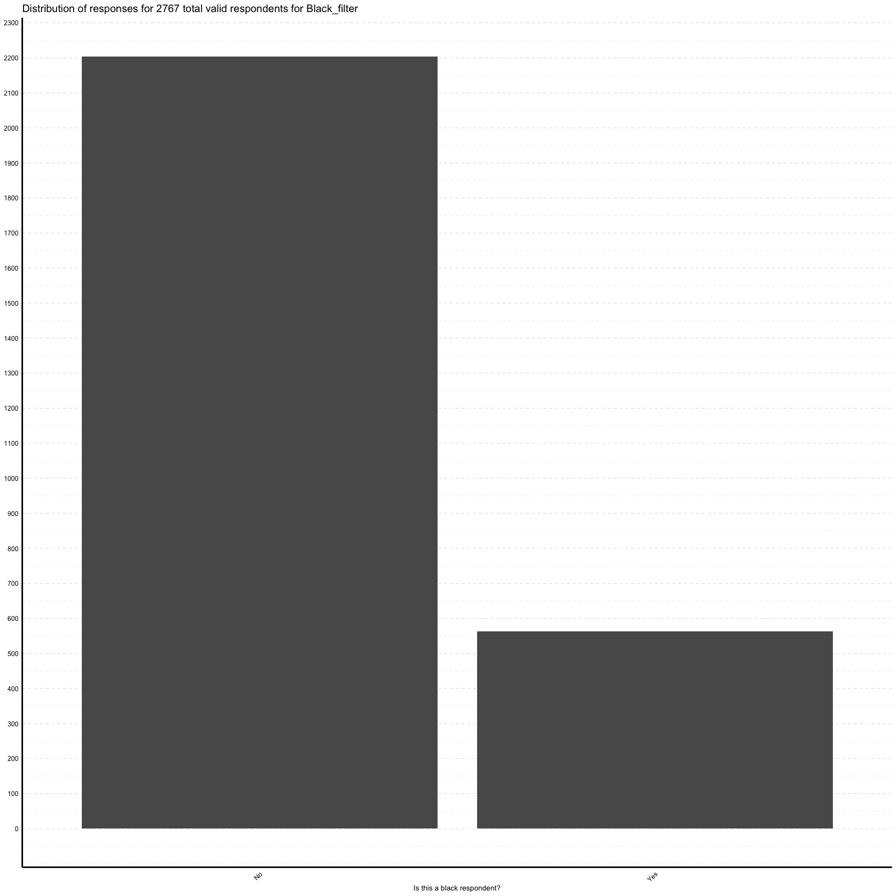<!-- -->

```
Frequencies  
Black_filter  
Label: Is this a black respondent?  
Type: Factor  

              Freq   % Valid   % Valid Cum.   % Total   % Total Cum.
----------- ------ --------- -------------- --------- --------------
         No   2204     79.65          79.65     79.65          79.65
        Yes    563     20.35         100.00     20.35         100.00
       <NA>      0                               0.00         100.00
      Total   2767    100.00         100.00    100.00         100.00
```

<!-- -->

```
Frequencies  
Asian_filter  
Label: Is this an Asian respondent?  
Type: Factor  

              Freq   % Valid   % Valid Cum.   % Total   % Total Cum.
----------- ------ --------- -------------- --------- --------------
         No   2207     79.76          79.76     79.76          79.76
        Yes    560     20.24         100.00     20.24         100.00
       <NA>      0                               0.00         100.00
      Total   2767    100.00         100.00    100.00         100.00
```

```
Warning: Removed 313 rows containing non-finite values (stat_count).
```

<!-- -->

```
Frequencies  
MDQuintile  
Label: Sample frame (PV): IMD quintile within country  
Type: Numeric  

              Freq   % Valid   % Valid Cum.   % Total   % Total Cum.
----------- ------ --------- -------------- --------- --------------
          1    744     30.32          30.32     26.89          26.89
          2    559     22.78          53.10     20.20          47.09
          3    462     18.83          71.92     16.70          63.79
          4    344     14.02          85.94     12.43          76.22
          5    345     14.06         100.00     12.47          88.69
       <NA>    313                              11.31         100.00
      Total   2767    100.00         100.00    100.00         100.00
```

<!-- -->

```
Frequencies  
AGE_BAND  
Label: What is your age band?  
Type: Factor  

              Freq   % Valid   % Valid Cum.   % Total   % Total Cum.
----------- ------ --------- -------------- --------- --------------
      18-24    335     12.11          12.11     12.11          12.11
      25-34    569     20.56          32.67     20.56          32.67
      35-44    584     21.11          53.78     21.11          53.78
      45-54    436     15.76          69.53     15.76          69.53
      55-64    396     14.31          83.85     14.31          83.85
      65-74    301     10.88          94.72     10.88          94.72
        75+    146      5.28         100.00      5.28         100.00
       <NA>      0                               0.00         100.00
      Total   2767    100.00         100.00    100.00         100.00
```

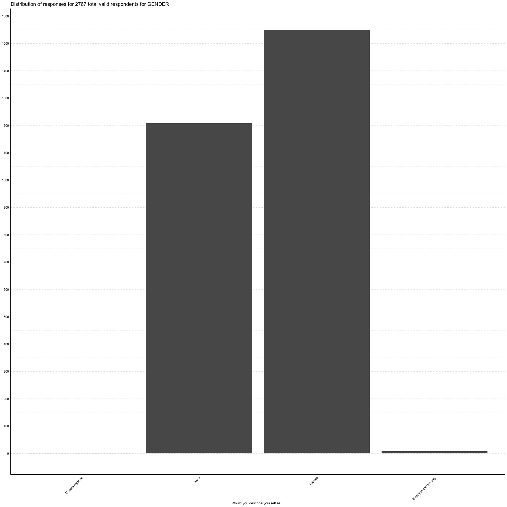<!-- -->

```
Frequencies  
SEX  
Label: Would you describe yourself as…  
Type: Factor  

                                Freq   % Valid   % Valid Cum.   % Total   % Total Cum.
----------------------------- ------ --------- -------------- --------- --------------
              Missing reponse      1     0.036          0.036     0.036          0.036
                         Male   1208    43.657         43.694    43.657         43.694
                       Female   1550    56.017         99.711    56.017         99.711
      Identify in another way      8     0.289        100.000     0.289        100.000
                         <NA>      0                              0.000        100.000
                        Total   2767   100.000        100.000   100.000        100.000
```

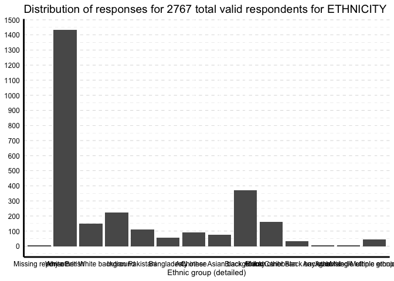<!-- -->

```
Frequencies  
ETHNICITY  
Label: Ethnic group (detailed)  
Type: Factor  

                                      Freq   % Valid   % Valid Cum.   % Total   % Total Cum.
----------------------------------- ------ --------- -------------- --------- --------------
                    Missing reponse      4      0.14           0.14      0.14           0.14
                      White British   1434     51.83          51.97     51.83          51.97
         Any other White background    149      5.38          57.35      5.38          57.35
                             Indian    225      8.13          65.49      8.13          65.49
                          Pakistani    109      3.94          69.43      3.94          69.43
                        Bangladeshi     58      2.10          71.52      2.10          71.52
                            Chinese     91      3.29          74.81      3.29          74.81
         Any other Asian background     77      2.78          77.59      2.78          77.59
                      Black African    370     13.37          90.96     13.37          90.96
                    Black Caribbean    160      5.78          96.75      5.78          96.75
         Any other Black background     33      1.19          97.94      1.19          97.94
                               Arab      5      0.18          98.12      0.18          98.12
      Any other single ethnic group      6      0.22          98.34      0.22          98.34
       Mixed/Multiple ethnic groups     46      1.66         100.00      1.66         100.00
                               <NA>      0                               0.00         100.00
                              Total   2767    100.00         100.00    100.00         100.00
```

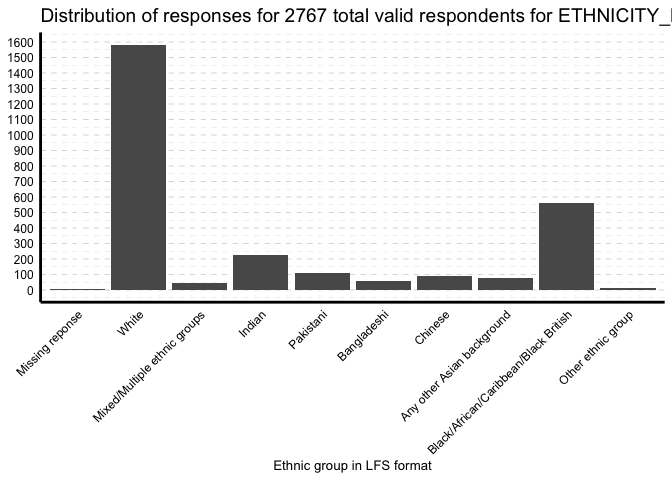<!-- -->

```
Frequencies  
ETHNICITY_LFS  
Label: Ethnic group in LFS format  
Type: Factor  

                                              Freq   % Valid   % Valid Cum.   % Total   % Total Cum.
------------------------------------------- ------ --------- -------------- --------- --------------
                            Missing reponse      4      0.14           0.14      0.14           0.14
                                      White   1583     57.21          57.35     57.21          57.35
               Mixed/Multiple ethnic groups     46      1.66          59.02      1.66          59.02
                                     Indian    225      8.13          67.15      8.13          67.15
                                  Pakistani    109      3.94          71.09      3.94          71.09
                                Bangladeshi     58      2.10          73.18      2.10          73.18
                                    Chinese     91      3.29          76.47      3.29          76.47
                 Any other Asian background     77      2.78          79.26      2.78          79.26
      Black/African/Caribbean/Black British    563     20.35          99.60     20.35          99.60
                         Other ethnic group     11      0.40         100.00      0.40         100.00
                                       <NA>      0                               0.00         100.00
                                      Total   2767    100.00         100.00    100.00         100.00
```

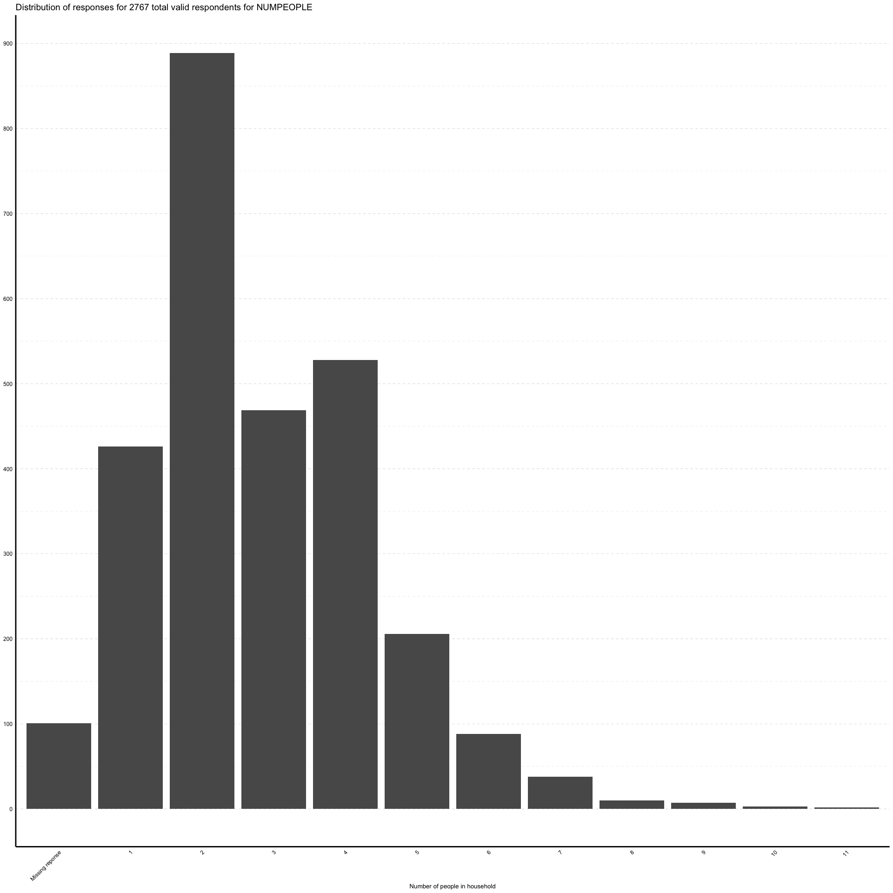<!-- -->

```
Frequencies  
NUMPEOPLE  
Label: Number of people in household  
Type: Factor  

                        Freq   % Valid   % Valid Cum.   % Total   % Total Cum.
--------------------- ------ --------- -------------- --------- --------------
      Missing reponse    101     3.650          3.650     3.650          3.650
                    1    426    15.396         19.046    15.396         19.046
                    2    889    32.129         51.175    32.129         51.175
                    3    469    16.950         68.124    16.950         68.124
                    4    528    19.082         87.206    19.082         87.206
                    5    206     7.445         94.651     7.445         94.651
                    6     88     3.180         97.832     3.180         97.832
                    7     38     1.373         99.205     1.373         99.205
                    8     10     0.361         99.566     0.361         99.566
                    9      7     0.253         99.819     0.253         99.819
                   10      3     0.108         99.928     0.108         99.928
                   11      2     0.072        100.000     0.072        100.000
                 <NA>      0                              0.000        100.000
                Total   2767   100.000        100.000   100.000        100.000
```

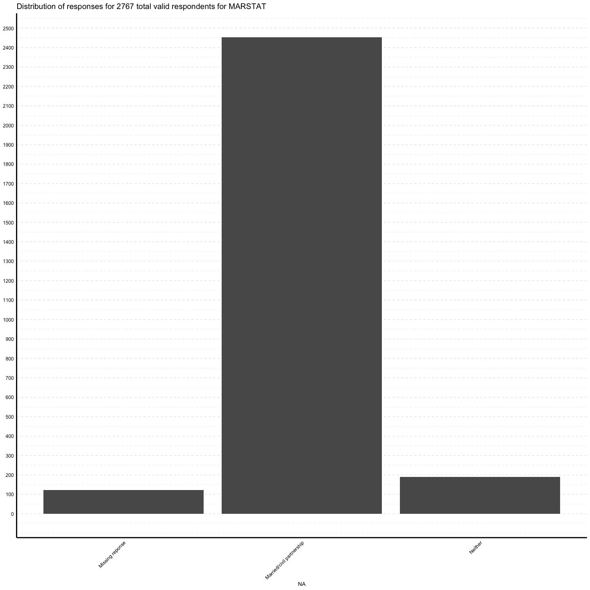<!-- -->

```
Frequencies  
MARSTAT  
Type: Factor  

                                  Freq   % Valid   % Valid Cum.   % Total   % Total Cum.
------------------------------- ------ --------- -------------- --------- --------------
                Missing reponse    123      4.45           4.45      4.45           4.45
      Married/civil partnership   2454     88.69          93.13     88.69          93.13
                        Neither    190      6.87         100.00      6.87         100.00
              Prefer not to say      0      0.00         100.00      0.00         100.00
                           <NA>      0                               0.00         100.00
                          Total   2767    100.00         100.00    100.00         100.00
```

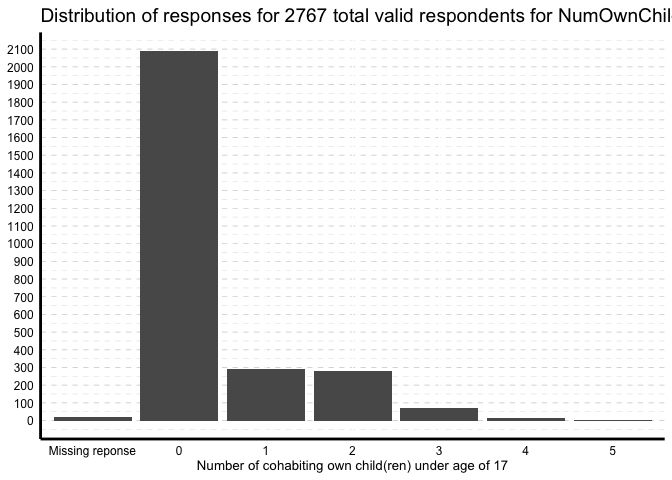<!-- -->

```
Frequencies  
NumOwnChildrenU16HH  
Label: Number of cohabiting own child(ren) under age of 17  
Type: Factor  

                        Freq   % Valid   % Valid Cum.   % Total   % Total Cum.
--------------------- ------ --------- -------------- --------- --------------
      Missing reponse     21      0.76           0.76      0.76           0.76
                    0   2090     75.53          76.29     75.53          76.29
                    1    292     10.55          86.84     10.55          86.84
                    2    280     10.12          96.96     10.12          96.96
                    3     68      2.46          99.42      2.46          99.42
                    4     13      0.47          99.89      0.47          99.89
                    5      3      0.11         100.00      0.11         100.00
                 <NA>      0                               0.00         100.00
                Total   2767    100.00         100.00    100.00         100.00
```

<!-- -->

```
Frequencies  
OwnChildU16OutsideHH  
Label: Whether one or more own child(ren) under age of 16 living elsewhere  
Type: Factor  

                                          Freq   % Valid   % Valid Cum.   % Total   % Total Cum.
--------------------------------------- ------ --------- -------------- --------- --------------
                        Missing reponse     12      0.43           0.43      0.43           0.43
      No u16 own child living elsewhere   2626     94.90          95.34     94.90          95.34
         U16 own child living elsewhere    129      4.66         100.00      4.66         100.00
                                   <NA>      0                               0.00         100.00
                                  Total   2767    100.00         100.00    100.00         100.00
```

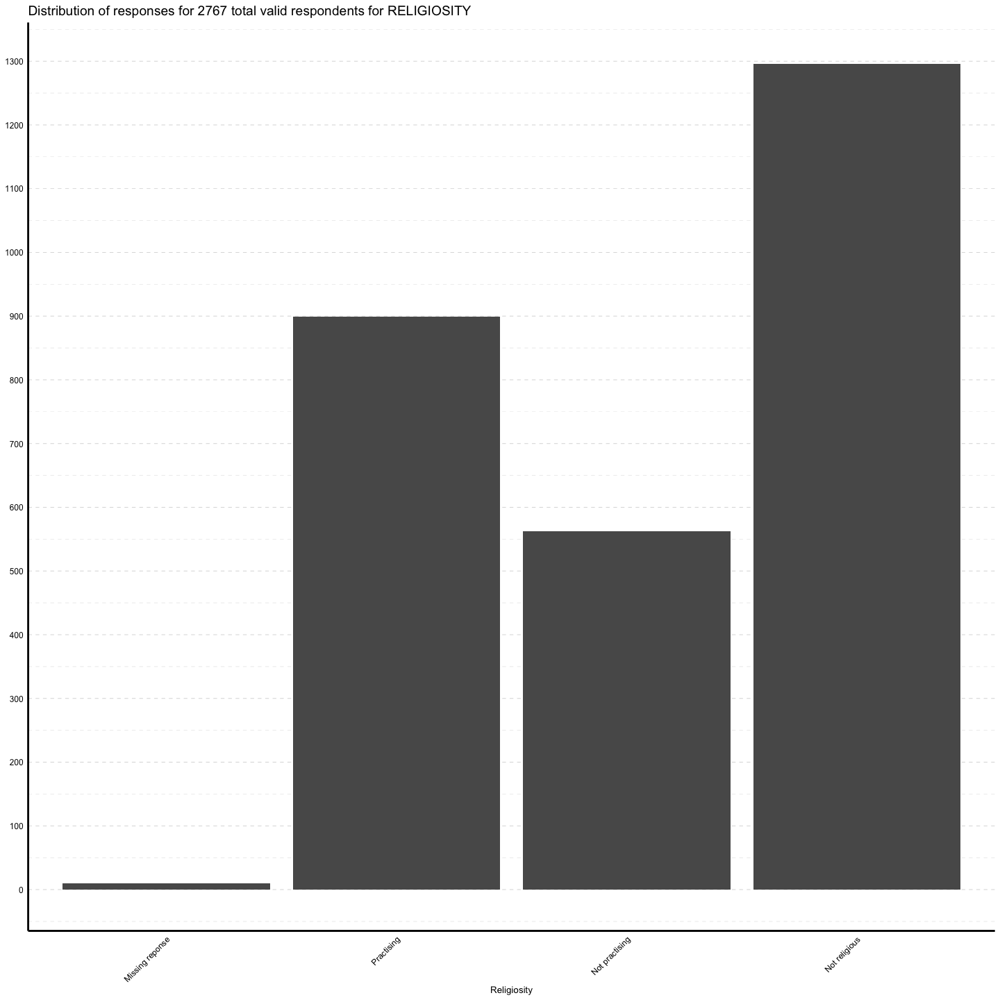<!-- -->

```
Frequencies  
RELIGIOSITY  
Label: Religiosity  
Type: Factor  

                        Freq   % Valid   % Valid Cum.   % Total   % Total Cum.
--------------------- ------ --------- -------------- --------- --------------
      Missing reponse     10      0.36           0.36      0.36           0.36
           Practising    899     32.49          32.85     32.49          32.85
       Not practising    562     20.31          53.16     20.31          53.16
        Not religious   1296     46.84         100.00     46.84         100.00
                 <NA>      0                               0.00         100.00
                Total   2767    100.00         100.00    100.00         100.00
```

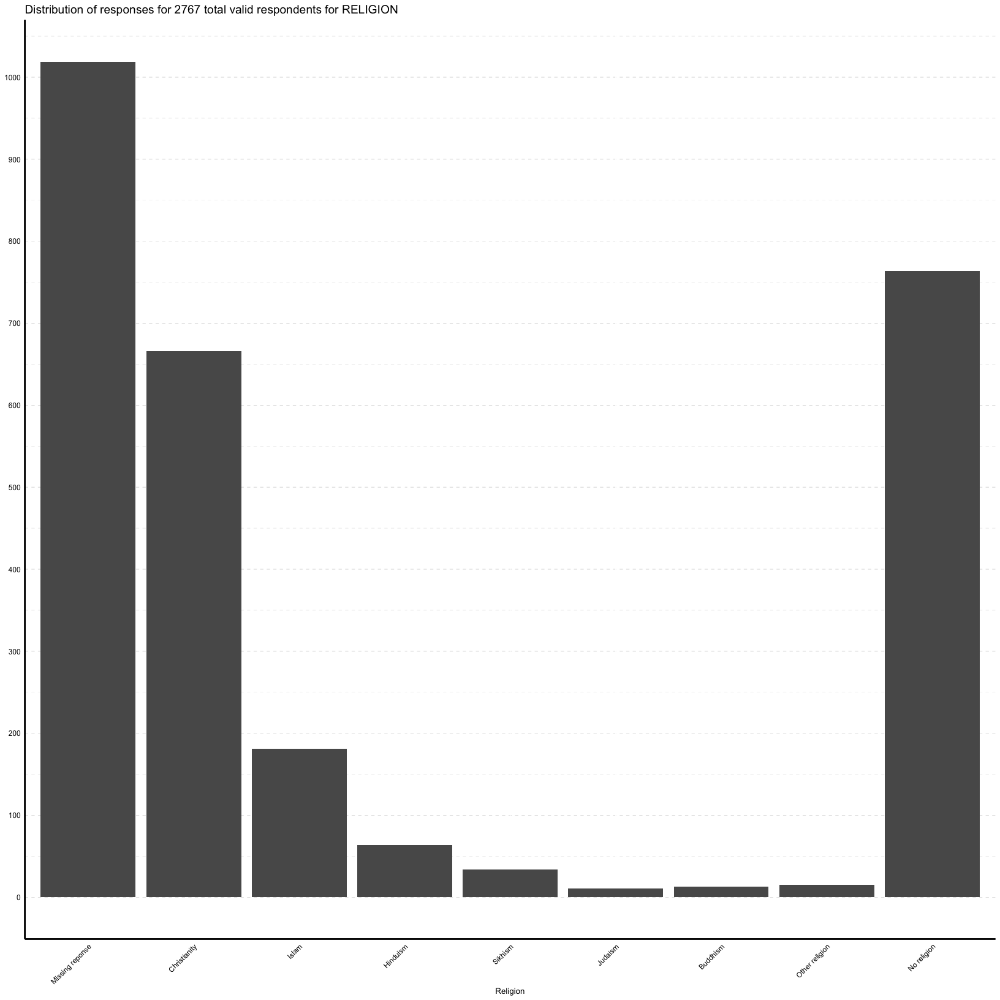<!-- -->

```
Frequencies  
RELIGION  
Label: Religion  
Type: Factor  

                        Freq   % Valid   % Valid Cum.   % Total   % Total Cum.
--------------------- ------ --------- -------------- --------- --------------
      Missing reponse   1019     36.83          36.83     36.83          36.83
         Christianity    666     24.07          60.90     24.07          60.90
                Islam    181      6.54          67.44      6.54          67.44
             Hinduism     64      2.31          69.75      2.31          69.75
              Sikhism     34      1.23          70.98      1.23          70.98
              Judaism     11      0.40          71.38      0.40          71.38
             Buddhism     13      0.47          71.85      0.47          71.85
       Other religion     15      0.54          72.39      0.54          72.39
          No religion    764     27.61         100.00     27.61         100.00
                 <NA>      0                               0.00         100.00
                Total   2767    100.00         100.00    100.00         100.00
```

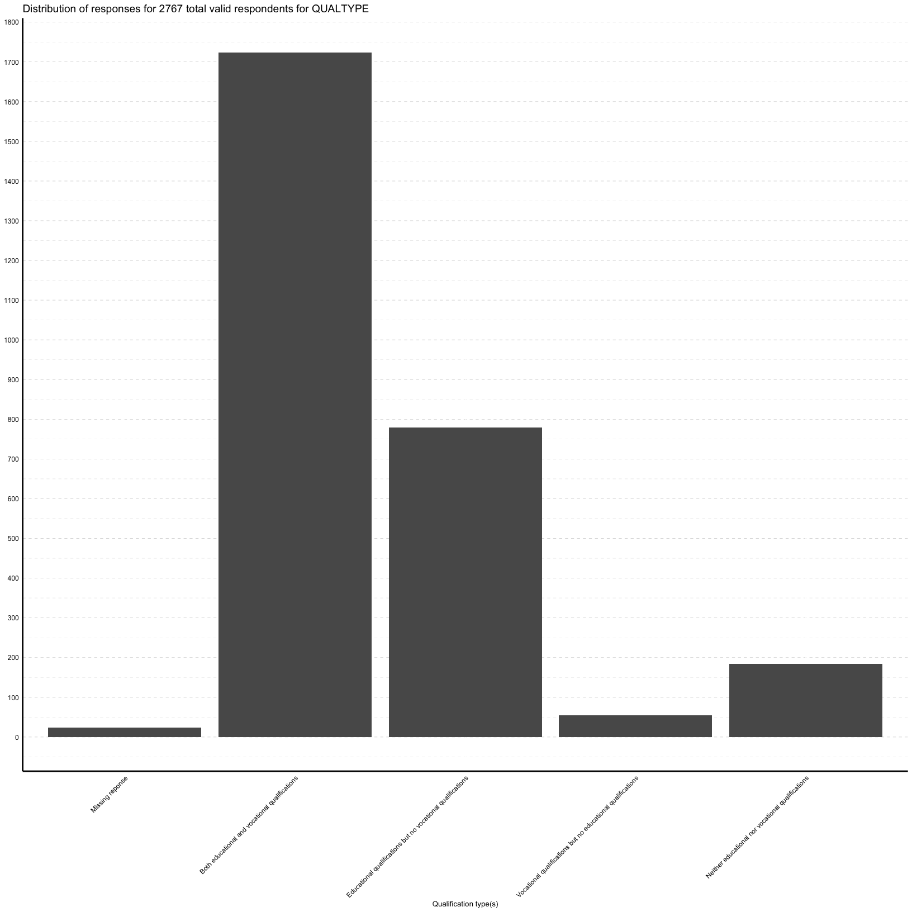<!-- -->

```
Frequencies  
QUALTYPE  
Label: Qualification type(s)  
Type: Factor  

                                                                    Freq   % Valid   % Valid Cum.   % Total   % Total Cum.
----------------------------------------------------------------- ------ --------- -------------- --------- --------------
                                                  Missing reponse     24      0.87           0.87      0.87           0.87
                   Both educational and vocational qualifications   1724     62.31          63.17     62.31          63.17
      Educational qualifications but no vocational qualifications    780     28.19          91.36     28.19          91.36
      Vocational qualifications but no educational qualifications     55      1.99          93.35      1.99          93.35
                Neither educational nor vocational qualifications    184      6.65         100.00      6.65         100.00
                                                             <NA>      0                               0.00         100.00
                                                            Total   2767    100.00         100.00    100.00         100.00
```

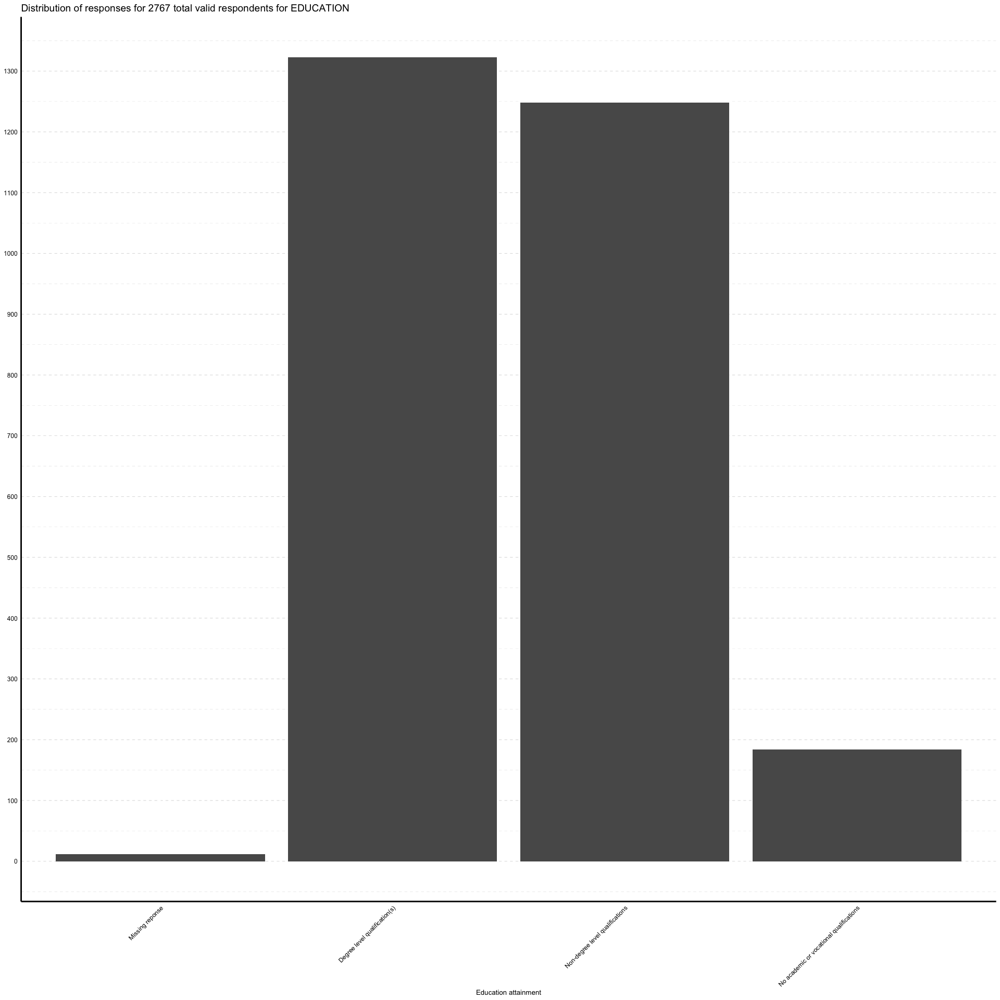<!-- -->

```
Frequencies  
EDUCATION  
Label: Education attainment  
Type: Factor  

                                                 Freq   % Valid   % Valid Cum.   % Total   % Total Cum.
---------------------------------------------- ------ --------- -------------- --------- --------------
                               Missing reponse     12      0.43           0.43      0.43           0.43
                 Degree level qualification(s)   1323     47.81          48.25     47.81          48.25
               Non-degree level qualifications   1248     45.10          93.35     45.10          93.35
      No academic or vocational qualifications    184      6.65         100.00      6.65         100.00
                                          <NA>      0                               0.00         100.00
                                         Total   2767    100.00         100.00    100.00         100.00
```

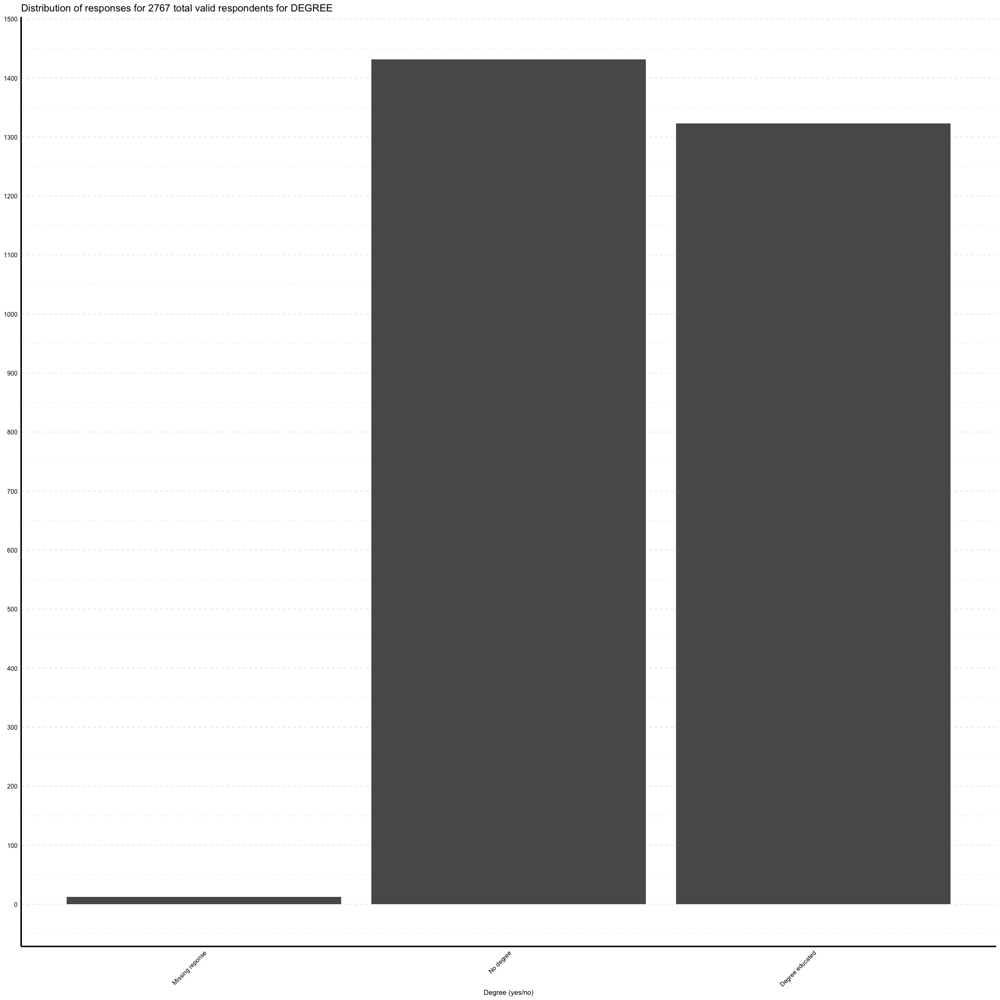<!-- -->

```
Frequencies  
DEGREE  
Label: Degree (yes/no)  
Type: Factor  

                        Freq   % Valid   % Valid Cum.   % Total   % Total Cum.
--------------------- ------ --------- -------------- --------- --------------
      Missing reponse     12      0.43           0.43      0.43           0.43
            No degree   1432     51.75          52.19     51.75          52.19
      Degree educated   1323     47.81         100.00     47.81         100.00
                 <NA>      0                               0.00         100.00
                Total   2767    100.00         100.00    100.00         100.00
```

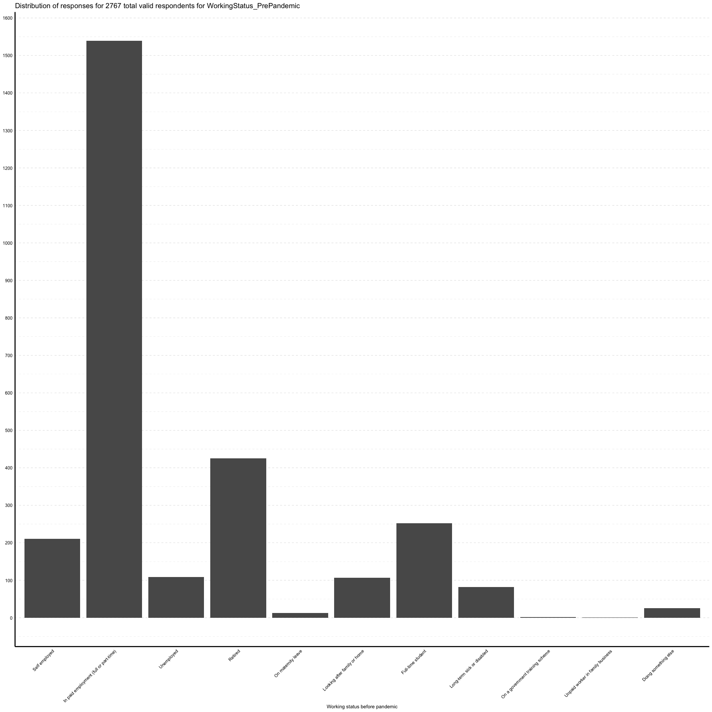<!-- -->

```
Frequencies  
WorkingStatus_PrePandemic  
Label: Working status before pandemic  
Type: Factor  

                                               Freq   % Valid   % Valid Cum.   % Total   % Total Cum.
-------------------------------------------- ------ --------- -------------- --------- --------------
                               Self employed    211     7.626          7.626     7.626          7.626
      In paid employment (full or part-time)   1539    55.620         63.245    55.620         63.245
                                  Unemployed    109     3.939         67.185     3.939         67.185
                                     Retired    425    15.360         82.544    15.360         82.544
                          On maternity leave     13     0.470         83.014     0.470         83.014
                Looking after family or home    107     3.867         86.881     3.867         86.881
                           Full-time student    252     9.107         95.988     9.107         95.988
                  Long-term sick or disabled     82     2.963         98.952     2.963         98.952
             On a government training scheme      2     0.072         99.024     0.072         99.024
            Unpaid worker in family business      1     0.036         99.060     0.036         99.060
                        Doing something else     26     0.940        100.000     0.940        100.000
                                        <NA>      0                              0.000        100.000
                                       Total   2767   100.000        100.000   100.000        100.000
```

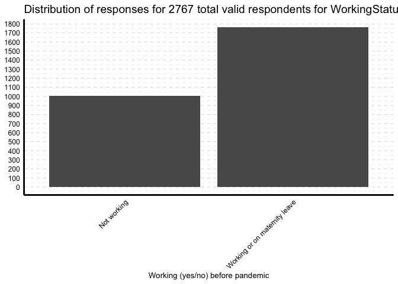<!-- -->

```
Frequencies  
WorkingStatus_PrePandemic_Binary  
Label: Working (yes/no) before pandemic  
Type: Factor  

                                      Freq   % Valid   % Valid Cum.   % Total   % Total Cum.
----------------------------------- ------ --------- -------------- --------- --------------
                        Not working   1003     36.25          36.25     36.25          36.25
      Working or on maternity leave   1764     63.75         100.00     63.75         100.00
                               <NA>      0                               0.00         100.00
                              Total   2767    100.00         100.00    100.00         100.00
```

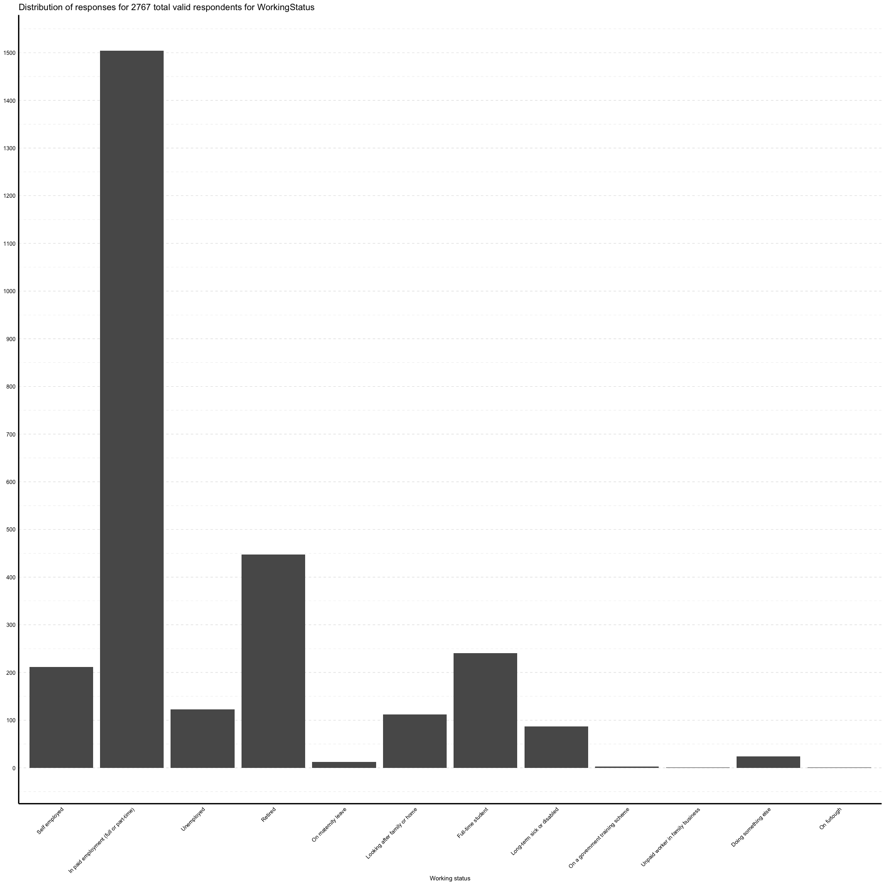<!-- -->

```
Frequencies  
WorkingStatus  
Label: Working status  
Type: Factor  

                                               Freq   % Valid   % Valid Cum.   % Total   % Total Cum.
-------------------------------------------- ------ --------- -------------- --------- --------------
                               Self employed    212     7.662          7.662     7.662          7.662
      In paid employment (full or part-time)   1504    54.355         62.017    54.355         62.017
                                  Unemployed    123     4.445         66.462     4.445         66.462
                                     Retired    447    16.155         82.617    16.155         82.617
                          On maternity leave     12     0.434         83.050     0.434         83.050
                Looking after family or home    112     4.048         87.098     4.048         87.098
                           Full-time student    241     8.710         95.808     8.710         95.808
                  Long-term sick or disabled     87     3.144         98.952     3.144         98.952
             On a government training scheme      3     0.108         99.060     0.108         99.060
            Unpaid worker in family business      1     0.036         99.096     0.036         99.096
                        Doing something else     24     0.867         99.964     0.867         99.964
                                 On furlough      1     0.036        100.000     0.036        100.000
                                        <NA>      0                              0.000        100.000
                                       Total   2767   100.000        100.000   100.000        100.000
```

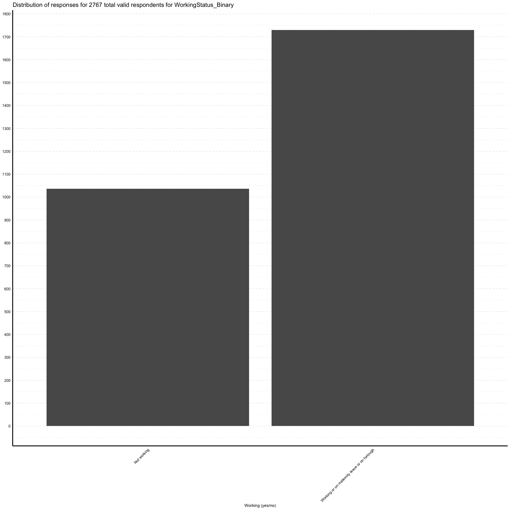<!-- -->

```
Frequencies  
WorkingStatus_Binary  
Label: Working (yes/no)  
Type: Factor  

                                                     Freq   % Valid   % Valid Cum.   % Total   % Total Cum.
-------------------------------------------------- ------ --------- -------------- --------- --------------
                                       Not working   1037     37.48          37.48     37.48          37.48
      Working or on maternity leave or on furlough   1730     62.52         100.00     62.52         100.00
                                              <NA>      0                               0.00         100.00
                                             Total   2767    100.00         100.00    100.00         100.00
```

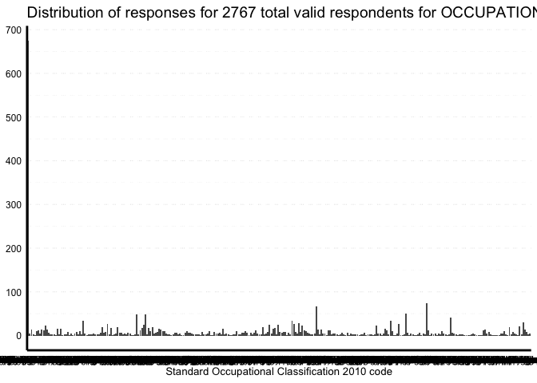<!-- -->

```
Frequencies  
OCCUPATION_SOC2010  
Label: Standard Occupational Classification 2010 code  
Type: Factor  

                                                                           Freq   % Valid   % Valid Cum.   % Total   % Total Cum.
------------------------------------------------------------------------ ------ --------- -------------- --------- --------------
                                                                      -9    675    24.395         24.395    24.395         24.395
                                   Chief executives and senior officials      4     0.145         24.539     0.145         24.539
                                    Elected officers and representatives      0     0.000         24.539     0.000         24.539
                      Production managers and directors in manufacturing     14     0.506         25.045     0.506         25.045
                       Production managers and directors in construction      3     0.108         25.154     0.108         25.154
                  Production managers and directors in mining and energy      1     0.036         25.190     0.036         25.190
                                        Financial managers and directors     10     0.361         25.551     0.361         25.551
                                           Marketing and sales directors     12     0.434         25.985     0.434         25.985
                                       Purchasing managers and directors      4     0.145         26.129     0.145         26.129
                              Advertising and public relations directors      0     0.000         26.129     0.000         26.129
                                   Human resource managers and directors     13     0.470         26.599     0.470         26.599
                 Information technology and telecommunications directors     11     0.398         26.997     0.398         26.997
                                       Functional managers and directors     23     0.831         27.828     0.831         27.828
                            Financial institution managers and directors     14     0.506         28.334     0.506         28.334
                    Managers and directors in transport and distribution      7     0.253         28.587     0.253         28.587
                       Managers and directors in storage and warehousing      2     0.072         28.659     0.072         28.659
                                                Officers in armed forces      2     0.072         28.731     0.072         28.731
                                                  Senior police officers      2     0.072         28.804     0.072         28.804
         Senior officers in fire, ambulance, prison and related services      1     0.036         28.840     0.036         28.840
                Health services and public health managers and directors     15     0.542         29.382     0.542         29.382
                                  Social services managers and directors      3     0.108         29.490     0.108         29.490
                          Managers and directors in retail and wholesale     15     0.542         30.033     0.542         30.033
                Managers and proprietors in agriculture and horticulture      1     0.036         30.069     0.036         30.069
      Managers and proprietors in forestry, fishing and related services      3     0.108         30.177     0.108         30.177
                        Hotel and accommodation managers and proprietors      3     0.108         30.286     0.108         30.286
          Restaurant and catering establishment managers and proprietors      8     0.289         30.575     0.289         30.575
                             Publicans and managers of licensed premises      1     0.036         30.611     0.036         30.611
                                             Leisure and sports managers      4     0.145         30.755     0.145         30.755
                                  Travel agency managers and proprietors      1     0.036         30.791     0.036         30.791
                                           Health care practice managers      0     0.000         30.791     0.000         30.791
         Residential, day and domiciliary  care managers and proprietors      5     0.181         30.972     0.181         30.972
                                   Property, housing and estate managers      9     0.325         31.297     0.325         31.297
                                         Garage managers and proprietors      2     0.072         31.370     0.072         31.370
                  Hairdressing and beauty salon managers and proprietors      0     0.000         31.370     0.000         31.370
                      Shopkeepers and proprietors – wholesale and retail     10     0.361         31.731     0.361         31.731
                      Waste disposal and environmental services managers      2     0.072         31.803     0.072         31.803
                              Managers and proprietors in other services     34     1.229         33.032     1.229         33.032
                                                     Chemical scientists      0     0.000         33.032     0.000         33.032
                                   Biological scientists and biochemists      4     0.145         33.177     0.145         33.177
                                                     Physical scientists      1     0.036         33.213     0.036         33.213
                                        Social and humanities scientists      2     0.072         33.285     0.072         33.285
                                Natural and social science professionals      2     0.072         33.357     0.072         33.357
                                                         Civil engineers      3     0.108         33.466     0.108         33.466
                                                    Mechanical engineers      4     0.145         33.610     0.145         33.610
                                                    Electrical engineers      3     0.108         33.719     0.108         33.719
                                                   Electronics engineers      0     0.000         33.719     0.000         33.719
                                        Design and development engineers      2     0.072         33.791     0.072         33.791
                                        Production and process engineers      2     0.072         33.863     0.072         33.863
                                               Engineering professionals      7     0.253         34.116     0.253         34.116
                                                  IT specialist managers     19     0.687         34.803     0.687         34.803
                                       IT project and programme managers      7     0.253         35.056     0.253         35.056
                  IT business analysts, architects and systems designers      8     0.289         35.345     0.289         35.345
                      Programmers and software development professionals     26     0.940         36.285     0.940         36.285
                                Web design and development professionals      3     0.108         36.393     0.108         36.393
             Information technology and telecommunications professionals     17     0.614         37.008     0.614         37.008
                                              Conservation professionals      1     0.036         37.044     0.036         37.044
                                               Environment professionals      2     0.072         37.116     0.072         37.116
                                       Research and development managers      5     0.181         37.297     0.181         37.297
                                                   Medical practitioners     20     0.723         38.020     0.723         38.020
                                                           Psychologists      6     0.217         38.236     0.217         38.236
                                                             Pharmacists      6     0.217         38.453     0.217         38.453
                                                    Ophthalmic opticians      2     0.072         38.525     0.072         38.525
                                                    Dental practitioners      5     0.181         38.706     0.181         38.706
                                                           Veterinarians      3     0.108         38.815     0.108         38.815
                                                   Medical radiographers      0     0.000         38.815     0.000         38.815
                                                             Podiatrists      0     0.000         38.815     0.000         38.815
                                                    Health professionals      6     0.217         39.031     0.217         39.031
                                                        Physiotherapists      4     0.145         39.176     0.145         39.176
                                                 Occupational therapists      1     0.036         39.212     0.036         39.212
                                          Speech and language therapists      1     0.036         39.248     0.036         39.248
                                                   Therapy professionals      2     0.072         39.321     0.072         39.321
                                                                  Nurses     48     1.735         41.055     1.735         41.055
                                                                Midwives      2     0.072         41.128     0.072         41.128
                                 Higher education teaching professionals     11     0.398         41.525     0.398         41.525
                                Further education teaching professionals     17     0.614         42.140     0.614         42.140
                              Secondary education teaching professionals     24     0.867         43.007     0.867         43.007
                    Primary and nursery education teaching professionals     49     1.771         44.778     1.771         44.778
                          Special needs education teaching professionals      3     0.108         44.886     0.108         44.886
                      Senior professionals of educational establishments     17     0.614         45.501     0.614         45.501
                                Education advisers and school inspectors     10     0.361         45.862     0.361         45.862
                            Teaching and other educational professionals     19     0.687         46.549     0.687         46.549
                                                   Barristers and judges      0     0.000         46.549     0.000         46.549
                                                              Solicitors      4     0.145         46.693     0.145         46.693
                                                     Legal professionals      7     0.253         46.946     0.253         46.946
                                     Chartered and certified accountants      9     0.325         47.271     0.325         47.271
                            Management consultants and business analysts     16     0.578         47.850     0.578         47.850
                 Business and financial project management professionals     14     0.506         48.356     0.506         48.356
                                 Actuaries, economists and statisticians     10     0.361         48.717     0.361         48.717
                             Business and related research professionals     10     0.361         49.078     0.361         49.078
                     Business, research and administrative professionals      5     0.181         49.259     0.181         49.259
                                                              Architects      0     0.000         49.259     0.000         49.259
                                                  Town planning officers      0     0.000         49.259     0.000         49.259
                                                      Quantity surveyors      3     0.108         49.368     0.108         49.368
                                                     Chartered surveyors      2     0.072         49.440     0.072         49.440
                                   Chartered architectural technologists      1     0.036         49.476     0.036         49.476
                 Construction project managers and related professionals      3     0.108         49.584     0.108         49.584
                                                          Social workers      6     0.217         49.801     0.217         49.801
                                                      Probation officers      0     0.000         49.801     0.000         49.801
                                                                  Clergy      7     0.253         50.054     0.253         50.054
                                                   Welfare professionals      2     0.072         50.126     0.072         50.126
                                                              Librarians      5     0.181         50.307     0.181         50.307
                                                 Archivists and curators      1     0.036         50.343     0.036         50.343
                                  Quality control and planning engineers      1     0.036         50.379     0.036         50.379
                          Quality assurance and regulatory professionals      7     0.253         50.632     0.253         50.632
                                      Environmental health professionals      0     0.000         50.632     0.000         50.632
                           Journalists, newspaper and periodical editors     10     0.361         50.994     0.361         50.994
                                          Public relations professionals      6     0.217         51.211     0.217         51.211
                    Advertising accounts managers and creative directors      6     0.217         51.428     0.217         51.428
                                                  Laboratory technicians      4     0.145         51.572     0.145         51.572
                                  Electrical and electronics technicians      3     0.108         51.681     0.108         51.681
                                                 Engineering technicians      3     0.108         51.789     0.108         51.789
                              Building and civil engineering technicians      2     0.072         51.861     0.072         51.861
                                           Quality assurance technicians      3     0.108         51.970     0.108         51.970
                            Planning, process and production technicians      1     0.036         52.006     0.036         52.006
                         Science, engineering and production technicians      9     0.325         52.331     0.325         52.331
                             Architectural and town planning technicians      2     0.072         52.403     0.072         52.403
                                                         Draughtspersons      2     0.072         52.476     0.072         52.476
                                               IT operations technicians      5     0.181         52.656     0.181         52.656
                                             IT user support technicians     10     0.361         53.018     0.361         53.018
                                                              Paramedics      1     0.036         53.054     0.036         53.054
                                                    Dispensing opticians      0     0.000         53.054     0.000         53.054
                                              Pharmaceutical technicians      1     0.036         53.090     0.036         53.090
                                          Medical and dental technicians      0     0.000         53.090     0.000         53.090
                                          Health associate professionals      8     0.289         53.379     0.289         53.379
                                             Youth and community workers      5     0.181         53.560     0.181         53.560
                                          Child and early years officers      4     0.145         53.704     0.145         53.704
                                                        Housing officers      6     0.217         53.921     0.217         53.921
                                                             Counsellors      2     0.072         53.993     0.072         53.993
                             Welfare and housing associate professionals     15     0.542         54.536     0.542         54.536
                                                    NCOs and other ranks      3     0.108         54.644     0.108         54.644
                                    Police officers (sergeant and below)      4     0.145         54.789     0.145         54.789
                         Fire service officers (watch manager and below)      2     0.072         54.861     0.072         54.861
                       Prison service officers (below principal officer)      1     0.036         54.897     0.036         54.897
                                       Police community support officers      1     0.036         54.933     0.036         54.933
                              Protective service associate professionals      3     0.108         55.042     0.108         55.042
                                                                 Artists      2     0.072         55.114     0.072         55.114
                                        Authors, writers and translators     10     0.361         55.475     0.361         55.475
                                     Actors, entertainers and presenters      3     0.108         55.584     0.108         55.584
                                              Dancers and choreographers      0     0.000         55.584     0.000         55.584
                                                               Musicians      2     0.072         55.656     0.072         55.656
                                  Arts officers, producers and directors      6     0.217         55.873     0.217         55.873
        Photographers, audio-visual and broadcasting equipment operators      6     0.217         56.090     0.217         56.090
                                                       Graphic designers     10     0.361         56.451     0.361         56.451
                                 Product, clothing and related designers      7     0.253         56.704     0.253         56.704
                                                          Sports players      1     0.036         56.740     0.036         56.740
                               Sports coaches, instructors and officials      7     0.253         56.993     0.253         56.993
                                                     Fitness instructors      2     0.072         57.065     0.072         57.065
                                                 Air traffic controllers      0     0.000         57.065     0.000         57.065
                                    Aircraft pilots and flight engineers      6     0.217         57.282     0.217         57.282
                                            Ship and hovercraft officers      0     0.000         57.282     0.000         57.282
                                           Legal associate professionals     11     0.398         57.680     0.398         57.680
                                       Estimators, valuers and assessors      4     0.145         57.824     0.145         57.824
                                                                 Brokers      2     0.072         57.897     0.072         57.897
                                                  Insurance underwriters      2     0.072         57.969     0.072         57.969
                            Finance and investment analysts and advisers     20     0.723         58.692     0.723         58.692
                                                        Taxation experts      2     0.072         58.764     0.072         58.764
                                                 Importers and exporters      0     0.000         58.764     0.000         58.764
                                    Financial and accounting technicians      4     0.145         58.909     0.145         58.909
                                             Financial accounts managers      9     0.325         59.234     0.325         59.234
                            Business and related associate professionals     24     0.867         60.101     0.867         60.101
                                         Buyers and procurement officers      5     0.181         60.282     0.181         60.282
                                               Business sales executives     15     0.542         60.824     0.542         60.824
                                       Marketing associate professionals     18     0.651         61.475     0.651         61.475
                                           Estate agents and auctioneers      2     0.072         61.547     0.072         61.547
                        Sales accounts and business development managers     25     0.904         62.450     0.904         62.450
                       Conference and exhibition managers and organisers      8     0.289         62.739     0.289         62.739
                  Conservation and environmental associate professionals      0     0.000         62.739     0.000         62.739
                                 Public services associate professionals      7     0.253         62.992     0.253         62.992
                       Human resources and industrial relations officers      9     0.325         63.318     0.325         63.318
                      Vocational and industrial trainers and instructors      9     0.325         63.643     0.325         63.643
                    Careers advisers and vocational guidance specialists      1     0.036         63.679     0.036         63.679
                                 Inspectors of standards and regulations      6     0.217         63.896     0.217         63.896
                                              Health and safety officers      3     0.108         64.004     0.108         64.004
                          National government administrative occupations     33     1.193         65.197     1.193         65.197
                             Local government administrative occupations     27     0.976         66.173     0.976         66.173
                              Officers of non-governmental organisations      8     0.289         66.462     0.289         66.462
                                                      Credit controllers      4     0.145         66.606     0.145         66.606
                         Book-keepers, payroll managers and wages clerks     29     1.048         67.654     1.048         67.654
                                             Bank and post office clerks      8     0.289         67.944     0.289         67.944
                                                        Finance officers      0     0.000         67.944     0.000         67.944
                                    Financial administrative occupations     22     0.795         68.739     0.795         68.739
                                           Records clerks and assistants     12     0.434         69.172     0.434         69.172
                            Pensions and insurance clerks and assistants     10     0.361         69.534     0.361         69.534
                                     Stock control clerks and assistants      6     0.217         69.751     0.217         69.751
                        Transport and distribution clerks and assistants      5     0.181         69.931     0.181         69.931
                                           Library clerks and assistants      2     0.072         70.004     0.072         70.004
                              Human resources administrative occupations      3     0.108         70.112     0.108         70.112
                                                    Sales administrators      5     0.181         70.293     0.181         70.293
                                        Other administrative occupations     67     2.421         72.714     2.421         72.714
                                                         Office managers     13     0.470         73.184     0.470         73.184
                                                      Office supervisors      2     0.072         73.256     0.072         73.256
                                                     Medical secretaries     14     0.506         73.762     0.506         73.762
                                                       Legal secretaries      5     0.181         73.943     0.181         73.943
                                                      School secretaries      4     0.145         74.087     0.145         74.087
                                                     Company secretaries      1     0.036         74.124     0.036         74.124
                               Personal assistants and other secretaries     12     0.434         74.557     0.434         74.557
                                                           Receptionists     11     0.398         74.955     0.398         74.955
                                Typists and related keyboard occupations      3     0.108         75.063     0.108         75.063
                                                                 Farmers      4     0.145         75.208     0.145         75.208
                                                    Horticultural trades      0     0.000         75.208     0.000         75.208
                                       Gardeners and landscape gardeners      5     0.181         75.389     0.181         75.389
                                             Groundsmen and greenkeepers      3     0.108         75.497     0.108         75.497
                                         Agricultural and fishing trades      0     0.000         75.497     0.000         75.497
                                                Smiths and forge workers      0     0.000         75.497     0.000         75.497
                                   Moulders, core makers and die casters      0     0.000         75.497     0.000         75.497
                                                     Sheet metal workers      0     0.000         75.497     0.000         75.497
                                       Metal plate workers, and riveters      0     0.000         75.497     0.000         75.497
                                                          Welding trades      1     0.036         75.533     0.036         75.533
                                                            Pipe fitters      0     0.000         75.533     0.000         75.533
                            Metal machining setters and setter-operators      2     0.072         75.605     0.072         75.605
                               Tool makers, tool fitters and markers-out      0     0.000         75.605     0.000         75.605
                        Metal working production and maintenance fitters      6     0.217         75.822     0.217         75.822
                               Precision instrument makers and repairers      2     0.072         75.894     0.072         75.894
                            Air-conditioning and refrigeration engineers      1     0.036         75.931     0.036         75.931
                         Vehicle technicians, mechanics and electricians      7     0.253         76.184     0.253         76.184
                                     Vehicle body builders and repairers      0     0.000         76.184     0.000         76.184
                                               Vehicle paint technicians      0     0.000         76.184     0.000         76.184
                                 Aircraft maintenance and related trades      1     0.036         76.220     0.036         76.220
                                    Boat and ship builders and repairers      0     0.000         76.220     0.000         76.220
                           Rail and rolling stock builders and repairers      0     0.000         76.220     0.000         76.220
                                     Electricians and electrical fitters      5     0.181         76.400     0.181         76.400
                                            Telecommunications engineers      2     0.072         76.473     0.072         76.473
                                           TV, video and audio engineers      2     0.072         76.545     0.072         76.545
                                                            IT engineers      3     0.108         76.653     0.108         76.653
                                        Electrical and electronic trades      3     0.108         76.762     0.108         76.762
             Skilled metal, electrical and electronic trades supervisors      1     0.036         76.798     0.036         76.798
                                                          Steel erectors      0     0.000         76.798     0.000         76.798
                                                  Bricklayers and masons      2     0.072         76.870     0.072         76.870
                                        Roofers, roof tilers and slaters      0     0.000         76.870     0.000         76.870
                          Plumbers and heating and ventilating engineers      2     0.072         76.943     0.072         76.943
                                                  Carpenters and joiners      6     0.217         77.159     0.217         77.159
                                Glaziers, window fabricators and fitters      1     0.036         77.196     0.036         77.196
                                        Construction and building trades      2     0.072         77.268     0.072         77.268
                                                              Plasterers      0     0.000         77.268     0.000         77.268
                                                Floorers and wall tilers      0     0.000         77.268     0.000         77.268
                                                 Painters and decorators      2     0.072         77.340     0.072         77.340
                            Construction and building trades supervisors      2     0.072         77.412     0.072         77.412
                                                    Weavers and knitters      0     0.000         77.412     0.000         77.412
                                                            Upholsterers      0     0.000         77.412     0.000         77.412
                                     Footwear and leather working trades      0     0.000         77.412     0.000         77.412
                                                 Tailors and dressmakers      0     0.000         77.412     0.000         77.412
                                   Textiles, garments and related trades      0     0.000         77.412     0.000         77.412
                                                   Pre-press technicians      0     0.000         77.412     0.000         77.412
                                                                Printers      0     0.000         77.412     0.000         77.412
                                     Print finishing and binding workers      0     0.000         77.412     0.000         77.412
                                                                Butchers      1     0.036         77.449     0.036         77.449
                                          Bakers and flour confectioners      3     0.108         77.557     0.108         77.557
                                        Fishmongers and poultry dressers      0     0.000         77.557     0.000         77.557
                                                                   Chefs     22     0.795         78.352     0.795         78.352
                                                                   Cooks      4     0.145         78.497     0.145         78.497
                                               Catering and bar managers      5     0.181         78.677     0.181         78.677
                     Glass and ceramics makers, decorators and finishers      0     0.000         78.677     0.000         78.677
                            Furniture makers and other craft woodworkers      1     0.036         78.713     0.036         78.713
                                                                Florists      0     0.000         78.713     0.000         78.713
                                                    Other skilled trades      4     0.145         78.858     0.145         78.858
                                           Nursery nurses and assistants     16     0.578         79.436     0.578         79.436
                                    Childminders and related occupations     11     0.398         79.834     0.398         79.834
                                                             Playworkers      3     0.108         79.942     0.108         79.942
                                                     Teaching assistants     33     1.193         81.135     1.193         81.135
                                          Educational support assistants     10     0.361         81.496     0.361         81.496
                                                       Veterinary nurses      1     0.036         81.532     0.036         81.532
                                                   Pest control officers      1     0.036         81.568     0.036         81.568
                                        Animal care services occupations      4     0.145         81.713     0.145         81.713
                                      Nursing auxiliaries and assistants     26     0.940         82.653     0.940         82.653
                                  Ambulance staff (excluding paramedics)      1     0.036         82.689     0.036         82.689
                                                           Dental nurses      1     0.036         82.725     0.036         82.725
                                    Houseparents and residential wardens      3     0.108         82.833     0.108         82.833
                                            Care workers and home carers     51     1.843         84.677     1.843         84.677
                                                     Senior care workers      6     0.217         84.893     0.217         84.893
                                                            Care escorts      1     0.036         84.930     0.036         84.930
                        Undertakers, mortuary and crematorium assistants      0     0.000         84.930     0.000         84.930
                                           Sports and leisure assistants      4     0.145         85.074     0.145         85.074
                                                           Travel agents      3     0.108         85.183     0.108         85.183
                                                   Air travel assistants      1     0.036         85.219     0.036         85.219
                                                  Rail travel assistants      1     0.036         85.255     0.036         85.255
                                  Leisure and travel service occupations      2     0.072         85.327     0.072         85.327
                                                Hairdressers and barbers      6     0.217         85.544     0.217         85.544
                                     Beauticians and related occupations      1     0.036         85.580     0.036         85.580
                                    Housekeepers and related occupations      0     0.000         85.580     0.000         85.580
                                                              Caretakers      4     0.145         85.725     0.145         85.725
                      Cleaning and housekeeping managers and supervisors      3     0.108         85.833     0.108         85.833
                                             Sales and retail assistants     74     2.674         88.507     2.674         88.507
                                 Retail cashiers and check-out operators     11     0.398         88.905     0.398         88.905
                                                  Telephone salespersons      1     0.036         88.941     0.036         88.941
                                Pharmacy and other dispensing assistants      5     0.181         89.122     0.181         89.122
                             Vehicle and parts salespersons and advisers      3     0.108         89.230     0.108         89.230
                                Collector salespersons and credit agents      0     0.000         89.230     0.000         89.230
                                    Debt, rent and other cash collectors      4     0.145         89.375     0.145         89.375
                                      Roundspersons and van salespersons      1     0.036         89.411     0.036         89.411
                                Market and street traders and assistants      0     0.000         89.411     0.000         89.411
                                       Merchandisers and window dressers      5     0.181         89.592     0.181         89.592
                                               Sales related occupations      3     0.108         89.700     0.108         89.700
                                                       Sales supervisors     10     0.361         90.061     0.361         90.061
                                     Call and contact centre occupations      4     0.145         90.206     0.145         90.206
                                                            Telephonists      2     0.072         90.278     0.072         90.278
                                                 Communication operators      1     0.036         90.314     0.036         90.314
                                            Market research interviewers      2     0.072         90.387     0.072         90.387
                                            Customer service occupations     41     1.482         91.868     1.482         91.868
                               Customer service managers and supervisors      6     0.217         92.085     0.217         92.085
                              Food, drink and tobacco process operatives      5     0.181         92.266     0.181         92.266
                                   Glass and ceramics process operatives      0     0.000         92.266     0.000         92.266
                                              Textile process operatives      0     0.000         92.266     0.000         92.266
                                 Chemical and related process operatives      3     0.108         92.374     0.108         92.374
                                               Rubber process operatives      1     0.036         92.411     0.036         92.411
                                             Plastics process operatives      2     0.072         92.483     0.072         92.483
                            Metal making and treating process operatives      0     0.000         92.483     0.000         92.483
                                                          Electroplaters      0     0.000         92.483     0.000         92.483
                                                      Process operatives      3     0.108         92.591     0.108         92.591
                                       Paper and wood machine operatives      2     0.072         92.664     0.072         92.664
                                                    Coal mine operatives      0     0.000         92.664     0.000         92.664
                                   Quarry workers and related operatives      0     0.000         92.664     0.000         92.664
                                                 Energy plant operatives      0     0.000         92.664     0.000         92.664
                                        Metal working machine operatives      1     0.036         92.700     0.036         92.700
                                     Water and sewerage plant operatives      1     0.036         92.736     0.036         92.736
                                             Printing machine assistants      0     0.000         92.736     0.000         92.736
                                            Plant and machine operatives      1     0.036         92.772     0.036         92.772
                         Assemblers (electrical and electronic products)      1     0.036         92.808     0.036         92.808
                                   Assemblers (vehicles and metal goods)      3     0.108         92.917     0.108         92.917
                                          Routine inspectors and testers      0     0.000         92.917     0.000         92.917
                                           Weighers, graders and sorters      0     0.000         92.917     0.000         92.917
                                    Tyre, exhaust and windscreen fitters      0     0.000         92.917     0.000         92.917
                                                       Sewing machinists      5     0.181         93.097     0.181         93.097
                                       Assemblers and routine operatives      3     0.108         93.206     0.108         93.206
                                        Scaffolders, stagers and riggers      1     0.036         93.242     0.036         93.242
                                            Road construction operatives      1     0.036         93.278     0.036         93.278
                            Rail construction and maintenance operatives      1     0.036         93.314     0.036         93.314
                                                 Construction operatives      1     0.036         93.350     0.036         93.350
                                             Large goods vehicle drivers     11     0.398         93.748     0.398         93.748
                                                             Van drivers     13     0.470         94.218     0.470         94.218
                                                   Bus and coach drivers      4     0.145         94.362     0.145         94.362
                                     Taxi and cab drivers and chauffeurs      9     0.325         94.687     0.325         94.687
                                                     Driving instructors      3     0.108         94.796     0.108         94.796
                                                           Crane drivers      0     0.000         94.796     0.000         94.796
                                                 Fork-lift truck drivers      1     0.036         94.832     0.036         94.832
                                          Agricultural machinery drivers      0     0.000         94.832     0.000         94.832
                                   Mobile machine drivers and operatives      0     0.000         94.832     0.000         94.832
                                                  Train and tram drivers      1     0.036         94.868     0.036         94.868
                               Marine and waterways transport operatives      0     0.000         94.868     0.000         94.868
                                                Air transport operatives      0     0.000         94.868     0.000         94.868
                                               Rail transport operatives      0     0.000         94.868     0.000         94.868
                                  Other drivers and transport operatives      1     0.036         94.904     0.036         94.904
                                                            Farm workers      1     0.036         94.940     0.036         94.940
                                                        Forestry workers      0     0.000         94.940     0.000         94.940
                    Fishing and other elementary agriculture occupations      0     0.000         94.940     0.000         94.940
                                     Elementary construction occupations      0     0.000         94.940     0.000         94.940
                                 Industrial cleaning process occupations      1     0.036         94.977     0.036         94.977
                                  Packers, bottlers, canners and fillers      4     0.145         95.121     0.145         95.121
                                    Elementary process plant occupations      4     0.145         95.266     0.145         95.266
                   Postal workers, mail sorters, messengers and couriers     10     0.361         95.627     0.361         95.627
                                   Elementary administration occupations      2     0.072         95.699     0.072         95.699
                                                         Window cleaners      1     0.036         95.735     0.036         95.735
                                                         Street cleaners      0     0.000         95.735     0.000         95.735
                                                  Cleaners and domestics     19     0.687         96.422     0.687         96.422
                                   Launderers, dry cleaners and pressers      2     0.072         96.494     0.072         96.494
                                          Refuse and salvage occupations      0     0.000         96.494     0.000         96.494
                                           Vehicle valeters and cleaners      0     0.000         96.494     0.000         96.494
                                         Elementary cleaning occupations      0     0.000         96.494     0.000         96.494
                                 Security guards and related occupations      8     0.289         96.784     0.289         96.784
                               Parking and civil enforcement occupations      0     0.000         96.784     0.000         96.784
                           School midday and crossing patrol occupations      5     0.181         96.964     0.181         96.964
                                         Elementary security occupations      2     0.072         97.037     0.072         97.037
                                                           Shelf fillers      1     0.036         97.073     0.036         97.073
                                            Elementary sales occupations      0     0.000         97.073     0.000         97.073
                                          Elementary storage occupations     21     0.759         97.832     0.759         97.832
                                                        Hospital porters      2     0.072         97.904     0.072         97.904
                                         Kitchen and catering assistants     30     1.084         98.988     1.084         98.988
                                                  Waiters and waitresses     14     0.506         99.494     0.506         99.494
                                                               Bar staff      8     0.289         99.783     0.289         99.783
                                       Leisure and theme park attendants      2     0.072         99.855     0.072         99.855
                                   Other elementary services occupations      4     0.145        100.000     0.145        100.000
                                                                    <NA>      0                              0.000        100.000
                                                                   Total   2767   100.000        100.000   100.000        100.000
```

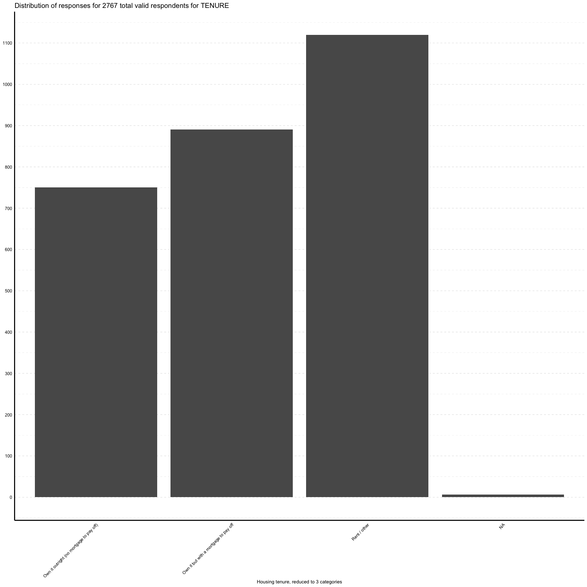<!-- -->

```
Frequencies  
OCCUPATION_NSSEC  
Label: NS-SEC Analytic Categories  
Type: Factor  

                                                                                  Freq   % Valid   % Valid Cum.   % Total   % Total Cum.
------------------------------------------------------------------------------- ------ --------- -------------- --------- --------------
                                                                             -9    398    14.384         14.384    14.384         14.384
              1: Higher managerial, administrative and professional occupations      0     0.000         14.384     0.000         14.384
      1.1: Large employers and higher managerial and administrative occupations     67     2.421         16.805     2.421         16.805
                                           1.2: Higher professional occupations    269     9.722         26.527     9.722         26.527
               2: Lower managerial, administrative and professional occupations    618    22.335         48.862    22.335         48.862
                                                    3: Intermediate occupations    367    13.263         62.125    13.263         62.125
                                                                            3.1     16     0.578         62.703     0.578         62.703
                                                                            3.2      5     0.181         62.884     0.181         62.884
                                     4: Small employers and own account workers    146     5.276         68.160     5.276         68.160
                                                                            4.1     34     1.229         69.389     1.229         69.389
                                                                            4.2     10     0.361         69.751     0.361         69.751
                                                                            4.3      2     0.072         69.823     0.072         69.823
                                 5: Lower supervisory and technical occupations     89     3.216         73.039     3.216         73.039
                                                    6: Semi-routine occupations    243     8.782         81.821     8.782         81.821
                                                         7: Routine occupations    118     4.265         86.086     4.265         86.086
                                                                            7.1     35     1.265         87.351     1.265         87.351
                                                                            7.2     13     0.470         87.821     0.470         87.821
                                                                            7.3     15     0.542         88.363     0.542         88.363
                                       8: Never worked and long-term unemployed    102     3.686         92.049     3.686         92.049
                                                                            8.1      2     0.072         92.121     0.072         92.121
                                                             Full time students    176     6.361         98.482     6.361         98.482
                                                                            9.1      5     0.181         98.663     0.181         98.663
                                                                             10      3     0.108         98.771     0.108         98.771
                                                                           11.1      5     0.181         98.952     0.181         98.952
                                                                           12.1      5     0.181         99.133     0.181         99.133
                                                                           12.2     13     0.470         99.602     0.470         99.602
                                                                           12.4      1     0.036         99.639     0.036         99.639
                                                                           12.6      1     0.036         99.675     0.036         99.675
                                                                           12.7      1     0.036         99.711     0.036         99.711
                                                                           13.1      3     0.108         99.819     0.108         99.819
                                                                           13.2      1     0.036         99.855     0.036         99.855
                                                                           13.4      4     0.145        100.000     0.145        100.000
                                                                           <NA>      0                              0.000        100.000
                                                                          Total   2767   100.000        100.000   100.000        100.000
```

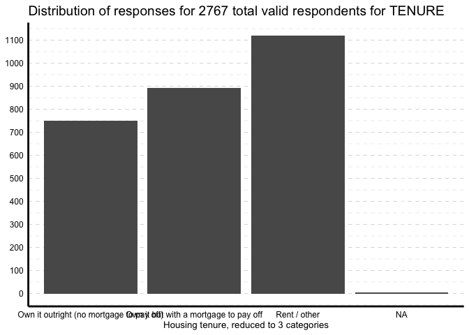<!-- -->

```
Frequencies  
TENURE  
Label: Housing tenure, reduced to 3 categories  
Type: Factor  

                                                 Freq   % Valid   % Valid Cum.   % Total   % Total Cum.
---------------------------------------------- ------ --------- -------------- --------- --------------
      Own it outright (no mortgage to pay off)    750     27.16          27.16     27.11          27.11
         Own it but with a mortgage to pay off    891     32.27          59.43     32.20          59.31
                                  Rent / other   1120     40.57         100.00     40.48          99.78
                                          <NA>      6                               0.22         100.00
                                         Total   2767    100.00         100.00    100.00         100.00
```

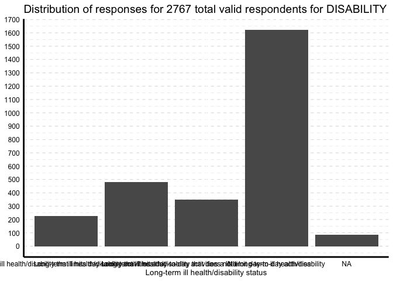<!-- -->

```
Frequencies  
DISABILITY  
Label: Long-term ill health/disability status  
Type: Factor  

                                                                                   Freq   % Valid   % Valid Cum.   % Total   % Total Cum.
-------------------------------------------------------------------------------- ------ --------- -------------- --------- --------------
         Long-term ill health/disability that limits day-to-day activities a lot    228      8.50           8.50      8.24           8.24
      Long-term ill health/disability that limits day-to-day activities a little    479     17.87          26.37     17.31          25.55
       Long-term ill health/disability that does not limit day-to-day activities    351     13.09          39.46     12.69          38.24
                                              No long-term ill health/disability   1623     60.54         100.00     58.66          96.89
                                                                            <NA>     86                               3.11         100.00
                                                                           Total   2767    100.00         100.00    100.00         100.00
```

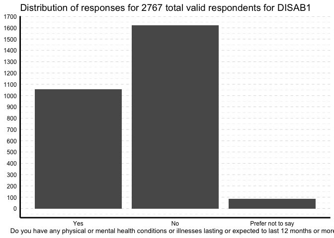<!-- -->

```
Frequencies  
DISAB1  
Label: Do you have any physical or mental health conditions or illnesses lasting or expected to last 12 months or more?  
Type: Factor  

                          Freq   % Valid   % Valid Cum.   % Total   % Total Cum.
----------------------- ------ --------- -------------- --------- --------------
                    Yes   1058     38.24          38.24     38.24          38.24
                     No   1623     58.66          96.89     58.66          96.89
      Prefer not to say     86      3.11         100.00      3.11         100.00
                   <NA>      0                               0.00         100.00
                  Total   2767    100.00         100.00    100.00         100.00
```

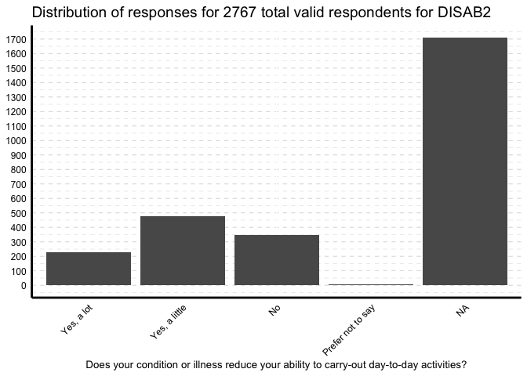<!-- -->

```
Frequencies  
DISAB2  
Label: Does your condition or illness reduce your ability to carry-out day-to-day activities?  
Type: Factor  

                          Freq   % Valid   % Valid Cum.   % Total   % Total Cum.
----------------------- ------ --------- -------------- --------- --------------
             Yes, a lot    228     21.55          21.55      8.24           8.24
          Yes, a little    479     45.27          66.82     17.31          25.55
                     No    345     32.61          99.43     12.47          38.02
      Prefer not to say      6      0.57         100.00      0.22          38.24
                   <NA>   1709                              61.76         100.00
                  Total   2767    100.00         100.00    100.00         100.00
```

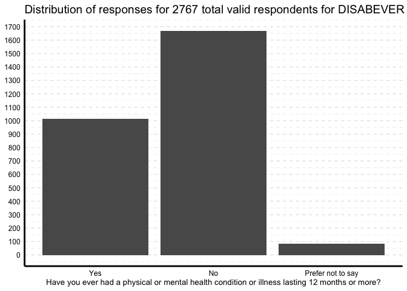<!-- -->

```
Frequencies  
DISABEVER  
Label: Have you ever had a physical or mental health condition or illness lasting 12 months or more?  
Type: Factor  

                          Freq   % Valid   % Valid Cum.   % Total   % Total Cum.
----------------------- ------ --------- -------------- --------- --------------
                    Yes   1016     36.72          36.72     36.72          36.72
                     No   1669     60.32          97.04     60.32          97.04
      Prefer not to say     82      2.96         100.00      2.96         100.00
                   <NA>      0                               0.00         100.00
                  Total   2767    100.00         100.00    100.00         100.00
```

## outcome variables

```r
for (i in outcomes){
  frequency_and_plot(factor_df,i)
}
```

```
Note: Using an external vector in selections is ambiguous.
ℹ Use `all_of(i)` instead of `i` to silence this message.
ℹ See <https://tidyselect.r-lib.org/reference/faq-external-vector.html>.
This message is displayed once per session.
```

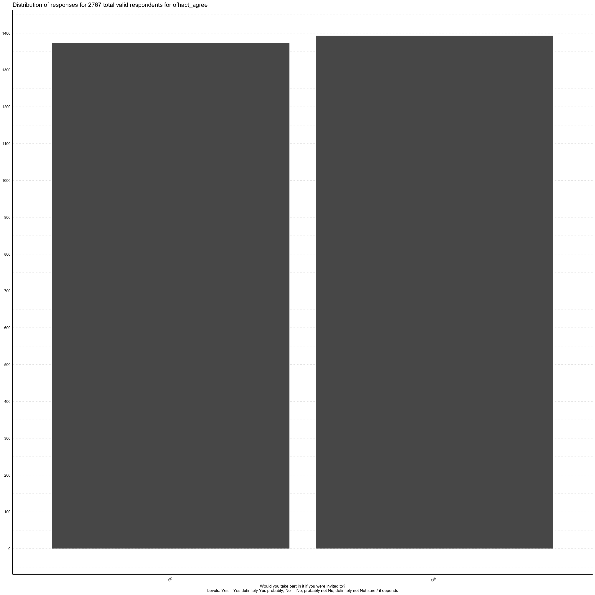<!-- -->

```
Frequencies  
ofhact_agree  
Label: Would you take part in it if you were invited to?
Levels: Yes = Yes definitely Yes probably; No =  No, probably not No, definitely not Not sure / it depends  
Type: Factor  

              Freq   % Valid   % Valid Cum.   % Total   % Total Cum.
----------- ------ --------- -------------- --------- --------------
         No   1374     49.66          49.66     49.66          49.66
        Yes   1393     50.34         100.00     50.34         100.00
       <NA>      0                               0.00         100.00
      Total   2767    100.00         100.00    100.00         100.00
```

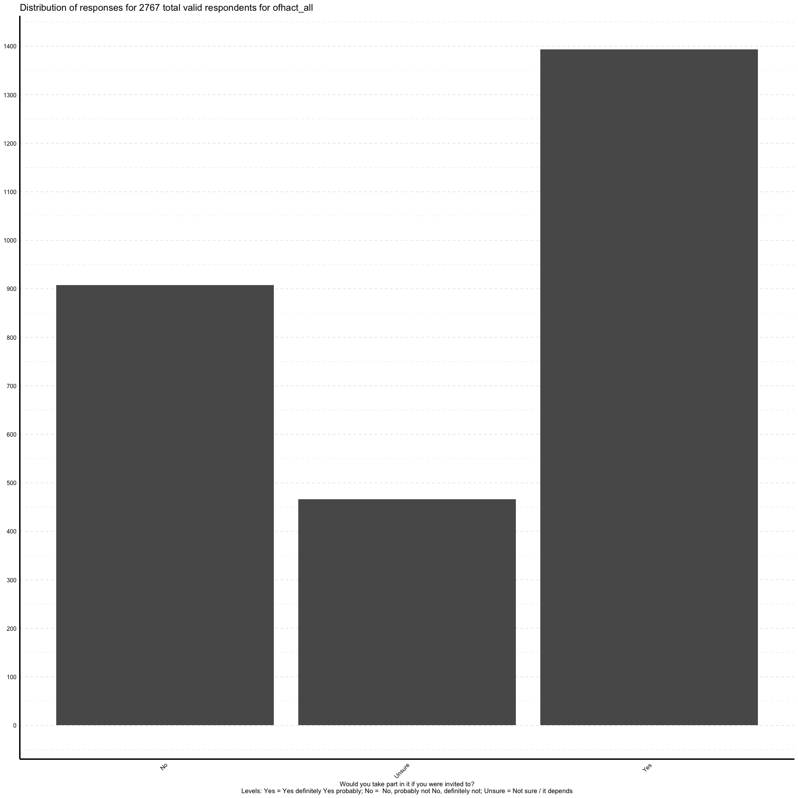<!-- -->

```
Frequencies  
ofhact_all  
Label: Would you take part in it if you were invited to?
Levels: Yes = Yes definitely Yes probably; No =  No, probably not No, definitely not; Unsure = Not sure / it depends  
Type: Factor  

               Freq   % Valid   % Valid Cum.   % Total   % Total Cum.
------------ ------ --------- -------------- --------- --------------
          No    908     32.82          32.82     32.82          32.82
      Unsure    466     16.84          49.66     16.84          49.66
         Yes   1393     50.34         100.00     50.34         100.00
        <NA>      0                               0.00         100.00
       Total   2767    100.00         100.00    100.00         100.00
```

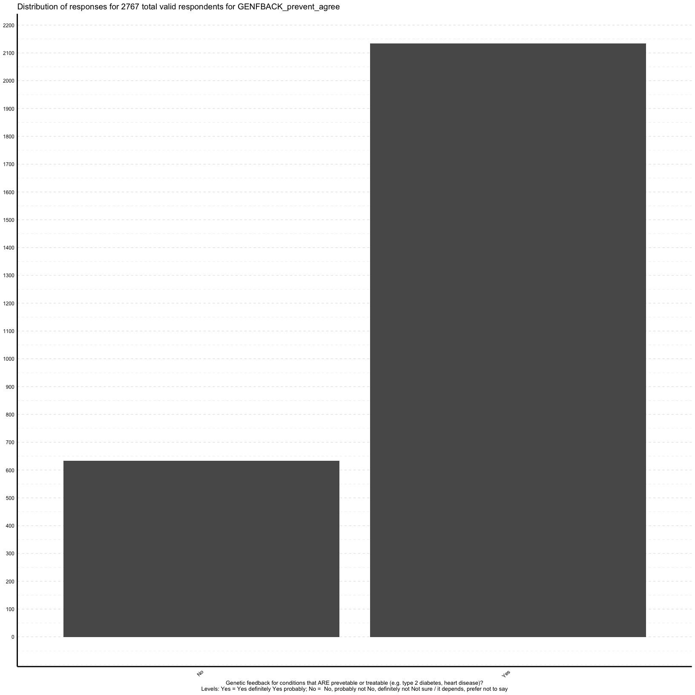<!-- -->

```
Frequencies  
GENFBACK_prevent_agree  
Label: Genetic feedback for conditions that ARE prevetable or treatable (e.g. type 2 diabetes, heart disease)?
Levels: Yes = Yes definitely Yes probably; No =  No, probably not No, definitely not Not sure / it depends  
Type: Factor  

                          Freq   % Valid   % Valid Cum.   % Total   % Total Cum.
----------------------- ------ --------- -------------- --------- --------------
                     No    549     86.73          86.73     19.84          19.84
      Prefer not to say     84     13.27         100.00      3.04          22.88
                   <NA>   2134                              77.12         100.00
                  Total   2767    100.00         100.00    100.00         100.00
```

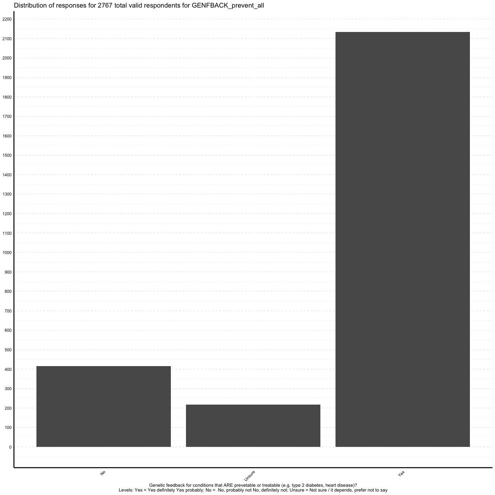<!-- -->

```
Frequencies  
GENFBACK_prevent_all  
Label: Genetic feedback for conditions that ARE prevetable or treatable (e.g. type 2 diabetes, heart disease)?
Levels: Yes = Yes definitely Yes probably; No =  No, probably not No, definitely not; Unsure = Not sure / it depends  
Type: Factor  

                          Freq   % Valid   % Valid Cum.   % Total   % Total Cum.
----------------------- ------ --------- -------------- --------- --------------
                     No    415     65.56          65.56     15.00          15.00
      Prefer not to say     84     13.27          78.83      3.04          18.03
                 Unsure    134     21.17         100.00      4.84          22.88
                   <NA>   2134                              77.12         100.00
                  Total   2767    100.00         100.00    100.00         100.00
```

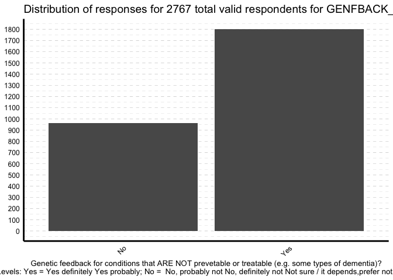<!-- -->

```
Frequencies  
GENFBACK_no_prevent_agree  
Label: Genetic feedback for conditions that ARE NOT prevetable or treatable (e.g. some types of dementia)?
Levels: Yes = Yes definitely Yes probably; No =  No, probably not No, definitely not Not sure / it depends  
Type: Factor  

                          Freq   % Valid   % Valid Cum.   % Total   % Total Cum.
----------------------- ------ --------- -------------- --------- --------------
                     No    883     91.60          91.60     31.91          31.91
      Prefer not to say     81      8.40         100.00      2.93          34.84
                   <NA>   1803                              65.16         100.00
                  Total   2767    100.00         100.00    100.00         100.00
```

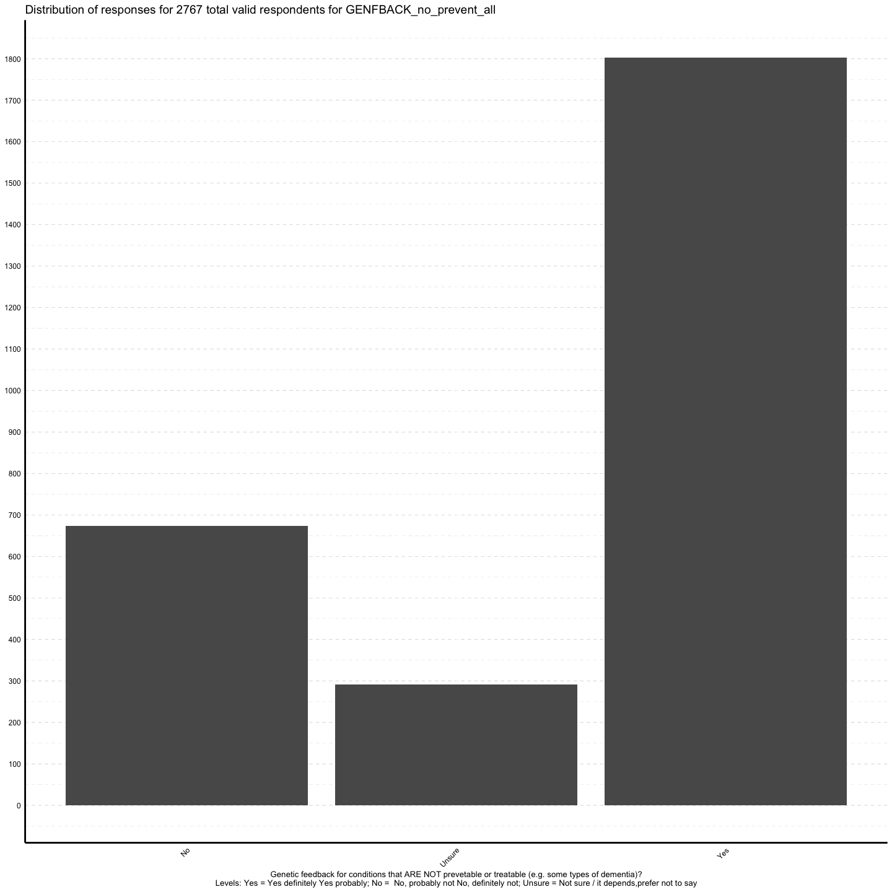<!-- -->

```
Frequencies  
GENFBACK_no_prevent_all  
Label: Genetic feedback for conditions that ARE NOT prevetable or treatable (e.g. some types of dementia)?
Levels: Yes = Yes definitely Yes probably; No =  No, probably not No, definitely not; Unsure = Not sure / it depends  
Type: Factor  

                          Freq   % Valid   % Valid Cum.   % Total   % Total Cum.
----------------------- ------ --------- -------------- --------- --------------
                     No    673     69.81          69.81     24.32          24.32
      Prefer not to say     81      8.40          78.22      2.93          27.25
                 Unsure    210     21.78         100.00      7.59          34.84
                   <NA>   1803                              65.16         100.00
                  Total   2767    100.00         100.00    100.00         100.00
```

<!-- -->

```
Frequencies  
GENFBACK_ancestry_agree  
Label: Genetic feedback for ancestry?
Levels: Yes = Yes definitely Yes probably; No =  No, probably not No, definitely not Not sure / it depends  
Type: Factor  

                          Freq   % Valid   % Valid Cum.   % Total   % Total Cum.
----------------------- ------ --------- -------------- --------- --------------
                     No    578     89.47          89.47     20.89          20.89
      Prefer not to say     68     10.53         100.00      2.46          23.35
                   <NA>   2121                              76.65         100.00
                  Total   2767    100.00         100.00    100.00         100.00
```

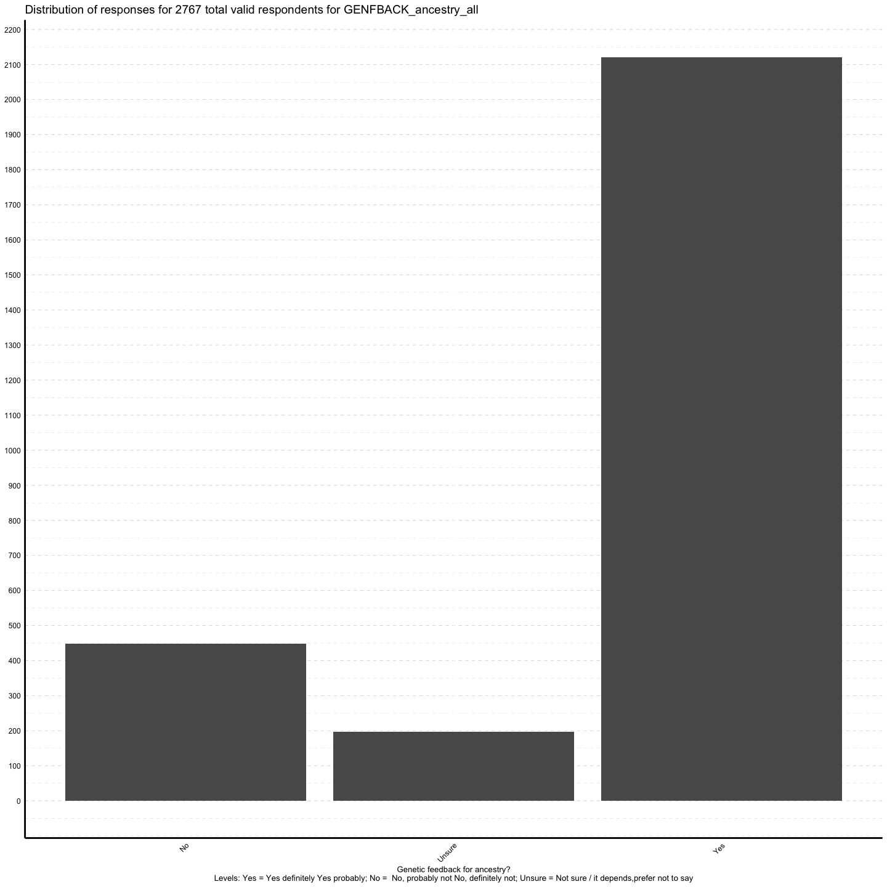<!-- -->

```
Frequencies  
GENFBACK_ancestry_all  
Label: Genetic feedback for ancestry?
Levels: Yes = Yes definitely Yes probably; No =  No, probably not No, definitely not; Unsure = Not sure / it depends  
Type: Factor  

                          Freq   % Valid   % Valid Cum.   % Total   % Total Cum.
----------------------- ------ --------- -------------- --------- --------------
                     No    449     69.50          69.50     16.23          16.23
      Prefer not to say     68     10.53          80.03      2.46          18.68
                 Unsure    129     19.97         100.00      4.66          23.35
                   <NA>   2121                              76.65         100.00
                  Total   2767    100.00         100.00    100.00         100.00
```
## predictor variables

```r
for (i in all.pred.vars){
  frequency_and_plot(factor_df,i)
}
```

```
Warning: Removed 313 rows containing non-finite values (stat_count).
```

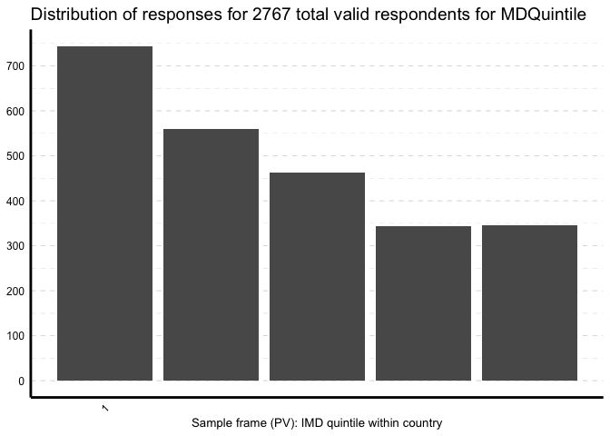<!-- -->

```
Frequencies  
MDQuintile  
Label: Sample frame (PV): IMD quintile within country  
Type: Numeric  

              Freq   % Valid   % Valid Cum.   % Total   % Total Cum.
----------- ------ --------- -------------- --------- --------------
          1    744     30.32          30.32     26.89          26.89
          2    559     22.78          53.10     20.20          47.09
          3    462     18.83          71.92     16.70          63.79
          4    344     14.02          85.94     12.43          76.22
          5    345     14.06         100.00     12.47          88.69
       <NA>    313                              11.31         100.00
      Total   2767    100.00         100.00    100.00         100.00
```

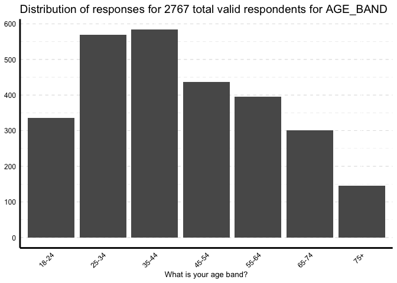<!-- -->

```
Frequencies  
AGE_BAND  
Label: What is your age band?  
Type: Factor  

              Freq   % Valid   % Valid Cum.   % Total   % Total Cum.
----------- ------ --------- -------------- --------- --------------
      18-24    335     12.11          12.11     12.11          12.11
      25-34    569     20.56          32.67     20.56          32.67
      35-44    584     21.11          53.78     21.11          53.78
      45-54    436     15.76          69.53     15.76          69.53
      55-64    396     14.31          83.85     14.31          83.85
      65-74    301     10.88          94.72     10.88          94.72
        75+    146      5.28         100.00      5.28         100.00
       <NA>      0                               0.00         100.00
      Total   2767    100.00         100.00    100.00         100.00
```

<!-- -->

```
Frequencies  
SEX  
Label: Would you describe yourself as…  
Type: Factor  

                                Freq   % Valid   % Valid Cum.   % Total   % Total Cum.
----------------------------- ------ --------- -------------- --------- --------------
              Missing reponse      1     0.036          0.036     0.036          0.036
                         Male   1208    43.657         43.694    43.657         43.694
                       Female   1550    56.017         99.711    56.017         99.711
      Identify in another way      8     0.289        100.000     0.289        100.000
                         <NA>      0                              0.000        100.000
                        Total   2767   100.000        100.000   100.000        100.000
```

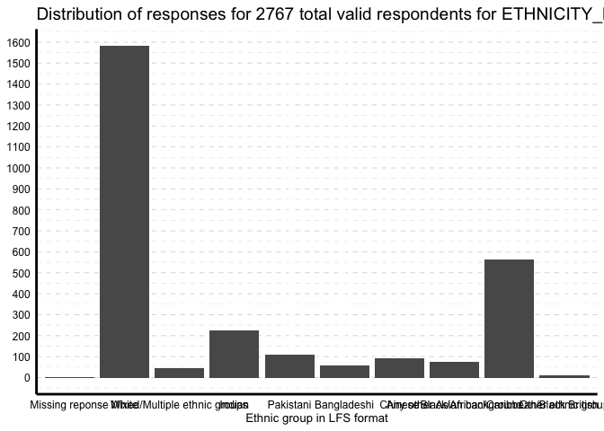<!-- -->

```
Frequencies  
ETHNICITY_LFS  
Label: Ethnic group in LFS format  
Type: Factor  

                                              Freq   % Valid   % Valid Cum.   % Total   % Total Cum.
------------------------------------------- ------ --------- -------------- --------- --------------
                            Missing reponse      4      0.14           0.14      0.14           0.14
                                      White   1583     57.21          57.35     57.21          57.35
               Mixed/Multiple ethnic groups     46      1.66          59.02      1.66          59.02
                                     Indian    225      8.13          67.15      8.13          67.15
                                  Pakistani    109      3.94          71.09      3.94          71.09
                                Bangladeshi     58      2.10          73.18      2.10          73.18
                                    Chinese     91      3.29          76.47      3.29          76.47
                 Any other Asian background     77      2.78          79.26      2.78          79.26
      Black/African/Caribbean/Black British    563     20.35          99.60     20.35          99.60
                         Other ethnic group     11      0.40         100.00      0.40         100.00
                                       <NA>      0                               0.00         100.00
                                      Total   2767    100.00         100.00    100.00         100.00
```

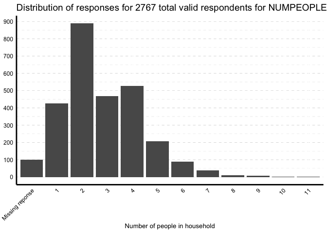<!-- -->

```
Frequencies  
NUMPEOPLE  
Label: Number of people in household  
Type: Factor  

                        Freq   % Valid   % Valid Cum.   % Total   % Total Cum.
--------------------- ------ --------- -------------- --------- --------------
      Missing reponse    101     3.650          3.650     3.650          3.650
                    1    426    15.396         19.046    15.396         19.046
                    2    889    32.129         51.175    32.129         51.175
                    3    469    16.950         68.124    16.950         68.124
                    4    528    19.082         87.206    19.082         87.206
                    5    206     7.445         94.651     7.445         94.651
                    6     88     3.180         97.832     3.180         97.832
                    7     38     1.373         99.205     1.373         99.205
                    8     10     0.361         99.566     0.361         99.566
                    9      7     0.253         99.819     0.253         99.819
                   10      3     0.108         99.928     0.108         99.928
                   11      2     0.072        100.000     0.072        100.000
                 <NA>      0                              0.000        100.000
                Total   2767   100.000        100.000   100.000        100.000
```

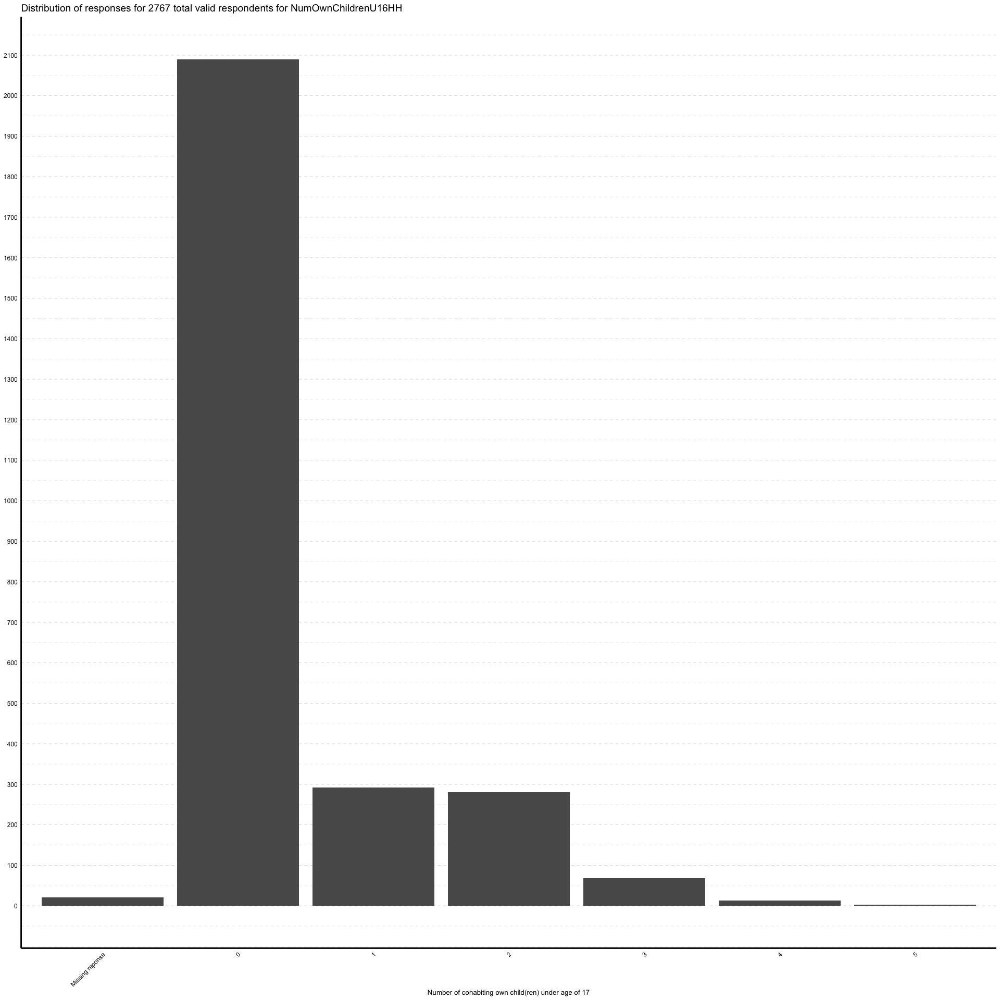<!-- -->

```
Frequencies  
NumOwnChildrenU16HH  
Label: Number of cohabiting own child(ren) under age of 17  
Type: Factor  

                        Freq   % Valid   % Valid Cum.   % Total   % Total Cum.
--------------------- ------ --------- -------------- --------- --------------
      Missing reponse     21      0.76           0.76      0.76           0.76
                    0   2090     75.53          76.29     75.53          76.29
                    1    292     10.55          86.84     10.55          86.84
                    2    280     10.12          96.96     10.12          96.96
                    3     68      2.46          99.42      2.46          99.42
                    4     13      0.47          99.89      0.47          99.89
                    5      3      0.11         100.00      0.11         100.00
                 <NA>      0                               0.00         100.00
                Total   2767    100.00         100.00    100.00         100.00
```

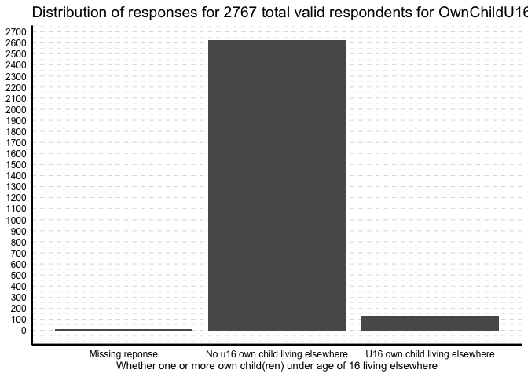<!-- -->

```
Frequencies  
OwnChildU16OutsideHH  
Label: Whether one or more own child(ren) under age of 16 living elsewhere  
Type: Factor  

                                          Freq   % Valid   % Valid Cum.   % Total   % Total Cum.
--------------------------------------- ------ --------- -------------- --------- --------------
                        Missing reponse     12      0.43           0.43      0.43           0.43
      No u16 own child living elsewhere   2626     94.90          95.34     94.90          95.34
         U16 own child living elsewhere    129      4.66         100.00      4.66         100.00
                                   <NA>      0                               0.00         100.00
                                  Total   2767    100.00         100.00    100.00         100.00
```

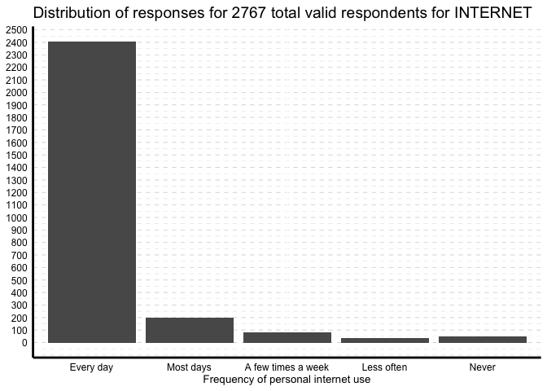<!-- -->

```
Frequencies  
INTERNET  
Label: Frequency of personal internet use  
Type: Factor  

                           Freq   % Valid   % Valid Cum.   % Total   % Total Cum.
------------------------ ------ --------- -------------- --------- --------------
               Every day   2407     86.99          86.99     86.99          86.99
               Most days    196      7.08          94.07      7.08          94.07
      A few times a week     79      2.86          96.93      2.86          96.93
              Less often     37      1.34          98.27      1.34          98.27
                   Never     48      1.73         100.00      1.73         100.00
                    <NA>      0                               0.00         100.00
                   Total   2767    100.00         100.00    100.00         100.00
```

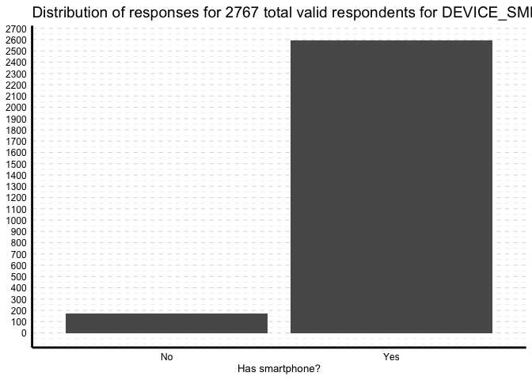<!-- -->

```
Frequencies  
DEVICE_SMRTPHNE  
Label: Has smartphone?  
Type: Factor  

              Freq   % Valid   % Valid Cum.   % Total   % Total Cum.
----------- ------ --------- -------------- --------- --------------
         No    173      6.25           6.25      6.25           6.25
        Yes   2594     93.75         100.00     93.75         100.00
       <NA>      0                               0.00         100.00
      Total   2767    100.00         100.00    100.00         100.00
```

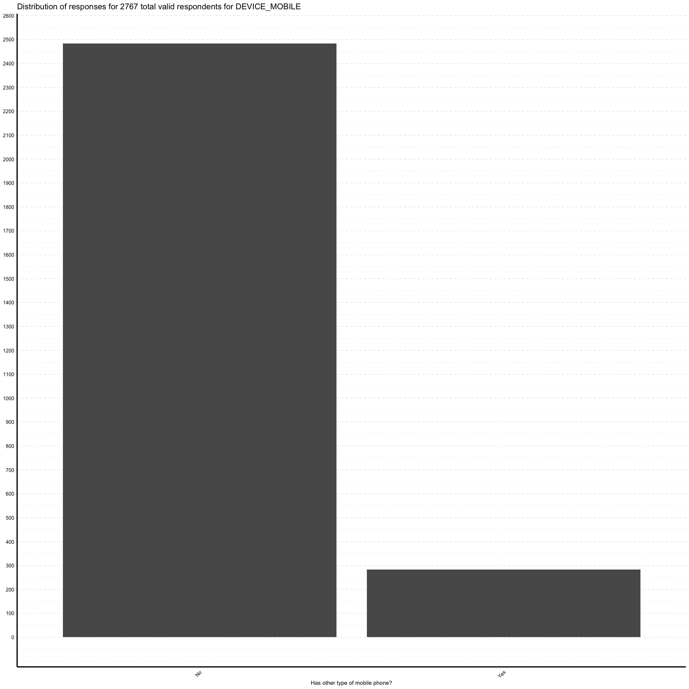<!-- -->

```
Frequencies  
DEVICE_MOBILE  
Label: Has other type of mobile phone?  
Type: Factor  

              Freq   % Valid   % Valid Cum.   % Total   % Total Cum.
----------- ------ --------- -------------- --------- --------------
         No   2484     89.77          89.77     89.77          89.77
        Yes    283     10.23         100.00     10.23         100.00
       <NA>      0                               0.00         100.00
      Total   2767    100.00         100.00    100.00         100.00
```

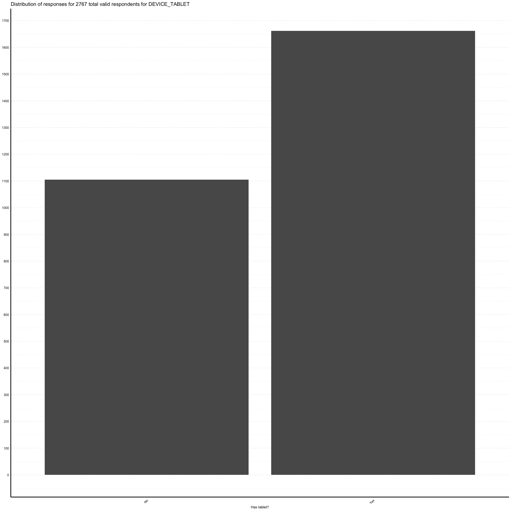<!-- -->

```
Frequencies  
DEVICE_TABLET  
Label: Has tablet?  
Type: Factor  

              Freq   % Valid   % Valid Cum.   % Total   % Total Cum.
----------- ------ --------- -------------- --------- --------------
         No   1105     39.93          39.93     39.93          39.93
        Yes   1662     60.07         100.00     60.07         100.00
       <NA>      0                               0.00         100.00
      Total   2767    100.00         100.00    100.00         100.00
```

<!-- -->

```
Frequencies  
DEVICE_CPU  
Label: Has PC/laptop/Mac?  
Type: Factor  

              Freq   % Valid   % Valid Cum.   % Total   % Total Cum.
----------- ------ --------- -------------- --------- --------------
         No    534     19.30          19.30     19.30          19.30
        Yes   2233     80.70         100.00     80.70         100.00
       <NA>      0                               0.00         100.00
      Total   2767    100.00         100.00    100.00         100.00
```

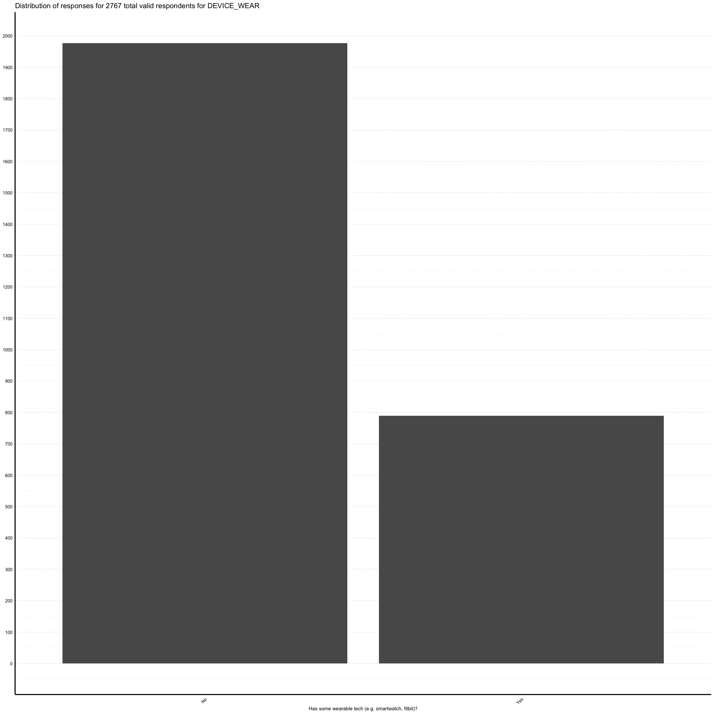<!-- -->

```
Frequencies  
DEVICE_WEAR  
Label: Has some wearable tech (e.g. smartwatch, fitbit)?  
Type: Factor  

              Freq   % Valid   % Valid Cum.   % Total   % Total Cum.
----------- ------ --------- -------------- --------- --------------
         No   1977     71.45          71.45     71.45          71.45
        Yes    790     28.55         100.00     28.55         100.00
       <NA>      0                               0.00         100.00
      Total   2767    100.00         100.00    100.00         100.00
```

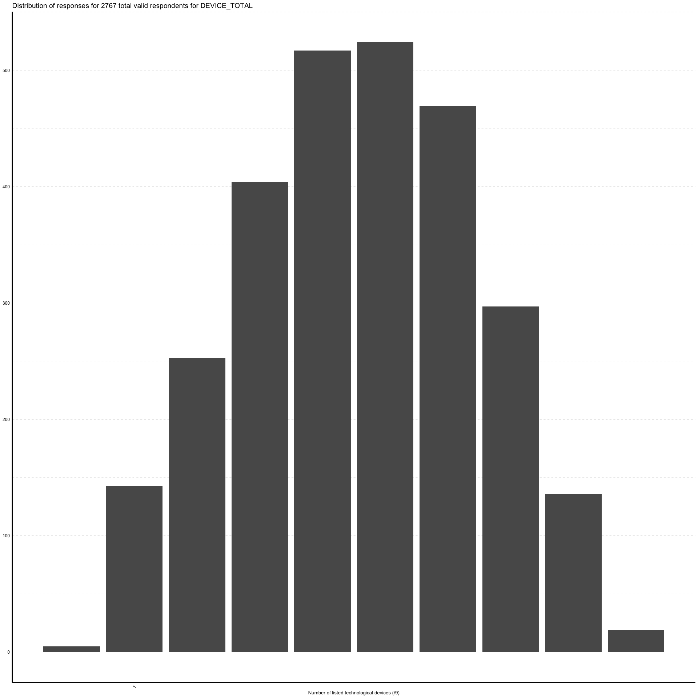<!-- -->

```
Frequencies  
DEVICE_TOTAL  
Label: Number of listed technological devices (/9)  
Type: Numeric  

              Freq   % Valid   % Valid Cum.   % Total   % Total Cum.
----------- ------ --------- -------------- --------- --------------
          0      5      0.18           0.18      0.18           0.18
          1    143      5.17           5.35      5.17           5.35
          2    253      9.14          14.49      9.14          14.49
          3    404     14.60          29.09     14.60          29.09
          4    517     18.68          47.78     18.68          47.78
          5    524     18.94          66.71     18.94          66.71
          6    469     16.95          83.66     16.95          83.66
          7    297     10.73          94.40     10.73          94.40
          8    136      4.92          99.31      4.92          99.31
          9     19      0.69         100.00      0.69         100.00
       <NA>      0                               0.00         100.00
      Total   2767    100.00         100.00    100.00         100.00
```

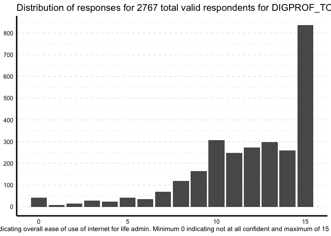<!-- -->

```
Frequencies  
DIGPROF_TOTAL  
Label: Composite score indicating overall ease of use of internet for life admin. Minimum 0 indicating not at all confident and maximum of 15 indicating very confident  
Type: Numeric  

              Freq   % Valid   % Valid Cum.   % Total   % Total Cum.
----------- ------ --------- -------------- --------- --------------
          0     41      1.48           1.48      1.48           1.48
          1      9      0.33           1.81      0.33           1.81
          2     14      0.51           2.31      0.51           2.31
          3     29      1.05           3.36      1.05           3.36
          4     23      0.83           4.19      0.83           4.19
          5     42      1.52           5.71      1.52           5.71
          6     35      1.26           6.98      1.26           6.98
          7     68      2.46           9.43      2.46           9.43
          8    119      4.30          13.73      4.30          13.73
          9    165      5.96          19.70      5.96          19.70
         10    307     11.10          30.79     11.10          30.79
         11    247      8.93          39.72      8.93          39.72
         12    274      9.90          49.62      9.90          49.62
         13    298     10.77          60.39     10.77          60.39
         14    259      9.36          69.75      9.36          69.75
         15    837     30.25         100.00     30.25         100.00
       <NA>      0                               0.00         100.00
      Total   2767    100.00         100.00    100.00         100.00
```

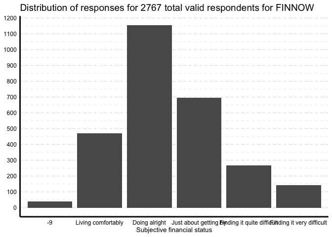<!-- -->

```
Frequencies  
FINNOW  
Label: Subjective financial status  
Type: Factor  

                                   Freq   % Valid   % Valid Cum.   % Total   % Total Cum.
-------------------------------- ------ --------- -------------- --------- --------------
                              -9     40      1.45           1.45      1.45           1.45
              Living comfortably    471     17.02          18.47     17.02          18.47
                   Doing alright   1155     41.74          60.21     41.74          60.21
           Just about getting by    694     25.08          85.29     25.08          85.29
      Finding it quite difficult    266      9.61          94.90      9.61          94.90
       Finding it very difficult    141      5.10         100.00      5.10         100.00
                            <NA>      0                               0.00         100.00
                           Total   2767    100.00         100.00    100.00         100.00
```

<!-- -->

```
Frequencies  
RELIGIOSITY  
Label: Religiosity  
Type: Factor  

                        Freq   % Valid   % Valid Cum.   % Total   % Total Cum.
--------------------- ------ --------- -------------- --------- --------------
      Missing reponse     10      0.36           0.36      0.36           0.36
           Practising    899     32.49          32.85     32.49          32.85
       Not practising    562     20.31          53.16     20.31          53.16
        Not religious   1296     46.84         100.00     46.84         100.00
                 <NA>      0                               0.00         100.00
                Total   2767    100.00         100.00    100.00         100.00
```

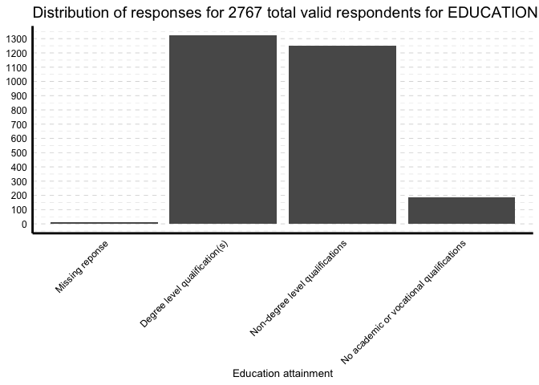<!-- -->

```
Frequencies  
RELIGION  
Label: Religion  
Type: Factor  

                        Freq   % Valid   % Valid Cum.   % Total   % Total Cum.
--------------------- ------ --------- -------------- --------- --------------
      Missing reponse   1019     36.83          36.83     36.83          36.83
         Christianity    666     24.07          60.90     24.07          60.90
                Islam    181      6.54          67.44      6.54          67.44
             Hinduism     64      2.31          69.75      2.31          69.75
              Sikhism     34      1.23          70.98      1.23          70.98
              Judaism     11      0.40          71.38      0.40          71.38
             Buddhism     13      0.47          71.85      0.47          71.85
       Other religion     15      0.54          72.39      0.54          72.39
          No religion    764     27.61         100.00     27.61         100.00
                 <NA>      0                               0.00         100.00
                Total   2767    100.00         100.00    100.00         100.00
```

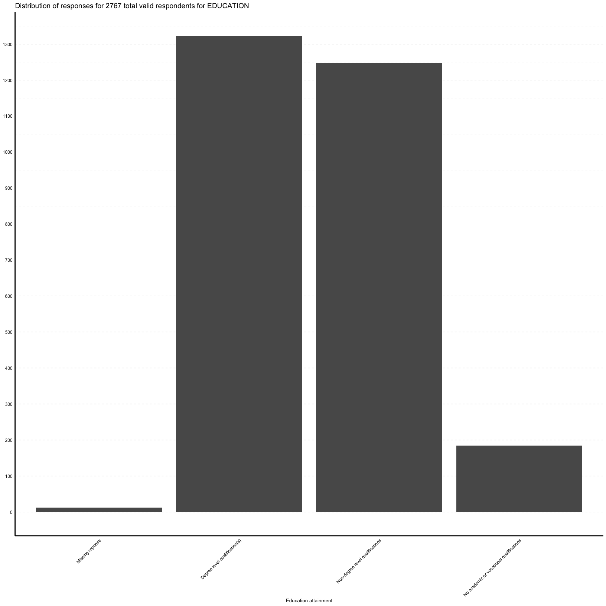<!-- -->

```
Frequencies  
EDUCATION  
Label: Education attainment  
Type: Factor  

                                                 Freq   % Valid   % Valid Cum.   % Total   % Total Cum.
---------------------------------------------- ------ --------- -------------- --------- --------------
                               Missing reponse     12      0.43           0.43      0.43           0.43
                 Degree level qualification(s)   1323     47.81          48.25     47.81          48.25
               Non-degree level qualifications   1248     45.10          93.35     45.10          93.35
      No academic or vocational qualifications    184      6.65         100.00      6.65         100.00
                                          <NA>      0                               0.00         100.00
                                         Total   2767    100.00         100.00    100.00         100.00
```

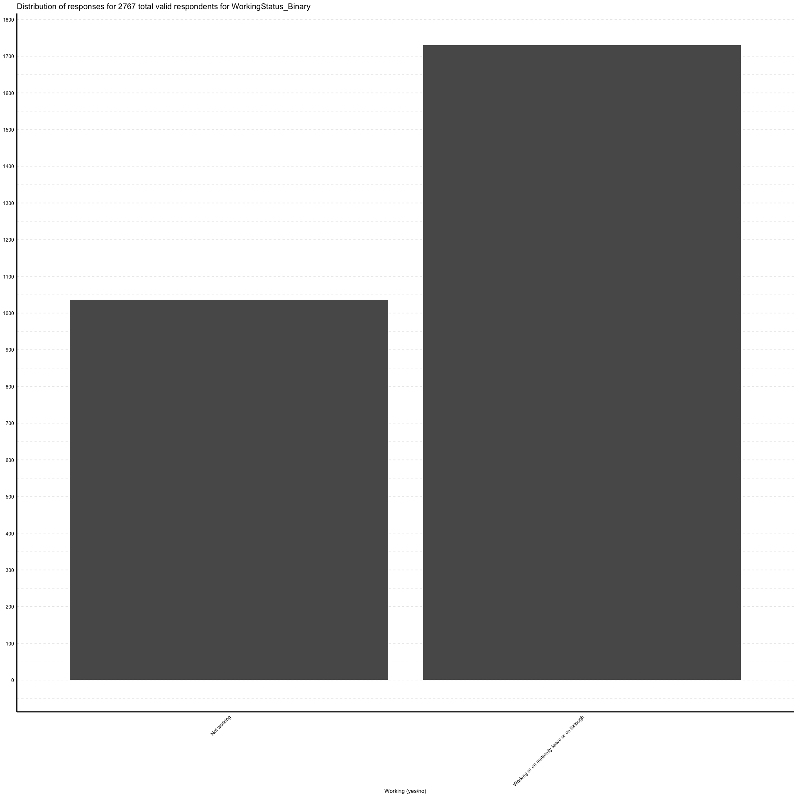<!-- -->

```
Frequencies  
WorkingStatus_Binary  
Label: Working (yes/no)  
Type: Factor  

                                                     Freq   % Valid   % Valid Cum.   % Total   % Total Cum.
-------------------------------------------------- ------ --------- -------------- --------- --------------
                                       Not working   1037     37.48          37.48     37.48          37.48
      Working or on maternity leave or on furlough   1730     62.52         100.00     62.52         100.00
                                              <NA>      0                               0.00         100.00
                                             Total   2767    100.00         100.00    100.00         100.00
```

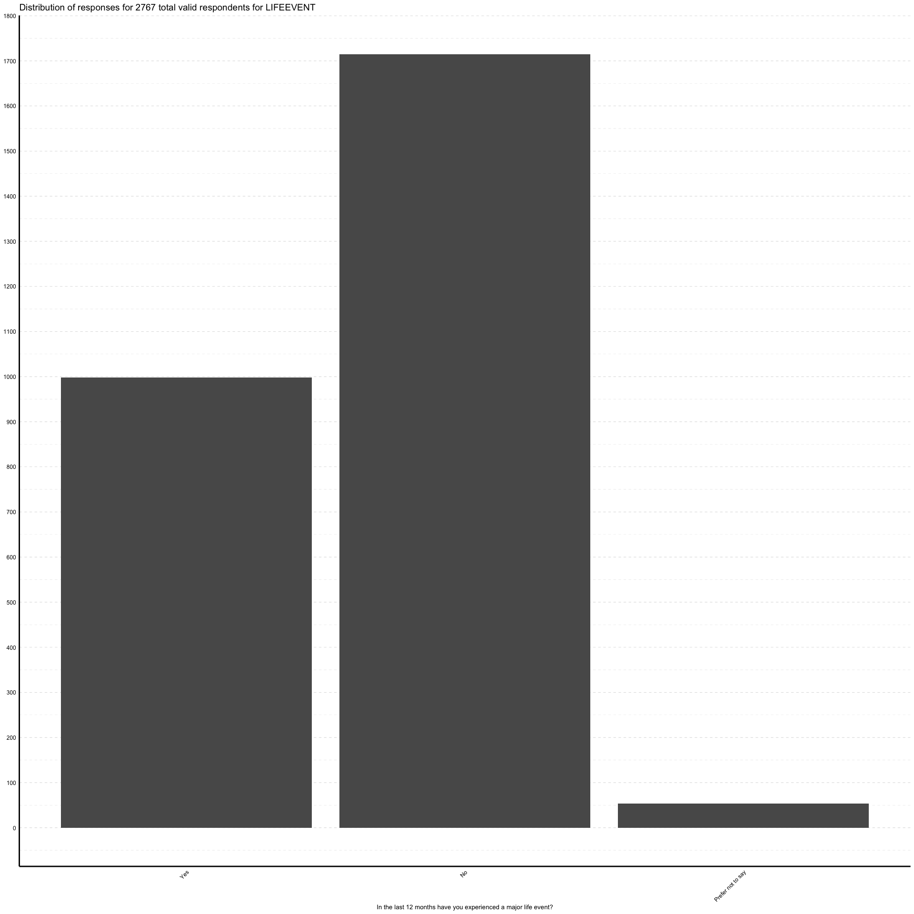<!-- -->

```
Frequencies  
OCCUPATION_SOC2010  
Label: Standard Occupational Classification 2010 code  
Type: Factor  

                                                                           Freq   % Valid   % Valid Cum.   % Total   % Total Cum.
------------------------------------------------------------------------ ------ --------- -------------- --------- --------------
                                                                      -9    675    24.395         24.395    24.395         24.395
                                   Chief executives and senior officials      4     0.145         24.539     0.145         24.539
                                    Elected officers and representatives      0     0.000         24.539     0.000         24.539
                      Production managers and directors in manufacturing     14     0.506         25.045     0.506         25.045
                       Production managers and directors in construction      3     0.108         25.154     0.108         25.154
                  Production managers and directors in mining and energy      1     0.036         25.190     0.036         25.190
                                        Financial managers and directors     10     0.361         25.551     0.361         25.551
                                           Marketing and sales directors     12     0.434         25.985     0.434         25.985
                                       Purchasing managers and directors      4     0.145         26.129     0.145         26.129
                              Advertising and public relations directors      0     0.000         26.129     0.000         26.129
                                   Human resource managers and directors     13     0.470         26.599     0.470         26.599
                 Information technology and telecommunications directors     11     0.398         26.997     0.398         26.997
                                       Functional managers and directors     23     0.831         27.828     0.831         27.828
                            Financial institution managers and directors     14     0.506         28.334     0.506         28.334
                    Managers and directors in transport and distribution      7     0.253         28.587     0.253         28.587
                       Managers and directors in storage and warehousing      2     0.072         28.659     0.072         28.659
                                                Officers in armed forces      2     0.072         28.731     0.072         28.731
                                                  Senior police officers      2     0.072         28.804     0.072         28.804
         Senior officers in fire, ambulance, prison and related services      1     0.036         28.840     0.036         28.840
                Health services and public health managers and directors     15     0.542         29.382     0.542         29.382
                                  Social services managers and directors      3     0.108         29.490     0.108         29.490
                          Managers and directors in retail and wholesale     15     0.542         30.033     0.542         30.033
                Managers and proprietors in agriculture and horticulture      1     0.036         30.069     0.036         30.069
      Managers and proprietors in forestry, fishing and related services      3     0.108         30.177     0.108         30.177
                        Hotel and accommodation managers and proprietors      3     0.108         30.286     0.108         30.286
          Restaurant and catering establishment managers and proprietors      8     0.289         30.575     0.289         30.575
                             Publicans and managers of licensed premises      1     0.036         30.611     0.036         30.611
                                             Leisure and sports managers      4     0.145         30.755     0.145         30.755
                                  Travel agency managers and proprietors      1     0.036         30.791     0.036         30.791
                                           Health care practice managers      0     0.000         30.791     0.000         30.791
         Residential, day and domiciliary  care managers and proprietors      5     0.181         30.972     0.181         30.972
                                   Property, housing and estate managers      9     0.325         31.297     0.325         31.297
                                         Garage managers and proprietors      2     0.072         31.370     0.072         31.370
                  Hairdressing and beauty salon managers and proprietors      0     0.000         31.370     0.000         31.370
                      Shopkeepers and proprietors – wholesale and retail     10     0.361         31.731     0.361         31.731
                      Waste disposal and environmental services managers      2     0.072         31.803     0.072         31.803
                              Managers and proprietors in other services     34     1.229         33.032     1.229         33.032
                                                     Chemical scientists      0     0.000         33.032     0.000         33.032
                                   Biological scientists and biochemists      4     0.145         33.177     0.145         33.177
                                                     Physical scientists      1     0.036         33.213     0.036         33.213
                                        Social and humanities scientists      2     0.072         33.285     0.072         33.285
                                Natural and social science professionals      2     0.072         33.357     0.072         33.357
                                                         Civil engineers      3     0.108         33.466     0.108         33.466
                                                    Mechanical engineers      4     0.145         33.610     0.145         33.610
                                                    Electrical engineers      3     0.108         33.719     0.108         33.719
                                                   Electronics engineers      0     0.000         33.719     0.000         33.719
                                        Design and development engineers      2     0.072         33.791     0.072         33.791
                                        Production and process engineers      2     0.072         33.863     0.072         33.863
                                               Engineering professionals      7     0.253         34.116     0.253         34.116
                                                  IT specialist managers     19     0.687         34.803     0.687         34.803
                                       IT project and programme managers      7     0.253         35.056     0.253         35.056
                  IT business analysts, architects and systems designers      8     0.289         35.345     0.289         35.345
                      Programmers and software development professionals     26     0.940         36.285     0.940         36.285
                                Web design and development professionals      3     0.108         36.393     0.108         36.393
             Information technology and telecommunications professionals     17     0.614         37.008     0.614         37.008
                                              Conservation professionals      1     0.036         37.044     0.036         37.044
                                               Environment professionals      2     0.072         37.116     0.072         37.116
                                       Research and development managers      5     0.181         37.297     0.181         37.297
                                                   Medical practitioners     20     0.723         38.020     0.723         38.020
                                                           Psychologists      6     0.217         38.236     0.217         38.236
                                                             Pharmacists      6     0.217         38.453     0.217         38.453
                                                    Ophthalmic opticians      2     0.072         38.525     0.072         38.525
                                                    Dental practitioners      5     0.181         38.706     0.181         38.706
                                                           Veterinarians      3     0.108         38.815     0.108         38.815
                                                   Medical radiographers      0     0.000         38.815     0.000         38.815
                                                             Podiatrists      0     0.000         38.815     0.000         38.815
                                                    Health professionals      6     0.217         39.031     0.217         39.031
                                                        Physiotherapists      4     0.145         39.176     0.145         39.176
                                                 Occupational therapists      1     0.036         39.212     0.036         39.212
                                          Speech and language therapists      1     0.036         39.248     0.036         39.248
                                                   Therapy professionals      2     0.072         39.321     0.072         39.321
                                                                  Nurses     48     1.735         41.055     1.735         41.055
                                                                Midwives      2     0.072         41.128     0.072         41.128
                                 Higher education teaching professionals     11     0.398         41.525     0.398         41.525
                                Further education teaching professionals     17     0.614         42.140     0.614         42.140
                              Secondary education teaching professionals     24     0.867         43.007     0.867         43.007
                    Primary and nursery education teaching professionals     49     1.771         44.778     1.771         44.778
                          Special needs education teaching professionals      3     0.108         44.886     0.108         44.886
                      Senior professionals of educational establishments     17     0.614         45.501     0.614         45.501
                                Education advisers and school inspectors     10     0.361         45.862     0.361         45.862
                            Teaching and other educational professionals     19     0.687         46.549     0.687         46.549
                                                   Barristers and judges      0     0.000         46.549     0.000         46.549
                                                              Solicitors      4     0.145         46.693     0.145         46.693
                                                     Legal professionals      7     0.253         46.946     0.253         46.946
                                     Chartered and certified accountants      9     0.325         47.271     0.325         47.271
                            Management consultants and business analysts     16     0.578         47.850     0.578         47.850
                 Business and financial project management professionals     14     0.506         48.356     0.506         48.356
                                 Actuaries, economists and statisticians     10     0.361         48.717     0.361         48.717
                             Business and related research professionals     10     0.361         49.078     0.361         49.078
                     Business, research and administrative professionals      5     0.181         49.259     0.181         49.259
                                                              Architects      0     0.000         49.259     0.000         49.259
                                                  Town planning officers      0     0.000         49.259     0.000         49.259
                                                      Quantity surveyors      3     0.108         49.368     0.108         49.368
                                                     Chartered surveyors      2     0.072         49.440     0.072         49.440
                                   Chartered architectural technologists      1     0.036         49.476     0.036         49.476
                 Construction project managers and related professionals      3     0.108         49.584     0.108         49.584
                                                          Social workers      6     0.217         49.801     0.217         49.801
                                                      Probation officers      0     0.000         49.801     0.000         49.801
                                                                  Clergy      7     0.253         50.054     0.253         50.054
                                                   Welfare professionals      2     0.072         50.126     0.072         50.126
                                                              Librarians      5     0.181         50.307     0.181         50.307
                                                 Archivists and curators      1     0.036         50.343     0.036         50.343
                                  Quality control and planning engineers      1     0.036         50.379     0.036         50.379
                          Quality assurance and regulatory professionals      7     0.253         50.632     0.253         50.632
                                      Environmental health professionals      0     0.000         50.632     0.000         50.632
                           Journalists, newspaper and periodical editors     10     0.361         50.994     0.361         50.994
                                          Public relations professionals      6     0.217         51.211     0.217         51.211
                    Advertising accounts managers and creative directors      6     0.217         51.428     0.217         51.428
                                                  Laboratory technicians      4     0.145         51.572     0.145         51.572
                                  Electrical and electronics technicians      3     0.108         51.681     0.108         51.681
                                                 Engineering technicians      3     0.108         51.789     0.108         51.789
                              Building and civil engineering technicians      2     0.072         51.861     0.072         51.861
                                           Quality assurance technicians      3     0.108         51.970     0.108         51.970
                            Planning, process and production technicians      1     0.036         52.006     0.036         52.006
                         Science, engineering and production technicians      9     0.325         52.331     0.325         52.331
                             Architectural and town planning technicians      2     0.072         52.403     0.072         52.403
                                                         Draughtspersons      2     0.072         52.476     0.072         52.476
                                               IT operations technicians      5     0.181         52.656     0.181         52.656
                                             IT user support technicians     10     0.361         53.018     0.361         53.018
                                                              Paramedics      1     0.036         53.054     0.036         53.054
                                                    Dispensing opticians      0     0.000         53.054     0.000         53.054
                                              Pharmaceutical technicians      1     0.036         53.090     0.036         53.090
                                          Medical and dental technicians      0     0.000         53.090     0.000         53.090
                                          Health associate professionals      8     0.289         53.379     0.289         53.379
                                             Youth and community workers      5     0.181         53.560     0.181         53.560
                                          Child and early years officers      4     0.145         53.704     0.145         53.704
                                                        Housing officers      6     0.217         53.921     0.217         53.921
                                                             Counsellors      2     0.072         53.993     0.072         53.993
                             Welfare and housing associate professionals     15     0.542         54.536     0.542         54.536
                                                    NCOs and other ranks      3     0.108         54.644     0.108         54.644
                                    Police officers (sergeant and below)      4     0.145         54.789     0.145         54.789
                         Fire service officers (watch manager and below)      2     0.072         54.861     0.072         54.861
                       Prison service officers (below principal officer)      1     0.036         54.897     0.036         54.897
                                       Police community support officers      1     0.036         54.933     0.036         54.933
                              Protective service associate professionals      3     0.108         55.042     0.108         55.042
                                                                 Artists      2     0.072         55.114     0.072         55.114
                                        Authors, writers and translators     10     0.361         55.475     0.361         55.475
                                     Actors, entertainers and presenters      3     0.108         55.584     0.108         55.584
                                              Dancers and choreographers      0     0.000         55.584     0.000         55.584
                                                               Musicians      2     0.072         55.656     0.072         55.656
                                  Arts officers, producers and directors      6     0.217         55.873     0.217         55.873
        Photographers, audio-visual and broadcasting equipment operators      6     0.217         56.090     0.217         56.090
                                                       Graphic designers     10     0.361         56.451     0.361         56.451
                                 Product, clothing and related designers      7     0.253         56.704     0.253         56.704
                                                          Sports players      1     0.036         56.740     0.036         56.740
                               Sports coaches, instructors and officials      7     0.253         56.993     0.253         56.993
                                                     Fitness instructors      2     0.072         57.065     0.072         57.065
                                                 Air traffic controllers      0     0.000         57.065     0.000         57.065
                                    Aircraft pilots and flight engineers      6     0.217         57.282     0.217         57.282
                                            Ship and hovercraft officers      0     0.000         57.282     0.000         57.282
                                           Legal associate professionals     11     0.398         57.680     0.398         57.680
                                       Estimators, valuers and assessors      4     0.145         57.824     0.145         57.824
                                                                 Brokers      2     0.072         57.897     0.072         57.897
                                                  Insurance underwriters      2     0.072         57.969     0.072         57.969
                            Finance and investment analysts and advisers     20     0.723         58.692     0.723         58.692
                                                        Taxation experts      2     0.072         58.764     0.072         58.764
                                                 Importers and exporters      0     0.000         58.764     0.000         58.764
                                    Financial and accounting technicians      4     0.145         58.909     0.145         58.909
                                             Financial accounts managers      9     0.325         59.234     0.325         59.234
                            Business and related associate professionals     24     0.867         60.101     0.867         60.101
                                         Buyers and procurement officers      5     0.181         60.282     0.181         60.282
                                               Business sales executives     15     0.542         60.824     0.542         60.824
                                       Marketing associate professionals     18     0.651         61.475     0.651         61.475
                                           Estate agents and auctioneers      2     0.072         61.547     0.072         61.547
                        Sales accounts and business development managers     25     0.904         62.450     0.904         62.450
                       Conference and exhibition managers and organisers      8     0.289         62.739     0.289         62.739
                  Conservation and environmental associate professionals      0     0.000         62.739     0.000         62.739
                                 Public services associate professionals      7     0.253         62.992     0.253         62.992
                       Human resources and industrial relations officers      9     0.325         63.318     0.325         63.318
                      Vocational and industrial trainers and instructors      9     0.325         63.643     0.325         63.643
                    Careers advisers and vocational guidance specialists      1     0.036         63.679     0.036         63.679
                                 Inspectors of standards and regulations      6     0.217         63.896     0.217         63.896
                                              Health and safety officers      3     0.108         64.004     0.108         64.004
                          National government administrative occupations     33     1.193         65.197     1.193         65.197
                             Local government administrative occupations     27     0.976         66.173     0.976         66.173
                              Officers of non-governmental organisations      8     0.289         66.462     0.289         66.462
                                                      Credit controllers      4     0.145         66.606     0.145         66.606
                         Book-keepers, payroll managers and wages clerks     29     1.048         67.654     1.048         67.654
                                             Bank and post office clerks      8     0.289         67.944     0.289         67.944
                                                        Finance officers      0     0.000         67.944     0.000         67.944
                                    Financial administrative occupations     22     0.795         68.739     0.795         68.739
                                           Records clerks and assistants     12     0.434         69.172     0.434         69.172
                            Pensions and insurance clerks and assistants     10     0.361         69.534     0.361         69.534
                                     Stock control clerks and assistants      6     0.217         69.751     0.217         69.751
                        Transport and distribution clerks and assistants      5     0.181         69.931     0.181         69.931
                                           Library clerks and assistants      2     0.072         70.004     0.072         70.004
                              Human resources administrative occupations      3     0.108         70.112     0.108         70.112
                                                    Sales administrators      5     0.181         70.293     0.181         70.293
                                        Other administrative occupations     67     2.421         72.714     2.421         72.714
                                                         Office managers     13     0.470         73.184     0.470         73.184
                                                      Office supervisors      2     0.072         73.256     0.072         73.256
                                                     Medical secretaries     14     0.506         73.762     0.506         73.762
                                                       Legal secretaries      5     0.181         73.943     0.181         73.943
                                                      School secretaries      4     0.145         74.087     0.145         74.087
                                                     Company secretaries      1     0.036         74.124     0.036         74.124
                               Personal assistants and other secretaries     12     0.434         74.557     0.434         74.557
                                                           Receptionists     11     0.398         74.955     0.398         74.955
                                Typists and related keyboard occupations      3     0.108         75.063     0.108         75.063
                                                                 Farmers      4     0.145         75.208     0.145         75.208
                                                    Horticultural trades      0     0.000         75.208     0.000         75.208
                                       Gardeners and landscape gardeners      5     0.181         75.389     0.181         75.389
                                             Groundsmen and greenkeepers      3     0.108         75.497     0.108         75.497
                                         Agricultural and fishing trades      0     0.000         75.497     0.000         75.497
                                                Smiths and forge workers      0     0.000         75.497     0.000         75.497
                                   Moulders, core makers and die casters      0     0.000         75.497     0.000         75.497
                                                     Sheet metal workers      0     0.000         75.497     0.000         75.497
                                       Metal plate workers, and riveters      0     0.000         75.497     0.000         75.497
                                                          Welding trades      1     0.036         75.533     0.036         75.533
                                                            Pipe fitters      0     0.000         75.533     0.000         75.533
                            Metal machining setters and setter-operators      2     0.072         75.605     0.072         75.605
                               Tool makers, tool fitters and markers-out      0     0.000         75.605     0.000         75.605
                        Metal working production and maintenance fitters      6     0.217         75.822     0.217         75.822
                               Precision instrument makers and repairers      2     0.072         75.894     0.072         75.894
                            Air-conditioning and refrigeration engineers      1     0.036         75.931     0.036         75.931
                         Vehicle technicians, mechanics and electricians      7     0.253         76.184     0.253         76.184
                                     Vehicle body builders and repairers      0     0.000         76.184     0.000         76.184
                                               Vehicle paint technicians      0     0.000         76.184     0.000         76.184
                                 Aircraft maintenance and related trades      1     0.036         76.220     0.036         76.220
                                    Boat and ship builders and repairers      0     0.000         76.220     0.000         76.220
                           Rail and rolling stock builders and repairers      0     0.000         76.220     0.000         76.220
                                     Electricians and electrical fitters      5     0.181         76.400     0.181         76.400
                                            Telecommunications engineers      2     0.072         76.473     0.072         76.473
                                           TV, video and audio engineers      2     0.072         76.545     0.072         76.545
                                                            IT engineers      3     0.108         76.653     0.108         76.653
                                        Electrical and electronic trades      3     0.108         76.762     0.108         76.762
             Skilled metal, electrical and electronic trades supervisors      1     0.036         76.798     0.036         76.798
                                                          Steel erectors      0     0.000         76.798     0.000         76.798
                                                  Bricklayers and masons      2     0.072         76.870     0.072         76.870
                                        Roofers, roof tilers and slaters      0     0.000         76.870     0.000         76.870
                          Plumbers and heating and ventilating engineers      2     0.072         76.943     0.072         76.943
                                                  Carpenters and joiners      6     0.217         77.159     0.217         77.159
                                Glaziers, window fabricators and fitters      1     0.036         77.196     0.036         77.196
                                        Construction and building trades      2     0.072         77.268     0.072         77.268
                                                              Plasterers      0     0.000         77.268     0.000         77.268
                                                Floorers and wall tilers      0     0.000         77.268     0.000         77.268
                                                 Painters and decorators      2     0.072         77.340     0.072         77.340
                            Construction and building trades supervisors      2     0.072         77.412     0.072         77.412
                                                    Weavers and knitters      0     0.000         77.412     0.000         77.412
                                                            Upholsterers      0     0.000         77.412     0.000         77.412
                                     Footwear and leather working trades      0     0.000         77.412     0.000         77.412
                                                 Tailors and dressmakers      0     0.000         77.412     0.000         77.412
                                   Textiles, garments and related trades      0     0.000         77.412     0.000         77.412
                                                   Pre-press technicians      0     0.000         77.412     0.000         77.412
                                                                Printers      0     0.000         77.412     0.000         77.412
                                     Print finishing and binding workers      0     0.000         77.412     0.000         77.412
                                                                Butchers      1     0.036         77.449     0.036         77.449
                                          Bakers and flour confectioners      3     0.108         77.557     0.108         77.557
                                        Fishmongers and poultry dressers      0     0.000         77.557     0.000         77.557
                                                                   Chefs     22     0.795         78.352     0.795         78.352
                                                                   Cooks      4     0.145         78.497     0.145         78.497
                                               Catering and bar managers      5     0.181         78.677     0.181         78.677
                     Glass and ceramics makers, decorators and finishers      0     0.000         78.677     0.000         78.677
                            Furniture makers and other craft woodworkers      1     0.036         78.713     0.036         78.713
                                                                Florists      0     0.000         78.713     0.000         78.713
                                                    Other skilled trades      4     0.145         78.858     0.145         78.858
                                           Nursery nurses and assistants     16     0.578         79.436     0.578         79.436
                                    Childminders and related occupations     11     0.398         79.834     0.398         79.834
                                                             Playworkers      3     0.108         79.942     0.108         79.942
                                                     Teaching assistants     33     1.193         81.135     1.193         81.135
                                          Educational support assistants     10     0.361         81.496     0.361         81.496
                                                       Veterinary nurses      1     0.036         81.532     0.036         81.532
                                                   Pest control officers      1     0.036         81.568     0.036         81.568
                                        Animal care services occupations      4     0.145         81.713     0.145         81.713
                                      Nursing auxiliaries and assistants     26     0.940         82.653     0.940         82.653
                                  Ambulance staff (excluding paramedics)      1     0.036         82.689     0.036         82.689
                                                           Dental nurses      1     0.036         82.725     0.036         82.725
                                    Houseparents and residential wardens      3     0.108         82.833     0.108         82.833
                                            Care workers and home carers     51     1.843         84.677     1.843         84.677
                                                     Senior care workers      6     0.217         84.893     0.217         84.893
                                                            Care escorts      1     0.036         84.930     0.036         84.930
                        Undertakers, mortuary and crematorium assistants      0     0.000         84.930     0.000         84.930
                                           Sports and leisure assistants      4     0.145         85.074     0.145         85.074
                                                           Travel agents      3     0.108         85.183     0.108         85.183
                                                   Air travel assistants      1     0.036         85.219     0.036         85.219
                                                  Rail travel assistants      1     0.036         85.255     0.036         85.255
                                  Leisure and travel service occupations      2     0.072         85.327     0.072         85.327
                                                Hairdressers and barbers      6     0.217         85.544     0.217         85.544
                                     Beauticians and related occupations      1     0.036         85.580     0.036         85.580
                                    Housekeepers and related occupations      0     0.000         85.580     0.000         85.580
                                                              Caretakers      4     0.145         85.725     0.145         85.725
                      Cleaning and housekeeping managers and supervisors      3     0.108         85.833     0.108         85.833
                                             Sales and retail assistants     74     2.674         88.507     2.674         88.507
                                 Retail cashiers and check-out operators     11     0.398         88.905     0.398         88.905
                                                  Telephone salespersons      1     0.036         88.941     0.036         88.941
                                Pharmacy and other dispensing assistants      5     0.181         89.122     0.181         89.122
                             Vehicle and parts salespersons and advisers      3     0.108         89.230     0.108         89.230
                                Collector salespersons and credit agents      0     0.000         89.230     0.000         89.230
                                    Debt, rent and other cash collectors      4     0.145         89.375     0.145         89.375
                                      Roundspersons and van salespersons      1     0.036         89.411     0.036         89.411
                                Market and street traders and assistants      0     0.000         89.411     0.000         89.411
                                       Merchandisers and window dressers      5     0.181         89.592     0.181         89.592
                                               Sales related occupations      3     0.108         89.700     0.108         89.700
                                                       Sales supervisors     10     0.361         90.061     0.361         90.061
                                     Call and contact centre occupations      4     0.145         90.206     0.145         90.206
                                                            Telephonists      2     0.072         90.278     0.072         90.278
                                                 Communication operators      1     0.036         90.314     0.036         90.314
                                            Market research interviewers      2     0.072         90.387     0.072         90.387
                                            Customer service occupations     41     1.482         91.868     1.482         91.868
                               Customer service managers and supervisors      6     0.217         92.085     0.217         92.085
                              Food, drink and tobacco process operatives      5     0.181         92.266     0.181         92.266
                                   Glass and ceramics process operatives      0     0.000         92.266     0.000         92.266
                                              Textile process operatives      0     0.000         92.266     0.000         92.266
                                 Chemical and related process operatives      3     0.108         92.374     0.108         92.374
                                               Rubber process operatives      1     0.036         92.411     0.036         92.411
                                             Plastics process operatives      2     0.072         92.483     0.072         92.483
                            Metal making and treating process operatives      0     0.000         92.483     0.000         92.483
                                                          Electroplaters      0     0.000         92.483     0.000         92.483
                                                      Process operatives      3     0.108         92.591     0.108         92.591
                                       Paper and wood machine operatives      2     0.072         92.664     0.072         92.664
                                                    Coal mine operatives      0     0.000         92.664     0.000         92.664
                                   Quarry workers and related operatives      0     0.000         92.664     0.000         92.664
                                                 Energy plant operatives      0     0.000         92.664     0.000         92.664
                                        Metal working machine operatives      1     0.036         92.700     0.036         92.700
                                     Water and sewerage plant operatives      1     0.036         92.736     0.036         92.736
                                             Printing machine assistants      0     0.000         92.736     0.000         92.736
                                            Plant and machine operatives      1     0.036         92.772     0.036         92.772
                         Assemblers (electrical and electronic products)      1     0.036         92.808     0.036         92.808
                                   Assemblers (vehicles and metal goods)      3     0.108         92.917     0.108         92.917
                                          Routine inspectors and testers      0     0.000         92.917     0.000         92.917
                                           Weighers, graders and sorters      0     0.000         92.917     0.000         92.917
                                    Tyre, exhaust and windscreen fitters      0     0.000         92.917     0.000         92.917
                                                       Sewing machinists      5     0.181         93.097     0.181         93.097
                                       Assemblers and routine operatives      3     0.108         93.206     0.108         93.206
                                        Scaffolders, stagers and riggers      1     0.036         93.242     0.036         93.242
                                            Road construction operatives      1     0.036         93.278     0.036         93.278
                            Rail construction and maintenance operatives      1     0.036         93.314     0.036         93.314
                                                 Construction operatives      1     0.036         93.350     0.036         93.350
                                             Large goods vehicle drivers     11     0.398         93.748     0.398         93.748
                                                             Van drivers     13     0.470         94.218     0.470         94.218
                                                   Bus and coach drivers      4     0.145         94.362     0.145         94.362
                                     Taxi and cab drivers and chauffeurs      9     0.325         94.687     0.325         94.687
                                                     Driving instructors      3     0.108         94.796     0.108         94.796
                                                           Crane drivers      0     0.000         94.796     0.000         94.796
                                                 Fork-lift truck drivers      1     0.036         94.832     0.036         94.832
                                          Agricultural machinery drivers      0     0.000         94.832     0.000         94.832
                                   Mobile machine drivers and operatives      0     0.000         94.832     0.000         94.832
                                                  Train and tram drivers      1     0.036         94.868     0.036         94.868
                               Marine and waterways transport operatives      0     0.000         94.868     0.000         94.868
                                                Air transport operatives      0     0.000         94.868     0.000         94.868
                                               Rail transport operatives      0     0.000         94.868     0.000         94.868
                                  Other drivers and transport operatives      1     0.036         94.904     0.036         94.904
                                                            Farm workers      1     0.036         94.940     0.036         94.940
                                                        Forestry workers      0     0.000         94.940     0.000         94.940
                    Fishing and other elementary agriculture occupations      0     0.000         94.940     0.000         94.940
                                     Elementary construction occupations      0     0.000         94.940     0.000         94.940
                                 Industrial cleaning process occupations      1     0.036         94.977     0.036         94.977
                                  Packers, bottlers, canners and fillers      4     0.145         95.121     0.145         95.121
                                    Elementary process plant occupations      4     0.145         95.266     0.145         95.266
                   Postal workers, mail sorters, messengers and couriers     10     0.361         95.627     0.361         95.627
                                   Elementary administration occupations      2     0.072         95.699     0.072         95.699
                                                         Window cleaners      1     0.036         95.735     0.036         95.735
                                                         Street cleaners      0     0.000         95.735     0.000         95.735
                                                  Cleaners and domestics     19     0.687         96.422     0.687         96.422
                                   Launderers, dry cleaners and pressers      2     0.072         96.494     0.072         96.494
                                          Refuse and salvage occupations      0     0.000         96.494     0.000         96.494
                                           Vehicle valeters and cleaners      0     0.000         96.494     0.000         96.494
                                         Elementary cleaning occupations      0     0.000         96.494     0.000         96.494
                                 Security guards and related occupations      8     0.289         96.784     0.289         96.784
                               Parking and civil enforcement occupations      0     0.000         96.784     0.000         96.784
                           School midday and crossing patrol occupations      5     0.181         96.964     0.181         96.964
                                         Elementary security occupations      2     0.072         97.037     0.072         97.037
                                                           Shelf fillers      1     0.036         97.073     0.036         97.073
                                            Elementary sales occupations      0     0.000         97.073     0.000         97.073
                                          Elementary storage occupations     21     0.759         97.832     0.759         97.832
                                                        Hospital porters      2     0.072         97.904     0.072         97.904
                                         Kitchen and catering assistants     30     1.084         98.988     1.084         98.988
                                                  Waiters and waitresses     14     0.506         99.494     0.506         99.494
                                                               Bar staff      8     0.289         99.783     0.289         99.783
                                       Leisure and theme park attendants      2     0.072         99.855     0.072         99.855
                                   Other elementary services occupations      4     0.145        100.000     0.145        100.000
                                                                    <NA>      0                              0.000        100.000
                                                                   Total   2767   100.000        100.000   100.000        100.000
```

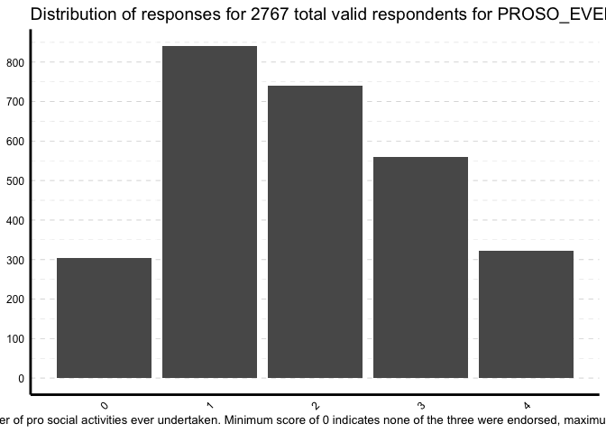<!-- -->

```
Frequencies  
LIFEEVENT  
Label: In the last 12 months have you experienced a major life event?  
Type: Factor  

                          Freq   % Valid   % Valid Cum.   % Total   % Total Cum.
----------------------- ------ --------- -------------- --------- --------------
                    Yes    998     36.07          36.07     36.07          36.07
                     No   1715     61.98          98.05     61.98          98.05
      Prefer not to say     54      1.95         100.00      1.95         100.00
                   <NA>      0                               0.00         100.00
                  Total   2767    100.00         100.00    100.00         100.00
```

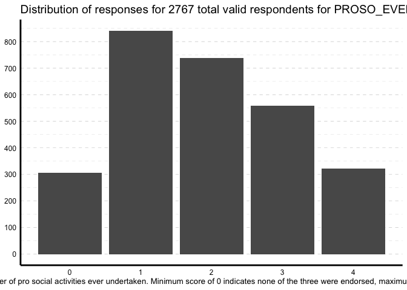<!-- -->

```
Frequencies  
PROSO_EVER_TOTAL  
Label: Composite score indicating number of pro social activities ever undertaken. Minimum score of 0 indicates none of the three were endorsed, maximum of 3 indicates all activities endorsed  
Type: Numeric  

              Freq   % Valid   % Valid Cum.   % Total   % Total Cum.
----------- ------ --------- -------------- --------- --------------
          0    305     11.02          11.02     11.02          11.02
          1    841     30.39          41.42     30.39          41.42
          2    739     26.71          68.12     26.71          68.12
          3    559     20.20          88.33     20.20          88.33
          4    323     11.67         100.00     11.67         100.00
       <NA>      0                               0.00         100.00
      Total   2767    100.00         100.00    100.00         100.00
```

```
Warning: Removed 352 rows containing non-finite values (stat_count).
```

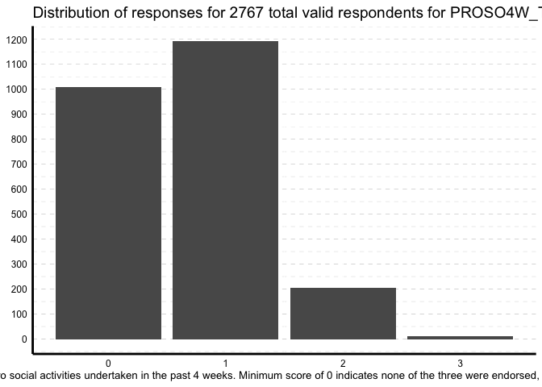<!-- -->

```
Frequencies  
PROSO4W_TOTAL  
Label: Composite score indicating number of pro social activities undertaken in the past 4 weeks. Minimum score of 0 indicates none of the three were endorsed, maximum of 3 indicates all activities endorsed  
Type: Numeric  

              Freq   % Valid   % Valid Cum.   % Total   % Total Cum.
----------- ------ --------- -------------- --------- --------------
          0   1008     41.74          41.74     36.43          36.43
          1   1193     49.40          91.14     43.12          79.54
          2    204      8.45          99.59      7.37          86.92
          3     10      0.41         100.00      0.36          87.28
       <NA>    352                              12.72         100.00
      Total   2767    100.00         100.00    100.00         100.00
```

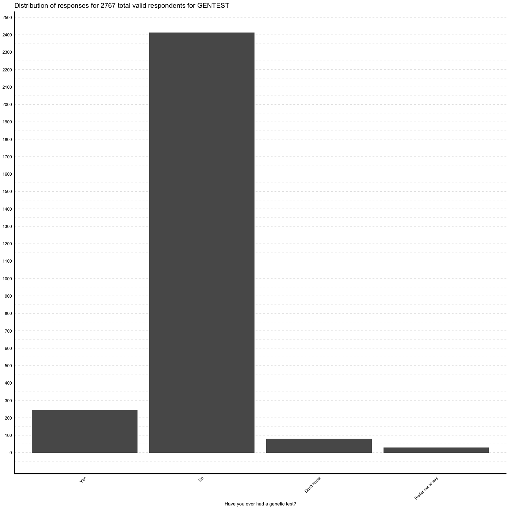<!-- -->

```
Frequencies  
GENFAM  
Label: Do you have a family history of any disease or health condition?  
Type: Factor  

                          Freq   % Valid   % Valid Cum.   % Total   % Total Cum.
----------------------- ------ --------- -------------- --------- --------------
                    Yes   1040     37.59          37.59     37.59          37.59
                     No   1309     47.31          84.89     47.31          84.89
             Don't know    353     12.76          97.65     12.76          97.65
      Prefer not to say     65      2.35         100.00      2.35         100.00
                   <NA>      0                               0.00         100.00
                  Total   2767    100.00         100.00    100.00         100.00
```

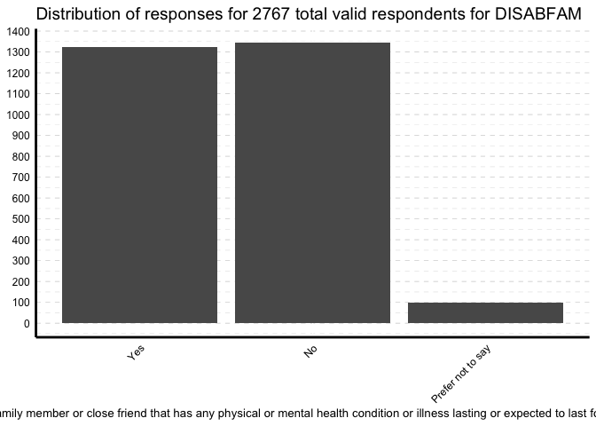<!-- -->

```
Frequencies  
GENTEST  
Label: Have you ever had a genetic test?  
Type: Factor  

                          Freq   % Valid   % Valid Cum.   % Total   % Total Cum.
----------------------- ------ --------- -------------- --------- --------------
                    Yes    245      8.85           8.85      8.85           8.85
                     No   2413     87.21          96.06     87.21          96.06
             Don't know     80      2.89          98.95      2.89          98.95
      Prefer not to say     29      1.05         100.00      1.05         100.00
                   <NA>      0                               0.00         100.00
                  Total   2767    100.00         100.00    100.00         100.00
```

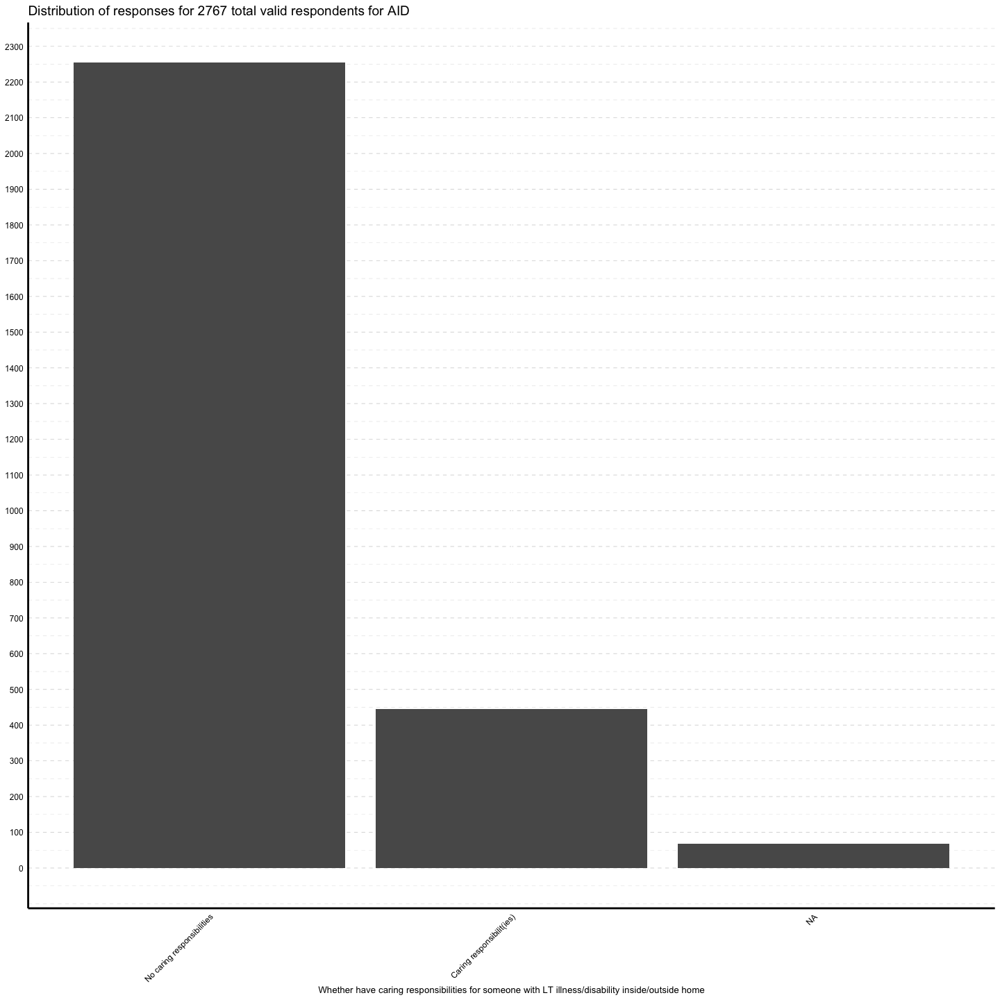<!-- -->

```
Frequencies  
DISABFAM  
Label: Do you have a family member or close friend that has any physical or mental health condition or illness lasting or expected to last for 12 months or more?  
Type: Factor  

                          Freq   % Valid   % Valid Cum.   % Total   % Total Cum.
----------------------- ------ --------- -------------- --------- --------------
                    Yes   1324     47.85          47.85     47.85          47.85
                     No   1344     48.57          96.42     48.57          96.42
      Prefer not to say     99      3.58         100.00      3.58         100.00
                   <NA>      0                               0.00         100.00
                  Total   2767    100.00         100.00    100.00         100.00
```

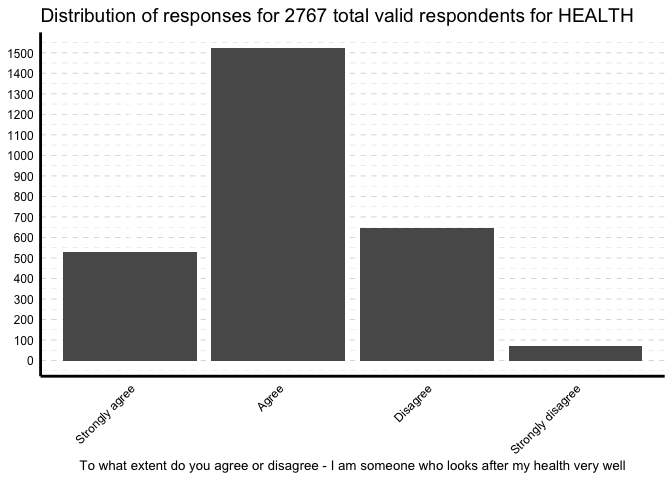<!-- -->

```
Frequencies  
AID  
Label: Whether have caring responsibilities for someone with LT illness/disability inside/outside home  
Type: Factor  

                                   Freq   % Valid   % Valid Cum.   % Total   % Total Cum.
-------------------------------- ------ --------- -------------- --------- --------------
      No caring responsibilities   2254     83.51          83.51     81.46          81.46
       Caring responsibilit(ies)    445     16.49         100.00     16.08          97.54
                            <NA>     68                               2.46         100.00
                           Total   2767    100.00         100.00    100.00         100.00
```

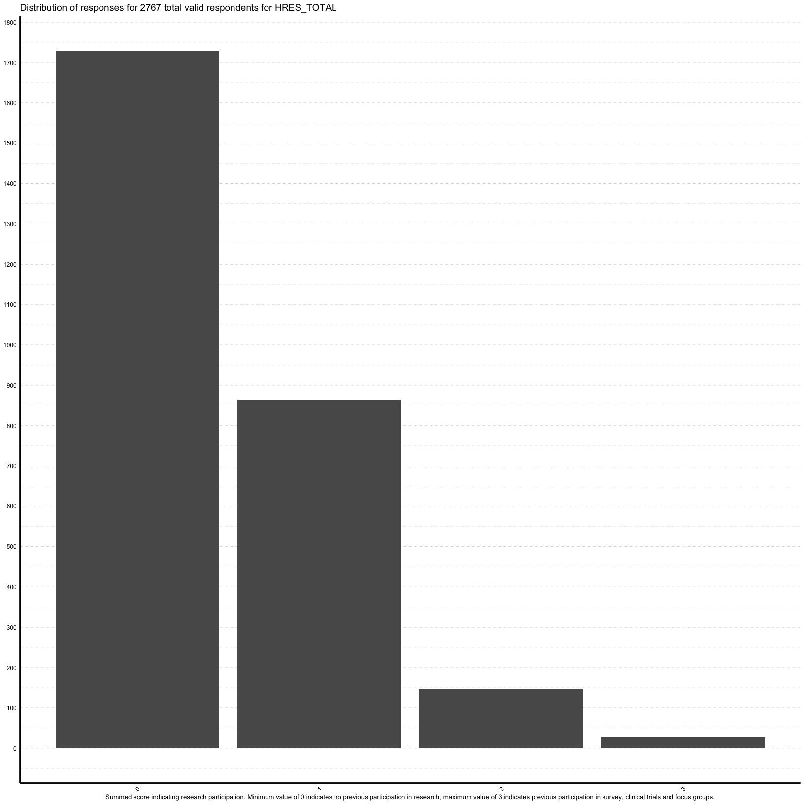<!-- -->

```
Frequencies  
HEALTH  
Label: To what extent do you agree or disagree - I am someone who looks after my health very well  
Type: Factor  

                          Freq   % Valid   % Valid Cum.   % Total   % Total Cum.
----------------------- ------ --------- -------------- --------- --------------
         Strongly agree    529     19.12          19.12     19.12          19.12
                  Agree   1523     55.04          74.16     55.04          74.16
               Disagree    646     23.35          97.51     23.35          97.51
      Strongly disagree     69      2.49         100.00      2.49         100.00
                   <NA>      0                               0.00         100.00
                  Total   2767    100.00         100.00    100.00         100.00
```

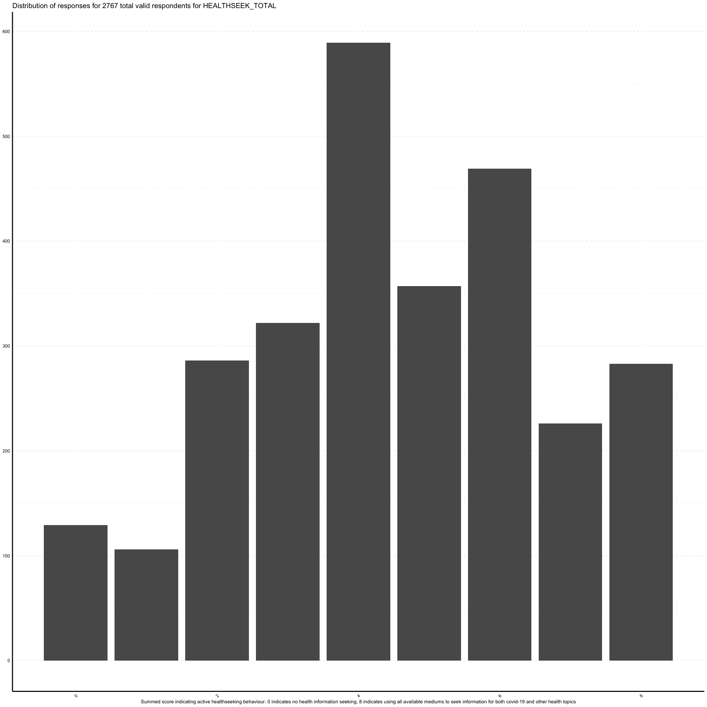<!-- -->

```
Frequencies  
HRES_TOTAL  
Label: Summed score indicating research participation. Minimum value of 0 indicates no previous participation in research, maximum value of 3 indicates previous participation in survey, clinical trials and focus groups.  
Type: Numeric  

              Freq   % Valid   % Valid Cum.   % Total   % Total Cum.
----------- ------ --------- -------------- --------- --------------
          0   2767    100.00         100.00    100.00         100.00
       <NA>      0                               0.00         100.00
      Total   2767    100.00         100.00    100.00         100.00
```

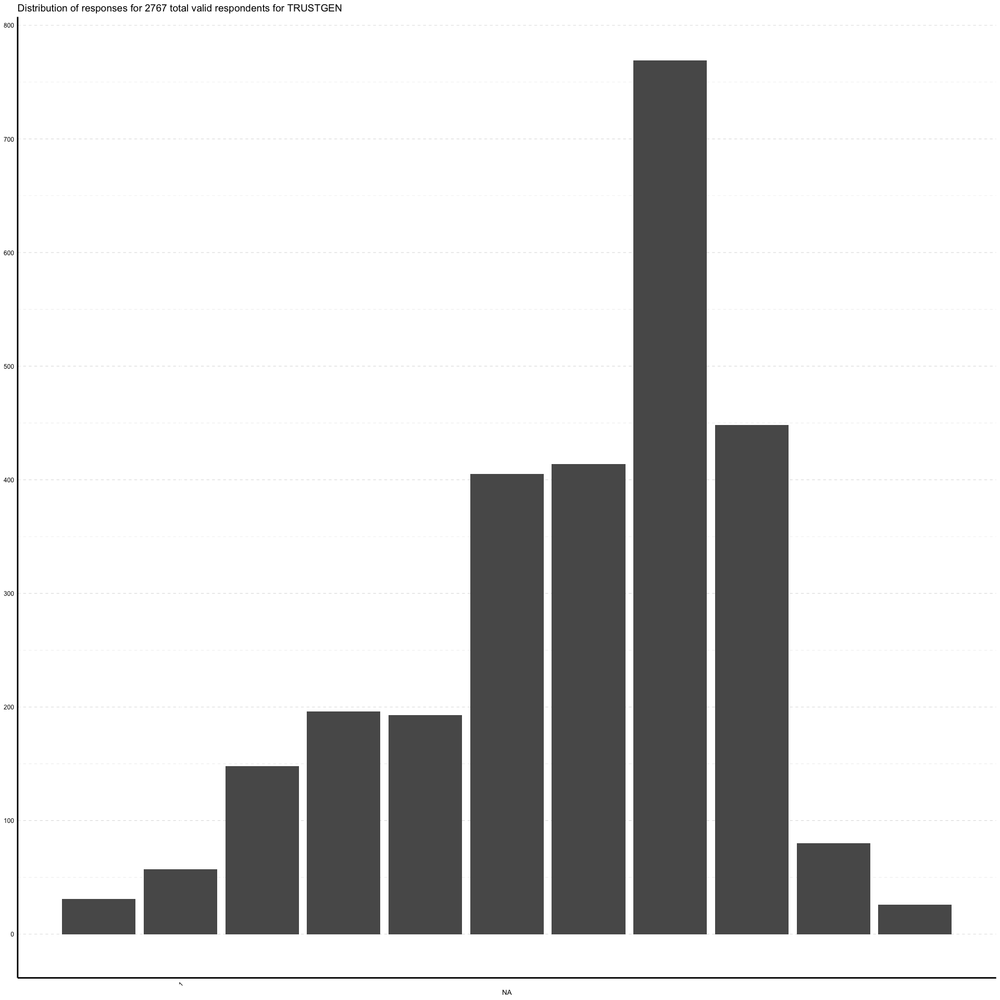<!-- -->

```
Frequencies  
HACT12_1  
Label: In the last 12 months, have you searched online for health-related information about...  
Type: Factor  

                                               Freq   % Valid   % Valid Cum.   % Total   % Total Cum.
-------------------------------------------- ------ --------- -------------- --------- --------------
                                    Covid-19    656     23.71          23.71     23.71          23.71
                        Another health topic    367     13.26          36.97     13.26          36.97
      Both Covid-19 AND another health topic   1329     48.03          85.00     48.03          85.00
                                     Neither    415     15.00         100.00     15.00         100.00
                                        <NA>      0                               0.00         100.00
                                       Total   2767    100.00         100.00    100.00         100.00
```

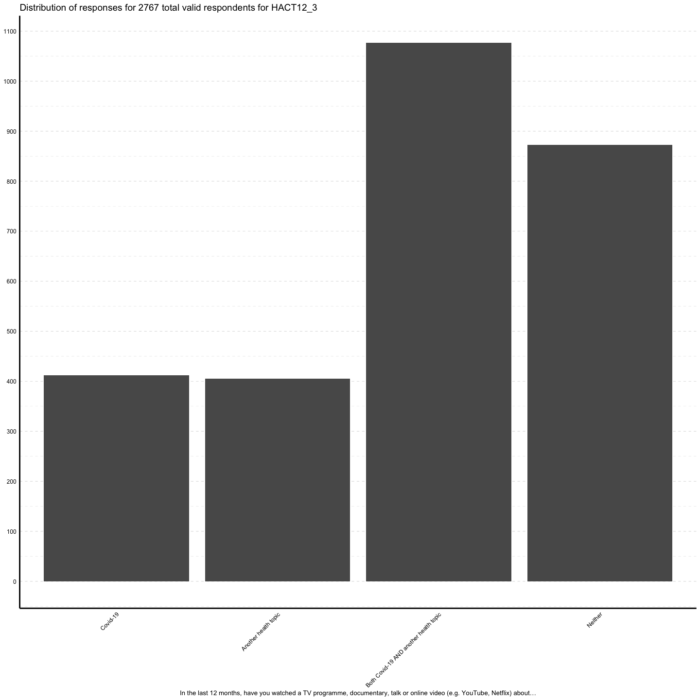<!-- -->

```
Frequencies  
HACT12_2  
Label: In the last 12 months, have you read an article (in print or online) about...  
Type: Factor  

                                               Freq   % Valid   % Valid Cum.   % Total   % Total Cum.
-------------------------------------------- ------ --------- -------------- --------- --------------
                                    Covid-19    515     18.61          18.61     18.61          18.61
                        Another health topic    354     12.79          31.41     12.79          31.41
      Both Covid-19 AND another health topic   1598     57.75          89.16     57.75          89.16
                                     Neither    300     10.84         100.00     10.84         100.00
                                        <NA>      0                               0.00         100.00
                                       Total   2767    100.00         100.00    100.00         100.00
```

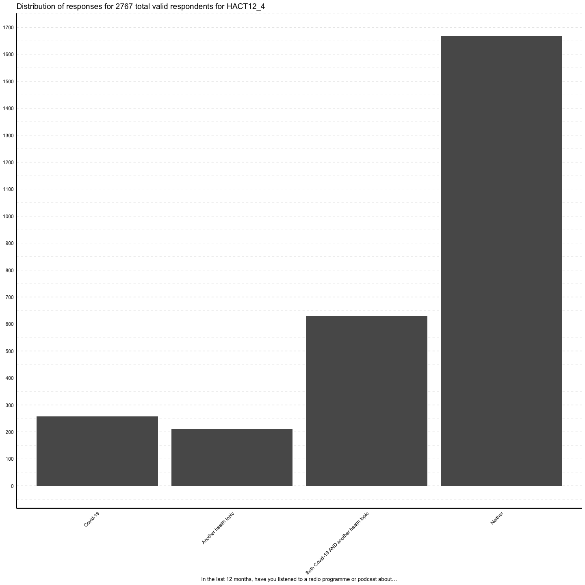<!-- -->

```
Frequencies  
HACT12_3  
Label: In the last 12 months, have you watched a TV programme, documentary, talk or online video (e.g. YouTube, Netflix) about…  
Type: Factor  

                                               Freq   % Valid   % Valid Cum.   % Total   % Total Cum.
-------------------------------------------- ------ --------- -------------- --------- --------------
                                    Covid-19    412     14.89          14.89     14.89          14.89
                        Another health topic    405     14.64          29.53     14.64          29.53
      Both Covid-19 AND another health topic   1077     38.92          68.45     38.92          68.45
                                     Neither    873     31.55         100.00     31.55         100.00
                                        <NA>      0                               0.00         100.00
                                       Total   2767    100.00         100.00    100.00         100.00
```

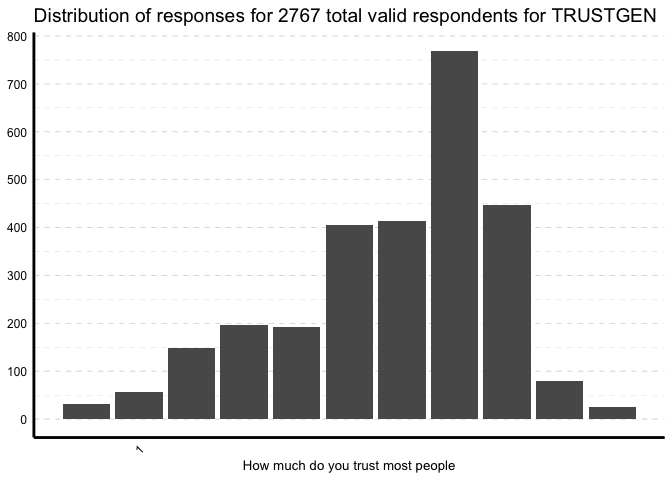<!-- -->

```
Frequencies  
HACT12_4  
Label: In the last 12 months, have you listened to a radio programme or podcast about…  
Type: Factor  

                                               Freq   % Valid   % Valid Cum.   % Total   % Total Cum.
-------------------------------------------- ------ --------- -------------- --------- --------------
                                    Covid-19    258      9.32           9.32      9.32           9.32
                        Another health topic    210      7.59          16.91      7.59          16.91
      Both Covid-19 AND another health topic    630     22.77          39.68     22.77          39.68
                                     Neither   1669     60.32         100.00     60.32         100.00
                                        <NA>      0                               0.00         100.00
                                       Total   2767    100.00         100.00    100.00         100.00
```

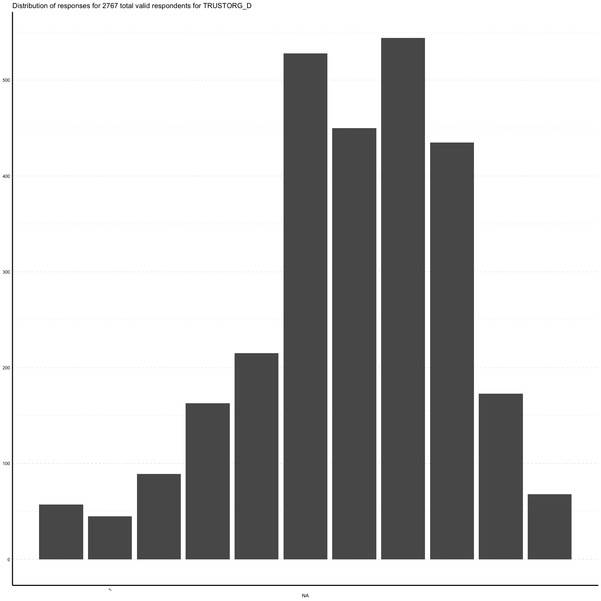<!-- -->

```
Frequencies  
TRUSTGEN  
Label: How much do you trust most people  
Type: Numeric  

              Freq   % Valid   % Valid Cum.   % Total   % Total Cum.
----------- ------ --------- -------------- --------- --------------
          0     31      1.12           1.12      1.12           1.12
          1     57      2.06           3.18      2.06           3.18
          2    148      5.35           8.53      5.35           8.53
          3    196      7.08          15.61      7.08          15.61
          4    193      6.98          22.59      6.98          22.59
          5    405     14.64          37.22     14.64          37.22
          6    414     14.96          52.19     14.96          52.19
          7    769     27.79          79.98     27.79          79.98
          8    448     16.19          96.17     16.19          96.17
          9     80      2.89          99.06      2.89          99.06
         10     26      0.94         100.00      0.94         100.00
       <NA>      0                               0.00         100.00
      Total   2767    100.00         100.00    100.00         100.00
```

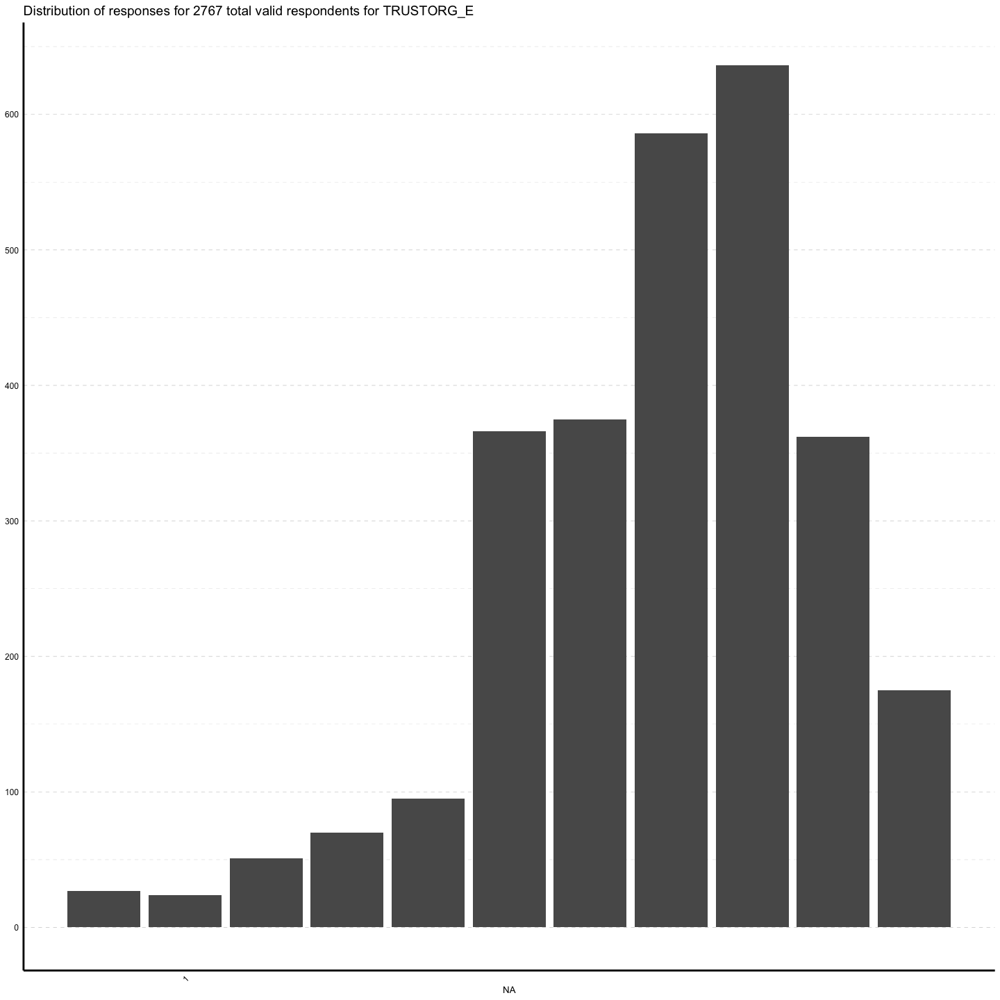<!-- -->

```
Frequencies  
TRUSTORG_A  
Label: How much do you trust the NHS  
Type: Numeric  

              Freq   % Valid   % Valid Cum.   % Total   % Total Cum.
----------- ------ --------- -------------- --------- --------------
          0     25      0.90           0.90      0.90           0.90
          1     36      1.30           2.20      1.30           2.20
          2     60      2.17           4.37      2.17           4.37
          3    116      4.19           8.57      4.19           8.57
          4    124      4.48          13.05      4.48          13.05
          5    271      9.79          22.84      9.79          22.84
          6    336     12.14          34.98     12.14          34.98
          7    539     19.48          54.46     19.48          54.46
          8    657     23.74          78.21     23.74          78.21
          9    421     15.22          93.42     15.22          93.42
         10    182      6.58         100.00      6.58         100.00
       <NA>      0                               0.00         100.00
      Total   2767    100.00         100.00    100.00         100.00
```

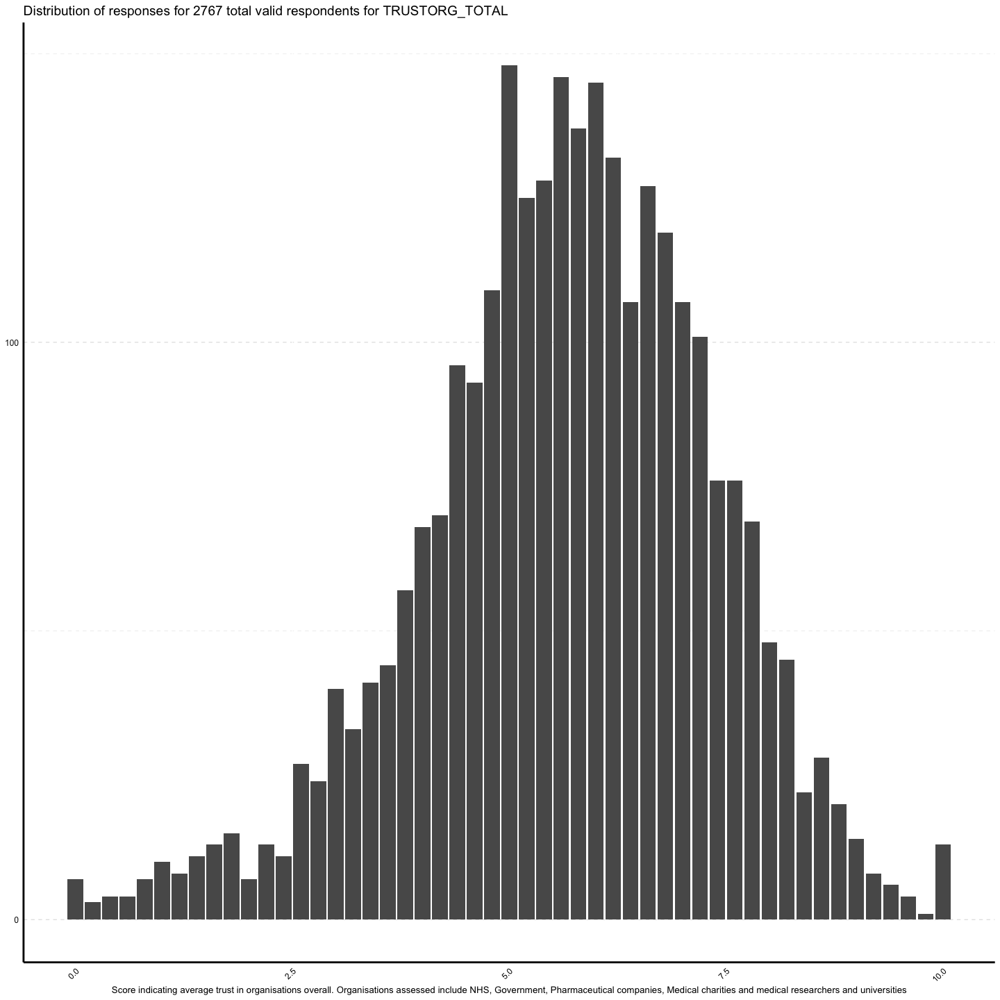<!-- -->

```
Frequencies  
TRUSTORG_B  
Label: How much do you trust the Government  
Type: Numeric  

              Freq   % Valid   % Valid Cum.   % Total   % Total Cum.
----------- ------ --------- -------------- --------- --------------
          0    432     15.61          15.61     15.61          15.61
          1    270      9.76          25.37      9.76          25.37
          2    303     10.95          36.32     10.95          36.32
          3    388     14.02          50.34     14.02          50.34
          4    274      9.90          60.25      9.90          60.25
          5    369     13.34          73.58     13.34          73.58
          6    296     10.70          84.28     10.70          84.28
          7    214      7.73          92.01      7.73          92.01
          8    140      5.06          97.07      5.06          97.07
          9     53      1.92          98.99      1.92          98.99
         10     28      1.01         100.00      1.01         100.00
       <NA>      0                               0.00         100.00
      Total   2767    100.00         100.00    100.00         100.00
```

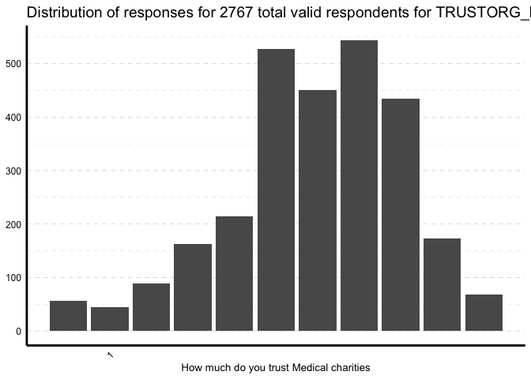<!-- -->

```
Frequencies  
TRUSTORG_C  
Label: How much do you trust Pharmaceutical companies  
Type: Numeric  

              Freq   % Valid   % Valid Cum.   % Total   % Total Cum.
----------- ------ --------- -------------- --------- --------------
          0    140      5.06           5.06      5.06           5.06
          1    143      5.17          10.23      5.17          10.23
          2    181      6.54          16.77      6.54          16.77
          3    298     10.77          27.54     10.77          27.54
          4    315     11.38          38.92     11.38          38.92
          5    503     18.18          57.10     18.18          57.10
          6    408     14.75          71.85     14.75          71.85
          7    406     14.67          86.52     14.67          86.52
          8    253      9.14          95.66      9.14          95.66
          9     80      2.89          98.55      2.89          98.55
         10     40      1.45         100.00      1.45         100.00
       <NA>      0                               0.00         100.00
      Total   2767    100.00         100.00    100.00         100.00
```

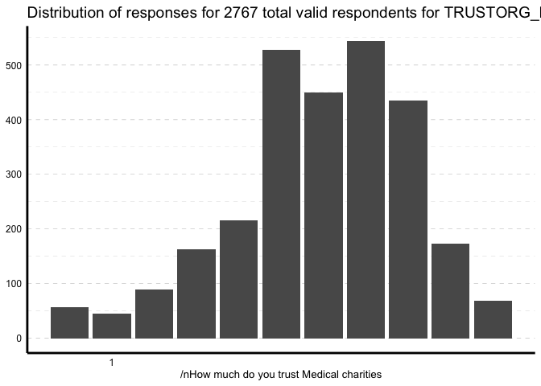<!-- -->

```
Frequencies  
TRUSTORG_D  
Label: How much do you trust Medical charities  
Type: Numeric  

              Freq   % Valid   % Valid Cum.   % Total   % Total Cum.
----------- ------ --------- -------------- --------- --------------
          0     57      2.06           2.06      2.06           2.06
          1     45      1.63           3.69      1.63           3.69
          2     89      3.22           6.90      3.22           6.90
          3    163      5.89          12.79      5.89          12.79
          4    215      7.77          20.56      7.77          20.56
          5    528     19.08          39.65     19.08          39.65
          6    450     16.26          55.91     16.26          55.91
          7    544     19.66          75.57     19.66          75.57
          8    435     15.72          91.29     15.72          91.29
          9    173      6.25          97.54      6.25          97.54
         10     68      2.46         100.00      2.46         100.00
       <NA>      0                               0.00         100.00
      Total   2767    100.00         100.00    100.00         100.00
```

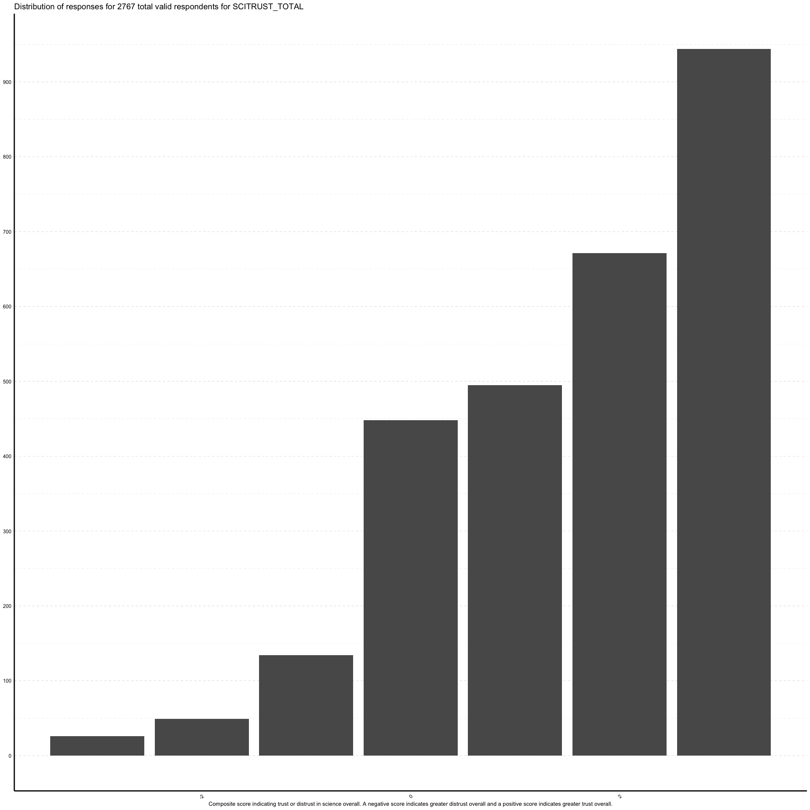<!-- -->

```
Frequencies  
TRUSTORG_E  
Label: How much do you trust Medical researchers in universities  
Type: Numeric  

              Freq   % Valid   % Valid Cum.   % Total   % Total Cum.
----------- ------ --------- -------------- --------- --------------
          0     27      0.98           0.98      0.98           0.98
          1     24      0.87           1.84      0.87           1.84
          2     51      1.84           3.69      1.84           3.69
          3     70      2.53           6.22      2.53           6.22
          4     95      3.43           9.65      3.43           9.65
          5    366     13.23          22.88     13.23          22.88
          6    375     13.55          36.43     13.55          36.43
          7    586     21.18          57.61     21.18          57.61
          8    636     22.99          80.59     22.99          80.59
          9    362     13.08          93.68     13.08          93.68
         10    175      6.32         100.00      6.32         100.00
       <NA>      0                               0.00         100.00
      Total   2767    100.00         100.00    100.00         100.00
```

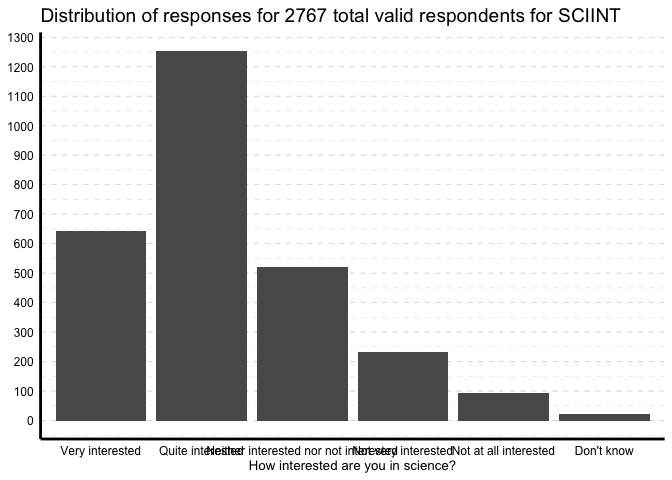<!-- -->

```
Frequencies  
SCIINT  
Label: How interested are you in science?  
Type: Factor  

                                              Freq   % Valid   % Valid Cum.   % Total   % Total Cum.
------------------------------------------- ------ --------- -------------- --------- --------------
                            Very interested    643     23.24          23.24     23.24          23.24
                           Quite interested   1254     45.32          68.56     45.32          68.56
      Neither interested nor not interested    522     18.87          87.42     18.87          87.42
                        Not very interested    232      8.38          95.81      8.38          95.81
                      Not at all interested     93      3.36          99.17      3.36          99.17
                                 Don't know     23      0.83         100.00      0.83         100.00
                                       <NA>      0                               0.00         100.00
                                      Total   2767    100.00         100.00    100.00         100.00
```

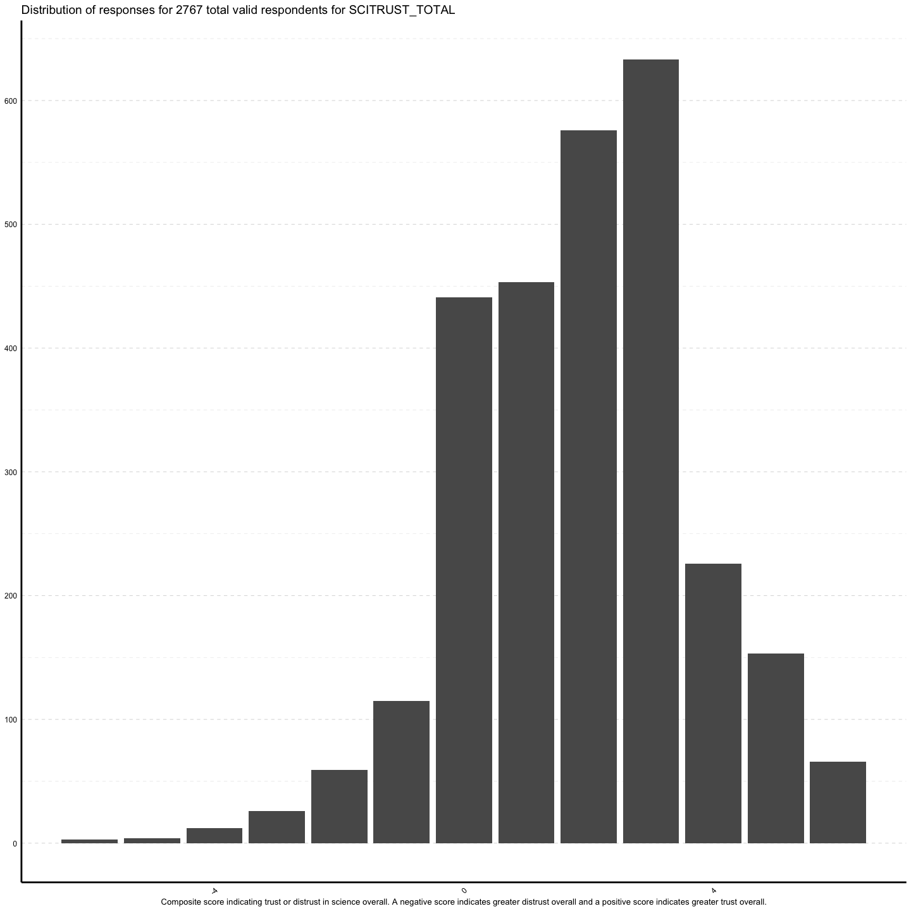<!-- -->

```
Frequencies  
SCIINF  
Label: How well informed do you feel about science and scientific developments?  
Type: Factor  

                                               Freq   % Valid   % Valid Cum.   % Total   % Total Cum.
-------------------------------------------- ------ --------- -------------- --------- --------------
                          Very well informed    178      6.43           6.43      6.43           6.43
                        Fairly well informed   1097     39.65          46.08     39.65          46.08
      Neither well informed nor not informed    876     31.66          77.74     31.66          77.74
                      Not very well informed    470     16.99          94.72     16.99          94.72
                         Not at all informed     98      3.54          98.27      3.54          98.27
                                  Don't know     48      1.73         100.00      1.73         100.00
                                        <NA>      0                               0.00         100.00
                                       Total   2767    100.00         100.00    100.00         100.00
```

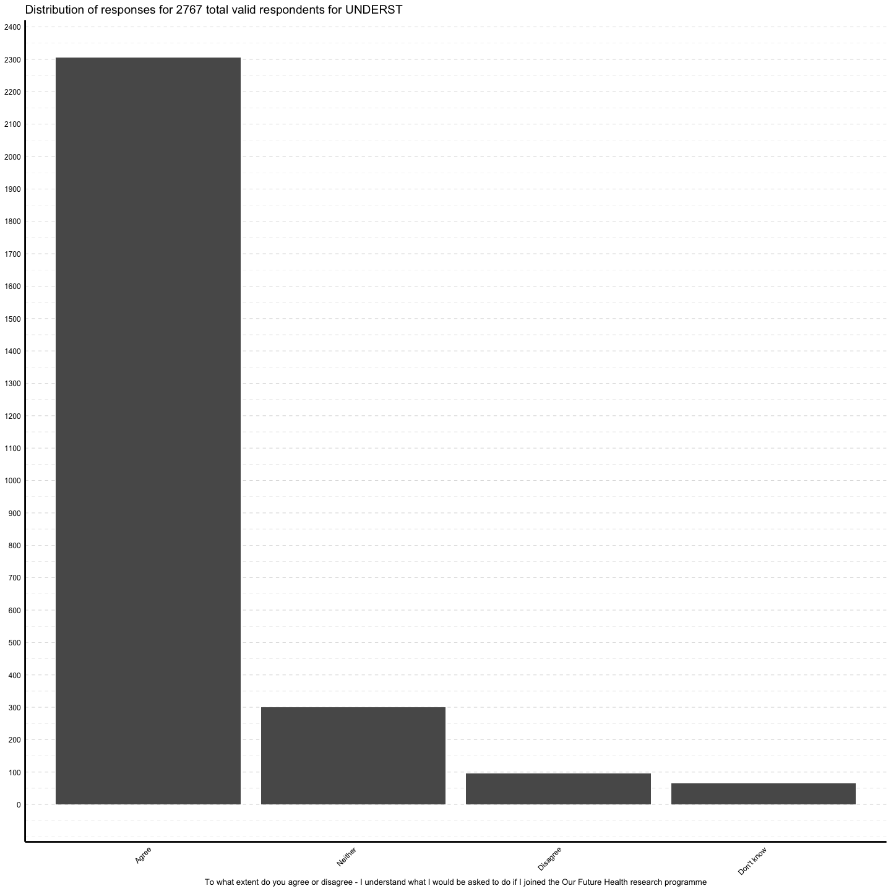<!-- -->

```
Frequencies  
SCITRUST_TOTAL  
Label: Composite score indicating trust or distrust in science overall. A negative score indicates greater distrust overall and a positive score indicates greater trust overall.  
Type: Numeric  

              Freq   % Valid   % Valid Cum.   % Total   % Total Cum.
----------- ------ --------- -------------- --------- --------------
         -6      3      0.11           0.11      0.11           0.11
         -5      4      0.14           0.25      0.14           0.25
         -4     12      0.43           0.69      0.43           0.69
         -3     26      0.94           1.63      0.94           1.63
         -2     59      2.13           3.76      2.13           3.76
         -1    115      4.16           7.91      4.16           7.91
          0    441     15.94          23.85     15.94          23.85
          1    453     16.37          40.22     16.37          40.22
          2    576     20.82          61.04     20.82          61.04
          3    633     22.88          83.92     22.88          83.92
          4    226      8.17          92.09      8.17          92.09
          5    153      5.53          97.61      5.53          97.61
          6     66      2.39         100.00      2.39         100.00
       <NA>      0                               0.00         100.00
      Total   2767    100.00         100.00    100.00         100.00
```

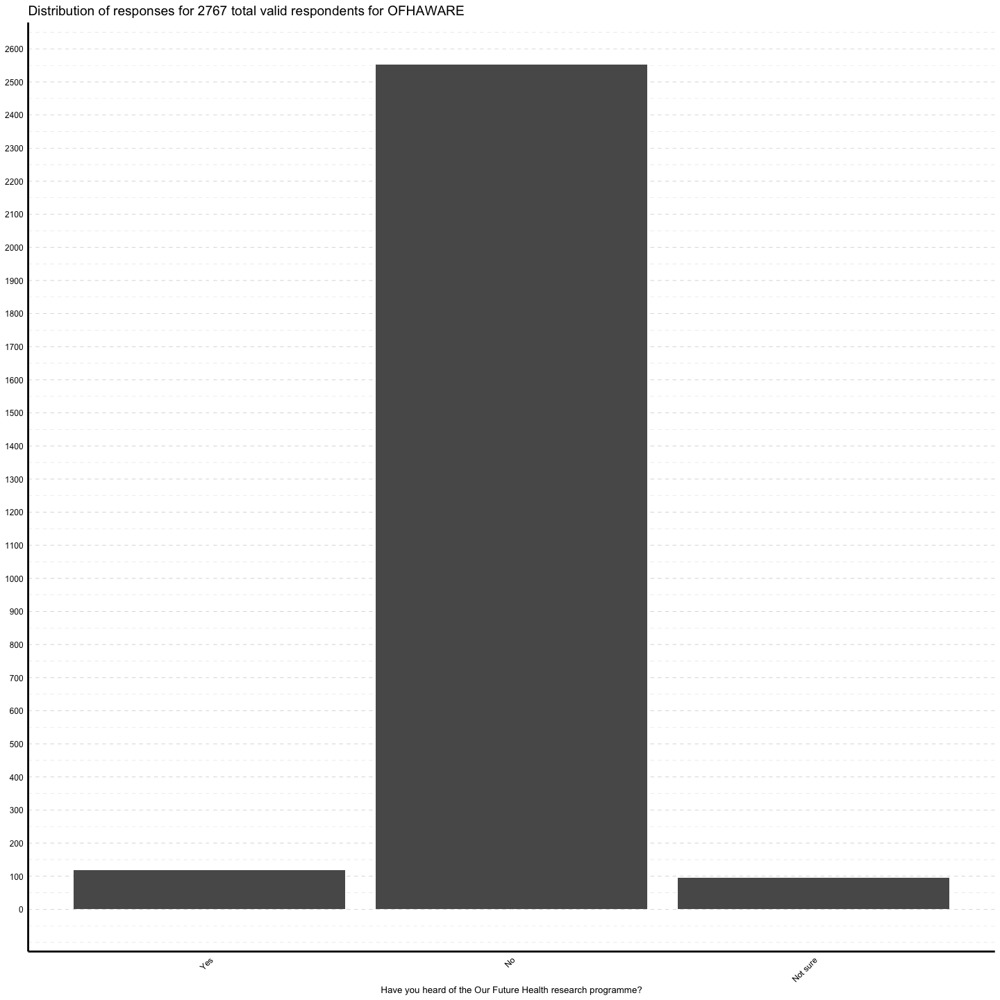<!-- -->

```
Frequencies  
COVRES  
Label: How much do you think scientific medical research has helped prevent and treat COVID-19?  
Type: Factor  

                      Freq   % Valid   % Valid Cum.   % Total   % Total Cum.
------------------- ------ --------- -------------- --------- --------------
              A lot   1217     43.98          43.98     43.98          43.98
        Quite a lot   1060     38.31          82.29     38.31          82.29
      Not very much    306     11.06          93.35     11.06          93.35
         Not at all     71      2.57          95.92      2.57          95.92
         Don't know    113      4.08         100.00      4.08         100.00
               <NA>      0                               0.00         100.00
              Total   2767    100.00         100.00    100.00         100.00
```

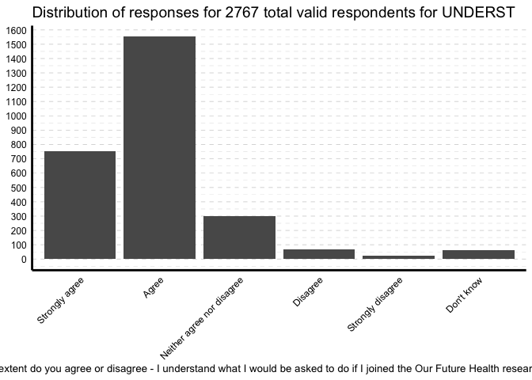<!-- -->

```
Frequencies  
OFHAWARE  
Label: Have you heard of the Our Future Health research programme?  
Type: Factor  

                 Freq   % Valid   % Valid Cum.   % Total   % Total Cum.
-------------- ------ --------- -------------- --------- --------------
           Yes    119      4.30           4.30      4.30           4.30
            No   2552     92.23          96.53     92.23          96.53
      Not sure     96      3.47         100.00      3.47         100.00
          <NA>      0                               0.00         100.00
         Total   2767    100.00         100.00    100.00         100.00
```

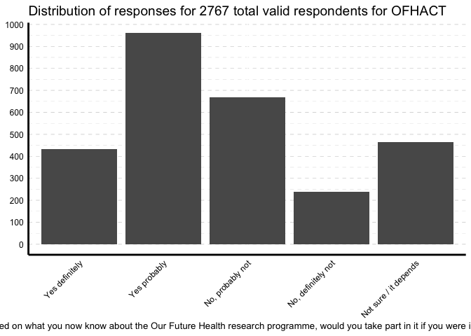<!-- -->

```
Frequencies  
UNDERST  
Label: To what extent do you agree or disagree - I understand what I would be asked to do if I joined the Our Future Health research programme  
Type: Factor  

                                   Freq   % Valid   % Valid Cum.   % Total   % Total Cum.
-------------------------------- ------ --------- -------------- --------- --------------
                  Strongly agree    754     27.25          27.25     27.25          27.25
                           Agree   1552     56.09          83.34     56.09          83.34
      Neither agree nor disagree    300     10.84          94.18     10.84          94.18
                        Disagree     70      2.53          96.71      2.53          96.71
               Strongly disagree     26      0.94          97.65      0.94          97.65
                      Don't know     65      2.35         100.00      2.35         100.00
                            <NA>      0                               0.00         100.00
                           Total   2767    100.00         100.00    100.00         100.00
```

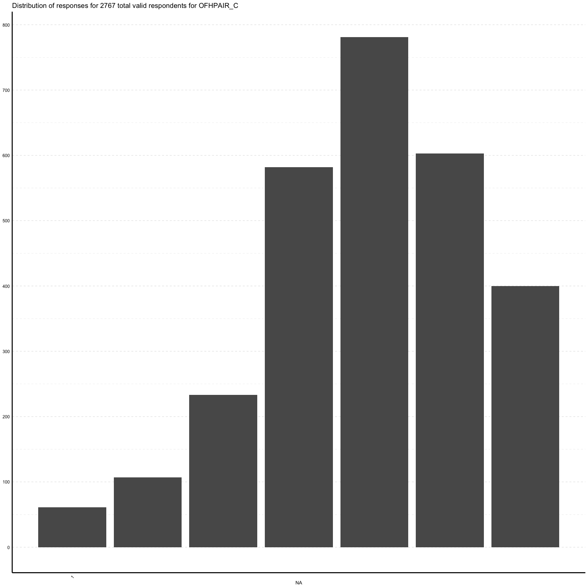<!-- -->

```
Frequencies  
OFHACT  
Label: Based on what you now know about the Our Future Health research programme, would you take part in it if you were invited to?  
Type: Factor  

                              Freq   % Valid   % Valid Cum.   % Total   % Total Cum.
--------------------------- ------ --------- -------------- --------- --------------
             Yes definitely    433     15.65          15.65     15.65          15.65
               Yes probably    960     34.69          50.34     34.69          50.34
           No, probably not    670     24.21          74.56     24.21          74.56
         No, definitely not    238      8.60          83.16      8.60          83.16
      Not sure / it depends    466     16.84         100.00     16.84         100.00
                       <NA>      0                               0.00         100.00
                      Total   2767    100.00         100.00    100.00         100.00
```

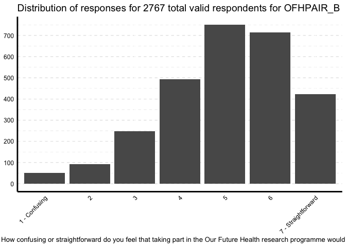<!-- -->

```
Frequencies  
OFHPAIR_A  
Label: How negative or positive do you feel about the idea of taking part in the Our Future Health research programme?  
Type: Factor  

                     Freq   % Valid   % Valid Cum.   % Total   % Total Cum.
------------------ ------ --------- -------------- --------- --------------
      1 - Negative    143      5.17           5.17      5.17           5.17
                 2    179      6.47          11.64      6.47          11.64
                 3    306     11.06          22.70     11.06          22.70
                 4    485     17.53          40.22     17.53          40.22
                 5    694     25.08          65.31     25.08          65.31
                 6    622     22.48          87.78     22.48          87.78
      7 - Positive    338     12.22         100.00     12.22         100.00
              <NA>      0                               0.00         100.00
             Total   2767    100.00         100.00    100.00         100.00
```

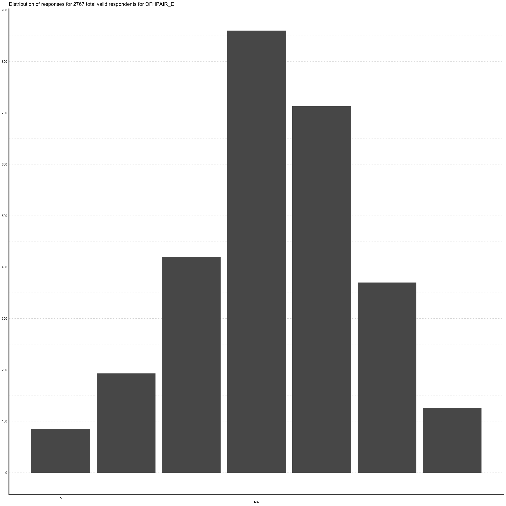<!-- -->

```
Frequencies  
OFHPAIR_B  
Label: How confusing or straightforward do you feel that taking part in the Our Future Health research programme would be?  
Type: Factor  

                            Freq   % Valid   % Valid Cum.   % Total   % Total Cum.
------------------------- ------ --------- -------------- --------- --------------
            1 - Confusing     50      1.81           1.81      1.81           1.81
                        2     92      3.32           5.13      3.32           5.13
                        3    247      8.93          14.06      8.93          14.06
                        4    492     17.78          31.84     17.78          31.84
                        5    751     27.14          58.98     27.14          58.98
                        6    713     25.77          84.75     25.77          84.75
      7 - Straightforward    422     15.25         100.00     15.25         100.00
                     <NA>      0                               0.00         100.00
                    Total   2767    100.00         100.00    100.00         100.00
```

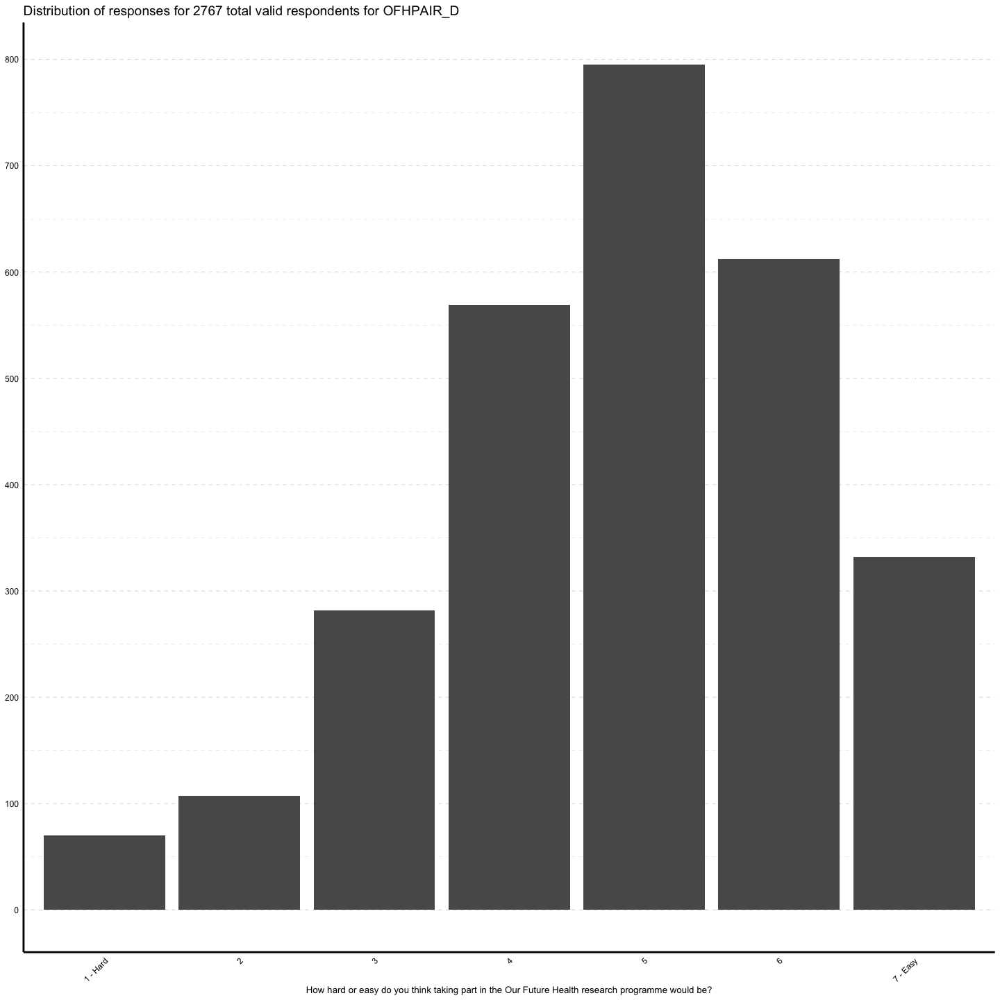<!-- -->

```
Frequencies  
OFHPAIR_C  
Label: How boring or interesting do you think taking part in the Our Future Health research programme would be?  
Type: Factor  

                        Freq   % Valid   % Valid Cum.   % Total   % Total Cum.
--------------------- ------ --------- -------------- --------- --------------
           1 - Boring     61      2.20           2.20      2.20           2.20
                    2    107      3.87           6.07      3.87           6.07
                    3    233      8.42          14.49      8.42          14.49
                    4    582     21.03          35.53     21.03          35.53
                    5    781     28.23          63.75     28.23          63.75
                    6    603     21.79          85.54     21.79          85.54
      7 - Interesting    400     14.46         100.00     14.46         100.00
                 <NA>      0                               0.00         100.00
                Total   2767    100.00         100.00    100.00         100.00
```

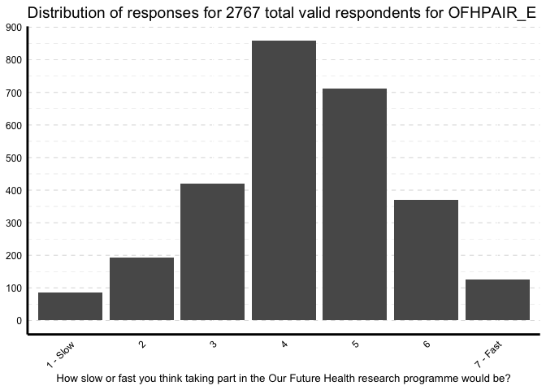<!-- -->

```
Frequencies  
OFHPAIR_D  
Label: How hard or easy do you think taking part in the Our Future Health research programme would be?  
Type: Factor  

                 Freq   % Valid   % Valid Cum.   % Total   % Total Cum.
-------------- ------ --------- -------------- --------- --------------
      1 - Hard     70      2.53           2.53      2.53           2.53
             2    107      3.87           6.40      3.87           6.40
             3    282     10.19          16.59     10.19          16.59
             4    569     20.56          37.15     20.56          37.15
             5    795     28.73          65.88     28.73          65.88
             6    612     22.12          88.00     22.12          88.00
      7 - Easy    332     12.00         100.00     12.00         100.00
          <NA>      0                               0.00         100.00
         Total   2767    100.00         100.00    100.00         100.00
```

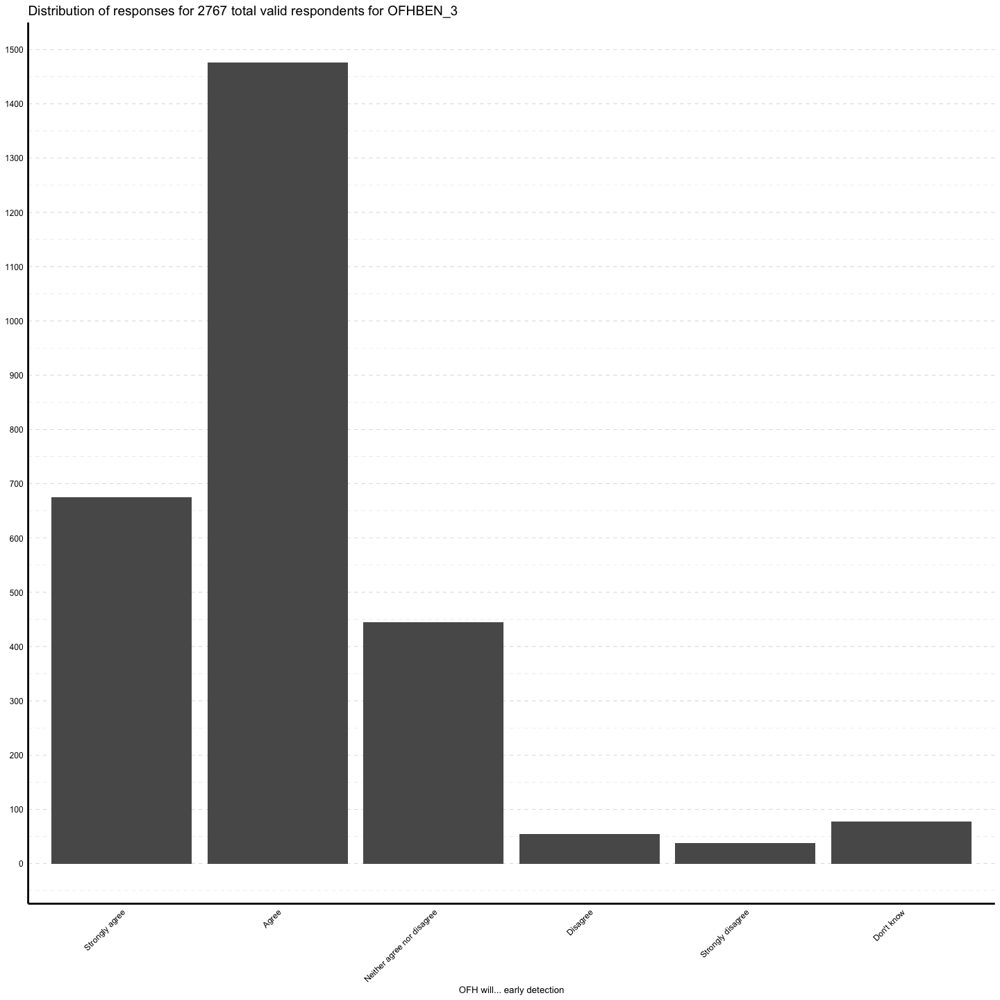<!-- -->

```
Frequencies  
OFHPAIR_E  
Label: How slow or fast you think taking part in the Our Future Health research programme would be?  
Type: Factor  

                 Freq   % Valid   % Valid Cum.   % Total   % Total Cum.
-------------- ------ --------- -------------- --------- --------------
      1 - Slow     85      3.07           3.07      3.07           3.07
             2    193      6.98          10.05      6.98          10.05
             3    420     15.18          25.23     15.18          25.23
             4    860     31.08          56.31     31.08          56.31
             5    713     25.77          82.07     25.77          82.07
             6    370     13.37          95.45     13.37          95.45
      7 - Fast    126      4.55         100.00      4.55         100.00
          <NA>      0                               0.00         100.00
         Total   2767    100.00         100.00    100.00         100.00
```

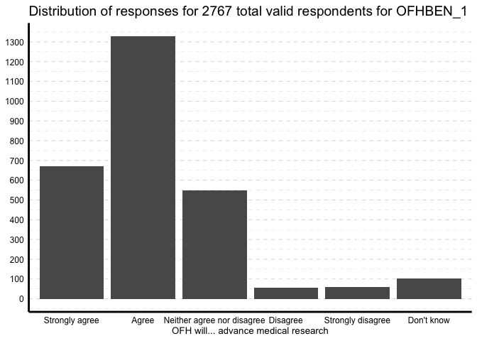<!-- -->

```
Frequencies  
OFHBEN_1  
Label: OFH will... advance medical research  
Type: Factor  

                                   Freq   % Valid   % Valid Cum.   % Total   % Total Cum.
-------------------------------- ------ --------- -------------- --------- --------------
                  Strongly agree    670     24.21          24.21     24.21          24.21
                           Agree   1329     48.03          72.24     48.03          72.24
      Neither agree nor disagree    549     19.84          92.09     19.84          92.09
                        Disagree     57      2.06          94.15      2.06          94.15
               Strongly disagree     58      2.10          96.24      2.10          96.24
                      Don't know    104      3.76         100.00      3.76         100.00
                            <NA>      0                               0.00         100.00
                           Total   2767    100.00         100.00    100.00         100.00
```

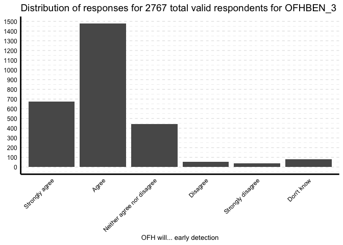<!-- -->

```
Frequencies  
OFHBEN_2  
Label: OFH will... better treatments  
Type: Factor  

                                   Freq   % Valid   % Valid Cum.   % Total   % Total Cum.
-------------------------------- ------ --------- -------------- --------- --------------
                  Strongly agree    625     22.59          22.59     22.59          22.59
                           Agree   1457     52.66          75.24     52.66          75.24
      Neither agree nor disagree    484     17.49          92.74     17.49          92.74
                        Disagree     63      2.28          95.01      2.28          95.01
               Strongly disagree     42      1.52          96.53      1.52          96.53
                      Don't know     96      3.47         100.00      3.47         100.00
                            <NA>      0                               0.00         100.00
                           Total   2767    100.00         100.00    100.00         100.00
```

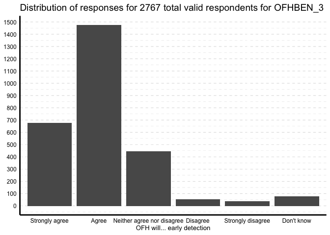<!-- -->

```
Frequencies  
OFHBEN_3  
Label: OFH will... early detection  
Type: Factor  

                                   Freq   % Valid   % Valid Cum.   % Total   % Total Cum.
-------------------------------- ------ --------- -------------- --------- --------------
                  Strongly agree    675     24.39          24.39     24.39          24.39
                           Agree   1476     53.34          77.74     53.34          77.74
      Neither agree nor disagree    445     16.08          93.82     16.08          93.82
                        Disagree     55      1.99          95.81      1.99          95.81
               Strongly disagree     38      1.37          97.18      1.37          97.18
                      Don't know     78      2.82         100.00      2.82         100.00
                            <NA>      0                               0.00         100.00
                           Total   2767    100.00         100.00    100.00         100.00
```

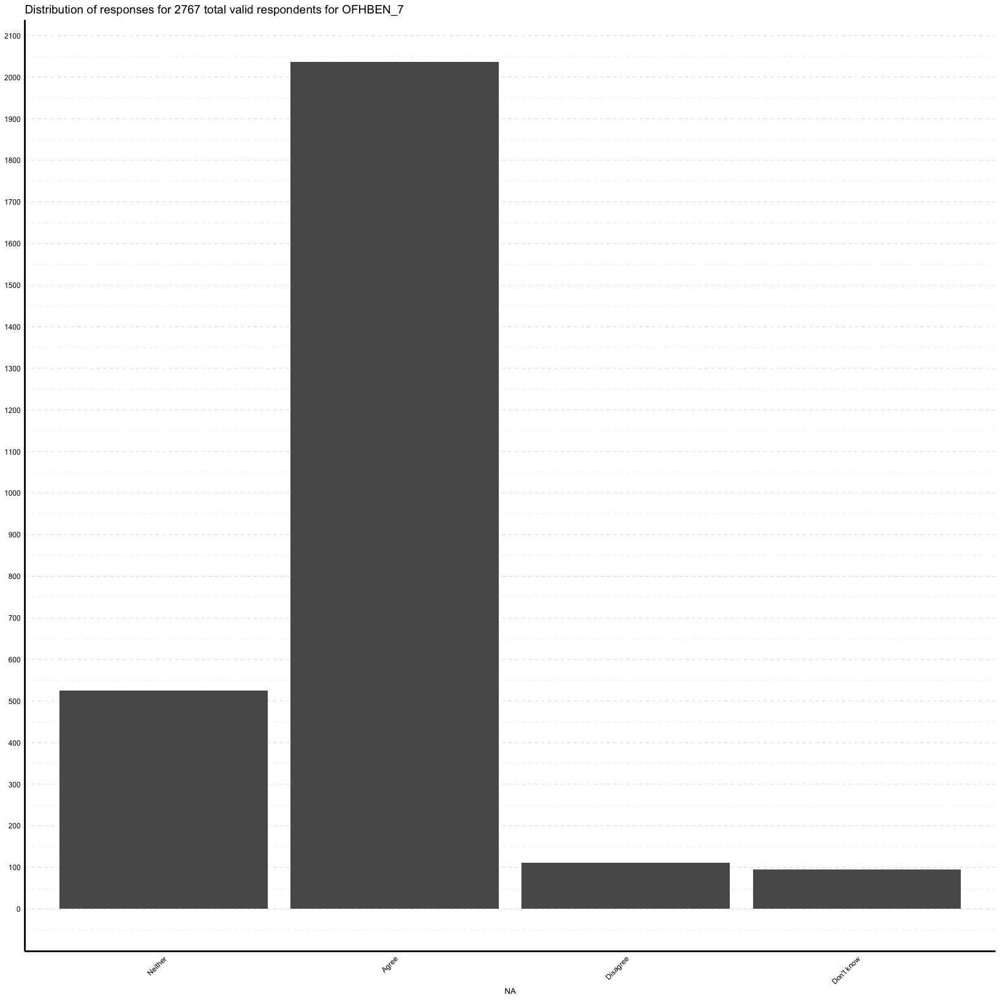<!-- -->

```
Frequencies  
OFHBEN_4  
Label: OFH will... help me  
Type: Factor  

                                   Freq   % Valid   % Valid Cum.   % Total   % Total Cum.
-------------------------------- ------ --------- -------------- --------- --------------
                  Strongly agree    248      8.96           8.96      8.96           8.96
                           Agree    765     27.65          36.61     27.65          36.61
      Neither agree nor disagree   1086     39.25          75.86     39.25          75.86
                        Disagree    393     14.20          90.06     14.20          90.06
               Strongly disagree    119      4.30          94.36      4.30          94.36
                      Don't know    156      5.64         100.00      5.64         100.00
                            <NA>      0                               0.00         100.00
                           Total   2767    100.00         100.00    100.00         100.00
```

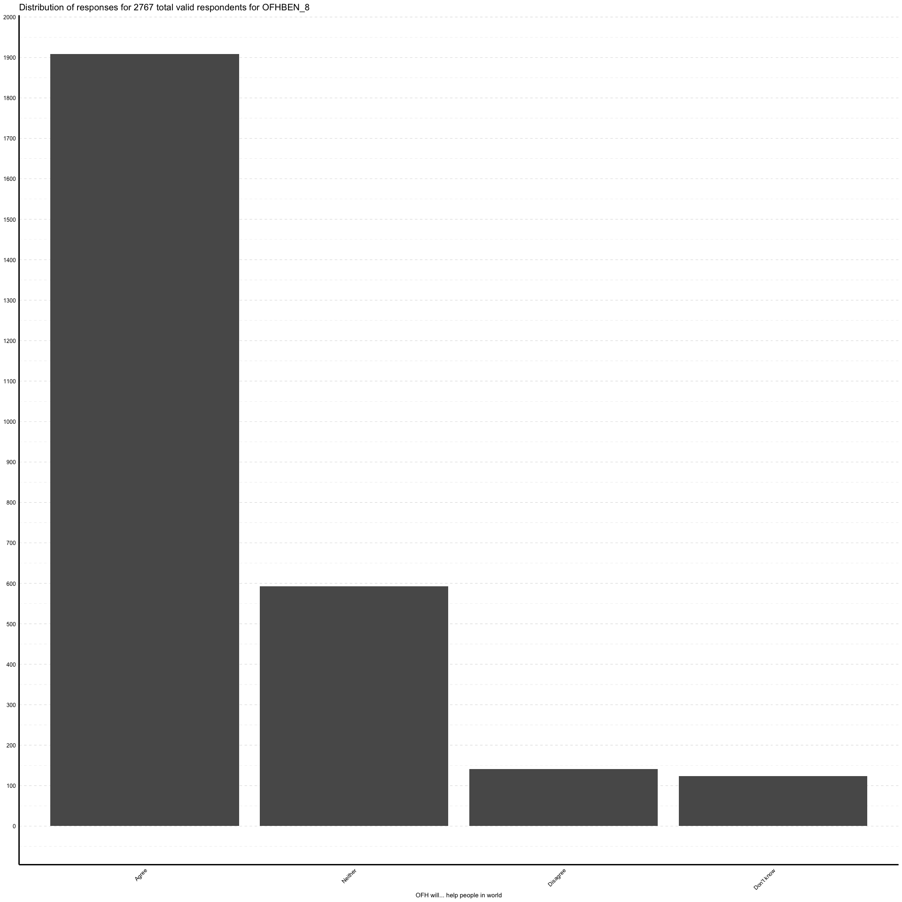<!-- -->

```
Frequencies  
OFHBEN_5  
Label: OFH will... help family/friends  
Type: Factor  

                                   Freq   % Valid   % Valid Cum.   % Total   % Total Cum.
-------------------------------- ------ --------- -------------- --------- --------------
                  Strongly agree    324     11.71          11.71     11.71          11.71
                           Agree   1087     39.28          50.99     39.28          50.99
      Neither agree nor disagree    916     33.10          84.10     33.10          84.10
                        Disagree    215      7.77          91.87      7.77          91.87
               Strongly disagree     82      2.96          94.83      2.96          94.83
                      Don't know    143      5.17         100.00      5.17         100.00
                            <NA>      0                               0.00         100.00
                           Total   2767    100.00         100.00    100.00         100.00
```

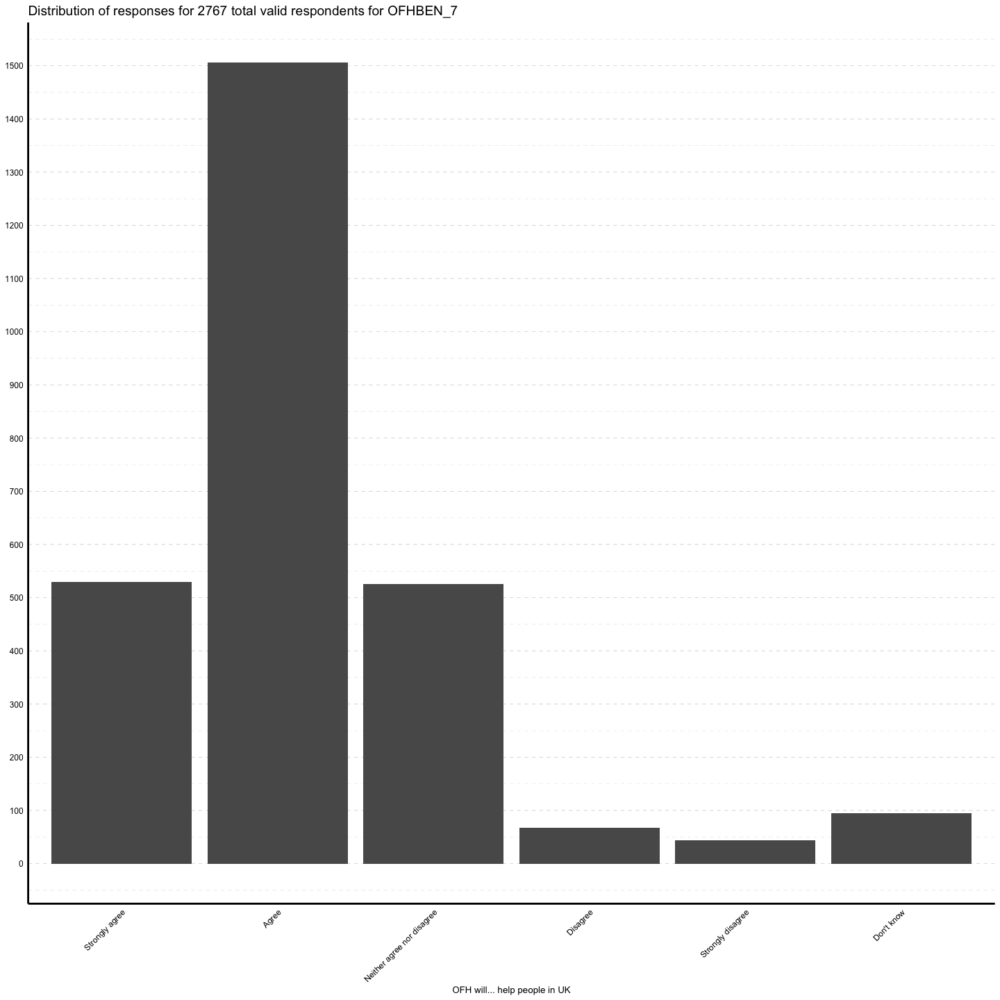<!-- -->

```
Frequencies  
OFHBEN_6  
Label: OFH will... help community  
Type: Factor  

                                   Freq   % Valid   % Valid Cum.   % Total   % Total Cum.
-------------------------------- ------ --------- -------------- --------- --------------
                  Strongly agree    416     15.03          15.03     15.03          15.03
                           Agree   1385     50.05          65.09     50.05          65.09
      Neither agree nor disagree    669     24.18          89.27     24.18          89.27
                        Disagree    116      4.19          93.46      4.19          93.46
               Strongly disagree     55      1.99          95.45      1.99          95.45
                      Don't know    126      4.55         100.00      4.55         100.00
                            <NA>      0                               0.00         100.00
                           Total   2767    100.00         100.00    100.00         100.00
```

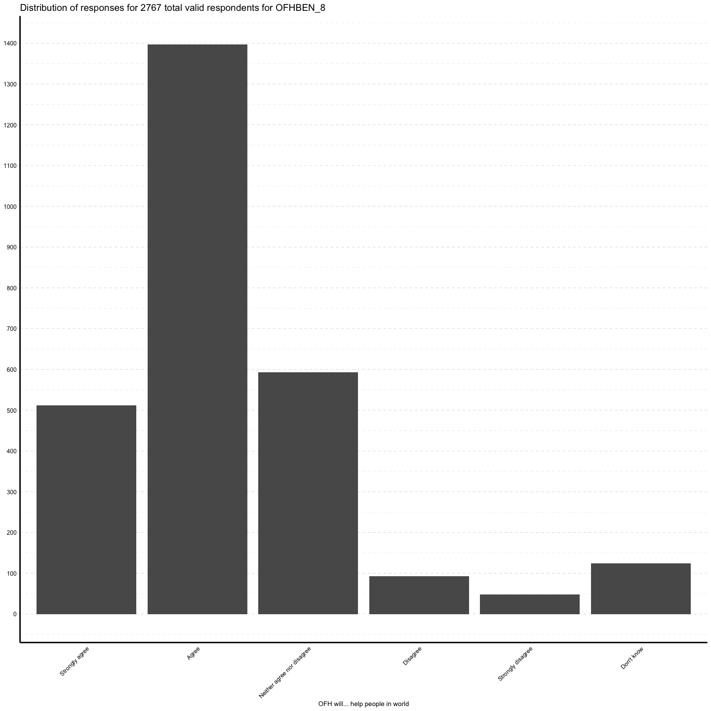<!-- -->

```
Frequencies  
OFHBEN_7  
Label: OFH will... help people in UK  
Type: Factor  

                                   Freq   % Valid   % Valid Cum.   % Total   % Total Cum.
-------------------------------- ------ --------- -------------- --------- --------------
                  Strongly agree    530     19.15          19.15     19.15          19.15
                           Agree   1506     54.43          73.58     54.43          73.58
      Neither agree nor disagree    525     18.97          92.56     18.97          92.56
                        Disagree     67      2.42          94.98      2.42          94.98
               Strongly disagree     44      1.59          96.57      1.59          96.57
                      Don't know     95      3.43         100.00      3.43         100.00
                            <NA>      0                               0.00         100.00
                           Total   2767    100.00         100.00    100.00         100.00
```

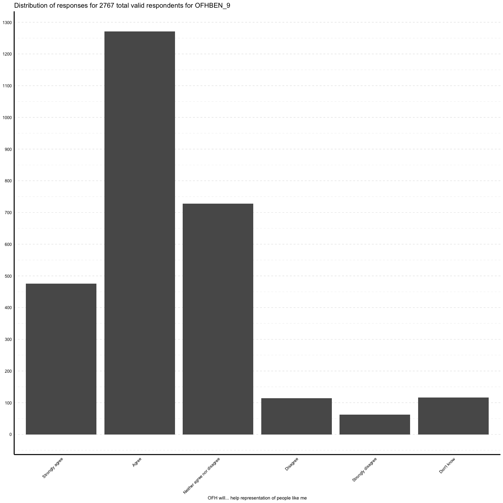<!-- -->

```
Frequencies  
OFHBEN_8  
Label: OFH will... help people in world  
Type: Factor  

                                   Freq   % Valid   % Valid Cum.   % Total   % Total Cum.
-------------------------------- ------ --------- -------------- --------- --------------
                  Strongly agree    512     18.50          18.50     18.50          18.50
                           Agree   1397     50.49          68.99     50.49          68.99
      Neither agree nor disagree    593     21.43          90.42     21.43          90.42
                        Disagree     93      3.36          93.78      3.36          93.78
               Strongly disagree     48      1.73          95.52      1.73          95.52
                      Don't know    124      4.48         100.00      4.48         100.00
                            <NA>      0                               0.00         100.00
                           Total   2767    100.00         100.00    100.00         100.00
```

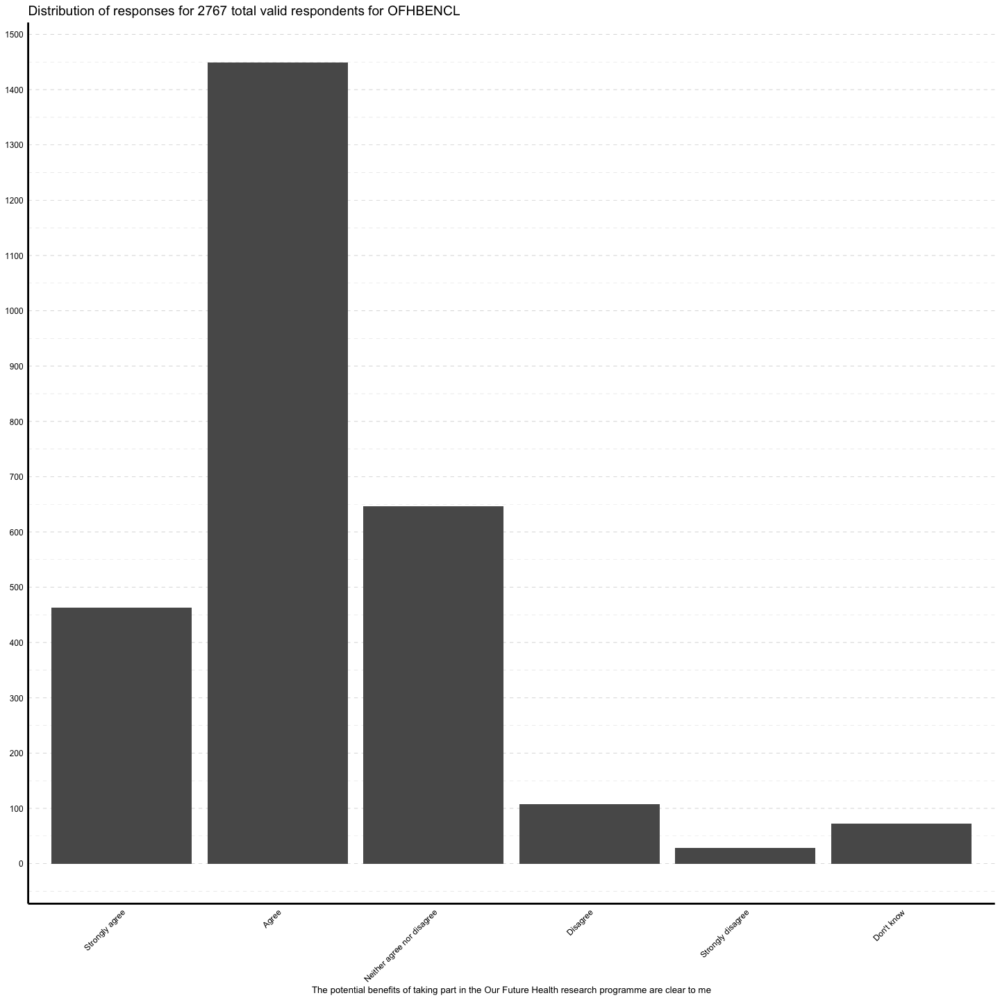<!-- -->

```
Frequencies  
OFHBEN_9  
Label: OFH will... help representation of people like me  
Type: Factor  

                                   Freq   % Valid   % Valid Cum.   % Total   % Total Cum.
-------------------------------- ------ --------- -------------- --------- --------------
                  Strongly agree    476     17.20          17.20     17.20          17.20
                           Agree   1271     45.93          63.14     45.93          63.14
      Neither agree nor disagree    728     26.31          89.45     26.31          89.45
                        Disagree    114      4.12          93.57      4.12          93.57
               Strongly disagree     62      2.24          95.81      2.24          95.81
                      Don't know    116      4.19         100.00      4.19         100.00
                            <NA>      0                               0.00         100.00
                           Total   2767    100.00         100.00    100.00         100.00
```

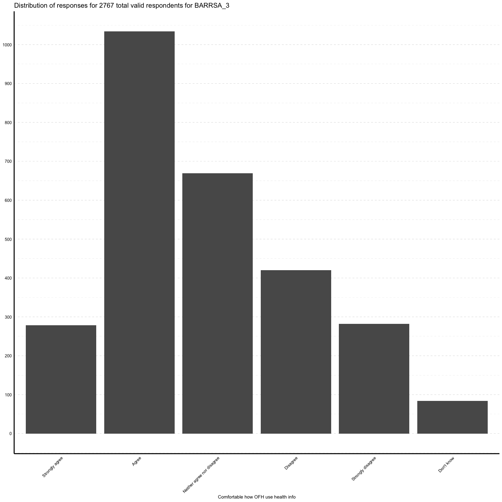<!-- -->

```
Frequencies  
OFHBENCL  
Label: The potential benefits of taking part in the Our Future Health research programme are clear to me  
Type: Factor  

                                   Freq   % Valid   % Valid Cum.   % Total   % Total Cum.
-------------------------------- ------ --------- -------------- --------- --------------
                  Strongly agree    463     16.73          16.73     16.73          16.73
                           Agree   1449     52.37          69.10     52.37          69.10
      Neither agree nor disagree    647     23.38          92.48     23.38          92.48
                        Disagree    107      3.87          96.35      3.87          96.35
               Strongly disagree     28      1.01          97.36      1.01          97.36
                      Don't know     73      2.64         100.00      2.64         100.00
                            <NA>      0                               0.00         100.00
                           Total   2767    100.00         100.00    100.00         100.00
```

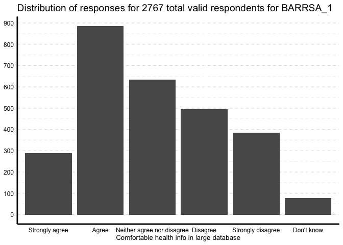<!-- -->

```
Frequencies  
BARRSA_1  
Label: Comfortable health info in large database  
Type: Factor  

                                   Freq   % Valid   % Valid Cum.   % Total   % Total Cum.
-------------------------------- ------ --------- -------------- --------- --------------
                  Strongly agree    288     10.41          10.41     10.41          10.41
                           Agree    886     32.02          42.43     32.02          42.43
      Neither agree nor disagree    635     22.95          65.38     22.95          65.38
                        Disagree    496     17.93          83.30     17.93          83.30
               Strongly disagree    384     13.88          97.18     13.88          97.18
                      Don't know     78      2.82         100.00      2.82         100.00
                            <NA>      0                               0.00         100.00
                           Total   2767    100.00         100.00    100.00         100.00
```

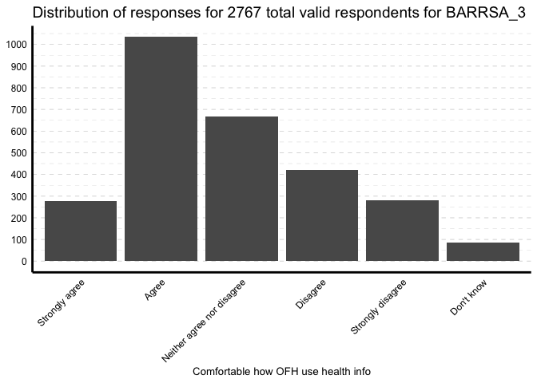<!-- -->

```
Frequencies  
BARRSA_2  
Label: Comfortable share health info with OFH  
Type: Factor  

                                   Freq   % Valid   % Valid Cum.   % Total   % Total Cum.
-------------------------------- ------ --------- -------------- --------- --------------
                  Strongly agree    294     10.63          10.63     10.63          10.63
                           Agree   1033     37.33          47.96     37.33          47.96
      Neither agree nor disagree    632     22.84          70.80     22.84          70.80
                        Disagree    427     15.43          86.23     15.43          86.23
               Strongly disagree    319     11.53          97.76     11.53          97.76
                      Don't know     62      2.24         100.00      2.24         100.00
                            <NA>      0                               0.00         100.00
                           Total   2767    100.00         100.00    100.00         100.00
```

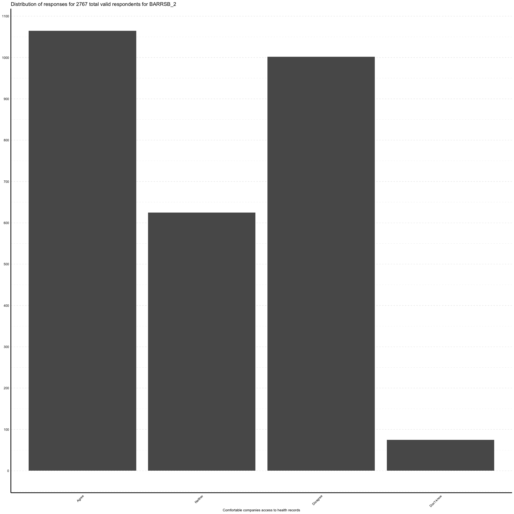<!-- -->

```
Frequencies  
BARRSA_3  
Label: Comfortable how OFH use health info  
Type: Factor  

                                   Freq   % Valid   % Valid Cum.   % Total   % Total Cum.
-------------------------------- ------ --------- -------------- --------- --------------
                  Strongly agree    278     10.05          10.05     10.05          10.05
                           Agree   1034     37.37          47.42     37.37          47.42
      Neither agree nor disagree    669     24.18          71.59     24.18          71.59
                        Disagree    420     15.18          86.77     15.18          86.77
               Strongly disagree    282     10.19          96.96     10.19          96.96
                      Don't know     84      3.04         100.00      3.04         100.00
                            <NA>      0                               0.00         100.00
                           Total   2767    100.00         100.00    100.00         100.00
```

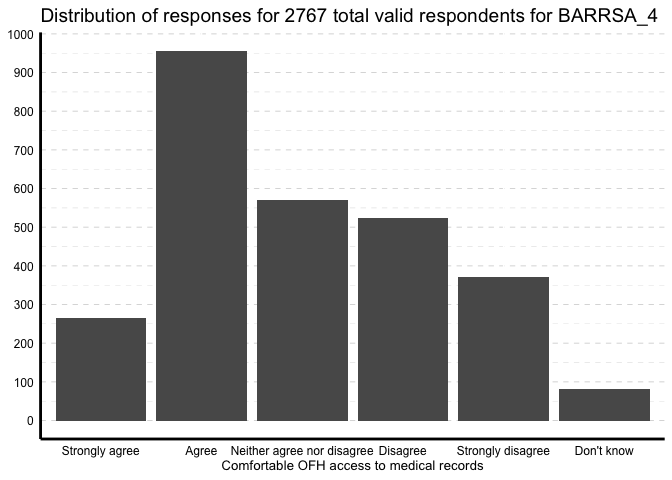<!-- -->

```
Frequencies  
BARRSA_4  
Label: Comfortable OFH access to medical records  
Type: Factor  

                                   Freq   % Valid   % Valid Cum.   % Total   % Total Cum.
-------------------------------- ------ --------- -------------- --------- --------------
                  Strongly agree    266      9.61           9.61      9.61           9.61
                           Agree    956     34.55          44.16     34.55          44.16
      Neither agree nor disagree    571     20.64          64.80     20.64          64.80
                        Disagree    523     18.90          83.70     18.90          83.70
               Strongly disagree    370     13.37          97.07     13.37          97.07
                      Don't know     81      2.93         100.00      2.93         100.00
                            <NA>      0                               0.00         100.00
                           Total   2767    100.00         100.00    100.00         100.00
```

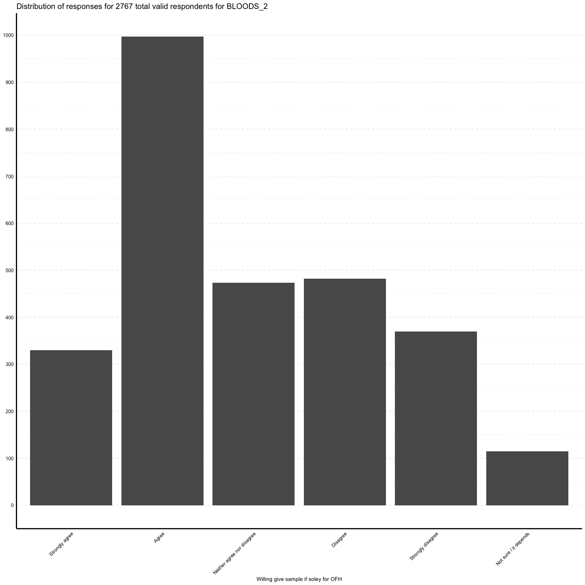<!-- -->

```
Frequencies  
BARRSB_1  
Label: Comfortable academics access to health records  
Type: Factor  

                                   Freq   % Valid   % Valid Cum.   % Total   % Total Cum.
-------------------------------- ------ --------- -------------- --------- --------------
                  Strongly agree    319     11.53          11.53     11.53          11.53
                           Agree   1081     39.07          50.60     39.07          50.60
      Neither agree nor disagree    556     20.09          70.69     20.09          70.69
                        Disagree    447     16.15          86.84     16.15          86.84
               Strongly disagree    292     10.55          97.40     10.55          97.40
                      Don't know     72      2.60         100.00      2.60         100.00
                            <NA>      0                               0.00         100.00
                           Total   2767    100.00         100.00    100.00         100.00
```

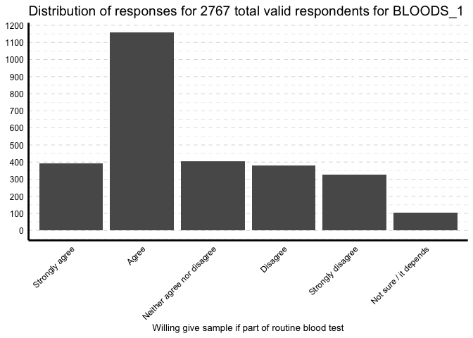<!-- -->

```
Frequencies  
BARRSB_2  
Label: Comfortable companies access to health records  
Type: Factor  

                                   Freq   % Valid   % Valid Cum.   % Total   % Total Cum.
-------------------------------- ------ --------- -------------- --------- --------------
                  Strongly agree    231      8.35           8.35      8.35           8.35
                           Agree    834     30.14          38.49     30.14          38.49
      Neither agree nor disagree    625     22.59          61.08     22.59          61.08
                        Disagree    577     20.85          81.93     20.85          81.93
               Strongly disagree    425     15.36          97.29     15.36          97.29
                      Don't know     75      2.71         100.00      2.71         100.00
                            <NA>      0                               0.00         100.00
                           Total   2767    100.00         100.00    100.00         100.00
```

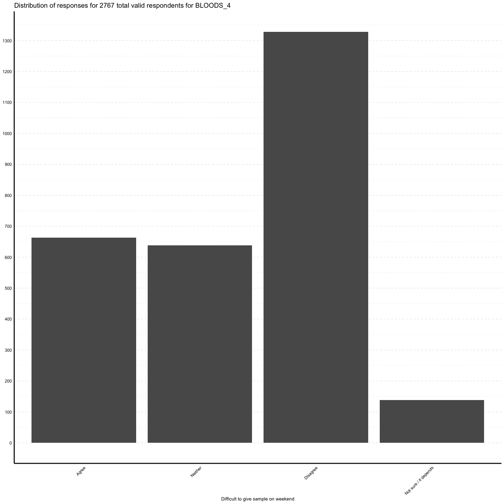<!-- -->

```
Frequencies  
BLOODS_1  
Label: Willing give sample if part of routine blood test  
Type: Factor  

                                   Freq   % Valid   % Valid Cum.   % Total   % Total Cum.
-------------------------------- ------ --------- -------------- --------- --------------
                  Strongly agree    391     14.13          14.13     14.13          14.13
                           Agree   1157     41.81          55.95     41.81          55.95
      Neither agree nor disagree    406     14.67          70.62     14.67          70.62
                        Disagree    380     13.73          84.35     13.73          84.35
               Strongly disagree    327     11.82          96.17     11.82          96.17
           Not sure / it depends    106      3.83         100.00      3.83         100.00
                            <NA>      0                               0.00         100.00
                           Total   2767    100.00         100.00    100.00         100.00
```

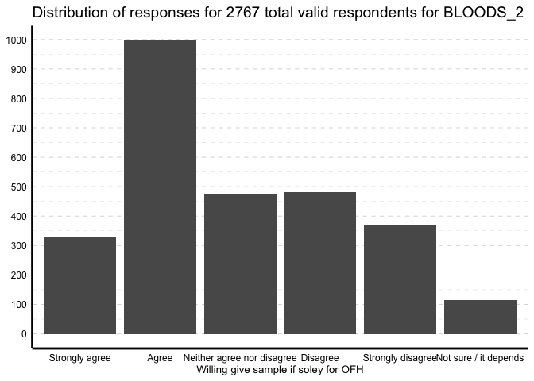<!-- -->

```
Frequencies  
BLOODS_2  
Label: Willing give sample if soley for OFH  
Type: Factor  

                                   Freq   % Valid   % Valid Cum.   % Total   % Total Cum.
-------------------------------- ------ --------- -------------- --------- --------------
                  Strongly agree    330     11.93          11.93     11.93          11.93
                           Agree    997     36.03          47.96     36.03          47.96
      Neither agree nor disagree    473     17.09          65.05     17.09          65.05
                        Disagree    482     17.42          82.47     17.42          82.47
               Strongly disagree    370     13.37          95.84     13.37          95.84
           Not sure / it depends    115      4.16         100.00      4.16         100.00
                            <NA>      0                               0.00         100.00
                           Total   2767    100.00         100.00    100.00         100.00
```

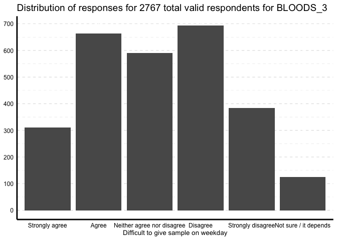<!-- -->

```
Frequencies  
BLOODS_3  
Label: Difficult to give sample on weekday  
Type: Factor  

                                   Freq   % Valid   % Valid Cum.   % Total   % Total Cum.
-------------------------------- ------ --------- -------------- --------- --------------
                  Strongly agree    310     11.20          11.20     11.20          11.20
                           Agree    664     24.00          35.20     24.00          35.20
      Neither agree nor disagree    590     21.32          56.52     21.32          56.52
                        Disagree    694     25.08          81.60     25.08          81.60
               Strongly disagree    384     13.88          95.48     13.88          95.48
           Not sure / it depends    125      4.52         100.00      4.52         100.00
                            <NA>      0                               0.00         100.00
                           Total   2767    100.00         100.00    100.00         100.00
```

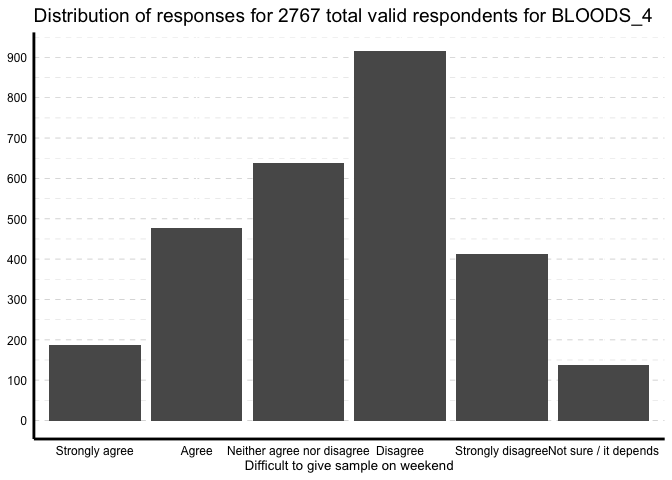<!-- -->

```
Frequencies  
BLOODS_4  
Label: Difficult to give sample on weekend  
Type: Factor  

                                   Freq   % Valid   % Valid Cum.   % Total   % Total Cum.
-------------------------------- ------ --------- -------------- --------- --------------
                  Strongly agree    187      6.76           6.76      6.76           6.76
                           Agree    476     17.20          23.96     17.20          23.96
      Neither agree nor disagree    638     23.06          47.02     23.06          47.02
                        Disagree    916     33.10          80.12     33.10          80.12
               Strongly disagree    412     14.89          95.01     14.89          95.01
           Not sure / it depends    138      4.99         100.00      4.99         100.00
                            <NA>      0                               0.00         100.00
                           Total   2767    100.00         100.00    100.00         100.00
```

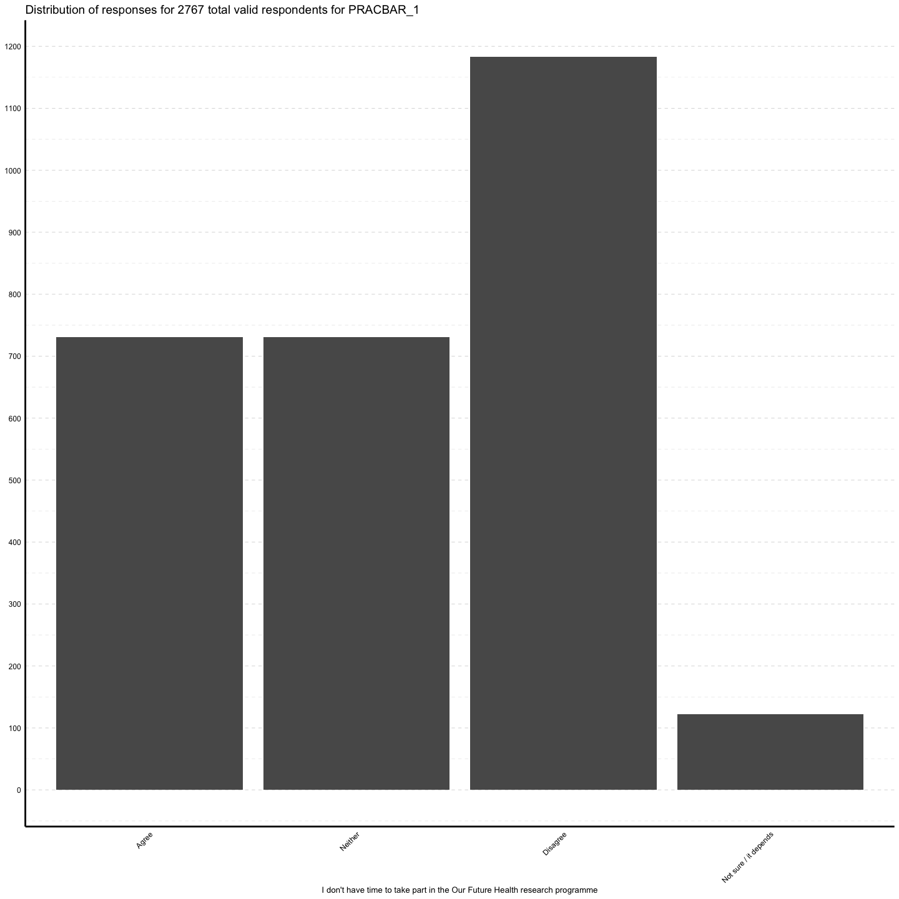<!-- -->

```
Frequencies  
BLOODS_5  
Label: The thought of providing a blood sample makes me anxious  
Type: Factor  

                                   Freq   % Valid   % Valid Cum.   % Total   % Total Cum.
-------------------------------- ------ --------- -------------- --------- --------------
                  Strongly agree    251      9.07           9.07      9.07           9.07
                           Agree    514     18.58          27.65     18.58          27.65
      Neither agree nor disagree    490     17.71          45.36     17.71          45.36
                        Disagree    800     28.91          74.27     28.91          74.27
               Strongly disagree    658     23.78          98.05     23.78          98.05
           Not sure / it depends     54      1.95         100.00      1.95         100.00
                            <NA>      0                               0.00         100.00
                           Total   2767    100.00         100.00    100.00         100.00
```

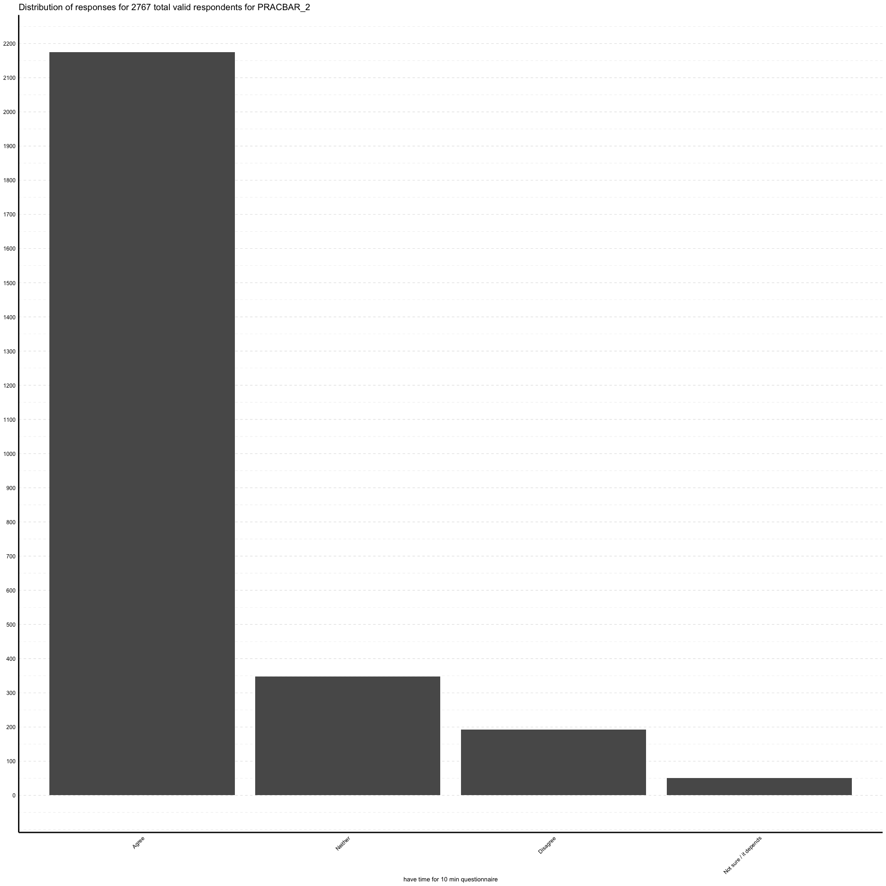<!-- -->

```
Frequencies  
BLOODS_6  
Label: I have a fear of needles  
Type: Factor  

                                   Freq   % Valid   % Valid Cum.   % Total   % Total Cum.
-------------------------------- ------ --------- -------------- --------- --------------
                  Strongly agree    223      8.06           8.06      8.06           8.06
                           Agree    344     12.43          20.49     12.43          20.49
      Neither agree nor disagree    350     12.65          33.14     12.65          33.14
                        Disagree    964     34.84          67.98     34.84          67.98
               Strongly disagree    848     30.65          98.63     30.65          98.63
           Not sure / it depends     38      1.37         100.00      1.37         100.00
                            <NA>      0                               0.00         100.00
                           Total   2767    100.00         100.00    100.00         100.00
```

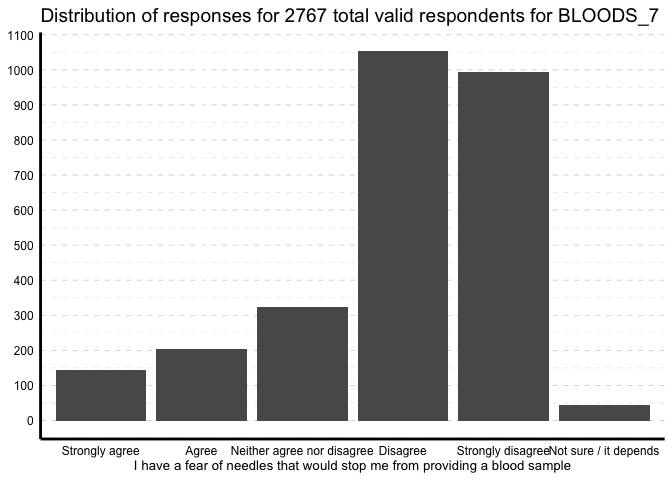<!-- -->

```
Frequencies  
BLOODS_7  
Label: I have a fear of needles that would stop me from providing a blood sample  
Type: Factor  

                                   Freq   % Valid   % Valid Cum.   % Total   % Total Cum.
-------------------------------- ------ --------- -------------- --------- --------------
                  Strongly agree    145      5.24           5.24      5.24           5.24
                           Agree    204      7.37          12.61      7.37          12.61
      Neither agree nor disagree    325     11.75          24.36     11.75          24.36
                        Disagree   1054     38.09          62.45     38.09          62.45
               Strongly disagree    994     35.92          98.37     35.92          98.37
           Not sure / it depends     45      1.63         100.00      1.63         100.00
                            <NA>      0                               0.00         100.00
                           Total   2767    100.00         100.00    100.00         100.00
```

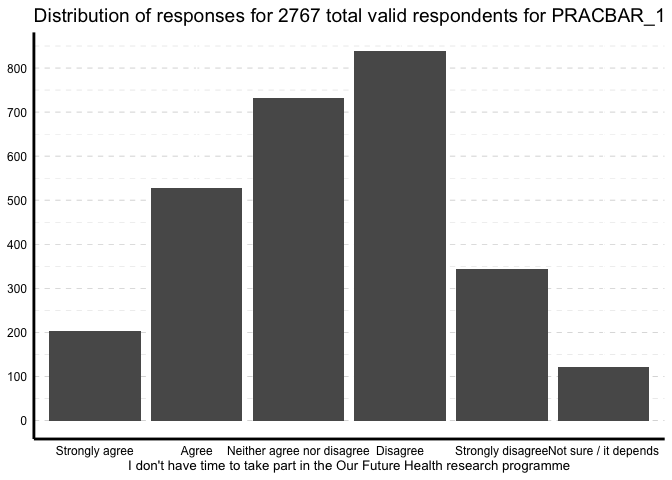<!-- -->

```
Frequencies  
PRACBAR_1  
Label: I don't have time to take part in the Our Future Health research programme  
Type: Factor  

                                   Freq   % Valid   % Valid Cum.   % Total   % Total Cum.
-------------------------------- ------ --------- -------------- --------- --------------
                  Strongly agree    203      7.34           7.34      7.34           7.34
                           Agree    528     19.08          26.42     19.08          26.42
      Neither agree nor disagree    731     26.42          52.84     26.42          52.84
                        Disagree    839     30.32          83.16     30.32          83.16
               Strongly disagree    344     12.43          95.59     12.43          95.59
           Not sure / it depends    122      4.41         100.00      4.41         100.00
                            <NA>      0                               0.00         100.00
                           Total   2767    100.00         100.00    100.00         100.00
```

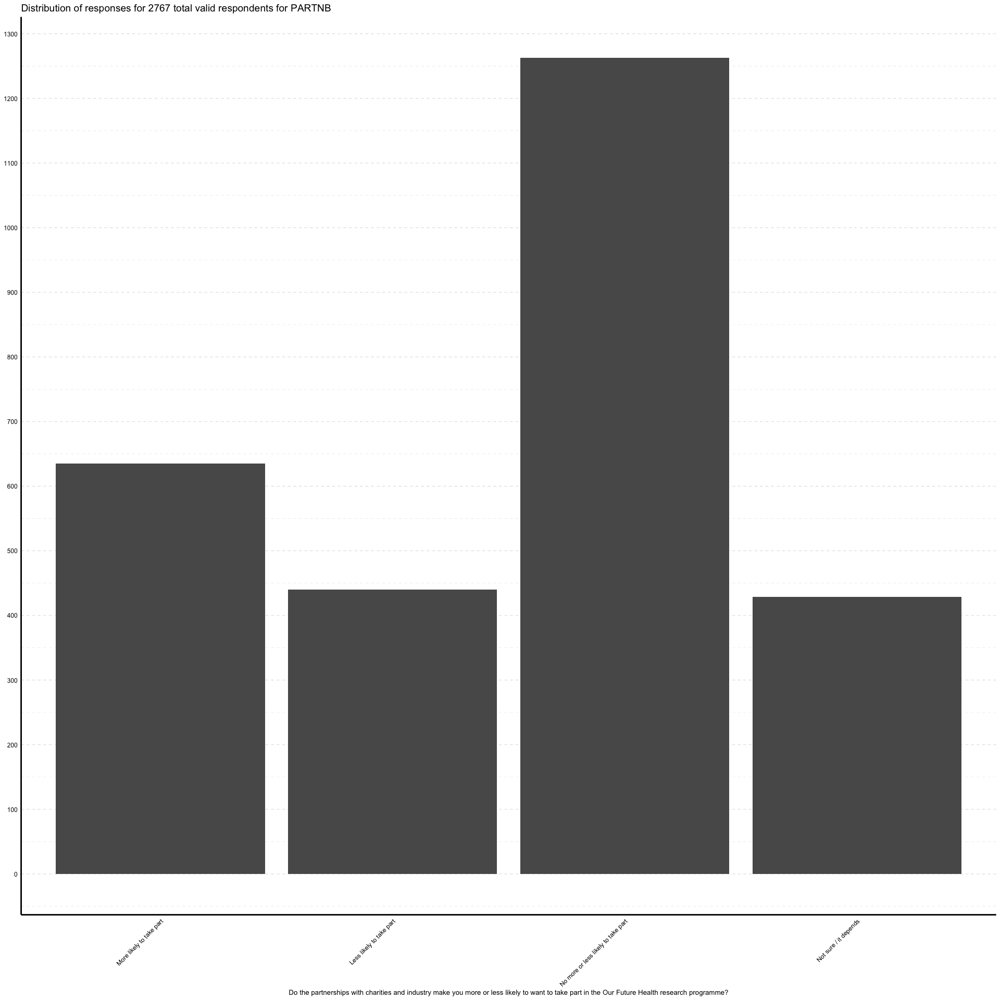<!-- -->

```
Frequencies  
PRACBAR_2  
Label: have time for 10 min questionnaire  
Type: Factor  

                                   Freq   % Valid   % Valid Cum.   % Total   % Total Cum.
-------------------------------- ------ --------- -------------- --------- --------------
                  Strongly agree    582     21.03          21.03     21.03          21.03
                           Agree   1593     57.57          78.60     57.57          78.60
      Neither agree nor disagree    348     12.58          91.18     12.58          91.18
                        Disagree    111      4.01          95.19      4.01          95.19
               Strongly disagree     82      2.96          98.16      2.96          98.16
           Not sure / it depends     51      1.84         100.00      1.84         100.00
                            <NA>      0                               0.00         100.00
                           Total   2767    100.00         100.00    100.00         100.00
```

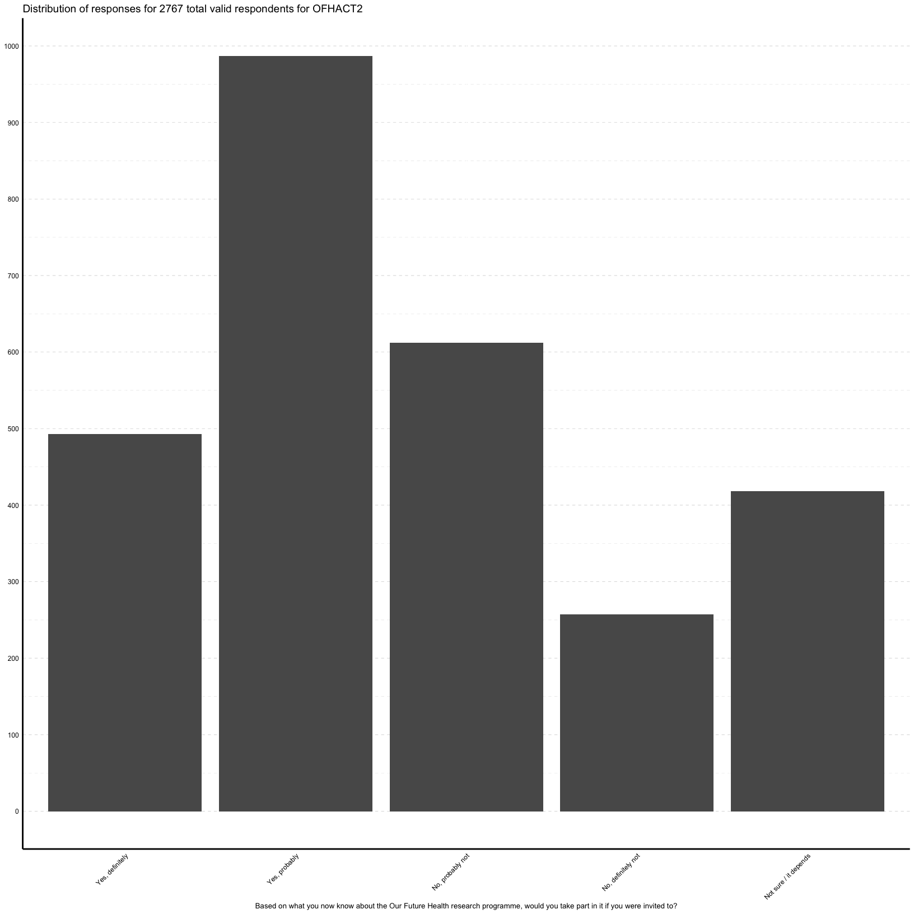<!-- -->

```
Frequencies  
PRACBAR_3  
Label: have time for 30 min questionnaire  
Type: Factor  

                                   Freq   % Valid   % Valid Cum.   % Total   % Total Cum.
-------------------------------- ------ --------- -------------- --------- --------------
                  Strongly agree    356     12.87          12.87     12.87          12.87
                           Agree   1122     40.55          53.42     40.55          53.42
      Neither agree nor disagree    587     21.21          74.63     21.21          74.63
                        Disagree    483     17.46          92.09     17.46          92.09
               Strongly disagree    138      4.99          97.07      4.99          97.07
           Not sure / it depends     81      2.93         100.00      2.93         100.00
                            <NA>      0                               0.00         100.00
                           Total   2767    100.00         100.00    100.00         100.00
```

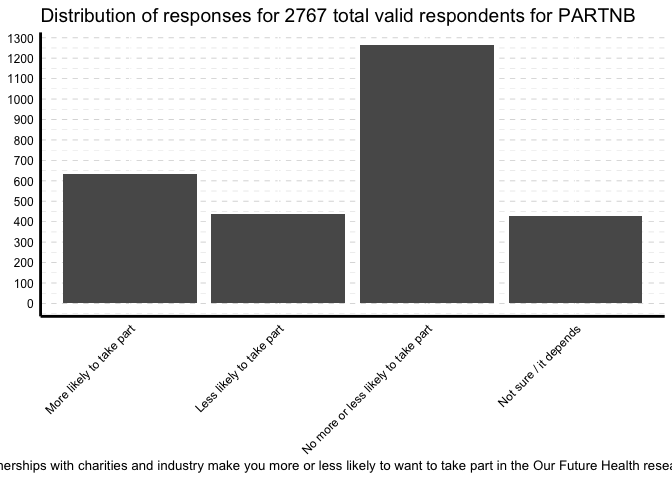<!-- -->

```
Frequencies  
PARTNA  
Label: Partnerships with charities and industry will improve the Our Future Health research programme  
Type: Factor  

                                   Freq   % Valid   % Valid Cum.   % Total   % Total Cum.
-------------------------------- ------ --------- -------------- --------- --------------
                  Strongly agree    402     14.53          14.53     14.53          14.53
                           Agree   1317     47.60          62.13     47.60          62.13
      Neither agree nor disagree    781     28.23          90.35     28.23          90.35
                        Disagree     89      3.22          93.57      3.22          93.57
               Strongly disagree     35      1.26          94.83      1.26          94.83
           Not sure / it depends    143      5.17         100.00      5.17         100.00
                            <NA>      0                               0.00         100.00
                           Total   2767    100.00         100.00    100.00         100.00
```

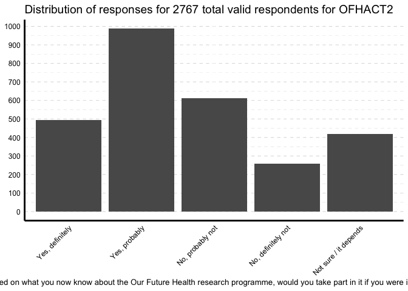<!-- -->

```
Frequencies  
PARTNB  
Label: Do the partnerships with charities and industry make you more or less likely to want to take part in the Our Future Health research programme?  
Type: Factor  

                                            Freq   % Valid   % Valid Cum.   % Total   % Total Cum.
----------------------------------------- ------ --------- -------------- --------- --------------
                 More likely to take part    635     22.95          22.95     22.95          22.95
                 Less likely to take part    440     15.90          38.85     15.90          38.85
      No more or less likely to take part   1263     45.65          84.50     45.65          84.50
                    Not sure / it depends    429     15.50         100.00     15.50         100.00
                                     <NA>      0                               0.00         100.00
                                    Total   2767    100.00         100.00    100.00         100.00
```

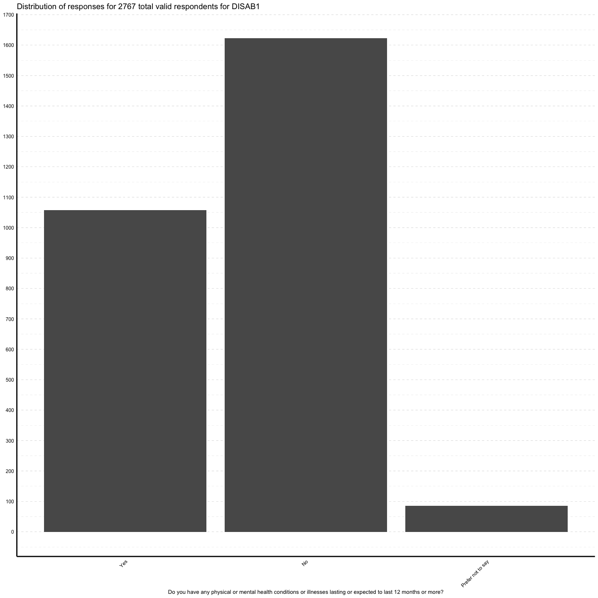<!-- -->

```
Frequencies  
OFHACT2  
Label: Based on what you now know about the Our Future Health research programme, would you take part in it if you were invited to?  
Type: Factor  

                              Freq   % Valid   % Valid Cum.   % Total   % Total Cum.
--------------------------- ------ --------- -------------- --------- --------------
            Yes, definitely    493     17.82          17.82     17.82          17.82
              Yes, probably    987     35.67          53.49     35.67          53.49
           No, probably not    612     22.12          75.61     22.12          75.61
         No, definitely not    257      9.29          84.89      9.29          84.89
      Not sure / it depends    418     15.11         100.00     15.11         100.00
                       <NA>      0                               0.00         100.00
                      Total   2767    100.00         100.00    100.00         100.00
```

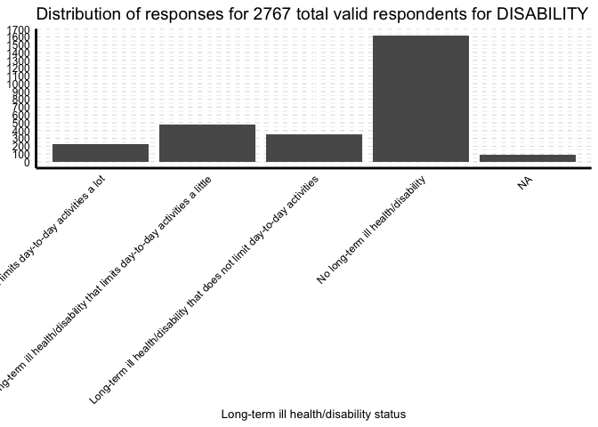<!-- -->

```
Frequencies  
RECONTACT  
Label: Recontact for future qualitative research  
Type: Factor  

              Freq   % Valid   % Valid Cum.   % Total   % Total Cum.
----------- ------ --------- -------------- --------- --------------
        Yes   2152    77.802         77.802    77.774         77.774
         No    614    22.198        100.000    22.190         99.964
       <NA>      1                              0.036        100.000
      Total   2767   100.000        100.000   100.000        100.000
```

# Analyses
## recode variables

recode dont know, prefer not to say and and missing response as NA (missing data) in the analytic data set. 

Retain dont know and prefer not to say in factor df for summaries. 

Capture a list of variable labels as these get lost in the NA process


```r
label_list <- dput(sapply(factor_df,label))
```

first remove missing data and set to NA in the factor dataset


```r
factor_df <- factor_df %>%
  mutate(across(where(is.factor), 
                ~as.factor(case_when(. =="Missing reponse" ~ NA_character_, 
                                     TRUE ~ as.character(.)))))
```


then change all (dont know, prefer not to say, missing) to NA for the analytic data set


```r
regression_df <- factor_df %>%
  mutate(across(where(is.factor), 
                ~as.factor(case_when(. =="Don't know" ~ NA_character_,
                                     . =="Prefer not to say" ~ NA_character_,
                                     TRUE ~ as.character(.)))))
```

add labels back to data set


```r
label(factor_df) = as.list(label_list[match(names(factor_df), names(label_list))])
label(regression_df) = as.list(label_list[match(names(regression_df), names(label_list))])
```


## univariable regressions 
Replicate Alice's regressions. identify which demographic features are important to use as covariates in multivariable regressions. 

(note, will use multinomial regression for the three outcome variables where we predict unsure alongside yes and no)


## multivariable regressions

